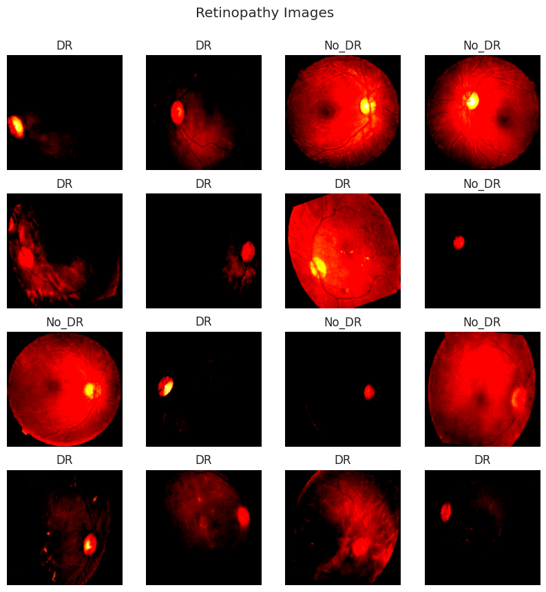
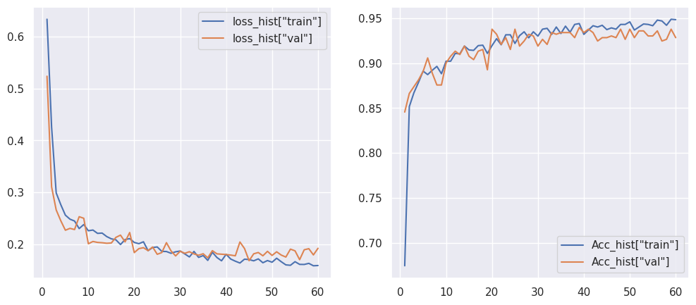

# 01Diagnosis_of_Diabetic_Retinopathy_By_CNN(PyTorch)

##  0. Convolutional Neural Network for Diabetic Retinopathy Detection (Pytorch)

```python
# 导入基本的Python库
import pandas as pd  # pandas是一个数据分析和操作库，常用于处理结构化数据如表格。
import matplotlib.pyplot as plt  # matplotlib是一个绘图库，用于创建静态、交互式和动画图形。
import seaborn as sns  # seaborn是数据可视化库，基于matplotlib，提供更高级的接口。
sns.set(style='darkgrid')  # 设置seaborn的绘图风格为'darkgrid'，即暗色背景的网格风格。
import copy  # copy库用于复制对象。
import os  # os库提供了与操作系统交互的功能，如文件和目录操作。
import torch  # torch是PyTorch框架，用于机器学习和深度学习，特别是张量计算和神经网络。
from PIL import Image  # 从PIL库导入Image模块，用于图像处理。
from torch.utils.data import Dataset  # 导入PyTorch的Dataset类，用于定义数据集。
import torchvision  # torchvision是PyTorch的视觉库，包含处理图像和视频的常用工具。
import torchvision.transforms as transforms  # 导入torchvision的transforms模块，用于对图像进行预处理。
from torch.optim.lr_scheduler import ReduceLROnPlateau  # 导入ReduceLROnPlateau类，用于学习率调度。
import torch.nn as nn  # 导入PyTorch的神经网络模块。
from torchvision import utils  # 导入torchvision的工具模块。
from torchvision.datasets import ImageFolder  # 导入ImageFolder类，用于加载文件夹结构的图像数据集。
from torchsummary import summary  # 导入summary函数，用于打印模型的摘要信息。
import torch.nn.functional as F  # 导入PyTorch的functional模块，包含一些常用的函数。
from sklearn.metrics import classification_report  # 导入分类报告，用于评估分类模型的性能。
import itertools  # itertools提供迭代器工具，用于创建复杂的迭代器。
from tqdm.notebook import trange, tqdm  # 导入tqdm库的notebook版本，用于显示进度条。
from torch import optim  # 导入PyTorch的优化器模块。
import warnings  # 导入Python的警告模块。
warnings.filterwarnings('ignore')  # 设置忽略所有警告信息。
```


下面这段代码主要是用于自定义Jupyter Notebook界面的样式，通过CSS样式表来改变Jupyter Notebook的背景色、字体颜色等。下面是对每行代码的详细中文注释：

```python
from IPython.core.display import display, HTML, Javascript

# 定义颜色映射列表，包含两种颜色的十六进制表示。
color_map = ['#FFFFFF','#FF5733']

# 从color_map中获取颜色，用作不同的样式设置。
prompt = color_map[-1]  # 获取列表中最后一个颜色，用作提示色。
main_color = color_map[0]  # 获取列表中第一个颜色，用作主色调。
strong_main_color = color_map[1]  # 获取列表中第二个颜色，用作强调色。
custom_colors = [strong_main_color, main_color]  # 创建自定义颜色列表。

# 定义CSS样式字符串，用于设置Jupyter Notebook的样式。
css_file = '''
div #notebook {
background-color: white;
line-height: 20px;
}

#notebook-container {
%s  # 这里将插入宽度属性
margin-top: 2em;
padding-top: 2em;
border-top: 4px solid %s;  # 这里将插入主色调的边框色
-webkit-box-shadow: 0px 0px 8px 2px rgba(224, 212, 226, 0.5);
    box-shadow: 0px 0px 8px 2px rgba(224, 212, 226, 0.5);
}

div .input {
margin-bottom: 1em;
}

.rendered_html h1, .rendered_html h2, .rendered_html h3, .rendered_html h4, .rendered_html h5, .rendered_html h6 {
color: %s;  # 这里将插入标题颜色
font-weight: 600;
}

div.input_area {
border: none;
    background-color: %s;  # 输入区域的背景色
    border-top: 2px solid %s;  # 输入区域顶部的边框色
}

div.input_prompt {
color: %s;  # 输入提示符的颜色
}

div.output_prompt {
color: %s;  # 输出提示符的颜色
}

div.cell.selected:before, div.cell.selected.jupyter-soft-selected:before {
background: %s;  # 选中的单元格前的背景色
}

div.cell.selected, div.cell.selected.jupyter-soft-selected {
    border-color: %s;  # 选中的单元格的边框色
}

.edit_mode div.cell.selected:before {
background: %s;  # 编辑模式下选中的单元格前的背景色
}

.edit_mode div.cell.selected {
border-color: %s;  # 编辑模式下选中的单元格的边框色
}
'''

# 定义一个函数，将十六进制颜色转换为RGB格式的元组。
def to_rgb(h): 
    return tuple(int(h[i:i+2], 16) for i in [0, 2, 4])

# 将主色调转换为带有透明度的RGBA格式。
main_color_rgba = 'rgba(%s, %s, %s, 0.1)' % to_rgb(main_color[1:])

# 将自定义的CSS样式写入到名为notebook.css的文件中。
open('notebook.css', 'w').write(css_file % ('width: 95%;', main_color, main_color, main_color_rgba, 
                                            main_color,  main_color, prompt, main_color, main_color, 
                                            main_color, main_color))

# 定义一个函数，用于将CSS样式应用到Jupyter Notebook中。
def nb(): 
    # 使用HTML函数加载notebook.css文件中的样式。
    return HTML("<style>" + open("notebook.css", "r").read() + "</style>")

# 调用nb函数，并将结果输出到Notebook中，应用自定义样式。
nb()
```

这段代码通过定义CSS样式并将其写入到一个CSS文件中，然后通过Jupyter Notebook的HTML展示功能将样式应用到当前的Notebook界面上。这样可以实现对Notebook界面的个性化定制。


## 1 | Introduction
### 1.1 | Why do we need this study?

The prevalence of diabetic retinopathy is alarmingly high, affecting a significant proportion of individuals with long-standing diabetes. Early detection and timely treatment are crucial for preventing vision loss and improving patient outcomes. However, manual interpretation of retinal images for diabetic retinopathy screening can be time-consuming and subject to human error. Therefore, there is a pressing need for an automated and accurate tool that can assist healthcare professionals in grading the severity of diabetic retinopathy.

### 1.2 | Problem Statement

The existing methods for detecting and grading Diabetic Retinopathy often rely on subjective assessments and extensive manual labor, leading to inefficiencies and potential inconsistencies in diagnosis. Moreover, the increasing prevalence of diabetes and the limited availability of ophthalmologists further exacerbate the challenges in timely screening and diagnosis. Therefore, there is a need to develop a robust and reliable automated system that can accurately detect and grade diabetic retinopathy, enabling early intervention and personalized treatment plans.

### 1.3 | Study Aim

This project aims to employ Convolutional Neural Networks (CNNs) for diabetic retinopathy detection using PyTorch, a popular deep learning framework. By leveraging the power of Deep Learning Algorithms, we aim to develop a model that can analyze retinal images and accurately classify them based on the severity of Diabetic Retinopathy. This study seeks to provide an automated and efficient solution to assist healthcare professionals in diagnosing and grading diabetic retinopathy, ultimately improving patient care and reducing the risk of vision loss.

## 2 | Dataset
Data Description : This dataset consists of a large collection of high-resolution retinal images captured under various imaging conditions. A medical professional has assessed the presence of Diabetic Retinopathy in each image and assigned a rating on a scale ranging between 0 and 1, which corresponds to the following categories:

* Diabetic Retinopathy ---> 0
* No Diabetic Retinopathy ---> 1
## 3 | Data Preparation 
### 定义用于数据增强的transform
下面这段代码使用了PyTorch的`torchvision.transforms`模块来定义一组图像转换操作，这些操作通常用于数据增强，以提高深度学习模型的泛化能力。下面是对每行代码的详细中文注释：

```python
# 导入transforms模块，它是torchvision的一部分，用于对图像进行预处理和数据增强。
from torchvision import transforms

# 使用transforms.Compose创建一个变换的组合，这些变换将按顺序应用于图像。
transform = transforms.Compose(
    [
        # transforms.Resize定义了一个将图像大小调整为(255,255)像素的变换。
        transforms.Resize((255, 255)),
        
        # transforms.RandomHorizontalFlip定义了一个随机水平翻转图像的变换，参数p=0.5表示翻转的概率为50%。
        transforms.RandomHorizontalFlip(p=0.5),
        
        # transforms.RandomVerticalFlip定义了一个随机垂直翻转图像的变换，参数p=0.5表示翻转的概率为50%。
        transforms.RandomVerticalFlip(p=0.5),
        
        # transforms.RandomRotation定义了一个随机旋转图像的变换，参数30表示旋转的角度限制在-30到30度之间。
        transforms.RandomRotation(30),
        
        # transforms.ToTensor将PIL图像或NumPy `ndarray`转换为`FloatTensor`，并将图像的像素值从[0, 255]归一化到[0.0, 1.0]。
        transforms.ToTensor(),
        
        # transforms.Normalize对图像的每个通道进行标准化，给定的均值(mean)和标准差(std)用于标准化过程。
        # 这些值通常是ImageNet数据集的均值和标准差。
        transforms.Normalize(mean=[0.485, 0.456, 0.406], std=[0.229, 0.224, 0.225])
    ]
)
```

通过上述代码，我们定义了一个名为`transform`的变换序列，它将首先调整图像大小，然后以一定的概率进行随机翻转和旋转，接着将图像转换为张量，并进行标准化处理。这些步骤通常用于深度学习模型训练之前的数据预处理阶段，以增强模型对输入数据的鲁棒性。


### 加载和处理图像数据集
下面这段代码使用了PyTorch的`torchvision.datasets.ImageFolder`类来加载和处理图像数据集，通常用于计算机视觉任务。以下是对每行代码的详细中文注释：

```python
# 导入torchvision的datasets模块，它包含了用于加载和处理多种标准数据集的类。
import torchvision

# torchvision.transforms.Compose在之前已经定义，包含了一系列的图像预处理操作。

# 使用torchvision.datasets.ImageFolder创建训练数据集对象。
# ImageFolder类是用于从文件夹中加载数据集的类，它期望每个类别的图像存放在以类名命名的子文件夹中。
# "/kaggle/input/diagnosis-of-diabetic-retinopathy/train"是训练数据集存放的路径。
# transform=transform将之前定义的transform变换序列应用于训练数据集中的每个图像。
train_set = torchvision.datasets.ImageFolder("/kaggle/input/diagnosis-of-diabetic-retinopathy/train", transform=transform)

# 访问并打印训练数据集对象的transform属性，该属性包含了将应用于数据集中每个图像的变换序列。
train_set.transform

# 使用torchvision.datasets.ImageFolder创建验证数据集对象，参数与训练数据集类似，但路径指向验证数据集。
val_set = torchvision.datasets.ImageFolder("/kaggle/input/diagnosis-of-diabetic-retinopathy/valid", transform=transform)

# 访问并打印验证数据集对象的transform属性。
val_set.transform

# 使用torchvision.datasets.ImageFolder创建测试数据集对象，参数与训练数据集类似，但路径指向测试数据集。
test_set = torchvision.datasets.ImageFolder("/kaggle/input/diagnosis-of-diabetic-retinopathy/test", transform=transform)

# 访问并打印测试数据集对象的transform属性。
test_set.transform
```

通过上述代码，我们定义了三个数据集对象：`train_set`、`val_set`和`test_set`，分别代表训练集、验证集和测试集。每个对象都将之前定义的预处理变换`transform`应用到了其图像上。这使得在模型训练和评估过程中，可以对图像进行统一的预处理操作。


#### 结果输出：


```python
Compose(
    Resize(size=(255, 255), interpolation=bilinear, max_size=None, antialias=warn)
    RandomHorizontalFlip(p=0.5)
    RandomVerticalFlip(p=0.5)
    RandomRotation(degrees=[-30.0, 30.0], interpolation=nearest, expand=False, fill=0)
    ToTensor()
    Normalize(mean=[0.485, 0.456, 0.406], std=[0.229, 0.224, 0.225])
)
```


#### 结果解读：


上述代码的结果描述了一个由`transforms.Compose`创建的图像转换序列对象。这个对象按照定义的顺序执行一系列图像转换操作。下面是对这个转换序列的详细解读：

1. `Resize(size=(255, 255), interpolation=bilinear, max_size=None, antialias=warn)`:
   - 这个转换将图像的大小调整为255x255像素。
   - `interpolation=bilinear`表示使用双线性插值算法进行图像缩放，这是一种平滑插值方法，适用于图像缩放。
   - `max_size=None`表示没有设置图像缩放的最大尺寸限制。
   - `antialias=warn`表示在放大图像时会警告可能存在的抗锯齿问题。

2. `RandomHorizontalFlip(p=0.5)`:
   - 这个转换以50%的概率随机水平翻转图像，`p=0.5`表示翻转概率为0.5。

3. `RandomVerticalFlip(p=0.5)`:
   - 这个转换以50%的概率随机垂直翻转图像，同样地，`p=0.5`表示翻转概率为0.5。

4. `RandomRotation(degrees=[-30.0, 30.0], interpolation=nearest, expand=False, fill=0)`:
   - 这个转换随机旋转图像，旋转的角度在-30到30度之间。
   - `interpolation=nearest`表示使用最近邻插值算法进行旋转，这通常用于像素的最近点取值。
   - `expand=False`表示旋转操作不会改变图像的尺寸，旋转后的空白区域将不会被填充。
   - `fill=0`表示如果`expand=True`，那么旋转后产生的空白区域将用0值填充。

5. `ToTensor()`:
   - 这个转换将PIL图像或NumPy数组转换为PyTorch的张量，同时将图像的像素值从[0, 255]归一化到[0.0, 1.0]。

6. `Normalize(mean=[0.485, 0.456, 0.406], std=[0.229, 0.224, 0.225])`:
   - 这个转换对图像的每个通道进行标准化处理，使用给定的均值和标准差。
   - 均值`mean=[0.485, 0.456, 0.406]`和标准差`std=[0.229, 0.224, 0.225]`通常用于图像数据集的预处理，它们是ImageNet数据集的均值和标准差。

这个转换序列被应用于训练集、验证集和测试集中的每个图像，以实现数据增强和标准化，从而提高深度学习模型的性能和泛化能力。

### 随机选择并可视化
下面这段代码用于从训练数据集中随机选择一些图像，并使用matplotlib库将它们可视化。下面是对每行代码的详细中文注释：

```python
# 导入matplotlib.pyplot模块，用于绘图。
import matplotlib.pyplot as plt
import torch
import numpy as np

# 定义一个标签映射字典，将标签的数字ID映射到对应的疾病名称。
CLA_label = {
    0: 'DR',  # 糖尿病性视网膜病变
    1: 'No_DR',  # 无糖尿病性视网膜病变
}

# 创建一个新的matplotlib图形对象，设置图形的大小为10x10英寸。
figure = plt.figure(figsize=(10, 10))

# 定义要显示的图像列数和行数。
cols, rows = 4, 4

# 循环遍历每个子图，总共cols * rows个。
for i in range(1, cols * rows + 1):
    # 随机选择一个索引，从训练集的样本中。
    sample_idx = torch.randint(len(train_set), size=(1,)).item()
    
    # 根据随机索引获取图像及其对应的标签。
    img, label = train_set[sample_idx]
    
    # 添加一个新的子图到图形中，子图的总数是cols * rows。
    figure.add_subplot(rows, cols, i)
    
    # 设置子图的标题为图像对应的标签名称。
    plt.title(CLA_label[label])
    
    # 关闭子图的坐标轴显示。
    plt.axis("off")
    
    # 将图像数据从PyTorch张量转换为NumPy数组，并进行维度变换。
    img_np = img.numpy().transpose((1, 2, 0))
    
    # 将图像数据的像素值限制在[0, 1]的范围内，确保显示不超出颜色图的范围。
    img_valid_range = np.clip(img_np, 0, 1)
    
    # 在子图上显示图像。
    plt.imshow(img_valid_range)
    
    # 设置图形的主标题为'Retinopathy Images'，并且稍微向上移动一点，y=0.95表示距离图形底部的比例位置。
    plt.suptitle('Retinopathy Images', y=0.95)

# 显示图形，展示所有子图。
plt.show()
```

这段代码首先创建了一个图形对象，然后通过循环随机选择图像，并将它们显示在不同的子图上。每个子图都配有相应的标题，显示图像对应的疾病标签。最后，使用`plt.show()`来展示整个图形。这种方法常用于快速浏览数据集中的图像，以便对数据有一个直观的理解。


#### 结果展示：





## 5 | Creating Dataloaders

### 定义数据加载器
下面这段代码使用了PyTorch的`torch.utils.data.DataLoader`类来创建数据加载器，这些加载器可以在模型训练和评估过程中批量地提供数据。以下是对每行代码的详细中文注释：

```python
# 导入torch.utils.data模块，它包含了用于数据加载和采样的类和函数。
import torch

# 定义一个变量batch_size，用于设置每个批次的样本数量。
batch_size = 64

# 使用DataLoader类创建训练数据的加载器。
# train_set是之前定义的训练数据集对象。
# batch_size=batch_size设置每个批次的样本数量为64。
# shuffle=True表示在每个epoch开始时随机打乱数据集中的样本顺序。
train_loader = torch.utils.data.DataLoader(train_set, batch_size=batch_size, shuffle=True)

# 使用DataLoader类创建验证数据的加载器，参数与训练数据加载器类似。
val_loader = torch.utils.data.DataLoader(val_set, batch_size=batch_size, shuffle=True)

# 使用DataLoader类创建测试数据的加载器，参数与训练数据加载器类似。
test_loader = torch.utils.data.DataLoader(test_set, batch_size=batch_size, shuffle=True)
```

通过上述代码，我们创建了三个数据加载器：`train_loader`、`val_loader`和`test_loader`，分别用于训练集、验证集和测试集。这些加载器将数据集封装成可以在训练和评估过程中迭代的对象。设置`batch_size`为64意味着每次迭代提供64个样本给模型。设置`shuffle=True`可以确保在每个epoch（训练周期）开始时，数据集中的样本顺序都是随机的，这有助于提高模型训练的效果。

### 打印出训练集和验证集数据加载器中单个批次数据的形状和类型
下面这段代码的目的是打印出训练集和验证集数据加载器中单个批次数据的形状和类型。以下是对每行代码的详细中文注释：

```python
# 导入torch模块，这里用于数据迭代。
import torch

# 创建一个字典，其中包含了训练集和验证集的数据加载器。
data_loaders = {'Training data': train_loader, "Validation data": val_loader}

# 遍历data_loaders字典中的项（键和值）。
for key, value in data_loaders.items():
    # 对于每个数据加载器，进行一次迭代以获取一个批次的数据。
    for X, y in value:
        # 打印当前正在处理的数据集名称（训练集或验证集）。
        print(f"{key}:")
        # 打印图像数据张量X的形状，X.shape给出了批次中每个图像的维度信息，通常格式为(batch_size, channels, height, width)。
        print(f"Shape of X : {X.shape}")
        # 打印标签数据y的形状和数据类型，y.shape给出了批次中标签的数量（应与batch_size一致），y.dtype给出了标签的数据类型。
        print(f"Shape of y: {y.shape} {y.dtype}\n")
        # 由于只需要查看一个批次的数据，所以使用break结束当前循环的迭代。
        break
```

这段代码通过两次嵌套循环，首先遍历数据集字典，然后从每个数据加载器中获取单个批次的数据。它打印出图像数据和标签的形状以及标签的数据类型。`break`语句确保了每次循环只处理一个批次的数据，这样可以快速查看数据的形状而不必加载整个数据集。

需要注意的是，这段代码中没有包含测试集数据加载器`test_loader`，如果需要查看测试集数据的形状，可以将`test_loader`添加到`data_loaders`字典中，并重复上述过程。


#### 结果输出：


```python
Training data:
Shape of X : torch.Size([64, 3, 255, 255])
Shape of y: torch.Size([64]) torch.int64

Validation data:
Shape of X : torch.Size([64, 3, 255, 255])
Shape of y: torch.Size([64]) torch.int64
```


#### 结果解读：

上述代码的输出结果提供了训练集和验证集数据加载器中每个批次数据的形状信息。下面是对输出结果的详细解读：

1. **Training data:**
   - `Shape of X : torch.Size([64, 3, 255, 255])`:
     - 这表示训练集中每个批次包含64张图像（batch_size为64）。
     - 每张图像有3个通道，这通常对应于RGB彩色图像。
     - 图像的高度和宽度都是255像素，这与之前定义的transforms.Resize((255,255))一致。
   
   - `Shape of y: torch.Size([64]) torch.int64`:
     - `y`是与图像X相对应的标签，每个批次同样包含64个标签。
     - `torch.Size([64])`表示标签的形状是一个包含64个整数值的一维张量。
     - `torch.int64`表示标签数据的类型是64位整数。

2. **Validation data:**
   - `Shape of X : torch.Size([64, 3, 255, 255])`:
     - 这表示验证集中每个批次同样包含64张图像。
     - 每张图像的通道数和尺寸与训练集相同，即3个通道，255x255像素。
   
   - `Shape of y: torch.Size([64]) torch.int64`:
     - 这表示验证集中的标签数量和类型也与训练集相同，每个批次有64个标签，且都是64位整数。

总结来说，输出结果表明无论是训练集还是验证集，每个批次都包含64张图像，每张图像是3通道的255x255像素的彩色图像，对应的标签是64位整数类型。这些信息对于理解数据加载器的工作方式以及准备和使用数据进行模型训练非常重要。

## 6 | Define Diabetic Retinopathy Classifier

### 
下面这段代码定义了一个函数`findConv2dOutShape`，用于计算给定输入尺寸和卷积层参数的情况下，卷积层输出的尺寸。以下是对每行代码的详细中文注释：

```python
import numpy as np  # 导入numpy库，用于执行数学运算。

# 定义函数findConv2dOutShape，它接受输入的高度hin、宽度win、卷积层对象conv以及可选的池化层尺寸pool。
def findConv2dOutShape(hin, win, conv, pool=2):
    # 从卷积层对象conv中获取卷积核的尺寸。
    kernel_size = conv.kernel_size
    # 获取卷积层的步长。
    stride = conv.stride
    # 获取卷积层的填充。
    padding = conv.padding
    # 获取卷积层的扩张率。
    dilation = conv.dilation

    # 根据卷积层的输入尺寸、卷积核尺寸、步长、填充和扩张率计算输出的高度hout。
    hout = np.floor((hin + 2 * padding[0] - dilation[0] * (kernel_size[0] - 1) - 1) / stride[0] + 1)
    # 根据卷积层的输入尺寸、卷积核尺寸、步长、填充和扩张率计算输出的宽度wout。
    wout = np.floor((win + 2 * padding[1] - dilation[1] * (kernel_size[1] - 1) - 1) / stride[1] + 1)

    # 如果提供了池化层尺寸pool，将计算出的高度和宽度分别除以pool。
    if pool:
        hout /= pool
        wout /= pool

    # 返回计算出的高度和宽度的整数值。
    return int(hout), int(wout)
```

这个函数非常有用，尤其是在设计卷积神经网络时，它可以帮助我们预测卷积操作后的特征图尺寸，这对于确定网络架构和理解不同层之间的相互作用至关重要。函数中的`pool`参数允许我们进一步考虑池化层对输出尺寸的影响，如果池化层存在的话。


### 定义卷积神经网络（CNN）模型架构
下面这段代码定义了一个用于糖尿病视网膜病变诊断的卷积神经网络（CNN）模型架构。以下是对每行代码的详细中文注释：

```python
import torch.nn as nn  # 导入PyTorch的神经网络模块。
import torch.nn.functional as F  # 导入PyTorch的functional模块，用于提供一些常用的函数。

# 定义CNN_Retino类，它继承自torch.nn.Module，用于构建神经网络模型。
class CNN_Retino(nn.Module):

    # 构造函数，接受一个参数params，它是一个包含网络层参数的字典。
    def __init__(self, params):
        super(CNN_Retino, self).__init__()  # 调用基类的构造函数。

        # 从params字典中获取输入层的形状、初始卷积核数量、第一个全连接层的神经元数量、类别数量和dropout比率。
        Cin, Hin, Win = params["shape_in"]
        init_f = params["initial_filters"]
        num_fc1 = params["num_fc1"]
        num_classes = params["num_classes"]
        self.dropout_rate = params["dropout_rate"]

        # 定义CNN的卷积层。
        self.conv1 = nn.Conv2d(Cin, init_f, kernel_size=3)  # 第一个卷积层，使用3x3的卷积核。
        h, w = findConv2dOutShape(Hin, Win, self.conv1)  # 计算第一个卷积层后的输出尺寸。
        self.conv2 = nn.Conv2d(init_f, 2 * init_f, kernel_size=3)  # 第二个卷积层，卷积核数量翻倍。
        h, w = findConv2dOutShape(h, w, self.conv2)  # 计算第二个卷积层后的输出尺寸。
        self.conv3 = nn.Conv2d(2 * init_f, 4 * init_f, kernel_size=3)  # 第三个卷积层，卷积核数量再次翻倍。
        h, w = findConv2dOutShape(h, w, self.conv3)  # 计算第三个卷积层后的输出尺寸。
        self.conv4 = nn.Conv2d(4 * init_f, 8 * init_f, kernel_size=3)  # 第四个卷积层，卷积核数量继续翻倍。

        # 计算全连接层前的展平尺寸。
        self.num_flatten = h * w * 8 * init_f
        # 定义第一个全连接层。
        self.fc1 = nn.Linear(self.num_flatten, num_fc1)
        # 定义第二个全连接层，即输出层。
        self.fc2 = nn.Linear(num_fc1, num_classes)

    # 定义前向传播函数。
    def forward(self, X):
        # 通过卷积层和激活函数。
        X = F.relu(self.conv1(X))
        X = F.max_pool2d(X, 2, 2)  # 应用最大池化。
        X = F.relu(self.conv2(X))
        X = F.max_pool2d(X, 2, 2)
        X = F.relu(self.conv3(X))
        X = F.max_pool2d(X, 2, 2)
        X = F.relu(self.conv4(X))
        X = F.max_pool2d(X, 2, 2)

        # 将卷积层的输出展平为一维张量以供全连接层使用。
        X = X.view(-1, self.num_flatten)
        # 通过第一个全连接层和激活函数。
        X = F.relu(self.fc1(X))
        # 应用dropout以减少过拟合。
        X = F.dropout(X, self.dropout_rate, training=self.training)
        # 通过第二个全连接层，即输出层。
        X = self.fc2(X)

        # 使用log_softmax作为输出，通常用于多分类问题。
        return F.log_softmax(X, dim=1)
```

这个CNN模型通过多个卷积层和最大池化层提取图像特征，然后通过全连接层进行分类。`forward`方法定义了数据通过网络的正向传播过程。`F.log_softmax`用于最后一层的输出，它将输出转换为softmax概率分布的对数形式，这在多分类问题中常用于计算交叉熵损失。


### 使用定义好的CNN模型参数，实例化卷积神经网络模型
下面这段代码展示了如何使用定义好的CNN模型参数，实例化一个用于糖尿病视网膜病变诊断的卷积神经网络模型，并根据可用的计算资源（GPU或CPU）将模型移动到相应的设备上。以下是对每行代码的详细中文注释：

```python
import torch  # 导入PyTorch库。

# 定义一个字典params_model，包含了创建CNN模型所需的所有参数。
params_model = {
    "shape_in": (3, 255, 255),  # 输入层的形状，即图像的通道数、高度和宽度。
    "initial_filters": 8,        # 卷积层的初始卷积核数量。
    "num_fc1": 100,              # 第一个全连接层的神经元数量。
    "dropout_rate": 0.15,        # dropout的比率，用于正则化以减少过拟合。
    "num_classes": 2             # 输出层的类别数量，这里是二分类问题。
}

# 使用CNN_Retino类和params_model字典中的参数创建网络模型的实例。
Retino_model = CNN_Retino(params_model)

# 检测CUDA（GPU计算）是否可用。
# torch.device指定了模型和所有后续计算的设备，如果CUDA可用则使用GPU，否则使用CPU。
device = torch.device('cuda' if torch.cuda.is_available() else 'cpu')

# 将模型移动到定义的设备上。这允许模型利用GPU加速计算，如果GPU不可用，则回退到CPU。
Retino_model = Retino_model.to(device)
```

在这段代码中，首先定义了模型参数，然后实例化了CNN模型。接着，代码通过`torch.device`来确定是否有可用的GPU。如果有，模型将被发送到GPU上进行训练，这通常比在CPU上更快。如果没有可用的GPU，模型将被发送到CPU上。使用`.to(device)`方法将模型迁移到相应的设备上。这对于确保模型能够在最佳的硬件上运行是必要的。


### 打印CNN模型的摘要信息
下面在您提供的代码中，似乎您想要使用一个名为 `summary` 的函数来打印CNN模型的摘要信息。然而，`summary` 并不是PyTorch内置的函数，可能是您之前定义的一个函数，或者是来自 `torchsummary` 这样的第三方库。以下是对您给出代码的中文注释，假设 `summary` 函数的目的是打印出模型的每一层及其参数数量的摘要：

```python
# 假设summary是一个已经定义好的函数，用于打印出模型的摘要信息。
# 如果summary函数来自torchsummary库，那么需要先安装该库并导入summary函数。

# 调用summary函数来打印CNN_Retino模型的摘要信息。
# input_size参数定义了输入数据的尺寸，这里是3通道的255x255图像。
# device.type用于指定在哪种设备上生成摘要信息，这通常用于确保摘要信息的准确性，尤其是在使用GPU时。
summary(Retino_model, input_size=(3, 255, 255), device=device.type)
```

如果您使用的是 `torchsummary` 库中的 `summary` 函数，那么您需要先安装该库，然后导入 `summary` 函数。以下是如何安装并使用 `torchsummary` 的示例：

```bash
# 使用pip安装torchsummary库
pip install torchsummary
```

```python
# 导入summary函数
from torchsummary import summary

# 确保模型处于评估模式，这样summary将不会考虑训练阶段特有的操作，如Dropout。
Retino_model.eval()

# 调用summary函数打印模型摘要
summary(Retino_model, input_size=(3, 255, 255))
```

请注意，`device.type` 在 `summary` 函数中可能不会被使用，因为 `summary` 通常只关心模型的结构和输入尺寸，而不需要实际的设备上下文来生成摘要。如果 `summary` 函数需要知道设备类型，那么可能是因为它需要在特定的设备上实例化模型的权重，以准确计算参数数量。但这种情况比较少见，大多数情况下，模型摘要与设备无关。


#### 结果输出：

```python
=================================================================
Layer (type:depth-idx)                   Param #
=================================================================
├─Conv2d: 1-1                            224
├─Conv2d: 1-2                            1,168
├─Conv2d: 1-3                            4,640
├─Conv2d: 1-4                            18,496
├─Linear: 1-5                            1,254,500
├─Linear: 1-6                            202
=================================================================
Total params: 1,279,230
Trainable params: 1,279,230
Non-trainable params: 0
=================================================================
=================================================================
Layer (type:depth-idx)                   Param #
=================================================================
├─Conv2d: 1-1                            224
├─Conv2d: 1-2                            1,168
├─Conv2d: 1-3                            4,640
├─Conv2d: 1-4                            18,496
├─Linear: 1-5                            1,254,500
├─Linear: 1-6                            202
=================================================================
Total params: 1,279,230
Trainable params: 1,279,230
Non-trainable params: 0
=================================================================
```


#### 结果解读：


上述代码的输出提供了CNN_Retino模型每一层的参数数量的详细摘要。以下是对输出结果的详细解读：

1. 输出的第一行 `=================================================================` 是一个分隔符，用于突出显示模型摘要的开始。

2. `Layer (type:depth-idx)` 表示模型中每一层的类型和深度索引。

3. `Param #` 表示每一层的参数数量。

4. `Conv2d: 1-1` 表示第一个卷积层（深度索引1，索引从1开始），有224个参数。这是因为第一个卷积层使用8个大小为3x3的卷积核，参数数量为 `8 * (3 * 3) = 224`。

5. `Conv2d: 1-2` 表示第二个卷积层，有1,168个参数。由于第二个卷积层的输出通道数是第一个卷积层的两倍，即16个通道，参数数量为 `16 * (3 * 3) * 8 = 1,168`。

6. `Conv2d: 1-3` 表示第三个卷积层，有4,640个参数。第三个卷积层的输出通道数是第二个卷积层的两倍，即32个通道，参数数量为 `32 * (3 * 3) * 16 = 4,640`。

7. `Conv2d: 1-4` 表示第四个卷积层，有18,496个参数。第四个卷积层的输出通道数是第三个卷积层的两倍，即64个通道，参数数量为 `64 * (3 * 3) * 32 = 18,496`。

8. `Linear: 1-5` 表示第一个全连接层，有1,254,500个参数。这个数字是根据全连接层输入的展平尺寸和输出神经元数量计算得出的。

9. `Linear: 1-6` 表示第二个全连接层，即输出层，有202个参数。这通常是根据最后一个全连接层的输入神经元数量和分类问题中的类别数量计算得出的，此处为100和2的乘积。

10. `Total params: 1,279,230` 表示整个模型的总参数数量。

11. `Trainable params: 1,279,230` 表示模型中有1,279,230个可训练参数。

12. `Non-trainable params: 0` 表示模型中没有不可训练的参数。

13. 输出的最后两行 `=================================================================` 是分隔符，用于突出显示模型摘要的结束。

总结来说，这个输出摘要提供了CNN_Retino模型每一层的参数数量，以及模型的总参数数量和可训练参数数量。这些信息对于理解模型的复杂度和计算需求非常有帮助。


## 7 | Loss Function Definition

下面这行代码使用了PyTorch的`nn`模块来定义一个损失函数，通常用于训练神经网络。以下是对这行代码的详细中文注释：

```python
import torch.nn as nn  # 首先，需要导入PyTorch的神经网络模块。

# 使用PyTorch的nn模块中的NLLLoss类来定义损失函数。
# NLLLoss代表负对数似然损失（Negative Log Likelihood Loss），它是处理分类问题时常用的损失函数之一。
# 它计算每个类别的负对数似然，然后对所有类别求和，用于多分类问题。
loss_func = nn.NLLLoss(reduction="sum")
```

`reduction="sum"` 参数指定了损失的缩减方式。在这种情况下，"sum" 表示将所有样本的损失求和，得到整个批次的总损失。其他可选的缩减方式包括：

- `"none"` 或 `"batchmean"`: 不缩减，返回每个样本的损失。
- `"sum"`: 将所有样本的损失求和。
- `"mean"`: 将所有样本的损失求平均。

在多分类问题中，通常使用负对数似然损失，因为它们提供了一个衡量模型预测概率分布与真实分布之间差异的有效方法。在这种情况下，选择求和是因为在计算模型的梯度时，会进一步对损失进行平均。这确保了梯度与批量大小无关，无论批量大小如何，梯度的尺度都保持一致。


## 8 | Optimiser Definition

这段代码定义了一个优化器和一个学习率调度器，用于在模型训练过程中调整学习率。以下是对每行代码的详细中文注释：

```python
import torch.optim as optim  # 导入PyTorch的优化器模块。

# 创建Adam优化器的实例，用于更新模型的参数。
# Adam是一种流行的随机梯度下降优化算法，它结合了动量（Momentum）和RMSProp的特点。
# Retino_model.parameters()提供了模型中所有需要优化的参数。
# lr=1e-4设置了优化器的学习率，这里设置为0.0001。
opt = optim.Adam(Retino_model.parameters(), lr=1e-4)

# 导入ReduceLROnPlateau类，它用于实现学习率衰减策略。
from torch.optim.lr_scheduler import ReduceLROnPlateau

# 创建ReduceLROnPlateau学习率调度器的实例。
# opt是上面创建的优化器实例。
# mode='min'表示学习率会在验证集上的性能停止提升时减小，这通常用于最大化性能指标的场景。
# factor=0.5表示每次学习率衰减时，学习率将减少到原来的50%。
# patience=20表示在性能没有提升的情况下，需要等待20个epoch后才降低学习率。
# verbose=1表示学习率变化时会输出详细的信息。
lr_scheduler = ReduceLROnPlateau(opt, mode='min', factor=0.5, patience=20, verbose=1)
```

通过这种方式，当模型在验证集上的性能不再提升时，学习率会逐渐降低，这有助于模型避免陷入局部最小值，并可能提高最终的性能。`ReduceLROnPlateau`通常与某些评估指标（如准确率）一起使用，当这些指标在多个epoch后没有提升时，学习率会按预定的因子减小。


## 9 | Training Model

### 9.1 define function

下面这段代码定义了三个函数，用于获取当前的学习率、计算单个批次的损失和性能指标，以及计算整个数据集（一个epoch）的平均损失和性能指标。以下是对每行代码的详细中文注释：

```python
import torch  # 导入PyTorch库。

# 定义一个函数get_lr，用于获取优化器opt的当前学习率。
def get_lr(opt):
    # 遍历优化器中的所有参数组。
    for param_group in opt.param_groups:
        # 返回当前参数组的学习率，并退出函数。
        return param_group['lr']

# 定义一个函数loss_batch，用于计算单个批次的损失和性能指标。
def loss_batch(loss_func, output, target, opt=None):
    # 计算输出和目标之间的损失。
    loss = loss_func(output, target)
    
    # 计算输出的最大值所在的索引，即模型预测的类别。
    pred = output.argmax(dim=1, keepdim=True)
    
    # 计算预测正确的数量，作为性能指标。
    metric_b = pred.eq(target.view_as(pred)).sum().item()
    
    # 如果提供了优化器opt，执行以下操作：
    if opt is not None:
        # 清除之前的梯度。
        opt.zero_grad()
        # 反向传播，计算梯度。
        loss.backward()
        # 使用优化器更新模型的参数。
        opt.step()

    # 返回计算的损失值和性能指标。
    return loss.item(), metric_b

# 定义一个函数loss_epoch，用于计算整个数据集在一次遍历（一个epoch）中的损失和性能指标。
def loss_epoch(model, loss_func, dataset_dl, opt=None):
    # 初始化运行中的损失和性能指标。
    run_loss = 0.0
    t_metric = 0.0
    # 获取数据集的总长度。
    len_data = len(dataset_dl.dataset)
    
    # 遍历数据集中的所有批次。
    for xb, yb in dataset_dl:
        # 将批次数据移动到指定的设备（GPU或CPU）。
        xb = xb.to(device)
        yb = yb.to(device)
        
        # 获得模型对当前批次数据的输出。
        output = model(xb)
        
        # 计算当前批次的损失和性能指标。
        loss_b, metric_b = loss_batch(loss_func, output, yb, opt)
        
        # 更新运行中的损失。
        run_loss += loss_b
        
        # 如果metric_b不是None，更新运行中的性能指标。
        if metric_b is not None:
            t_metric += metric_b
    
    # 计算平均损失值和性能指标。
    loss = run_loss / float(len_data)
    metric = t_metric / float(len_data)
    
    # 返回计算的平均损失和性能指标。
    return loss, metric
```

这些函数为模型训练和评估提供了必要的工具，包括计算损失、更新模型参数、以及监控性能指标。通过这些函数，可以更灵活地控制模型的训练过程，并准确评估模型在每个epoch上的表现。


### 9.2 |Training Function

下面这段代码定义了一个名为 `train_val` 的函数，用于训练和验证神经网络模型。以下是对每行代码的详细中文注释：

```python
import copy
from tqdm import tqdm  # 导入tqdm模块，用于显示进度条。

# 定义train_val函数，接收模型、参数字典、是否显示详细信息的布尔值作为输入。
def train_val(model, params, verbose=False):
    # 从参数字典中获取训练所需的各种设置和数据。
    epochs = params["epochs"]  # 获取训练的总epoch数。
    loss_func = params["f_loss"]  # 获取损失函数。
    opt = params["optimiser"]  # 获取优化器。
    train_dl = params["train"]  # 获取训练数据加载器。
    val_dl = params["val"]  # 获取验证数据加载器。
    lr_scheduler = params["lr_change"]  # 获取学习率调度器。
    weight_path = params["weight_path"]  # 获取模型权重保存路径。

    # 初始化字典，用于存储训练和验证过程中的损失和性能指标历史。
    loss_history = {"train": [], "val": []}
    metric_history = {"train": [], "val": []}

    # 深拷贝模型当前的权重，用于存储最佳模型的权重。
    best_model_wts = copy.deepcopy(model.state_dict())

    # 初始化最佳损失为无穷大。
    best_loss = float('inf')

    # 使用tqdm显示训练进度。
    for epoch in tqdm(range(epochs)):
        # 获取当前的学习率。
        current_lr = get_lr(opt)

        # 如果verbose为True，则打印当前epoch和学习率。
        if (verbose):
            print('Epoch {}/{}, current lr={}'.format(epoch, epochs - 1, current_lr))

        # 设置模型为训练模式。
        model.train()
        # 计算并获取训练数据的损失和性能指标。
        train_loss, train_metric = loss_epoch(model, loss_func, train_dl, opt)

        # 将训练损失和性能指标添加到历史记录中。
        loss_history["train"].append(train_loss)
        metric_history["train"].append(train_metric)

        # 设置模型为评估模式，并关闭梯度计算。
        model.eval()
        with torch.no_grad():
            # 计算并获取验证数据的损失和性能指标。
            val_loss, val_metric = loss_epoch(model, loss_func, val_dl)

        # 如果当前验证损失低于最佳损失，则更新最佳损失并存储模型权重。
        if (val_loss < best_loss):
            best_loss = val_loss
            best_model_wts = copy.deepcopy(model.state_dict())

            # 将最佳模型权重保存到本地文件。
            torch.save(model.state_dict(), weight_path)
            if (verbose):
                print("Copied best model weights!")

        # 将验证损失和性能指标添加到历史记录中。
        loss_history["val"].append(val_loss)
        metric_history["val"].append(val_metric)

        # 调用学习率调度器的step方法，根据验证损失调整学习率。
        lr_scheduler.step(val_loss)

        # 如果学习率发生变化，则加载最佳模型权重。
        if current_lr != get_lr(opt):
            if (verbose):
                print("Loading best model weights!")
            model.load_state_dict(best_model_wts)

        # 如果verbose为True，则打印训练损失、验证损失和验证准确率。
        if (verbose):
            print(f"train loss: {train_loss:.6f}, dev loss: {val_loss:.6f}, accuracy: {100 * val_metric:.2f}")
            print("=" * 10)

    # 在训练结束后，再次确保模型权重是最佳的。
    model.load_state_dict(best_model_wts)

    # 返回训练后的模型、损失历史记录和性能指标历史记录。
    return model, loss_history, metric_history
```

这个 `train_val` 函数提供了一个完整的训练循环，包括训练过程中的损失和性能指标的记录、学习率调整、以及最佳模型权重的保存。通过 `verbose` 参数，用户可以选择是否在训练过程中显示额外的信息。


### 9.3 | Training Process

下面这段代码定义了用于训练和评估CNN模型的各种参数，并将这些参数传递给`train_val`函数以开始训练和验证过程。以下是对每行代码的详细中文注释：

```python
import torch.optim as optim  # 导入PyTorch的优化器模块。
import torch.nn as nn  # 导入PyTorch的神经网络模块。
from torch.optim.lr_scheduler import ReduceLROnPlateau  # 导入学习率调度器。

# 定义params_train字典，包含了训练和验证CNN模型所需的所有参数。
params_train = {
    "train": train_loader, "val": val_loader,  # 训练和验证数据加载器。
    "epochs": 60,  # 设置训练的总epoch数为60。
    "optimiser": optim.Adam(Retino_model.parameters(), lr=1e-4),  # 使用Adam优化器，设置初始学习率为0.0001。
    # 初始化学习率调度器，当验证损失停止下降时，学习率会乘以0.5。
    "lr_change": ReduceLROnPlateau(opt, mode='min', factor=0.5, patience=20, verbose=1),
    # 使用负对数似然损失函数，设置缩减方式为"sum"，即对所有样本的损失求和。
    "f_loss": nn.NLLLoss(reduction="sum"),
    "weight_path": "weights.pt",  # 指定保存最佳模型权重的文件路径。
}

# 使用train_val函数训练和验证模型，将模型实例、参数字典传递给函数。
# 函数将返回训练后的模型实例、损失历史记录和性能指标历史记录。
model, loss_hist_m, metric_hist_m = train_val(Retino_model, params_train)
```

在这段代码中，首先定义了一个包含所有训练参数的字典`params_train`。这些参数包括：

- 训练和验证的数据加载器。
- 训练的总epoch数。
- 优化器的选择和学习率的初始值。
- 学习率调度器的配置，它会根据验证损失自动调整学习率。
- 损失函数的选择，这里使用的是负对数似然损失。
- 指定保存模型权重的文件路径。

然后，使用`train_val`函数并传入模型实例`Retino_model`和参数字典`params_train`来启动训练过程。训练结束后，函数返回三个值：训练后的模型`model`、损失历史记录`loss_hist_m`和性能指标历史记录`metric_hist_m`。这些返回值可以用于后续的模型评估、分析或进一步的训练。

## 10 | Evaluation Metric Visualization

### 10.1 | Loss and Acccuracy Of Model


这段代码使用Seaborn和Matplotlib库来绘制模型在训练和验证过程中的损失和准确率（性能指标）的历史变化。以下是对每行代码的详细中文注释：

```python
import matplotlib.pyplot as plt  # 导入matplotlib的pyplot模块，用于绘图。
import seaborn as sns  # 导入seaborn库，用于数据可视化。

# 从params_train字典中获取训练的总epoch数。
epochs = params_train["epochs"]

# 使用matplotlib创建一个包含两个子图的图形对象，子图排列方式为1行2列，设置整个图形的大小为(12,5)英寸。
fig, ax = plt.subplots(1, 2, figsize=(12, 5))

# 使用seaborn的lineplot函数在第一个子图(ax[0])上绘制训练损失和验证损失的变化曲线。
# x轴为1到epochs的整数范围，代表各个epoch。
# y轴为loss_hist_m字典中的"train"和"val"键对应的损失值。
# ax参数指定绘制的子图。
# label参数为绘制的曲线添加标签。
sns.lineplot(x=range(1, epochs + 1), y=loss_hist_m["train"], ax=ax[0], label='loss_hist["train"]')
sns.lineplot(x=range(1, epochs + 1), y=loss_hist_m["val"], ax=ax[0], label='loss_hist["val"]')

# 使用seaborn的lineplot函数在第二个子图(ax[1])上绘制训练准确率和验证准确率的变化曲线。
# y轴为metric_hist_m字典中的"train"和"val"键对应的准确率值。
sns.lineplot(x=range(1, epochs + 1), y=metric_hist_m["train"], ax=ax[1], label='Acc_hist["train"]')
sns.lineplot(x=range(1, epochs + 1), y=metric_hist_m["val"], ax=ax[1], label='Acc_hist["val"]')

# 通常在此处会调用plt.show()来展示图形，但在Jupyter Notebook中，这一步通常是不必要的，因为图形会自动渲染。
```

通过这段代码，我们可以得到两个子图：第一个子图显示了训练损失和验证损失随epoch变化的情况，第二个子图显示了训练准确率和验证准确率随epoch变化的情况。这些图表对于分析模型的学习动态和性能非常有帮助。通常，我们希望看到训练损失和验证损失随着时间逐渐减小，而准确率逐渐增加。





### 10.2 | Classification Report
#### 定义函数
下面这段代码定义了一个名为 `true_and_pred_data` 的函数，它用于从验证数据加载器 `val_loader` 中获取真实的标签和模型预测的标签，以便进行分类报告的生成。以下是对每行代码的详细中文注释：

```python
import torch  # 导入PyTorch库。
import numpy as np  # 导入NumPy库，用于处理数组。

# 定义函数 true_and_pred_data，接收验证数据加载器 val_loader 和模型 model 作为参数。
def true_and_pred_data(val_loader, model):
    i = 0  # 初始化计数器。
    y_true = []  # 初始化用于存储真实标签的列表。
    y_pred = []  # 初始化用于存储预测标签的列表。

    # 遍历验证数据加载器 val_loader 中的每个批次。
    for images, labels in val_loader:
        # 将图像数据移动到指定的设备（GPU或CPU）。
        images = images.to(device)
        
        # 将标签数据转换为NumPy数组。
        labels = labels.numpy()
        
        # 使用模型对当前批次的图像进行预测，获取输出。
        outputs = model(images)
        
        # 从模型输出中获取预测的最大值和对应的索引（预测的类别）。
        _, pred = torch.max(outputs.data, 1)
        
        # 将预测得到的张量转换为NumPy数组，并从GPU移动到CPU。
        pred = pred.detach().cpu().numpy()
        
        # 将当前批次的标签和预测结果添加到总的列表中。
        y_true = np.append(y_true, labels)
        y_pred = np.append(y_pred, pred)

    # 返回真实标签列表和预测标签列表。
    return y_true, y_pred
```

这个函数首先初始化两个用于存储真实标签和预测标签的空列表。然后，它遍历验证数据加载器中的所有批次，将图像移动到正确的设备上进行预测，并将预测结果与真实标签一起收集起来。最后，函数返回这两个列表，它们可以用于生成分类报告或进行其他性能评估。


#### 评估模型在训练集上的性能
下面在您提供的代码中，似乎有一个小错误：函数名 `ture_and_pred_val` 应该是 `true_and_pred_data`，这是之前定义的函数，用于从数据加载器中获取真实标签和预测标签。我将基于正确的函数名 `true_and_pred_data` 来提供注释。

以下是对每行代码的详细中文注释：

```python
from sklearn.metrics import classification_report  # 导入分类报告函数。

# 调用true_and_pred_data函数，传入训练数据加载器train_loader和模型Retino_model。
# 这个函数将返回两个NumPy数组：y_true包含真实标签，y_pred包含模型预测的标签。
y_true, y_pred = true_and_pred_data(train_loader, Retino_model)

# 使用sklearn.metrics模块的classification_report函数打印分类报告。
# 分类报告将包括每个类别的精确度（precision）、召回率（recall）、F1-score以及总体的准确率（accuracy）。
# 它提供了模型在分类任务上性能的详细概述。
print(classification_report(y_true, y_pred), '\n\n')
```

这段代码的目的是评估模型在训练集上的性能。首先，通过`true_and_pred_data`函数获取模型对训练集的预测结果，然后使用`classification_report`函数生成一个详细的分类报告。这个报告对于理解模型在不同类别上的表现非常有用，尤其是在多分类问题中。

请注意，通常分类报告是基于验证集或测试集而非训练集来计算的，因为训练集的性能可能不能很好地代表模型在未见过的数据上的表现。但在这里，可能是为了快速评估模型的训练效果。


##### 结果输出：

```python
precision    recall  f1-score   support

         0.0       0.98      0.91      0.94      1050
         1.0       0.91      0.98      0.94      1026

    accuracy                           0.94      2076
   macro avg       0.95      0.94      0.94      2076
weighted avg       0.95      0.94      0.94      2076
```


##### 结果解释：

上述代码的输出是一个分类报告（classification report），它提供了模型在糖尿病视网膜病变分类任务上的性能指标。以下是对输出结果的详细解读：

1. **precision**: 精确度，表示为模型预测为正类别（diabetic retinopathy, DR）中实际为正类别的比例。计算公式为：`TP / (TP + FP)`，其中TP是真正例的数量，FP是假正例的数量。

2. **recall**: 召回率，也称为真正率或灵敏度，表示为所有实际为正类别的样本中，模型正确预测为正类别的比例。计算公式为：`TP / (TP + FN)`，其中FN是假负例的数量。

3. **f1-score**: F1分数，是精确度和召回率的调和平均数，用于衡量模型的整体性能。F1分数越高，模型的性能越好。

4. **support**: 支持度，表示每个类别在数据集中的实际出现次数。

对于两个类别（0.0代表'No_DR'，1.0代表'DR'）：

- 在类别0.0（无糖尿病性视网膜病变）上，模型的精确度为0.98，召回率为0.91，F1分数为0.94。支持度为1050，意味着这个类别在训练集中出现了1050次。

- 在类别1.0（有糖尿病性视网膜病变）上，模型的精确度为0.91，召回率为0.98，F1分数为0.94。支持度为1026，意味着这个类别在训练集中出现了1026次。

其他指标：

- **accuracy**: 准确率，表示模型正确预测的样本占总样本的比例。这里是0.94，意味着模型正确预测了94%的样本。

- **macro avg**: 宏平均，计算每个类别的指标，然后取平均值。宏平均对所有类别的指标赋予相同的权重，无论它们的支持度如何。

- **weighted avg**: 加权平均，计算每个类别的指标，然后根据它们的支持度进行加权平均。这意味着支持度较高的类别对加权平均指标的影响更大。

总结来说，这个分类报告显示了模型在训练集上的性能是相当不错的，具有高精确度、高召回率和高F1分数。然而，需要注意的是，这个报告是基于训练集计算的，为了评估模型的泛化能力，应该在独立的验证集或测试集上进行类似的评估。


#### 评估模型在验证集上的性能

下面在您提供的代码中，函数名 `ture_and_pred_val` 似乎是一个拼写错误，它应该是之前定义的 `true_and_pred_data` 函数。我将基于正确的函数名 `true_and_pred_data` 来提供注释。以下是对每行代码的详细中文注释：

```python
from sklearn.metrics import classification_report  # 导入分类报告函数，用于评估分类模型的性能。

# 调用true_and_pred_data函数，传入验证数据加载器val_loader和训练好的模型Retino_model。
# 这个函数将遍历val_loader中的所有批次，使用Retino_model模型进行预测，并将预测结果与真实标签进行比较。
# 函数返回两个NumPy数组：y_true包含真实标签，y_pred包含模型预测的标签。
y_true, y_pred = true_and_pred_data(val_loader, Retino_model)

# 使用classification_report函数打印分类报告。
# 分类报告将显示每个类别的精确度(precision)、召回率(recall)、F1分数(f1-score)以及支持度(support)。
# 此外，报告还包括了整体的准确率(accuracy)、宏平均(macro avg)和加权平均(weighted avg)指标。
print(classification_report(y_true, y_pred), '\n\n')
```

这段代码的目的是对在验证集上进行预测的模型性能进行评估。首先，通过`true_and_pred_data`函数获取模型对验证集的预测结果，然后使用`classification_report`函数生成一个详细的分类报告。这个报告提供了模型在分类任务上的性能指标，包括精确度、召回率、F1分数、支持度、准确率、宏平均和加权平均。

请注意，`classification_report`函数中的`y_true`参数是真实标签的数组，而`y_pred`参数是模型预测的标签数组。这些数组必须具有相同的长度，并且按相同的顺序排列。分类报告将为每个类别生成性能指标，并提供整体的性能评估。


##### 结果输出：


```python
     precision    recall  f1-score   support

         0.0       0.96      0.90      0.93       245
         1.0       0.92      0.97      0.94       286

    accuracy                           0.94       531
   macro avg       0.94      0.93      0.94       531
weighted avg       0.94      0.94      0.94       531
```

##### 结果解读：

上述代码的输出是一个分类报告（classification report），它提供了基于验证集的糖尿病视网膜病变分类模型的性能指标。以下是对输出结果的详细解读：

1. **precision**: 精确度，表示为模型预测为正类别（在此情境中为糖尿病性视网膜病变，DR）中实际为正类别的比例。计算公式为：`TP / (TP + FP)`，其中TP是真正例的数量，FP是假正例的数量。

2. **recall**: 召回率，也称为真正率或灵敏度，表示为所有实际为正类别的样本中，模型正确预测为正类别的比例。计算公式为：`TP / (TP + FN)`，其中FN是假负例的数量。

3. **f1-score**: F1分数，是精确度和召回率的调和平均数，用于衡量模型的整体性能。F1分数越高，模型的性能越好。

4. **support**: 支持度，表示每个类别在数据集中的实际出现次数。

对于两个类别（0.0代表'No_DR'，1.0代表'DR'）：

- 在类别0.0（无糖尿病性视网膜病变）上，模型的精确度为0.96，召回率为0.90，F1分数为0.93。支持度为245，意味着这个类别在验证集中出现了245次。

- 在类别1.0（有糖尿病性视网膜病变）上，模型的精确度为0.92，召回率为0.97，F1分数为0.94。支持度为286，意味着这个类别在验证集中出现了286次。

其他指标：

- **accuracy**: 准确率，表示模型正确预测的样本占总样本的比例。这里是0.94，意味着模型正确预测了94%的样本。

- **macro avg**: 宏平均，计算每个类别的指标，然后取平均值。宏平均对所有类别的指标赋予相同的权重，无论它们的支持度如何。

- **weighted avg**: 加权平均，计算每个类别的指标，然后根据它们的支持度进行加权平均。这意味着支持度较高的类别对加权平均指标的影响更大。

总结来说，这个分类报告显示了模型在验证集上的性能是相当不错的，具有高精确度、高召回率和高F1分数。这些指标表明模型在区分有无糖尿病性视网膜病变方面表现良好，准确率为94%，并且对于两个类别都有较好的性能。这通常意味着模型具有良好的泛化能力。
## 11| Save Model


这行代码使用PyTorch的`torch.save`函数将整个模型`Retino_model`保存到磁盘上的文件中。以下是对这行代码的详细中文注释：

```python
import torch  # 首先，需要导入PyTorch库。

# 使用torch.save函数将模型Retino_model保存到名为"Retino_model.pt"的文件中。
# torch.save函数可以保存模型的参数、优化器状态等，以便后续可以重新加载和继续训练或评估。
torch.save(Retino_model, "Retino_model.pt")
```

`torch.save`函数是PyTorch中用于序列化和保存模型的常用方法。在这个例子中，`Retino_model`是之前定义和训练的CNN模型。通过调用`torch.save`，模型的状态被序列化并保存到指定的文件路径`"Retino_model.pt"`中。

保存模型有多种用途：

1. **恢复训练**：在训练过程中，如果需要暂停并在以后继续训练，可以保存模型的状态，并在后续训练中加载它。

2. **部署**：在模型训练完成后，可以保存模型以便于在生产环境中部署，进行预测或推理任务。

3. **共享**：可以与其他研究人员或同事共享保存的模型文件，以便他们可以复现结果或在不同的数据集上进行测试。

4. **备份**：定期保存模型是备份研究进度的好方法，以防代码或数据丢失。

需要注意的是，`torch.save`函数默认保存模型的状态字典（即模型的参数），如果要保存整个模型（包括其结构），可以使用`torch.save(model.state_dict(), "Retino_model.pt")`，但通常`torch.save(model, "Retino_model.pt")`就足够了，因为`torch.load`在加载时会根据模型的类自动重建模型结构。


## 13| Detection Retinopathy By Real Image
### 加载预训练模型
下面这段代码展示了如何加载预训练模型、将其移动到GPU设备（如果可用），然后在测试数据加载器上进行预测的过程。以下是对每行代码的详细中文注释：

```python
import torch  # 导入PyTorch库。

# 使用torch.load函数加载之前保存的预训练模型，该模型保存在"Retino_model.pt"文件中。
# 加载的模型对象将被存储在变量model中。
model = torch.load("Retino_model.pt")

# 检测CUDA（GPU计算）是否可用，并创建一个设备对象device。
# 如果CUDA可用，则使用GPU进行计算；否则，使用CPU。
device = torch.device("cuda" if torch.cuda.is_available() else "cpu")

# 使用.to(device)方法将模型移动到相应的设备上，以便进行后续的计算。
model = model.to(device)

# 使用with torch.no_grad()语句关闭在模型上的梯度计算。
# 这通常用于推理（模型评估或测试）阶段，以减少内存消耗并加快计算速度。
with torch.no_grad():
    # 遍历测试数据加载器test_loader中的所有批次。
    for images, _ in test_loader:
        # 将批次中的图像数据移动到device上。
        images = images.to(device)
        
        # 使用模型对当前批次的图像进行预测，得到模型的原始输出。
        output = model(images)
        
        # 使用softmax函数对输出进行归一化，得到每个类别的概率分布。
        probabilities = torch.softmax(output, dim=1)
        
        # 使用argmax函数找到概率最高的类别索引，即模型预测的类别。
        predicted_classes = torch.argmax(probabilities, dim=1)
        
        # 遍历每个预测的类别，并打印结果。
        for predicted_class in predicted_classes:
            print("Predicted class:", predicted_class.item())
```

这段代码首先加载了保存在文件中的预训练模型，然后将其移动到最适合执行计算的设备上。接着，代码在不计算梯度的情况下遍历测试数据加载器，使用模型对每个批次的图像进行预测，并打印出每个图像预测的类别。这里使用的`torch.softmax`函数对模型的原始输出进行归一化，将其转换为概率分布，而`torch.argmax`函数则从这个概率分布中选择概率最高的类别作为预测结果。

#### 打印预测结果
```python
Predicted class: 1
Predicted class: 0
Predicted class: 1
Predicted class: 1
Predicted class: 1
Predicted class: 1
Predicted class: 0
Predicted class: 1
Predicted class: 0
Predicted class: 1
Predicted class: 1
Predicted class: 0
Predicted class: 1
Predicted class: 0
Predicted class: 0
Predicted class: 1
Predicted class: 0
Predicted class: 1
Predicted class: 1
Predicted class: 1
Predicted class: 1
Predicted class: 0
Predicted class: 0
Predicted class: 1
Predicted class: 1
Predicted class: 0
Predicted class: 1
Predicted class: 0
Predicted class: 0
Predicted class: 0
Predicted class: 0
Predicted class: 0
Predicted class: 1
Predicted class: 0
Predicted class: 1
Predicted class: 0
Predicted class: 0
Predicted class: 0
Predicted class: 0
Predicted class: 0
Predicted class: 1
Predicted class: 0
Predicted class: 1
Predicted class: 0
Predicted class: 1
Predicted class: 1
Predicted class: 0
Predicted class: 0
Predicted class: 1
Predicted class: 0
Predicted class: 0
Predicted class: 0
Predicted class: 0
Predicted class: 0
Predicted class: 0
Predicted class: 0
Predicted class: 0
Predicted class: 1
Predicted class: 0
Predicted class: 1
Predicted class: 1
Predicted class: 0
Predicted class: 0
Predicted class: 1
Predicted class: 1
Predicted class: 0
Predicted class: 1
Predicted class: 1
Predicted class: 1
Predicted class: 0
Predicted class: 0
Predicted class: 1
Predicted class: 1
Predicted class: 0
Predicted class: 0
Predicted class: 0
Predicted class: 0
Predicted class: 1
Predicted class: 0
Predicted class: 1
Predicted class: 1
Predicted class: 1
Predicted class: 1
Predicted class: 1
Predicted class: 1
Predicted class: 0
Predicted class: 1
Predicted class: 1
Predicted class: 1
Predicted class: 0
Predicted class: 0
Predicted class: 0
Predicted class: 1
Predicted class: 1
Predicted class: 1
Predicted class: 1
Predicted class: 1
Predicted class: 1
Predicted class: 0
Predicted class: 0
Predicted class: 0
Predicted class: 0
Predicted class: 1
Predicted class: 1
Predicted class: 1
Predicted class: 1
Predicted class: 1
Predicted class: 1
Predicted class: 0
Predicted class: 1
Predicted class: 1
Predicted class: 1
Predicted class: 1
Predicted class: 1
Predicted class: 0
Predicted class: 0
Predicted class: 0
Predicted class: 0
Predicted class: 1
Predicted class: 1
Predicted class: 0
Predicted class: 1
Predicted class: 0
Predicted class: 1
Predicted class: 0
Predicted class: 0
Predicted class: 1
Predicted class: 0
Predicted class: 0
Predicted class: 0
Predicted class: 0
Predicted class: 1
Predicted class: 1
Predicted class: 1
Predicted class: 0
Predicted class: 1
Predicted class: 0
Predicted class: 1
Predicted class: 1
Predicted class: 1
Predicted class: 0
Predicted class: 1
Predicted class: 0
Predicted class: 0
Predicted class: 1
Predicted class: 0
Predicted class: 0
Predicted class: 0
Predicted class: 1
Predicted class: 1
Predicted class: 0
Predicted class: 1
Predicted class: 0
Predicted class: 0
Predicted class: 1
Predicted class: 0
Predicted class: 0
Predicted class: 1
Predicted class: 1
Predicted class: 1
Predicted class: 1
Predicted class: 1
Predicted class: 1
Predicted class: 1
Predicted class: 1
Predicted class: 0
Predicted class: 1
Predicted class: 0
Predicted class: 0
Predicted class: 1
Predicted class: 1
Predicted class: 1
Predicted class: 1
Predicted class: 1
Predicted class: 0
Predicted class: 1
Predicted class: 0
Predicted class: 0
Predicted class: 1
Predicted class: 0
Predicted class: 1
Predicted class: 1
Predicted class: 0
Predicted class: 0
Predicted class: 0
Predicted class: 1
Predicted class: 0
Predicted class: 1
Predicted class: 1
Predicted class: 1
Predicted class: 1
Predicted class: 0
Predicted class: 0
Predicted class: 1
Predicted class: 1
Predicted class: 1
Predicted class: 1
Predicted class: 1
Predicted class: 0
Predicted class: 0
Predicted class: 0
Predicted class: 0
Predicted class: 1
Predicted class: 1
Predicted class: 1
Predicted class: 1
Predicted class: 1
Predicted class: 0
Predicted class: 0
Predicted class: 0
Predicted class: 1
Predicted class: 0
Predicted class: 1
Predicted class: 1
Predicted class: 1
Predicted class: 0
Predicted class: 0
Predicted class: 1
Predicted class: 0
Predicted class: 1
Predicted class: 0
Predicted class: 0
Predicted class: 1
Predicted class: 1
Predicted class: 1
Predicted class: 1
Predicted class: 1
Predicted class: 1
Predicted class: 1
Predicted class: 0
Predicted class: 0
```


### 评估模型在验证集上的性能
下面在您提供的代码中，函数名 `ture_and_pred_val` 似乎是一个拼写错误，它应该是之前定义的 `true_and_pred_data` 函数。我将基于正确的函数名 `true_and_pred_data` 来提供注释。以下是对每行代码的详细中文注释：

```python
from sklearn.metrics import classification_report  # 导入分类报告函数，用于评估分类模型的性能。

# 调用true_and_pred_data函数，传入测试数据加载器test_loader和模型model。
# 这个函数将遍历test_loader中的所有批次，使用model模型进行预测，并将预测结果与真实标签进行比较。
# 函数返回两个NumPy数组：y_true包含真实标签，y_pred包含模型预测的标签。
y_true, y_pred = true_and_pred_data(test_loader, model)

# 使用classification_report函数打印分类报告。
# 分类报告将显示每个类别的精确度(precision)、召回率(recall)、F1分数(f1-score)以及支持度(support)。
# 此外，报告还包括了整体的准确率(accuracy)、宏平均(macro avg)和加权平均(weighted avg)指标。
print(classification_report(y_true, y_pred), '\n\n')
```

这段代码的目的是对在测试集上进行预测的模型性能进行评估。首先，通过`true_and_pred_data`函数获取模型对测试集的预测结果，然后使用`classification_report`函数生成一个详细的分类报告。这个报告提供了模型在分类任务上的性能指标，包括精确度、召回率、F1分数、支持度、准确率、宏平均和加权平均。

请注意，`classification_report`函数中的`y_true`参数是真实标签的数组，而`y_pred`参数是模型预测的标签数组。这些数组必须具有相同的长度，并且按相同的顺序排列。分类报告将为每个类别生成性能指标，并提供整体的性能评估。这有助于理解模型在未见过的数据上的表现，是评估模型泛化能力的重要步骤。

#### 机构展示：
```python
 precision    recall  f1-score   support

         0.0       0.98      0.90      0.94       113
         1.0       0.91      0.98      0.95       118

    accuracy                           0.94       231
   macro avg       0.95      0.94      0.94       231
weighted avg       0.95      0.94      0.94       231
 
```

#### 结果解读：
上述代码的输出是一个分类报告（classification report），它提供了基于测试集的糖尿病视网膜病变分类模型的性能指标。以下是对输出结果的详细解读：

1. **precision**: 精确度，表示模型预测为正类别（在此情境中为糖尿病性视网膜病变，DR）中实际为正类别的比例。计算公式为：`TP / (TP + FP)`，其中TP是真正例的数量，FP是假正例的数量。

2. **recall**: 召回率，也称为真正率或灵敏度，表示所有实际为正类别的样本中，模型正确预测为正类别的比例。计算公式为：`TP / (TP + FN)`，其中FN是假负例的数量。

3. **f1-score**: F1分数，是精确度和召回率的调和平均数，用于衡量模型的整体性能。F1分数越高，模型的性能越好。

4. **support**: 支持度，表示每个类别在数据集中的实际出现次数。

对于两个类别（0.0代表'No_DR'，1.0代表'DR'）：

- 在类别0.0（无糖尿病性视网膜病变）上，模型的精确度为0.98，召回率为0.90，F1分数为0.94。支持度为113，意味着这个类别在测试集中出现了113次。

- 在类别1.0（有糖尿病性视网膜病变）上，模型的精确度为0.91，召回率为0.98，F1分数为0.95。支持度为118，意味着这个类别在测试集中出现了118次。

其他指标：

- **accuracy**: 准确率，表示模型正确预测的样本占总样本的比例。这里是0.94，意味着模型正确预测了94%的样本。

- **macro avg**: 宏平均，计算每个类别的指标，然后取平均值。宏平均对所有类别的指标赋予相同的权重，无论它们的支持度如何。

- **weighted avg**: 加权平均，计算每个类别的指标，然后根据它们的支持度进行加权平均。这意味着支持度较高的类别对加权平均指标的影响更大。

总结来说，这个分类报告显示了模型在测试集上的性能是相当不错的，具有高精确度、高召回率和高F1分数。这些指标表明模型在区分有无糖尿病性视网膜病变方面表现良好，准确率为94%，并且对于两个类别都有较好的性能。这通常意味着模型具有良好的泛化能力，可以可靠地应用于新的数据。


