Diagnosis of Diabetic Retinopathy using CNN


```python
# 原始工作路径
%pwd
```


    '/work/home/aojiang/06项目复现/04糖尿病视网膜病变/04Diagnosis_of_Diabetic_Retinopathy/04Diagnosis_of_Diabetic_Retinopathy_using_CNN/01结果'


```python
# 修改工作路径
%cd /work/home/aojiang/00数据集/04糖尿病视网膜病变
```

    /work/home/aojiang/00数据集/04糖尿病视网膜病变
    


```python
# 查看是否修改完成
%pwd
```


    '/work/home/aojiang/00数据集/04糖尿病视网膜病变'


```python
# This Python 3 environment comes with many helpful analytics libraries installed
# It is defined by the kaggle/python Docker image: https://github.com/kaggle/docker-python
# For example, here's several helpful packages to load

import numpy as np # linear algebra
import pandas as pd # data processing, CSV file I/O (e.g. pd.read_csv)

# Input data files are available in the read-only "../input/" directory
# For example, running this (by clicking run or pressing Shift+Enter) will list all files under the input directory

import os
for dirname, _, filenames in os.walk('/04Diagnosis_of_Diabetic_Retinopathy'):
    for filename in filenames:
        print(os.path.join(dirname, filename))

# You can write up to 20GB to the current directory (/kaggle/working/) that gets preserved as output when you create a version using "Save & Run All" 
# You can also write temporary files to /kaggle/temp/, but they won't be saved outside of the current session
```


```python
# 查看是否修改完成
%pwd
```


    '/work/home/aojiang/00数据集/04糖尿病视网膜病变'


Diagnosis of Diabetic Retinopathy

> Retinopathy means that the disease has damaged the retina of the eyes.

Dataset

> The prevalence of Diabetic Retinopathy is alarmingly high, affecting a significant proportion of individuals with long-standing diabetes. Early detection and timely treatment are crucial for preventing vision loss and improving patient outcomes. However, manual interpretation of retinal images for Diabetic Retinopathy screening can be time-consuming and subject to human error. Therefore, there is a pressing need for an automated and accurate tool that can assist healthcare professionals in grading the severity of Diabetic Retinopathy. The existing methods for detecting and grading Diabetic Retinopathy often rely on subjective assessments and extensive manual labor, leading to inefficiencies and potential inconsistencies in diagnosis. Moreover, the increasing prevalence of diabetes and the limited availability of ophthalmologists further exacerbate the challenges in timely screening and diagnosis. Therefore, there is a need to develop a robust and reliable automated system that can accurately detect and grade Diabetic Retinopathy, enabling early intervention and personalized treatment plans.

> This dataset consists of a large collection of high-resolution retinal images captured under various imaging conditions. A medical professional has assessed the presence of Diabetic

# Importing Libary

在终端中安装包

1. `numpy`:
   ```
pip show numpy || pip install numpy -i https://pypi.tuna.tsinghua.edu.cn/simple
   ```

2. `pandas`:
   ```
pip show pandas || pip install pandas -i https://pypi.tuna.tsinghua.edu.cn/simple
   ```

3. `matplotlib`:
   ```
pip show matplotlib || pip install matplotlib -i https://pypi.tuna.tsinghua.edu.cn/simple
   ```

4. `opencv-python` (cv2):
   ```
pip show opencv-python || pip install opencv-python -i https://pypi.tuna.tsinghua.edu.cn/simple
   ```

5. `scikit-learn` (sklearn):
   ```
pip show scikit-learn || pip install scikit-learn -i https://pypi.tuna.tsinghua.edu.cn/simple
   ```

6. `tensorflow`:
   ```
pip show tensorflow || pip install tensorflow -i https://pypi.tuna.tsinghua.edu.cn/simple
   ```

7. `Pillow` (PIL):
   ```
pip show Pillow || pip install Pillow -i https://pypi.tuna.tsinghua.edu.cn/simple
   ```

8. `glob2` (glob):
   ```
pip show glob2 || pip install glob2 -i https://pypi.tuna.tsinghua.edu.cn/simple
   ```

9. `keras`:
   ```
pip show keras || pip install keras -i https://pypi.tuna.tsinghua.edu.cn/simple
   ```

10. `preprocessing`:
    这个模块是scikit-learn的一部分，所以安装scikit-learn时它也会被安装。

11. `plotly`:
    ```
pip show plotly || pip install plotly -i https://pypi.tuna.tsinghua.edu.cn/simple
    ```

12. `tqdm`:
    ```
pip show tqdm || pip install tqdm -i https://pypi.tuna.tsinghua.edu.cn/simple
    ```

``
pip show pyparsing || pip install pyparsing -i https://pypi.tuna.tsinghua.edu.cn/simple
```


```
pip install --upgrade matplotlib -i https://pypi.tuna.tsinghua.edu.cn/simple
```


```python
import matplotlib.pyplot as plt
```


```python
import matplotlib
print(matplotlib.__version__)
```

    3.5.3
    


```python
import re
import numpy as np
import pandas as pd
import matplotlib.pyplot as plt 
import os
import cv2
import sklearn
import tensorflow as tf
from tensorflow import keras
from PIL import Image as im
from glob import glob
from sklearn.model_selection import train_test_split
from sklearn.preprocessing import LabelEncoder
from tensorflow.keras.preprocessing.image import load_img, img_to_array
import keras
from tensorflow.keras.utils import to_categorical
from tensorflow.keras.models import Sequential, load_model
from tensorflow.keras.models import Model
from tensorflow.keras.applications.vgg16 import VGG16
from tensorflow.keras.applications.vgg19 import VGG19
from tensorflow.keras.applications.resnet50 import ResNet50
from tensorflow.keras.applications.resnet_v2 import ResNet152V2
from tensorflow.keras.applications.vgg16 import preprocess_input
from tensorflow.keras.layers import Conv2D, MaxPool2D, Dense, Flatten, Dropout,MaxPooling2D,BatchNormalization
from tensorflow.keras.preprocessing.image import ImageDataGenerator
from tensorflow.keras.optimizers import Adam
from tensorflow.keras.callbacks import ModelCheckpoint, EarlyStopping, ReduceLROnPlateau
from pathlib import Path
from tqdm.notebook import tqdm
from sklearn import preprocessing
import plotly.express as px
```

    2024-05-25 17:29:26.385051: I tensorflow/core/platform/cpu_feature_guard.cc:193] This TensorFlow binary is optimized with oneAPI Deep Neural Network Library (oneDNN) to use the following CPU instructions in performance-critical operations:  AVX2 FMA
    To enable them in other operations, rebuild TensorFlow with the appropriate compiler flags.
    2024-05-25 17:29:26.621251: W tensorflow/compiler/xla/stream_executor/platform/default/dso_loader.cc:64] Could not load dynamic library 'libcudart.so.11.0'; dlerror: libcudart.so.11.0: cannot open shared object file: No such file or directory; LD_LIBRARY_PATH: /work/home/aojiang/.local/lib/python3.7/site-packages/cv2/../../lib64:/opt/rh/devtoolset-7/root/usr/lib64:/opt/rh/devtoolset-7/root/usr/lib:/opt/rh/devtoolset-7/root/usr/lib64/dyninst:/opt/rh/devtoolset-7/root/usr/lib/dyninst:/opt/rh/devtoolset-7/root/usr/lib64:/opt/rh/devtoolset-7/root/usr/lib:/opt/hwloc/lib:/usr/local/lib/:/usr/local/lib64/:/opt/mpi/lib:/opt/dtk-22.10/hip/lib:/opt/dtk-22.10/llvm/lib:/opt/dtk-22.10/lib:/opt/dtk-22.10/lib64:
    2024-05-25 17:29:26.621307: I tensorflow/compiler/xla/stream_executor/cuda/cudart_stub.cc:29] Ignore above cudart dlerror if you do not have a GPU set up on your machine.
    2024-05-25 17:29:29.629885: W tensorflow/compiler/xla/stream_executor/platform/default/dso_loader.cc:64] Could not load dynamic library 'libnvinfer.so.7'; dlerror: libnvinfer.so.7: cannot open shared object file: No such file or directory; LD_LIBRARY_PATH: /work/home/aojiang/.local/lib/python3.7/site-packages/cv2/../../lib64:/opt/rh/devtoolset-7/root/usr/lib64:/opt/rh/devtoolset-7/root/usr/lib:/opt/rh/devtoolset-7/root/usr/lib64/dyninst:/opt/rh/devtoolset-7/root/usr/lib/dyninst:/opt/rh/devtoolset-7/root/usr/lib64:/opt/rh/devtoolset-7/root/usr/lib:/opt/hwloc/lib:/usr/local/lib/:/usr/local/lib64/:/opt/mpi/lib:/opt/dtk-22.10/hip/lib:/opt/dtk-22.10/llvm/lib:/opt/dtk-22.10/lib:/opt/dtk-22.10/lib64:
    2024-05-25 17:29:29.630064: W tensorflow/compiler/xla/stream_executor/platform/default/dso_loader.cc:64] Could not load dynamic library 'libnvinfer_plugin.so.7'; dlerror: libnvinfer_plugin.so.7: cannot open shared object file: No such file or directory; LD_LIBRARY_PATH: /work/home/aojiang/.local/lib/python3.7/site-packages/cv2/../../lib64:/opt/rh/devtoolset-7/root/usr/lib64:/opt/rh/devtoolset-7/root/usr/lib:/opt/rh/devtoolset-7/root/usr/lib64/dyninst:/opt/rh/devtoolset-7/root/usr/lib/dyninst:/opt/rh/devtoolset-7/root/usr/lib64:/opt/rh/devtoolset-7/root/usr/lib:/opt/hwloc/lib:/usr/local/lib/:/usr/local/lib64/:/opt/mpi/lib:/opt/dtk-22.10/hip/lib:/opt/dtk-22.10/llvm/lib:/opt/dtk-22.10/lib:/opt/dtk-22.10/lib64:
    2024-05-25 17:29:29.630081: W tensorflow/compiler/tf2tensorrt/utils/py_utils.cc:38] TF-TRT Warning: Cannot dlopen some TensorRT libraries. If you would like to use Nvidia GPU with TensorRT, please make sure the missing libraries mentioned above are installed properly.
    


```python
train_root_path ='/04Diagnosis_of_Diabetic_Retinopathy/train'
test_root_path ='/04糖尿病视网膜病变/04Diagnosis_of_Diabetic_Retinopathy/test'
validation_path='/04糖尿病视网膜病变/04Diagnosis_of_Diabetic_Retinopathy/valid'
```

# Data Pre-processing


```python
from tensorflow.keras.preprocessing.image import ImageDataGenerator
train_datagen = ImageDataGenerator(
shear_range = 0.2,
zoom_range = 0.2,
horizontal_flip = True,
rescale=1./255
)

test_datagen = ImageDataGenerator(rescale = 1./255)
```


```python
train_set = train_datagen.flow_from_directory(
    '../04糖尿病视网膜病变/04Diagnosis_of_Diabetic_Retinopathy/train',
    target_size=(224, 224),
    color_mode="rgb",
    batch_size=32,  
    class_mode='categorical',
    shuffle=True
)

```

    Found 2076 images belonging to 2 classes.
    


```python
validation_set = test_datagen.flow_from_directory(
    '../04糖尿病视网膜病变/04Diagnosis_of_Diabetic_Retinopathy/valid',
    target_size=(224,224),
    color_mode="rgb",
    batch_size=32,  # set as validation data
    class_mode='categorical',
    shuffle=True
)
```

    Found 531 images belonging to 2 classes.
    


```python
test_set = test_datagen.flow_from_directory(
    '../04糖尿病视网膜病变/04Diagnosis_of_Diabetic_Retinopathy/valid',
    target_size=(224,224),
    color_mode="rgb",
    batch_size=32,  # set as test data
    class_mode='categorical',
    shuffle=True
)
```

    Found 531 images belonging to 2 classes.
    


```python
#Check data type/shape
img= train_set[0]
print(f'Train data type: {type(train_set)}')
print(f'Train data shape: {train_set[0][0].shape}')
print(f'Train classes: {img[1].shape}')

img= validation_set[0]
print(f'\nValid. data type: {type(validation_set)}')
print(f'Valid. data shape: {validation_set[0][0].shape}')
print(f'Valid. classes: {img[1].shape}')

img= test_set[0]
print(f'\nTest data type: {type(test_set)}')
print(f'Test data shape: {test_set[0][0].shape}')
print(f'Test classes: {img[1].shape}')
```

    Train data type: <class 'keras.preprocessing.image.DirectoryIterator'>
    Train data shape: (32, 224, 224, 3)
    Train classes: (32, 2)
    
    Valid. data type: <class 'keras.preprocessing.image.DirectoryIterator'>
    Valid. data shape: (32, 224, 224, 3)
    Valid. classes: (32, 2)
    
    Test data type: <class 'keras.preprocessing.image.DirectoryIterator'>
    Test data shape: (32, 224, 224, 3)
    Test classes: (32, 2)
    

# Data Visulization


```python
im, la = next(train_set)

for i in range(9):
    plt.imshow(im[i])
    plt.show()

```


    
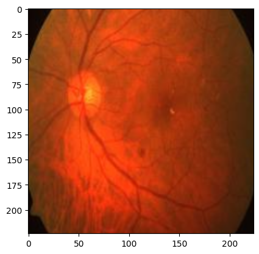
    


    
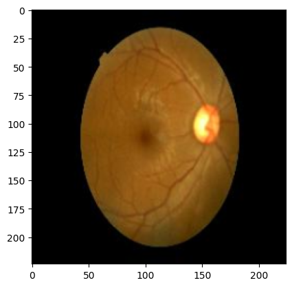
    


    
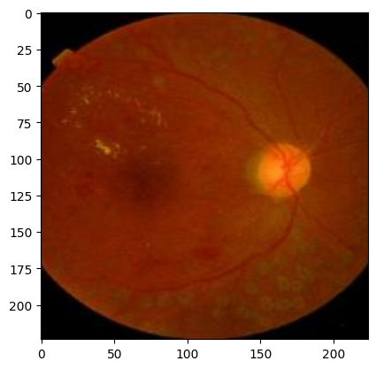
    


    
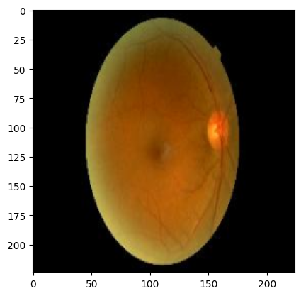
    


    
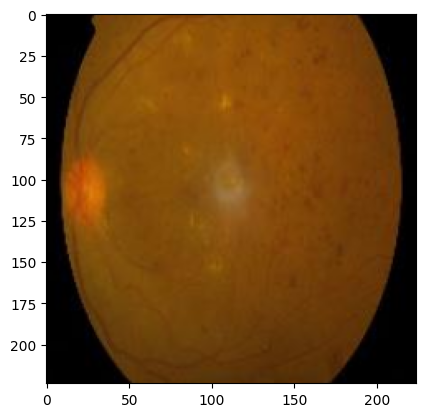
    


    
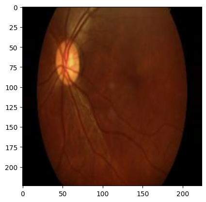
    


    
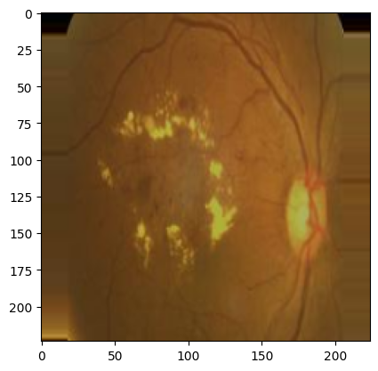
    


    
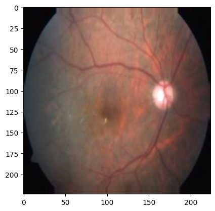
    


    
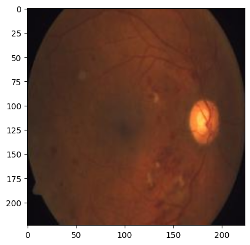
    


```python
# Display a grid of 25 sample training images with corresponding class labels.
labels = [k for k in train_set.class_indices]
sample_generate = train_set.__next__()

images = sample_generate[0]
titles = sample_generate[1]
plt.figure(figsize = (20 , 20))

for i in range(25):
    plt.subplot(5 , 5, i+1)
    plt.subplots_adjust(hspace = 0.3 , wspace = 0.3)
    plt.imshow(images[i])
    plt.title(f'Class: {labels[np.argmax(titles[i],axis=0)]}')
    plt.axis("off")
```


    
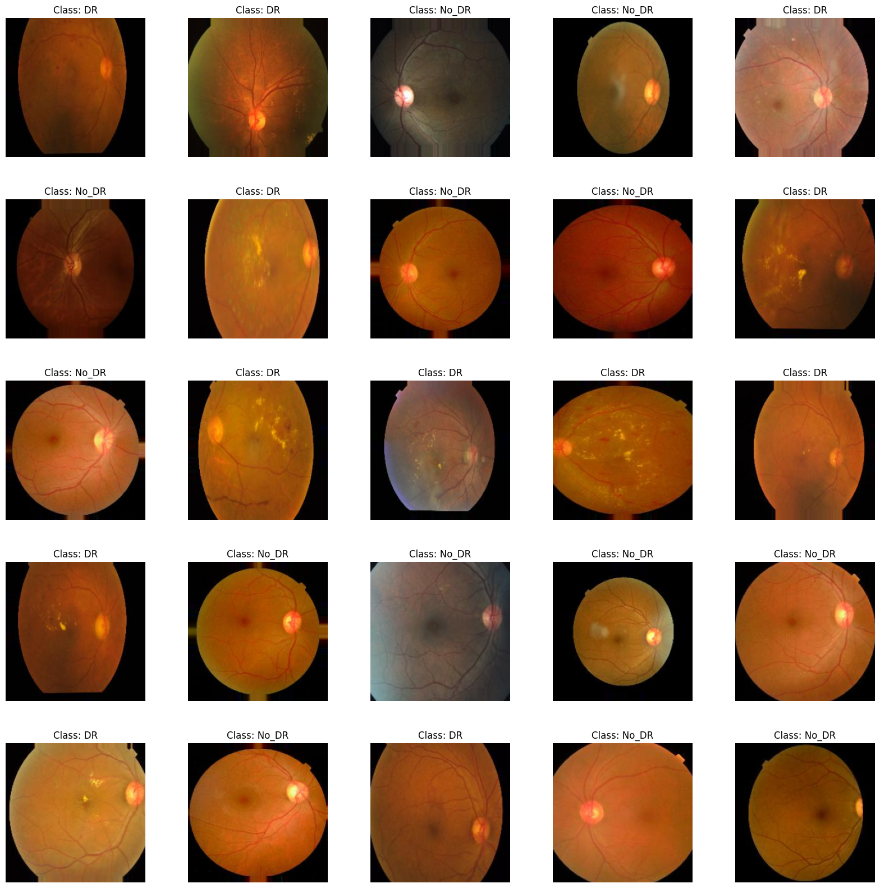
    


```python
from PIL import Image
import os
from IPython.display import display
from IPython.display import Image as _Imgdis
# creating a object

image_path = "../04糖尿病视网膜病变/04Diagnosis_of_Diabetic_Retinopathy/train"
folder = image_path+'/No_DR'


onlybenignfiles = [f for f in os.listdir(folder) if os.path.isfile(os.path.join(folder, f))]
print("Working with {0} images".format(len(onlybenignfiles)))
print("Image examples: ")


for i in range(10):
    print(onlybenignfiles[i])
    display(_Imgdis(filename=folder + "/" + onlybenignfiles[i], width=240, height=240))
```

    Working with 1026 images
    Image examples: 
    0851d6a69589_png.rf.fce4860f02338dee30ea08bf0cb296d9.jpg
    


    

    


    0babc12807b2_png.rf.c90ad911ec42c9da59a84595f1259f69.jpg
    


    
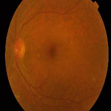
    


    1e742358e0b9_png.rf.2bb066504f421272b86975aab400dc7c.jpg
    


    
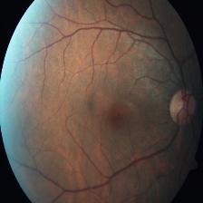
    


    2209daf71aab_png.rf.b9d22826c3fbee5dc27e86e5e144dafd.jpg
    


    
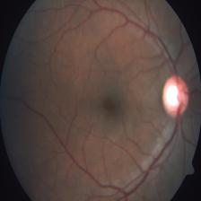
    


    4e1e252317b5_png.rf.3b3709140c8f81d6a9b95d043bd745a7.jpg
    


    

    


    519c6e8f78dc_png.rf.b85eb53ef2f1eaaeb996e42af7e15b83.jpg
    


    
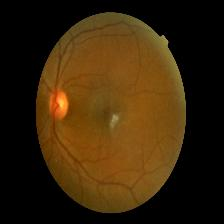
    


    6e092caa065f_png.rf.fd049fe3db2f458b128a44763fdf26c1.jpg
    


    

    


    750e0168399d_png.rf.89abf1361b114858c45bf3b62c284abe.jpg
    


    
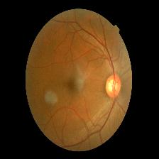
    


    7ccf9d25dc48_png.rf.6875cf9eb2b71d97545b15dd44947cc7.jpg
    


    

    


    82d364726a58_png.rf.be1f96772f8ecab00feae5f25e6a36aa.jpg
    


    

    


```python
#class_names = train_set.class_names

#plt.figure(figsize=(10, 10))
#for images, labels in train_set.take(1):
    #for i in range(9):
        #ax = plt.subplot(3, 3, i + 1)
        #plt.imshow(images[i].numpy().astype("uint8"))
        #plt.title(class_names[np.argmax(labels[i])])
        #plt.axis("off")
```

# Model Transfer Learning : VGG19


```python
BATCH_SIZE = 32
IMAGE_SIZE = [224, 224]
CHANNELS=3
EPOCHS=25
```


```python
WEIGHTS_PATH = '/work/home/aojiang/06download_model/vgg19_weights_tf_dim_ordering_tf_kernels_notop.h5'
```


```python
from tensorflow.keras.applications.vgg19 import VGG19
from tensorflow.keras.models import Model

# 定义输入图像的尺寸，假设为224x224像素
#IMAGE_SIZE = (224, 224)

# 创建VGG19模型，不包括顶部的全连接层
vgg19 = VGG19(input_shape=IMAGE_SIZE + [3], include_top=False, weights=None)

# 加载本地权重文件
vgg19.load_weights(WEIGHTS_PATH)

# 如果需要，可以添加额外的层或修改模型
# ...
```

    2024-05-25 17:29:37.810447: W tensorflow/compiler/xla/stream_executor/platform/default/dso_loader.cc:64] Could not load dynamic library 'libcuda.so.1'; dlerror: libcuda.so.1: cannot open shared object file: No such file or directory; LD_LIBRARY_PATH: /work/home/aojiang/.local/lib/python3.7/site-packages/cv2/../../lib64:/opt/rh/devtoolset-7/root/usr/lib64:/opt/rh/devtoolset-7/root/usr/lib:/opt/rh/devtoolset-7/root/usr/lib64/dyninst:/opt/rh/devtoolset-7/root/usr/lib/dyninst:/opt/rh/devtoolset-7/root/usr/lib64:/opt/rh/devtoolset-7/root/usr/lib:/opt/hwloc/lib:/usr/local/lib/:/usr/local/lib64/:/opt/mpi/lib:/opt/dtk-22.10/hip/lib:/opt/dtk-22.10/llvm/lib:/opt/dtk-22.10/lib:/opt/dtk-22.10/lib64:
    2024-05-25 17:29:37.810524: W tensorflow/compiler/xla/stream_executor/cuda/cuda_driver.cc:265] failed call to cuInit: UNKNOWN ERROR (303)
    2024-05-25 17:29:37.810566: I tensorflow/compiler/xla/stream_executor/cuda/cuda_diagnostics.cc:156] kernel driver does not appear to be running on this host (9c9885ea7126): /proc/driver/nvidia/version does not exist
    2024-05-25 17:29:37.810935: I tensorflow/core/platform/cpu_feature_guard.cc:193] This TensorFlow binary is optimized with oneAPI Deep Neural Network Library (oneDNN) to use the following CPU instructions in performance-critical operations:  AVX2 FMA
    To enable them in other operations, rebuild TensorFlow with the appropriate compiler flags.
    


```python
# 如果想运行下面这行命令，需翻墙
#vgg19 = VGG19(input_shape=IMAGE_SIZE + [3], weights='imagenet', include_top=False)
```


```python
for layer in vgg19.layers:
    print(layer)
```

    <keras.engine.input_layer.InputLayer object at 0x7f6b2f1b3050>
    <keras.layers.convolutional.conv2d.Conv2D object at 0x7f6b2e0b5550>
    <keras.layers.convolutional.conv2d.Conv2D object at 0x7f6b2d566ad0>
    <keras.layers.pooling.max_pooling2d.MaxPooling2D object at 0x7f6b2d527d50>
    <keras.layers.convolutional.conv2d.Conv2D object at 0x7f6b2e3ecb50>
    <keras.layers.convolutional.conv2d.Conv2D object at 0x7f6b2d423ad0>
    <keras.layers.pooling.max_pooling2d.MaxPooling2D object at 0x7f6b2d464e50>
    <keras.layers.convolutional.conv2d.Conv2D object at 0x7f6b2d42e1d0>
    <keras.layers.convolutional.conv2d.Conv2D object at 0x7f6b2dcf6450>
    <keras.layers.convolutional.conv2d.Conv2D object at 0x7f6b2d42e6d0>
    <keras.layers.convolutional.conv2d.Conv2D object at 0x7f6b2d43a250>
    <keras.layers.pooling.max_pooling2d.MaxPooling2D object at 0x7f6b2dd03310>
    <keras.layers.convolutional.conv2d.Conv2D object at 0x7f6b2d43a310>
    <keras.layers.convolutional.conv2d.Conv2D object at 0x7f6b2d43f9d0>
    <keras.layers.convolutional.conv2d.Conv2D object at 0x7f6b2d44bd10>
    <keras.layers.convolutional.conv2d.Conv2D object at 0x7f6b2e386f10>
    <keras.layers.pooling.max_pooling2d.MaxPooling2D object at 0x7f6b2d456d50>
    <keras.layers.convolutional.conv2d.Conv2D object at 0x7f6b2d462a50>
    <keras.layers.convolutional.conv2d.Conv2D object at 0x7f6b2d43fa50>
    <keras.layers.convolutional.conv2d.Conv2D object at 0x7f6b2d3ea750>
    <keras.layers.convolutional.conv2d.Conv2D object at 0x7f6b2d3e4450>
    <keras.layers.pooling.max_pooling2d.MaxPooling2D object at 0x7f6b2d3f8550>
    


```python
for layer in vgg19.layers:
    layer.trainable = False
```


```python
vgg19.summary()
```

    Model: "vgg19"
    _________________________________________________________________
     Layer (type)                Output Shape              Param #   
    =================================================================
     input_1 (InputLayer)        [(None, 224, 224, 3)]     0         
                                                                     
     block1_conv1 (Conv2D)       (None, 224, 224, 64)      1792      
                                                                     
     block1_conv2 (Conv2D)       (None, 224, 224, 64)      36928     
                                                                     
     block1_pool (MaxPooling2D)  (None, 112, 112, 64)      0         
                                                                     
     block2_conv1 (Conv2D)       (None, 112, 112, 128)     73856     
                                                                     
     block2_conv2 (Conv2D)       (None, 112, 112, 128)     147584    
                                                                     
     block2_pool (MaxPooling2D)  (None, 56, 56, 128)       0         
                                                                     
     block3_conv1 (Conv2D)       (None, 56, 56, 256)       295168    
                                                                     
     block3_conv2 (Conv2D)       (None, 56, 56, 256)       590080    
                                                                     
     block3_conv3 (Conv2D)       (None, 56, 56, 256)       590080    
                                                                     
     block3_conv4 (Conv2D)       (None, 56, 56, 256)       590080    
                                                                     
     block3_pool (MaxPooling2D)  (None, 28, 28, 256)       0         
                                                                     
     block4_conv1 (Conv2D)       (None, 28, 28, 512)       1180160   
                                                                     
     block4_conv2 (Conv2D)       (None, 28, 28, 512)       2359808   
                                                                     
     block4_conv3 (Conv2D)       (None, 28, 28, 512)       2359808   
                                                                     
     block4_conv4 (Conv2D)       (None, 28, 28, 512)       2359808   
                                                                     
     block4_pool (MaxPooling2D)  (None, 14, 14, 512)       0         
                                                                     
     block5_conv1 (Conv2D)       (None, 14, 14, 512)       2359808   
                                                                     
     block5_conv2 (Conv2D)       (None, 14, 14, 512)       2359808   
                                                                     
     block5_conv3 (Conv2D)       (None, 14, 14, 512)       2359808   
                                                                     
     block5_conv4 (Conv2D)       (None, 14, 14, 512)       2359808   
                                                                     
     block5_pool (MaxPooling2D)  (None, 7, 7, 512)         0         
                                                                     
    =================================================================
    Total params: 20,024,384
    Trainable params: 0
    Non-trainable params: 20,024,384
    _________________________________________________________________
    


```python
model_vgg19 = Sequential()

model_vgg19.add(vgg19)
model_vgg19.add(Flatten())
model_vgg19.add(Dropout(0.2))
model_vgg19.add(Dense(256,activation='relu'))
model_vgg19.add(Dropout(0.2))
model_vgg19.add(Dense(2,activation='softmax'))
```


```python
model_vgg19.summary()
```

    Model: "sequential"
    _________________________________________________________________
     Layer (type)                Output Shape              Param #   
    =================================================================
     vgg19 (Functional)          (None, 7, 7, 512)         20024384  
                                                                     
     flatten (Flatten)           (None, 25088)             0         
                                                                     
     dropout (Dropout)           (None, 25088)             0         
                                                                     
     dense (Dense)               (None, 256)               6422784   
                                                                     
     dropout_1 (Dropout)         (None, 256)               0         
                                                                     
     dense_1 (Dense)             (None, 2)                 514       
                                                                     
    =================================================================
    Total params: 26,447,682
    Trainable params: 6,423,298
    Non-trainable params: 20,024,384
    _________________________________________________________________
    


```python
model_vgg19.compile(
    optimizer = Adam(learning_rate=0.001), 
    loss='categorical_crossentropy', 
    metrics=['accuracy']
  )
```

下面这段代码，在配置条件为20个核心，30G内存2个加速器的条件下，从15：04开始运行，直到16：00才迭代18轮，太慢了
所以我选择更换配置条件，在配置条件为20个核心，100G内存4个加速器的条件下，从16：41开始运行，不知道什么原因到17：34的时候，只迭代了14轮就结束了
**在配置条件为20个核心，100G内存4个加速器的条件下，迭代一轮需要204秒，也就是3.4分钟，迭代25轮则需要85分钟，也就是1.42小时，也就是1小时25分钟！**
在配置条件为20个核心，100G内存4个加速器的条件下，从17：34开始运行,到19：00结束，用时1小时25分钟


```python
model_vgg_history = model_vgg19.fit(
  train_set,
  validation_data=validation_set,
  epochs=EPOCHS,
  steps_per_epoch=len(train_set),
  validation_steps=len(test_set)
)
```

    Epoch 1/25
    65/65 [==============================] - 205s 3s/step - loss: 0.6857 - accuracy: 0.8348 - val_loss: 0.2206 - val_accuracy: 0.9284
    Epoch 2/25
    65/65 [==============================] - 244s 4s/step - loss: 0.2322 - accuracy: 0.9094 - val_loss: 0.1921 - val_accuracy: 0.9247
    Epoch 3/25
    65/65 [==============================] - 204s 3s/step - loss: 0.2086 - accuracy: 0.9253 - val_loss: 0.2125 - val_accuracy: 0.9228
    Epoch 4/25
    65/65 [==============================] - 204s 3s/step - loss: 0.1983 - accuracy: 0.9273 - val_loss: 0.1893 - val_accuracy: 0.9303
    Epoch 5/25
    65/65 [==============================] - 204s 3s/step - loss: 0.2007 - accuracy: 0.9249 - val_loss: 0.1697 - val_accuracy: 0.9322
    Epoch 6/25
    65/65 [==============================] - 204s 3s/step - loss: 0.2041 - accuracy: 0.9253 - val_loss: 0.2690 - val_accuracy: 0.9096
    Epoch 7/25
    65/65 [==============================] - 203s 3s/step - loss: 0.2047 - accuracy: 0.9306 - val_loss: 0.1821 - val_accuracy: 0.9322
    Epoch 8/25
    65/65 [==============================] - 202s 3s/step - loss: 0.2084 - accuracy: 0.9282 - val_loss: 0.1947 - val_accuracy: 0.9303
    Epoch 9/25
    65/65 [==============================] - 203s 3s/step - loss: 0.1875 - accuracy: 0.9398 - val_loss: 0.2372 - val_accuracy: 0.9228
    Epoch 10/25
    65/65 [==============================] - 203s 3s/step - loss: 0.2029 - accuracy: 0.9302 - val_loss: 0.2515 - val_accuracy: 0.9153
    Epoch 11/25
    65/65 [==============================] - 202s 3s/step - loss: 0.1938 - accuracy: 0.9355 - val_loss: 0.1749 - val_accuracy: 0.9341
    Epoch 12/25
    65/65 [==============================] - 203s 3s/step - loss: 0.1852 - accuracy: 0.9369 - val_loss: 0.2013 - val_accuracy: 0.9284
    Epoch 13/25
    65/65 [==============================] - 203s 3s/step - loss: 0.1783 - accuracy: 0.9388 - val_loss: 0.3477 - val_accuracy: 0.8983
    Epoch 14/25
    65/65 [==============================] - 203s 3s/step - loss: 0.1889 - accuracy: 0.9345 - val_loss: 0.1651 - val_accuracy: 0.9379
    Epoch 15/25
    65/65 [==============================] - 203s 3s/step - loss: 0.1752 - accuracy: 0.9364 - val_loss: 0.2136 - val_accuracy: 0.9266
    Epoch 16/25
    65/65 [==============================] - 203s 3s/step - loss: 0.1582 - accuracy: 0.9432 - val_loss: 0.1656 - val_accuracy: 0.9341
    Epoch 17/25
    65/65 [==============================] - 203s 3s/step - loss: 0.1695 - accuracy: 0.9436 - val_loss: 0.1665 - val_accuracy: 0.9322
    Epoch 18/25
    65/65 [==============================] - 202s 3s/step - loss: 0.1720 - accuracy: 0.9355 - val_loss: 0.1749 - val_accuracy: 0.9379
    Epoch 19/25
    65/65 [==============================] - 203s 3s/step - loss: 0.1570 - accuracy: 0.9489 - val_loss: 0.2299 - val_accuracy: 0.9228
    Epoch 20/25
    65/65 [==============================] - 203s 3s/step - loss: 0.1568 - accuracy: 0.9504 - val_loss: 0.1775 - val_accuracy: 0.9341
    Epoch 21/25
    65/65 [==============================] - 202s 3s/step - loss: 0.1482 - accuracy: 0.9499 - val_loss: 0.2088 - val_accuracy: 0.9360
    Epoch 22/25
    65/65 [==============================] - 202s 3s/step - loss: 0.1619 - accuracy: 0.9461 - val_loss: 0.2861 - val_accuracy: 0.9058
    Epoch 23/25
    65/65 [==============================] - 203s 3s/step - loss: 0.1734 - accuracy: 0.9383 - val_loss: 0.2164 - val_accuracy: 0.9284
    Epoch 24/25
    65/65 [==============================] - 203s 3s/step - loss: 0.1594 - accuracy: 0.9417 - val_loss: 0.2123 - val_accuracy: 0.9341
    Epoch 25/25
    65/65 [==============================] - 202s 3s/step - loss: 0.1633 - accuracy: 0.9470 - val_loss: 0.1651 - val_accuracy: 0.9379
    

## VGG19 Model Evaluation


```python
plt.plot(model_vgg_history.history['loss'], label='train loss')
plt.plot(model_vgg_history.history['val_loss'], label='val loss')
plt.legend()
plt.show()
plt.savefig('LossVal_loss')
```


    
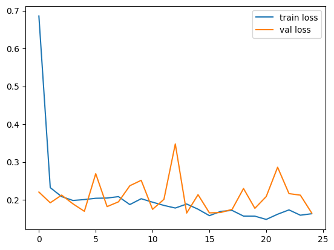
    


    <Figure size 640x480 with 0 Axes>


```python
# plot the accuracy
plt.plot(model_vgg_history.history['accuracy'], label='train acc')
plt.plot(model_vgg_history.history['val_accuracy'], label='val acc')
plt.legend()
plt.show()
plt.savefig('AccVal_acc')
```


    
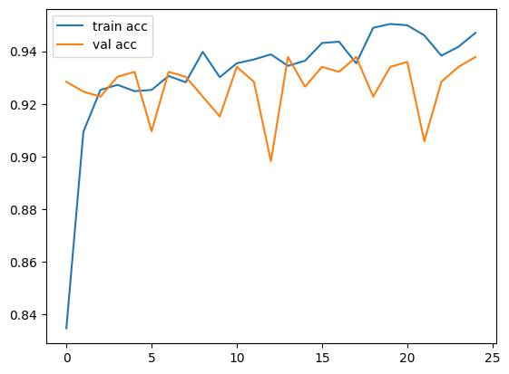
    


    <Figure size 640x480 with 0 Axes>


```python
# Define needed variables
tr_acc = model_vgg_history.history['accuracy']
tr_loss =model_vgg_history.history['loss']
val_acc = model_vgg_history.history['val_accuracy']
val_loss = model_vgg_history.history['val_loss']
index_loss = np.argmin(val_loss)
val_lowest = val_loss[index_loss]
index_acc = np.argmax(val_acc)
acc_highest = val_acc[index_acc]
Epochs = [i+1 for i in range(len(tr_acc))]
loss_label = f'best epoch= {str(index_loss + 1)}'
acc_label = f'best epoch= {str(index_acc + 1)}'

# Plot training history
plt.figure(figsize= (20, 8))
plt.style.use('fivethirtyeight')

plt.subplot(1, 2, 1)
plt.plot(Epochs, tr_loss, 'r', label= 'Training loss')
plt.plot(Epochs, val_loss, 'g', label= 'Validation loss')
plt.scatter(index_loss + 1, val_lowest, s= 150, c= 'blue', label= loss_label)
plt.title('Training and Validation Loss')
plt.xlabel('Epochs')
plt.ylabel('Loss')
plt.legend()

plt.subplot(1, 2, 2)
plt.plot(Epochs, tr_acc, 'r', label= 'Training Accuracy')
plt.plot(Epochs, val_acc, 'g', label= 'Validation Accuracy')
plt.scatter(index_acc + 1 , acc_highest, s= 150, c= 'blue', label= acc_label)
plt.title('Training and Validation Accuracy')
plt.xlabel('Epochs')
plt.ylabel('Accuracy')
plt.legend()

plt.tight_layout
plt.show()
```


    
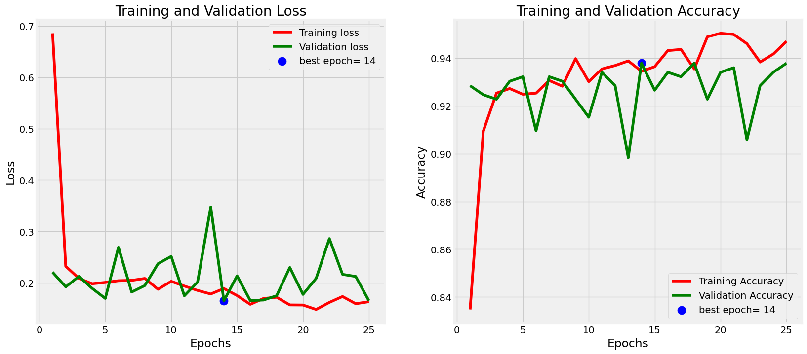
    


## Save Model


```python
from tensorflow.keras.models import save_model

# 保存模型
model_name = "model_vgg19_DR"
save_path = '/work/home/aojiang/06saved_model/DR_CNN'

# 确保保存路径存在
os.makedirs(save_path, exist_ok=True)

# 保存模型
save_model(model_vgg19, os.path.join(save_path, model_name))
```

    WARNING:absl:Found untraced functions such as _update_step_xla, _jit_compiled_convolution_op, _jit_compiled_convolution_op, _jit_compiled_convolution_op, _jit_compiled_convolution_op while saving (showing 5 of 17). These functions will not be directly callable after loading.
    

    INFO:tensorflow:Assets written to: /work/home/aojiang/06saved_model/DR_CNN/model_vgg19_DR/assets
    

    INFO:tensorflow:Assets written to: /work/home/aojiang/06saved_model/DR_CNN/model_vgg19_DR/assets
    

# Model Transfer Learning : Inception


```python
from tensorflow.keras.applications import InceptionV3
```


```python
BATCH_SIZE = 32
IMAGE_SIZE = [224, 224]
CHANNELS=3
EPOCHS=25
```


```python
WEIGHTS_PATH_INCEPTION = '/work/home/aojiang/06download_model/inception_v3_weights_tf_dim_ordering_tf_kernels_notop.h5'
```


```python
# 定义输入图像的尺寸，假设为224x224像素
IMAGE_SIZE = [224, 224]
# 注意，InceptionV3 默认包含顶部层，所以 weights='imagenet' 会同时下载顶层权重
inception = InceptionV3(input_shape=IMAGE_SIZE + [3], include_top=False, weights=None)
# 加载本地权重文件
inception.load_weights(WEIGHTS_PATH_INCEPTION)

```


```python
# 如果想运行下面这行命令，需翻墙
#inception = InceptionV3(input_shape=IMAGE_SIZE + [3], weights='imagenet', include_top=False)
```


```python
for layer in inception.layers:
    print(layer)
```

    <keras.engine.input_layer.InputLayer object at 0x7f6b2dc378d0>
    <keras.layers.convolutional.conv2d.Conv2D object at 0x7f6b1c1692d0>
    <keras.layers.normalization.batch_normalization.BatchNormalization object at 0x7f6b8a018dd0>
    <keras.layers.core.activation.Activation object at 0x7f6b2db12450>
    <keras.layers.convolutional.conv2d.Conv2D object at 0x7f6b2db120d0>
    <keras.layers.normalization.batch_normalization.BatchNormalization object at 0x7f6b88215a50>
    <keras.layers.core.activation.Activation object at 0x7f6b2dbf4bd0>
    <keras.layers.convolutional.conv2d.Conv2D object at 0x7f6b2dafd090>
    <keras.layers.normalization.batch_normalization.BatchNormalization object at 0x7f6b2dd030d0>
    <keras.layers.core.activation.Activation object at 0x7f6b2c09c1d0>
    <keras.layers.pooling.max_pooling2d.MaxPooling2D object at 0x7f6b2dbfa590>
    <keras.layers.convolutional.conv2d.Conv2D object at 0x7f6b1c0b9690>
    <keras.layers.normalization.batch_normalization.BatchNormalization object at 0x7f6b2dbfb4d0>
    <keras.layers.core.activation.Activation object at 0x7f6b1c0b9590>
    <keras.layers.convolutional.conv2d.Conv2D object at 0x7f6b2dbe3190>
    <keras.layers.normalization.batch_normalization.BatchNormalization object at 0x7f6b2dbf4f90>
    <keras.layers.core.activation.Activation object at 0x7f6b2dc05690>
    <keras.layers.pooling.max_pooling2d.MaxPooling2D object at 0x7f6b2c10bbd0>
    <keras.layers.convolutional.conv2d.Conv2D object at 0x7f6b2cd34f90>
    <keras.layers.normalization.batch_normalization.BatchNormalization object at 0x7f6b2cd2dd90>
    <keras.layers.core.activation.Activation object at 0x7f6b2cd301d0>
    <keras.layers.convolutional.conv2d.Conv2D object at 0x7f6b2dc0f210>
    <keras.layers.convolutional.conv2d.Conv2D object at 0x7f6b2c1019d0>
    <keras.layers.normalization.batch_normalization.BatchNormalization object at 0x7f6b2dc0f4d0>
    <keras.layers.normalization.batch_normalization.BatchNormalization object at 0x7f6b2cd30dd0>
    <keras.layers.core.activation.Activation object at 0x7f6b2c0ea650>
    <keras.layers.core.activation.Activation object at 0x7f6b2cd2ddd0>
    <keras.layers.pooling.average_pooling2d.AveragePooling2D object at 0x7f6b2cd34290>
    <keras.layers.convolutional.conv2d.Conv2D object at 0x7f6b2dbfbc10>
    <keras.layers.convolutional.conv2d.Conv2D object at 0x7f6b2c11c790>
    <keras.layers.convolutional.conv2d.Conv2D object at 0x7f6b2d6ab710>
    <keras.layers.convolutional.conv2d.Conv2D object at 0x7f6b2cd2db50>
    <keras.layers.normalization.batch_normalization.BatchNormalization object at 0x7f6b2c10bc10>
    <keras.layers.normalization.batch_normalization.BatchNormalization object at 0x7f6b2dc119d0>
    <keras.layers.normalization.batch_normalization.BatchNormalization object at 0x7f6b2dbf4510>
    <keras.layers.normalization.batch_normalization.BatchNormalization object at 0x7f6b2cd341d0>
    <keras.layers.core.activation.Activation object at 0x7f6b2dbe36d0>
    <keras.layers.core.activation.Activation object at 0x7f6b2c11c210>
    <keras.layers.core.activation.Activation object at 0x7f6b2dc05bd0>
    <keras.layers.core.activation.Activation object at 0x7f6b2dc3c390>
    <keras.layers.merging.concatenate.Concatenate object at 0x7f6b2cd1e650>
    <keras.layers.convolutional.conv2d.Conv2D object at 0x7f6af83c29d0>
    <keras.layers.normalization.batch_normalization.BatchNormalization object at 0x7f6b2cd0f710>
    <keras.layers.core.activation.Activation object at 0x7f6b2cd1e3d0>
    <keras.layers.convolutional.conv2d.Conv2D object at 0x7f6b2cd2df50>
    <keras.layers.convolutional.conv2d.Conv2D object at 0x7f6af83c9b10>
    <keras.layers.normalization.batch_normalization.BatchNormalization object at 0x7f6b2c10b210>
    <keras.layers.normalization.batch_normalization.BatchNormalization object at 0x7f6af83b2610>
    <keras.layers.core.activation.Activation object at 0x7f6b2cd1e550>
    <keras.layers.core.activation.Activation object at 0x7f6af83ce090>
    <keras.layers.pooling.average_pooling2d.AveragePooling2D object at 0x7f6b2cd6ddd0>
    <keras.layers.convolutional.conv2d.Conv2D object at 0x7f6b2c09c190>
    <keras.layers.convolutional.conv2d.Conv2D object at 0x7f6b2cd242d0>
    <keras.layers.convolutional.conv2d.Conv2D object at 0x7f6af83acc50>
    <keras.layers.convolutional.conv2d.Conv2D object at 0x7f6af83cef50>
    <keras.layers.normalization.batch_normalization.BatchNormalization object at 0x7f6b2cd1e310>
    <keras.layers.normalization.batch_normalization.BatchNormalization object at 0x7f6b2cd18450>
    <keras.layers.normalization.batch_normalization.BatchNormalization object at 0x7f6b2cd1e2d0>
    <keras.layers.normalization.batch_normalization.BatchNormalization object at 0x7f6b2cd5d090>
    <keras.layers.core.activation.Activation object at 0x7f6b2dbfbe90>
    <keras.layers.core.activation.Activation object at 0x7f6af83ac750>
    <keras.layers.core.activation.Activation object at 0x7f6af83bde50>
    <keras.layers.core.activation.Activation object at 0x7f6b2cd48ed0>
    <keras.layers.merging.concatenate.Concatenate object at 0x7f6b2df3cb50>
    <keras.layers.convolutional.conv2d.Conv2D object at 0x7f6b2c3b7bd0>
    <keras.layers.normalization.batch_normalization.BatchNormalization object at 0x7f6b2c38ba10>
    <keras.layers.core.activation.Activation object at 0x7f6b2df2bfd0>
    <keras.layers.convolutional.conv2d.Conv2D object at 0x7f6b2df2b250>
    <keras.layers.convolutional.conv2d.Conv2D object at 0x7f6b2c38bbd0>
    <keras.layers.normalization.batch_normalization.BatchNormalization object at 0x7f6b2cd5dfd0>
    <keras.layers.normalization.batch_normalization.BatchNormalization object at 0x7f6b2df2b110>
    <keras.layers.core.activation.Activation object at 0x7f6b2cd7b110>
    <keras.layers.core.activation.Activation object at 0x7f6b2cd0f9d0>
    <keras.layers.pooling.average_pooling2d.AveragePooling2D object at 0x7f6b2c0ea250>
    <keras.layers.convolutional.conv2d.Conv2D object at 0x7f6b2c03ba10>
    <keras.layers.convolutional.conv2d.Conv2D object at 0x7f6b2df3b450>
    <keras.layers.convolutional.conv2d.Conv2D object at 0x7f6b2c1040d0>
    <keras.layers.convolutional.conv2d.Conv2D object at 0x7f6b2c38b8d0>
    <keras.layers.normalization.batch_normalization.BatchNormalization object at 0x7f6af83bdc10>
    <keras.layers.normalization.batch_normalization.BatchNormalization object at 0x7f6b2cd6d410>
    <keras.layers.normalization.batch_normalization.BatchNormalization object at 0x7f6b2c0763d0>
    <keras.layers.normalization.batch_normalization.BatchNormalization object at 0x7f6b2c3ac6d0>
    <keras.layers.core.activation.Activation object at 0x7f6b2dc3c290>
    <keras.layers.core.activation.Activation object at 0x7f6b2df53c10>
    <keras.layers.core.activation.Activation object at 0x7f6b2cd0f410>
    <keras.layers.core.activation.Activation object at 0x7f6b2c11cc10>
    <keras.layers.merging.concatenate.Concatenate object at 0x7f6af83cec10>
    <keras.layers.convolutional.conv2d.Conv2D object at 0x7f6b2dbf40d0>
    <keras.layers.normalization.batch_normalization.BatchNormalization object at 0x7f6b2c3acd90>
    <keras.layers.core.activation.Activation object at 0x7f6b2cd48390>
    <keras.layers.convolutional.conv2d.Conv2D object at 0x7f6b2cd48150>
    <keras.layers.normalization.batch_normalization.BatchNormalization object at 0x7f6b2df50110>
    <keras.layers.core.activation.Activation object at 0x7f6b2dbf4d90>
    <keras.layers.convolutional.conv2d.Conv2D object at 0x7f6b2df56910>
    <keras.layers.convolutional.conv2d.Conv2D object at 0x7f6b2c0cfb10>
    <keras.layers.normalization.batch_normalization.BatchNormalization object at 0x7f6af83ceb90>
    <keras.layers.normalization.batch_normalization.BatchNormalization object at 0x7f6b2df3bb90>
    <keras.layers.core.activation.Activation object at 0x7f6b2df3b9d0>
    <keras.layers.core.activation.Activation object at 0x7f6b2c0d5450>
    <keras.layers.pooling.max_pooling2d.MaxPooling2D object at 0x7f6b2c390990>
    <keras.layers.merging.concatenate.Concatenate object at 0x7f6b2c390a90>
    <keras.layers.convolutional.conv2d.Conv2D object at 0x7f6b2cda1dd0>
    <keras.layers.normalization.batch_normalization.BatchNormalization object at 0x7f6b2cdacf90>
    <keras.layers.core.activation.Activation object at 0x7f6b2cd8ddd0>
    <keras.layers.convolutional.conv2d.Conv2D object at 0x7f6b2cd88490>
    <keras.layers.normalization.batch_normalization.BatchNormalization object at 0x7f6b2cdbcfd0>
    <keras.layers.core.activation.Activation object at 0x7f6b2c3e0c90>
    <keras.layers.convolutional.conv2d.Conv2D object at 0x7f6b2c0cd510>
    <keras.layers.convolutional.conv2d.Conv2D object at 0x7f6b2c3d3a10>
    <keras.layers.normalization.batch_normalization.BatchNormalization object at 0x7f6b2c0d5f90>
    <keras.layers.normalization.batch_normalization.BatchNormalization object at 0x7f6b2c3c9cd0>
    <keras.layers.core.activation.Activation object at 0x7f6b2c0be1d0>
    <keras.layers.core.activation.Activation object at 0x7f6b2c3c9f90>
    <keras.layers.convolutional.conv2d.Conv2D object at 0x7f6b2c0cd310>
    <keras.layers.convolutional.conv2d.Conv2D object at 0x7f6b2c3c9a50>
    <keras.layers.normalization.batch_normalization.BatchNormalization object at 0x7f6b2cdba650>
    <keras.layers.normalization.batch_normalization.BatchNormalization object at 0x7f6b2c3ef250>
    <keras.layers.core.activation.Activation object at 0x7f6b2cdac1d0>
    <keras.layers.core.activation.Activation object at 0x7f6b2c3c9d10>
    <keras.layers.pooling.average_pooling2d.AveragePooling2D object at 0x7f6b2cd7b850>
    <keras.layers.convolutional.conv2d.Conv2D object at 0x7f6af83ce7d0>
    <keras.layers.convolutional.conv2d.Conv2D object at 0x7f6b2cdba510>
    <keras.layers.convolutional.conv2d.Conv2D object at 0x7f6b2c390510>
    <keras.layers.convolutional.conv2d.Conv2D object at 0x7f6b2c3c9a90>
    <keras.layers.normalization.batch_normalization.BatchNormalization object at 0x7f6b2c0d0110>
    <keras.layers.normalization.batch_normalization.BatchNormalization object at 0x7f6b2c0a97d0>
    <keras.layers.normalization.batch_normalization.BatchNormalization object at 0x7f6b2c10b710>
    <keras.layers.normalization.batch_normalization.BatchNormalization object at 0x7f6b2c102b10>
    <keras.layers.core.activation.Activation object at 0x7f6b2c0d01d0>
    <keras.layers.core.activation.Activation object at 0x7f6b2c0cd050>
    <keras.layers.core.activation.Activation object at 0x7f6b2c0d5310>
    <keras.layers.core.activation.Activation object at 0x7f6b2d6ab8d0>
    <keras.layers.merging.concatenate.Concatenate object at 0x7f6b2cda7490>
    <keras.layers.convolutional.conv2d.Conv2D object at 0x7f6b2dbc9c10>
    <keras.layers.normalization.batch_normalization.BatchNormalization object at 0x7f6b2dbb70d0>
    <keras.layers.core.activation.Activation object at 0x7f6b2cd183d0>
    <keras.layers.convolutional.conv2d.Conv2D object at 0x7f6b2dbb4950>
    <keras.layers.normalization.batch_normalization.BatchNormalization object at 0x7f6b2dbc1810>
    <keras.layers.core.activation.Activation object at 0x7f6b2dbc9650>
    <keras.layers.convolutional.conv2d.Conv2D object at 0x7f6b2dbe1bd0>
    <keras.layers.convolutional.conv2d.Conv2D object at 0x7f6b2c42dfd0>
    <keras.layers.normalization.batch_normalization.BatchNormalization object at 0x7f6b2c3d4050>
    <keras.layers.normalization.batch_normalization.BatchNormalization object at 0x7f6b2dbc9450>
    <keras.layers.core.activation.Activation object at 0x7f6b2dbb9f50>
    <keras.layers.core.activation.Activation object at 0x7f6b2dbc9910>
    <keras.layers.convolutional.conv2d.Conv2D object at 0x7f6b2dbe1cd0>
    <keras.layers.convolutional.conv2d.Conv2D object at 0x7f6b2dbb4cd0>
    <keras.layers.normalization.batch_normalization.BatchNormalization object at 0x7f6b2cd24a50>
    <keras.layers.normalization.batch_normalization.BatchNormalization object at 0x7f6b2c419050>
    <keras.layers.core.activation.Activation object at 0x7f6b2dbc6e90>
    <keras.layers.core.activation.Activation object at 0x7f6b2c4122d0>
    <keras.layers.pooling.average_pooling2d.AveragePooling2D object at 0x7f6b2dca7a90>
    <keras.layers.convolutional.conv2d.Conv2D object at 0x7f6b2c102750>
    <keras.layers.convolutional.conv2d.Conv2D object at 0x7f6b2dbb7f90>
    <keras.layers.convolutional.conv2d.Conv2D object at 0x7f6b2c413e90>
    <keras.layers.convolutional.conv2d.Conv2D object at 0x7f6b2c43b5d0>
    <keras.layers.normalization.batch_normalization.BatchNormalization object at 0x7f6b2cdba5d0>
    <keras.layers.normalization.batch_normalization.BatchNormalization object at 0x7f6b2dbb9c10>
    <keras.layers.normalization.batch_normalization.BatchNormalization object at 0x7f6b2c412610>
    <keras.layers.normalization.batch_normalization.BatchNormalization object at 0x7f6b2dca7a50>
    <keras.layers.core.activation.Activation object at 0x7f6b2cdbab10>
    <keras.layers.core.activation.Activation object at 0x7f6b2dbc95d0>
    <keras.layers.core.activation.Activation object at 0x7f6b2c42dcd0>
    <keras.layers.core.activation.Activation object at 0x7f6b2dca7cd0>
    <keras.layers.merging.concatenate.Concatenate object at 0x7f6b2dcc7b10>
    <keras.layers.convolutional.conv2d.Conv2D object at 0x7f6b2dbe3650>
    <keras.layers.normalization.batch_normalization.BatchNormalization object at 0x7f6b2c412110>
    <keras.layers.core.activation.Activation object at 0x7f6b2c3ef4d0>
    <keras.layers.convolutional.conv2d.Conv2D object at 0x7f6b2dcdff10>
    <keras.layers.normalization.batch_normalization.BatchNormalization object at 0x7f6b2df30dd0>
    <keras.layers.core.activation.Activation object at 0x7f6b2cd8d090>
    <keras.layers.convolutional.conv2d.Conv2D object at 0x7f6b2dca3990>
    <keras.layers.convolutional.conv2d.Conv2D object at 0x7f6b2c419810>
    <keras.layers.normalization.batch_normalization.BatchNormalization object at 0x7f6b2c413810>
    <keras.layers.normalization.batch_normalization.BatchNormalization object at 0x7f6b2cd482d0>
    <keras.layers.core.activation.Activation object at 0x7f6b2cdfa990>
    <keras.layers.core.activation.Activation object at 0x7f6b2dcdfdd0>
    <keras.layers.convolutional.conv2d.Conv2D object at 0x7f6b2c0cd7d0>
    <keras.layers.convolutional.conv2d.Conv2D object at 0x7f6b2cdcdc90>
    <keras.layers.normalization.batch_normalization.BatchNormalization object at 0x7f6b2dca6bd0>
    <keras.layers.normalization.batch_normalization.BatchNormalization object at 0x7f6b2c42d8d0>
    <keras.layers.core.activation.Activation object at 0x7f6b2c415090>
    <keras.layers.core.activation.Activation object at 0x7f6b2c42d450>
    <keras.layers.pooling.average_pooling2d.AveragePooling2D object at 0x7f6b2cde3150>
    <keras.layers.convolutional.conv2d.Conv2D object at 0x7f6b2cd48c50>
    <keras.layers.convolutional.conv2d.Conv2D object at 0x7f6b2c3904d0>
    <keras.layers.convolutional.conv2d.Conv2D object at 0x7f6b2cddab90>
    <keras.layers.convolutional.conv2d.Conv2D object at 0x7f6b2cddca10>
    <keras.layers.normalization.batch_normalization.BatchNormalization object at 0x7f6b2cdfa550>
    <keras.layers.normalization.batch_normalization.BatchNormalization object at 0x7f6b2cdfa5d0>
    <keras.layers.normalization.batch_normalization.BatchNormalization object at 0x7f6b2cdef450>
    <keras.layers.normalization.batch_normalization.BatchNormalization object at 0x7f6b2da5f250>
    <keras.layers.core.activation.Activation object at 0x7f6b2c415890>
    <keras.layers.core.activation.Activation object at 0x7f6b2cd782d0>
    <keras.layers.core.activation.Activation object at 0x7f6b2cdcbd90>
    <keras.layers.core.activation.Activation object at 0x7f6b2cde3d50>
    <keras.layers.merging.concatenate.Concatenate object at 0x7f6b2da4d6d0>
    <keras.layers.convolutional.conv2d.Conv2D object at 0x7f6b2d8c4950>
    <keras.layers.normalization.batch_normalization.BatchNormalization object at 0x7f6b2da47490>
    <keras.layers.core.activation.Activation object at 0x7f6b2d8c9bd0>
    <keras.layers.convolutional.conv2d.Conv2D object at 0x7f6b2d8c0a50>
    <keras.layers.normalization.batch_normalization.BatchNormalization object at 0x7f6b2d8c4710>
    <keras.layers.core.activation.Activation object at 0x7f6b2d8c4790>
    <keras.layers.convolutional.conv2d.Conv2D object at 0x7f6b2da4d110>
    <keras.layers.convolutional.conv2d.Conv2D object at 0x7f6b2df3bb10>
    <keras.layers.normalization.batch_normalization.BatchNormalization object at 0x7f6b2da44750>
    <keras.layers.normalization.batch_normalization.BatchNormalization object at 0x7f6b2df3b490>
    <keras.layers.core.activation.Activation object at 0x7f6b2da4acd0>
    <keras.layers.core.activation.Activation object at 0x7f6b2d8b1c10>
    <keras.layers.convolutional.conv2d.Conv2D object at 0x7f6b2da35bd0>
    <keras.layers.convolutional.conv2d.Conv2D object at 0x7f6b2dccd5d0>
    <keras.layers.normalization.batch_normalization.BatchNormalization object at 0x7f6b2da47cd0>
    <keras.layers.normalization.batch_normalization.BatchNormalization object at 0x7f6b2dca6250>
    <keras.layers.core.activation.Activation object at 0x7f6b2da4a7d0>
    <keras.layers.core.activation.Activation object at 0x7f6b2da44a90>
    <keras.layers.pooling.average_pooling2d.AveragePooling2D object at 0x7f6b2cdda3d0>
    <keras.layers.convolutional.conv2d.Conv2D object at 0x7f6b2dcddf50>
    <keras.layers.convolutional.conv2d.Conv2D object at 0x7f6b2d8c3a90>
    <keras.layers.convolutional.conv2d.Conv2D object at 0x7f6b2da5f210>
    <keras.layers.convolutional.conv2d.Conv2D object at 0x7f6b2cddc790>
    <keras.layers.normalization.batch_normalization.BatchNormalization object at 0x7f6b2da4d590>
    <keras.layers.normalization.batch_normalization.BatchNormalization object at 0x7f6b2da4dcd0>
    <keras.layers.normalization.batch_normalization.BatchNormalization object at 0x7f6b2da3a090>
    <keras.layers.normalization.batch_normalization.BatchNormalization object at 0x7f6b2da4d410>
    <keras.layers.core.activation.Activation object at 0x7f6b2dca3c10>
    <keras.layers.core.activation.Activation object at 0x7f6b2d8c4750>
    <keras.layers.core.activation.Activation object at 0x7f6b2d8a5e90>
    <keras.layers.core.activation.Activation object at 0x7f6b2cdcdcd0>
    <keras.layers.merging.concatenate.Concatenate object at 0x7f6b2d8b1690>
    <keras.layers.convolutional.conv2d.Conv2D object at 0x7f6b2d7676d0>
    <keras.layers.normalization.batch_normalization.BatchNormalization object at 0x7f6b2d78bf50>
    <keras.layers.core.activation.Activation object at 0x7f6b2d773e90>
    <keras.layers.convolutional.conv2d.Conv2D object at 0x7f6b2d767050>
    <keras.layers.normalization.batch_normalization.BatchNormalization object at 0x7f6b2d783e90>
    <keras.layers.core.activation.Activation object at 0x7f6b2dc6e910>
    <keras.layers.convolutional.conv2d.Conv2D object at 0x7f6b2da4d8d0>
    <keras.layers.convolutional.conv2d.Conv2D object at 0x7f6b2d763590>
    <keras.layers.normalization.batch_normalization.BatchNormalization object at 0x7f6b2d7a2890>
    <keras.layers.normalization.batch_normalization.BatchNormalization object at 0x7f6b2d7738d0>
    <keras.layers.core.activation.Activation object at 0x7f6b2cdcbb10>
    <keras.layers.core.activation.Activation object at 0x7f6b2dc6ec10>
    <keras.layers.convolutional.conv2d.Conv2D object at 0x7f6b2d78bb10>
    <keras.layers.convolutional.conv2d.Conv2D object at 0x7f6b2dc7a290>
    <keras.layers.normalization.batch_normalization.BatchNormalization object at 0x7f6b2d8ce090>
    <keras.layers.normalization.batch_normalization.BatchNormalization object at 0x7f6b2dc7dc10>
    <keras.layers.core.activation.Activation object at 0x7f6b2d7a2fd0>
    <keras.layers.core.activation.Activation object at 0x7f6b2d7639d0>
    <keras.layers.pooling.max_pooling2d.MaxPooling2D object at 0x7f6b2dc64690>
    <keras.layers.merging.concatenate.Concatenate object at 0x7f6b2d763650>
    <keras.layers.convolutional.conv2d.Conv2D object at 0x7f6b2c0d0350>
    <keras.layers.normalization.batch_normalization.BatchNormalization object at 0x7f6b2dca61d0>
    <keras.layers.core.activation.Activation object at 0x7f6b2da1e4d0>
    <keras.layers.convolutional.conv2d.Conv2D object at 0x7f6b2da04dd0>
    <keras.layers.convolutional.conv2d.Conv2D object at 0x7f6b2d783d10>
    <keras.layers.normalization.batch_normalization.BatchNormalization object at 0x7f6b2dc91490>
    <keras.layers.normalization.batch_normalization.BatchNormalization object at 0x7f6b2c0be290>
    <keras.layers.core.activation.Activation object at 0x7f6b2da04390>
    <keras.layers.core.activation.Activation object at 0x7f6b2d78c4d0>
    <keras.layers.convolutional.conv2d.Conv2D object at 0x7f6b2d9e4890>
    <keras.layers.convolutional.conv2d.Conv2D object at 0x7f6b2da04c90>
    <keras.layers.convolutional.conv2d.Conv2D object at 0x7f6b2d78c410>
    <keras.layers.convolutional.conv2d.Conv2D object at 0x7f6b2d9e7350>
    <keras.layers.pooling.average_pooling2d.AveragePooling2D object at 0x7f6b2dc05250>
    <keras.layers.convolutional.conv2d.Conv2D object at 0x7f6b2d8a9fd0>
    <keras.layers.normalization.batch_normalization.BatchNormalization object at 0x7f6b2da042d0>
    <keras.layers.normalization.batch_normalization.BatchNormalization object at 0x7f6b2da04a90>
    <keras.layers.normalization.batch_normalization.BatchNormalization object at 0x7f6b2c3d4690>
    <keras.layers.normalization.batch_normalization.BatchNormalization object at 0x7f6b2d78ce90>
    <keras.layers.convolutional.conv2d.Conv2D object at 0x7f6b2d9f79d0>
    <keras.layers.normalization.batch_normalization.BatchNormalization object at 0x7f6b2dc64b10>
    <keras.layers.core.activation.Activation object at 0x7f6b2da1bd50>
    <keras.layers.core.activation.Activation object at 0x7f6b2d9eaa90>
    <keras.layers.core.activation.Activation object at 0x7f6b2dc642d0>
    <keras.layers.core.activation.Activation object at 0x7f6b2d8a9850>
    <keras.layers.normalization.batch_normalization.BatchNormalization object at 0x7f6b2d8a54d0>
    <keras.layers.core.activation.Activation object at 0x7f6b2dc86e90>
    <keras.layers.merging.concatenate.Concatenate object at 0x7f6b2dc7dd10>
    <keras.layers.merging.concatenate.Concatenate object at 0x7f6b2d767b10>
    <keras.layers.core.activation.Activation object at 0x7f6b2da78950>
    <keras.layers.merging.concatenate.Concatenate object at 0x7f6b2da69250>
    <keras.layers.convolutional.conv2d.Conv2D object at 0x7f6b2da89290>
    <keras.layers.normalization.batch_normalization.BatchNormalization object at 0x7f6b2d7f0910>
    <keras.layers.core.activation.Activation object at 0x7f6b2d813e90>
    <keras.layers.convolutional.conv2d.Conv2D object at 0x7f6b2d9f7090>
    <keras.layers.convolutional.conv2d.Conv2D object at 0x7f6b2d81e510>
    <keras.layers.normalization.batch_normalization.BatchNormalization object at 0x7f6b2d773850>
    <keras.layers.normalization.batch_normalization.BatchNormalization object at 0x7f6b2daa0fd0>
    <keras.layers.core.activation.Activation object at 0x7f6b2da8e790>
    <keras.layers.core.activation.Activation object at 0x7f6b2d7f0cd0>
    <keras.layers.convolutional.conv2d.Conv2D object at 0x7f6b2daa0190>
    <keras.layers.convolutional.conv2d.Conv2D object at 0x7f6b2d8056d0>
    <keras.layers.convolutional.conv2d.Conv2D object at 0x7f6b2d7ed950>
    <keras.layers.convolutional.conv2d.Conv2D object at 0x7f6b2d8ed950>
    <keras.layers.pooling.average_pooling2d.AveragePooling2D object at 0x7f6b2d8137d0>
    <keras.layers.convolutional.conv2d.Conv2D object at 0x7f6b2d7734d0>
    <keras.layers.normalization.batch_normalization.BatchNormalization object at 0x7f6b2da8dd10>
    <keras.layers.normalization.batch_normalization.BatchNormalization object at 0x7f6b2da8e3d0>
    <keras.layers.normalization.batch_normalization.BatchNormalization object at 0x7f6b2d8edbd0>
    <keras.layers.normalization.batch_normalization.BatchNormalization object at 0x7f6b2d7eae50>
    <keras.layers.convolutional.conv2d.Conv2D object at 0x7f6b2d8fd290>
    <keras.layers.normalization.batch_normalization.BatchNormalization object at 0x7f6b2da78810>
    <keras.layers.core.activation.Activation object at 0x7f6b2da69590>
    <keras.layers.core.activation.Activation object at 0x7f6b2d80ee50>
    <keras.layers.core.activation.Activation object at 0x7f6b2d81ea90>
    <keras.layers.core.activation.Activation object at 0x7f6b2d8fd710>
    <keras.layers.normalization.batch_normalization.BatchNormalization object at 0x7f6b2da170d0>
    <keras.layers.core.activation.Activation object at 0x7f6b2da78ad0>
    <keras.layers.merging.concatenate.Concatenate object at 0x7f6b2d7f0dd0>
    <keras.layers.merging.concatenate.Concatenate object at 0x7f6b2d7ea3d0>
    <keras.layers.core.activation.Activation object at 0x7f6b2d7ede10>
    <keras.layers.merging.concatenate.Concatenate object at 0x7f6b2cdcd610>
    


```python
model_inception = Sequential()

model_inception.add(inception)
model_inception.add(Flatten())
model_inception.add(Dropout(0.2))
model_inception.add(Dense(256,activation='relu'))
model_inception.add(Dropout(0.2))
model_inception.add(Dense(2,activation='softmax'))
```


```python
model_inception.summary()
```

    Model: "sequential_1"
    _________________________________________________________________
     Layer (type)                Output Shape              Param #   
    =================================================================
     inception_v3 (Functional)   (None, 5, 5, 2048)        21802784  
                                                                     
     flatten_1 (Flatten)         (None, 51200)             0         
                                                                     
     dropout_2 (Dropout)         (None, 51200)             0         
                                                                     
     dense_2 (Dense)             (None, 256)               13107456  
                                                                     
     dropout_3 (Dropout)         (None, 256)               0         
                                                                     
     dense_3 (Dense)             (None, 2)                 514       
                                                                     
    =================================================================
    Total params: 34,910,754
    Trainable params: 34,876,322
    Non-trainable params: 34,432
    _________________________________________________________________
    


```python
model_inception.compile(
    optimizer = Adam(learning_rate=0.001), 
    loss='categorical_crossentropy', 
    metrics=['accuracy']
  )
```

**在配置条件为20个核心，100G内存4个加速器的条件下，迭代一轮需要158秒，也就是2分28秒，迭代25轮则需要66分钟，也就是1小时6分钟！**
在配置条件为20个核心，100G内存4个加速器的条件下，从19：14开始运行,20：24到结束，用时1小时10分钟


```python
model_inception_history =model_inception.fit(
  train_set,
  validation_data=validation_set,
  epochs=EPOCHS,
  steps_per_epoch=len(train_set),
  validation_steps=len(test_set)
)
```

    Epoch 1/25
    65/65 [==============================] - 181s 2s/step - loss: 1.9979 - accuracy: 0.8145 - val_loss: 103108.1562 - val_accuracy: 0.5895
    Epoch 2/25
    65/65 [==============================] - 159s 2s/step - loss: 0.9313 - accuracy: 0.8329 - val_loss: 3.4928 - val_accuracy: 0.5198
    Epoch 3/25
    65/65 [==============================] - 159s 2s/step - loss: 0.2981 - accuracy: 0.8772 - val_loss: 0.4293 - val_accuracy: 0.8983
    Epoch 4/25
    65/65 [==============================] - 158s 2s/step - loss: 0.2616 - accuracy: 0.8988 - val_loss: 0.3485 - val_accuracy: 0.9096
    Epoch 5/25
    65/65 [==============================] - 159s 2s/step - loss: 0.2406 - accuracy: 0.9032 - val_loss: 0.3726 - val_accuracy: 0.9190
    Epoch 6/25
    65/65 [==============================] - 159s 2s/step - loss: 0.2694 - accuracy: 0.9075 - val_loss: 0.2135 - val_accuracy: 0.9322
    Epoch 7/25
    65/65 [==============================] - 159s 2s/step - loss: 0.2006 - accuracy: 0.9196 - val_loss: 0.1631 - val_accuracy: 0.9379
    Epoch 8/25
    65/65 [==============================] - 159s 2s/step - loss: 0.1846 - accuracy: 0.9297 - val_loss: 0.1586 - val_accuracy: 0.9284
    Epoch 9/25
    65/65 [==============================] - 158s 2s/step - loss: 0.1566 - accuracy: 0.9441 - val_loss: 0.1226 - val_accuracy: 0.9492
    Epoch 10/25
    65/65 [==============================] - 159s 2s/step - loss: 0.1440 - accuracy: 0.9422 - val_loss: 0.1399 - val_accuracy: 0.9435
    Epoch 11/25
    65/65 [==============================] - 159s 2s/step - loss: 0.1450 - accuracy: 0.9461 - val_loss: 0.1633 - val_accuracy: 0.9284
    Epoch 12/25
    65/65 [==============================] - 159s 2s/step - loss: 0.1527 - accuracy: 0.9470 - val_loss: 0.1520 - val_accuracy: 0.9379
    Epoch 13/25
    65/65 [==============================] - 159s 2s/step - loss: 0.1237 - accuracy: 0.9528 - val_loss: 0.1423 - val_accuracy: 0.9548
    Epoch 14/25
    65/65 [==============================] - 158s 2s/step - loss: 0.1496 - accuracy: 0.9485 - val_loss: 0.2319 - val_accuracy: 0.9171
    Epoch 15/25
    65/65 [==============================] - 158s 2s/step - loss: 0.1265 - accuracy: 0.9518 - val_loss: 0.1536 - val_accuracy: 0.9360
    Epoch 16/25
    65/65 [==============================] - 159s 2s/step - loss: 0.1109 - accuracy: 0.9557 - val_loss: 0.0908 - val_accuracy: 0.9661
    Epoch 17/25
    65/65 [==============================] - 158s 2s/step - loss: 0.1179 - accuracy: 0.9591 - val_loss: 1.9851 - val_accuracy: 0.7702
    Epoch 18/25
    65/65 [==============================] - 158s 2s/step - loss: 0.1269 - accuracy: 0.9547 - val_loss: 0.2271 - val_accuracy: 0.9115
    Epoch 19/25
    65/65 [==============================] - 158s 2s/step - loss: 0.1010 - accuracy: 0.9668 - val_loss: 0.4278 - val_accuracy: 0.8663
    Epoch 20/25
    65/65 [==============================] - 158s 2s/step - loss: 0.1108 - accuracy: 0.9677 - val_loss: 0.2909 - val_accuracy: 0.8983
    Epoch 21/25
    65/65 [==============================] - 159s 2s/step - loss: 0.0999 - accuracy: 0.9653 - val_loss: 0.1092 - val_accuracy: 0.9586
    Epoch 22/25
    65/65 [==============================] - 159s 2s/step - loss: 0.0966 - accuracy: 0.9619 - val_loss: 0.1297 - val_accuracy: 0.9623
    Epoch 23/25
    65/65 [==============================] - 159s 2s/step - loss: 0.0808 - accuracy: 0.9668 - val_loss: 0.1749 - val_accuracy: 0.9605
    Epoch 24/25
    65/65 [==============================] - 158s 2s/step - loss: 0.1213 - accuracy: 0.9682 - val_loss: 0.1310 - val_accuracy: 0.9567
    Epoch 25/25
    65/65 [==============================] - 158s 2s/step - loss: 0.1180 - accuracy: 0.9591 - val_loss: 0.3396 - val_accuracy: 0.8399
    

## Inception Model Evaluation


```python
# Define needed variables
tr_acc = model_inception_history.history['accuracy']
tr_loss =model_inception_history.history['loss']
val_acc = model_inception_history.history['val_accuracy']
val_loss = model_inception_history.history['val_loss']
index_loss = np.argmin(val_loss)
val_lowest = val_loss[index_loss]
index_acc = np.argmax(val_acc)
acc_highest = val_acc[index_acc]
Epochs = [i+1 for i in range(len(tr_acc))]
loss_label = f'best epoch= {str(index_loss + 1)}'
acc_label = f'best epoch= {str(index_acc + 1)}'

# Plot training history
plt.figure(figsize= (20, 8))
plt.style.use('fivethirtyeight')

plt.subplot(1, 2, 1)
plt.plot(Epochs, tr_loss, 'r', label= 'Training loss')
plt.plot(Epochs, val_loss, 'g', label= 'Validation loss')
plt.scatter(index_loss + 1, val_lowest, s= 150, c= 'blue', label= loss_label)
plt.title('Training and Validation Loss')
plt.xlabel('Epochs')
plt.ylabel('Loss')
plt.legend()

plt.subplot(1, 2, 2)
plt.plot(Epochs, tr_acc, 'r', label= 'Training Accuracy')
plt.plot(Epochs, val_acc, 'g', label= 'Validation Accuracy')
plt.scatter(index_acc + 1 , acc_highest, s= 150, c= 'blue', label= acc_label)
plt.title('Training and Validation Accuracy')
plt.xlabel('Epochs')
plt.ylabel('Accuracy')
plt.legend()

plt.tight_layout
plt.show()
```


    
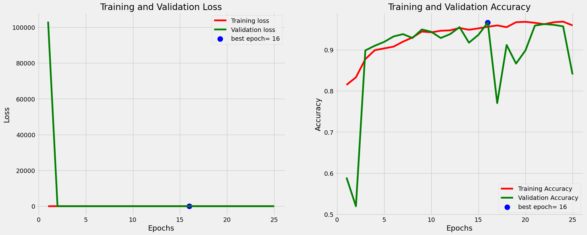
    


## Save Model


```python
from tensorflow.keras.models import save_model

# 保存模型
model_name = "model_inception_DR"
save_path = '/work/home/aojiang/06saved_model/DR_CNN'

# 确保保存路径存在
os.makedirs(save_path, exist_ok=True)

# 保存模型
save_model(model_inception, os.path.join(save_path, model_name))
```

    WARNING:absl:Found untraced functions such as _update_step_xla, _jit_compiled_convolution_op, _jit_compiled_convolution_op, _jit_compiled_convolution_op, _jit_compiled_convolution_op while saving (showing 5 of 95). These functions will not be directly callable after loading.
    

    INFO:tensorflow:Assets written to: /work/home/aojiang/06saved_model/DR_CNN/model_inception_DR/assets
    

    INFO:tensorflow:Assets written to: /work/home/aojiang/06saved_model/DR_CNN/model_inception_DR/assets
    

## Model Transfer Learning : ResNet50


```python
from tensorflow.keras.applications.resnet50 import ResNet50

# 定义输入图像的尺寸，假设为224x224像素，3通道
IMAGE_SIZE = [224, 224]  # 包含高、宽,不包含通道数

# 假设您已经下载了权重文件，并且设置了正确的路径
WEIGHTS_PATH_RESNET = '/work/home/aojiang/06download_model/resnet50_weights_tf_dim_ordering_tf_kernels_notop.h5'

# 创建ResNet50模型，不包括顶部的全连接层
resnet = ResNet50(input_shape=IMAGE_SIZE + [3], include_top=False, weights=None)

# 加载本地权重文件
resnet.load_weights(WEIGHTS_PATH_RESNET)

# 接下来可以添加额外的层或修改模型
# ...
```


```python
# 如果想运行下面这行命令，需翻墙
#resnet = ResNet50(input_shape=IMAGE_SIZE + [3], weights='imagenet', include_top=False)
```


```python
for layer in resnet.layers:
    print(layer)
```

    <keras.engine.input_layer.InputLayer object at 0x7f6a880f8950>
    <keras.layers.reshaping.zero_padding2d.ZeroPadding2D object at 0x7f6a603d5d50>
    <keras.layers.convolutional.conv2d.Conv2D object at 0x7f6b2db64cd0>
    <keras.layers.normalization.batch_normalization.BatchNormalization object at 0x7f6a817595d0>
    <keras.layers.core.activation.Activation object at 0x7f6a815a7c90>
    <keras.layers.reshaping.zero_padding2d.ZeroPadding2D object at 0x7f6a88155cd0>
    <keras.layers.pooling.max_pooling2d.MaxPooling2D object at 0x7f6a61ef53d0>
    <keras.layers.convolutional.conv2d.Conv2D object at 0x7f6a8137de90>
    <keras.layers.normalization.batch_normalization.BatchNormalization object at 0x7f6a806b3910>
    <keras.layers.core.activation.Activation object at 0x7f6a802990d0>
    <keras.layers.convolutional.conv2d.Conv2D object at 0x7f6a80242750>
    <keras.layers.normalization.batch_normalization.BatchNormalization object at 0x7f6a80305ed0>
    <keras.layers.core.activation.Activation object at 0x7f6a80099290>
    <keras.layers.convolutional.conv2d.Conv2D object at 0x7f6a81551090>
    <keras.layers.convolutional.conv2d.Conv2D object at 0x7f6a800b4e90>
    <keras.layers.normalization.batch_normalization.BatchNormalization object at 0x7f6a8159b950>
    <keras.layers.normalization.batch_normalization.BatchNormalization object at 0x7f6a801adb90>
    <keras.layers.merging.add.Add object at 0x7f6a800dea90>
    <keras.layers.core.activation.Activation object at 0x7f6a7859bd50>
    <keras.layers.convolutional.conv2d.Conv2D object at 0x7f6a785b5b90>
    <keras.layers.normalization.batch_normalization.BatchNormalization object at 0x7f6a78542b90>
    <keras.layers.core.activation.Activation object at 0x7f6a7855de10>
    <keras.layers.convolutional.conv2d.Conv2D object at 0x7f6a7856bad0>
    <keras.layers.normalization.batch_normalization.BatchNormalization object at 0x7f6a7853e410>
    <keras.layers.core.activation.Activation object at 0x7f6a80235d90>
    <keras.layers.convolutional.conv2d.Conv2D object at 0x7f6a78534310>
    <keras.layers.normalization.batch_normalization.BatchNormalization object at 0x7f6a78574e50>
    <keras.layers.merging.add.Add object at 0x7f6a784fc8d0>
    <keras.layers.core.activation.Activation object at 0x7f6a7849e4d0>
    <keras.layers.convolutional.conv2d.Conv2D object at 0x7f6a784e3e10>
    <keras.layers.normalization.batch_normalization.BatchNormalization object at 0x7f6a7844d390>
    <keras.layers.core.activation.Activation object at 0x7f6a78463990>
    <keras.layers.convolutional.conv2d.Conv2D object at 0x7f6a78442510>
    <keras.layers.normalization.batch_normalization.BatchNormalization object at 0x7f6a802f6ad0>
    <keras.layers.core.activation.Activation object at 0x7f6a802fe050>
    <keras.layers.convolutional.conv2d.Conv2D object at 0x7f6a800b8c90>
    <keras.layers.normalization.batch_normalization.BatchNormalization object at 0x7f6a7841efd0>
    <keras.layers.merging.add.Add object at 0x7f6a603e7150>
    <keras.layers.core.activation.Activation object at 0x7f6a812e3790>
    <keras.layers.convolutional.conv2d.Conv2D object at 0x7f6a602fef10>
    <keras.layers.normalization.batch_normalization.BatchNormalization object at 0x7f6a603042d0>
    <keras.layers.core.activation.Activation object at 0x7f6a6030d4d0>
    <keras.layers.convolutional.conv2d.Conv2D object at 0x7f6a60311ad0>
    <keras.layers.normalization.batch_normalization.BatchNormalization object at 0x7f6a60317d50>
    <keras.layers.core.activation.Activation object at 0x7f6a603efc10>
    <keras.layers.convolutional.conv2d.Conv2D object at 0x7f6a60383f10>
    <keras.layers.convolutional.conv2d.Conv2D object at 0x7f6a603299d0>
    <keras.layers.normalization.batch_normalization.BatchNormalization object at 0x7f6a801f5f50>
    <keras.layers.normalization.batch_normalization.BatchNormalization object at 0x7f6a60300d50>
    <keras.layers.merging.add.Add object at 0x7f6a7845ea50>
    <keras.layers.core.activation.Activation object at 0x7f6a783ceed0>
    <keras.layers.convolutional.conv2d.Conv2D object at 0x7f6a80207b10>
    <keras.layers.normalization.batch_normalization.BatchNormalization object at 0x7f6a784f1690>
    <keras.layers.core.activation.Activation object at 0x7f6a784cdf50>
    <keras.layers.convolutional.conv2d.Conv2D object at 0x7f6a785a81d0>
    <keras.layers.normalization.batch_normalization.BatchNormalization object at 0x7f6a784d1f10>
    <keras.layers.core.activation.Activation object at 0x7f6a801f0390>
    <keras.layers.convolutional.conv2d.Conv2D object at 0x7f6a60318090>
    <keras.layers.normalization.batch_normalization.BatchNormalization object at 0x7f6a801c4e10>
    <keras.layers.merging.add.Add object at 0x7f6a8012e2d0>
    <keras.layers.core.activation.Activation object at 0x7f6a603b5b10>
    <keras.layers.convolutional.conv2d.Conv2D object at 0x7f6a603a8d50>
    <keras.layers.normalization.batch_normalization.BatchNormalization object at 0x7f6a60391650>
    <keras.layers.core.activation.Activation object at 0x7f6a60332d10>
    <keras.layers.convolutional.conv2d.Conv2D object at 0x7f6a603395d0>
    <keras.layers.normalization.batch_normalization.BatchNormalization object at 0x7f6a603a8b50>
    <keras.layers.core.activation.Activation object at 0x7f6a602ca150>
    <keras.layers.convolutional.conv2d.Conv2D object at 0x7f6a602ca190>
    <keras.layers.normalization.batch_normalization.BatchNormalization object at 0x7f6a602c8a10>
    <keras.layers.merging.add.Add object at 0x7f6a602dda10>
    <keras.layers.core.activation.Activation object at 0x7f6a602ddcd0>
    <keras.layers.convolutional.conv2d.Conv2D object at 0x7f6a602e1c50>
    <keras.layers.normalization.batch_normalization.BatchNormalization object at 0x7f6a60311ed0>
    <keras.layers.core.activation.Activation object at 0x7f6a602edf50>
    <keras.layers.convolutional.conv2d.Conv2D object at 0x7f6a602f2a10>
    <keras.layers.normalization.batch_normalization.BatchNormalization object at 0x7f6a602ef290>
    <keras.layers.core.activation.Activation object at 0x7f6a602fe550>
    <keras.layers.convolutional.conv2d.Conv2D object at 0x7f6a785c4250>
    <keras.layers.normalization.batch_normalization.BatchNormalization object at 0x7f6a602d6590>
    <keras.layers.merging.add.Add object at 0x7f6a6029a690>
    <keras.layers.core.activation.Activation object at 0x7f6a602a0710>
    <keras.layers.convolutional.conv2d.Conv2D object at 0x7f6a603398d0>
    <keras.layers.normalization.batch_normalization.BatchNormalization object at 0x7f6a60332f50>
    <keras.layers.core.activation.Activation object at 0x7f6a602ba250>
    <keras.layers.convolutional.conv2d.Conv2D object at 0x7f6a60244d90>
    <keras.layers.normalization.batch_normalization.BatchNormalization object at 0x7f6a6023f250>
    <keras.layers.core.activation.Activation object at 0x7f6a602e1210>
    <keras.layers.convolutional.conv2d.Conv2D object at 0x7f6a60293ad0>
    <keras.layers.convolutional.conv2d.Conv2D object at 0x7f6a60332690>
    <keras.layers.normalization.batch_normalization.BatchNormalization object at 0x7f6a602a5f10>
    <keras.layers.normalization.batch_normalization.BatchNormalization object at 0x7f6a602efc10>
    <keras.layers.merging.add.Add object at 0x7f6a785a8250>
    <keras.layers.core.activation.Activation object at 0x7f6a603f6590>
    <keras.layers.convolutional.conv2d.Conv2D object at 0x7f6a602be750>
    <keras.layers.normalization.batch_normalization.BatchNormalization object at 0x7f6a602c5bd0>
    <keras.layers.core.activation.Activation object at 0x7f6a60280190>
    <keras.layers.convolutional.conv2d.Conv2D object at 0x7f6a60293b10>
    <keras.layers.normalization.batch_normalization.BatchNormalization object at 0x7f6a80228550>
    <keras.layers.core.activation.Activation object at 0x7f6a60345190>
    <keras.layers.convolutional.conv2d.Conv2D object at 0x7f6a60345750>
    <keras.layers.normalization.batch_normalization.BatchNormalization object at 0x7f6a60290390>
    <keras.layers.merging.add.Add object at 0x7f6a60345cd0>
    <keras.layers.core.activation.Activation object at 0x7f6a6025bc50>
    <keras.layers.convolutional.conv2d.Conv2D object at 0x7f6a602909d0>
    <keras.layers.normalization.batch_normalization.BatchNormalization object at 0x7f6a602be690>
    <keras.layers.core.activation.Activation object at 0x7f6a602906d0>
    <keras.layers.convolutional.conv2d.Conv2D object at 0x7f6a6024b110>
    <keras.layers.normalization.batch_normalization.BatchNormalization object at 0x7f6a60273390>
    <keras.layers.core.activation.Activation object at 0x7f6a60203510>
    <keras.layers.convolutional.conv2d.Conv2D object at 0x7f6a6028e1d0>
    <keras.layers.normalization.batch_normalization.BatchNormalization object at 0x7f6a602476d0>
    <keras.layers.merging.add.Add object at 0x7f6a6020eb10>
    <keras.layers.core.activation.Activation object at 0x7f6a6021a850>
    <keras.layers.convolutional.conv2d.Conv2D object at 0x7f6a60220510>
    <keras.layers.normalization.batch_normalization.BatchNormalization object at 0x7f6a60220f50>
    <keras.layers.core.activation.Activation object at 0x7f6a603b5510>
    <keras.layers.convolutional.conv2d.Conv2D object at 0x7f6a7858ea90>
    <keras.layers.normalization.batch_normalization.BatchNormalization object at 0x7f6a60220ad0>
    <keras.layers.core.activation.Activation object at 0x7f6a60265fd0>
    <keras.layers.convolutional.conv2d.Conv2D object at 0x7f6a6022a6d0>
    <keras.layers.normalization.batch_normalization.BatchNormalization object at 0x7f6a6022f310>
    <keras.layers.merging.add.Add object at 0x7f6a601bca90>
    <keras.layers.core.activation.Activation object at 0x7f6a601d3810>
    <keras.layers.convolutional.conv2d.Conv2D object at 0x7f6a601e16d0>
    <keras.layers.normalization.batch_normalization.BatchNormalization object at 0x7f6a601e60d0>
    <keras.layers.core.activation.Activation object at 0x7f6a601ea450>
    <keras.layers.convolutional.conv2d.Conv2D object at 0x7f6a601d8490>
    <keras.layers.normalization.batch_normalization.BatchNormalization object at 0x7f6a60220490>
    <keras.layers.core.activation.Activation object at 0x7f6a6025b250>
    <keras.layers.convolutional.conv2d.Conv2D object at 0x7f6a602b7f10>
    <keras.layers.normalization.batch_normalization.BatchNormalization object at 0x7f6a785e2950>
    <keras.layers.merging.add.Add object at 0x7f6ab80c5990>
    <keras.layers.core.activation.Activation object at 0x7f6a601e1550>
    <keras.layers.convolutional.conv2d.Conv2D object at 0x7f6a7859f290>
    <keras.layers.normalization.batch_normalization.BatchNormalization object at 0x7f6a601ea290>
    <keras.layers.core.activation.Activation object at 0x7f6a60254490>
    <keras.layers.convolutional.conv2d.Conv2D object at 0x7f6a60203d10>
    <keras.layers.normalization.batch_normalization.BatchNormalization object at 0x7f6a601c3890>
    <keras.layers.core.activation.Activation object at 0x7f6a601ccb50>
    <keras.layers.convolutional.conv2d.Conv2D object at 0x7f6a60273f90>
    <keras.layers.normalization.batch_normalization.BatchNormalization object at 0x7f6a601f2b90>
    <keras.layers.merging.add.Add object at 0x7f6a6017f850>
    <keras.layers.core.activation.Activation object at 0x7f6a6017fcd0>
    <keras.layers.convolutional.conv2d.Conv2D object at 0x7f6a60190ed0>
    <keras.layers.normalization.batch_normalization.BatchNormalization object at 0x7f6a60194050>
    <keras.layers.core.activation.Activation object at 0x7f6a6019d150>
    <keras.layers.convolutional.conv2d.Conv2D object at 0x7f6a601a5a10>
    <keras.layers.normalization.batch_normalization.BatchNormalization object at 0x7f6a601aad50>
    <keras.layers.core.activation.Activation object at 0x7f6a6013e2d0>
    <keras.layers.convolutional.conv2d.Conv2D object at 0x7f6a60184f10>
    <keras.layers.convolutional.conv2d.Conv2D object at 0x7f6a6013e990>
    <keras.layers.normalization.batch_normalization.BatchNormalization object at 0x7f6a80180e90>
    <keras.layers.normalization.batch_normalization.BatchNormalization object at 0x7f6a601449d0>
    <keras.layers.merging.add.Add object at 0x7f6a60144110>
    <keras.layers.core.activation.Activation object at 0x7f6a6013e690>
    <keras.layers.convolutional.conv2d.Conv2D object at 0x7f6a6026d810>
    <keras.layers.normalization.batch_normalization.BatchNormalization object at 0x7f6a60159dd0>
    <keras.layers.core.activation.Activation object at 0x7f6a6016c790>
    <keras.layers.convolutional.conv2d.Conv2D object at 0x7f6a601b7790>
    <keras.layers.normalization.batch_normalization.BatchNormalization object at 0x7f6a60203e50>
    <keras.layers.core.activation.Activation object at 0x7f6a60159c50>
    <keras.layers.convolutional.conv2d.Conv2D object at 0x7f6a60171e90>
    <keras.layers.normalization.batch_normalization.BatchNormalization object at 0x7f6a600fe510>
    <keras.layers.merging.add.Add object at 0x7f6a60112310>
    <keras.layers.core.activation.Activation object at 0x7f6a601124d0>
    <keras.layers.convolutional.conv2d.Conv2D object at 0x7f6a6010bc90>
    <keras.layers.normalization.batch_normalization.BatchNormalization object at 0x7f6a6010b050>
    <keras.layers.core.activation.Activation object at 0x7f6a601b7210>
    <keras.layers.convolutional.conv2d.Conv2D object at 0x7f6a6018b0d0>
    <keras.layers.normalization.batch_normalization.BatchNormalization object at 0x7f6a601b7a90>
    <keras.layers.core.activation.Activation object at 0x7f6a60112410>
    <keras.layers.convolutional.conv2d.Conv2D object at 0x7f6a6029aa50>
    <keras.layers.normalization.batch_normalization.BatchNormalization object at 0x7f6a60184710>
    <keras.layers.merging.add.Add object at 0x7f6a6032d6d0>
    <keras.layers.core.activation.Activation object at 0x7f6a601127d0>
    


```python
model_resnet = Sequential()

model_resnet.add(inception)
model_resnet.add(Flatten())
model_resnet.add(Dropout(0.2))
model_resnet.add(Dense(256,activation='relu'))
model_resnet.add(Dropout(0.2))
model_resnet.add(Dense(2,activation='softmax'))
```


```python
model_resnet.summary()
```

    Model: "sequential_3"
    _________________________________________________________________
     Layer (type)                Output Shape              Param #   
    =================================================================
     inception_v3 (Functional)   (None, 5, 5, 2048)        21802784  
                                                                     
     flatten_3 (Flatten)         (None, 51200)             0         
                                                                     
     dropout_6 (Dropout)         (None, 51200)             0         
                                                                     
     dense_6 (Dense)             (None, 256)               13107456  
                                                                     
     dropout_7 (Dropout)         (None, 256)               0         
                                                                     
     dense_7 (Dense)             (None, 2)                 514       
                                                                     
    =================================================================
    Total params: 34,910,754
    Trainable params: 34,876,322
    Non-trainable params: 34,432
    _________________________________________________________________
    


```python
model_resnet.compile(
    optimizer = Adam(learning_rate=0.001), 
    loss='categorical_crossentropy', 
    metrics=['accuracy']
  )
```

**在配置条件为20个核心，100G内存4个加速器的条件下，迭代一轮需要158秒，也就是2分28秒，迭代25轮则需要66分钟，也就是1小时6分钟！**
在配置条件为20个核心，100G内存4个加速器的条件下，从20:50开始运行,到结束，用时1小时10分钟


```python
model_resnet_history =model_resnet.fit(
  train_set,
  validation_data=validation_set,
  epochs=EPOCHS,
  steps_per_epoch=len(train_set),
  validation_steps=len(test_set)
)
```

    Epoch 1/25
    65/65 [==============================] - 180s 2s/step - loss: 1.0891 - accuracy: 0.8487 - val_loss: 890.1238 - val_accuracy: 0.5763
    Epoch 2/25
    65/65 [==============================] - 157s 2s/step - loss: 0.8346 - accuracy: 0.8136 - val_loss: 61.0476 - val_accuracy: 0.5612
    Epoch 3/25
    65/65 [==============================] - 157s 2s/step - loss: 0.3717 - accuracy: 0.8622 - val_loss: 75.6745 - val_accuracy: 0.5744
    Epoch 4/25
    65/65 [==============================] - 158s 2s/step - loss: 0.3403 - accuracy: 0.8767 - val_loss: 174.4071 - val_accuracy: 0.7589
    Epoch 5/25
    65/65 [==============================] - 158s 2s/step - loss: 0.2740 - accuracy: 0.8834 - val_loss: 3.2196 - val_accuracy: 0.9115
    Epoch 6/25
    65/65 [==============================] - 157s 2s/step - loss: 0.2336 - accuracy: 0.9118 - val_loss: 0.3804 - val_accuracy: 0.8927
    Epoch 7/25
    65/65 [==============================] - 157s 2s/step - loss: 0.4627 - accuracy: 0.8882 - val_loss: 16.8350 - val_accuracy: 0.6930
    Epoch 8/25
    65/65 [==============================] - 157s 2s/step - loss: 0.2708 - accuracy: 0.8945 - val_loss: 3.8558 - val_accuracy: 0.8908
    Epoch 9/25
    65/65 [==============================] - 157s 2s/step - loss: 0.2508 - accuracy: 0.9143 - val_loss: 0.4031 - val_accuracy: 0.8814
    Epoch 10/25
    65/65 [==============================] - 157s 2s/step - loss: 0.2658 - accuracy: 0.9200 - val_loss: 0.5533 - val_accuracy: 0.9171
    Epoch 11/25
    65/65 [==============================] - 158s 2s/step - loss: 0.2387 - accuracy: 0.9210 - val_loss: 0.4427 - val_accuracy: 0.9153
    Epoch 12/25
    65/65 [==============================] - 157s 2s/step - loss: 0.2233 - accuracy: 0.9249 - val_loss: 0.2490 - val_accuracy: 0.9002
    Epoch 13/25
    65/65 [==============================] - 158s 2s/step - loss: 0.2221 - accuracy: 0.9292 - val_loss: 0.2718 - val_accuracy: 0.9190
    Epoch 14/25
    65/65 [==============================] - 157s 2s/step - loss: 0.1971 - accuracy: 0.9340 - val_loss: 0.2333 - val_accuracy: 0.9209
    Epoch 15/25
    65/65 [==============================] - 157s 2s/step - loss: 0.1850 - accuracy: 0.9427 - val_loss: 0.2871 - val_accuracy: 0.9171
    Epoch 16/25
    65/65 [==============================] - 157s 2s/step - loss: 0.1898 - accuracy: 0.9355 - val_loss: 0.1717 - val_accuracy: 0.9416
    Epoch 17/25
    65/65 [==============================] - 157s 2s/step - loss: 0.1890 - accuracy: 0.9374 - val_loss: 0.2760 - val_accuracy: 0.9115
    Epoch 18/25
    65/65 [==============================] - 157s 2s/step - loss: 0.1755 - accuracy: 0.9432 - val_loss: 0.1819 - val_accuracy: 0.9454
    Epoch 19/25
    65/65 [==============================] - 157s 2s/step - loss: 0.1613 - accuracy: 0.9504 - val_loss: 0.1688 - val_accuracy: 0.9473
    Epoch 20/25
    65/65 [==============================] - 157s 2s/step - loss: 0.1619 - accuracy: 0.9461 - val_loss: 0.1782 - val_accuracy: 0.9416
    Epoch 21/25
    65/65 [==============================] - 157s 2s/step - loss: 0.1443 - accuracy: 0.9533 - val_loss: 0.1556 - val_accuracy: 0.9510
    Epoch 22/25
    65/65 [==============================] - 156s 2s/step - loss: 0.1487 - accuracy: 0.9528 - val_loss: 0.2030 - val_accuracy: 0.9435
    Epoch 23/25
    65/65 [==============================] - 157s 2s/step - loss: 0.1389 - accuracy: 0.9605 - val_loss: 0.1842 - val_accuracy: 0.9322
    Epoch 24/25
    65/65 [==============================] - 157s 2s/step - loss: 0.1247 - accuracy: 0.9576 - val_loss: 0.1672 - val_accuracy: 0.9529
    Epoch 25/25
    65/65 [==============================] - 157s 2s/step - loss: 0.1377 - accuracy: 0.9591 - val_loss: 0.1539 - val_accuracy: 0.9473
    

## ResNet50 Model Evaluation


```python
# Define needed variables
tr_acc = model_resnet_history.history['accuracy']
tr_loss = model_resnet_history.history['loss']
val_acc = model_resnet_history.history['val_accuracy']
val_loss = model_resnet_history.history['val_loss']
index_loss = np.argmin(val_loss)
val_lowest = val_loss[index_loss]
index_acc = np.argmax(val_acc)
acc_highest = val_acc[index_acc]
Epochs = [i+1 for i in range(len(tr_acc))]
loss_label = f'best epoch= {str(index_loss + 1)}'
acc_label = f'best epoch= {str(index_acc + 1)}'

# Plot training history
plt.figure(figsize= (20, 8))
plt.style.use('fivethirtyeight')

plt.subplot(1, 2, 1)
plt.plot(Epochs, tr_loss, 'r', label= 'Training loss')
plt.plot(Epochs, val_loss, 'g', label= 'Validation loss')
plt.scatter(index_loss + 1, val_lowest, s= 150, c= 'blue', label= loss_label)
plt.title('Training and Validation Loss')
plt.xlabel('Epochs')
plt.ylabel('Loss')
plt.legend()

plt.subplot(1, 2, 2)
plt.plot(Epochs, tr_acc, 'r', label= 'Training Accuracy')
plt.plot(Epochs, val_acc, 'g', label= 'Validation Accuracy')
plt.scatter(index_acc + 1 , acc_highest, s= 150, c= 'blue', label= acc_label)
plt.title('Training and Validation Accuracy')
plt.xlabel('Epochs')
plt.ylabel('Accuracy')
plt.legend()

plt.tight_layout
plt.show()
```


    
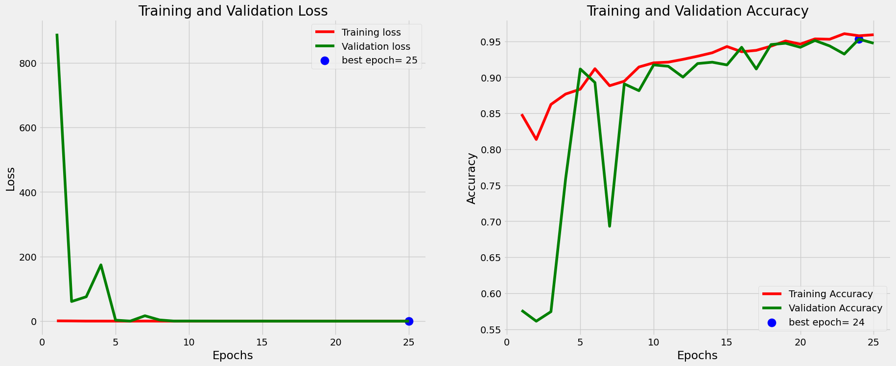
    


## Save Model


```python
from tensorflow.keras.models import save_model

# 保存模型
model_name = "model_resnet_DR"
save_path = '/work/home/aojiang/06saved_model/DR_CNN'

# 确保保存路径存在
os.makedirs(save_path, exist_ok=True)

# 保存模型
save_model(model_resnet, os.path.join(save_path, model_name))
```

    WARNING:absl:Found untraced functions such as _update_step_xla, _jit_compiled_convolution_op, _jit_compiled_convolution_op, _jit_compiled_convolution_op, _jit_compiled_convolution_op while saving (showing 5 of 95). These functions will not be directly callable after loading.
    

    INFO:tensorflow:Assets written to: /work/home/aojiang/06saved_model/DR_CNN/model_resnet_DR/assets
    

    INFO:tensorflow:Assets written to: /work/home/aojiang/06saved_model/DR_CNN/model_resnet_DR/assets
    

# Model Transfer Learning : EfficientNet


```python
from tensorflow.keras.applications import EfficientNetB0
```


```python
from tensorflow.keras.applications.efficientnet import EfficientNetB0

# 定义输入图像的尺寸，假设为224x224像素
IMAGE_SIZE = [224, 224]

# 假设您已经下载了权重文件，并且设置了正确的路径
WEIGHTS_PATH_EFFICIENTNET = '/work/home/aojiang/06download_model/efficientnetb0_notop.h5'

# 创建EfficientNetB0模型，不包括顶部的全连接层
efficientnet = EfficientNetB0(input_shape=IMAGE_SIZE + [3], include_top=False, weights=None)

# 加载本地权重文件
efficientnet.load_weights(WEIGHTS_PATH_EFFICIENTNET)

# 接下来可以添加额外的层或修改模型
# ...
```


```python
# 如果想运行下面这行命令，需翻墙
#efficientnet = EfficientNetB0(input_shape=IMAGE_SIZE + [3], weights='imagenet', include_top=False)
```


```python
for layer in efficientnet.layers:
    print(layer)
```

    <keras.engine.input_layer.InputLayer object at 0x7f6a33205bd0>
    <keras.layers.preprocessing.image_preprocessing.Rescaling object at 0x7f6a33205590>
    <keras.layers.preprocessing.normalization.Normalization object at 0x7f6a33ac86d0>
    <keras.layers.reshaping.zero_padding2d.ZeroPadding2D object at 0x7f6a6025d2d0>
    <keras.layers.convolutional.conv2d.Conv2D object at 0x7f6a6025d190>
    <keras.layers.normalization.batch_normalization.BatchNormalization object at 0x7f6a33ac8bd0>
    <keras.layers.core.activation.Activation object at 0x7f6a81372c90>
    <keras.layers.convolutional.depthwise_conv2d.DepthwiseConv2D object at 0x7f6a812d1750>
    <keras.layers.normalization.batch_normalization.BatchNormalization object at 0x7f6a61eeac90>
    <keras.layers.core.activation.Activation object at 0x7f6a60159c10>
    <keras.layers.pooling.global_average_pooling2d.GlobalAveragePooling2D object at 0x7f6a600c9f10>
    <keras.layers.reshaping.reshape.Reshape object at 0x7f69f0a70790>
    <keras.layers.convolutional.conv2d.Conv2D object at 0x7f69f0251f90>
    <keras.layers.convolutional.conv2d.Conv2D object at 0x7f6a6025d490>
    <keras.layers.merging.multiply.Multiply object at 0x7f6a78476490>
    <keras.layers.convolutional.conv2d.Conv2D object at 0x7f69f0a56b10>
    <keras.layers.normalization.batch_normalization.BatchNormalization object at 0x7f6a306854d0>
    <keras.layers.convolutional.conv2d.Conv2D object at 0x7f6a812d1050>
    <keras.layers.normalization.batch_normalization.BatchNormalization object at 0x7f6a28393590>
    <keras.layers.core.activation.Activation object at 0x7f6a886b2c90>
    <keras.layers.reshaping.zero_padding2d.ZeroPadding2D object at 0x7f69f09c2c90>
    <keras.layers.convolutional.depthwise_conv2d.DepthwiseConv2D object at 0x7f6a783ce4d0>
    <keras.layers.normalization.batch_normalization.BatchNormalization object at 0x7f6a9837b610>
    <keras.layers.core.activation.Activation object at 0x7f6a983dfb90>
    <keras.layers.pooling.global_average_pooling2d.GlobalAveragePooling2D object at 0x7f6a883d6f10>
    <keras.layers.reshaping.reshape.Reshape object at 0x7f69f02516d0>
    <keras.layers.convolutional.conv2d.Conv2D object at 0x7f6a80d75350>
    <keras.layers.convolutional.conv2d.Conv2D object at 0x7f69f05ec190>
    <keras.layers.merging.multiply.Multiply object at 0x7f6a80369cd0>
    <keras.layers.convolutional.conv2d.Conv2D object at 0x7f6a7840f810>
    <keras.layers.normalization.batch_normalization.BatchNormalization object at 0x7f6a8136c950>
    <keras.layers.convolutional.conv2d.Conv2D object at 0x7f6a33ac8610>
    <keras.layers.normalization.batch_normalization.BatchNormalization object at 0x7f6a81167090>
    <keras.layers.core.activation.Activation object at 0x7f6a88420f10>
    <keras.layers.convolutional.depthwise_conv2d.DepthwiseConv2D object at 0x7f6a31698e50>
    <keras.layers.normalization.batch_normalization.BatchNormalization object at 0x7f6a80369550>
    <keras.layers.core.activation.Activation object at 0x7f69f063f310>
    <keras.layers.pooling.global_average_pooling2d.GlobalAveragePooling2D object at 0x7f6a3282be50>
    <keras.layers.reshaping.reshape.Reshape object at 0x7f6a88429f90>
    <keras.layers.convolutional.conv2d.Conv2D object at 0x7f6a3282be10>
    <keras.layers.convolutional.conv2d.Conv2D object at 0x7f6a2be329d0>
    <keras.layers.merging.multiply.Multiply object at 0x7f6a32818550>
    <keras.layers.convolutional.conv2d.Conv2D object at 0x7f6a30533c10>
    <keras.layers.normalization.batch_normalization.BatchNormalization object at 0x7f6a32ced750>
    <keras.layers.regularization.dropout.Dropout object at 0x7f6a294e7f90>
    <keras.layers.merging.add.Add object at 0x7f6a31facb10>
    <keras.layers.convolutional.conv2d.Conv2D object at 0x7f6a883e69d0>
    <keras.layers.normalization.batch_normalization.BatchNormalization object at 0x7f6a31740610>
    <keras.layers.core.activation.Activation object at 0x7f6a316a09d0>
    <keras.layers.reshaping.zero_padding2d.ZeroPadding2D object at 0x7f6a81536a90>
    <keras.layers.convolutional.depthwise_conv2d.DepthwiseConv2D object at 0x7f6a60e52450>
    <keras.layers.normalization.batch_normalization.BatchNormalization object at 0x7f69f0433710>
    <keras.layers.core.activation.Activation object at 0x7f6a31facc50>
    <keras.layers.pooling.global_average_pooling2d.GlobalAveragePooling2D object at 0x7f69f041c210>
    <keras.layers.reshaping.reshape.Reshape object at 0x7f6a3282be90>
    <keras.layers.convolutional.conv2d.Conv2D object at 0x7f6a2bd19ed0>
    <keras.layers.convolutional.conv2d.Conv2D object at 0x7f6a31f9b390>
    <keras.layers.merging.multiply.Multiply object at 0x7f6a31477310>
    <keras.layers.convolutional.conv2d.Conv2D object at 0x7f6a32807550>
    <keras.layers.normalization.batch_normalization.BatchNormalization object at 0x7f6a312deed0>
    <keras.layers.convolutional.conv2d.Conv2D object at 0x7f69f0a41510>
    <keras.layers.normalization.batch_normalization.BatchNormalization object at 0x7f6a80a23610>
    <keras.layers.core.activation.Activation object at 0x7f6a333ed990>
    <keras.layers.convolutional.depthwise_conv2d.DepthwiseConv2D object at 0x7f6a801025d0>
    <keras.layers.normalization.batch_normalization.BatchNormalization object at 0x7f6a31466650>
    <keras.layers.core.activation.Activation object at 0x7f6a2bd3b450>
    <keras.layers.pooling.global_average_pooling2d.GlobalAveragePooling2D object at 0x7f6a8840a5d0>
    <keras.layers.reshaping.reshape.Reshape object at 0x7f6a2bd196d0>
    <keras.layers.convolutional.conv2d.Conv2D object at 0x7f6a31f8fb10>
    <keras.layers.convolutional.conv2d.Conv2D object at 0x7f6a8010a050>
    <keras.layers.merging.multiply.Multiply object at 0x7f6a31751f10>
    <keras.layers.convolutional.conv2d.Conv2D object at 0x7f6a606711d0>
    <keras.layers.normalization.batch_normalization.BatchNormalization object at 0x7f6a31749c10>
    <keras.layers.regularization.dropout.Dropout object at 0x7f6a6069a2d0>
    <keras.layers.merging.add.Add object at 0x7f6a30768590>
    <keras.layers.convolutional.conv2d.Conv2D object at 0x7f6a2bd0b2d0>
    <keras.layers.normalization.batch_normalization.BatchNormalization object at 0x7f6a81378950>
    <keras.layers.core.activation.Activation object at 0x7f6a610c3c10>
    <keras.layers.reshaping.zero_padding2d.ZeroPadding2D object at 0x7f6a31875b50>
    <keras.layers.convolutional.depthwise_conv2d.DepthwiseConv2D object at 0x7f6a80a10250>
    <keras.layers.normalization.batch_normalization.BatchNormalization object at 0x7f6a31568a90>
    <keras.layers.core.activation.Activation object at 0x7f6a318752d0>
    <keras.layers.pooling.global_average_pooling2d.GlobalAveragePooling2D object at 0x7f6a328efa10>
    <keras.layers.reshaping.reshape.Reshape object at 0x7f6a33e89c50>
    <keras.layers.convolutional.conv2d.Conv2D object at 0x7f6a31568590>
    <keras.layers.convolutional.conv2d.Conv2D object at 0x7f6a318751d0>
    <keras.layers.merging.multiply.Multiply object at 0x7f6a813aba10>
    <keras.layers.convolutional.conv2d.Conv2D object at 0x7f6a81352ed0>
    <keras.layers.normalization.batch_normalization.BatchNormalization object at 0x7f6a813ab450>
    <keras.layers.convolutional.conv2d.Conv2D object at 0x7f6a60eb1050>
    <keras.layers.normalization.batch_normalization.BatchNormalization object at 0x7f6a28172690>
    <keras.layers.core.activation.Activation object at 0x7f6a31434b50>
    <keras.layers.convolutional.depthwise_conv2d.DepthwiseConv2D object at 0x7f6a28166e90>
    <keras.layers.normalization.batch_normalization.BatchNormalization object at 0x7f6a314300d0>
    <keras.layers.core.activation.Activation object at 0x7f6a28172cd0>
    <keras.layers.pooling.global_average_pooling2d.GlobalAveragePooling2D object at 0x7f6a61786250>
    <keras.layers.reshaping.reshape.Reshape object at 0x7f6a328ef990>
    <keras.layers.convolutional.conv2d.Conv2D object at 0x7f6a61786150>
    <keras.layers.convolutional.conv2d.Conv2D object at 0x7f6a307625d0>
    <keras.layers.merging.multiply.Multiply object at 0x7f6a80fea3d0>
    <keras.layers.convolutional.conv2d.Conv2D object at 0x7f6a328ef610>
    <keras.layers.normalization.batch_normalization.BatchNormalization object at 0x7f6a616f2950>
    <keras.layers.regularization.dropout.Dropout object at 0x7f6a616d6a50>
    <keras.layers.merging.add.Add object at 0x7f6a61679790>
    <keras.layers.convolutional.conv2d.Conv2D object at 0x7f6a28166c10>
    <keras.layers.normalization.batch_normalization.BatchNormalization object at 0x7f6a3186c850>
    <keras.layers.core.activation.Activation object at 0x7f6a81393550>
    <keras.layers.convolutional.depthwise_conv2d.DepthwiseConv2D object at 0x7f6a6167be10>
    <keras.layers.normalization.batch_normalization.BatchNormalization object at 0x7f6a8161b710>
    <keras.layers.core.activation.Activation object at 0x7f6a81348c50>
    <keras.layers.pooling.global_average_pooling2d.GlobalAveragePooling2D object at 0x7f6a31f8f950>
    <keras.layers.reshaping.reshape.Reshape object at 0x7f6a6164cc50>
    <keras.layers.convolutional.conv2d.Conv2D object at 0x7f6a8126a810>
    <keras.layers.convolutional.conv2d.Conv2D object at 0x7f6a281670d0>
    <keras.layers.merging.multiply.Multiply object at 0x7f6a312dc550>
    <keras.layers.convolutional.conv2d.Conv2D object at 0x7f6a616f2ad0>
    <keras.layers.normalization.batch_normalization.BatchNormalization object at 0x7f6a2bd3ba50>
    <keras.layers.regularization.dropout.Dropout object at 0x7f6a31353950>
    <keras.layers.merging.add.Add object at 0x7f6a31373810>
    <keras.layers.convolutional.conv2d.Conv2D object at 0x7f6a28166150>
    <keras.layers.normalization.batch_normalization.BatchNormalization object at 0x7f6a32e064d0>
    <keras.layers.core.activation.Activation object at 0x7f6a616e62d0>
    <keras.layers.convolutional.depthwise_conv2d.DepthwiseConv2D object at 0x7f6a60f77f50>
    <keras.layers.normalization.batch_normalization.BatchNormalization object at 0x7f6a617870d0>
    <keras.layers.core.activation.Activation object at 0x7f6a314a23d0>
    <keras.layers.pooling.global_average_pooling2d.GlobalAveragePooling2D object at 0x7f6a3149fb10>
    <keras.layers.reshaping.reshape.Reshape object at 0x7f6a31f8f410>
    <keras.layers.convolutional.conv2d.Conv2D object at 0x7f6a3149f990>
    <keras.layers.convolutional.conv2d.Conv2D object at 0x7f6a60f77950>
    <keras.layers.merging.multiply.Multiply object at 0x7f6a32e2c750>
    <keras.layers.convolutional.conv2d.Conv2D object at 0x7f6a81612d90>
    <keras.layers.normalization.batch_normalization.BatchNormalization object at 0x7f6a31a04310>
    <keras.layers.convolutional.conv2d.Conv2D object at 0x7f6a281728d0>
    <keras.layers.normalization.batch_normalization.BatchNormalization object at 0x7f6a331a2110>
    <keras.layers.core.activation.Activation object at 0x7f6a315b1f90>
    <keras.layers.convolutional.depthwise_conv2d.DepthwiseConv2D object at 0x7f6a600c4410>
    <keras.layers.normalization.batch_normalization.BatchNormalization object at 0x7f6a60f517d0>
    <keras.layers.core.activation.Activation object at 0x7f6a331a2990>
    <keras.layers.pooling.global_average_pooling2d.GlobalAveragePooling2D object at 0x7f6a600f2410>
    <keras.layers.reshaping.reshape.Reshape object at 0x7f6a3149f950>
    <keras.layers.convolutional.conv2d.Conv2D object at 0x7f6a600f2590>
    <keras.layers.convolutional.conv2d.Conv2D object at 0x7f6a315b16d0>
    <keras.layers.merging.multiply.Multiply object at 0x7f6a60ed7410>
    <keras.layers.convolutional.conv2d.Conv2D object at 0x7f6a318598d0>
    <keras.layers.normalization.batch_normalization.BatchNormalization object at 0x7f6a60ed7090>
    <keras.layers.regularization.dropout.Dropout object at 0x7f6a32e08e50>
    <keras.layers.merging.add.Add object at 0x7f6a2bdcea50>
    <keras.layers.convolutional.conv2d.Conv2D object at 0x7f6a6067efd0>
    <keras.layers.normalization.batch_normalization.BatchNormalization object at 0x7f6a2bdcef50>
    <keras.layers.core.activation.Activation object at 0x7f6a3334a3d0>
    <keras.layers.convolutional.depthwise_conv2d.DepthwiseConv2D object at 0x7f6a60f77e90>
    <keras.layers.normalization.batch_normalization.BatchNormalization object at 0x7f6a60eef4d0>
    <keras.layers.core.activation.Activation object at 0x7f6a61798b50>
    <keras.layers.pooling.global_average_pooling2d.GlobalAveragePooling2D object at 0x7f6a31426f10>
    <keras.layers.reshaping.reshape.Reshape object at 0x7f6a600c4450>
    <keras.layers.convolutional.conv2d.Conv2D object at 0x7f6a31dec950>
    <keras.layers.convolutional.conv2d.Conv2D object at 0x7f6a32e06ed0>
    <keras.layers.merging.multiply.Multiply object at 0x7f6a61307d50>
    <keras.layers.convolutional.conv2d.Conv2D object at 0x7f6a60b2c550>
    <keras.layers.normalization.batch_normalization.BatchNormalization object at 0x7f6a6132b710>
    <keras.layers.regularization.dropout.Dropout object at 0x7f6a306e4d10>
    <keras.layers.merging.add.Add object at 0x7f6a306e4a90>
    <keras.layers.convolutional.conv2d.Conv2D object at 0x7f6a603f6b50>
    <keras.layers.normalization.batch_normalization.BatchNormalization object at 0x7f6a31d361d0>
    <keras.layers.core.activation.Activation object at 0x7f6a31d36210>
    <keras.layers.reshaping.zero_padding2d.ZeroPadding2D object at 0x7f6a61e9a850>
    <keras.layers.convolutional.depthwise_conv2d.DepthwiseConv2D object at 0x7f6a31ddd590>
    <keras.layers.normalization.batch_normalization.BatchNormalization object at 0x7f6a31218950>
    <keras.layers.core.activation.Activation object at 0x7f6a31218650>
    <keras.layers.pooling.global_average_pooling2d.GlobalAveragePooling2D object at 0x7f6a31f048d0>
    <keras.layers.reshaping.reshape.Reshape object at 0x7f6a31df4390>
    <keras.layers.convolutional.conv2d.Conv2D object at 0x7f6a31d12cd0>
    <keras.layers.convolutional.conv2d.Conv2D object at 0x7f6a311feed0>
    <keras.layers.merging.multiply.Multiply object at 0x7f6a31d36b10>
    <keras.layers.convolutional.conv2d.Conv2D object at 0x7f6a6132b2d0>
    <keras.layers.normalization.batch_normalization.BatchNormalization object at 0x7f6a31f04910>
    <keras.layers.convolutional.conv2d.Conv2D object at 0x7f6a2bdced10>
    <keras.layers.normalization.batch_normalization.BatchNormalization object at 0x7f6a306d7990>
    <keras.layers.core.activation.Activation object at 0x7f6a2bd443d0>
    <keras.layers.convolutional.depthwise_conv2d.DepthwiseConv2D object at 0x7f6a31f0b7d0>
    <keras.layers.normalization.batch_normalization.BatchNormalization object at 0x7f6a31b56650>
    <keras.layers.core.activation.Activation object at 0x7f6a32982450>
    <keras.layers.pooling.global_average_pooling2d.GlobalAveragePooling2D object at 0x7f6a32ff3590>
    <keras.layers.reshaping.reshape.Reshape object at 0x7f6a31d0c850>
    <keras.layers.convolutional.conv2d.Conv2D object at 0x7f6a32fdb3d0>
    <keras.layers.convolutional.conv2d.Conv2D object at 0x7f6a31045d10>
    <keras.layers.merging.multiply.Multiply object at 0x7f6a311404d0>
    <keras.layers.convolutional.conv2d.Conv2D object at 0x7f69f08f2090>
    <keras.layers.normalization.batch_normalization.BatchNormalization object at 0x7f6a33366f50>
    <keras.layers.regularization.dropout.Dropout object at 0x7f6a31f04dd0>
    <keras.layers.merging.add.Add object at 0x7f6a6067eed0>
    <keras.layers.convolutional.conv2d.Conv2D object at 0x7f6a31a0e1d0>
    <keras.layers.normalization.batch_normalization.BatchNormalization object at 0x7f6a31045610>
    <keras.layers.core.activation.Activation object at 0x7f6a3122d550>
    <keras.layers.convolutional.depthwise_conv2d.DepthwiseConv2D object at 0x7f6a2bd44dd0>
    <keras.layers.normalization.batch_normalization.BatchNormalization object at 0x7f6a31140890>
    <keras.layers.core.activation.Activation object at 0x7f6a315579d0>
    <keras.layers.pooling.global_average_pooling2d.GlobalAveragePooling2D object at 0x7f6a60494950>
    <keras.layers.reshaping.reshape.Reshape object at 0x7f6a2bc00d10>
    <keras.layers.convolutional.conv2d.Conv2D object at 0x7f6a329b2310>
    <keras.layers.convolutional.conv2d.Conv2D object at 0x7f6a31dcee90>
    <keras.layers.merging.multiply.Multiply object at 0x7f6a329b2550>
    <keras.layers.convolutional.conv2d.Conv2D object at 0x7f6a2be531d0>
    <keras.layers.normalization.batch_normalization.BatchNormalization object at 0x7f69f08d4d90>
    <keras.layers.regularization.dropout.Dropout object at 0x7f6a2ae7c450>
    <keras.layers.merging.add.Add object at 0x7f6a2ae7c950>
    <keras.layers.convolutional.conv2d.Conv2D object at 0x7f6a3122d690>
    <keras.layers.normalization.batch_normalization.BatchNormalization object at 0x7f6a2be49b50>
    <keras.layers.core.activation.Activation object at 0x7f69f08d4b50>
    <keras.layers.convolutional.depthwise_conv2d.DepthwiseConv2D object at 0x7f6a2be49950>
    <keras.layers.normalization.batch_normalization.BatchNormalization object at 0x7f6a2bbfb290>
    <keras.layers.core.activation.Activation object at 0x7f6a2be646d0>
    <keras.layers.pooling.global_average_pooling2d.GlobalAveragePooling2D object at 0x7f6a2bf511d0>
    <keras.layers.reshaping.reshape.Reshape object at 0x7f6a31396b50>
    <keras.layers.convolutional.conv2d.Conv2D object at 0x7f69f084c0d0>
    <keras.layers.convolutional.conv2d.Conv2D object at 0x7f6a7823ae50>
    <keras.layers.merging.multiply.Multiply object at 0x7f6a61379950>
    <keras.layers.convolutional.conv2d.Conv2D object at 0x7f6a31051f90>
    <keras.layers.normalization.batch_normalization.BatchNormalization object at 0x7f6a61344850>
    <keras.layers.regularization.dropout.Dropout object at 0x7f6a31d54410>
    <keras.layers.merging.add.Add object at 0x7f6a33903290>
    <keras.layers.convolutional.conv2d.Conv2D object at 0x7f6a31fac2d0>
    <keras.layers.normalization.batch_normalization.BatchNormalization object at 0x7f6a29b32c90>
    <keras.layers.core.activation.Activation object at 0x7f6a31ec6250>
    <keras.layers.convolutional.depthwise_conv2d.DepthwiseConv2D object at 0x7f6a815cca10>
    <keras.layers.normalization.batch_normalization.BatchNormalization object at 0x7f6a817a0290>
    <keras.layers.core.activation.Activation object at 0x7f6a815d1310>
    <keras.layers.pooling.global_average_pooling2d.GlobalAveragePooling2D object at 0x7f6a601a9f50>
    <keras.layers.reshaping.reshape.Reshape object at 0x7f6a2bf51450>
    <keras.layers.convolutional.conv2d.Conv2D object at 0x7f6a2bbcd350>
    <keras.layers.convolutional.conv2d.Conv2D object at 0x7f6a815d1b50>
    <keras.layers.merging.multiply.Multiply object at 0x7f6a31b95b90>
    <keras.layers.convolutional.conv2d.Conv2D object at 0x7f6a31ef3710>
    <keras.layers.normalization.batch_normalization.BatchNormalization object at 0x7f6a31b82f10>
    <keras.layers.convolutional.conv2d.Conv2D object at 0x7f6a8129aa50>
    <keras.layers.normalization.batch_normalization.BatchNormalization object at 0x7f6a7820dfd0>
    <keras.layers.core.activation.Activation object at 0x7f6a331baf90>
    


```python
model_efficientnet = Sequential()

model_efficientnet.add(inception)
model_efficientnet.add(Flatten())
model_efficientnet.add(Dropout(0.2))
model_efficientnet.add(Dense(512,activation='relu'))
model_efficientnet.add(Dropout(0.2))
model_efficientnet.add(Dense(2,activation='softmax'))
```


```python
model_efficientnet.summary()
```

    Model: "sequential_6"
    _________________________________________________________________
     Layer (type)                Output Shape              Param #   
    =================================================================
     inception_v3 (Functional)   (None, 5, 5, 2048)        21802784  
                                                                     
     flatten_6 (Flatten)         (None, 51200)             0         
                                                                     
     dropout_12 (Dropout)        (None, 51200)             0         
                                                                     
     dense_12 (Dense)            (None, 512)               26214912  
                                                                     
     dropout_13 (Dropout)        (None, 512)               0         
                                                                     
     dense_13 (Dense)            (None, 2)                 1026      
                                                                     
    =================================================================
    Total params: 48,018,722
    Trainable params: 47,984,290
    Non-trainable params: 34,432
    _________________________________________________________________
    


```python
model_efficientnet.compile(
    optimizer = Adam(learning_rate=0.001), 
    loss='categorical_crossentropy', 
    metrics=['accuracy']
  )
```


```python
model_efficientnet_history =model_efficientnet.fit(
  train_set,
  validation_data=validation_set,
  epochs=20,
  steps_per_epoch=len(train_set),
  validation_steps=len(test_set)
)
```

    Epoch 1/20
    65/65 [==============================] - 181s 2s/step - loss: 1.2293 - accuracy: 0.8868 - val_loss: 810.1761 - val_accuracy: 0.5895
    Epoch 2/20
    65/65 [==============================] - 160s 2s/step - loss: 0.3393 - accuracy: 0.9306 - val_loss: 1.2759 - val_accuracy: 0.9171
    Epoch 3/20
    65/65 [==============================] - 160s 2s/step - loss: 0.2116 - accuracy: 0.9369 - val_loss: 0.1536 - val_accuracy: 0.9435
    Epoch 4/20
    65/65 [==============================] - 160s 2s/step - loss: 0.1614 - accuracy: 0.9427 - val_loss: 0.1412 - val_accuracy: 0.9510
    Epoch 5/20
    65/65 [==============================] - 160s 2s/step - loss: 0.2086 - accuracy: 0.9441 - val_loss: 0.1877 - val_accuracy: 0.9190
    Epoch 6/20
    65/65 [==============================] - 159s 2s/step - loss: 0.4811 - accuracy: 0.8950 - val_loss: 83.8305 - val_accuracy: 0.8230
    Epoch 7/20
    65/65 [==============================] - 160s 2s/step - loss: 0.2711 - accuracy: 0.9046 - val_loss: 0.3430 - val_accuracy: 0.8644
    Epoch 8/20
    65/65 [==============================] - 160s 2s/step - loss: 0.2115 - accuracy: 0.9196 - val_loss: 0.2461 - val_accuracy: 0.9077
    Epoch 9/20
    65/65 [==============================] - 161s 2s/step - loss: 0.2121 - accuracy: 0.9229 - val_loss: 0.1963 - val_accuracy: 0.9266
    Epoch 10/20
    65/65 [==============================] - 160s 2s/step - loss: 0.1668 - accuracy: 0.9422 - val_loss: 0.1984 - val_accuracy: 0.9397
    Epoch 11/20
    65/65 [==============================] - 159s 2s/step - loss: 0.1850 - accuracy: 0.9350 - val_loss: 0.1898 - val_accuracy: 0.9397
    Epoch 12/20
    65/65 [==============================] - 160s 2s/step - loss: 0.1564 - accuracy: 0.9494 - val_loss: 0.1769 - val_accuracy: 0.9416
    Epoch 13/20
    65/65 [==============================] - 160s 2s/step - loss: 0.1469 - accuracy: 0.9470 - val_loss: 0.1834 - val_accuracy: 0.9379
    Epoch 14/20
    65/65 [==============================] - 160s 2s/step - loss: 0.1439 - accuracy: 0.9504 - val_loss: 0.1611 - val_accuracy: 0.9397
    Epoch 15/20
    65/65 [==============================] - 159s 2s/step - loss: 0.1292 - accuracy: 0.9557 - val_loss: 0.1616 - val_accuracy: 0.9492
    Epoch 16/20
    65/65 [==============================] - 159s 2s/step - loss: 0.1265 - accuracy: 0.9562 - val_loss: 0.1488 - val_accuracy: 0.9548
    Epoch 17/20
    65/65 [==============================] - 159s 2s/step - loss: 0.1116 - accuracy: 0.9672 - val_loss: 0.1335 - val_accuracy: 0.9510
    Epoch 18/20
    65/65 [==============================] - 160s 2s/step - loss: 0.1161 - accuracy: 0.9639 - val_loss: 0.1411 - val_accuracy: 0.9548
    Epoch 19/20
    65/65 [==============================] - 160s 2s/step - loss: 0.1025 - accuracy: 0.9682 - val_loss: 0.1404 - val_accuracy: 0.9586
    Epoch 20/20
    65/65 [==============================] - 159s 2s/step - loss: 0.1085 - accuracy: 0.9668 - val_loss: 0.1322 - val_accuracy: 0.9642
    

## Efficientnet Model Evaluation


```python
# Define needed variables
tr_acc = model_efficientnet_history.history['accuracy']
tr_loss = model_efficientnet_history.history['loss']
val_acc = model_efficientnet_history.history['val_accuracy']
val_loss = model_efficientnet_history.history['val_loss']
index_loss = np.argmin(val_loss)
val_lowest = val_loss[index_loss]
index_acc = np.argmax(val_acc)
acc_highest = val_acc[index_acc]
Epochs = [i+1 for i in range(len(tr_acc))]
loss_label = f'best epoch= {str(index_loss + 1)}'
acc_label = f'best epoch= {str(index_acc + 1)}'

# Plot training history
plt.figure(figsize= (20, 8))
plt.style.use('fivethirtyeight')

plt.subplot(1, 2, 1)
plt.plot(Epochs, tr_loss, 'r', label= 'Training loss')
plt.plot(Epochs, val_loss, 'g', label= 'Validation loss')
plt.scatter(index_loss + 1, val_lowest, s= 150, c= 'blue', label= loss_label)
plt.title('Training and Validation Loss')
plt.xlabel('Epochs')
plt.ylabel('Loss')
plt.legend()

plt.subplot(1, 2, 2)
plt.plot(Epochs, tr_acc, 'r', label= 'Training Accuracy')
plt.plot(Epochs, val_acc, 'g', label= 'Validation Accuracy')
plt.scatter(index_acc + 1 , acc_highest, s= 150, c= 'blue', label= acc_label)
plt.title('Training and Validation Accuracy')
plt.xlabel('Epochs')
plt.ylabel('Accuracy')
plt.legend()

plt.tight_layout
plt.show()
```


    
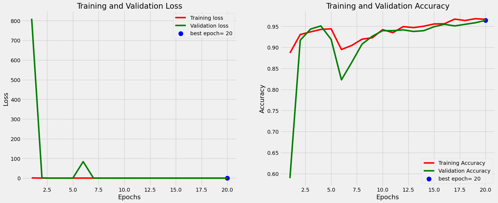
    


## Save Model


```python
from tensorflow.keras.models import save_model

# 保存模型
model_name = "model_efficientnet_DR"
save_path = '/work/home/aojiang/06saved_model/DR_CNN'

# 确保保存路径存在
os.makedirs(save_path, exist_ok=True)

# 保存模型
save_model(model_efficientnet, os.path.join(save_path, model_name))
```

    WARNING:absl:Found untraced functions such as _update_step_xla, _jit_compiled_convolution_op, _jit_compiled_convolution_op, _jit_compiled_convolution_op, _jit_compiled_convolution_op while saving (showing 5 of 95). These functions will not be directly callable after loading.
    

    INFO:tensorflow:Assets written to: /work/home/aojiang/06saved_model/DR_CNN/model_efficientnet_DR/assets
    

    INFO:tensorflow:Assets written to: /work/home/aojiang/06saved_model/DR_CNN/model_efficientnet_DR/assets
    

# Model Transfer Learning : MobileNet


```python
from tensorflow.keras.applications import MobileNet
```


```python
from tensorflow.keras.applications.mobilenet import MobileNet

# 定义输入图像的尺寸，假设为224x224像素
IMAGE_SIZE = [224, 224]

# 假设您已经下载了MobileNet权重文件，并且设置了正确的路径
WEIGHTS_PATH_MOBILENET = '/work/home/aojiang/06download_model/mobilenet_1_0_224_tf_no_top.h5'

# 创建MobileNet模型，不包括顶部的全连接层
# 注意weights参数应设置为None，因为我们将手动加载权重
mobilenet = MobileNet(input_shape=IMAGE_SIZE + [3], include_top=False, weights=None)

# 加载本地权重文件
mobilenet.load_weights(WEIGHTS_PATH_MOBILENET)

# 接下来可以添加额外的层或修改模型
# ...
```


```python
# 如果想运行下面这行命令，需翻墙
#mobilenet = MobileNet(input_shape=IMAGE_SIZE + [3], weights='imagenet', include_top=False)
```


```python
for layer in mobilenet.layers:
    print(layer)
```

    <keras.engine.input_layer.InputLayer object at 0x7f69f00c6350>
    <keras.layers.convolutional.conv2d.Conv2D object at 0x7f6a32feb590>
    <keras.layers.normalization.batch_normalization.BatchNormalization object at 0x7f6a32c37d90>
    <keras.layers.activation.relu.ReLU object at 0x7f6a31bfe9d0>
    <keras.layers.convolutional.depthwise_conv2d.DepthwiseConv2D object at 0x7f6a2b42abd0>
    <keras.layers.normalization.batch_normalization.BatchNormalization object at 0x7f6a3308ea10>
    <keras.layers.activation.relu.ReLU object at 0x7f6a60ea2d90>
    <keras.layers.convolutional.conv2d.Conv2D object at 0x7f69f0405950>
    <keras.layers.normalization.batch_normalization.BatchNormalization object at 0x7f6a60ea2e50>
    <keras.layers.activation.relu.ReLU object at 0x7f6a33834cd0>
    <keras.layers.reshaping.zero_padding2d.ZeroPadding2D object at 0x7f6a3381d710>
    <keras.layers.convolutional.depthwise_conv2d.DepthwiseConv2D object at 0x7f6a809c99d0>
    <keras.layers.normalization.batch_normalization.BatchNormalization object at 0x7f6a809c9550>
    <keras.layers.activation.relu.ReLU object at 0x7f6a81560250>
    <keras.layers.convolutional.conv2d.Conv2D object at 0x7f6a3145e050>
    <keras.layers.normalization.batch_normalization.BatchNormalization object at 0x7f6a33923450>
    <keras.layers.activation.relu.ReLU object at 0x7f69f0428cd0>
    <keras.layers.convolutional.depthwise_conv2d.DepthwiseConv2D object at 0x7f6a310cb8d0>
    <keras.layers.normalization.batch_normalization.BatchNormalization object at 0x7f6a81560f50>
    <keras.layers.activation.relu.ReLU object at 0x7f6a61286cd0>
    <keras.layers.convolutional.conv2d.Conv2D object at 0x7f6a61286610>
    <keras.layers.normalization.batch_normalization.BatchNormalization object at 0x7f6a61286f90>
    <keras.layers.activation.relu.ReLU object at 0x7f6a808e4250>
    <keras.layers.reshaping.zero_padding2d.ZeroPadding2D object at 0x7f6a33879fd0>
    <keras.layers.convolutional.depthwise_conv2d.DepthwiseConv2D object at 0x7f6a808e4290>
    <keras.layers.normalization.batch_normalization.BatchNormalization object at 0x7f6a808e4a90>
    <keras.layers.activation.relu.ReLU object at 0x7f6a801c7110>
    <keras.layers.convolutional.conv2d.Conv2D object at 0x7f6a61286510>
    <keras.layers.normalization.batch_normalization.BatchNormalization object at 0x7f6a605361d0>
    <keras.layers.activation.relu.ReLU object at 0x7f6a80307410>
    <keras.layers.convolutional.depthwise_conv2d.DepthwiseConv2D object at 0x7f6a31276c10>
    <keras.layers.normalization.batch_normalization.BatchNormalization object at 0x7f69b31d3450>
    <keras.layers.activation.relu.ReLU object at 0x7f6a605ca310>
    <keras.layers.convolutional.conv2d.Conv2D object at 0x7f6a80d2b310>
    <keras.layers.normalization.batch_normalization.BatchNormalization object at 0x7f6a2b093d50>
    <keras.layers.activation.relu.ReLU object at 0x7f6a2b0af710>
    <keras.layers.reshaping.zero_padding2d.ZeroPadding2D object at 0x7f6a33196450>
    <keras.layers.convolutional.depthwise_conv2d.DepthwiseConv2D object at 0x7f69b3272950>
    <keras.layers.normalization.batch_normalization.BatchNormalization object at 0x7f69b32726d0>
    <keras.layers.activation.relu.ReLU object at 0x7f6a808df490>
    <keras.layers.convolutional.conv2d.Conv2D object at 0x7f6a2bfc4f50>
    <keras.layers.normalization.batch_normalization.BatchNormalization object at 0x7f6a33879650>
    <keras.layers.activation.relu.ReLU object at 0x7f6a2b087b10>
    <keras.layers.convolutional.depthwise_conv2d.DepthwiseConv2D object at 0x7f6a60501390>
    <keras.layers.normalization.batch_normalization.BatchNormalization object at 0x7f6a3168a990>
    <keras.layers.activation.relu.ReLU object at 0x7f6a316a0290>
    <keras.layers.convolutional.conv2d.Conv2D object at 0x7f6a80954b10>
    <keras.layers.normalization.batch_normalization.BatchNormalization object at 0x7f6a8087fa50>
    <keras.layers.activation.relu.ReLU object at 0x7f6a2b42a450>
    <keras.layers.convolutional.depthwise_conv2d.DepthwiseConv2D object at 0x7f6a785fc550>
    <keras.layers.normalization.batch_normalization.BatchNormalization object at 0x7f6a815bba10>
    <keras.layers.activation.relu.ReLU object at 0x7f6a62021e10>
    <keras.layers.convolutional.conv2d.Conv2D object at 0x7f6a31276fd0>
    <keras.layers.normalization.batch_normalization.BatchNormalization object at 0x7f6a2a6b2a10>
    <keras.layers.activation.relu.ReLU object at 0x7f6a811f6d50>
    <keras.layers.convolutional.depthwise_conv2d.DepthwiseConv2D object at 0x7f6a615879d0>
    <keras.layers.normalization.batch_normalization.BatchNormalization object at 0x7f69b3241c10>
    <keras.layers.activation.relu.ReLU object at 0x7f6a615042d0>
    <keras.layers.convolutional.conv2d.Conv2D object at 0x7f69f0846f50>
    <keras.layers.normalization.batch_normalization.BatchNormalization object at 0x7f69f0846150>
    <keras.layers.activation.relu.ReLU object at 0x7f6a880e9290>
    <keras.layers.convolutional.depthwise_conv2d.DepthwiseConv2D object at 0x7f6a2a6b2e90>
    <keras.layers.normalization.batch_normalization.BatchNormalization object at 0x7f6a8091d150>
    <keras.layers.activation.relu.ReLU object at 0x7f6a331e9390>
    <keras.layers.convolutional.conv2d.Conv2D object at 0x7f6a61504b50>
    <keras.layers.normalization.batch_normalization.BatchNormalization object at 0x7f6a880e9b10>
    <keras.layers.activation.relu.ReLU object at 0x7f6a8806a190>
    <keras.layers.convolutional.depthwise_conv2d.DepthwiseConv2D object at 0x7f6a80b2b690>
    <keras.layers.normalization.batch_normalization.BatchNormalization object at 0x7f6a7831c0d0>
    <keras.layers.activation.relu.ReLU object at 0x7f6a33b1ac90>
    <keras.layers.convolutional.conv2d.Conv2D object at 0x7f6a33b1a110>
    <keras.layers.normalization.batch_normalization.BatchNormalization object at 0x7f6a61598450>
    <keras.layers.activation.relu.ReLU object at 0x7f6b2db55790>
    <keras.layers.reshaping.zero_padding2d.ZeroPadding2D object at 0x7f6a602e3c10>
    <keras.layers.convolutional.depthwise_conv2d.DepthwiseConv2D object at 0x7f6a80c0bc90>
    <keras.layers.normalization.batch_normalization.BatchNormalization object at 0x7f6a61c9b310>
    <keras.layers.activation.relu.ReLU object at 0x7f6b2db520d0>
    <keras.layers.convolutional.conv2d.Conv2D object at 0x7f6a80c05b50>
    <keras.layers.normalization.batch_normalization.BatchNormalization object at 0x7f6a810fb350>
    <keras.layers.activation.relu.ReLU object at 0x7f6a3034e6d0>
    <keras.layers.convolutional.depthwise_conv2d.DepthwiseConv2D object at 0x7f6a625a7910>
    <keras.layers.normalization.batch_normalization.BatchNormalization object at 0x7f6a80c50550>
    <keras.layers.activation.relu.ReLU object at 0x7f6a78218510>
    <keras.layers.convolutional.conv2d.Conv2D object at 0x7f6a33b1a250>
    <keras.layers.normalization.batch_normalization.BatchNormalization object at 0x7f6a33b1ac10>
    <keras.layers.activation.relu.ReLU object at 0x7f6a80b0d0d0>
    


```python
model_mobilenet = Sequential()

model_mobilenet.add(inception)
model_mobilenet.add(Flatten())
model_mobilenet.add(Dropout(0.2))
model_mobilenet.add(Dense(512,activation='relu'))
model_mobilenet.add(Dropout(0.2))
model_mobilenet.add(Dense(2,activation='softmax'))
```


```python
model_mobilenet.summary()
```

    Model: "sequential_7"
    _________________________________________________________________
     Layer (type)                Output Shape              Param #   
    =================================================================
     inception_v3 (Functional)   (None, 5, 5, 2048)        21802784  
                                                                     
     flatten_7 (Flatten)         (None, 51200)             0         
                                                                     
     dropout_14 (Dropout)        (None, 51200)             0         
                                                                     
     dense_14 (Dense)            (None, 512)               26214912  
                                                                     
     dropout_15 (Dropout)        (None, 512)               0         
                                                                     
     dense_15 (Dense)            (None, 2)                 1026      
                                                                     
    =================================================================
    Total params: 48,018,722
    Trainable params: 47,984,290
    Non-trainable params: 34,432
    _________________________________________________________________
    


```python
model_mobilenet.compile(
    optimizer = Adam(learning_rate=0.001), 
    loss='categorical_crossentropy', 
    metrics=['accuracy']
  )
```

**在配置条件为20个核心，100G内存4个加速器的条件下，迭代一轮需要158秒，也就是2分28秒，迭代25轮则需要66分钟，也就是1小时6分钟！**
在配置条件为20个核心，100G内存4个加速器的条件下，从19：14开始运行,20：24到结束，用时1小时10分钟


```python
model_mobilenet_history =model_mobilenet.fit(
  train_set,
  validation_data=validation_set,
  epochs=25,
  steps_per_epoch=len(train_set),
  validation_steps=len(test_set)
)
```

    Epoch 1/25
    65/65 [==============================] - 184s 2s/step - loss: 0.2112 - accuracy: 0.9306 - val_loss: 5.6077 - val_accuracy: 0.9623
    Epoch 2/25
    65/65 [==============================] - 159s 2s/step - loss: 0.2327 - accuracy: 0.9547 - val_loss: 6785.0996 - val_accuracy: 0.5311
    Epoch 3/25
    65/65 [==============================] - 159s 2s/step - loss: 0.1330 - accuracy: 0.9586 - val_loss: 9.1631 - val_accuracy: 0.9492
    Epoch 4/25
    65/65 [==============================] - 159s 2s/step - loss: 0.1348 - accuracy: 0.9547 - val_loss: 0.2363 - val_accuracy: 0.9341
    Epoch 5/25
    65/65 [==============================] - 159s 2s/step - loss: 0.1018 - accuracy: 0.9663 - val_loss: 0.1933 - val_accuracy: 0.9492
    Epoch 6/25
    65/65 [==============================] - 159s 2s/step - loss: 0.1003 - accuracy: 0.9668 - val_loss: 0.1354 - val_accuracy: 0.9529
    Epoch 7/25
    65/65 [==============================] - 158s 2s/step - loss: 0.0948 - accuracy: 0.9706 - val_loss: 0.1233 - val_accuracy: 0.9642
    Epoch 8/25
    65/65 [==============================] - 158s 2s/step - loss: 0.1141 - accuracy: 0.9634 - val_loss: 0.1577 - val_accuracy: 0.9642
    Epoch 9/25
    65/65 [==============================] - 158s 2s/step - loss: 0.0838 - accuracy: 0.9759 - val_loss: 0.5247 - val_accuracy: 0.9567
    Epoch 10/25
    65/65 [==============================] - 159s 2s/step - loss: 0.0772 - accuracy: 0.9759 - val_loss: 0.1727 - val_accuracy: 0.9492
    Epoch 11/25
    65/65 [==============================] - 158s 2s/step - loss: 0.2575 - accuracy: 0.9595 - val_loss: 358.6122 - val_accuracy: 0.8060
    Epoch 12/25
    65/65 [==============================] - 159s 2s/step - loss: 0.1909 - accuracy: 0.9287 - val_loss: 386.9014 - val_accuracy: 0.8418
    Epoch 13/25
    65/65 [==============================] - 159s 2s/step - loss: 0.4526 - accuracy: 0.9513 - val_loss: 129.2936 - val_accuracy: 0.8889
    Epoch 14/25
    65/65 [==============================] - 159s 2s/step - loss: 0.1142 - accuracy: 0.9624 - val_loss: 4.5536 - val_accuracy: 0.9642
    Epoch 15/25
    65/65 [==============================] - 159s 2s/step - loss: 0.1021 - accuracy: 0.9653 - val_loss: 0.1172 - val_accuracy: 0.9680
    Epoch 16/25
    65/65 [==============================] - 159s 2s/step - loss: 0.0945 - accuracy: 0.9706 - val_loss: 0.1016 - val_accuracy: 0.9548
    Epoch 17/25
    65/65 [==============================] - 159s 2s/step - loss: 0.0862 - accuracy: 0.9750 - val_loss: 0.0874 - val_accuracy: 0.9755
    Epoch 18/25
    65/65 [==============================] - 159s 2s/step - loss: 0.0772 - accuracy: 0.9764 - val_loss: 0.1516 - val_accuracy: 0.9642
    Epoch 19/25
    65/65 [==============================] - 158s 2s/step - loss: 0.0890 - accuracy: 0.9706 - val_loss: 0.3445 - val_accuracy: 0.8832
    Epoch 20/25
    65/65 [==============================] - 158s 2s/step - loss: 0.1009 - accuracy: 0.9711 - val_loss: 0.1190 - val_accuracy: 0.9661
    Epoch 21/25
    65/65 [==============================] - 159s 2s/step - loss: 0.0737 - accuracy: 0.9759 - val_loss: 0.1412 - val_accuracy: 0.9623
    Epoch 22/25
    65/65 [==============================] - 158s 2s/step - loss: 0.0657 - accuracy: 0.9783 - val_loss: 0.1925 - val_accuracy: 0.9473
    Epoch 23/25
    65/65 [==============================] - 158s 2s/step - loss: 0.0723 - accuracy: 0.9778 - val_loss: 0.0947 - val_accuracy: 0.9755
    Epoch 24/25
    65/65 [==============================] - 159s 2s/step - loss: 0.0620 - accuracy: 0.9827 - val_loss: 0.1222 - val_accuracy: 0.9623
    Epoch 25/25
    65/65 [==============================] - 159s 2s/step - loss: 0.0538 - accuracy: 0.9812 - val_loss: 0.1028 - val_accuracy: 0.9736
    

## Mobilenet Model Evaluation


```python
# Define needed variables
tr_acc = model_mobilenet_history.history['accuracy']
tr_loss = model_mobilenet_history.history['loss']
val_acc = model_mobilenet_history.history['val_accuracy']
val_loss = model_mobilenet_history.history['val_loss']
index_loss = np.argmin(val_loss)
val_lowest = val_loss[index_loss]
index_acc = np.argmax(val_acc)
acc_highest = val_acc[index_acc]
Epochs = [i+1 for i in range(len(tr_acc))]
loss_label = f'best epoch= {str(index_loss + 1)}'
acc_label = f'best epoch= {str(index_acc + 1)}'

# Plot training history
plt.figure(figsize= (20, 8))
plt.style.use('fivethirtyeight')

plt.subplot(1, 2, 1)
plt.plot(Epochs, tr_loss, 'r', label= 'Training loss')
plt.plot(Epochs, val_loss, 'g', label= 'Validation loss')
plt.scatter(index_loss + 1, val_lowest, s= 150, c= 'blue', label= loss_label)
plt.title('Training and Validation Loss')
plt.xlabel('Epochs')
plt.ylabel('Loss')
plt.legend()


plt.subplot(1, 2, 2)
plt.plot(Epochs, tr_acc, 'r', label= 'Training Accuracy')
plt.plot(Epochs, val_acc, 'g', label= 'Validation Accuracy')
plt.scatter(index_acc + 1 , acc_highest, s= 150, c= 'blue', label= acc_label)
plt.title('Training and Validation Accuracy')
plt.xlabel('Epochs')
plt.ylabel('Accuracy')
plt.legend()

plt.tight_layout
plt.show()
```


    
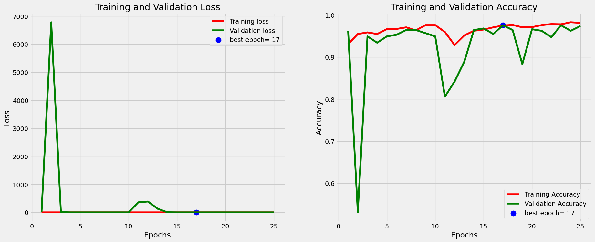
    


## Save Model


```python
from tensorflow.keras.models import save_model

# 保存模型
model_name = "model_mobilenet_DR"
save_path = '/work/home/aojiang/06saved_model/DR_CNN'

# 确保保存路径存在
os.makedirs(save_path, exist_ok=True)

# 保存模型
save_model(model_mobilenet, os.path.join(save_path, model_name))
```

    WARNING:absl:Found untraced functions such as _update_step_xla, _jit_compiled_convolution_op, _jit_compiled_convolution_op, _jit_compiled_convolution_op, _jit_compiled_convolution_op while saving (showing 5 of 95). These functions will not be directly callable after loading.
    

    INFO:tensorflow:Assets written to: /work/home/aojiang/06saved_model/DR_CNN/model_mobilenet_DR/assets
    

    INFO:tensorflow:Assets written to: /work/home/aojiang/06saved_model/DR_CNN/model_mobilenet_DR/assets
    

# Prediction


```python
import numpy as np

def extract_data(generator):
    data_list = []
    labels_list = []
    for _ in range(generator.__len__()):
        data, labels = generator.next()
        data_list.append(data)
        labels_list.append(labels)
    x = np.vstack(data_list)
    y = np.vstack(labels_list)
    return x, y

x_train, y_train = extract_data(train_set)
x_test, y_test = extract_data(validation_set)
```


```python
loss = model_efficientnet.evaluate(x_test,y_test) 
print("Test Acc: " + str(loss[1]))
```

    17/17 [==============================] - 7s 427ms/step - loss: 0.1123 - accuracy: 0.9755
    Test Acc: 0.9755178689956665
    


```python
preds_vgg = model_efficientnet.predict(x_test)
y_pred_vgg = np.argmax(preds_vgg , axis = 1 )
```

    17/17 [==============================] - 9s 431ms/step
    


```python
print(len(x_test))
```

    531
    


```python
label_dict = {0 : 'Diabetic Retinopathy', 1 : 'No Diabetic Retinopathy'}

figure = plt.figure(figsize=(28, 12))
for i, index in enumerate(np.random.choice(x_test.shape[0], size=18)):
    ax = figure.add_subplot(6,3 , i + 1, xticks=[], yticks=[])
    ax.imshow(np.squeeze(x_test[index]))
    predict_index_vgg = label_dict[(y_pred_vgg[index])]
    true_index_vgg = label_dict[np.argmax(y_test,axis=1)[index]]
    
    ax.set_title("{} ({})".format((predict_index_vgg), 
                                  ( true_index_vgg)),
                                  color=("green" if predict_index_vgg == true_index_vgg else "red"))
```


    
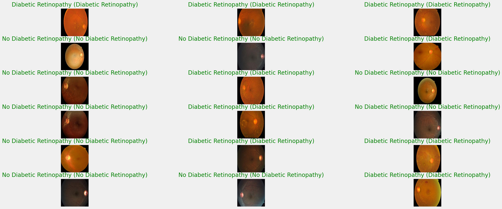
    


```python

```
