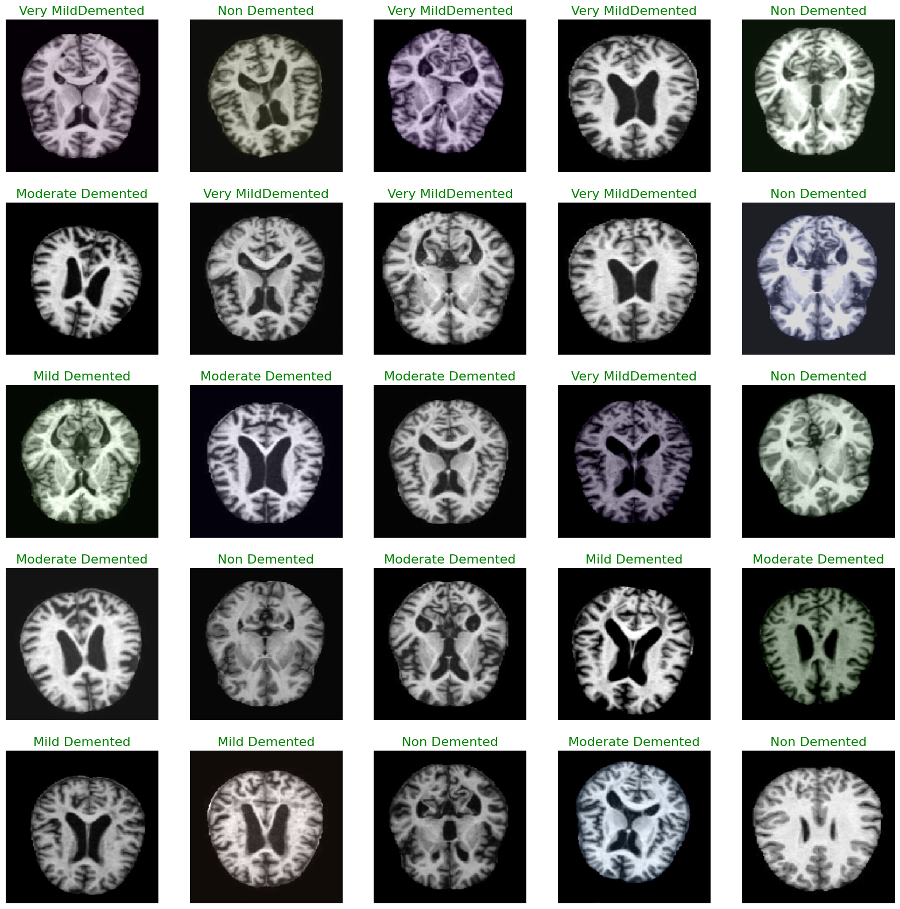

```python
import os
for dirname, _, filenames in os.walk('/kaggle/input'):
    for filename in filenames:
        os.path.join(dirname, filename)
```


```python
import pandas as pd
import numpy as np
import keras
import warnings
warnings.filterwarnings(action="ignore")
import matplotlib.pyplot as plt
%matplotlib inline
import seaborn as sns

from keras.models import Sequential
from keras.layers import Dense, Dropout, Flatten
from keras.layers import Conv2D, MaxPooling2D
from keras import backend as K

from sklearn.preprocessing import StandardScaler
from sklearn.model_selection import train_test_split
from sklearn.metrics import classification_report
import tensorflow as tf
from tensorflow import keras
from tensorflow.keras.models import Sequential
from tensorflow.keras.layers import Conv2D, MaxPooling2D, Flatten, Dense
from tensorflow.keras.applications.vgg19 import VGG19
from tensorflow.keras.optimizers import Adam
from tensorflow.keras.losses import SparseCategoricalCrossentropy
from keras.preprocessing.image import ImageDataGenerator
from tensorflow.keras.callbacks import TensorBoard,EarlyStopping

import sklearn.metrics as metrics
from keras.callbacks import LearningRateScheduler
from keras.preprocessing.image import ImageDataGenerator
annealer = LearningRateScheduler(lambda x: 1e-3 * 0.95 ** x, verbose=0)
```


```python
import os
import pandas as pd

MildDemented_dir = r'/kaggle/input/augmented-alzheimer-mri-dataset/AugmentedAlzheimerDataset/MildDemented'
ModerateDemented_dir = r'/kaggle/input/augmented-alzheimer-mri-dataset/AugmentedAlzheimerDataset/ModerateDemented'
NonDemented_dir = r'/kaggle/input/augmented-alzheimer-mri-dataset/AugmentedAlzheimerDataset/NonDemented'
VeryMildDemented_dir = r'/kaggle/input/augmented-alzheimer-mri-dataset/AugmentedAlzheimerDataset/VeryMildDemented'

filepaths = []
labels = []
dict_list = [MildDemented_dir, ModerateDemented_dir, NonDemented_dir, VeryMildDemented_dir]
class_labels = ['Mild Demented', 'Moderate Demented', 'Non Demented', 'Very MildDemented']

for i, j in enumerate(dict_list):
    flist = os.listdir(j)
    for f in flist:
        fpath = os.path.join(j, f)
        filepaths.append(fpath)
        labels.append(class_labels[i])

Fseries = pd.Series(filepaths, name="filepaths")
Lseries = pd.Series(labels, name="labels")
Alzheimer_data = pd.concat([Fseries, Lseries], axis=1)
Alzheimer_df = pd.DataFrame(Alzheimer_data)
print(Alzheimer_df.head())
print(Alzheimer_df["labels"].value_counts())
```

                                               filepaths         labels
    0  /kaggle/input/augmented-alzheimer-mri-dataset/...  Mild Demented
    1  /kaggle/input/augmented-alzheimer-mri-dataset/...  Mild Demented
    2  /kaggle/input/augmented-alzheimer-mri-dataset/...  Mild Demented
    3  /kaggle/input/augmented-alzheimer-mri-dataset/...  Mild Demented
    4  /kaggle/input/augmented-alzheimer-mri-dataset/...  Mild Demented
    labels
    Non Demented         9600
    Mild Demented        8960
    Very MildDemented    8960
    Moderate Demented    6464
    Name: count, dtype: int64
    


```python
Alzheimer_df.shape
```


    (33984, 2)


```python
train_images, test_images = train_test_split(Alzheimer_df, test_size=0.3, random_state=42)
train_set, val_set = train_test_split(Alzheimer_df, test_size=0.2, random_state=42)
```


```python
print(train_set.shape)
print(test_images.shape)
print(val_set.shape)
print(train_images.shape)
```

    (27187, 2)
    (10196, 2)
    (6797, 2)
    (23788, 2)
    


```python
image_gen = ImageDataGenerator(preprocessing_function= tf.keras.applications.mobilenet_v2.preprocess_input)
train = image_gen.flow_from_dataframe(dataframe= train_set,x_col="filepaths",y_col="labels",
                                      target_size=(244,244),
                                      color_mode='rgb',
                                      class_mode="categorical", #used for Sequential Model
                                      batch_size=32,
                                      shuffle=False            #do not shuffle data
                                     )
test = image_gen.flow_from_dataframe(dataframe= test_images,x_col="filepaths", y_col="labels",
                                     target_size=(244,244),
                                     color_mode='rgb',
                                     class_mode="categorical",
                                     batch_size=32,
                                     shuffle= False
                                    )
val = image_gen.flow_from_dataframe(dataframe= val_set,x_col="filepaths", y_col="labels",
                                    target_size=(244,244),
                                    color_mode= 'rgb',
                                    class_mode="categorical",
                                    batch_size=32,
                                    shuffle=False
                                   )
```

    Found 27187 validated image filenames belonging to 4 classes.
    Found 10196 validated image filenames belonging to 4 classes.
    Found 6797 validated image filenames belonging to 4 classes.
    


```python
classes=list(train.class_indices.keys())
print (classes)
```

    ['Mild Demented', 'Moderate Demented', 'Non Demented', 'Very MildDemented']
    


```python
def show_knee_images(image_gen):
    test_dict = test.class_indices
    classes = list(test_dict.keys())
    images, labels=next(image_gen) # get a sample batch from the generator
    plt.figure(figsize=(20,20))
    length = len(labels)
    if length<25:
        r=length
    else:
        r=25
    for i in range(r):
        plt.subplot(5,5,i+1)
        image=(images[i]+1)/2 #scale images between 0 and 1
        plt.imshow(image)
        index=np.argmax(labels[i])
        class_name=classes[index]
        plt.title(class_name, color="green",fontsize=16)
        plt.axis('off')
    plt.show()
```


```python
show_knee_images(train)
```


    

    


```python
model = keras.models.Sequential([
    keras.layers.Conv2D(filters=128, kernel_size=(8, 8), strides=(3, 3), activation='relu', input_shape=(224, 224, 3)),
    keras.layers.BatchNormalization(),
    
    keras.layers.Conv2D(filters=256, kernel_size=(5, 5), strides=(1, 1), activation='relu', padding="same"),
    keras.layers.BatchNormalization(),
    keras.layers.MaxPool2D(pool_size=(3, 3)),
    
    keras.layers.Conv2D(filters=256, kernel_size=(3, 3), strides=(1, 1), activation='relu', padding="same"),
    keras.layers.BatchNormalization(),
    keras.layers.Conv2D(filters=256, kernel_size=(1, 1), strides=(1, 1), activation='relu', padding="same"),
    keras.layers.BatchNormalization(),
    keras.layers.Conv2D(filters=256, kernel_size=(1, 1), strides=(1, 1), activation='relu', padding="same"),
    keras.layers.BatchNormalization(),
    
    keras.layers.Conv2D(filters=512, kernel_size=(3, 3), activation='relu', padding="same"),
    keras.layers.BatchNormalization(),
    keras.layers.MaxPool2D(pool_size=(2, 2)),
    
    keras.layers.Conv2D(filters=512, kernel_size=(3, 3), activation='relu', padding="same"),
    keras.layers.BatchNormalization(),
    
    keras.layers.Conv2D(filters=512, kernel_size=(3, 3), activation='relu', padding="same"),
    keras.layers.BatchNormalization(),
    
    keras.layers.MaxPool2D(pool_size=(2, 2)),
    
    keras.layers.Conv2D(filters=512, kernel_size=(3, 3), activation='relu', padding="same"),
    keras.layers.BatchNormalization(),
    
    keras.layers.MaxPool2D(pool_size=(2, 2)),
    
    keras.layers.Flatten(),
    keras.layers.Dense(1024, activation='relu'),
    keras.layers.Dropout(0.5),
    keras.layers.Dense(1024, activation='relu'),
    keras.layers.Dropout(0.5),
    keras.layers.Dense(4, activation='softmax')
])

model.compile(
    loss='categorical_crossentropy',
    optimizer=tf.optimizers.SGD(learning_rate=0.001),
    metrics=['accuracy']
)

model.summary()
```

    Model: "sequential"
    _________________________________________________________________
     Layer (type)                Output Shape              Param #   
    =================================================================
     conv2d (Conv2D)             (None, 73, 73, 128)       24704     
                                                                     
     batch_normalization (BatchN  (None, 73, 73, 128)      512       
     ormalization)                                                   
                                                                     
     conv2d_1 (Conv2D)           (None, 73, 73, 256)       819456    
                                                                     
     batch_normalization_1 (Batc  (None, 73, 73, 256)      1024      
     hNormalization)                                                 
                                                                     
     max_pooling2d (MaxPooling2D  (None, 24, 24, 256)      0         
     )                                                               
                                                                     
     conv2d_2 (Conv2D)           (None, 24, 24, 256)       590080    
                                                                     
     batch_normalization_2 (Batc  (None, 24, 24, 256)      1024      
     hNormalization)                                                 
                                                                     
     conv2d_3 (Conv2D)           (None, 24, 24, 256)       65792     
                                                                     
     batch_normalization_3 (Batc  (None, 24, 24, 256)      1024      
     hNormalization)                                                 
                                                                     
     conv2d_4 (Conv2D)           (None, 24, 24, 256)       65792     
                                                                     
     batch_normalization_4 (Batc  (None, 24, 24, 256)      1024      
     hNormalization)                                                 
                                                                     
     conv2d_5 (Conv2D)           (None, 24, 24, 512)       1180160   
                                                                     
     batch_normalization_5 (Batc  (None, 24, 24, 512)      2048      
     hNormalization)                                                 
                                                                     
     max_pooling2d_1 (MaxPooling  (None, 12, 12, 512)      0         
     2D)                                                             
                                                                     
     conv2d_6 (Conv2D)           (None, 12, 12, 512)       2359808   
                                                                     
     batch_normalization_6 (Batc  (None, 12, 12, 512)      2048      
     hNormalization)                                                 
                                                                     
     conv2d_7 (Conv2D)           (None, 12, 12, 512)       2359808   
                                                                     
     batch_normalization_7 (Batc  (None, 12, 12, 512)      2048      
     hNormalization)                                                 
                                                                     
     max_pooling2d_2 (MaxPooling  (None, 6, 6, 512)        0         
     2D)                                                             
                                                                     
     conv2d_8 (Conv2D)           (None, 6, 6, 512)         2359808   
                                                                     
     batch_normalization_8 (Batc  (None, 6, 6, 512)        2048      
     hNormalization)                                                 
                                                                     
     max_pooling2d_3 (MaxPooling  (None, 3, 3, 512)        0         
     2D)                                                             
                                                                     
     flatten (Flatten)           (None, 4608)              0         
                                                                     
     dense (Dense)               (None, 1024)              4719616   
                                                                     
     dropout (Dropout)           (None, 1024)              0         
                                                                     
     dense_1 (Dense)             (None, 1024)              1049600   
                                                                     
     dropout_1 (Dropout)         (None, 1024)              0         
                                                                     
     dense_2 (Dense)             (None, 4)                 4100      
                                                                     
    =================================================================
    Total params: 15,611,524
    Trainable params: 15,605,124
    Non-trainable params: 6,400
    _________________________________________________________________
    


```python
history = model.fit(train, epochs=22, validation_data=val, validation_freq=1)
```

    Epoch 1/22
      3/850 [..............................] - ETA: 3:45:04 - loss: 1.5692 - accuracy: 0.3229


```python
model.evaluate(test, verbose=1)
```


```python
model.save("Osteoporosis_Model_binary.h5")
```


```python
pred = model.predict(test)
pred = np.argmax(pred, axis=1) #pick class with highest  probability

labels = (train.class_indices)
labels = dict((v,k) for k,v in labels.items())
pred2 = [labels[k] for k in pred]
```


```python
plt.plot(history.history['accuracy'])
plt.plot(history.history['val_accuracy'])
plt.title('model accuracy')
plt.ylabel('accuracy')
plt.xlabel('epoch')
plt.legend(['train', 'val'], loc='upper left')
plt.show()
```


```python
plt.plot(history.history['loss'])
plt.plot(history.history['val_loss'])
plt.title('model loss')
plt.ylabel('loss')
plt.xlabel('epoch')
plt.legend(['train', 'val'], loc='upper left')
plt.show()
```


```python
from sklearn.metrics import confusion_matrix, accuracy_score

y_test = test_images.labels # set y_test to the expected output
print(classification_report(y_test, pred2))
print("Accuracy of the Model:","{:.1f}%".format(accuracy_score(y_test, pred2)*100))
```


```python
import matplotlib.pyplot as plt
import seaborn as sns
from sklearn.metrics import confusion_matrix

# Define the class labels
class_labels = ['Mild Demented', 'Moderate Demented', 'Non Demented', 'Very MildDemented']

# Calculate the confusion matrix
cm = confusion_matrix(y_test, pred2)

# Create a figure and plot the confusion matrix as a heatmap
plt.figure(figsize=(10, 5))
sns.heatmap(cm, annot=True, fmt='g', vmin=0, cmap='Blues')

# Set tick labels and axis labels
plt.xticks(ticks=[0.5, 1.5, 2.5, 3.5], labels=class_labels)
plt.yticks(ticks=[0.5, 1.5, 2.5, 3.5], labels=class_labels)
plt.xlabel("Predicted")
plt.ylabel("Actual")

# Set the title
plt.title("Confusion Matrix")

# Show the plot
plt.show()
```


```python

```
