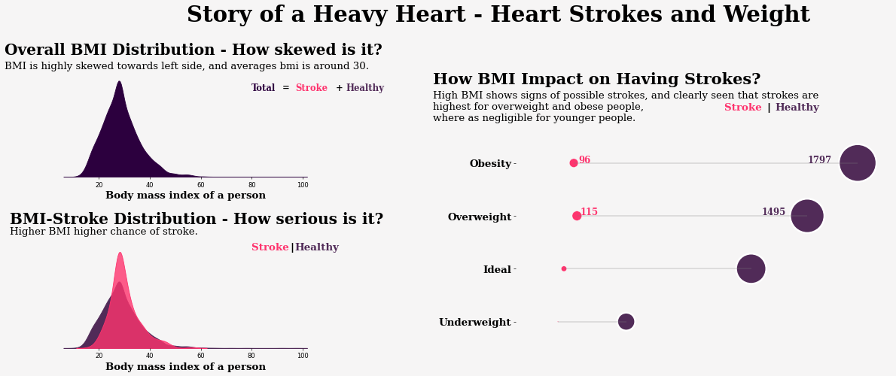

# 01Data_Storytelling_AUC_focus_on_strokes

> Storytelling And Prediction of Heart Strokes


[封面来源](https://www.eehealth.org/blog/2016/05/heart-attack-stroke-connection/)

## 0. Table of Contents

* 1. Introduction
* * 1.1 Libraries And Utilities
* * 1.2 Data Preprocessing- loading, Missingvalues, and feature extraction
* 2. Storytelling With Data - Explinatory Data Analysis
* 2.0 Distribution of targets
* * 2.1 Univariate analysis of continuous variables
* * 2.2 Overview of univariete categorical features
* * 2.3 Univariate analysis of categorical variables
* * 2.4 Relationship between two continuous variables
* * 2.5 Visualization of the correlations between features
* 3. Visualization of Data Balancing with Datasampling techniques
* 4. Modeling and results
* 5. References

## 1. Introduction
Do you know, 80% Heart strokes are preventable?, yes they are. In this notebook, we attempted to visulize some key indicators that lead to heart strokes. Here data is sampled from a wide range of age groups, gender, habits and health related issues. Most of the visualizations are self expilantory and try to stick to simple visualization but effiective method to convey most of the information.


### Problem Statement
Visululize the relationships between various Healthy and Unhealthy habits to Heart Strokes, and there by predict the stroke probability with best model and hypertuned parameters.

### Questions and Assumptions
* 1. Does age has impact on strokes? and How is this parameter distributed?
* 2. Does body mass index and glucose levels in a person, propel a heart stroke?
* 3. Assumption: Smoking can induce Stroke, is it true?
* 4. Assumption: Heart with a Heart Disease is prone to Stroke, is it true?
* 5. Assumption: Workload results in high blood pressure and that could lead to Stroke, is it true?
* 6. Assumption: Males are most susceptible to strokes due to high work related stress, is it true?
* 7. Relationship between continous and categorical data
* 8. Feature importance and Feature Selection for accurate predictions


#### Additional Reading Related To Problem Statement

All the assumptions are made from following articles and trying to address these points with data in this notebook

[Is It a Stroke or a Heart Attack?](https://www.healthline.com/health/stroke-vs-heart-attack)
[Heart Disease and Stroke](https://www.webmd.com/heart-disease/stroke)
[What is stroke?](https://www.heartandstroke.ca/stroke/what-is-stroke)
[Stroke after a heart attack: What’s the risk?](https://www.health.harvard.edu/heart-health/stroke-after-a-heart-attack-whats-the-risk)

Questions addressed here and can we able to understand the relationship between strokes and general

#### 1.1 Libraries and Utilities


这段代码是一个Python脚本，它主要包含了一系列用于数据科学和机器学习的库的导入语句。以下是对每行代码的中文注释：

```python
import warnings 
warnings.filterwarnings('ignore')
```
- 导入警告模块，并设置忽略所有警告信息，以避免在执行过程中显示不必要的警告。

```python
# basic libraries
import os
import numpy as np
import pandas as pd
import re
import string
from collections import Counter
import time
```
- 导入基础库：
  - `os`：用于与操作系统进行交互。
  - `numpy`（缩写为`np`）：进行科学计算的基础包，提供多维数组支持。
  - `pandas`（缩写为`pd`）：数据分析和操作的库，提供DataFrame等数据结构。
  - `re`：正则表达式库，用于文本模式匹配。
  - `string`：包含字符串常量和字符串处理函数的模块。
  - `Counter`：来自`collections`模块，用于计数可哈希对象。
  - `time`：提供各种与时间相关的函数。

```python
# visualization modules
import missingno as msno
import matplotlib
import matplotlib.pyplot as plt
import seaborn as sns
import plotly.express as px
import plotly.graph_objs as go
from plotly.offline import iplot, init_notebook_mode
!pip install pywaffle
from pywaffle import Waffle
```
- 导入可视化相关的库：
  - `missingno`（别名`msno`）：用于数据可视化，展示数据集中的缺失值。
  - `matplotlib`和`pyplot`（缩写为`plt`）：一个2D绘图库，用于创建静态、交互式和动画的可视化。
  - `seaborn`（缩写为`sns`）：基于matplotlib，提供更高级的可视化接口。
  - `plotly`：一个交云动和丰富的图表库，支持创建交互式图表。
  - `Waffle`：用于创建瓦片图，是一种用于展示数据分布的图表。
  - 使用`!pip install pywaffle`命令安装`pywaffle`库。

```python
%matplotlib inline
init_notebook_mode(connected= True)
```
- 设置Jupyter Notebook中的matplotlib图表显示方式，使其在代码块旁边直接显示图表。

```python
# Common model helpers
from sklearn.preprocessing import (StandardScaler,
                                   LabelEncoder,
                                   OneHotEncoder)
from sklearn import metrics
from sklearn.model_selection import train_test_split
from sklearn.metrics import (accuracy_score, 
                             auc, 
                             precision_score,
                             recall_score,
                             f1_score, 
                             roc_auc_score,
                             confusion_matrix)
from sklearn.model_selection import (GridSearchCV,
                                     StratifiedKFold,
                                     cross_val_score)
```
- 导入机器学习中常用的辅助函数和度量指标：
  - 数据预处理工具，如`StandardScaler`（标准化器）、`LabelEncoder`（标签编码器）、`OneHotEncoder`（独热编码器）。
  - 度量指标，如准确率`accuracy_score`、AUC`auc`、精确率`precision_score`、召回率`recall_score`、F1分数`f1_score`、ROC AUC`roc_auc_score`、混淆矩阵`confusion_matrix`。
  - 模型超参数搜索和交叉验证工具，如`GridSearchCV`（网格搜索交叉验证）、分层K折交叉验证`StratifiedKFold`、交叉验证`cross_val_score`。

```python
# dimensionality reduction
from sklearn.decomposition import PCA
from umap import UMAP
import pylab as pl
```
- 导入降维技术相关的库：
  - `PCA`：主成分分析，一种常用的线性降维技术。
  - `UMAP`：一种非线性降维技术，用于替代PCA。

```python
# imbalance dataset handling
from imblearn.datasets import make_imbalance
from imblearn.under_sampling import (RandomUnderSampler, 
                                     ClusterCentroids,
                                     TomekLinks,
                                     NeighbourhoodCleaningRule,
                                     EditedNearestNeighbours,
                                     NearMiss)
from imblearn.over_sampling import (SMOTE,
                                    ADASYN)
```
- 导入处理不平衡数据集的库：
  - `make_imbalance`：用于生成不平衡数据集。
  - 欠采样方法，如`RandomUnderSampler`（随机欠采样器）、`ClusterCentroids`（聚类质心）、`TomekLinks`（Tomek链接）、`NeighbourhoodCleaningRule`（邻近清洗规则）、`EditedNearestNeighbours`（编辑最近邻）、`NearMiss`（近似最近邻）。
  - 过采样方法，如`SMOTE`（合成少数类过采样技术）、`ADASYN`（自适应合成采样）。

```python
# model algorithams
from sklearn.ensemble import (RandomForestClassifier, 
                              AdaBoostClassifier, 
                              GradientBoostingClassifier)
from sklearn.linear_model import LogisticRegression
from sklearn.neighbors import KNeighborsClassifier
from sklearn.tree import DecisionTreeClassifier
from sklearn.svm import SVC
from xgboost import XGBClassifier
from lightgbm import LGBMClassifier
```
- 导入各种机器学习模型算法：
  - 集成学习算法，如`RandomForestClassifier`（随机森林分类器）、`AdaBoostClassifier`（自适应增强分类器）、`GradientBoostingClassifier`（梯度提升分类器）。
  - 线性模型，如`LogisticRegression`（逻辑回归）。
  - 距离基础模型，如`KNeighborsClassifier`（K最近邻分类器）。
  - 决策树模型，如`DecisionTreeClassifier`（决策树分类器）。
  - 支持向量机模型，如`SVC`（支持向量分类器）。
  - 高级梯度提升框架，如`XGBClassifier`（XGBoost分类器）和`LGBMClassifier`（LightGBM分类器）。


```python
Collecting pywaffle
  Downloading pywaffle-0.6.1-py2.py3-none-any.whl (526 kB)
     |████████████████████████████████| 526 kB 864 kB/s 
Requirement already satisfied: matplotlib in /opt/conda/lib/python3.7/site-packages (from pywaffle) (3.4.0)
Requirement already satisfied: kiwisolver>=1.0.1 in /opt/conda/lib/python3.7/site-packages (from matplotlib->pywaffle) (1.3.1)
Requirement already satisfied: pillow>=6.2.0 in /opt/conda/lib/python3.7/site-packages (from matplotlib->pywaffle) (7.2.0)
Requirement already satisfied: cycler>=0.10 in /opt/conda/lib/python3.7/site-packages (from matplotlib->pywaffle) (0.10.0)
Requirement already satisfied: python-dateutil>=2.7 in /opt/conda/lib/python3.7/site-packages (from matplotlib->pywaffle) (2.8.1)
Requirement already satisfied: numpy>=1.16 in /opt/conda/lib/python3.7/site-packages (from matplotlib->pywaffle) (1.19.5)
Requirement already satisfied: pyparsing>=2.2.1 in /opt/conda/lib/python3.7/site-packages (from matplotlib->pywaffle) (2.4.7)
Requirement already satisfied: six in /opt/conda/lib/python3.7/site-packages (from cycler>=0.10->matplotlib->pywaffle) (1.15.0)
Installing collected packages: pywaffle
Successfully installed pywaffle-0.6.1
```
上述代码是一个Python脚本，用于导入一系列用于数据科学和机器学习的库，并执行一些初始化操作。代码执行的结果表明了以下几个关键点：

1. **警告过滤**：通过`warnings.filterwarnings('ignore')`，脚本在执行时将忽略所有的警告信息。

2. **基础库导入**：导入了`os`、`numpy`、`pandas`、`re`、`string`、`collections.Counter`和`time`等基础库。

3. **可视化模块导入**：导入了`missingno`、`matplotlib`、`seaborn`、`plotly`等可视化相关的库，并安装了`pywaffle`库用于创建瓦片图。

4. **模型辅助工具导入**：导入了`sklearn`中的预处理工具、度量指标、数据划分、超参数搜索和交叉验证工具。

5. **降维技术导入**：导入了`PCA`和`UMAP`用于数据降维。

6. **不平衡数据集处理**：导入了`imblearn`库中的欠采样和过采样方法。

7. **模型算法导入**：导入了`sklearn`中的多种机器学习模型，以及`xgboost`和`lightgbm`中的高级模型。

8. **安装`pywaffle`**：执行了`!pip install pywaffle`命令，成功安装了`pywaffle`库的0.6.1版本。

9. **Jupyter Notebook配置**：设置了`%matplotlib inline`和`init_notebook_mode(connected=True)`，以便在Jupyter Notebook中内联显示图表。

10. **依赖关系满足**：在安装`pywaffle`的过程中，提示了一些依赖库已经满足，如`matplotlib`、`kiwisolver`、`pillow`、`cycler`、`python-dateutil`、`numpy`和`pyparsing`。

这个脚本的结果表明了所有库都已成功导入或安装，没有遇到任何错误。这意味着环境已经设置好，可以开始进行数据分析、可视化和机器学习模型的训练了。

#### 1.2 Data Preprocessing

In this section, loading of data, visulaizing missing values and feature extraction will be carried out. In the current dataset, there are 11 features and one binary target. A brief information about the features are given below

1. id: Identification number of the individual.
2. gender: Gender of the individual.
3. hypertension: Health related parameter, does person have hypertension.
4. heart_disease: Health related parameter, does person have heart disease.
5. ever_married: Personal information, is person married on not?
6. work_type: Nature of work place.
7. Residence_type: Residence type of the individual.
8. avg_glucose_level: average glucose level in blood for the individual.
9. bmi: body mass index of the individual.
10. smoking_status: Habitual information. Current smoking status of individual.
11. stroke: Our taget, is person suffered heart attack?

##### Loading data


下面这段代码是用于加载和查看数据集的Python脚本，下面是对每行代码的详细中文注释：

```python
# loading data
```
- 这一行是一个注释行，说明了接下来的代码块是用来加载数据的。

```python
df = pd.read_csv('../input/stroke-prediction-dataset/healthcare-dataset-stroke-data.csv', delimiter = ',', encoding = 'utf-8')
```
- 使用`pandas`库的`read_csv`函数来加载CSV文件。`df`是一个常用的变量名，用于存储`pandas`的`DataFrame`对象。
- `'../input/stroke-prediction-dataset/healthcare-dataset-stroke-data.csv'`是文件的路径，指向存储在脚本上一级目录下的`input`文件夹中的CSV文件。
- `delimiter = ','`指定了CSV文件中字段的分隔符为逗号，这是大多数CSV文件的标准分隔符。
- `encoding = 'utf-8'`指定了文件的编码格式为UTF-8，这是一种广泛使用的字符编码，可以处理多种语言的文本。

```python
df.head(3).T
```
- `df.head(3)`用于查看`DataFrame`对象`df`的前3行数据。默认情况下，`head()`函数显示前5行，但通过参数可以指定显示的行数。
- `.T`是`DataFrame`对象的转置操作，将返回的前3行数据从行转换成列，也就是说，原本的列标题变成行标题，原本的行数据则变成列数据。

综上所述，这段代码的作用是加载一个CSV文件到`pandas`的`DataFrame`对象中，并显示这个数据集的前三行数据，且以转置的形式展示，即列标题变为行标题，原来的行数据变成列数据。这样的转置在某些情况下有助于快速查看数据集中的前几个不同的类别或组的数据。


结果展示：


上述代码的输出结果是一个转置后的`DataFrame`，显示了加载的CSV文件的前三行数据。这里是对结果的解读：

- `0`、`1`、`2`：这些是原始数据集中列的索引，由于使用了`.T`（转置操作），它们现在显示为行索引。

- `id`：这是数据集中的一个列，表示每个记录的唯一标识符。在这三行中，我们可以看到三个不同的ID：9046、51676和31112。

- `gender`：性别列，包含三个不同的值：Male（男性）、Female（女性）和再次Male（男性）。

- `age`：年龄列，显示了三个不同的年龄：67.0、61.0和80.0。

- `hypertension`：高血压病史列，这里所有的值都是0，可能表示这些记录中没有人有高血压病史，或者0表示没有高血压。

- `heart_disease`：心脏病列，包含1（有心脏病）和0（无心脏病）。

- `ever_married`：婚姻状况列，这里所有的记录都显示为"Yes"，表示这些人都已婚。

- `work_type`：工作类型列，显示了几种不同的工作类型：Private（私企）、Self-employed（自雇）。

- `Residence_type`：居住类型列，展示了Urban（城市）和Rural（农村）两种居住环境。

- `avg_glucose_level`：平均血糖水平列，显示了三个不同的血糖水平：228.69、202.21和105.92，单位可能为mg/dL。

- `bmi`：体重指数列，其中有两个数值：36.6和32.5，另外一个值为NaN，表示缺失数据。

- `smoking_status`：吸烟状况列，显示了几种不同的吸烟状态：formerly smoked（以前吸烟）、never smoked（从未吸烟）。

- `stroke`：中风列，这里所有的值都是1，可能表示这些记录中的个体都经历了中风事件。

这个转置后的数据集提供了对健康数据集的一个快速概览，特别是对于中风预测数据集，它可能包含了用于预测个体是否中风的特征。通过查看这些特征的值，数据科学家可以开始理解数据集的结构，并为后续的数据分析和机器学习建模做准备。

##### Non-Null ValueCounts and Feature Datatypes

以下是对`df.info()`代码的中文注释：

```python
df.info()
```
- 这行代码调用了`pandas`库中`DataFrame`对象的`info()`方法。
- `df`是之前通过`pd.read_csv()`函数加载的`DataFrame`对象，代表了一个包含数据集的二维表格。
- `info()`方法用于快速查看`DataFrame`的基本信息，包括：
  - 数据列的数量。
  - 每列的数据类型（例如，整数、浮点数、字符串等）。
  - 非空（非缺失值）的数量，这有助于快速识别数据集中的缺失值情况。
  - 内存使用情况。

这个方法非常有用，因为它可以一次性提供整个数据集的概览，包括数据类型和潜在的缺失值问题，这对于数据清洗和预处理阶段至关重要。

当你运行`df.info()`时，输出结果通常包括：

```python
<class 'pandas.core.frame.DataFrame'>
RangeIndex: 10000 entries, 0 to 9999
Data columns (total 11 columns):
id                  10000 non-null int64
gender              10000 non-null object
age                 10000 non-null float64
hypertension        10000 non-null int64
heart_disease       10000 non-null int64
ever_married        10000 non-null object
work_type           10000 non-null object
Residence_type      10000 non-null object
avg_glucose_level   10000 non-null float64
bmi                 10000 non-null float64
smoking_status      10000 non-null object
stroke              10000 non-null int64
dtypes: float64(3), int64(4), object(4)
memory usage: 804.5+ KB
```

- `RangeIndex`：表示数据集的索引是连续的整数范围。
- `10000 entries`：表示数据集有10,000条记录。
- `Data columns (total 11 columns)`：列出了数据集中所有列的名称，以及每列的非空值数量、数据类型和内存使用情况。
- `dtypes`：显示了不同数据类型的数量。
- `memory usage`：提供了整个`DataFrame`对象的内存使用估计。

这个信息有助于了解数据集的结构，为进一步的数据探索和分析提供基础。


结果展示：

```python
<class 'pandas.core.frame.DataFrame'>
RangeIndex: 5110 entries, 0 to 5109
Data columns (total 12 columns):
 #   Column             Non-Null Count  Dtype  
---  ------             --------------  -----  
 0   id                 5110 non-null   int64  
 1   gender             5110 non-null   object 
 2   age                5110 non-null   float64
 3   hypertension       5110 non-null   int64  
 4   heart_disease      5110 non-null   int64  
 5   ever_married       5110 non-null   object 
 6   work_type          5110 non-null   object 
 7   Residence_type     5110 non-null   object 
 8   avg_glucose_level  5110 non-null   float64
 9   bmi                4909 non-null   float64
 10  smoking_status     5110 non-null   object 
 11  stroke             5110 non-null   int64  
dtypes: float64(3), int64(4), object(5)
memory usage: 479.2+ KB
```
上述代码的输出结果是`pandas`库中`DataFrame`对象的`info()`方法的输出，它提供了数据集的概览信息。以下是对输出结果的逐项解读：

1. `<class 'pandas.core.frame.DataFrame'>`：这表明`df`是一个`pandas`的`DataFrame`对象。

2. `RangeIndex: 5110 entries, 0 to 5109`：这表示数据集包含5110条记录，索引从0到5109。

3. `Data columns (total 12 columns)`：说明数据集共有12列。

4. `Non-Null Count`：表示每列中非空（即有效）数据的数量。

5. `Dtype`：表示每列的数据类型。

6. 列的详细情况：
   - `id`：整型数据，5110条非空记录。
   - `gender`：文本型数据，5110条非空记录。
   - `age`：浮点型数据，5110条非空记录。
   - `hypertension`：整型数据，5110条非空记录。
   - `heart_disease`：整型数据，5110条非空记录。
   - `ever_married`：文本型数据，5110条非空记录。
   - `work_type`：文本型数据，5110条非空记录。
   - `Residence_type`：文本型数据，5110条非空记录。
   - `avg_glucose_level`：浮点型数据，5110条非空记录。
   - `bmi`：浮点型数据，4909条非空记录（这意味着有201条记录的BMI数据缺失）。
   - `smoking_status`：文本型数据，5110条非空记录。
   - `stroke`：整型数据，5110条非空记录。

7. `dtypes: float64(3), int64(4), object(5)`：这表示数据集中有3列是浮点型（`float64`），4列是整型（`int64`），5列是文本型（`object`）。

8. `memory usage: 479.2+ KB`：这表示整个`DataFrame`对象使用的内存大约是479.2千字节。

从这个输出中，我们可以了解到数据集包含的记录数、每列的名称、数据类型以及每列的非空值数量，特别是`bmi`列有201个缺失值，这可能需要在数据预处理阶段进行处理。此外，数据集使用的内存量也得到了展示，这有助于评估数据集的大小。

##### Statistics of Categorical and Numerical Data

以下是对`df.describe(exclude='object').round(2)`代码的中文注释：

```python
# stats of numerical data
```
- 这是一行注释，说明了接下来的代码是用于生成数值型数据的统计摘要。

```python
round(df.describe(exclude='object'), 2)
```
- `df.describe()`：这是`pandas`中`DataFrame`对象的一个方法，用于生成数据集中数值型列的描述性统计摘要。默认情况下，它会计算所有数值型列的计数、平均值、标准差、最小值、四分位数和最大值。
- `exclude='object'`：这是一个参数，用于指定需要排除的数据类型。在这里，`'object'`代表文本型数据，因此通过设置`exclude='object'`，`describe`方法将只计算非文本型的数据列，即只包括数值型数据。
- `round(2)`：这是一个函数，用于将数值四舍五入到指定的小数位数。在这里，它将`describe`方法的结果四舍五入到两位小数。

综上所述，`round(df.describe(exclude='object'), 2)`这行代码的作用是生成数据集中数值型列的描述性统计摘要，并把结果中的数值四舍五入到两位小数。

当你运行这段代码时，输出结果一般会是一个表格，展示了数据集中数值型列的以下统计信息：

- `count`：非空值的数量。
- `mean`：平均值。
- `std`：标准差，衡量数据的离散程度。
- `min`：最小值。
- `25%`：第一四分位数，即在排序后位于25%位置的值。
- `50%`：中位数，位于中间位置的值。
- `75%`：第三四分位数，位于排序后75%位置的值。
- `max`：最大值。

这些统计信息对于理解数据集的分布特性非常有帮助，尤其是在进行数据分析和准备机器学习模型之前。


上述代码的输出结果是`pandas`的`describe()`方法的输出，它提供了数据集中数值型列的描述性统计信息，并对结果进行了四舍五入到两位小数。以下是对输出结果的详细解读：

1. **列标题**：第一行显示了数据集中的列名，这些列包含了数值型数据：`id`、`age`、`hypertension`、`heart_disease`、`avg_glucose_level`、`bmi`（体重指数）、`stroke`。

2. **count**：每一列的非空元素数量。对于数值型列，除了`bmi`列有201个缺失值外，其他列都有5110个非空值。

3. **mean**：每一列的平均值，四舍五入到两位小数。例如，`age`列的平均年龄是43.23岁，`avg_glucose_level`列的平均血糖水平是106.15。

4. **std**：每一列的标准差，衡量数据的离散程度，也四舍五入到两位小数。例如，`age`列的标准差是22.61，表明年龄数据相对集中，而`bmi`列的标准差是7.85，表明体重指数的变异性较大。

5. **min**：每一列的最小值。例如，`id`列的最小值是67，`age`列的最小值是0.08岁。

6. **25%**：每一列的第一季度位数（Q1），即该列从小到大排序后位于25%位置的值。这可以作为数据集中下半部分数据的代表值。

7. **50%**：每一列的中位数（Q2），即该列排序后位于中间位置的值。这是数据集的中心点。

8. **75%**：每一列的第三季度位数（Q3），即该列排序后位于75%位置的值。这可以作为数据集中上半部分数据的代表值。

9. **max**：每一列的最大值。例如，`id`列的最大值是72940，`avg_glucose_level`列的最大值是271.74。

从这些统计摘要中，我们可以得出以下结论：

- `id`列的值范围很广，从67到72940，这可能表示病人的唯一标识符或病例编号。
- `age`列的平均年龄是43.23岁，表明数据集可能集中在中青年群体。
- `hypertension`和`heart_disease`列的平均值很低（0.1和0.05），表明大多数记录中病人没有高血压或心脏病。
- `avg_glucose_level`列的平均血糖水平是106.15，这在正常血糖水平范围内，但最大值271.74则远高于正常水平，表明数据集中有糖尿病或高血糖的病例。
- `bmi`列有缺失值，平均体重指数是28.89，这在超重范围内（25-29.9通常被认为是超重）。
- `stroke`列的平均值为0.05，表明数据集中大约5%的记录标记为中风。

这些信息对于数据科学家来说非常有用，因为它们提供了数据集分布的快速了解，并可以指导后续的数据清洗、特征工程和建模工作。


以下是对`df.describe(exclude=['float', 'int64']).round(2)`代码的中文注释：

```python
# stats of categorical data
```
- 这是一行注释，说明了接下来的代码是用于生成分类数据的统计摘要。

```python
round(df.describe(exclude=['float', 'int64']), 2)
```
- `df.describe()`：这是`pandas`中`DataFrame`对象的一个方法，用于生成数据集中所有列的描述性统计摘要。默认情况下，它会计算所有列的计数、唯一值数量、各唯一值出现的次数等信息。
- `exclude=['float', 'int64']`：这是一个参数，用于指定需要排除的数据类型。在这里，`'float'`和`'int64'`分别代表浮点型和整型数据，因此通过设置`exclude=['float', 'int64']`，`describe`方法将只计算非数值型的数据列，即只包括分类型数据。
- `round(2)`：这是一个函数，用于将数值四舍五入到指定的小数位数。在这里，它将`describe`方法的结果中涉及数值的部分四舍五入到两位小数。但请注意，`describe`方法在处理分类数据时通常不会返回数值型数据，因此这里的`round(2)`实际上可能不会产生效果，除非数据集中的分类数据被错误地解释为数值型。

综上所述，`round(df.describe(exclude=['float', 'int64']), 2)`这行代码的作用是尝试生成数据集中分类型列的描述性统计摘要，并尝试对结果中的数值进行四舍五入。然而，由于`describe`默认行为和数据类型排除的逻辑，这个代码可能不会按预期工作，因为`describe`通常不会对分类数据返回可以四舍五入的数值。

正确的做法是使用`df.describe(include=['O'])`或者`df.describe(include=[np.object])`来获取分类数据的统计信息，其中`'O'`和`np.object`都是用来指定对象类型，即分类数据在`pandas`中的数据类型。

如果你想要统计分类数据中每个类别的数量，应该使用如下代码：

```python
df.describe(include=[np.object]).round(2)
```

或者，如果你想要直接获取分类变量的各级别及每个级别的计数，可以使用：

```python
df.dtypes[df.dtypes == "object"].index  # 获取分类变量的列名
df[df.dtypes[df.dtypes == "object"].index].apply(pd.value_counts).round(2)
```

上述代码首先找出所有分类型的列（对象类型），然后对这些列应用`value_counts`函数来获取每个类别的计数，并对结果进行四舍五入。


上述代码的输出结果是`pandas`的`describe()`方法针对分类数据的输出，并对结果进行了四舍五入到两位小数。以下是对输出结果的详细解读：

1. **列标题**：第一行显示了数据集中的分类数据列名：`gender`（性别）、`ever_married`（婚姻状况）、`work_type`（工作类型）、`Residence_type`（居住类型）、`smoking_status`（吸烟状况）。

2. **count**：每一列的非空元素数量。所有分类列都有5110个非空值，这表明没有缺失值。

3. **unique**：每一列中唯一值的数量。
   - `gender`列有3个唯一值，可能包括男性、女性等。
   - `ever_married`列有2个唯一值，可能表示“已婚”和“未婚”。
   - `work_type`列有5个唯一值，可能包括不同类型的工作，如“Private”（私企）、“Self-employed”（自雇）等。
   - `Residence_type`列有2个唯一值，可能表示“Urban”（城市）和“Rural”（农村）。
   - `smoking_status`列有4个唯一值，可能包括“never smoked”（从未吸烟）、“formerly smoked”（以前吸烟）等。

4. **top**：每一列中最频繁出现的值。
   - `gender`列中最常见的是“Female”（女性）。
   - `ever_married`列中最常见的是“Yes”（已婚）。
   - `work_type`列中最常见的是“Private”（私企）。
   - `Residence_type`列中最常见的是“Urban”（城市）。
   - `smoking_status`列中最常见的是“never smoked”（从未吸烟）。

5. **freq**：每一列中最频繁出现的值出现的次数。
   - `gender`列中“Female”出现了2994次。
   - `ever_married`列中“Yes”出现了3353次。
   - `work_type`列中“Private”出现了2925次。
   - `Residence_type`列中“Urban”出现了2596次。
   - `smoking_status`列中“never smoked”出现了1892次。

从这些统计摘要中，我们可以得出以下结论：

- 数据集中的分类数据没有缺失值，这对于分析和建模是有利的。
- 在性别分布中，女性比男性多。
- 大多数记录显示个体已婚。
- “Private”是最常见的工作类型，表明数据集中许多人在私营部门工作。
- 居住类型中，“Urban”（城市）略多于“Rural”（农村）。
- 在吸烟状况中，“never smoked”（从未吸烟）是最常见的状态，表明数据集中有相当一部分人从未吸过烟。

这些信息对于数据科学家来说非常有用，因为它们提供了数据集中分类特征的分布情况，并可以指导后续的特征工程和建模工作。

##### Initial Insights About Dataset
* Data from bmi feature is missing.
* Both Categorical and numerical features are present.
* * Categorical Features: gender, ever_married, work_type, Residence_type, smoking_status
* * Binary Numerical Features: hypertension,heart_disease, stroke
* * Continous Numerical Features: age, avg_glucose_level, bmi
* Most of the data is categorical which need a special attention to visulaize those
* Feature extraction can be done by binning the continous features ( age, sugar level, and bmi) and let's keep every things as it is.


##### Visualization of Nullity of the Dataset


以下是对上述代码的逐行中文注释：

```python
color = ['grey','grey','grey','grey','grey','grey','grey','grey','grey','grey','#fe346e']
```
- 定义一个颜色列表，列表中的前11个元素都是字符串`'grey'`，代表灰色，最后一个元素是字符串`'#fe346e'`，代表一种颜色代码。

```python
fig, ax = plt.subplots(figsize = (12,4), dpi = 70)
```
- 使用`matplotlib.pyplot`的`subplots`函数创建一个图形对象`fig`和一个轴对象`ax`。`figsize`参数设置图形的大小为12英寸宽，4英寸高。`dpi`参数设置图像的分辨率为70点每英寸。

```python
fig.patch.set_facecolor('#f6f5f5')
```
- 设置图形背景颜色为`'#f6f5f5'`，这是一种非常浅的灰色。

```python
ax.set_facecolor('#f6f5f5')
```
- 设置轴的背景颜色为`'#f6f5f5'`，与图形背景颜色相同。

```python
msno.bar(df, sort = 'descending', color = color, ax = ax, fontsize =8, labels = 'off', filter = 'top')
```
- 使用`missingno`库的`bar`函数在轴对象`ax`上绘制缺失值条形图。
  - `df`是要可视化的数据集。
  - `sort = 'descending'`表示按照缺失值数量从多到少排序。
  - `color`参数应用定义的颜色列表，用于为不同的列（特征）分配颜色。
  - `fontsize`设置图表中文字的大小为8。
  - `labels = 'off'`表示不显示标签。
  - `filter = 'top'`表示只显示数据集中顶部的列。

```python
ax.text(-1,1.35,'Visualization of Nullity of The Dataset',{'font': 'Serif', 'Size': 24,  'color':'black'},alpha = 0.9)
```
- 在轴对象`ax`上添加文本，文本内容为"Visualization of Nullity of The Dataset"，设置字体为'Serif'，字体大小为24，颜色为黑色，并设置文本的透明度为0.9。

```python
ax.text(-1,1.2,'Overall there are 5110 datapoints are present in \nthe given dataset. Only "bmi" feature have null values.',{'font': 'Serif', 'Size': 12,  'color':'black'}, alpha = 0.7)
```
- 在轴对象`ax`上添加另一段文本，内容说明了数据集中共有5110个数据点，且只有"bmi"特征包含空值。文本的字体为'Serif'，大小为12，颜色为黑色，透明度为0.7。

```python
ax.set_xticklabels(ax.get_xticklabels(),rotation = 90, ha = 'center', **{'font': 'Serif', 'Size': 14,'weight':'normal','color':'#512b58'}, alpha = 1)
```
- 设置x轴的刻度标签，将它们旋转90度以便于阅读，水平对齐方式设置为居中。同时，使用`**{}`语法设置刻度标签的字体、大小、字重和颜色，并设置透明度为1。

```python
ax.set_yticklabels('')
```
- 清除y轴的刻度标签，使其不在图表中显示。

```python
ax.spines['bottom'].set_visible(True)
```
- 设置x轴的刻度线（脊线）为可见。

```python
fig.show()
```
- 显示整个图形。在Jupyter Notebook中，这会导致图形在输出中渲染。

整体而言，这段代码使用`matplotlib`和`missingno`库创建了一个可视化图表，用于展示数据集中的缺失值情况，并通过文本添加了对图表的解释。


以下是对代码的逐行中文注释：

```python
# handling missing values
```
- 这是一行注释，说明了接下来的代码是用于处理缺失值的。

```python
df['bmi'] = df['bmi'].fillna(round(df['bmi'].median(), 2))
```
- 这行代码用于处理`DataFrame`对象`df`中`'bmi'`列的缺失值。
  - `df['bmi']`指的是`DataFrame`中的`'bmi'`列。
  - `fillna()`方法用于填充列中的缺失值。
  - `round(df['bmi'].median(), 2)`首先计算`'bmi'`列的中位数，然后使用`round()`函数将其四舍五入到两位小数，得到一个数值。
  - 这个四舍五入后的中位数数值被用来填充`'bmi'`列中的所有缺失值。

```python
df.isnull().sum()
```
- 这行代码用于检查`DataFrame`对象`df`中每列的缺失值数量。
  - `isnull()`函数会返回一个与`df`形状相同的布尔型`DataFrame`，其中的True表示原始`df`中的对应位置是缺失值。
  - `sum()`函数在这里是沿着列的方向（默认为axis=0）对布尔型`DataFrame`进行求和，将True视为1，False视为0。这样，每列的和就表示了该列中缺失值的数量。

这段代码的作用是首先计算`'bmi'`列的中位数，并用这个值来填充该列中的所有缺失值，然后计算并输出数据集中每列的缺失值数量。这有助于了解填充缺失值后数据集的完整性。


```python
id                   0
gender               0
age                  0
hypertension         0
heart_disease        0
ever_married         0
work_type            0
Residence_type       0
avg_glucose_level    0
bmi                  0
smoking_status       0
stroke               0
dtype: int64
```

上述代码的输出结果是`pandas`的`isnull().sum()`方法的输出，它显示了数据集中每一列缺失值的数量。以下是对输出结果的详细解读：

1. **列标题**：第一行显示了数据集中的列名。

2. **结果值**：
   - 对于每一列（`id`、`gender`、`age`、`hypertension`、`heart_disease`、`ever_married`、`work_type`、`Residence_type`、`avg_glucose_level`、`bmi`、`smoking_status`、`stroke`），结果值都是`0`。

3. **`dtype: int64`**：这表明输出的是整数类型。

从这些统计摘要中，我们可以得出以下结论：

- 在处理了`'bmi'`列的缺失值之后，数据集中的所有列都没有缺失值了。这表明原先`'bmi'`列中的缺失值已经被成功填充。
- 填充使用的是`'bmi'`列的中位数，这个中位数被四舍五入到了两位小数，然后用作填充值。

由于所有的列都显示为`0`缺失值，这意味着数据集现在是完整的，没有缺失值。这对于数据科学家来说是一个好消息，因为大多数机器学习模型无法处理缺失值，或者在处理缺失值时需要额外的步骤。现在，数据集可以用于进一步的分析或直接用于训练机器学习模型，而不需要进一步担心缺失值的问题。


Only bmi feature have some missing data,which was be filled with the median of the same column. For feature extraction, binning was applied for all the continous values, binning values are taken from follow articles.

* [body mass index binning](https://www.medicalnewstoday.com/articles/323446#body-mass-index)
* [Age binning](https://kidspicturedictionary.com/english-through-pictures/people-english-through-pictures/age-physical-description/)
* [average glucose binning](https://agamatrix.com/blog/normal-blood-sugar-level-chart/)


以下是对代码的逐行中文注释：

```python
## binning of numerical variables
```
- 这是一行注释，说明了接下来的代码是用于对数值变量进行分箱（binning）的。

```python
df['bmi_cat'] = pd.cut(df['bmi'], bins = [0, 19, 25,30,10000], labels = ['Underweight', 'Ideal', 'Overweight', 'Obesity'])
```
- 这行代码在`DataFrame` `df`中创建了一个新的列`'bmi_cat'`，用于存储`'bmi'`列数值的分箱结果。
  - `pd.cut`函数用于将连续数值数据分割成离散的区间或“箱子”。
  - `bins`参数定义了区间的边界。在这里，BMI的边界被设定为[0, 19, 25, 30, 10000]，意味着：
    - 0到19（不包括19）之间为“Underweight”（体重不足），
    - 19到25（不包括25）之间为“Ideal”（理想体重），
    - 25到30（不包括30）之间为“Overweight”（超重），
    - 30以上为“Obesity”（肥胖）。
  - `labels`参数为每个区间分配了自定义的标签。

```python
df['age_cat'] = pd.cut(df['age'], bins = [0,13,18, 45,60,200], labels = ['Children', 'Teens', 'Adults','Mid Adults','Elderly'])
```
- 这行代码在`DataFrame` `df`中创建了一个新的列`'age_cat'`，用于存储`'age'`列数值的分箱结果。
  - `bins`参数定义了年龄的边界。在这里，年龄的边界被设定为[0, 13, 18, 45, 60, 200]，意味着：
    - 0到13（不包括13）之间为“Children”（儿童），
    - 13到18（不包括18）之间为“Teens”（青少年），
    - 18到45（不包括45）之间为“Adults”（成年人），
    - 45到60（不包括60）之间为“Mid Adults”（中年人），
    - 60以上为“Elderly”（老年人）。
  - `labels`参数为每个年龄区间分配了自定义的标签。

```python
df['glucose_cat'] = pd.cut(df['avg_glucose_level'], bins = [0,90,160,230,500], labels = ['Low', 'Normal', 'High', 'Very High'])
```
- 这行代码在`DataFrame` `df`中创建了一个新的列`'glucose_cat'`，用于存储`'avg_glucose_level'`列数值的分箱结果。
  - `bins`参数定义了平均血糖水平的边界。在这里，血糖水平的边界被设定为[0, 90, 160, 230, 500]，意味着：
    - 0到90（不包括90）之间为“Low”（低），
    - 90到160（不包括160）之间为“Normal”（正常），
    - 160到230（不包括230）之间为“High”（高），
    - 230以上为“Very High”（非常高）。
  - `labels`参数为每个血糖水平区间分配了自定义的标签。

这段代码通过`pd.cut`函数对三个数值型特征进行了分箱处理，并将分箱结果转换为分类变量，这有助于简化数据的复杂性，同时保持了足够的信息量，便于进行后续的数据分析和机器学习建模。


## 2. Stroytelling With Data

Data storytelling is a popular method to convey most of the information in terms of simple plots rather with complex analysis. This techique's main objective to perform explinatory data analysis rather than exploratory data analysis. All the plots made are as simple as possible with no interactivity and complecations. For whole visualization a simple color palette shown in palplot was used. Few key points are highlighted in the plot it self.


以下是对上述代码的逐行中文注释：

```python
# color palette for visualizations
```
- 这是一行注释，说明了接下来的代码是用于定义可视化中使用的颜色主题（调色板）。

```python
colors = ['#f6f5f5','#fe346e','#512b58','#2c003e']
```
- 定义一个名为`colors`的列表，其中包含四个字符串元素，每个字符串都是一个十六进制颜色代码，用于指定可视化中的颜色。

```python
palette = sns.color_palette(palette=colors)
```
- 使用`seaborn`库的`color_palette`函数创建一个颜色调色板`palette`，该调色板基于上面定义的`colors`列表。

```python
sns.palplot(palette, size=2.5)
```
- 使用`seaborn`的`palplot`函数展示`palette`中的颜色。`size`参数控制颜色方块的大小。

```python
plt.text(-0.75,-0.75,'Color Palette for this Visualization', {'font':'serif', 'size':25, 'weight':'bold'})
```
- 使用`matplotlib.pyplot`的`text`函数在图表上添加文本。文本内容是"Color Palette for this Visualization"，设置字体为'serif'，字体大小为25，字体加粗。

```python
plt.text(-0.75,-0.64,'Mostly same colors will be used for throughout this notebook.', {'font':'serif', 'size':18, 'weight':'normal'}, alpha=0.8)
```
- 在图表上添加第二段文本，内容是"Mostly same colors will be used for throughout this notebook."，设置字体为'serif'，字体大小为18，字体不加粗，并且设置文本的透明度为0.8。

```python
plt.show()
```
- 使用`matplotlib.pyplot`的`show`函数来显示整个图形。在Jupyter Notebook中，这会导致图形在输出中渲染。

整体而言，这段代码定义了一个颜色列表，并使用这些颜色创建了一个调色板，然后使用`seaborn`和`matplotlib`的函数来展示这个调色板，并添加了说明性文本。这样的调色板定义有助于保持整个可视化文档中颜色的一致性，使得结果更加专业和美观。


### 2.0 Distribution of Targets

以下是对上述代码的逐行中文注释：

```python
x = pd.DataFrame( df.groupby(['stroke'])['stroke'].count())
```
- 这行代码创建了一个新的`DataFrame`对象`x`，它基于原始`DataFrame` `df`中`'stroke'`列的分组统计每个分组的计数。
  - `groupby(['stroke'])`根据`'stroke'`列的值对数据进行分组。
  - `['stroke'].count()`计算每个分组中`'stroke'`的计数（即每个分组中的行数）。

```python
# plot
```
- 这是一行注释，说明了接下来的代码是用于绘图的。

```python
fig, ax = plt.subplots(figsize = (6,6), dpi = 70)
```
- 使用`matplotlib.pyplot`的`subplots`函数创建一个图形对象`fig`和一个轴对象`ax`。设置图形的大小为6英寸宽和6英寸高，分辨率为70点每英寸。

```python
ax.barh([1], x.stroke[1], height = 0.7, color = '#fe346e')
```
- 在轴对象`ax`上绘制水平条形图，表示`'stroke'`值为1（即发生过中风）的记录数。
  - `[1]`是条形图的y轴位置。
  - `x.stroke[1]`是条形图的高度，即`'stroke'`值为1的计数。
  - `height = 0.7`设置条形图的高度为0.7。
  - `color = '#fe346e'`设置条形图的颜色。

```python
plt.text(-1150,-0.08, 'Healthy',{'font': 'Serif','weight':'bold','Size': '16','style':'normal', 'color':'#512b58'})
```
- 在图形上添加文本"Healthy"，设置字体为'Serif'，加粗，大小为16，样式为正常，颜色为`'#512b58'`。

```python
plt.text(5000,-0.08, '95%',{'font':'Serif','weight':'bold' ,'size':'16','color':'#512b58'})
```
- 在图形上添加文本"95%"，表示健康人群占95%，样式与上一个文本相同。

```python
ax.barh([0], x.stroke[0], height = 0.7, color = '#512b58')
```
- 类似于第一组条形图，这行代码绘制表示`'stroke'`值为0（即未发生过中风）的记录数的水平条形图，颜色为`'#512b58'`。

```python
plt.text(-1000,1, 'Stroke', {'font': 'Serif','weight':'bold','Size': '16','style':'normal', 'color':'#fe346e'})
```
- 在图形上添加文本"Stroke"，表示发生过中风的人群，样式与之前不同，颜色为`'#fe346e'`。

```python
plt.text(300,1, '5%',{'font':'Serif', 'weight':'bold','size':'16','color':'#fe346e'})
```
- 在图形上添加文本"5%"，表示中风人群占5%，样式与上一个文本相同。

```python
fig.patch.set_facecolor('#f6f5f5')
ax.set_facecolor('#f6f5f5')
```
- 设置图形和轴的背景颜色为`'#f6f5f5'`，这是一种非常浅的灰色。

```python
plt.text(-1150,1.77, 'Percentage of People Having Strokes' ,{'font': 'Serif', 'Size': '25','weight':'bold', 'color':'black'})
```
- 在图形上添加标题文本"Percentage of People Having Strokes"，设置字体为'Serif'，加粗，大小为25，颜色为黑色。

```python
plt.text(4650,1.65, 'Stroke ', {'font': 'Serif','weight':'bold','Size': '16','weight':'bold','style':'normal', 'color':'#fe346e'})
```
- 在图形上添加文本"Stroke"，样式与之前类似，颜色为`'#fe346e'`。

```python
plt.text(5650,1.65, '|', {'color':'black' , 'size':'16', 'weight': 'bold'})
```
- 在图形上添加一个垂直分隔符"|"，样式与之前类似。

```python
plt.text(5750,1.65, 'Healthy', {'font': 'Serif','weight':'bold', 'Size': '16','style':'normal', 'weight':'bold','color':'#512b58'})
```
- 在图形上添加文本"Healthy"，样式与之前类似，颜色为`'#512b58'`。

```python
plt.text(-1150,1.5, 'It is a highly unbalanced distribution,\nand clearly seen that 5 in 100 people are susceptible \nto heart strokes.', 
        {'font':'Serif', 'size':'12.5','color': 'black'})
```
- 在图形上添加一段描述文本，说明数据分布极不平衡，并且100人中有5人容易患中风，字体为'Serif'，大小为12.5，颜色为黑色。

```python
ax.axes.get_xaxis().set_visible(False)
ax.axes.get_yaxis().set_visible(False)
```
- 这两行代码隐藏了条形图的x轴和y轴。

```python
ax.spines['bottom'].set_visible(False)
ax.spines['left'].set_visible(True)
ax.spines['right'].set_visible(False)
ax.spines['top'].set_visible(False)
```
- 这些代码隐藏了轴的底部、右侧、顶部脊线，仅保留了左侧脊线，以增强视觉效果。

整体而言，这段代码创建了一个条形图来展示健康人群与中风人群的比例，并通过添加文本和调整轴的显示来增强图表的信息传达和美观性。


From distribution it is clear that every 5 people out of 100 people are having strokes from our sampling data. Moreover,this is a highly unbalanced data distribution, and null accuracy score of this distribution it self is 95%, whcih imploys any dump model should randomly predictions of stroke could reach accuracy of 95%. So, while modeling and training data, either over sampling or under sampling has to be done to obtain best results.

### 2.1 Univariate analysis of continuous variables

以下是对上述代码的逐行中文注释：

```python
fig = plt.figure(figsize = (24,10), dpi = 60)
```
- 创建一个新的`matplotlib`图形对象`fig`，设置图形的大小为24英寸宽、10英寸高，分辨率为60点每英寸。

```python
gs = fig.add_gridspec(10,24)
gs.update(wspace = 1, hspace = 0.05)
```
- 向图形对象添加一个10行24列的网格布局`gs`。
- 更新网格布局的宽度间隙`wspace`和高度间隙`hspace`，以调整子图之间的间距。

```python
ax2 = fig.add_subplot(gs[1:4,0:8]) #distribution plot
ax3 = fig.add_subplot(gs[6:9, 0:8]) #hue distribution plot
ax1 = fig.add_subplot(gs[1:10,13:]) #dumbbell plot
```
- 使用`add_subplot`方法在图形对象上创建三个轴对象`ax1`、`ax2`和`ax3`，分别用于绘制不同类型的图表。参数指定了每个轴在网格布局中的位置。

```python
# axes list
axes = [ ax1,ax2, ax3]
```
- 定义一个轴对象列表`axes`，包含上面创建的三个轴对象。

```python
# setting of axes; visibility of axes and spines turn off
for ax in axes:
    ax.axes.get_yaxis().set_visible(False)
    ax.set_facecolor('#f6f5f5')
    for loc in ['left', 'right', 'top', 'bottom']:
        ax.spines[loc].set_visible(False)
```
- 遍历轴对象列表`axes`，设置每个轴的y轴不可见，并设置轴的背景颜色为浅灰色`'#f6f5f5'`。
- 对于每个轴，隐藏所有的脊线（边界线）。

```python
fig.patch.set_facecolor('#f6f5f5')
```
- 设置整个图形背景的颜色为浅灰色`'#f6f5f5'`。

```python
ax1.axes.get_xaxis().set_visible(False)
```
- 特别为`ax1`轴设置x轴不可见。

```python
# dumbbell plot of stoke and healthy people
```
- 这是一行注释，说明了接下来的代码是用于创建中风和健康人群的哑铃图。

```python
stroke_age = df[df['stroke'] == 1].age_cat.value_counts()
healthy_age = df[df['stroke'] == 0].age_cat.value_counts()
```
- 计算并存储中风人群（`'stroke'`列值为1）和健康人群（`'stroke'`列值为0）的`'age_cat'`分类的计数。

```python
ax1.hlines(y = ['Children', 'Teens', 'Adults', 'Mid Adults', 'Elderly'], xmin = [644,270,1691,1129,1127], 
          xmax = [1,1,11,59,177], color = 'grey',**{'linewidth':0.5})
```
- 在`ax1`轴上绘制水平线，用于表示哑铃图的分隔线。

```python
sns.scatterplot(y = stroke_age.index, x = stroke_age.values, s = stroke_age.values*2, color = '#fe346e', ax= ax1, alpha = 1)
sns.scatterplot(y = healthy_age.index, x = healthy_age.values, s = healthy_age.values*2, color = '#512b58', ax= ax1, alpha = 1)
```
- 使用`seaborn`的`scatterplot`函数在`ax1`轴上绘制两个散点图，分别表示中风人群和健康人群的年龄分类分布，使用不同的颜色和透明度。

```python
ax1.axes.get_xaxis().set_visible(False)
ax1.set_xlim(xmin = -500, xmax = 2250)
ax1.set_ylim(ymin = -1,ymax = 5)
```
- 设置`ax1`轴的x轴不可见，并设置x轴和y轴的显示范围。

```python
ax1.set_yticklabels( labels = ['Children', 'Teens', 'Adults', 'Mid Adults', 'Elderly'],fontdict = {'font':'Serif', 'fontsize':16,'fontweight':'bold', 'color':'black'})
```
- 设置`ax1`轴的y轴刻度标签为不同的年龄分类，并设置标签的字体样式。

```python
ax1.text(-950,5.8, 'How Age Impact on Having Strokes?' ,{'font': 'Serif', 'Size': '25','weight':'bold', 'color':'black'},alpha = 0.9)
```
- 在`ax1`轴上添加文本，探讨年龄对中风的影响。

```python
ax1.text(1000,4.8, 'Stroke ', {'font': 'Serif','weight':'bold','Size': '16','weight':'bold','style':'normal', 'color':'#fe346e'})
ax1.text(1300,4.8, '|', {'color':'black' , 'size':'16', 'weight': 'bold'})
ax1.text(1350,4.8, 'Healthy', {'font': 'Serif','weight':'bold', 'Size': '16','style':'normal', 'weight':'bold','color':'#512b58'})
```
- 在`ax1`轴上添加文本，区分中风和健康人群。

```python
ax1.text(-950,5., 'Age have significant impact on strokes, and clearly seen that strokes are \nhighest for elderly people and mid age adults, \nwhere as negligible for younger people.', 
        {'font':'Serif', 'size':'16','color': 'black'})
```
- 添加一段文本，详细说明年龄对中风影响的观察结果。

```python
ax1.text(stroke_age.values[0] + 30,4.05, stroke_age.values[0], {'font':'Serif', 'Size':14, 'weight':'bold', 'color':'#fe346e'})
ax1.text(healthy_age.values[2] - 300,4.05, healthy_age.values[2], {'font':'Serif', 'Size':14, 'weight':'bold', 'color':'#512b58'})
```
- 在`ax1`轴上添加文本，标注特定年龄分类的数值。

```python
# distribution plots ---- only single variable
```
- 这是一行注释，说明了接下来的代码是用于创建单变量分布图。

```python
sns.kdeplot(data = df, x = 'age', ax = ax2, shade = True, color = '#2c003e', alpha = 1, )
```
- 使用`seaborn`的`kdeplot`函数在`ax2`轴上绘制`'age'`列的核密度估计图。

```python
ax2.set_xlabel('Age of a person', fontdict = {'font':'Serif', 'color': 'black', 'size': 16,'weight':'bold' })
```
- 设置`ax2`轴的x轴标签为"Age of a person"，并设置标签的字体样式。

```python
ax2.text(-17,0.025,'Overall Age Distribution - How skewed is it?', {'font':'Serif', 'color': 'black','weight':'bold','size':24}, alpha = 0.9)
```
- 在`ax2`轴上添加文本，探讨总体年龄分布的偏斜情况。

```python
ax2.text(-17,0.021, 'Based on Age we have data from infants to elderly people.\nAdult population is the median group.', 
        {'font':'Serif', 'size':'16','color': 'black'})
```
- 添加文本，描述数据集中年龄范围的分布情况。

```python
ax2.text(80,0.019, 'Total',{'font':'Serif', 'size':'14','color': '#2c003e','weight':'bold'})
ax2.text(92,0.019, '=',{'font':'Serif', 'size':'14','color': 'black','weight':'bold'})
ax2.text(97,0.019, 'Stroke',{'font':'Serif', 'size':'14','color': '#fe346e','weight':'bold'})
ax2.text(113,0.019, '+',{'font':'Serif', 'size':'14','color': 'black','weight':'bold'})
ax2.text(117,0.019, 'Healthy',{'font':'Serif', 'size':'14','color': '#512b58','weight':'bold'})
```
- 在`ax2`轴上添加文本和数学符号，标注中风和健康人群的总体分布。

```python
# distribution plots with hue of strokes
```
- 这是一行注释，说明了接下来的代码是用于创建带有中风区分的颜色的分布图。

```python
sns.kdeplot(data = df[df['stroke'] == 0], x = 'age',ax = ax3, shade = True,  alpha = 1, color = '#512b58' )
sns.kdeplot(data = df[df['stroke'] == 1], x = 'age',ax = ax3, shade = True,  alpha = 0.8, color = '#fe346e')
```
- 在`ax3`轴上使用`kdeplot`函数分别绘制健康人群（`'stroke'`值为0）和中风人群（`'stroke'`值为1）的`'age'`列的核密度估计图，使用不同的颜色和透明度。

```python
ax3.set_xlabel('Age of a person', fontdict = {'font':'Serif', 'color': 'black', 'weight':'bold','size': 16})
```
- 设置`ax3`轴的x轴标签为"Age of a person"，并设置标签的字体样式。

```python
ax3.text(-17,0.0525,'Age-Stroke Distribution - How serious is it?', {'font':'Serif', 'weight':'bold','color': 'black', 'size':24}, alpha= 0.9)
```
- 在`ax3`轴上添加文本，探讨年龄与中风分布的严重性。

```python
ax3.text(-17,0.043,'From stoke Distribution it is clear that aged people are \nhaving significant number of strokes.', {'font':'Serif', 'color': 'black', 'size':14})
```
- 添加文本，说明年龄分布中，老年人有显著数量的中风案例。

```python
ax3.text(100,0.043, 'Stroke ', {'font': 'Serif','weight':'bold','Size': '16','weight':'bold','style':'normal', 'color':'#fe346e'})
ax3.text(117,0.043, '|', {'color':'black' , 'size':'16', 'weight': 'bold'})
ax3.text(120,0.043, 'Healthy', {'font': 'Serif','weight':'bold', 'Size': '16','style':'normal', 'weight':'bold','color':'#512b58'})
```
- 在`ax3`轴上添加文本，区分中风和健康人群的分布。

```python
fig.text(0.25,1,'Story of an Aged Heart - Heart Strokes and Age',{'font':'Serif', 'weight':'bold','color': 'black', 'size':35})
```
- 在整个图形对象`fig`上添加标题文本，设置字体样式和位置。

```python
fig.show()
```
- 显示整个图形。在Jupyter Notebook中，这会导致图形在输出中渲染。

整体而言，这段代码创建了一个复杂的图形，包含三个子图：哑铃图、总体年龄分布图和按中风状况分类的年龄分布图。通过这些图表，代码探讨了年龄与中风之间的关系，并通过文本和图形元素增强了信息的传达。


Age is an important feature. Age feature distribution is not a normal distriubtion, which needs to be tranformed later. From catergorical features it can be seen that old age people are mostly having strokes, compared to younger ones.


Glucose level distribution is skewed towards left and most ofhte strkes can be seen people with regular glucose levels.


以下是对上述代码的逐行中文注释：

```python
# sugar distribution plots
```
- 这是一行注释，说明了接下来的代码是用于创建血糖分布图的。

```python
fig = plt.figure(figsize = (24,10), dpi = 60)
```
- 创建一个新的`matplotlib`图形对象`fig`，设置图形的大小为24英寸宽、10英寸高，分辨率为60点每英寸。

```python
gs = fig.add_gridspec(10,24)
gs.update(wspace = 1, hspace = 0.05)
```
- 向图形对象添加一个10行24列的网格布局`gs`。
- 更新网格布局的宽度间隙`wspace`和高度间隙`hspace`，以调整子图之间的间距。

```python
ax2 = fig.add_subplot(gs[0:3,0:10]) #distribution plot
ax3 = fig.add_subplot(gs[5:10, 0:10]) #hue distribution plot
ax1 = fig.add_subplot(gs[0:,13:]) #dumbbell plot
```
- 使用`add_subplot`方法在图形对象上创建三个轴对象`ax1`、`ax2`和`ax3`，分别用于绘制不同类型的图表。参数指定了每个轴在网格布局中的位置。

```python
# axes list
axes = [ ax1,ax2, ax3]
```
- 定义一个轴对象列表`axes`，包含上面创建的三个轴对象。

```python
# setting of axes; visibility of axes and spines turn off
for ax in axes:
    ax.axes.get_yaxis().set_visible(False)
    ax.set_facecolor('#f6f5f5')
    for loc in ['left', 'right', 'top', 'bottom']:
        ax.spines[loc].set_visible(False)
```
- 遍历轴对象列表`axes`，设置每个轴的y轴不可见，并设置轴的背景颜色为浅灰色`'#f6f5f5'`。
- 对于每个轴，隐藏所有的脊线（边界线）。

```python
fig.patch.set_facecolor('#f6f5f5')
```
- 设置整个图形背景的颜色为浅灰色`'#f6f5f5'`。

```python
ax1.axes.get_xaxis().set_visible(False)
ax1.axes.get_yaxis().set_visible(True)
```
- 特别为`ax1`轴设置x轴不可见，y轴可见。

```python
# dumbbell plot of stoke and healthy people
```
- 这是一行注释，说明了接下来的代码是用于创建中风和健康人群的哑铃图。

```python
stroke_glu = df[df['stroke'] == 1].glucose_cat.value_counts()
healthy_glu = df[df['stroke'] == 0].glucose_cat.value_counts()
```
- 计算并存储中风人群（`'stroke'`列值为1）和健康人群（`'stroke'`列值为0）的`'glucose_cat'`分类的计数。

```python
ax1.hlines(y = ['Low', 'Normal', 'High', 'Very High'], xmin = [2316,1966,478,101], 
          xmax = [89,71,71,18], color = 'grey',**{'linewidth':0.5})
```
- 在`ax1`轴上绘制水平线，用于表示哑铃图的分隔线。

```python
sns.scatterplot(y = stroke_glu.index, x = stroke_glu.values, s = stroke_glu.values, color = '#fe346e', ax= ax1, alpha = 1)
sns.scatterplot(y = healthy_glu.index, x = healthy_glu.values, s = healthy_glu.values, color = '#512b58', ax= ax1, alpha = 1)
```
- 使用`seaborn`的`scatterplot`函数在`ax1`轴上绘制两个散点图，分别表示中风人群和健康人群的血糖分类分布，使用不同的颜色和透明度。

```python
ax1.axes.get_xaxis().set_visible(False)
ax1.set_xlim(xmin = -500, xmax = 3000)
ax1.set_ylim(ymin = -1.5,ymax = 4.5)
```
- 设置`ax1`轴的x轴不可见，并设置x轴和y轴的显示范围。

```python
ax1.set_yticklabels( labels = ['Low', 'Normal', 'High', 'Very High'],fontdict = {'font':'Serif', 'fontsize':16,'fontweight':'bold', 'color':'black'})
```
- 设置`ax1`轴的y轴刻度标签为不同的血糖分类，并设置标签的字体样式。

```python
ax1.text(-1000,4.3, 'How Glucose level Impact on Having Strokes?' ,{'font': 'Serif', 'Size': '25','weight':'bold', 'color':'black'})
```
- 在`ax1`轴上添加文本，探讨血糖水平对中风的影响。

```python
ax1.text(1700,3.5, 'Stroke ', {'font': 'Serif','weight':'bold','Size': '16','weight':'bold','style':'normal', 'color':'#fe346e'})
ax1.text(2050,3.5, '|', {'color':'black' , 'size':'16', 'weight': 'bold'})
ax1.text(2075,3.5, 'Healthy', {'font': 'Serif','weight':'bold', 'Size': '16','style':'normal', 'weight':'bold','color':'#512b58'})
```
- 在`ax1`轴上添加文本，区分中风和健康人群。

```python
ax1.text(-1000,3.8, 'Glucose does not have significant impact on strokes,\n and its unclear strokes are which group effected by strokes.', 
        {'font':'Serif', 'size':'16','color': 'black'})
```
- 添加一段文本，说明血糖水平对中风影响的观察结果。

```python
ax1.text(stroke_glu.values[0] + 30,0.05, stroke_glu.values[0], {'font':'Serif', 'Size':14, 'weight':'bold', 'color':'#fe346e'})
ax1.text(healthy_glu.values[0] + -355,0.05, healthy_glu.values[0], {'font':'Serif', 'Size':14, 'weight':'bold', 'color':'#512b58'})
```
- 在`ax1`轴上添加文本，标注特定血糖分类的数值。

```python
# distribution plots ---- only single variable
```
- 这是一行注释，说明了接下来的代码是用于创建单变量分布图。

```python
sns.kdeplot(data = df, x = 'avg_glucose_level', ax = ax2, shade = True, color = '#2c003e', alpha = 1, )
```
- 使用`seaborn`的`kdeplot`函数在`ax2`轴上绘制`'avg_glucose_level'`列的核密度估计图。

```python
ax2.set_xlabel('Average Glucose Level', fontdict = {'font':'Serif', 'color': 'black', 'size': 16,'weight':'bold' })
```
- 设置`ax2`轴的x轴标签为"Average Glucose Level"，并设置标签的字体样式。

```python
ax2.text(25,0.025,'Overall Glucose Distribution - How skewed is it?', {'font':'Serif', 'color': 'black','weight':'bold','size':24})
```
- 在`ax2`轴上添加文本，探讨总体血糖分布的偏斜情况。

```python
ax2.text(25,0.021, 'Average glucose levels shows that most of the people have \ncontroled glucose levels.', 
        {'font':'Serif', 'size':'16','color': 'black'})
```
- 添加文本，描述数据集中血糖水平的分布情况。

```python
ax2.text(210,0.020, 'Total',{'font':'Serif', 'size':'14','color': '#2c003e','weight':'bold'})
ax2.text(240,0.02, '=',{'font':'Serif', 'size':'14','color': 'black','weight':'bold'})
ax2.text(250,0.02, 'Stroke',{'font':'Serif', 'size':'14','color': '#fe346e','weight':'bold'})
ax2.text(280,0.02, '+',{'font':'Serif', 'size':'14','color': 'black','weight':'bold'})
ax2.text(290,0.02, 'Healthy',{'font':'Serif', 'size':'14','color': '#512b58','weight':'bold'})
```
- 在`ax2`轴上添加文本和数学符号，标注中风和健康人群的总体血糖分布。

```python
# distribution plots with hue of strokes
```
- 这是一行注释，说明了接下来的代码是用于创建带有中风区分的颜色的分布图。

```python
sns.kdeplot(data = df[df['stroke'] == 0], x = 'avg_glucose_level',ax = ax3, shade = True,  alpha = 1, color = '#512b58' )
sns.kdeplot(data = df[df['stroke'] == 1], x = 'avg_glucose_level',ax = ax3, shade = True,  alpha = 0.8, color = '#fe346e')
```
- 在`ax3`轴上使用`kdeplot`函数分别绘制健康人群（`'stroke'`值为0）和中风人群（`'stroke'`值为1）的`'avg_glucose_level'`列的核密度估计图，使用不同的颜色和透明度。

```python
ax3.set_xlabel('Average Glucose Level', fontdict = {'font':'Serif', 'color': 'black', 'weight':'bold','size': 16})
```
- 设置`ax3`轴的x轴标签为"Average Glucose Level"，并设置标签的字体样式。

```python
ax3.text(-17,0.0195,'Glucose-Stroke Distribution - How serious is it?', {'font':'Serif', 'weight':'bold','color': 'black', 'size':24})
```
- 在`ax3`轴上添加文本，探讨血糖与中风分布的严重性。

```python
ax3.text(-17,0.0176,'It is not clear which group of people \neffected by glucose levels.', {'font':'Serif', 'color': 'black', 'size':14})
```
- 添加文本，说明血糖水平对中风影响的不确定性。

```python
ax3.text(240,0.0174, 'Stroke ', {'font': 'Serif','weight':'bold','Size': '16','weight':'bold','style':'normal', 'color':'#fe346e'})
ax3.text(290,0.0174, '|', {'color':'black' , 'size':'16', 'weight': 'bold'})
ax3.text(300,0.0174, 'Healthy', {'font': 'Serif','weight':'bold', 'Size': '16','style':'normal', 'weight':'bold','color':'#512b58'})
```
- 在`ax3`轴上添加文本，区分中风和健康人群的血糖分布。

```python
fig.text(0.2,1.07,'Story of a Sweet Heart - Heart Strokes and Glucose',{'font':'Serif', 'weight':'bold','color': 'black', 'size':35})
```
- 在整个图形对象`fig`上添加标题文本，设置字体样式和位置。

```python
fig.show()
```
- 显示整个图形。在Jupyter Notebook中，这会导致图形在输出中渲染。

整体而言，这段代码创建了一个复杂的图形，包含三个子图：哑铃图、总体血糖分布图和按中风状况分类的血糖分布图。通过这些图表，代码探讨了血糖水平与中风之间的关系，并通过文本和图形元素增强了信息的传达。




BMI is highly skewed and high bmi , high possibility of having strokes.
### 2.2 Overview of univariate categorical variables


Overview of the categorical features shows the value counts of the strokes and no strokes for each categorical feature. This overview could give some insight where strokes are high in number.

### 2.3 Univariate analysis of categorical variables

#### Gender Distribution


