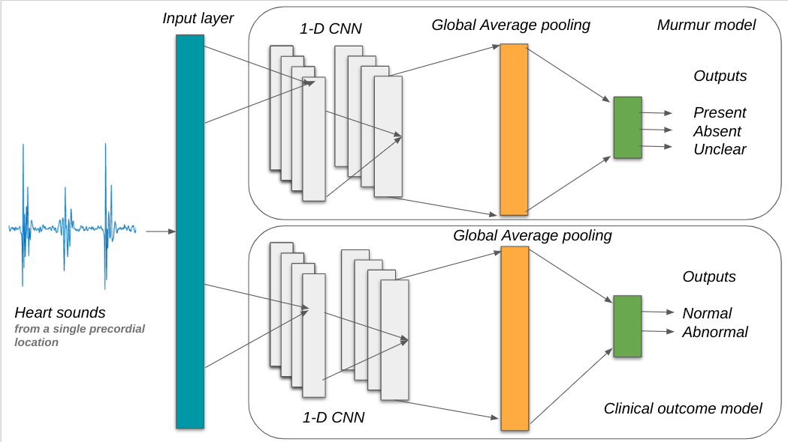

# 01Phonocardiogram_Classification_Using_1-Dimensional_Inception_Time_Convolutional_Neural_Networks

来源于paperwithcod，[Phonocardiogram Classification Using 1-Dimensional Inception Time Convolutional Neural Networks](https://paperswithcode.com/paper/phonocardiogram-classification-using-1)

源代码在[github](https://github.com/Bsingstad/Heart-murmur-detection-2022-Simulab)上

## README

> Phonocardiogram Classification Using 1-Dimensional Inception Time Convolutional Neural Networks : George B. Moody PhysioNet Challenge 2022

> Team name: Simulab





### 1. What's in this repository?
此存储库包含我们对乔治 · B · 穆迪物理网络挑战2022的贡献的代码。这项挑战的目的是确定杂音是否存在，缺失或不清楚，并且使用数字听诊器收集在胸壁上多个听诊位置的心音，根据心音图预测临床结果是否正常或异常，。

我们训练和测试两个一维卷积神经网络(CNN)的 PCG 数据集(5272 PCGs)从儿科人口的1568个个体。一个模型预测杂音，而另一个模型预测临床结果。这两个模型都经过训练，以给出记录明智的预测，而最终的预测是给每个病人(病人明智的预测)。

我们的团队 Simulab 培训了一个临床结果分类器，其挑战成本得分为8720(在305次提交中排名第一) ，杂音分类器在验证集上的加权准确度为0.585(在305次提交中排名第182)。

### 2. A brief of the files and folders in this repository


#### 2.1 Python scripts
此存储库包含一些脚本，我们可以编辑和一些脚本提供了乔治 B。穆迪物理网络挑战2022的组织者，这是不应该被编辑

##### 2.1.1 Can be edited:
* `cross_validate.py`
* `team_code.py`

##### 2.1.2 Should not be edited
* `evaluate_model.py`
* `helper_code.py`
* `run_model.py`
* `train_model.py`


#### 2.3 Notebooks:
该资源库还包含了 Jupiter Notebooks，这使得用数据、模型和其他参数进行实验变得更加容易。一些Notebooks是设计用于谷歌 Colab，以获得访问 GPU 和一些Notebooks可以运行在您的本地计算机上。


##### 2.3.1 Colab:
* `5-fold cross-validaton.ipynb` # 包含用于在训练集上交叉验证模型的代码
* `Train and test model.ipynb` # 包含代码训练模型在整个训练集上建立模型，保存权值，然后上传权值，在训练集上对模型进行测试，最后对预测结果进行评估
* `pretrain model on 2016 dataset.ipynb` # 包含2016年生理网络挑战心音图数据的预训练模型的代码。是一个.h5文件。

##### 2.3.2 Local:
* `EDA-Phonocardiogram-dataset.ipynb` # Exploratory data analysis of the dataset  数据集的探索性数据分析

#### 2.4 Other files:
* `.gitignore`
* `LICENSE`
* `Dockerfile`
* `requirements.txt`

Dockerfile 和 requments.txt 非常重要，因为它们用于在向挑战赛组织者提交代码时构建 Docker 映像。

### 3. Data:
主要数据源是 [CirCor DigiScope 数据集](https://physionet.org/content/circor-heart-sound/1.0.0/)。在 Colab 使用 Jupyter Notebooks 时，我们需要在每次开始一个新的会话时下载这个数据集。

为了加快下载速度，我们创建了这个数据集的 [Kaggle 版本](https://www.kaggle.com/datasets/bjoernjostein/the-circor-digiscope-phonocardiogram-dataset-v2)。**这个数据用于模型训练**

要下载数据集，你必须注册一个 Kaggle 帐户，从你的 Kaggle 配置文件中获取一个 Kaggle.json 文件(包含一个 API 令牌) ，并将其上传到 Colab 临时文件夹中的 root 文件夹。

为了对模型进行预训练，我们使用了同样可以在 [Kaggle](https://www.kaggle.com/datasets/bjoernjostein/physionet-challenge-2016) 获得的[《2016年物理网络挑战》](https://physionet.org/content/challenge-2016/1.0.0/)的开放数据集。**这个数据集用于模型预训练**

### 4. Dependencies
* `numpy==1.21.6`
* `scipy==1.4.1`
* `scikit-learn==0.23.2`
* `joblib==0.17.0`
* `tensorflow == 2.8.2`
* `Cython==0.29.24`
* `pandas==1.3.2`
* `h5py==2.10.0`
* `tqdm==4.54.0`

### 5. Run the code locally:
您可以通过在挑战训练集上运行以下命令来尝试。在最近的个人计算机上，这些命令从开始到结束只需要几分钟或更少的时间。

对于本例，我们实现了一个具有多个特征的随机森林分类器。可以对条目使用不同的分类器、特性和库。这个简单的示例的设计目标是不能很好地展现预测性能，因此您不应该将其用作模型性能的基准。

这段代码使用下面描述的四个主要脚本来训练和运行2022挑战赛的模型。

### 6. Run the code using Docker
您可以通过创建一个 Docker 镜像(参见下面)并运行这些脚本来安装依赖项

```python
    pip install requirements.txt
```

您可以通过运行来训练和运行模型

```python
    python train_model.py training_data model
    python run_model.py model test_data test_outputs
```

Training _ data 是一个包含训练数据文件的文件夹，model 是一个保存模型的文件夹，test _ data 是一个包含测试数据文件的文件夹(你可以使用训练数据进行调试和交叉验证) ，test _ output 是一个保存模型输出的文件夹。[2022年挑战赛网站](https://physionetchallenges.org/2022/)提供了一个培训数据库，其中说明了数据文件的内容和结构。

您可以通过运行来评价模型

```python
    python evaluate_model.py labels outputs scores.csv class_scores.csv
```

其中，label 是一个包含数据标签的文件夹，例如，PhysioNet网页上的培训数据库; output 是一个包含模型输出数据的文件的文件夹; scores.csv (可选)是模型得分的集合; class _ score。Csv (可选)是您的模型的每个分类分数的集合。


#### 6.1 How do I run these scripts in Docker?

Docker 和类似的平台允许您使用特定的依赖项对代码进行容器化和打包，以便可以在其他计算环境和操作系统中可靠地运行代码。

为了保证我们可以运行您的代码，请[安装}(https://docs.docker.com/get-docker/) Docker，从您的代码构建一个 Docker 映像，并在培训数据上运行它。为了快速检查代码中的 bug，可能需要在训练数据的一个小子集上运行代码。

如果在运行代码时遇到困难，请尝试以下步骤来运行示例代码。

1. 在主目录中创建一个包含多个子文件夹的文件夹`example`。

```shell
 user@computer:~$ cd ~/
 user@computer:~$ mkdir example
 user@computer:~$ cd example
 user@computer:~/example$ mkdir training_data test_data model test_outputs
```

2. 从[挑战网站](https://physionetchallenges.org/2022)下载培训数据。将一些训练数据放在 training _ data 和 test _ data 中。你可以使用一些训练数据来检查你的代码(并且应该对训练数据执行交叉验证来评估你的算法)。

3. 在终端中下载或克隆此存储库。
```shell
 user@computer:~/example$ git clone https://github.com/physionetchallenges/python-classifier-2022.git
```

4. 构建一个 Docker 映像并在终端中运行示例代码。
```shell
 user@computer:~/example$ ls
 model  python-classifier-2022  test_data  test_outputs  training_data

 user@computer:~/example$ cd python-classifier-2022/

 user@computer:~/example/python-classifier-2022$ docker build -t image .

 Sending build context to Docker daemon  [...]kB
 [...]
 Successfully tagged image:latest

 user@computer:~/example/python-classifier-2022$ docker run -it -v ~/example/model:/physionet/model -v ~/example/test_data:/physionet/test_data -v ~/example/test_outputs:/physionet/test_outputs -v ~/example/training_data:/physionet/training_data image bash

 root@[...]:/physionet# ls
     Dockerfile             README.md         test_outputs
     evaluate_model.py      requirements.txt  training_data
     helper_code.py         team_code.py      train_model.py
     LICENSE                run_model.py

 root@[...]:/physionet# python train_model.py training_data model

 root@[...]:/physionet# python run_model.py model test_data test_outputs

 root@[...]:/physionet# python evaluate_model.py model test_data test_outputs
 [...]

 root@[...]:/physionet# exit
 Exit
```
#### 6.2 具体该怎么做呢？
要成功运行这个项目代码，你需要遵循以下步骤：

1. **安装 Docker**: 如果你还没有安装 Docker，你需要先在你的机器上安装它。可以从 Docker 官网获取安装指南。

2. **创建文件夹**: 在你的主目录下创建一个名为 `example` 的文件夹，并在其中创建 `training_data`、`test_data`、`model` 和 `test_outputs` 子文件夹。

   ```bash
   cd ~
   mkdir example
   cd example
   mkdir training_data test_data model test_outputs
   ```

3. **获取数据**: 从挑战网站下载训练数据，并将一些数据放入 `training_data` 和 `test_data` 文件夹中。

4. **克隆代码仓库**: 使用 git 克隆项目代码到 `example` 文件夹中。

   ```bash
   git clone https://github.com/physionetchallenges/python-classifier-2022.git
   ```

5. **构建 Docker 镜像**: 在 `python-classifier-2022` 目录下，使用 Docker 构建一个镜像。

   ```bash
   cd python-classifier-2022/
   docker build -t image .
   ```

6. **运行 Docker 容器**: 使用 Docker 运行一个交互式会话，并挂载必要的卷。

   ```bash
   docker run -it -v ~/example/model:/physionet/model -v ~/example/test_data:/physionet/test_data -v ~/example/test_outputs:/physionet/test_outputs -v ~/example/training_data:/physionet/training_data image bash
   ```

7. **训练模型**: 在 Docker 容器内运行模型训练脚本。

   ```bash
   python train_model.py training_data model
   ```

8. **运行模型**: 使用训练好的模型在测试数据上运行并生成输出。

   ```bash
   python run_model.py model test_data test_outputs
   ```

9. **评估模型**: 评估模型的性能。

   ```bash
   python evaluate_model.py test_data test_outputs
   ```

10. **退出 Docker 容器**: 完成操作后退出 Docker 容器。

    ```bash
    exit
    ```

确保你遵循了所有的步骤，并且在运行命令时，你当前的工作目录是包含 `example` 文件夹的目录。此外，确保你已经根据项目要求安装了所有必要的依赖项，这通常通过 `requirements.txt` 文件来指定，可以使用 `pip install -r requirements.txt` 来安装。


### 7. Results

|Model| Best parameters | Metrics | Training | Validation | Test |
|:-----:|:-----------------:|:---------:|:----------:|:------------:|:----:|
|Murmur|Adam optimization|Weighted accuracy |0.497 ± 0.083| 0.585|0.593
||Weighted categorical cross entropy|Challenge metrics|13158 ± 1283|8866|13134
||20 batch size|Accuracy|0.446 ± 0.070|0.423|0.497
||30 epoch|F measure|0.403 ± 0.055|0.384|0.398
|Clinical | Adam optimization| Weighted accuracy|0.713 ± 0.042|0.732|0.703
||20 batch size|Challenge metrics|12315 ± 903|8720|12419
||20 epoch| Accuracy |0.51 ± 0.047|0.537|0.537
||Weighted categorical cross entropy| F measure|0.465 ± 0.061 |0.530|0.503


### 8. Citation

```
@inproceedings{singstad_2022_phono,
  title={Phonocardiogram classification using 1-dimensional inception time convolutional neural networks},
  author={Singstad, Bj{\o}rn-Jostein and Gitau, Antony M and Johnsen, Markus Kreutzer and Ravn, Johan and Bongo, Lars Ailo and Schirmer, Henrik},
  booktitle={2022 Computing in Cardiology (CinC)},
  volume={498},
  pages={1--4},
  year={2022},
  organization={IEEE}
}
```
