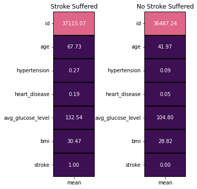
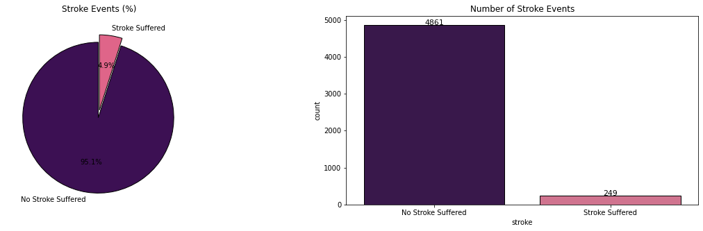
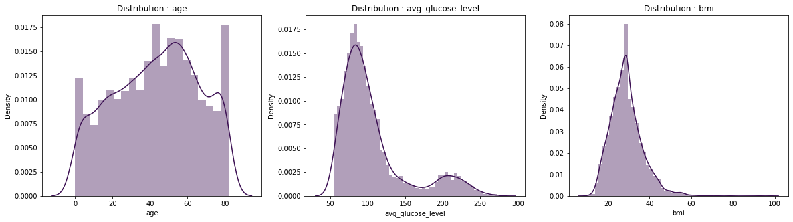
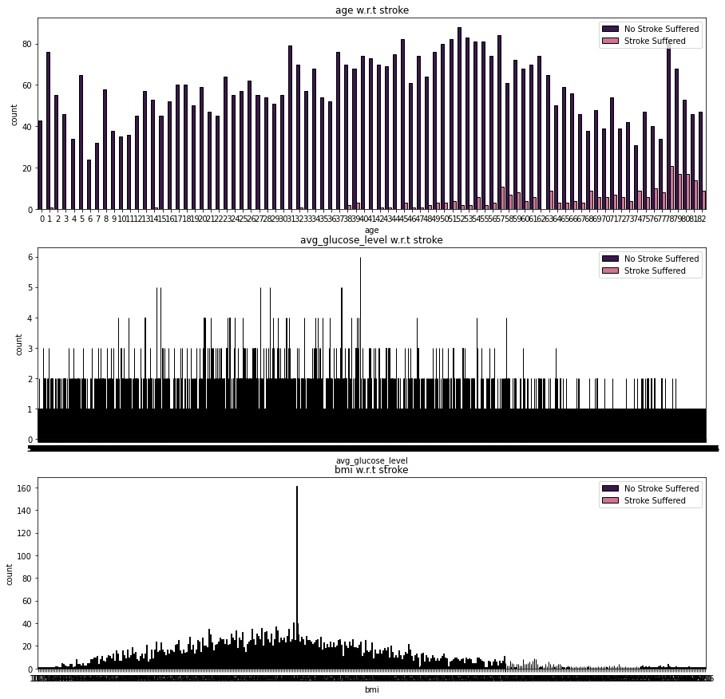
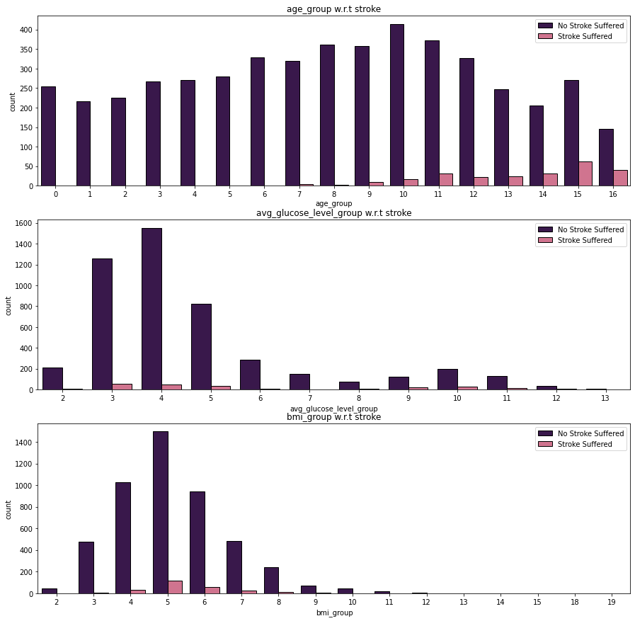
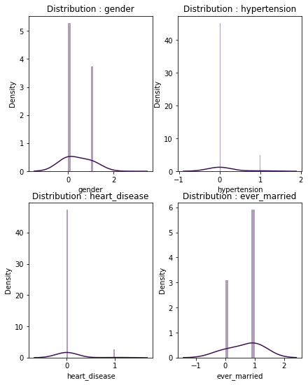
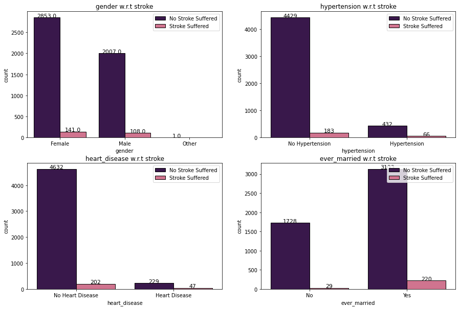
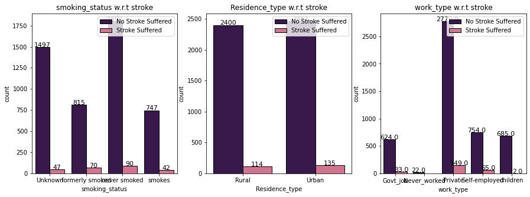

# Stroke Prediction: Effect of Data Leakage | SMOTE
## 基本信息

[网址](https://www.kaggle.com/code/tanmay111999/stroke-prediction-effect-of-data-leakage-smote)

2023年发布

9，331次浏览

132个人支持

100人复现


## 0. 简介
### 0.1. Problem Statement :

According to the World Health Organization (WHO), stroke is the 2nd leading cause of death globally, responsible for approximately 11% of total deaths. It is another health issue that has found to be rising throughout the world due to the adoption of lifestyle changes that disregards healthy lifestyle & good eating habits. Thus, new emerging electronic devices that record the health vitals have paved the way for creating an automated solution with AI techniques at it's core. Thus, similar to heart diseases, efforts have begun to create lab tests that predict stroke. The dataset presented here has many factors that highlight the lifestyle of the patients and hence gives us an opportunity to create an AI-based solution for it.

### 0.2. Aim :
* To classify / predict whether a patient can suffer a stroke.
* It is a binary classification problem with multiple numerical and categorical features.

### 0.3. Dataset Attributes :¶
* id : unique identifier
* gender : "Male", "Female" or "Other"
* age : age of the patient
* hypertension: 0 if the patient doesn't have hypertension, 1 if the patient has hypertension
* heart_disease : 0 if the patient doesn't have any heart diseases, 1 if the patient has a heart disease
* ever_married : "No" or "Yes"
* work_type : "children", "Govt_jov", "Never_worked", "Private" or "Self-employed"
* Residence_type : "Rural" or "Urban"
* avg_glucose_level : average glucose level in blood
* bmi : body mass index
* smoking_status : "formerly smoked", "never smoked", "smokes" or "Unknown"*
* stroke : 1 if the patient had a stroke or 0 if not

### 0.4. Notebook Contents :
* Dataset Information
* Exploratory Data Analysis (EDA)
* Summary of EDA & Comparison with Domain Information
* Feature Engineering (Data Leakage & Data Balancing)
* Modeling
* Conclusion
### 0.5. What you will learn :
* Data Visualization
* Data Balancing using SMOTE
* Data Leakage
* Statistical Tests for Feature Selection
* Modeling and visualization of results for algorithms


Lets get started!


## 1. Data Visualization
### 1.1. Import the Necessary Libraries :

这段代码是Python编程语言中的一段示例，用于数据科学和机器学习任务。下面是对每行代码的详细中文注释：

```python
# 导入pandas库，并使用别名pd。Pandas是一个强大的数据结构和数据分析工具。
import pandas as pd

# 导入numpy库，并使用别名np。Numpy提供了对多维数组对象的支持以及各种派生对象（如掩码数组和矩阵）。
import numpy as np

# 导入matplotlib.pyplot模块，并使用别名plt。这个模块可以用来绘制图形和数据可视化。
import matplotlib.pyplot as plt

# 这行代码是Jupyter Notebook的魔法命令，用于在Notebook内部直接显示图表。
%matplotlib inline

# 导入seaborn库，并使用别名sns。Seaborn是基于matplotlib的高级数据可视化库，提供了更多样化的绘图风格和接口。
import seaborn as sns

# 设置pandas显示选项，使浮点数显示为两位小数。
pd.options.display.float_format = '{:.2f}'.format

# 导入warnings模块，用于控制警告的显示。
import warnings

# 从tqdm模块导入tqdm函数，它是一个快速、可扩展的进度条工具，可以在Python长循环中添加一个进度提示。
from tqdm import tqdm

# 使用warnings过滤器来忽略警告信息，使得在运行代码时不会出现烦人的警告信息。
warnings.filterwarnings('ignore')

# 从sklearn.preprocessing模块导入LabelEncoder类，用于将标签转换为范围从0到n_classes-1的整数。
from sklearn.preprocessing import LabelEncoder
```
这段代码主要涉及数据处理和可视化的库的导入和设置，为后续的数据科学工作做好准备。


```python
data = pd.read_csv('/kaggle/input/stroke-prediction-dataset/healthcare-dataset-stroke-data.csv')
data.head()
```


### 1.2. Data Info :

```python
data.shape
```

```python
(5110, 12)
```

```python
data.columns
# 这行代码用于获取Pandas DataFrame 'data' 的所有列名。
# 'data' 是一个Pandas DataFrame对象，它是一个二维的、表格型的数据结构，非常适合于数据处理和分析。
# 'columns' 是DataFrame对象的一个属性，它返回一个Index对象，包含了DataFrame中所有列的名称。
# 当执行这行代码时，它会打印出DataFrame 'data' 中每一列的名称，通常用于了解数据集的结构或者进行数据的初步探索。
data.columns
```


```python
data.info()
# 调用DataFrame对象'data'的info()方法，该方法会输出DataFrame的概要信息。
# 这个方法通常用于初步了解数据集的结构和内容，包括每列的数据类型、非空值的数量等。
# 执行这行代码后，Pandas会打印出一份报告，其中包含了以下信息：
#   - 数据集的行数和列数。
#   - 每列的名称、数据类型（例如整数、浮点数、对象等）以及非空值的数量。
#   - 数据集的内存使用情况。
# 这个概要信息有助于在数据分析的早期阶段识别潜在的问题，如缺失值、数据类型不一致等。
data.info()
```

当你执行`data.info()`方法时，Pandas会输出一个表格，其中列出了DataFrame的每一列以及相关的信息。这个表格通常会包含列名、数据类型、非空值的数量，以及每列的内存使用情况。这个功能对于快速检查数据集的完整性和准确性非常有用，可以帮助你做出是否需要进行数据清洗和预处理的决策。


```python
<class 'pandas.core.frame.DataFrame'>
RangeIndex: 5110 entries, 0 to 5109
Data columns (total 12 columns):
 #   Column             Non-Null Count  Dtype  
---  ------             --------------  -----  
 0   id                 5110 non-null   int64  
 1   gender             5110 non-null   object 
 2   age                5110 non-null   float64
 3   hypertension       5110 non-null   int64  
 4   heart_disease      5110 non-null   int64  
 5   ever_married       5110 non-null   object 
 6   work_type          5110 non-null   object 
 7   Residence_type     5110 non-null   object 
 8   avg_glucose_level  5110 non-null   float64
 9   bmi                4909 non-null   float64
 10  smoking_status     5110 non-null   object 
 11  stroke             5110 non-null   int64  
dtypes: float64(3), int64(4), object(5)
memory usage: 479.2+ KB
```

根据提供的`data.info()`方法的输出结果，我们可以对数据集`data`进行以下详细分析：

1. **DataFrame 类型与索引**:
   - `data`是一个Pandas的DataFrame对象。
   - 使用RangeIndex索引，共有5110个数据条目，索引范围从0到5109。

2. **数据概览**:
   - 共有12列数据，每一列的名称和数据类型如下：
     - `id`列：数据类型为`int64`，表示整数类型，共有5110个非空值。
     - `gender`列：数据类型为`object`，通常表示字符串类型，共有5110个非空值。
     - `age`列：数据类型为`float64`，表示双精度浮点数类型，共有5110个非空值。
     - `hypertension`列：数据类型为`int64`，共有5110个非空值。
     - `heart_disease`列：数据类型为`int64`，共有5110个非空值。
     - `ever_married`列：数据类型为`object`，共有5110个非空值。
     - `work_type`列：数据类型为`object`，共有5110个非空值。
     - `Residence_type`列：数据类型为`object`，共有5110个非空值。
     - `avg_glucose_level`列：数据类型为`float64`，共有5110个非空值。
     - `bmi`列：数据类型为`float64`，但有201个空值（5110 - 4909 = 201），表示有201条记录缺失BMI信息。
     - `smoking_status`列：数据类型为`object`，共有5110个非空值。
     - `stroke`列：数据类型为`int64`，共有5110个非空值。

3. **数据类型统计**:
   - 总共有3列`float64`类型（即浮点数类型），4列`int64`类型（即整数类型），以及5列`object`类型（通常指字符串类型）。

4. **内存使用情况**:
   - 数据集大约使用了479.2 KB的内存。这个信息有助于了解数据集在存储和处理时可能对系统资源的需求。

通过这些信息，我们可以了解到数据集`data`的结构和基本属性。所有列除了`bmi`列有201个缺失值外，其他列都是完整的，没有缺失数据。这可能需要进一步的数据分析来确定缺失值的处理方法，例如通过插值、删除或使用其他技术来填补这些缺失值。
此外，数据集中包含的变量类型多样，有分类变量（如`gender`, `ever_married`, `work_type`, `Residence_type`, `smoking_status`）和数值变量（如`id`, `age`, `hypertension`, `heart_disease`, `avg_glucose_level`, `bmi`, `stroke`），这表明数据集可能用于回归分析、分类任务或其他机器学习算法。


下面这行代码使用了Seaborn库中的`heatmap`函数来创建一个热图，用于可视化Pandas DataFrame `data`中的缺失数据情况。下面是对这行代码的详细中文注释：

```python
# 导入Seaborn库，并使用别名sns。Seaborn是一个基于Matplotlib的高级数据可视化库，提供了丰富的绘图类型和美观的默认主题。
import seaborn as sns

# 调用DataFrame对象'data'的isnull()方法，该方法会返回一个与原DataFrame形状相同的布尔型DataFrame。
# 在这个布尔型DataFrame中，每个位置的值表示原DataFrame对应位置的值是否为空（True表示缺失，False表示非空）。
data.isnull()

# 使用Seaborn库的heatmap函数创建一个热图，输入参数为上述得到的布尔型DataFrame。
# 热图是一种数据可视化技术，可以显示矩阵数据中的数值大小，通常用颜色的深浅来表示。
sns.heatmap(data.isnull(),

    # cmap参数用于指定热图的颜色映射方案，'magma'是一种颜色映射方案，它会生成从紫色到黄色的颜色渐变。
    cmap = 'magma',

    # cbar参数用于控制是否显示颜色条，颜色条是热图旁边用于表示颜色深浅对应数值大小的图例。
    # 设置为False表示不显示颜色条。
    cbar = False
);

# 执行这行代码后，会在Python的绘图环境中生成一个热图，其中颜色越深（如紫色）表示数据越缺失，颜色越浅（如黄色）表示数据越完整。
# 通过这个热图，我们可以快速地识别出数据集中哪些位置存在缺失值，以及缺失数据的分布情况。
```

这段代码通过可视化的方式提供了数据集中缺失值的直观展示，有助于我们在进行数据分析或数据清洗之前，了解数据的完整性和需要采取的处理措施。


**A few null values** are present in the **bmi** feature!

这行代码是用于调用Pandas库中的DataFrame对象的`describe()`方法，以获取DataFrame的统计摘要。下面是对这行代码的详细中文注释：

```python
data.describe()
# 调用DataFrame对象'data'的describe()方法，该方法会输出DataFrame的统计摘要。
# 这个方法通常用于快速了解数据集的数值型列的分布情况，包括均值、标准差、最小值、25%分位数、中位数、75%分位数和最大值。
# 执行这行代码后，Pandas会打印出一份报告，其中包含了以下信息：
#   - 数据集中每一列的计数（即非空值的数量）。
#   - 每一列的平均值（mean），即所有数值的总和除以数值的个数。
#   - 每一列的标准差（std），表示数值分布的离散程度。
#   - 每一列的最小值（min），即所有数值中的最小值。
#   - 每一列的25%分位数（25%），即所有数值从小到大排列后位于25%位置的值。
#   - 每一列的中位数（50%），即所有数值从小到大排列后位于中间位置的值。
#   - 每一列的75%分位数（75%），即所有数值从小到大排列后位于75%位置的值。
#   - 每一列的最大值（max），即所有数值中的最大值。
data.describe()
```

当你执行`data.describe()`方法时，Pandas会输出一个表格，其中列出了DataFrame的每一列数值型数据的统计摘要。默认情况下，`describe()`方法只对数值型列进行统计分析，不包括分类数据（如字符串类型）。这个功能对于快速分析数据集的数值特征非常有用，可以帮助你了解数据的集中趋势、离散程度以及潜在的异常值。如果你需要对非数值型数据进行描述性统计分析，你可能需要使用其他方法或自定义函数来实现。


根据提供的`data.describe()`方法的输出结果，我们可以对数据集`data`中的数值型列进行以下详细分析：

1. **id**:
   - `count`: 共有5110个非空的id值。
   - `mean`: id的平均值为36517.83，这可能是某种形式的编码或者编号。
   - `std`: id的标准差为21161.72，表明id值的分布相对分散。
   - `min`: id的最小值为67，最大值为72940，这表明id的范围很广。
   - `25%`: 25%的id值低于17741.25。
   - `50%`: 中位数id值为36932，这是数据集中的中位编号。
   - `75%`: 75%的id值低于54682。
   - `max`: 最大id值为72940。

2. **age**:
   - `count`: 共有5110个非空的年龄值。
   - `mean`: 平均年龄为43.23岁。
   - `std`: 年龄的标准差为22.61岁，表明年龄分布有一定的离散程度。
   - `min`: 最小年龄为0.08岁，这可能是数据输入错误或特殊情形。
   - `25%`: 25%的人年龄在25岁以下。
   - `50%`: 中位数年龄为45岁。
   - `75%`: 75%的人年龄在61岁以上。
   - `max`: 最大年龄为82岁。

3. **hypertension**:
   - `count`: 共有5110个非空的高血压值。
   - `mean`: 平均值为0.10，表明大约10%的人有高血压。
   - `std`: 标准差为0.30，表明高血压数据的分布有一定的波动。
   - `min`: 最小值为0，表明没有人的高血压值为0（0可能表示没有高血压）。
   - `25%`: 25%的人高血压值为0。
   - `50%`: 中位数为0，表明一半的人没有高血压。
   - `75%`: 75%的人高血压值为0。
   - `max`: 最大值为1，表明有一部分人有高血压。

4. **heart_disease**:
   - `count`: 共有5110个非空的心脏病值。
   - `mean`: 平均值为0.05，表明大约5%的人有心脏病。
   - `std`: 标准差为0.23，表明心脏病数据的分布有一定的波动。
   - `min`: 最小值为0，表明没有人的心脏病值为0（0可能表示没有心脏病）。
   - `25%`: 25%的人心脏病值为0。
   - `50%`: 中位数为0，表明一半的人没有心脏病。
   - `75%`: 75%的人心脏病值为0。
   - `max`: 最大值为1，表明有一部分人有心脏病。

5. **avg_glucose_level**:
   - `count`: 共有5110个非空的平均血糖水平值。
   - `mean`: 平均血糖水平为106.15 mg/dL。
   - `std`: 标准差为45.28 mg/dL，表明血糖水平有一定的波动。
   - `min`: 最小血糖水平为55.12 mg/dL。
   - `25%`: 25%的人血糖水平低于77.25 mg/dL。
   - `50%`: 中位数血糖水平为91.88 mg/dL。
   - `75%`: 75%的人血糖水平低于114.09 mg/dL。
   - `max`: 最高血糖水平为271.74 mg/dL，可能表明有严重的高血糖情况。

6. **bmi**:
   - `count`: 共有4909个非空的身体质量指数（BMI）值，有201个缺失值。
   - `mean`: 平均BMI为28.89，属于过重范围（根据世界卫生组织的标准，18.5-24.9为正常范围）。
   - `std`: 标准差为7.85，表明BMI值分布有一定的离散程度。
   - `min`: 最小BMI为10.30，这可能是数据输入错误、极端情况或特殊人群（如运动员）。
   - `25%`: 25%的人BMI低于23.50。
   - `50%`: 中位数BMI为28.10。
   - `75%`: 75%的人BMI低于33.10。
   - `max`: 最大BMI为97.60，这可能表明有严重的肥胖情况。

7. **stroke**:
   - `count`: 共有5110个非空的中风值。
   - `mean`: 平均值为0.05，表明大约5%的人有中风病史。
   - `std`: 标准差为0.22，表明中风数据的分布有一定的波动。
   - `min`: 最小值为0，表明没有人的中风值为0（0可能表示没有中风）。
   - `25%`: 25%的人中风值为0。
   - `50%`: 中位数为0，表明一半的人没有中风。
   - `75%`: 75%的人中风值为0。
   - `max`: 最大值为1，表明有一部分人有中风病史。

通过这些统计摘要，我们可以了解到数据集中的一些基本特征和潜在的问题，如年龄和BMI的分布情况，以及高血压、心脏病、中风等健康状况的普遍性。这些信息对于进一步的数据分析和建模具有重要的参考价值。同时，我们也可以注意到，某些列如`id`和`age`的最小值异常低，可能需要进一步的数据清洗和验证。


下面这段代码使用了Pandas和Seaborn库来创建两个热图，分别展示有中风病史和无中风病史的数据集的统计描述。下面是对每行代码的详细中文注释：

```python
# 定义一个新的DataFrame 'stroke'，它通过筛选原始DataFrame 'data' 中 'stroke' 列值为1的行来创建。
# 这意味着 'stroke' DataFrame 只包含有中风病史的记录。
stroke = data[data['stroke'] == 1].describe().T

# 定义一个新的DataFrame 'no_stroke'，它通过筛选原始DataFrame 'data' 中 'stroke' 列值为0的行来创建。
# 这意味着 'no_stroke' DataFrame 只包含无中风病史的记录。
no_stroke = data[data['stroke'] == 0].describe().T

# 定义一个颜色列表 'colors'，包含两种颜色的十六进制代码，这些颜色将用于热图中不同的数据点。
colors = ['#3C1053','#DF6589']

# 使用Matplotlib的subplots函数创建一个包含两个子图的图形对象 'fig' 和轴对象 'ax'。
# nrows = 1 表示子图将垂直排列，ncols = 2 表示有两个子图并排排列，figsize = (5,5) 设置了图形的大小。
fig,ax = plt.subplots(nrows = 1,ncols = 2,figsize = (5,5))

# 激活第一个子图（位置为1,2的第一个位置），并使用Seaborn的heatmap函数创建一个热图。
# 热图的数据来源于 'stroke' DataFrame的 'mean' 列。
# annot = True 表示在热图的每个单元格内显示数值。
# cmap = colors 表示使用之前定义的颜色映射。
# linewidths = 0.4 设置单元格之间线条的宽度。
# linecolor = 'black' 设置线条颜色为黑色。
# cbar = False 表示不显示颜色条。
# fmt = '.2f' 表示数值的格式化字符串，保留两位小数。
plt.subplot(1,2,1)
sns.heatmap(stroke[['mean']], annot = True, cmap = colors, linewidths = 0.4, linecolor = 'black', cbar = False, fmt = '.2f')
# 设置子图的标题为 'Stroke Suffered'。
plt.title('Stroke Suffered');

# 激活第二个子图（位置为1,2的第二个位置），并使用Seaborn的heatmap函数创建一个热图。
# 热图的数据来源于 'no_stroke' DataFrame的 'mean' 列。
plt.subplot(1,2,2)
# 同上，创建热图并设置相应的参数。
sns.heatmap(no_stroke[['mean']], annot = True, cmap = colors, linewidths = 0.4, linecolor = 'black', cbar = False, fmt = '.2f')
# 设置子图的标题为 'No Stroke Suffered'。
plt.title('No Stroke Suffered');

# 使用Matplotlib的tight_layout函数调整子图的布局，使子图之间填充更紧凑，pad = 0 设置了布局的填充间距。
fig.tight_layout(pad = 0)
```

这段代码通过创建两个热图来比较有中风病史和无中风病史患者的统计数据。通过这种可视化方式，可以直观地看出两组数据在各个数值特征上的差异，例如平均年龄、血糖水平、BMI等。这对于分析中风与其他健康指标之间的关联非常有用。此外，通过设置不同的颜色和格式化选项，热图的可读性和美观性得到了增强。




* **Mean** values of all the features for cases of **stroke suffered** and **no stroke suffered**.
* **age** and **avg_glucose_level** can be solid 1st hand indicators to identify a stroke.
* Mean **age** values of patients that suffered a stroke, **67.73**,is much higher than those did not suffer a stroke, **41.97**.
* Similarly, **avg_glucose_level** value of **132.54** can indicate a higher chance of suffering from stroke than the **avg_glucose_level** value of **104.80** that has been found in patients that did not suffer a stroke.

### 1.3. Fill Missing Values :

这段代码使用了Python的列表推导式和`tqdm`库来查找并计算DataFrame `data`中`bmi`特征的缺失值数量。下面是对每行代码的详细中文注释：

```python
# 使用列表推导式创建一个新列表l1。这个列表将包含所有在'bmi'特征列中缺失值的索引。
# tqdm(range(len(data.isnull()['bmi'])))是一个进度条，用于显示循环的进度。range函数的参数是'bmi'特征列中缺失值的数量。
# data.isnull()['bmi']生成一个布尔序列，表示'bmi'列中每个值是否为缺失值。
# loc[i,'bmi']是Pandas的.loc索引器，用于根据索引i访问'bmi'列的值。
l1 = [i for i in tqdm(range(len(data.isnull()['bmi'])))) if data.isnull().loc[i,'bmi'] == True]

# 打印'bmi'特征中缺失值的总数。
# len(l1)计算列表l1的长度，即缺失值的数量。
print('Total Number of Missing Values in bmi feature :', len(l1))
```

这段代码的作用是找出'bmi'这一特征列中所有缺失值的索引，并计算这些缺失值的总数。通过使用`tqdm`库，代码在执行时会显示一个进度条，使得循环的执行进度可视化，这在处理大量数据时特别有用。最后，打印出的缺失值总数有助于了解数据集的完整性，为后续的数据清洗和预处理提供重要信息。

```python
100%|██████████| 5110/5110 [00:07<00:00, 715.67it/s]
Total Number of Missing Values in bmi feature : 201
```

根据提供的代码执行结果，我们可以进行以下分析：

1. **进度条输出**:
   - 代码中的`tqdm`库用于显示一个进度条，它显示了当前进度和已经处理的迭代次数。在这个例子中，进度条显示了100%的完成度，表示代码已经处理了所有的5110个数据点。
   - `715.67it/s`表示每秒迭代次数，即代码每秒可以检查715.67个数据点。这个速度相对较快，表明计算机处理这段代码的效率很高。

2. **缺失值统计**:
   - `print`函数输出了`bmi`特征中缺失值的总数，结果显示为201个缺失值。
   - 这意味着在原始的`data` DataFrame中，有201个记录的`bmi`值是空的，没有提供具体的数值。
   - 缺失值的存在可能会对数据分析和建模产生影响，因为大多数统计方法和机器学习算法都假设数据是完整的。因此，在进行进一步的分析之前，通常需要对这些缺失值进行处理，例如通过删除含有缺失值的记录、使用其他已知数据进行插值或者基于某种策略进行估计等。

3. **数据清洗的重要性**:
   - 了解数据集中缺失值的情况是数据清洗和预处理的重要步骤。在这个例子中，我们已经知道了`bmi`特征有201个缺失值，这是数据清洗过程中需要特别关注的问题。
   - 根据数据集的具体情况和分析目标，我们需要选择合适的方法来处理这些缺失值，以确保后续分析的准确性和可靠性。

总的来说，这段代码及其结果向我们展示了如何有效地识别和统计数据集中的缺失值，这是进行高质量数据分析的基础。在实际应用中，我们需要根据具体情况选择合适的方法来处理这些缺失值，以提高数据集的质量。

* From the table of descriptive statistics, we observe that mean and median values of **bmi** are very close to each other.
* Hence, we will fill the missing values with the **mean values**.


下面这段代码使用了Pandas库来填充DataFrame `data`中的`bmi`列的缺失值，并使用Seaborn库来创建一个热图来可视化整个数据集中的缺失值情况。下面是对每行代码的详细中文注释：

```python
# 这行代码使用Pandas的fillna方法来填充DataFrame 'data'中的'bmi'列的缺失值。
# fillna方法的第一个参数是要用来填充缺失值的值，这里使用了'bmi'列的平均值。
# inplace=True参数表示直接在原始DataFrame上进行修改，而不是创建一个新的DataFrame。
# 这样，所有的'bmi'列中的缺失值都会被其平均值所替代。
data['bmi'].fillna(data['bmi'].mean(), inplace=True)

# 导入Seaborn库，并使用别名sns。Seaborn是一个基于Matplotlib的高级数据可视化库，提供了丰富的绘图类型和美观的默认主题。
import seaborn as sns

# 使用Seaborn的heatmap函数创建一个热图，输入参数为原始DataFrame 'data'的isnull方法的结果。
# isnull方法会返回一个与原DataFrame形状相同的布尔型DataFrame，其中的值表示原DataFrame对应位置的值是否为空（True表示缺失，False表示非空）。
# cmap='magma'参数指定了热图的颜色映射方案，'magma'是一种颜色渐变，从紫色到黄色。
# cbar=False参数表示不显示颜色条，颜色条是热图旁边用于表示颜色深浅对应数值大小的图例。
# 执行这行代码后，会在Python的绘图环境中生成一个热图，其中颜色越深（如紫色）表示数据越缺失，颜色越浅（如黄色）表示数据越完整。
sns.heatmap(data.isnull(), cmap='magma', cbar=False);
```

这段代码首先通过填充`bmi`列的缺失值来清洗数据集，然后使用热图来可视化整个数据集的缺失值情况。通过这种方式，我们可以直观地了解数据集中每一列的缺失值分布，从而为进一步的数据分析和处理提供依据。


## 2. Exploratory Data Analysis
### 2.1. Dividing features into Discrete and Categorical :


这段代码主要用于处理Pandas DataFrame `data`中的数据列，通过删除不需要的列、转换数据类型、识别分类（离散）和数值（连续）特征，并创建DataFrame的一个深拷贝。下面是对每行代码的详细中文注释：

```python
# 这行代码使用Pandas的drop方法从DataFrame 'data'中删除名为'id'的列。
# columns=['id']参数指定了要删除的列名。
# inplace=True参数表示直接在原始DataFrame上进行修改，而不是创建一个新的DataFrame。
# 这样，'id'列将从原始数据集中被移除。
data.drop(columns=['id'], inplace=True)

# 将DataFrame 'data'的列名转换为Python列表，并赋值给变量col。
col = list(data.columns)

# 初始化一个空列表categorical_features，用于存储分类特征的列名。
categorical_features = []

# 初始化一个空列表discrete_features，用于存储离散（数值型）特征的列名。
discrete_features = []

# 遍历列表col中的每个元素，即DataFrame 'data'的每一列。
for i in col:
    # 检查列i中唯一值的数量。
    # 如果唯一值的数量大于6，则认为该列是离散（数值型）特征，并将其名字添加到discrete_features列表中。
    if len(data[i].unique()) > 6:
        discrete_features.append(i)
    # 否则，认为该列是分类特征，并将其名字添加到categorical_features列表中。
    else:
        categorical_features.append(i)

# 打印分类特征的列表，使用*操作符将列表中的元素解包为独立的参数。
print('Categorical Features :', *categorical_features)

# 打印离散（数值型）特征的列表，使用*操作符将列表中的元素解包为独立的参数。
print('Discrete Features :', *discrete_features)

# 将DataFrame 'data'中的'age'列的数据类型转换为整数类型。
data['age'] = data['age'].astype(int)

# 使用copy方法创建DataFrame 'data'的一个深拷贝，并赋值给变量df1。
# deep=True参数表示进行深拷贝，即复制所有的数据和索引，创建一个新的DataFrame。
df1 = data.copy(deep=True)
```

这段代码通过一系列的数据处理步骤，帮助我们为后续的数据分析和机器学习任务做好准备。首先，它删除了不需要的`id`列，然后根据列中唯一值的数量区分了分类和离散特征。接着，它将`age`列的数据类型转换为整数，这通常是数值分析中的一个重要步骤。最后，它创建了原始DataFrame的一个深拷贝，这样我们就可以在不影响原始数据的情况下进行进一步的探索和实验。


```python
Categorical Features : gender hypertension heart_disease ever_married work_type Residence_type smoking_status stroke
Discrete Features : age avg_glucose_level bmi
```

* We drop the id column as it is just a unique identifier.
* Here, categorical features are defined if the the attribute has less than 6 unique elements else it is a discrete feature.
* Typical approach for this division of features can also be based on the datatypes of the elements of the respective attribute.

**Eg** : datatype = integer, attribute = discrete feature ; datatype = string, attribute = categorical feature

* Creating a deep copy of the orginal dataset for experimenting with data, visualization and modeling.
* Modifications in the original dataset will not be highlighted in this deep copy.
* We now Label Encode the data categorical text data features.


这段代码使用了`LabelEncoder`类来对DataFrame `df1`中的文本数据特征进行编码，将文本标签转换为范围从0到n_classes-1的整数。下面是对每行代码的详细中文注释：

```python
# 创建一个LabelEncoder对象，用于将文本标签转换为整数编码。
le = LabelEncoder()

# 定义一个列表text_data_features，包含需要进行编码的特征列名。
text_data_features = ['gender', 'ever_married', 'work_type', 'Residence_type', 'smoking_status']

# 初始化两个空列表l3和l4，用于存储每列转换后的唯一值和对应的原始文本标签。
l3 = []; l4 = [];

# 打印当前正在进行的操作，用于标识接下来的输出内容。
print('Label Encoder Transformation')

# 使用tqdm库创建一个进度条，用于显示循环的进度。
# 遍历text_data_features列表中的每个特征列名。
for i in tqdm(text_data_features):
    # 使用fit_transform方法对DataFrame 'df1'中名为i的列进行编码。
    # 转换后的编码值将替换原来的文本标签。
    df1[i] = le.fit_transform(df1[i])
    
    # 获取转换后的列中所有唯一值的列表，并将其添加到列表l3中。
    l3.append(list(df1[i].unique()))
    
    # 使用inverse_transform方法将编码值转换回原始的文本标签，并将其添加到列表l4中。
    l4.append(list(le.inverse_transform(df1[i].unique())))
    
    # 打印特征列名、转换后的唯一值列表以及对应的原始文本标签列表。
    print(i, ' : ', df1[i].unique(), ' = ', le.inverse_transform(df1[i].unique()))
```

这段代码的主要作用是将DataFrame `df1`中的文本数据特征转换为数值型数据，以便于后续的数据分析和机器学习模型处理。`LabelEncoder`是处理分类数据的常用工具，它通过学习每个唯一文本标签的整数映射，使得原本的文本数据可以被模型识别和处理。通过打印转换后的唯一值和对应的原始文本标签，我们可以验证编码过程是否正确，并确保数据转换的透明度和可解释性。此外，使用`tqdm`库可以提高代码的可读性，通过显示进度条来反映代码执行的状态。


```python
Label Encoder Transformation
100%|██████████| 5/5 [00:00<00:00, 326.74it/s]
gender  :  [1 0 2]  =  ['Male' 'Female' 'Other']
ever_married  :  [1 0]  =  ['Yes' 'No']
work_type  :  [2 3 0 4 1]  =  ['Private' 'Self-employed' 'Govt_job' 'children' 'Never_worked']
Residence_type  :  [1 0]  =  ['Urban' 'Rural']
smoking_status  :  [1 2 3 0]  =  ['formerly smoked' 'never smoked' 'smokes' 'Unknown']
```

根据提供的代码执行结果，我们可以进行以下分析：

1. **性别（gender）**:
   - 原始数据中的性别特征有三个类别：'Male'（男性）、'Female'（女性）和'Other'（其他）。
   - 使用Label Encoder进行编码后，'Male'被分配了数值1，'Female'被分配了数值2，'Other'被分配了数值0。
   - 这些数值表示了性别的有序关系，但在实际应用中，通常性别不被视为有序类别，因此可能需要使用One-Hot编码或其他方法来避免引入这种有序关系。

2. **婚姻状况（ever_married）**:
   - 原始数据中的婚姻状况特征有两个类别：'Yes'（已婚）和'No'（未婚）。
   - 编码后，'Yes'被分配了数值1，'No'被分配了数值0。
   - 这种编码方式简单直接，反映了已婚与否的二元关系。

3. **工作类型（work_type）**:
   - 原始数据中的工作类型特征包含多个类别，分别是'Private'（私营部门）、'Self-employed'（自雇）、'Govt_job'（政府工作）、'children'（在家带孩子）、'Never_worked'（从未工作过）。
   - 编码后，这些类别被分配了不同的数值，但顺序与原始类别的字母顺序不同。
   - 需要注意的是，这种编码方式引入了一个潜在的有序关系，尽管这些类别本质上是无序的。在某些情况下，这可能会影响模型的性能，因此可能需要重新考虑编码策略。

4. **居住类型（Residence_type）**:
   - 原始数据中的居住类型特征有两个类别：'Urban'（城市）和'Rural'（农村）。
   - 编码后，'Urban'被分配了数值1，'Rural'被分配了数值0。
   - 这种编码方式同样简单直接，反映了居住地类型的二元关系。

5. **吸烟状况（smoking_status）**:
   - 原始数据中的吸烟状况特征包含四个类别：'formerly smoked'（以前吸烟）、'never smoked'（从未吸烟）、'smokes'（现在吸烟）和'Unknown'（未知）。
   - 编码后，这些类别被分配了不同的数值，'formerly smoked'被分配了数值1，'never smoked'被分配了数值2，'smokes'被分配了数值3，'Unknown'被分配了数值0。
   - 这种编码方式为每个吸烟状况类别分配了一个唯一的数值，但同样可能引入了一种潜在的有序关系，尽管这些类别在实际中是无序的。

总结来说，Label Encoder提供了一种简单的方式来将文本类别标签转换为数值型数据，使得这些特征可以被用于机器学习模型。然而，这种转换可能会引入有序关系，这在某些情况下可能不适当。因此，在实际应用中，我们需要根据特征的性质和模型的要求来选择合适的编码方法。

* We store the label encoded transformations inside a dictionary that gives us the information about the encoded value and it's original value!
* We add the remaining 2 features manually i.e **heart_disease** & **hypertension**!


这段代码创建了一个Python字典`tf1`，用于存储文本数据特征与其编码后的唯一值之间的映射关系，以及特定列的特定编码映射。下面是对每行代码的详细中文注释：

```python
# 初始化一个空字典tf1，用于存储特征名称与它们的编码映射之间的对应关系。
tf1 = {}

# 遍历text_data_features列表的长度，即特征的数量。
for i in range(len(text_data_features)):
    # 为字典tf1中的每个特征创建一个新的嵌套字典。
    # 特征名称作为键，其对应的空字典作为值。
    tf1[text_data_features[i]] = {}

    # 遍历列表l3和l4中的对应元素，这两个列表分别存储了编码后的唯一值和原始文本标签。
    # l3[i]包含了编码后的唯一值，l4[i]包含了对应的原始文本标签。
    for j, k in zip(l3[i], l4[i]):
        # 在嵌套字典中，将编码后的唯一值作为键，原始文本标签作为值。
        # 这样，我们就可以通过编码值快速找到对应的文本标签。
        tf1[text_data_features[i]][j] = k

# 为字典tf1中的'hypertension'和'heart_disease'这两个特定的特征手动添加编码映射。
# 这里假设'hypertension'和'heart_disease'的特征值只有0和1，分别代表“没有高血压”和“有高血压”，“没有心脏病”和“有心脏病”。
tf1['hypertension'] = {0: 'No Hypertension', 1: 'Hypertension'}
tf1['heart_disease'] = {0: 'No Heart Disease', 1: 'Heart Disease'}

# 打印字典tf1的内容，展示所有的编码映射关系。
# 这将输出字典tf1中的所有键值对，包括文本数据特征与其编码后的唯一值和原始文本标签之间的映射。
tf1
```

这段代码的主要作用是建立一个映射表，用于在数据预处理和机器学习任务中快速查找特征的编码和文本标签之间的对应关系。通过这种方式，我们可以确保在数据转换过程中不会丢失原始数据的含义，同时也方便了后续的数据解释和模型评估工作。

```python
{'gender': {1: 'Male', 0: 'Female', 2: 'Other'},
 'ever_married': {1: 'Yes', 0: 'No'},
 'work_type': {2: 'Private',
  3: 'Self-employed',
  0: 'Govt_job',
  4: 'children',
  1: 'Never_worked'},
 'Residence_type': {1: 'Urban', 0: 'Rural'},
 'smoking_status': {1: 'formerly smoked',
  2: 'never smoked',
  3: 'smokes',
  0: 'Unknown'},
 'hypertension': {0: 'No Hypertension', 1: 'Hypertension'},
 'heart_disease': {0: 'No Heart Disease', 1: 'Heart Disease'}}
```

根据提供的代码执行结果，我们可以进行以下分析：

1. **性别（gender）**:
   - 编码映射表显示，性别特征的编码为1对应'Male'（男性），编码为0对应'Female'（女性），编码为2对应'Other'（其他）。
   - 这种映射关系是基于Label Encoder的转换结果，其中'Other'可能是除了男性和女性之外的其他性别类别。

2. **婚姻状况（ever_married）**:
   - 编码映射表显示，婚姻状况特征的编码为1对应'Yes'（已婚），编码为0对应'No'（未婚）。
   - 这是一个简单的二元分类映射，直接反映了个体的婚姻状态。

3. **工作类型（work_type）**:
   - 编码映射表显示，工作类型特征的编码为2对应'Private'（私营部门），编码为3对应'Self-employed'（自雇），编码为0对应'Govt_job'（政府工作），编码为4对应'children'（在家带孩子），编码为1对应'Never_worked'（从未工作过）。
   - 这个特征的编码顺序与原始类别的字母顺序不同，这可能是根据Label Encoder的内部算法确定的。

4. **居住类型（Residence_type）**:
   - 编码映射表显示，居住类型特征的编码为1对应'Urban'（城市），编码为0对应'Rural'（农村）。
   - 这个映射反映了个体的居住地类型，是一个简单的二元分类。

5. **吸烟状况（smoking_status）**:
   - 编码映射表显示，吸烟状况特征的编码为1对应'formerly smoked'（以前吸烟），编码为2对应'never smoked'（从未吸烟），编码为3对应'smokes'（现在吸烟），编码为0对应'Unknown'（未知）。
   - 这个映射表提供了吸烟状况的四个不同类别，包括未知情况。

6. **高血压状况（hypertension）**:
   - 编码映射表手动添加了高血压状况特征的编码，其中0对应'No Hypertension'（没有高血压），1对应'Hypertension'（有高血压）。
   - 这是一个典型的二元分类映射，用于表示个体是否有高血压的健康状况。

7. **心脏病状况（heart_disease）**:
   - 编码映射表手动添加了心脏病状况特征的编码，其中0对应'No Heart Disease'（没有心脏病），1对应'Heart Disease'（有心脏病）。
   - 与高血压状况类似，这也是一个二元分类映射，用于表示个体是否有心脏病的健康状况。

总结来说，`tf1`字典提供了一个清晰的映射关系，将每个特征的编码值与其原始的文本标签相对应。这对于理解数据的特征和后续的数据分析非常有用。通过这种方式，我们可以确保在使用数值型数据进行机器学习建模时，不会丢失原始数据的含义。同时，这也有助于在模型训练和评估过程中进行特征解释。


### 2.2. Target Variable Visualization (stroke) :

这段代码用于创建两个图表来展示DataFrame `df1` 中 `stroke` 列的统计情况。一个饼图用于显示患有中风和未患中风的百分比，另一个条形图用于展示具体的计数。下面是对每行代码的详细中文注释：

```python
# 从DataFrame 'df1' 中获取 'stroke' 列的值计数，并将其转换为列表形式。
# value_counts() 方法返回一个序列，其中包含每个唯一值及其出现次数。
l = list(df1['stroke'].value_counts())

# 计算 'stroke' 列中值为1（表示患有中风）和值为0（表示未患中风）的记录所占的百分比。
# 这些百分比值存储在列表 circle 中。
circle = [l[0] / sum(l) * 100, l[1] / sum(l) * 100]

# 使用 Matplotlib 的 subplots 函数创建一个包含两个子图的图形对象 fig 和轴对象。
# nrows = 1 表示子图将垂直排列，ncols = 2 表示有两个子图并排排列，figsize = (20,5) 设置了图形的大小。
fig = plt.subplots(nrows=1, ncols=2, figsize=(20,5))

# 激活第一个子图（位置为1,2的第一个位置），并使用 Matplotlib 的 pie 函数创建一个饼图。
# circle 列表包含每个部分的大小，labels 参数设置饼图的标签，autopct='%1.1f%%' 设置百分比的显示格式。
# startangle = 90 设置饼图的起始角度，explode = (0.1,0) 使得第一个扇区（未患中风）稍微突出，以区分显示。
# colors 参数设置扇区颜色，wedgeprops 设置扇区的边缘属性。
plt.subplot(1, 2, 1)
plt.pie(circle, labels=['No Stroke Suffered', 'Stroke Suffered'], autopct='%1.1f%%', startangle=90, explode=(0.1, 0), colors=colors,
       wedgeprops={'edgecolor': 'black', 'linewidth': 1, 'antialiased': True})
# 设置饼图的标题。
plt.title('Stroke Events (%)');

# 激活第二个子图（位置为1,2的第二个位置），并使用 Seaborn 的 countplot 函数创建一个计数条形图。
plt.subplot(1, 2, 2)
# 计数条形图显示 'stroke' 列的每个类别的计数，palette 参数设置条形的颜色，edgecolor 设置条形边缘的颜色。
ax = sns.countplot('stroke', data=df1, palette=colors, edgecolor='black')
# 循环遍历条形图的每个矩形区域，并在矩形上方添加文本标签，显示每个类别的计数。
for rect in ax.patches:
    ax.text(rect.get_x() + rect.get_width() / 2, rect.get_height() + 2, rect.get_height(), horizontalalignment='center', fontsize=11)
# 设置条形图的x轴刻度标签。
ax.set_xticklabels(['No Stroke Suffered', 'Stroke Suffered'])
# 设置条形图的标题。
plt.title('Number of Stroke Events');

# 使用 Matplotlib 的 show 函数显示所有子图。
plt.show()
```

这段代码通过两种不同的图表类型展示了`stroke`列的数据分布情况，使得我们可以直观地看到患有中风和未患中风的个体数量及其占比。饼图提供了一个视觉上的百分比比较，而条形图则直接显示了具体的计数，两者结合提供了丰富的数据信息。通过这种方式，我们可以更好地理解数据集中中风事件的分布情况，这对于数据分析和决策制定非常有帮助。




* Clearly, the dataset is **unbalanced** in the favour of no stroke.
* **19 : 1** ratio is observed for **No Stroke : Stroke**!
* Thus, due to such heavy bias towards cases of **No Stroke**, predictions cannot be trusted!

### 2.3. Discrete Features :
#### 2.3.1. Distribution of Discrete Features :

这段代码用于创建一个包含三个子图的图形，每个子图使用Seaborn库的`distplot`函数来展示`discrete_features`列表中每个离散特征的分布情况。下面是对每行代码的详细中文注释：

```python
# 使用 Matplotlib 的 subplots 函数创建一个包含三个子图的图形对象 fig 和轴对象 ax。
# nrows = 1 表示子图将垂直排列，ncols = 3 表示有三个子图并排排列，figsize = (20,5) 设置了图形的大小。
fig, ax = plt.subplots(nrows=1, ncols=3, figsize=(20,5))

# 遍历离散特征列表 discrete_features 中的每个特征。
for i in range(len(discrete_features)):
    # 激活对应的子图，位置由 i+1 确定，因为子图的索引从1开始。
    plt.subplot(1, 3, i+1)
    
    # 使用 Seaborn 的 distplot 函数在当前子图上绘制 df1 中第 i 个离散特征的分布图。
    # color = colors[0] 设置图表的颜色，这里使用了之前定义的颜色列表中的第一个颜色。
    sns.distplot(df1[discrete_features[i]], color=colors[0])
    
    # 构造子图的标题，包括 "Distribution : " 和当前特征的名称。
    title = 'Distribution : ' + discrete_features[i]
    
    # 设置当前子图的标题。
    plt.title(title)

# 使用 Matplotlib 的 show 函数显示所有子图。
plt.show()
```

这段代码的主要作用是可视化数据集中的离散特征分布情况。通过`distplot`函数，我们可以观察每个离散特征的频率分布，了解数据的分布形状，是否有异常值等信息。这对于数据分析和特征工程来说是非常重要的步骤，因为它可以帮助我们理解数据的特性，为后续的数据预处理和模型选择提供依据。此外，通过在同一个图形中并排展示三个特征的分布，我们可以直观地比较它们之间的差异。




* Data distribution for **age** has dominant values around : **10**, **60** & **80**.
* **avg_glucose_level** has 2 peaks of uneven heights present at values around : **100** & **200**.
* **bmi** has a near about **normal distribution** but it has values in low numbers towards the right side!

### 2.4. Discrete Features w.r.t Target Variable (stroke) :


这段代码用于创建一个包含三个子图的图形，每个子图使用Seaborn库的`countplot`函数来展示`discrete_features`列表中每个离散特征与中风情况（'stroke'）之间的关系。下面是对每行代码的详细中文注释：

```python
# 使用 Matplotlib 的 subplots 函数创建一个包含三个子图的图形对象 fig 和轴对象 ax。
# nrows = 3 表示子图将垂直排列成3个，ncols = 1 表示只有一个子图并排，figsize = (15,15) 设置了图形的大小为15x15英寸。
fig, ax = plt.subplots(nrows=3, ncols=1, figsize=(15,15))

# 遍历离散特征列表 discrete_features 中的每个特征。
for i in range(len(discrete_features)):
    # 激活对应的子图，位置由 i+1 确定，因为子图的索引从1开始。
    plt.subplot(3, 1, i+1)
    
    # 使用 Seaborn 的 countplot 函数在当前子图上绘制 df1 中第 i 个离散特征的计数图。
    # discrete_features[i] 表示当前正在绘图的特征名称。
    # data = df1 表示数据来源于DataFrame df1。
    # hue = "stroke" 表示根据 'stroke' 列的值来分颜色显示，以区分中风和未中风的情况。
    # palette = colors 使用之前定义的颜色列表来设置条形的颜色。
    # edgecolor = 'black' 设置条形边缘的颜色。
    sns.countplot(discrete_features[i], data=df1, hue="stroke", palette=colors, edgecolor='black')
    
    # 添加图例，显示 'No Stroke Suffered' 和 'Stroke Suffered' 两个类别。
    plt.legend(['No Stroke Suffered', 'Stroke Suffered'], loc='upper right')
    
    # 构造子图的标题，表示当前特征与中风情况的关系。
    title = discrete_features[i] + ' w.r.t stroke'
    
    # 设置当前子图的标题。
    plt.title(title)
```

这段代码的主要作用是可视化数据集中的离散特征与中风事件之间的关系。通过`countplot`函数，我们可以观察每个离散特征在中风和未中风情况下的计数，从而分析特征与中风之间的潜在关联。这对于理解特征的重要性和构建预测模型是非常有帮助的。此外，通过在同一个图形中垂直排列三个子图，我们可以直观地比较不同特征与中风情况之间的关系。每个子图的标题清晰地表明了正在展示的特征，而图例则帮助我们区分了中风和未中风的情况。




* Because of too many unique data points in the discrete_features, it is difficult to gain any type of insight. Thus, we will convert these features into categorical features for visualizations.
* We scale the data points of these features to a constant value that represents a range of values.(like mean)
* Here, we divide the data points by a constant value and assign it's quotient value as the representative constant. The scaling constants are decided by looking into the data & intuition.


这段代码用于创建新的列，将`df1` DataFrame中的`age`（年龄）、`avg_glucose_level`（平均血糖水平）和`bmi`（身体质量指数）特征的值分别进行分箱（binning）处理，并将其结果存储在新的列`age_group`、`avg_glucose_level_group`和`bmi_group`中。下面是对每行代码的详细中文注释：

```python
# 为DataFrame df1创建一个名为'age_group'的新列。
# 使用列表推导式，遍历df1中'age'列的每个值i。
# 将每个年龄值i除以5，并向下取整得到分组结果，然后将这个结果放入新的'age_group'列中。
# 例如，如果年龄是30，则分组后的结果为6（因为30除以5等于6）。
df1['age_group'] = [int(i / 5) for i in df1['age']]

# 为DataFrame df1创建一个名为'avg_glucose_level_group'的新列。
# 使用列表推导式，遍历df1中'avg_glucose_level'列的每个值i。
# 将每个平均血糖水平值i除以20，并向下取整得到分组结果，然后将这个结果放入新的'avg_glucose_level_group'列中。
# 例如，如果平均血糖水平是150，则分组后的结果为7（因为150除以20等于7.5，向下取整为7）。
df1['avg_glucose_level_group'] = [int(i / 20) for i in df1['avg_glucose_level']]

# 为DataFrame df1创建一个名为'bmi_group'的新列。
# 使用列表推导式，遍历df1中'bmi'列的每个值i。
# 将每个BMI值i除以5，并向下取整得到分组结果，然后将这个结果放入新的'bmi_group'列中。
# 例如，如果BMI是22，则分组后的结果为4（因为22除以5等于4.4，向下取整为4）。
df1['bmi_group'] = [int(i / 5) for i in df1['bmi']]
```

这段代码通过分箱技术将连续变量离散化，这在数据分析和机器学习中是一种常见的数据预处理步骤。分箱可以帮助简化数据的复杂性，减少噪声的影响，有时还能提高模型的性能。通过将年龄、平均血糖水平和BMI分为几个组，我们可以更容易地分析这些特征与目标变量（如中风）之间的关系。例如，我们可以比较不同年龄组或BMI组中中风发生的比例，以识别可能的风险因素。


这段代码用于创建一个包含三个子图的图形，每个子图使用Seaborn库的`countplot`函数来展示`df1` DataFrame中新创建的数值型分组特征（`age_group`、`avg_glucose_level_group`和`bmi_group`）与中风情况（'stroke'）之间的关系。下面是对每行代码的详细中文注释：

```python
# 使用 Matplotlib 的 subplots 函数创建一个包含三个子图的图形对象 fig 和轴对象 ax。
# nrows = 3 表示子图将垂直排列成3个，ncols = 1 表示只有一个子图并排，figsize = (15,15) 设置了图形的大小为15x15英寸。
fig, ax = plt.subplots(nrows=3, ncols=1, figsize=(15,15))

# 定义一个列表 group_numerical_features，包含三个新的数值型分组特征的名称。
# 使用列表推导式，将原始的数值型特征名称（'age', 'avg_glucose_level', 'bmi'）转换为分组后的特征名称（'age_group', 'avg_glucose_level_group', 'bmi_group'）。
group_numerical_features = [i + '_group' for i in ['age', 'avg_glucose_level', 'bmi']]

# 遍历 group_numerical_features 列表中的每个分组特征名称。
for i in range(len(group_numerical_features)):
    # 激活对应的子图，位置由 i+1 确定，因为子图的索引从1开始。
    plt.subplot(3, 1, i+1)
    
    # 使用 Seaborn 的 countplot 函数在当前子图上绘制 df1 中第 i 个分组特征的计数图。
    # group_numerical_features[i] 表示当前正在绘图的特征名称。
    # data = df1 表示数据来源于DataFrame df1。
    # hue = "stroke" 表示根据 'stroke' 列的值来分颜色显示，以区分中风和未中风的情况。
    # palette = colors 使用之前定义的颜色列表来设置条形的颜色。
    # edgecolor = 'black' 设置条形边缘的颜色。
    sns.countplot(group_numerical_features[i], data=df1, hue="stroke", palette=colors, edgecolor='black')
    
    # 添加图例，显示 'No Stroke Suffered' 和 'Stroke Suffered' 两个类别。
    plt.legend(['No Stroke Suffered', 'Stroke Suffered'], loc='upper right')
    
    # 构造子图的标题，表示当前分组特征与中风情况的关系。
    title = group_numerical_features[i] + ' w.r.t stroke'
    
    # 设置当前子图的标题。
    plt.title(title)
```

这段代码的主要作用是可视化数据集中的数值型分组特征与中风事件之间的关系。通过`countplot`函数，我们可以观察每个分组特征在中风和未中风情况下的计数，从而分析特征分组与中风之间的潜在关联。这对于理解特征分组的重要性和构建预测模型是非常有帮助的。此外，通过在同一个图形中垂直排列三个子图，我们可以直观地比较不同分组特征与中风情况之间的关系。每个子图的标题清晰地表明了正在展示的特征分组，而图例则帮助我们区分了中风和未中风的情况。





* For age, cases of stroke suffered can be observed for the values between 35(7x5) - 80(16x5). It is not a dominant patch due to the imbalance nature of the dataset.
* For avg_glucose_level, 2 groups can be found : 60(3x20) - 100(5x20) & 180(9x20) - 220(11x20). Patients with avg_glucose_level present in the 1st group are more prone to suffering stroke than group 2.
* bmi values from 15(3x5) - 40(8x5) have displayed more cases of stroke.


### 2.5. Categorical Features :

#### 2.5.1. Distribution of Categorical Features :


这行代码的作用是从`categorical_features`列表中移除一个特定的元素。下面是对这行代码的详细中文注释：

```python
# 移除列表 categorical_features 中的 'stroke' 元素。
# 'stroke' 是列表中的一个元素，它可能是之前添加到该列表中的特征名称。
# remove() 方法会查找列表中的 'stroke' 并将其删除，如果 'stroke' 存在多次，只会删除第一个匹配项。
categorical_features.remove('stroke')
```

这段代码通常用于数据预处理阶段，当我们需要对列表中的元素进行清理或更新时。在这个例子中，可能是因为`'stroke'`特征已经被处理完毕，或者在后续的分析中不再需要将其作为分类特征来考虑。需要注意的是，`remove`方法会直接修改原始列表`categorical_features`，而不是创建一个新的列表。如果在代码的其他部分依赖了这个列表，那么这些部分可能也需要相应地进行更新。

We remove the stroke feature from the list of categorical features as it is the target variable and we will treat it separately!


这段代码用于创建两个图形，每个图形包含多个子图，使用Seaborn库的`distplot`函数来展示`categorical_features`列表中前四个分类特征的分布情况。下面是对每行代码的详细中文注释：

第一部分的代码块：

```python
# 使用 Matplotlib 的 subplots 函数创建一个包含四个子图的图形对象 fig 和轴对象 ax。
# nrows = 2 表示子图将垂直排列成2个，ncols = 2 表示有2个子图并排，figsize = (7,9) 设置了图形的大小。
fig, ax = plt.subplots(nrows=2, ncols=2, figsize=(7,9))

# 遍历列表 categorical_features 中的前四个元素（索引从0到3）。
for i in range(len(categorical_features[:4])):
    # 激活对应的子图，位置由 i+1 确定，因为子图的索引从1开始。
    plt.subplot(2, 2, i+1)
    
    # 使用 Seaborn 的 distplot 函数在当前子图上绘制 df1 中第 i 个分类特征的分布图。
    # df1[categorical_features[i]] 表示当前正在绘图的特征列。
    # kde_kws = {'bw' : 1} 是传递给核密度估计图的关键字参数，bw 表示带宽，这里设置为1。
    # color = colors[0] 设置图表的颜色，这里使用了之前定义的颜色列表中的第一个颜色。
    sns.distplot(df1[categorical_features[i]], kde_kws={'bw': 1}, color=colors[0])
    
    # 构造子图的标题，包括 "Distribution : " 和当前特征的名称。
    title = 'Distribution : ' + categorical_features[i]
    
    # 设置当前子图的标题。
    plt.title(title)
```

第二部分的代码块：

```python
# 使用 Matplotlib 的 subplots 函数创建一个包含三个子图的图形对象 fig 和轴对象 ax。
# nrows = 1 表示子图将垂直排列成1个，ncols = 3 表示有3个子图并排，figsize = (15,3) 设置了图形的大小。
fig, ax = plt.subplots(nrows=1, ncols=3, figsize=(15,3))

# 遍历列表 categorical_features 中的后三个元素（索引从-1到-4，逆序）。
for i in range(-1, -4, -1):
    # 激活对应的子图，位置由 -i 确定，因为子图的索引从1开始，逆序遍历。
    plt.subplot(1, 3, -i)
    
    # 使用 Seaborn 的 distplot 函数在当前子图上绘制 df1 中第 i 个分类特征的分布图。
    # df1[categorical_features[i]] 表示当前正在绘图的特征列。
    # kde_kws = {'bw' : 1} 是传递给核密度估计图的关键字参数，bw 表示带宽，这里设置为1。
    # color = colors[0] 设置图表的颜色，这里使用了之前定义的颜色列表中的第一个颜色。
    sns.distplot(df1[categorical_features[i]], kde_kws={'bw': 1}, color=colors[0])
    
    # 构造子图的标题，包括 "Distribution : " 和当前特征的名称。
    title = 'Distribution : ' + categorical_features[i]
    
    # 设置当前子图的标题。
    plt.title(title)
```

这两部分代码的主要作用是可视化数据集中的分类特征的分布情况。通过`distplot`函数，我们可以观察每个分类特征的频率分布，了解数据的分布形状，是否有异常值等信息。这对于数据分析和特征工程来说是非常重要的步骤，因为它可以帮助我们理解数据的特性，为后续的数据预处理和模型选择提供依据。此外，通过在同一个图形中展示多个特征的分布，我们可以直观地比较它们之间的差异。每个子图的标题清晰地表明了正在展示的特征，有助于我们理解每个特征的分布情况。





All the categorical features are **Normally Distributed**.


### 2.6. Categorical Features w.r.t Target Variable (stroke) :

这段代码分为两部分，每部分都创建了一个包含多个子图的图形，使用Seaborn库的`countplot`函数来展示`categorical_features`列表中的分类特征与中风情况（'stroke'）之间的关系。每个子图都通过`countplot`函数绘制了特定分类特征的计数图，并通过文本标签和图例增强了可读性。下面是对每行代码的详细中文注释：

第一部分的代码块：

```python
# 创建一个包含四个子图的图形对象fig。
# nrows = 2 表示垂直排列2个子图，ncols = 2 表示水平排列2个子图，figsize = (15,10) 设置了图形的大小。
fig = plt.subplots(nrows=2, ncols=2, figsize=(15,10))

# 遍历0到3的整数，对应categorical_features列表中的前四个特征。
for i in range(4):
    # 激活对应的子图，位置由i+1确定。
    plt.subplot(2, 2, i+1)
    
    # 使用Seaborn的countplot函数在当前子图上绘制df1中第i个分类特征的计数图。
    # categorical_features[i]表示当前正在绘图的特征名称。
    # data = df1 表示数据来源于DataFrame df1。
    # hue = "stroke" 表示根据 'stroke' 列的值来分颜色显示，以区分中风和未中风的情况。
    # palette = colors 使用之前定义的颜色列表来设置条形的颜色。
    # edgecolor = 'black' 设置条形边缘的颜色。
    ax = sns.countplot(categorical_features[i], data=df1, hue="stroke", palette=colors, edgecolor='black')
    
    # 在每个条形的中心位置添加文本标签，显示计数。
    for rect in ax.patches:
        ax.text(rect.get_x() + rect.get_width() / 2, rect.get_height() + 2, rect.get_height(), horizontalalignment='center', fontsize=11)
    
    # 设置x轴刻度标签，使用tf1字典将编码值映射回原始文本标签，并按字典序排序。
    ax.set_xticklabels([tf1[categorical_features[i]][j] for j in sorted(df1[categorical_features[i]].unique())])
    
    # 添加图例，显示 'No Stroke Suffered' 和 'Stroke Suffered' 两个类别。
    plt.legend(['No Stroke Suffered', 'Stroke Suffered'], loc='upper right')
    
    # 构造子图的标题，表示当前特征与中风情况的关系。
    title = categorical_features[i] + ' w.r.t stroke'
    
    # 设置当前子图的标题。
    plt.title(title)
```

第二部分的代码块：

```python
# 创建一个包含三个子图的图形对象fig。
# nrows = 1 表示垂直排列1个子图，ncols = 3 表示水平排列3个子图，figsize = (15,5) 设置了图形的大小。
fig = plt.subplots(nrows=1, ncols=3, figsize=(15,5))

# 遍历-1到-4的整数，对应categorical_features列表中的后三个特征（逆序）。
for i in range(-1, -4, -1):
    # 激活对应的子图，位置由-i确定。
    plt.subplot(1, 3, -i)
    
    # 使用Seaborn的countplot函数在当前子图上绘制df1中第i个分类特征的计数图。
    # 其余参数设置同上。
    ax = sns.countplot(categorical_features[i], data=df1, hue="stroke", palette=colors, edgecolor='black')
    
    # 在每个条形的中心位置添加文本标签，显示计数。
    # 其余代码设置同上。
    for rect in ax.patches:
        ax.text(rect.get_x() + rect.get_width() / 2, rect.get_height() + 2, rect.get_height(), horizontalalignment='center', fontsize=11)
    
    # 设置x轴刻度标签，使用tf1字典将编码值映射回原始文本标签，并按字典序排序。
    ax.set_xticklabels([tf1[categorical_features[i]][j] for j in sorted(df1[categorical_features[i]].unique())])
    
    # 添加图例，显示 'No Stroke Suffered' 和 'Stroke Suffered' 两个类别。
    plt.legend(['No Stroke Suffered', 'Stroke Suffered'], loc='upper right')
    
    # 构造子图的标题，表示当前特征与中风情况的关系。
    title = categorical_features[i] + ' w.r.t stroke'
    
    # 设置当前子图的标题。
    plt.title(title)
```

这两部分代码的主要作用是可视化数据集中的分类特征与中风事件之间的关系。通过`countplot`函数，我们可以观察每个分类特征在中风和未中风情况下的计数，从而分析特征与中风之间的潜在关联。这对于理解特征的重要性和构建预测模型是非常有帮助的。此外，通过在同一个图形中展示多个特征的分布，我们可以直观地比较它们之间的差异。每个子图的标题清晰地表明了正在展示的特征，而图例则帮助我们区分了中风和未中风的情况。通过在条形图上添加文本标签，我们可以清楚地看到每个类别的计数，增强了图表的信息传递能力。







* All the graphs near about share the same pattern i.e displaying low number of stroke cases and no clear cut reason to point towards.
* Female population has recorded more cases of stroke than male.
* Interestingly, people with no hypertension & no heart disease have displayed to be more prone to suffering stroke than people that have these medical conditions.
* According to the dataset, people that have been married have suffered stroke more than those people who have never married.
* When it comes to smoking_status, people that have never smoked have topped the numbers with formerly smoked people coming at the 2nd position to record stroke cases.
* Not much info can be gained from Residence_type & work_type, however Private workers suffered stroke cases more than any other worker.


