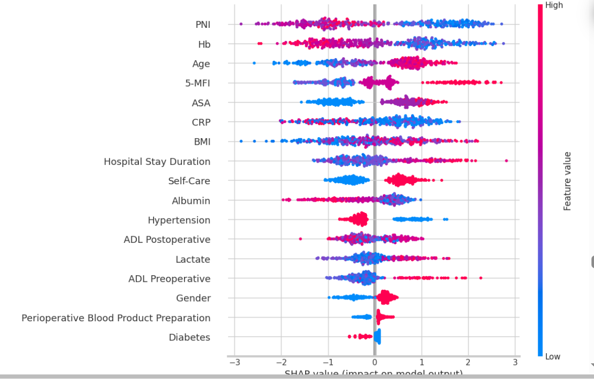

# beeswarm plot

这张图片是一个SHAP值的蜂群图（beeswarm plot），通常用来展示每个特征对模型预测的影响。这个图的解释可以从以下几个方面进行：

### 特征解释
- **每一行代表一个特征**，如PNI、Hb（血红蛋白）、Age（年龄）等。
- **纵轴**列出了所有的特征名称，从上到下通常按照特征的平均影响大小排序。

### SHAP值
- **横轴**显示了SHAP值，表示特征值对模型预测输出的贡献大小。SHAP值向右（正值）意味着它推动了模型的预测结果向更高的输出值，向左（负值）则表示推向更低的输出值。
- **颜色表示**：通常，颜色用于表示特征的实际值。在上图中，蓝色可能表示较低的特征值，而红色表示较高的特征值。

### 观察分析
- **特征影响**：如果PNI的高值（红色点）主要位于SHAP值的正方向，这表明高PNI值通常增加了模型的输出值。相反，如果低值（蓝色点）主要位于负方向，这表明低PNI值减少了输出值。
- **密集区域**：点的密集区域显示了大多数数据点的SHAP值分布。如果某个特征的点主要集中在零附近，这可能表明这个特征对于模型的预测输出影响较小。

