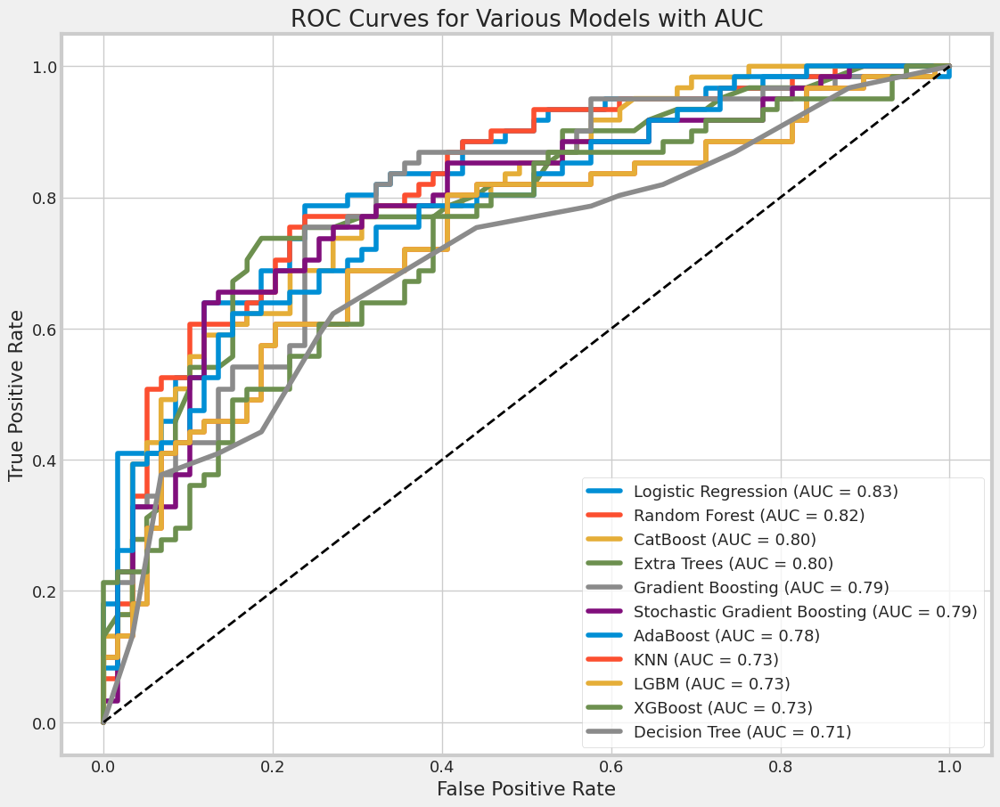
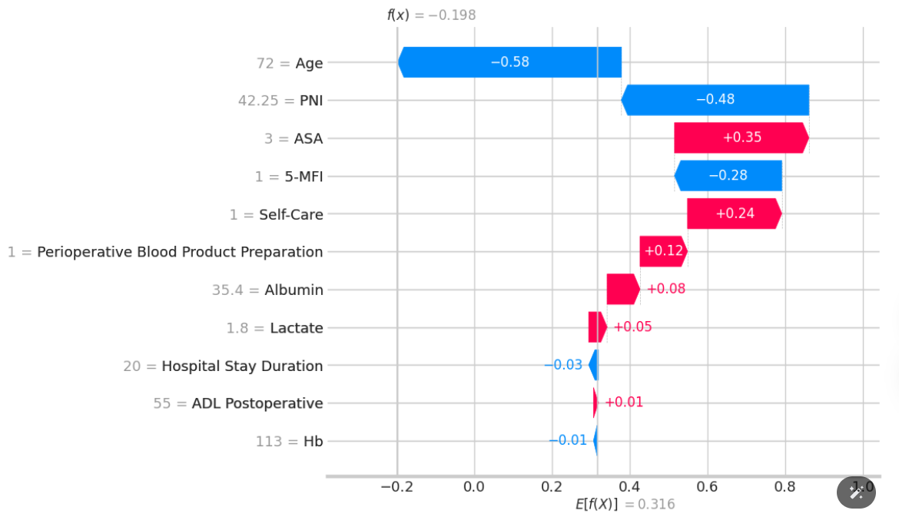
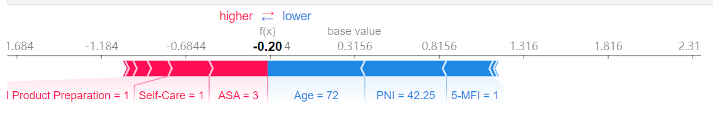
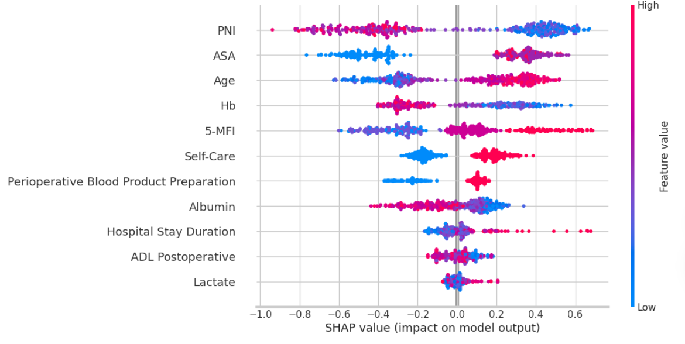

# ROC曲线


上图是不同机器学习模型的接收器操作特征（ROC）曲线，每条曲线都展示了模型在不同阈值下的真阳性率（True Positive Rate, TPR）和假阳性率（False Positive Rate, FPR）的关系。ROC曲线常用于评估二分类问题中模型的性能。曲线下面积（AUC, Area Under Curve）越接近1，模型的分类性能越好。图中还标注了每个模型的AUC值。以下是对各模型的解释：

1. **逻辑回归（Logistic Regression, AUC = 0.83）**：
   - 展示了最高的AUC值，表示在这些模型中，逻辑回归在区分两个类别方面表现最佳。

2. **随机森林（Random Forest, AUC = 0.82）**：
   - 紧随逻辑回归之后，也表现出较高的分类能力。

3. **CatBoost（AUC = 0.80）**：
   - 属于梯度提升机的一种，具有较高的分类精度。

4. **极端随机树（Extra Trees, AUC = 0.80）**：
   - 类似于随机森林，但在树的分裂上采用随机的阈值，也显示出较好的性能。

5. **梯度提升（Gradient Boosting, AUC = 0.79）**和**随机梯度提升（Stochastic Gradient Boosting, AUC = 0.79）**：
   - 这两种模型都利用了梯度提升技术，但随机梯度提升在训练过程中引入了随机性。

6. **AdaBoost（AUC = 0.78）**：
   - 一种提升算法，通过增加之前被错误分类的观察的权重来改进模型。

7. **K近邻（KNN, AUC = 0.73）**、**轻量梯度提升机（LightGBM, AUC = 0.73）**和**XGBoost（AUC = 0.73）**：
   - 这些模型的性能较为接近，均在中等水平。

8. **决策树（Decision Tree, AUC = 0.71）**：
   - 展示了所有模型中最低的AUC值，表示其在这组比较中分类能力最弱。

总体来看，逻辑回归和随机森林在这些模型中表现较好，而单一的决策树表现最差。

> 逻辑回归和随机森林的AUC面积最大。
> 下面将对逻辑回归模型进行解释。


# LogisticRegression系数分析：

由于逻辑回归模型是线性的，直接查看每个特征的系数可以提供对模型行为的直观理解。正系数增加了事件发生的概率，而负系数则降低了这种概率。这种方法简单直接，易于解释。

```python
Intercept: [-0.06237111]
                                    Feature  Coefficient
0                                       Age     0.037781
1                                 Self-Care     0.371635
2                                     5-MFI     0.453186
3                                       PNI    -0.070892
4                                   Albumin    -0.014725
5                                        Hb    -0.020909
6                                   Lactate     0.060493
7                                       ASA     0.467234
8                    Hospital Stay Duration     0.044026
9   Perioperative Blood Product Preparation     0.274301
10                        ADL Postoperative    -0.005070

Sorted by absolute value of coefficients:
                                    Feature  Coefficient
7                                       ASA     0.467234
2                                     5-MFI     0.453186
1                                 Self-Care     0.371635
9   Perioperative Blood Product Preparation     0.274301
3                                       PNI    -0.070892
6                                   Lactate     0.060493
8                    Hospital Stay Duration     0.044026
0                                       Age     0.037781
5                                        Hb    -0.020909
4                                   Albumin    -0.014725
10                        ADL Postoperative    -0.005070
```

上述结果显示了逻辑回归模型的截距和每个特征的系数，以及基于系数绝对值大小的特征排序。这些系数表示每个特征对于模型预测结果（通常是概率的对数几率）的贡献。

### 截距和系数解释

- **截距 (Intercept):** \([-0.06237111]\)
  - 这是当所有特征值都为0时，模型预测的对数几率。在本研究中，截距为负，意味着在没有任何特征输入的情况下，默认的预测倾向于非事件类别(不发生术后并发症)。

### 特征系数解释

- **正系数** 表明随着特征值的增加，事件发生的对数几率也增加，从而增加了事件发生的概率。
- **负系数** 则表明特征值增加会降低事件发生的概率。

### 特征影响力排序

1. **ASA (0.467234):** 此系数最大，表明ASA评分对模型预测的影响最为显著。ASA评分高通常指患者的整体预后较差，因此，此模型可能用于预测患者的健康风险或手术风险。
2. **5-MFI (0.453186):** 此系数紧随其后，表明5-MFI对预测结果的影响也非常大。
3. **Self-Care (0.371635):** 自理能力较好的患者可能预后更好，因此，该特征对事件发生的概率有正向影响。
4. **Perioperative Blood Product Preparation (0.274301):** 需要术前准备血制品的患者可能面临更高的风险，故对预测结果有显著的正向贡献。

### 特征对事件发生概率的具体影响：

- **Age, Lactate, Hospital Stay Duration** 等具有正系数，但影响力较小。
- **PNI, Hb, Albumin, ADL Postoperative** 等具有负系数，表示这些因素的增加可能有助于降低事件的发生概率，如改善患者的营养状况和血液参数。


从临床角度看，逻辑回归模型的系数表明某些关键的临床指标如何影响患者的健康结果。这些结果可以帮助医生评估患者的健康风险或手术后恢复的可能性。下面是对主要特征的简洁解释：

1. **ASA (0.467234):** 高ASA评分通常与患者严重的疾病状态相关，高分值表明患者手术或治疗的风险更大。
2. **5-MFI (0.453186):** 5分钟疲劳指数高表明患者可能有较差的体力和健康状态，这对手术后恢复不利。
3. **Self-Care (0.371635):** 能够自理的患者通常恢复更快，预后更佳。
4. **Perioperative Blood Product Preparation (0.274301):** 如果患者术前需要准备血制品，可能预示着更复杂的手术需求和高风险。

### 函数公式
模型预测的对数几率（log-odds）的计算公式为：
\[ \text{Log-Odds} = \text{Intercept} + (\text{Age} \times 0.037781) + (\text{Self-Care} \times 0.371635) + \ldots \]

具体为：
\[ \text{Log-Odds} = -0.06237111 + (0.037781 \times \text{Age}) + (0.371635 \times \text{Self-Care}) + (0.453186 \times 5\text{-MFI}) + (-0.070892 \times \text{PNI}) + \ldots \]

将此公式中的变量替换为患者的实际数据，就可以计算出该患者手术或治疗后不良结果发生的对数几率。使用 `exp()` 函数可以将对数几率转换为概率，从而得到事件发生的实际概率。

这个模型和公式为医疗专业人员提供了一个量化工具，用于基于多个临床指标综合评估患者的健康风险，从而在临床实践中做出更为精确的决策。


> 由于技术问题，我在使用shap对AUC排名第二的随机森林模型进行解释时，代码出现报错，所以下面选择AUC排名第三的Cat Boost模型进行解释。
# Cat Boost Classifier
## waterfall

这幅图是一个SHAP（SHapley Additive exPlanations）瀑布图，用于解释机器学习模型中单个预测的特征影响。SHAP值解释了每个特征对模型输出的具体贡献，以及这些特征是如何影响最终预测结果的。

在图中，蓝色和红色块代表不同的特征对模型预测值的贡献，其中：
- 蓝色块表示该特征对预测结果有负面影响（降低预测结果）。
- 红色块表示该特征对预测结果有正面影响（增加预测结果）。

每个块的宽度表示该特征影响的绝对大小，数字表示该特征的具体影响值。例如：
- “Age = 72”有最大的负面影响（-0.58）。
- “PNI = 42.25”对结果有相对较大的负面影响（-0.48）。
- “ASA = 3”对结果有正面影响（+0.35）。

图的底部显示了预测的基线值 \( f(x) = -0.198 \)，并且最右侧显示了整个预测的综合结果 \( E[f(X)] = 0.316 \)。

- **f(x) = -0.198**：这是模型对当前观察值的输出预测值，即在特定输入下模型的预测结果。
- **E[f(X)] = 0.316**：这表示模型对所有输入数据的平均预测值。


这幅SHAP水平瀑布图展示了Cat Boost Classifier模型根据患者的各种临床指标和特征来预测并发症发生的可能性。下面从临床角度对图中的特征进行解释：

1. **年龄（Age = 72）**：
   - 影响：-0.58，对模型预测产生了负面影响。
   - 解读：较高的年龄可能增加患者手术风险或恢复时间，从而可能降低了某些积极治疗结果的概率。

2. **PNI（42.25）**：
   - 影响：-0.48，同样是负面影响。
   - 解读：PNI（营养不良风险指数）较低可能表明患者营养状况较差，这可能会影响其手术后的恢复。

3. **ASA评分（ASA = 3）**：
   - 影响：+0.35，对模型预测产生了正面影响。
   - 解读：ASA评分用于评估患者进行手术前的麻醉风险，评分3表明患者有严重的系统性疾病，这可能意味着在模型中，更高的ASA评分与特定治疗或干预措施的需求相关。

4. **5-MFI（5 = 1）**和**自我护理（Self-Care = 1）**：
   - 影响：分别为-0.28和+0.24，表现出不同方向的影响。

5. **围手术期血制品准备（Perioperative Blood Product Preparation = 1）**：
   - 影响：+0.12，是正面影响。

6. **白蛋白（Albumin = 35.4）**和**乳酸（Lactate = 1.8）**：
   - 影响：分别为+0.08和+0.05，均为正面影响。

7. **住院天数（Hospital Stay Duration = 20）**：
   - 影响：-0.03，轻微的负面影响。

8. **术后活动日常生活（ADL Postoperative = 55）**和**血红蛋白（Hb = 113）**：
   - 影响：分别为+0.01和-0.01，影响较小。

## force


这幅图是一个SHAP力量图（force plot），用于展示单个预测的详细特征贡献。力量图非常适合揭示哪些特征推动了模型的预测结果向一个特定方向变化。以下是对图中显示的信息的解读：

### 图中元素解释：

- **f(x) = -0.204**：这是模型对当前观察值的输出预测值，即在特定输入下模型的预测结果。
- **base value = 0.3156**：这是模型的平均输出值或基准值，即在没有任何特征输入时模型的预期输出。
- **红色和蓝色条**：红色条形表示这些特征将预测值推向更高（增加事件的发生概率），而蓝色条形表示这些特征将预测值拉向更低（降低事件的发生概率）。

### 特征对预测的具体影响：

1. **Perioperative Blood Product Preparation = 1**（红色）：
   - 这个特征的激活（值为1）对预测结果有显著的负向影响，可能是因为需要准备血制品预示着更高的手术风险或患者状况较为严重。

2. **Self-Care = 1**（红色）：
   - 能够自理的情况下，该特征对预测结果也有负向影响，这与通常预期相反。可能的解释是，在具有其他风险因素的情况下，自理能力的影响被其他更严重的因素抵消。

3. **ASA = 3**（红色）：
   - ASA评分为3，表明患者有严重的系统性疾病，这增加了负面预测结果的概率。

4. **Age = 72**（蓝色）：
   - 年龄较高，此处却显示为减少负面结果的可能性，可能在这个特定模型中，年龄对结果的直接负面影响被其他因素中和。

5. **PNI = 42.25**（蓝色）：
   - 较高的PNI值降低了负面预测结果的概率，指示患者营养状态良好。

6. **5-MFI = 1**（蓝色）：
   - 在这个模型预测中，其影响是降低负面结果的概率，可能与模型中其他变量的相互作用有关。

### 结论：

这个SHAP力量图提供了对单一预测的深入解释，展示了各个特征是如何共同作用，最终导致模型预测结果低于基准值（即模型预测患者的健康风险较低）。每个特征的贡献都是在特定的临床环境和模型训练数据的基础上解释的，因此对模型的解释也应当考虑到这些背景信息。

## beeswarm


上图是一个SHAP值的蜂群图（bee swarm plot），用于展示各个特征对模型输出的影响（SHAP值），以及这些影响如何随特征值的高低变化。此图非常适用于观察和比较不同特征对模型预测结果的贡献，并理解特征值的高低是如何影响模型预测的。每个点代表一个数据点的SHAP值，颜色表示特征值的高低（蓝色表示低，红色表示高）。下面是对各特征的具体解读：

### 特征解释

1. **PNI**：
   - PNI的SHAP值分布在零的两边，说明该特征对模型输出的影响既有正面也有负面，这取决于具体的PNI值。

2. **ASA**：
   - ASA的SHAP值主要为正，且当ASA值较高时（红色点），其对模型输出的正向影响更大。这表明较高的ASA评分增加了模型预测事件发生的概率。

3. **Age**：
   - 年龄（Age）对模型的影响较为分散，表明不同的年龄可能在模型中扮演不同的角色。

4. **Hb（血红蛋白）**：
   - 低Hb值（蓝色点）通常与正的SHAP值相关，可能表示低血红蛋白水平是发生术后并发症的危险因素。

5. **5-MFI**：
   - 类似于Hb，5-MFI的影响在正负两侧均有分布，但大多数数据点对模型预测的贡献是负面的。

6. **Self-Care**：
   - 自理能力较好时（红色点较多），其对模型的正向影响更大，这可能与模型用于预测的特定事件类型有关。

7. **Perioperative Blood Product Preparation**：
   - 这一特征在SHAP值图中表现出较强的正向影响，尤其是在特征值高时。

8. **Albumin**、**Hospital Stay Duration**、**ADL Postoperative** 和 **Lactate**：
   - 这些特征的SHAP值分布显示，它们对模型输出的影响相对较小，但特定值可能导致更大的正向或负向影响。

### 总结

这个蜂群图为我们提供了一个视觉化的方式来理解不同特征如何影响模型的预测。通过观察每个特征的点分布，我们可以看出哪些特征对模型预测有较大的影响，以及这些影响是如何随特征值的变化而变化的。这对于优化模型、改进特征工程和提供临床决策支持具有重要价值。


