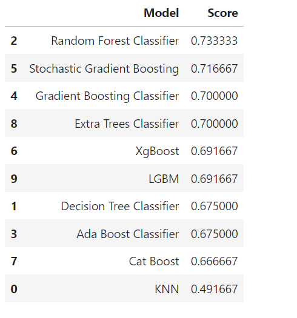
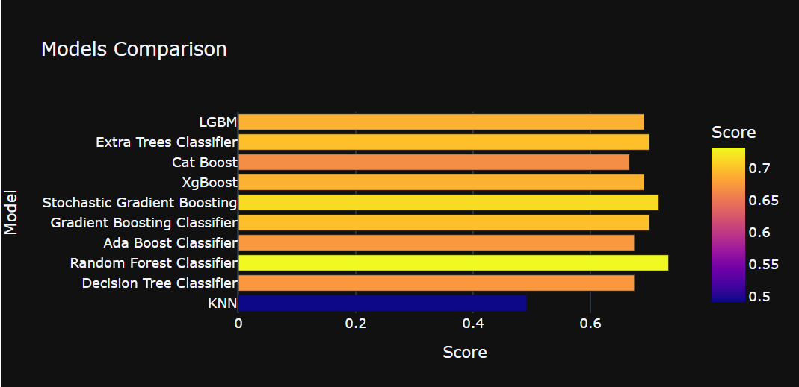
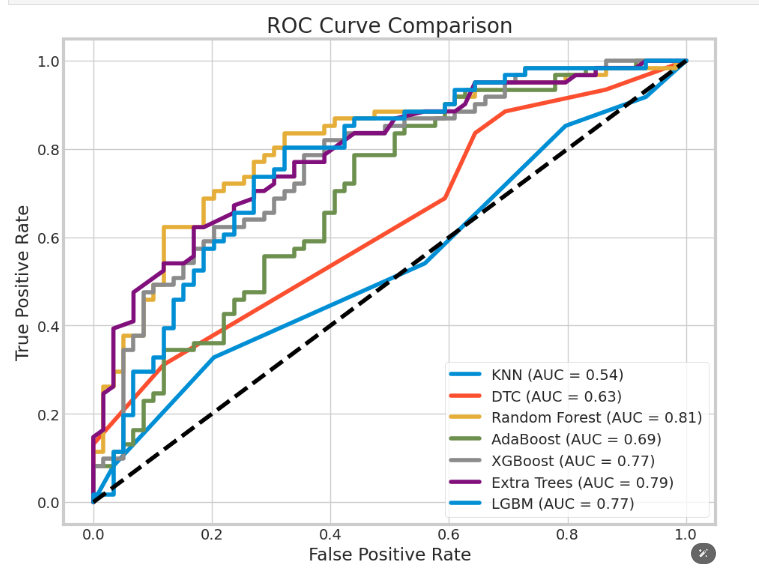
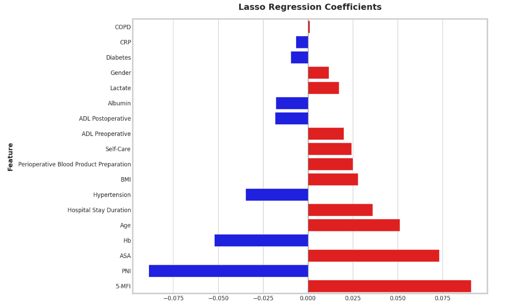
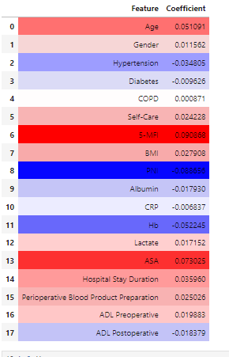
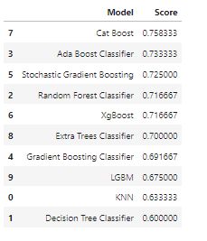
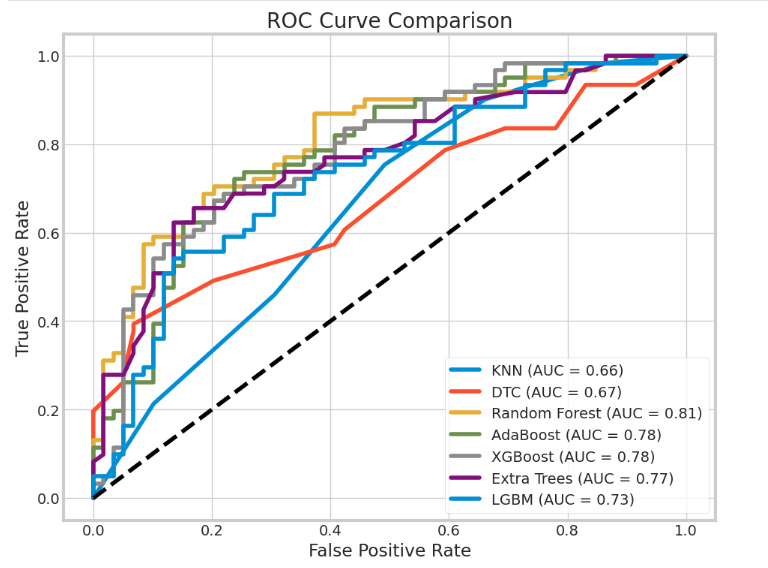

# 预后模型

## 一、不使用Lasso回归进行特征选择，直接使用下面24个特征进行模型构建

```python
 0   Age                                      400 non-null    int64  
 1   Gender                                   400 non-null    int64  
 2   Hypertension                             400 non-null    int64  
 3   Diabetes                                 400 non-null    int64  
 4   CHF                                      400 non-null    int64  
 5   COPD                                     400 non-null    int64  
 6   Self-Care                                400 non-null    int64  
 7   5-MFI                                    400 non-null    int64  
 8   Osteoporosis                             400 non-null    int64  
 9   BMI                                      400 non-null    float64
 10  PNI                                      400 non-null    float64
 11  Albumin                                  400 non-null    float64
 12  Absolute Lymphocyte Count                400 non-null    float64
 13  CRP                                      400 non-null    float64
 14  Hb                                       400 non-null    int64  
 15  Lactate                                  400 non-null    float64
 16  Surgery Duration                         400 non-null    int64  
 17  Anesthesia Type                          400 non-null    int64  
 18  ASA                                      400 non-null    int64  
 19  Hospital Stay Duration                   400 non-null    int64  
 20  Perioperative Blood Product Preparation  400 non-null    int64  
 21  Hospitalization Cost                     400 non-null    int64  
 22  ADL Preoperative                         400 non-null    int64  
 23  ADL Postoperative                        400 non-null    int64  
```

### 模型准确性结果如下






准确率最高的模型是Random Forest Classifier	准确性为0.733333

### ROC曲线如下




## 二、使用Lasso回归进行特征选择


### Lasso回归结果






### 模型准确性结果如下



```python

Model	                                          Score
7	Cat Boost	                        0.758333
3	Ada Boost Classifier            	0.733333
5	Stochastic Gradient Boosting	        0.725000
2	Random Forest Classifier	        0.716667
6	XgBoost	                                0.716667
8	Extra Trees Classifier	                0.700000
4	Gradient Boosting Classifier        	0.691667
9	LGBM	                                0.675000
0	KNN	                                0.633333
1	Decision Tree Classifier	        0.600000

```


### ROC曲线如下
