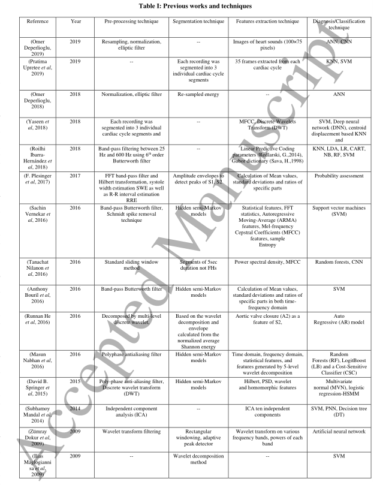
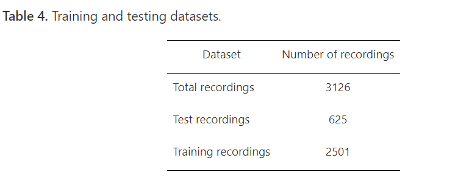
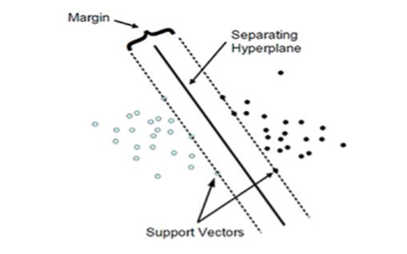
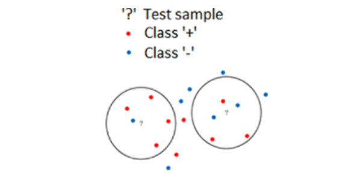
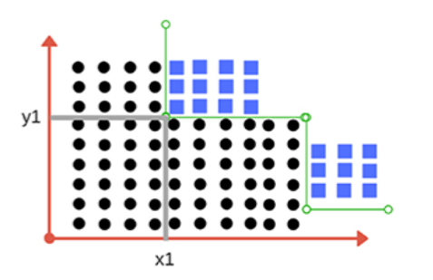

# 01Automatic_heart_sound_classification_from_segmented-unsegmented_phonocardiogram

我对这篇文章的评价，这篇文章已经过时了。
这篇文章2020年发表，所以，这篇文章中介绍的机器学习的方法和模型，绝大多数都是2019年之前的，要知道，2020年，深度学习已经开始有爆发趋势，到2023年人工智能已经成为热点话题，但由于这篇文章是2020年的，所以这篇文章的介绍依旧停留在传统的机器学习上，只有很少的篇幅在介绍LSTM模型。
当然咯，本文将传统的机器学习方法与深度学习方法进行对比，本身也是本文的一大特点。

> 一句话概括：
> 两个对比研究：
> * 传统机器学习(包括支持向量机（SVM）、K近邻（KNN）、决策树、集成分类器、人工神经网络（ANN）)与LSTM之间的对比：结果发现LSTM的模型分类效果更好
> * 心音(PCG)进行分割与不进行分割之间的对比：结果发现分割后的PCG的模型分类效果更好
> 
> 结论为：使用时频域特征(MFCC)可以提高分类模型的准确性。
>
> 另外，补充一句，该研究中还发现，与传统的机器学习模型相比(highest AUC score is 62.08% with decision tree classifier)，使用未分割的PCG的MFCC特征在LSTM中的预测效果更好(AUC score of 91.39%)，所以从这一点可以得出一个结论：传统机器学习(包括支持向量机（SVM）、K近邻（KNN）、决策树、集成分类器、人工神经网络（ANN）)与LSTM之间的对比：结果发现LSTM的模型分类效果更好。**这一点提示我，如果我要做PCG相关的研究，应该直接提取MFCC特征后，使用LSTM模型。**
> 此外，上述描述中提到，使用未分割的PCG，传统的机器学习模型 highest AUC score is 62.08% with decision tree classifier，但是在传统的机器学习模型中使用分割后的PCG，over 70% of AUC scores，所以从这一点可以得出一个结论：心音(PCG)进行分割与不进行分割之间的对比：结果发现分割后的PCG的模型分类效果更好。**这一点提示我，如果我要做PCG相关的研究，应该对PCG进行分割。**
>
> 使用了公开数据集：[2016年PhysioNet/Computing in Cardiology Challenge](https://archive.physionet.org/challenge/2016/papers/)
> 我没找到相关的数据集
> 这个平台的官网为：https://physionet.org/
> 我在这个平台的官网上搜索PCG，发现了[Heart Murmur Detection from Phonocardiogram Recordings: The George B. Moody PhysioNet Challenge 2022](https://physionet.org/content/challenge-2022/1.0.0/)这个数据集
> 此外，还发现了一个数据集，该项目收集了来自不同孕妇在单胎生理怀孕最后几个月(孕周在31至40周之间)的一系列26个胎儿心音图(PCG)信号。胎儿 PCG 数据库:[Fetal PCG Database](https://physionet.org/content/fpcgdb/1.0.0/)

## 梗概
这篇论文的核心内容是关于自动心音分类的研究，使用分割和未分割的心音图（Phonocardiogram，PCG）信号，并利用时间和频率特征进行分析。以下是该研究的关键点：

1. **研究目的**：利用心音信号检测心脏异常，这在几十年来一直是研究的活跃领域。

2. **方法**：研究中深入分析了不同的时间和频率域特征，并实验确定了有效的特征子集以提高分类性能。研究了分割和未分割的PCG信号，并报告了相关特征子集及其分类性能的重要结果。

3. **分类算法**：使用了不同的分类算法，包括支持向量机（SVM）、K近邻（KNN）、决策树、集成分类器、人工神经网络（ANN）和长短期记忆网络（LSTM）。

4. **主要结果**：观察到LSTM在从未分割PCG数据中提取的Mel频率倒谱系数（MFCC）特征上表现更好，AUC得分为91.39%。然而，MFCC特征在其他分类器上并未显示出一致的性能。相比之下，对于分割数据的时间-频率特征，所有分类器的性能都是可观的，AUC得分均超过70%。

5. **研究意义**：结果强调了时间和频率域特征的重要性，并得出结论，为了实现改进的分类，需要同时使用分割PCG信号的时频特征。

6. **数据集**：研究使用了2016年PhysioNet/Computing in Cardiology Challenge提供的超过3000个心音记录的公开数据库。

7. **特征提取**：从分割的PCG信号中提取了50个特征（20个时域和30个频域特征），并从未分割的PCG信号中计算了MFCC特征。

8. **分类性能**：使用不同的特征集对分类器的性能进行了评估，包括真正例（TP）、真负例（TN）、假正例（FP）和假负例（FN），并计算了敏感性（Sensitivity）、特异性（Specificity）、准确性（Accuracy）、整体得分和曲线下面积（AUC）。

9. **未来工作**：作者计划开发一个PCG信号数据库，并应用深度学习方法，包括卷积神经网络（CNN）和双向LSTM，以及研究新特征，如Hilbert变换（HT）、离散小波变换（DTW）和功率谱密度（PSD）。

这篇论文提供了心音分析领域的一个全面研究，包括信号预处理、特征提取、分类器设计和性能评估，旨在提高心脏异常检测的准确性。

## 详述
### I. INTRODUCTION

心脏是一个重要器官。
监视心脏活动可以避免一些严重的疾病。

心音包含了很多信息，这些信息有助于识别心脏异常。

心脏瓣膜的异常和血流的加速/减速会产生明显的杂音，然而这些杂音不容易听到。

此外，只有经验丰富且为高水平的心脏专家才能通过心音分辨心脏的正常与异常。

据美国CDC报道，全球有超过一百万的人由于缺乏廉价且可靠的诊断与筛查而面临因心脏疾病而导致的死亡或不得不面对严重的心脏疾病。

在过去的几十年里，机器学习和信号处理一直在促进医学专家加速和改进心音听诊过程。
在世界范围内，已经有许许多多的研究者致力于研究心音分类模型的各种方法。具体方法如下所示：

> 上表其实都是一些传统的机器学习方法，不看也罢，如果你感兴趣的话，可以看看，都理解模型与逻辑有帮助，但是，现在的热点是深度学习，所以，为了节约宝贵的时间精力，不建议看上表相关的内容。

在深度学习的模型中，心音常常不进行分割，而是完整地作为深度学习模型的输入，由此，引出本文的研究内容：
本文对以往心音研究的文献进行了综述，讨论了相关的分割、特征提取和分类技术。

> 下面作者开始了他的综述内容：

关于心音信号（PCG）的预处理、分割和分类的综述。它讨论了在噪声干扰下，如何通过不同的信号处理技术来提高心音信号的分析和分类的准确性。

主要讨论了心音信号（PCG）分析中的噪声问题、预处理技术、信号分割方法以及特征提取和分类技术。以下是核心内容的总结：

1. **噪声问题**：周围噪声可能导致心音信号中的S3和S4被误解，这些心音是由血液冲击左心室和心房收缩产生的。

2. **预处理技术**：
   - 使用**Systole Width Estimation (SWE)**和**R-R Interval Estimation (RRE)**来区分有效的S1/S2对。
   - 应用基于相关性和快速傅里叶变换（FFT）分析的策略来降低背景噪声。
   - **相干平均技术**：通过多次采样来提高信噪比。
   - **小波去噪技术**：消除低频噪声和其他心音干扰。
   - **独立成分分析（ICA）**和**自适应最小均方（LMS）方法**：用于噪声消除和自适应滤波。
   - 使用不同滤波器，如**Butterworth带通滤波器**和**椭圆滤波器**，来获得所需的心音频带。

3. **信号分割方法**：
   - 使用**Hidden Markov Model (HMM)**和**Hidden Semi-Markov Model (HSMM)**进行分割。
   - 通过**自相关函数（ACF）**检测周期性成分并估计收缩期长度。
   - 使用**矩形窗口**分割每个心动周期。

4. **特征提取和分类技术**：
   - 从分割后的PCG信号中提取特征，包括统计频率域和时域特征。
   - 应用不同的分类算法，如**支持向量机（SVM）**、**卷积神经网络（CNN）**、**长短期记忆网络（LSTM）**和**人工神经网络（ANN）**。
   - 一些研究中使用的特定技术包括**Mel频率倒谱系数（MFCCs）**、**离散小波变换特征**、**自回归（AR）模型**、**独立成分分析（ICA）**和**线性预测编码（LPC）参数**。

5. **研究结果**：不同的研究通过利用不同的特征和分类技术，实现了不同程度的分类准确率，例如：
   - SVM和LSTM分别达到了78.64%和74.9%的准确率。
   - 通过集成不同的特征和分类器，如SVM、决策树（DT）、概率神经网络（PNN）等，得到了94.60%、82.62%和84.54%的准确率。
   - 通过CNN、随机森林（RF）和SVM在MFCCs上实现了81.3%、74.2%和75.6%的准确率。
   - 使用RNN得到了74.9%的准确率。
   - ANN和kth-最近邻（KNN）分别达到了93.3%和98.8%的准确率。

6. **研究目的**：设计智能系统以辅助诊断，提高心音信号分类的准确性，帮助心脏病专家进行决策。

7. **研究方法**：使用2016年PhysioNet/Computing in Cardiology Challenge的公开数据库，包含超过3000个心音记录，进行PCG分析和分类模型的训练。

8. **论文结构**：包括方法论、数据库和特征集描述、性能评估指标、实验结果、比较分析以及结论和未来工作机会。

综述强调了心音信号分析在心血管疾病诊断中的重要性，并概述了提高心音信号分类准确性的不同技术和方法。

### II. METHODOLOGY

#### 2.1. Segmentation
采用的分割技术为由 Springer 等(2015)提出的基于 LR-HSMM 的心音分割用于 PCG 分割，这是 Schmidt 等(2010)提出的与持续时间相关的 HMMl 的扩展版本。

#### 2.2. Feature extraction
In the first type, both time and frequency features are extracted using segmented PCG signals, as listed in table 3. 对分割后的数据，提取50个时域和频域特征。
In the second type, MFCCs are computed using the unsegmented PCG signal; details are given in the following subsections.对于未分割的数据，提取MFCC特征。

##### 2.2.1. Time and frequency domain features
对分割后的数据，提取50个时域和频域特征。
50 features (20 time-domain and 30 frequency-domain) are extracted from the segmented PCG signal, as listed in table 3.
##### 2.2.2. Mel-frequency cepstral coefficients

#### 2.3. Classification
本研究使用了六种不同的分类算法，包括支持向量机、第k近邻、决策树、人工神经网络、长短期记忆网络和集成分类器。使用不同的时域和频域特征，利用分段和未分段的PCG信号来评估每个分类器的性能。表IV说明了用于训练和测试每个分类器的记录。

> 下面作者介绍了不同的分类器，不看也罢。因为，第一，作者既没有提供更加详细的操作方法，他没说，他使用R还是Python呐，也没说具体的代码是啥，第二，也没有详细且生动形象地以一种让人通俗易懂的方式介绍这些分类器，所以，这一部分，不看也罢，全是废话。

##### 2.3.1. Support vector machine

##### 2.3.2. Nearest neighbors

##### 2.3.3. Decision tree

