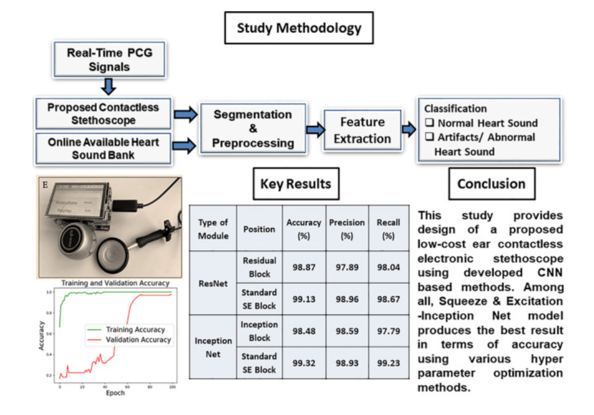

# 02Design_of_ear‑contactless_stethoscope_and_improvement_in_the_performance_of_deep_learning_based_on_CNN_to_classify_the_heart_sound

## 梗概
这篇论文的核心内容是关于设计一种非接触式电子听诊器以及提高基于卷积神经网络（CNN）的深度学习模型在分类心脏声音方面的性能。以下是该研究的关键点：

1. **研究背景**：心血管疾病在全球范围内迅速增长，准确分类心血管疾病是医疗保健中的一个重要研究领域。在COVID-19疫情期间，由于医护人员穿着防护服，直接接触患者可能会传播疫情，因此非接触式听诊变得十分必要。

2. **非接触式听诊器设计**：设计了一种低成本的非接触式电子听诊器，使用蓝牙启用的微型扬声器代替耳机进行听诊。

3. **深度学习模型优化**：研究旨在提高深度学习分类器（如循环神经网络RNN和CNN）在不同心脏瓣膜问题上的性能，通过调整优化器的学习率、dropout率和隐藏层等超参数。

4. **特征提取**：研究中使用了声学、时间和频率域特征。

5. **数据集**：使用了来自标准数据存储库的正常和患病患者的心脏声音数据进行软件模型的训练。

6. **模型性能**：提出的基于CNN的Inception网络模型在测试数据集上达到了99.65% ± 0.06%的准确率，敏感性为98.8% ± 0.05%，特异性为98.2% ± 0.19%。提出的混合CNN-RNN架构在超参数优化后在测试数据上达到了91.17% ± 0.03%的准确率，而基于LSTM的RNN模型达到了82.32% ± 0.11%的准确率。

7. **比较研究**：将评估结果与机器学习算法进行比较，改进的CNN-based Inception Net模型在其他模型中最为有效。

8. **关键词**：PCG信号分析、心脏瓣膜疾病、人工智能、学习率、深度神经网络、Inception网络、循环神经网络、Dropout率、超参数、机器学习、特征提取、分类、声学听诊器、声学特征。

9. **研究组织**：论文还包含了相关工作的文献研究、研究目的、使用的方法和材料、系统硬件开发、基于软件的深度学习模型的开发以及结果分析。

10. **未来工作**：作者计划在未来开发一个PCG信号数据库，并应用深度学习方法，包括CNN和双向LSTM，以及研究新特征，如Hilbert变换（HT）、离散小波变换（DTW）和功率谱密度（PSD）。

这篇论文提供了心脏声音分析领域的一个全面研究，包括听诊器硬件的设计、深度学习模型的开发和优化，以及心脏声音分类的性能评估。

## 详述

### 0. 图摘要

这是一张关于心音信号研究方法的摘要图：

#### 研究方法论
1. **实时心音信号（PCG信号）**：研究涉及实时采集的心音信号。
2. **无接触式分类**：提出了一种无接触的分类方法。
3. **分割**：心音信号需要经过分割处理。
4. **特征提取**：从心音信号中提取特征，区分正常心音和异常声音/伪迹。
5. **在线可用的心音库**：使用在线心音数据库进行研究。

#### 关键结果
- **模块设计**：设计了一种低成本的非接触式电子听诊器模块。
- **准确度**：该模块在分类心音时显示出高准确度、精确度和召回率。
  - 准确度：98.87%
  - 精确度：97.89%
  - 召回率：98.04%

#### 结论
- 研究提出了一种基于CNN（卷积神经网络）的分类方法，使用了多种优化技术。
- 比较了不同的网络结构，包括：
  - **ResNet**（残差网络）
  - **Squeeze & Excitation Block (SEBlock)**：一种能够提高模型性能的模块。
  - **Inception Net**：谷歌的Inception网络，用于提高准确度。
- **训练和验证准确度**：展示了不同网络结构在训练和验证过程中的准确度。
  - Inception Net在标准条件下的训练和验证准确度分别为99.32%和98.93%。
  - SE Block在不同超参数优化方法下表现良好。

#### 训练细节
- 研究中使用了多个epoch来进行模型训练。

#### 网络结构比较
- **Inception Net**的变种（带有SE Block的Inception Block）在准确性方面表现最佳。

摘要图提供了研究的高层次概览，包括所采用的方法、关键结果和结论，以及不同深度学习模型在心音信号分类任务上的性能比较。

