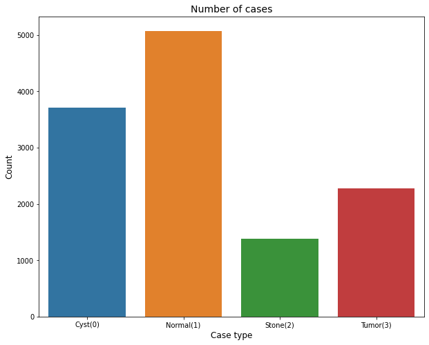

# 蒋傲的第一周汇报

## 目录
1. 完成工作
2. 项目详述
3. 下周计划
4. 需求

### 一、完成工作

1. 完成对宁波超算中心云服务器的基本操作的学习和使用。
2. 完成一个项目的复现，具体为一个基于深度学习的关于肾病CT影像图的七层卷积神经网络模型。

### 二、项目详述

#### 1. 安装并导入相关的库

#### 2. 加载数据并进行预处理
##### 2.1 原始数据如下所示：为肾脏CT影像图

##### 2.2 图像原始尺寸信息如下所示：

图像原始尺寸为512像素X512像素

经预处理后的图像尺寸为28像素X28像素

缩小像素尺寸的目的是为了在不损失图像特征的前提下减小计算量。

##### 2.3 样本计数如下图所示：

从计数结果可以看出，标签为1的类别（正常）样本数量最多，有5077个样本。
标签为0的类别（囊肿）样本数量最少，有1377个样本。
标签为3的类别（肿瘤）和标签为2的类别（结石）的样本数量分别位于中间，分别是2283和3709。

**样本总计为12,446个样本**

由于不同类别的样本数量不同，这会造成模型预测时更偏向于输出样本数量多的类别，因此需要都样本进行均衡处理，使各类别的样本数量一致。这样做的另一个好处是，可以通过过采样技术（对图像进行旋转和镜像、裁剪等操作）扩增样本量。

#### 3. 均衡数据
均衡后的样本如下图所示：

样本均衡后，每个种类的样本数量为5,077个样本。

样本均衡后，**样本总计20,308个样本**，换言之，模型将会处理20，308张28像素X28像素的图片。

#### 4. 建立模型

建立了一个七层的卷积神经网络模型，其中三层为卷积层，四层为全连接层，使用609,628个参数进行计算。

#### 5. 训练模型

当模型训练到第十轮时，其精确度在训练集和验证集上已达99.9%

#### 6. 验证模型
使用单张CT图验证模型的诊断能力，模型可以正确诊断。

### 三、 下周计划
我手上有一个关于肾病危险因素的excel格式的数值型数据集，计划接下来两周跑一下相关的模型。

我手上还有一个心音数据集和糖尿病视网膜病变的数据集，计划接下来三到四周跑一下相关的模型。
 
### 四、 需求

希望您能为我分配一个固定的工位，有一个桌子和椅子就行，能放电脑，能坐就行。

