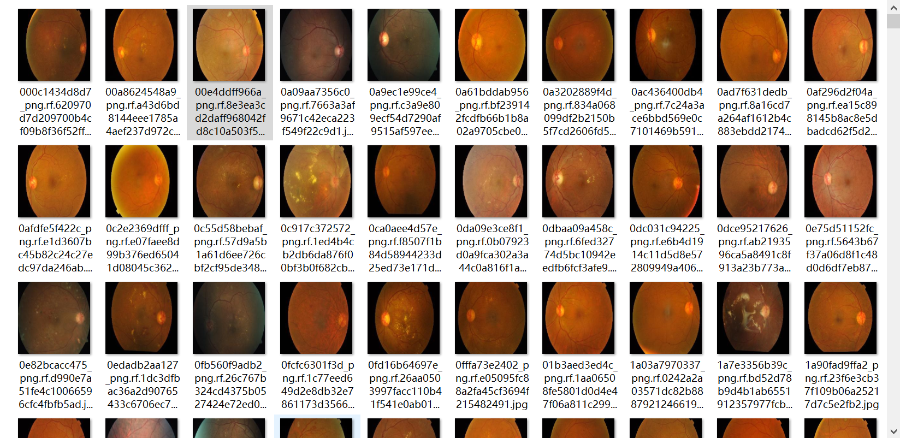
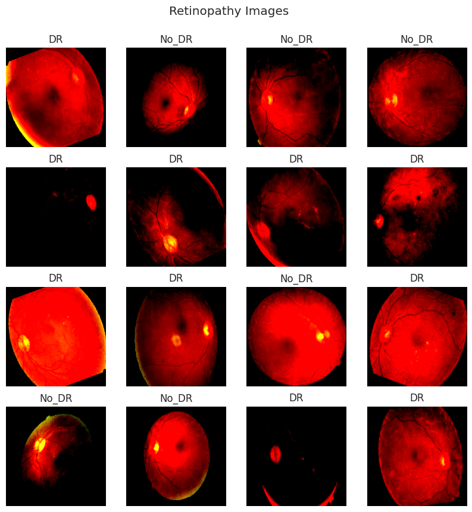
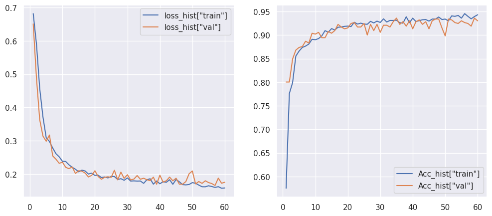

# 蒋傲的第二周和第三周汇报

## 目录
1. **完成工作**：复现一个“基于六层卷积神经网络的糖尿病视网膜病变的诊断模型”的项目
2. **项目详述**：包括原始数据集样本数量、模型结构、损失和准确率的历史变化、模型性能报告
3. **短期计划**：
   * 未来两周(第十三周和第十四周)将复现一个关于慢性肾病的预测模型。
   * 再接下来三周(第十五周、第十六周和第十七周)将准备期末考试，不跑模型。
   * 再接下来将开始暑假，暑假开始时，将着手准备复现另一个糖尿病视网膜病变的诊断模型和一个心脏杂音的诊断模型。


### 一、完成工作

1. 复现一个“基于六层卷积神经网络的糖尿病视网膜病变的诊断模型”的项目。


### 二、项目详述

#### 1. 原始数据集样本数量
原始数据集分成三个文件夹：训练集、验证集、测试集

* 训练集：用于模型的实际训练过程。
DR：1050
NO_DR:1026

* 验证集：用于模型的调参和模型选择过程。
DR：245
NO_DR:286

* 测试集：用于最终评估模型的性能。
DR：113
NO_DR:118

训练集:验证集:测试集 ≈ 8:2:1

原始图像如下图所示：




图像预处理时，将图像调整为255x255的大小，三通道，并进行标准化处理，预处理后的图像如下图所示：



> 关于训练集、验证集、测试集的具体作用和详细解释如下：

训练集（Training Set）、验证集（Validation Set）和测试集（Test Set）是在机器学习和深度学习中用于评估模型性能的不同数据集。它们各自的作用如下：

1. **训练集（Training Set）**:
   - **主要作用**：用于模型的实际训练过程。模型通过从训练集中学习数据的特征和模式来调整其参数。
   - **目的**：使模型能够对输入数据进行准确的预测或分类。
   - **使用方式**：在训练过程中，模型会多次迭代训练集，每次迭代都会尝试减少预测误差。

2. **验证集（Validation Set）**:
   - **主要作用**：用于模型的调参和模型选择过程。在训练过程中，验证集用于评估模型对未见数据的泛化能力。
   - **目的**：帮助我们选择最佳的模型参数（如学习率、正则化系数等），防止模型过拟合，并监控模型训练的进度。
   - **使用方式**：通常在训练几个周期后，我们会在验证集上评估模型的性能，并根据性能结果调整模型。

3. **测试集（Test Set）**:
   - **主要作用**：用于最终评估模型的性能。测试集应该在整个训练和验证过程中保持独立，直到模型训练完成。
   - **目的**：提供模型在实际应用中性能的一个无偏估计，确保模型对新数据有良好的泛化能力。
   - **使用方式**：一旦模型训练和调参完成，我们会在测试集上运行模型，查看其最终性能指标，如准确率、召回率等。

**重要性**:
- 训练集、验证集和测试集共同确保了模型能够被充分训练，同时避免过拟合，并提供了模型在实际应用中的性能估计。
- 它们使得模型评估过程更加严谨和科学，帮助我们构建更加健壮和可靠的机器学习系统。

**划分比例**:
- 在实践中，数据集的划分比例可能会有所不同，但常见的划分比例是：60%训练集、20%验证集、20%测试集，或者70%训练集、15%验证集、15%测试集。具体的划分比例取决于数据的总量和可用性。

**交叉验证**:
- 为了更有效地利用数据，有时会采用交叉验证的方法。交叉验证是一种技术，它将可用的数据分成多个小批次，每个批次轮流作为验证集或测试集，而其余的数据用于训练。

总之，合理地划分和使用训练集、验证集和测试集对于构建一个性能优越的机器学习模型至关重要。


#### 2. 模型结构


```python
----------------------------------------------------------------
        Layer (type)               Output Shape         Param #
================================================================
            Conv2d-1          [-1, 8, 253, 253]             224
            Conv2d-2         [-1, 16, 124, 124]           1,168
            Conv2d-3           [-1, 32, 60, 60]           4,640
            Conv2d-4           [-1, 64, 28, 28]          18,496
            Linear-5                  [-1, 100]       1,254,500
            Linear-6                    [-1, 2]             202
================================================================
Total params: 1,279,230
Trainable params: 1,279,230
Non-trainable params: 0
----------------------------------------------------------------
Input size (MB): 0.74
Forward/backward pass size (MB): 7.05
Params size (MB): 4.88
Estimated Total Size (MB): 12.67
----------------------------------------------------------------
```

1. **层级信息**:
   - `Conv2d-1`: 第一个卷积层，输出形状为 `[-1, 8, 253, 253]`，表示批次大小不固定（`-1`），有8个输出通道，空间维度为253x253。参数数量为224。
   - `Conv2d-2`: 第二个卷积层，输出形状为 `[-1, 16, 124, 124]`，16个输出通道，空间维度为124x124。参数数量为1,168。
   - `Conv2d-3`: 第三个卷积层，输出形状为 `[-1, 32, 60, 60]`，32个输出通道，空间维度为60x60。参数数量为4,640。
   - `Conv2d-4`: 第四个卷积层，输出形状为 `[-1, 64, 28, 28]`，64个输出通道，空间维度为28x28。参数数量为18,496。
   - `Linear-5`: 第一个全连接层，输出维度为100。参数数量为1,254,500。
   - `Linear-6`: 第二个全连接层，输出维度为2（对应两个类别的输出）。参数数量为202。

2. **参数统计**:
   - `Total params`: 模型的总参数数量为1,279,230。
   - `Trainable params`: 可训练的参数数量也是1,279,230，表示所有参数都是可训练的。
   - `Non-trainable params`: 非训练参数数量为0。

3. **内存估计**:
   - `Input size (MB)`: 输入数据的大小估计为0.74MB。
   - `Forward/backward pass size (MB)`: 前向传播和反向传播过程中所需的内存大小估计为7.05MB。
   - `Params size (MB)`: 模型参数在内存中占用的大小估计为4.88MB。
   - `Estimated Total Size (MB)`: 估计的总大小，包括参数和一次传播所需的内存，为12.67MB。


#### 3. 损失和准确率的历史变化




1. **损失历史（Loss History）**:
   - 图中展示了两个损失曲线，一条是训练集上的损失（`loss_hist["train"]`），另一条是验证集上的损失（`loss_hist["val"]`）。
   - X轴表示epoch数，从0到60，共61个点，代表每个epoch的损失值。
   - Y轴表示损失值，从图表中可以看出损失值的范围在0到1之间，乘以100%后显示为百分比。
   - 通常损失值会随着epoch的增加而降低，理想情况下，验证集上的损失也应该呈现下降趋势，表明模型在训练集和验证集上的性能都在提升。

2. **准确率历史（Accuracy History）**:
   - 图中展示了两个准确率曲线，一条是训练集上的准确率（`Acc_hist["train"]`），另一条是验证集上的准确率（`Acc_hist["val"]`）。
   - X轴同样表示epoch数，从0到60。
   - Y轴表示准确率，从图表中可以看出准确率的范围在0到1之间，乘以100%后显示为百分比。
   - 训练集上的准确率（`Acc_hist["train"]`）看起来较高，而验证集上的准确率（`Acc_hist["val"]`）通常稍低，这是正常现象，因为模型在训练集上通常会过拟合。

3. **模型性能**:
   - 从图表中可以看出，训练集损失逐渐降低，验证集损失也呈现下降趋势，但在某一点之后（例如在图表中大约epoch 40左右），验证集损失开始上升，这可能是过拟合的迹象。
   - 训练集准确率持续提高，而验证集准确率在初期提升后趋于稳定，这同样表明模型可能开始过拟合。


上图提供了模型训练和验证过程中损失和准确率变化的视觉表示，有助于分析模型的学习动态和调整训练策略。


> 关于损失函数和准确率的具体解释如下：


损失函数（Loss Function）和准确率（Accuracy）是评估机器学习模型性能的两个重要指标。下面是它们的常见计算公式：

##### 损失函数（Loss Function）:
损失函数用于衡量模型预测值与实际值之间的差异。不同类型的问题和模型会使用不同的损失函数。以下是几种常见的损失函数：

1. **均方误差（Mean Squared Error, MSE）** - 用于回归问题：
   \[ \text{MSE} = \frac{1}{n} \sum_{i=1}^{n}(y_i - \hat{y}_i)^2 \]
   - 其中，\(n\) 是样本数量，\(y_i\) 是第\(i\)个样本的真实值，\(\hat{y}_i\) 是预测值。

2. **交叉熵损失（Cross-Entropy Loss）** - 用于分类问题：
   \[ \text{Cross-Entropy} = -\sum_{c=1}^{M}y_{o,c}\log(p_{o,c}) \]
   - 对于多分类问题，\(M\) 是类别数量，\(y_{o,c}\) 是一个二进制指示器（如果类别 \(c\) 是观测样本 \(o\) 的正确分类，则为1，否则为0），\(p_{o,c}\) 是模型预测样本 \(o\) 属于类别 \(c\) 的概率。

3. **合页损失（Hinge Loss）** - 用于支持向量机（SVM）：
   \[ \text{Hinge Loss} = \max(0, 1 - y_i \cdot \hat{y}_i) \]
   - 对于二分类问题，\(y_i\) 是真实标签（-1或+1），\(\hat{y}_i\) 是模型预测值。


> 在这个项目中采取的损失函数为负对数似然损失函数（Negative Log Likelihood Loss, NLLLoss）

具体解释如下：
##### 负对数似然损失函数（Negative Log Likelihood Loss, NLLLoss）
负对数似然损失函数（Negative Log Likelihood Loss, NLLLoss）是机器学习中用于分类问题的损失函数之一，特别是在处理多类分类问题时非常常见。以下是对NLLLoss的详细解释：

###### 基本概念：
- **对数似然损失（Log Likelihood Loss）**：这是一种衡量模型输出的概率分布与真实标签的一致性的指标。对数似然损失越小，表示模型的预测越准确。
- **负对数似然损失（Negative Log Likelihood Loss）**：为了使用梯度下降算法，通常取对数似然损失的负值，因为梯度下降需要最小化损失函数。

###### 数学表达：
假设有 \( C \) 个类别的分类问题，对于一个给定的样本，模型输出了一个 \( C \) 维的概率向量 \( p = [p_1, p_2, ..., p_C] \) ，其中 \( p_i \) 是模型预测样本属于第 \( i \) 个类别的概率。如果 \( y \) 是样本的真实类别（一个从 1 到 \( C \) 的整数），则该样本的对数似然损失为：
\[ \text{Log Likelihood Loss} = -\log(p_y) \]

对于整个数据集，损失函数通常是所有样本损失的总和或平均值。在 PyTorch 中，可以通过 `reduction` 参数来指定损失的缩减方式：
- `"sum"`：对所有样本的损失求和。
- `"mean"`（默认）：对所有样本的损失求平均。
- `"none"`：不对损失进行缩减，返回每个样本的损失。

###### 特点：
- **适用性**：NLLLoss 适用于那些模型输出为概率分布的情况，如使用 softmax 函数作为输出层的多类分类问题。
- **稳定性**：在 PyTorch 中，`nn.NLLLoss` 通常与 `nn.LogSoftmax` 层一起使用，后者在模型输出上应用了对数操作，这有助于数值稳定性。
- **目标函数**：在训练过程中，目标是最小化负对数似然损失，这等价于最大化对数似然，即让模型预测的概率分布尽可能接近真实的概率分布。

###### 使用示例：
假设模型输出的概率分布为 \( [0.1, 0.2, 0.7] \) ，并且真实标签为2（即第三个类别），则损失计算如下：
\[ \text{NLLLoss} = -\log(0.7) \]

在实际应用中，负对数似然损失函数是分类问题中常用的损失函数之一，它鼓励模型输出的概率分布与真实标签的概率分布尽可能接近。通过最小化这个损失函数，模型可以学习到如何正确分类新的数据点。

###### 在这个项目中指定`reduction="sum"`
当指定`reduction="sum"`时，负对数似然损失函数（Negative Log Likelihood Loss, NLLLoss）的公式如下：

假设有 \( N \) 个样本的数据集，每个样本的真实标签为 \( y_i \) （其中 \( i = 1, 2, ..., N \)），并且模型输出对应的概率分布为 \( p_i = [p_{i1}, p_{i2}, ..., p_{iC}] \) ，其中 \( p_{ic} \) 是模型预测第 \( i \) 个样本属于第 \( c \) 个类别的概率，\( C \) 是类别的总数。

对于每个样本 \( i \) ，负对数似然损失计算为：

\[ \text{NLL}_i = -\log(p_{iy_i}) \]

使用`reduction="sum"`，整个数据集的总损失 \( L \) 是所有样本损失的总和：

\[ L = \sum_{i=1}^{N} \text{NLL}_i = -\sum_{i=1}^{N} \log(p_{iy_i}) \]

在PyTorch中，使用`nn.NLLLoss(reduction="sum")`时，模型的输出应该是未经过softmax函数处理的原始分数（logits），并且模型将自动应用log_softmax来计算损失。这意味着PyTorch内部计算的是对每个样本应用log_softmax后的负对数似然损失的总和。

##### 准确率（Accuracy）:
准确率是分类问题中最常用的性能指标，它衡量的是模型正确预测的样本数占总样本数的比例。

\[ \text{Accuracy} = \frac{TP + TN}{TP + TN + FP + FN} \]
- 其中，\(TP\)（True Positives）是正确预测为正类的样本数，\(TN\)（True Negatives）是正确预测为负类的样本数，\(FP\)（False Positives）是错误预测为正类的样本数，\(FN\)（False Negatives）是错误预测为负类的样本数。

在多分类问题中，准确率可以定义为所有正确分类的样本数与总样本数的比例。

\[ \text{Accuracy} = \frac{\text{Number of Correct Predictions}}{\text{Total Number of Samples}} \]

损失函数和准确率是衡量模型性能的重要指标，但它们通常不能同时优化。例如，在某些情况下，可能会牺牲一点准确率以减少损失，或者反之。因此，模型的选择和优化需要根据具体问题和业务需求来决定。


#### 4. 模型性能报告

- **精确度(Precision)**：模型预测为正类别中实际为正类别的比例。
- **召回率(Recall)**：实际为正类别中被模型正确预测为正类别的比例。
- **F1-Score**：精确度和召回率的调和平均值，是一个综合指标。
- **支持度(Support)**：各类别在数据集中的样本数量。

##### 4.1 基于训练集为糖尿病视网膜病变分类模型生成分类报告

```python
              precision    recall  f1-score   support

         0.0       0.96      0.94      0.95      1050
         1.0       0.94      0.96      0.95      1026

    accuracy                           0.95      2076
   macro avg       0.95      0.95      0.95      2076
weighted avg       0.95      0.95      0.95      2076
```

1. **Precision（精确度）**:
   - 类别0.0的精确度是0.96，意味着在所有被模型预测为0.0类的样本中，实际上有96%确实属于0.0类。
   - 类别1.0的精确度是0.94，意味着在所有被模型预测为1.0类的样本中，实际上有94%确实属于1.0类。

2. **Recall（召回率）**:
   - 类别0.0的召回率是0.94，表示在所有实际为0.0类的样本中，模型成功识别出了94%。
   - 类别1.0的召回率是0.96，表示在所有实际为1.0类的样本中，模型成功识别出了96%。

3. **F1-Score（F1分数）**:
   - 类别0.0的F1分数是0.95，这是精确度和召回率的调和平均数，表明模型在0.0类的平衡性能很好。
   - 类别1.0的F1分数也是0.95，表明模型在1.0类的平衡性能同样很好。

4. **Support（支持度）**:
   - 类别0.0的支持度是1050，表示训练集中有1050个样本属于0.0类。
   - 类别1.0的支持度是1026，表示训练集中有1026个样本属于1.0类。

5. **Accuracy（准确率）**:
   - 总体准确率是0.95，表示模型在所有预测中正确预测的比例为95%。

6. **Macro Avg（宏平均）**:
   - 宏平均的精确度、召回率和F1分数都是0.95，这是将每个类别的指标同等看待的平均值。

7. **Weighted Avg（加权平均）**:
   - 加权平均的精确度、召回率和F1分数也都是0.95，这是根据每个类别的支持度（样本数量）进行加权的平均值。

**解读**:
- 从报告中可以看出，模型在两个类别上的性能都相当好，具有较高的精确度、召回率和F1分数。
- 准确率0.95表明模型在训练集上的预测非常准确，几乎所有的预测都是正确的。
- 宏平均和加权平均指标相同，这通常意味着类别是平衡的，每个类别对总体性能的贡献是均等的。
- 尽管模型在训练集上表现良好，但还需在独立的验证集或测试集上评估模型，以确保模型具有良好的泛化能力。


##### 4.2 基于验证集为糖尿病视网膜病变分类模型生成分类报告

```python
              precision    recall  f1-score   support

         0.0       0.93      0.91      0.92       245
         1.0       0.92      0.94      0.93       286

    accuracy                           0.93       531
   macro avg       0.93      0.93      0.93       531
weighted avg       0.93      0.93      0.93       531
```

1. **Precision（精确度）**:
   - 类别0.0的精确度是0.93，这意味着在所有被模型预测为0.0类的样本中，约有93%实际上确实属于0.0类。
   - 类别1.0的精确度是0.92，这意味着在所有被模型预测为1.0类的样本中，约有92%实际上确实属于1.0类。

2. **Recall（召回率）**:
   - 类别0.0的召回率是0.91，表示在所有实际为0.0类的样本中，模型成功识别出了91%。
   - 类别1.0的召回率是0.94，表示在所有实际为1.0类的样本中，模型成功识别出了94%。

3. **F1-Score（F1分数）**:
   - 类别0.0的F1分数是0.92，这是精确度和召回率的调和平均数，表明模型在0.0类的平衡性能很好。
   - 类别1.0的F1分数是0.93，表明模型在1.0类的平衡性能也很好。

4. **Support（支持度）**:
   - 类别0.0的支持度是245，表示验证集中有245个样本属于0.0类。
   - 类别1.0的支持度是286，表示验证集中有286个样本属于1.0类。

5. **Accuracy（准确率）**:
   - 总体准确率是0.93，表示模型在验证集上的预测正确率为93%。

6. **Macro Avg（宏平均）**:
   - 宏平均的精确度、召回率和F1分数都是0.93，这是将每个类别的指标同等看待的平均值。

7. **Weighted Avg（加权平均）**:
   - 加权平均的精确度、召回率和F1分数也都是0.93，这是根据每个类别的支持度（样本数量）进行加权的平均值。

**解读**:
- 模型在验证集上的性能非常好，具有较高的精确度、召回率和F1分数，这表明模型能够准确地分类两个类别的样本。
- 准确率为0.93，意味着模型在验证集上的预测中，大约有93%是正确的。
- 宏平均和加权平均指标相同，这通常意味着类别是相对平衡的，每个类别对总体性能的贡献是均等的，且模型对两个类别的预测性能相当。
- 尽管模型在验证集上表现良好，但为了全面评估模型，还应考虑其他因素，如模型是否过拟合或欠拟合，以及模型在不同类别上的表现是否一致。


##### 4.3 基于测试集为糖尿病视网膜病变分类模型生成分类报告


```python
              precision    recall  f1-score   support

         0.0       0.95      0.93      0.94       113
         1.0       0.93      0.96      0.95       118

    accuracy                           0.94       231
   macro avg       0.94      0.94      0.94       231
weighted avg       0.94      0.94      0.94       231
```

上述统计指标通常用于分类问题中评估模型的性能，特别是二分类或多分类问题。以下是每个指标的定义：

1. **精确度（Precision）**:
   - 精确度表示预测为正类别中实际为正类别的比例。换句话说，它衡量了所有被预测为正类别的样本中，有多少是正确的。
   - 对于类别0.0：精确度为0.95，意味着在所有被预测为0.0类的样本中，有95%是正确的。
   - 对于类别1.0：精确度为0.93，意味着在所有被预测为1.0类的样本中，有93%是正确的。

2. **召回率（Recall）**:
   - 召回率也称为真正例率（True Positive Rate, TPR），它表示实际为正类别中被正确预测为正类别的比例。召回率越高，漏掉的正类别样本越少。
   - 对于类别0.0：召回率为0.93，意味着在所有实际为0.0类的样本中，有93%被正确识别。
   - 对于类别1.0：召回率为0.96，意味着在所有实际为1.0类的样本中，有96%被正确识别。

3. **F1-Score**:
   - F1-Score是精确度和召回率的调和平均数，用于衡量模型的准确性和完整性的平衡。它的值介于0和1之间，值越高表示模型的性能越好。
   - 对于类别0.0：F1分数为0.94，表示模型在类别0.0上的性能平衡良好。
   - 对于类别1.0：F1分数为0.95，表示模型在类别1.0上的性能平衡良好。

4. **支持度（Support）**:
   - 支持度是各个类别在数据集中的样本数量。
   - 类别0.0的支持度为113，表示测试集中有113个样本属于类别0.0。
   - 类别1.0的支持度为118，表示测试集中有118个样本属于类别1.0。

5. **准确率（Accuracy）**:
   - 准确率表示所有预测中正确预测的比例。它是最直观的性能指标，衡量了模型整体的预测准确性。
   - 总体准确率为0.94，意味着在整个测试集上，有94%的样本被正确分类。

6. **宏平均（Macro Avg）**:
   - 宏平均是计算各个类别的指标的简单算术平均值。它不考虑类别的支持度（样本数量）。
   - 宏平均精确度、召回率和F1-Score都为0.94，表示在所有类别上的平均性能。

7. **加权平均（Weighted Avg）**:
   - 加权平均是根据每个类别的支持度（样本数量）进行加权的指标平均值。它反映了各类别对整体性能的贡献。
   - 加权平均精确度、召回率和F1-Score都为0.94，表示在考虑了样本数量后，所有类别的平均性能。

这些指标表明模型在两个类别上都表现良好，具有较高的精确度和召回率，以及很好的综合性能（F1分数）。准确率进一步证实了模型在整体上的表现。宏平均和加权平均的一致性表明，尽管两个类别的支持度略有不同，但模型对两个类别的预测性能相当。


##### 4.4 在统计学和机器学习中，分类报告中的各项指标的定义

1. **精确度（Precision）**:
   
   $[ \text{Precision} = \frac{TP}{TP + FP} ]$
   
   - 其中，TP（True Positives）是正确预测为正类别的样本数量。
   - FP（False Positives）是错误预测为正类别的样本数量。
   - 精确度表示在所有被预测为正类别的样本中，实际为正类别的比例。
 - **精确度（Precision）**：

**公式**：
\[ \text{Precision} = \frac{TP}{TP + FP} \]

- 其中：
  - \( TP \)（True Positives）: 正确预测为正类别的样本数量。
  - \( FP \)（False Positives）: 错误预测为正类别的样本数量（即可能将负类别样本错误地判断为正类别）。

**概念描述**：
精确度表示在所有被预测为正类别的样本中，实际为正类别的比例。它关注的是模型预测为正类别的样本中，有多少是正确的。换句话说，精确度衡量了模型预测的准确性，特别是在正类别的预测上。

精确度是评估分类模型性能的一个重要指标，尤其适用于那些误报（False Positives）代价较高的场景。例如，在垃圾邮件检测中，我们可能更关心错过一封垃圾邮件（降低召回率）而不是错误地将正常邮件标记为垃圾邮件（增加误报，降低精确度）。

然而，精确度并不完美，它可能会受到数据类别不平衡的影响。如果负类别的样本数量远大于正类别，即使模型没有正确识别很多正类别样本，也可能得到一个看似很高的精确度。因此，评估模型时应结合其他指标，如召回率、F1-Score等，以获得更全面的模型性能评估。

2. **召回率（Recall）**:
   $[ \text{Recall} = \frac{TP}{TP + FN} ]$
   - FN（False Negatives）是错误预测为负类别的样本数量。
   - 召回率表示在所有实际为正类别的样本中，被正确识别为正类别的比例。
 - 召回率（Recall），也被称为真正例率（True Positive Rate, TPR）或灵敏度（Sensitivity），是分类问题中的一个重要评估指标，特别是在二分类问题中。召回率关注的是模型正确识别正类别（positive class）的能力。

**公式**：
\[ \text{Recall} = \frac{TP}{TP + FN} \]

- 其中：
  - \( TP \)（True Positives）: 正确预测为正类别的样本数量。
  - \( FN \)（False Negatives）: 错误预测为负类别（即漏检）的正类别样本数量。

**概念描述**：
召回率表示在所有实际为正类别的样本中，模型能够正确识别出的比例。换句话说，它衡量了模型捕捉到的正类别样本占所有实际正类别样本的百分比。

召回率是评价模型性能的关键指标之一，尤其是在那些漏检的代价很高的应用中（例如医学诊断、欺诈检测等）。高召回率意味着模型能够检测到大多数的正类别样本，从而减少漏检的风险。

然而，召回率并不考虑那些被错误分类为正类别的负类别样本（即误报，False Positives）。因此，在评估模型时，通常需要结合其他指标（如精确度）来获得模型性能的全面了解。在某些情况下，可能需要在召回率和精确度之间做出权衡，这取决于具体问题对误报和漏检的敏感度。

3. **F1-Score（F1分数）**:
   $[ \text{F1-Score} = 2 \times \frac{\text{Precision} \times \text{Recall}}{\text{Precision} + \text{Recall}} ]$
   - F1-Score是精确度和召回率的调和平均数，它在两者之间取得平衡，是一个综合指标。

4. **支持度（Support）**:
   - 支持度是各类别在数据集中的样本数量，它不是通过计算得到的，而是直接统计各类别样本的数量。

5. **准确率（Accuracy）**:
   $[ \text{Accuracy} = \frac{TP + TN}{TP + TN + FP + FN} ]$
   - TN（True Negatives）是正确预测为负类别的样本数量。
   - 准确率表示所有预测中正确预测的比例。

6. **宏平均（Macro Avg）**:
   - 宏平均是不考虑类别样本数量的简单算术平均。对于精确度、召回率和F1-Score，宏平均是将每个类别的指标相加后除以类别总数。

7. **加权平均（Weighted Avg）**:
   - 加权平均是根据每个类别的支持度（样本数量）进行加权的平均。对于精确度、召回率和F1-Score，加权平均是将每个类别的指标乘以其支持度，然后除以所有类别支持度的总和。


### 三、短期计划：
>  未来两周(第十三周和第十四周)将复现一个关于慢性肾病的预测模型，包含24个数值型特征(包括年龄以及一些临床生化检查指标)，共400个样品(一共400个患者和健康人)，使用十大经典机器学习模型进行预测。


> > 这十大经典机器学习模型分别是：
* Knn
* Decision Tree Classifier
* Random Forest Classifier
* Ada Boost Classifier
* Gradient Boosting Classifier
* Stochastic Gradient Boosting (SGB)
* XgBoost
* Cat Boost Classifier
* Extra Trees Classifier
* LGBM Classifier


>  再接下来三周(第十五周、第十六周和第十七周)将准备期末考试，不跑模型。


> 再接下来将开始暑假，暑假开始时，将着手准备复现另一个糖尿病视网膜病变的诊断模型和一个心脏杂音的诊断模型。


 