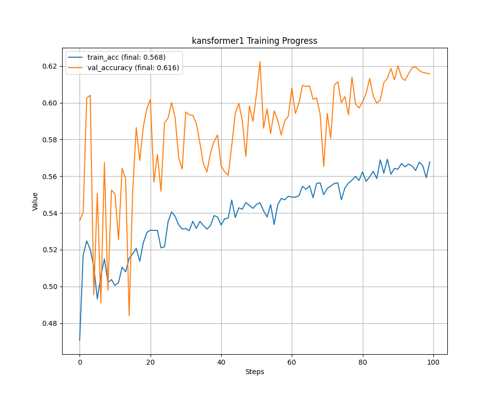
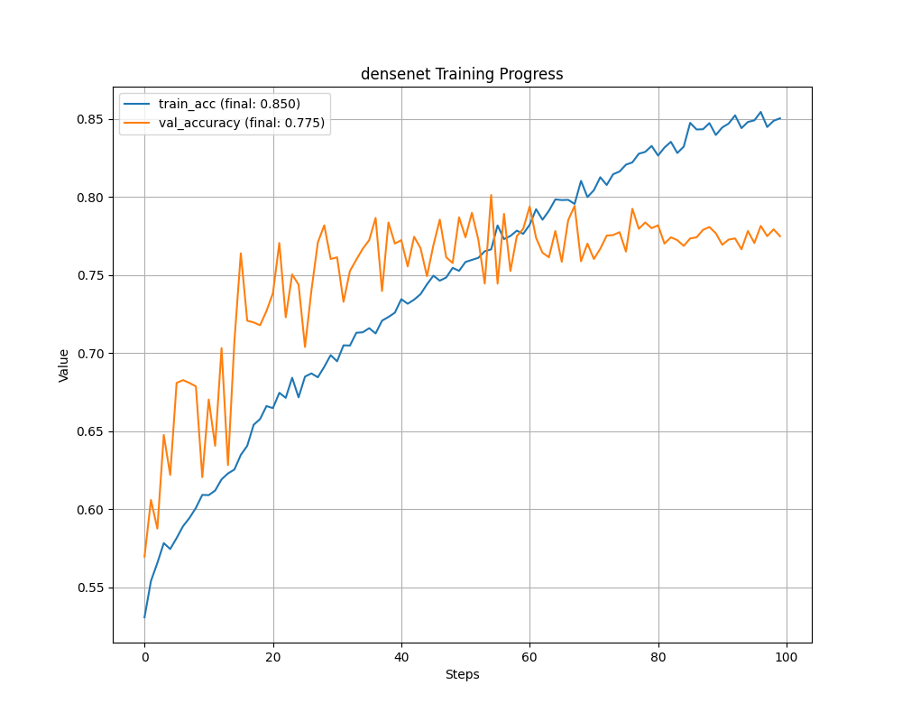
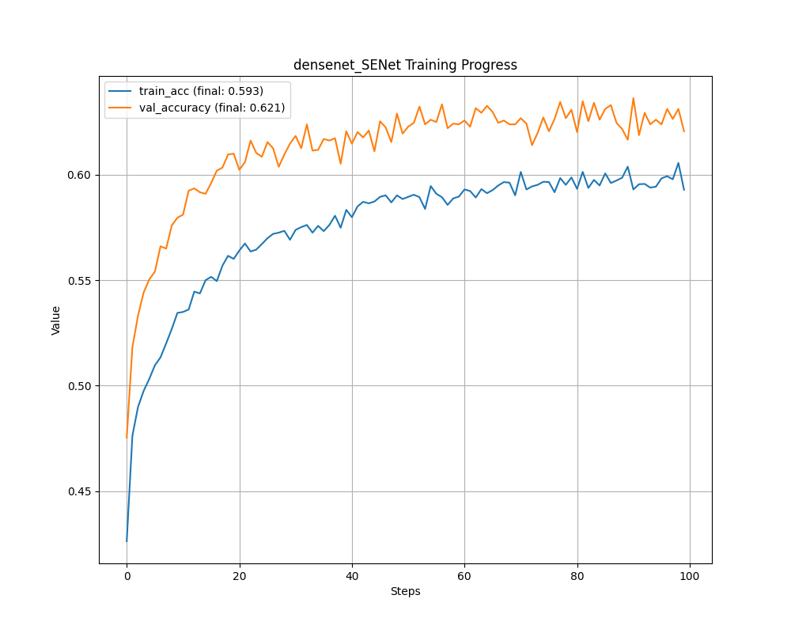

## resnet50 
### resnet50 85.4%

```bash
python -m tensorboard.main --logdir=/work/home/aojiang/06项目复现/08Kansformer/code/DRresults/DR_grading/tensorboard/resnet/
```


#### 下图使用的数据集是`DR_grading_new`
实例55：
[epoch 100] train_loss: 0.100  train_acc: 0.964  val_accuracy: 0.854


### resnet50 SGD
> 使用不同的学习率调整器
#### train_resnet_DDR_SGD_CosineAnnealingLR
实例51

[epoch 100] train_loss: 0.186  train_acc: 0.935  val_accuracy: 0.829

```bash
python -m tensorboard.main --logdir=/work/home/aojiang/06项目复现/08Kansformer/code/DRresults/DR_grading/SGD_CosineAnnealingLR/tensorboard/resnet/
```

#### train_resnet_DDR_SGD_lambdaLR
实例50
[epoch 100] train_loss: 0.230  train_acc: 0.915  val_accuracy: 0.834
```bash
python -m tensorboard.main --logdir=/work/home/aojiang/06项目复现/08Kansformer/code/DRresults/DR_grading/SGD_lambdaLR/tensorboard/resnet/
```
#### train_resnet_DDR_SGDyh:渐进式的学习率调整策略
实例49

> 结合了两种主要的学习率调整技术：预热和余弦退火

```bash
python -m tensorboard.main --logdir=/work/home/aojiang/06项目复现/08Kansformer/code/DRresults/DR_grading/SGByh/tensorboard/resnet/
```

### SENet_01_train_resnet_DDR：SENet  74,1
实例52
[epoch 100] train_loss: 0.838  train_acc: 0.730  val_accuracy: 0.751

下图使用的数据集是`DR_grading_new`
#### SENet_01_train_resnet_DDR:一般的SGB
实例52：优化器SGB，学习策略LambdaLR
[epoch 100] train_loss: 0.838  train_acc: 0.730  val_accuracy: 0.751
### PPA01 80.5

实例56：Adam 优化器，模型未运行

```bash

```

### WFEC
实例50


### HWA
实例51，无法运行


## kansformer1

```bash
python -m tensorboard.main --logdir=/work/home/aojiang/06项目复现/08Kansformer/code/DRresults/DR_grading/tensorboard/kansformer1
```


绘图:
```python
path_to_events_file = '/work/home/aojiang/06项目复现/08Kansformer/code/DRresults/DR_grading/tensorboard/kansformer1'
output_folder = '/work/home/aojiang/06项目复现/08Kansformer/code/DRresults/plots/kansformer1'  # 指定输出文件夹
```


### 下图使用的数据集是`DR_grading`




### 下图使用的数据集是`DR_grading_new`

实例53


## densent   77.5%


```bash
python -m tensorboard.main --logdir=/work/home/aojiang/06项目复现/08Kansformer/code/DRresults/DR_grading/tensorboard/densenet/
```


绘图：
```python
path_to_events_file = '/work/home/aojiang/06项目复现/08Kansformer/code/DRresults/DR_grading/tensorboard/densenet/'
output_folder = '/work/home/aojiang/06项目复现/08Kansformer/code/DRresults/plots/densenet'  # 指定输出文件夹
```


### 下图使用的数据集是`DR_grading`




### 下图使用的数据集是`DR_grading_new`

未运行

### SENet_01_train_densenet_DDR     62.1%


```bash
python -m tensorboard.main --logdir=/work/home/aojiang/06项目复现/08Kansformer/code/DRresults/DR_grading/SENet/tensorboard/densenet/
```


绘图：
```python
path_to_events_file = '/work/home/aojiang/06项目复现/08Kansformer/code/DRresults/DR_grading/SENet/tensorboard/densenet/'
output_folder = '/work/home/aojiang/06项目复现/08Kansformer/code/DRresults/plots/densenet_SENet'  # 指定输出文件夹
```


### 下图使用的数据集是`DR_grading`




### 下图使用的数据集是`DR_grading_new`

实例54：
[epoch 100] train_loss: 1.363  train_acc: 0.568  val_accuracy: 0.583


## 总结：
1. 所有模型中只有ResNet模型最好
2. 在ResNet模型的基础上进行改进
3. 目前的工作是筛选合适的优化器
4. 
