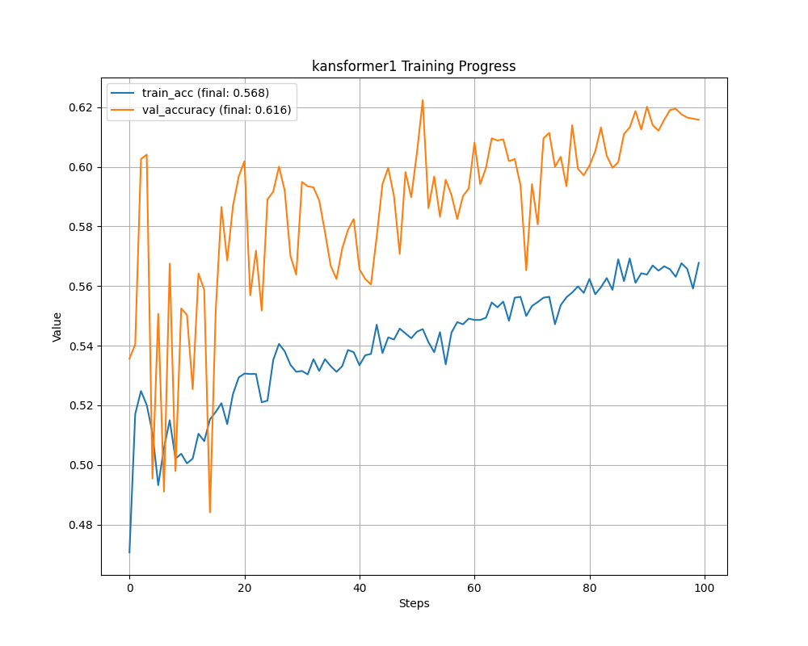
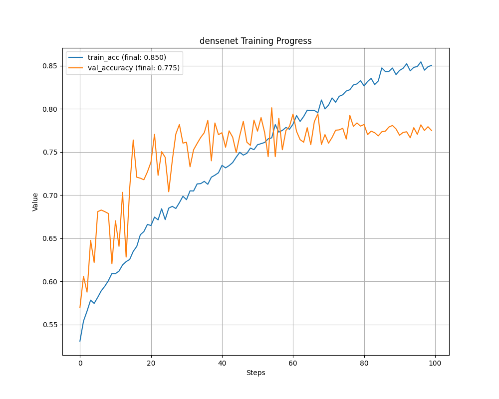
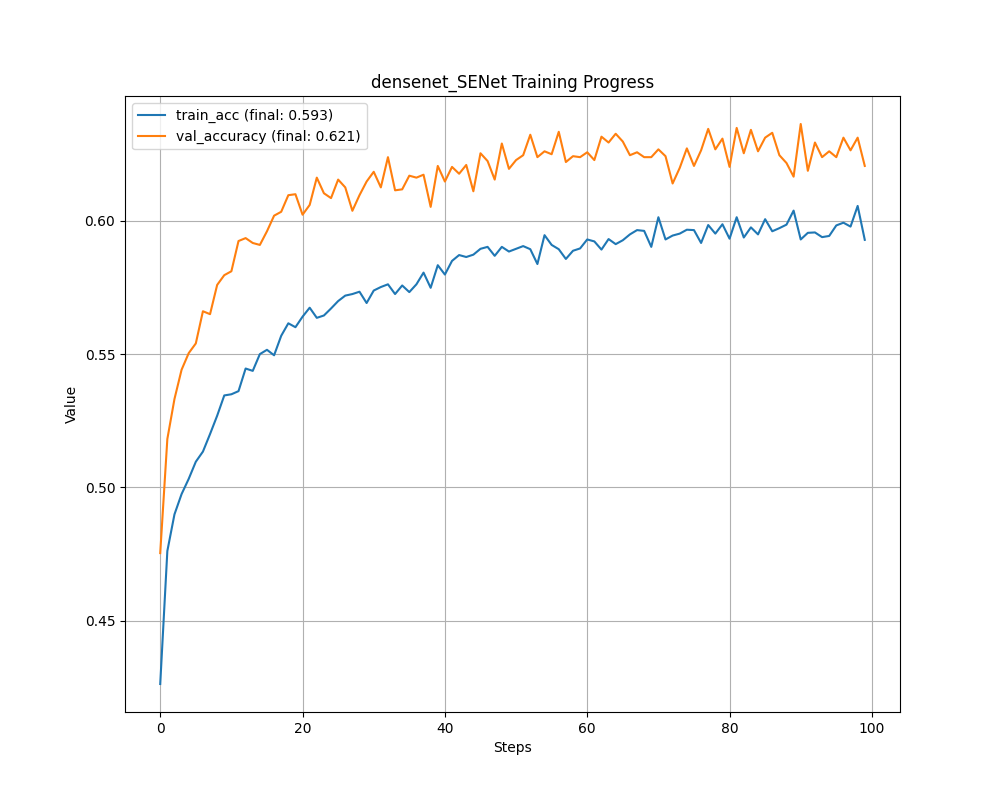

## resnet50 
### resnet50 84.2%

```bash
python -m tensorboard.main --logdir=/work/home/aojiang/06项目复现/08Kansformer/code/DRresults/DR_grading/tensorboard/resnet/
```
超参数设置如下所示：
上述代码的超参数和重要选项总结如下：

1. **--num_classes**:
   - 类型：整数
   - 默认值：6
   - 描述：数据集中类别的数量。

2. **--epochs**:
   - 类型：整数
   - 默认值：100
   - 描述：训练的总轮数。

3. **--batch_size**:
   - 类型：整数
   - 默认值：32
   - 描述：每个训练批次包含的样本数。

4. **--lr**:
   - 类型：浮点数
   - 默认值：0.0002
   - 描述：训练开始时的学习率。

5. **--lrf**:
   - 类型：浮点数
   - 默认值：0.0001
   - 描述：训练结束时的学习率。

6. **--seed**:
   - 类型：布尔
   - 默认行为：如果指定，则固定网络的初始化方式，使结果可复现。

7. **--tensorboard**:
   - 类型：布尔
   - 默认值：True
   - 描述：是否使用TensorBoard进行训练可视化。

8. **--use_amp**:
   - 类型：布尔
   - 默认值：False
   - 描述：是否使用自动混合精度进行训练，以减少训练成本。

9. **--data_path**:
   - 类型：字符串
   - 默认值：`"data/DDR_dataset/DDR-dataset/DR_grading"`
   - 描述：训练数据所在的路径。

10. **--model**:
   - 类型：字符串
   - 默认值：`"resnet"`
   - 描述：选择用于训练的模型。

11. **--device**:
   - 类型：字符串
   - 默认值："0"
   - 描述：指定使用的设备ID，例如 "0" 或 "0,1"。

12. **--weights**:
   - 类型：字符串
   - 默认值：`'model_pth/resnet50-19c8e357.pth'`
   - 描述：模型训练的初始权重路径。

这些参数可以通过命令行动态指定，使得训练过程更加灵活和可配置。使用argparse库可以很容易地从命令行读取这些参数，这在实验中特别有用，因为它允许研究人员快速测试不同的配置。


绘图
```bash
path_to_events_file = '/work/home/aojiang/06项目复现/08Kansformer/code/DRresults/DR_grading/tensorboard/resnet'

output_folder = '/work/home/aojiang/06项目复现/08Kansformer/code/DRresults/plots/resnet'  # 指定输出文件夹

```

#### 下图使用的数据集是`DR_grading`


由上图可知，resnet50在DR数据集上表现良好，在DR数据集上达到84.49%的准确率。

但是，上图有一个异常的地方：训练集的准确性很高，而验证集的准确性却表现一般，未能达到90%，仅有84%。


猜测其原因是，使用了Adma优化器，虽达到较快速的收敛效果，但是其泛化能力一般。因此，接下来使用SGD优化器，尝试提高泛化能力。
#### 下图使用的数据集是`DR_grading_new`
实例55：模型迭代中


### resnet50 SGD
> 使用不同的学习率调整器
#### train_resnet_DDR_SGD_CosineAnnealingLR
实例51

```bash
python -m tensorboard.main --logdir=/work/home/aojiang/06项目复现/08Kansformer/code/DRresults/DR_grading/SGD_CosineAnnealingLR/tensorboard/resnet/
```

#### train_resnet_DDR_SGD_lambdaLR
实例50

```bash
python -m tensorboard.main --logdir=/work/home/aojiang/06项目复现/08Kansformer/code/DRresults/DR_grading/SGD_lambdaLR/tensorboard/resnet/
```

#### train_resnet_DDR_SGDyh:渐进式的学习率调整策略
实例49

> 结合了两种主要的学习率调整技术：预热和余弦退火

```bash
python -m tensorboard.main --logdir=/work/home/aojiang/06项目复现/08Kansformer/code/DRresults/DR_grading/SGByh/tensorboard/resnet/
```

### SENet_01_train_resnet_DDR：SENet  74,1
实例52

```python
    optimizer = optim.SGD(pg, lr=args.lr)# 在resnet前添加SENet,需要使用SGB优化器，不能使用Adam优化器，否则会报错
    scheduler = lr_scheduler.LambdaLR(optimizer, lr_lambda=lf)
```
只使用一般的SGD优化器，不进行预热和余弦退火

```bash
python -m tensorboard.main --logdir=/work/home/aojiang/06项目复现/08Kansformer/code/DRresults/DR_grading/SENet/tensorboard/resnet_DR_grading
```

在进入ResNet50之前，先尝试SENet，发现效果比ResNet差很多，达到74.1%的准确率。与resnet50 84.2%相比，下降了近10%的准确率。


下图使用的数据集是`DR_grading`


下图使用的数据集是`DR_grading_new`

实例52模型迭代中。。。

#### SENet_01_train_resnet_DDR_SGDyh:渐进式的学习率调整策略

未跑

### PPA01 80.5


```bash

```


## kansformer1

```bash
python -m tensorboard.main --logdir=/work/home/aojiang/06项目复现/08Kansformer/code/DRresults/DR_grading/tensorboard/kansformer1
```


绘图:
```python
path_to_events_file = '/work/home/aojiang/06项目复现/08Kansformer/code/DRresults/DR_grading/tensorboard/kansformer1'
output_folder = '/work/home/aojiang/06项目复现/08Kansformer/code/DRresults/plots/kansformer1'  # 指定输出文件夹
```


### 下图使用的数据集是`DR_grading`




### 下图使用的数据集是`DR_grading_new`

实例53


## densent   77.5%


```bash
python -m tensorboard.main --logdir=/work/home/aojiang/06项目复现/08Kansformer/code/DRresults/DR_grading/tensorboard/densenet/
```


绘图：
```python
path_to_events_file = '/work/home/aojiang/06项目复现/08Kansformer/code/DRresults/DR_grading/tensorboard/densenet/'
output_folder = '/work/home/aojiang/06项目复现/08Kansformer/code/DRresults/plots/densenet'  # 指定输出文件夹
```


### 下图使用的数据集是`DR_grading`




### 下图使用的数据集是`DR_grading_new`

未运行

### SENet_01_train_densenet_DDR     62.1%


```bash
python -m tensorboard.main --logdir=/work/home/aojiang/06项目复现/08Kansformer/code/DRresults/DR_grading/SENet/tensorboard/densenet/
```


绘图：
```python
path_to_events_file = '/work/home/aojiang/06项目复现/08Kansformer/code/DRresults/DR_grading/SENet/tensorboard/densenet/'
output_folder = '/work/home/aojiang/06项目复现/08Kansformer/code/DRresults/plots/densenet_SENet'  # 指定输出文件夹
```


### 下图使用的数据集是`DR_grading`




### 下图使用的数据集是`DR_grading_new`

实例54：正在运行


## 总结：
1. 所有模型中只有ResNet模型最好
2. 在ResNet模型的基础上进行改进
3. 目前的工作是筛选合适的优化器
4. 
