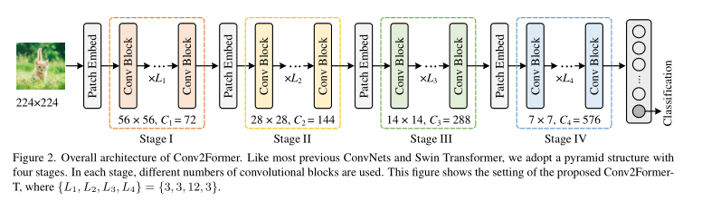
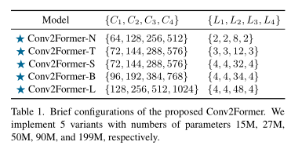

# Conv2Former：一个简单的视觉识别Transformer风格卷积网络

## 摘要

本文不试图设计一种最先进的视觉识别方法，而是探讨了一种更有效利用卷积编码空间特征的方法。通过比较最近的卷积神经网络（ConvNets）和视觉变换器（Vision Transformers）的设计原则，我们提出通过利用卷积调制操作来简化自我注意力。我们展示了这样一种简单方法可以更好地利用嵌套在卷积层中的大核（≥7×7）。我们构建了一个使用所提出的卷积调制的层次化ConvNets家族，称为Conv2Former。我们的网络简单易懂。实验表明，我们的Conv2Former在所有ImageNet分类、COCO对象检测和ADE20k语义分割任务中均优于现有流行的ConvNets和视觉变换器，如Swin Transformer和ConvNeXt。

## 1. 引言

在2010年代，视觉识别的显著进展主要归功于卷积神经网络（ConvNets），典型的例子包括VGGNet、Inception系列和ResNet系列等。这些识别模型主要通过堆叠多个构建块和采用金字塔网络架构来聚集具有大感受野的响应，但忽视了显式建模全局上下文信息的重要性。SENet系列突破了CNN的传统设计，并将基于注意力的机制引入CNN，以捕捉长期依赖关系，取得了惊人的性能。

## 2. 相关工作

从ConvNets到流行的视觉变换器，架构一直在不断更新。

### 2.1. 卷积神经网络

早期视觉识别模型的成功主要归功于ConvNets的发展，典型的例子包括AlexNet、VGGNet和GoogLeNet。这些模型大多包含不超过20层的卷积，后来，ResNets的出现通过引入快捷连接，使训练非常深的模型成为可能。Inceptions和ResNeXt进一步丰富了ConvNets的设计原则，并提出使用具有多个并行路径的专用过滤器卷积的构建块。而不是调整网络架构，SENet及其后续工作旨在通过轻量级注意力模块改进ConvNets，这些模块可以显式地模拟通道之间的相互依赖性。EfficientNets和MobileNetV3利用神经架构搜索来搜索高效的网络架构。RegNet提出了一种新的网络设计范例，通过探索网络设计空间来设计ConvNets。

### 2.2. 视觉变换器

变换器最初设计用于自然语言处理任务，已被广泛用于视觉识别。最典型的工作是Vision Transformer（ViT），它展示了变换器在处理大规模数据的图像分类中的巨大潜力。DeiT通过使用强大的数据增强方法和知识蒸馏改进了原始的ViT，并摆脱了ViTs对大规模数据的依赖。受到ConvNets中金字塔架构成功的启发，一些工作设计了使用变换器的金字塔结构，以利用多尺度特征。还有一些工作提出将局部依赖关系引入ViTs，显示出在视觉识别中的出色性能。

## 3. 模型设计

在本节中，我们描述了我们提出的Conv2Former的架构，并提供了一些有用的模型设计和层调整建议。

### 3.1. 架构

整体架构如图2所示。与ConvNeXt和Swin Transformer网络类似，我们的Conv2Former也采用了金字塔架构。总共有四个阶段，每个阶段都有不同的特征图分辨率。在连续的两个阶段之间，使用一个补丁嵌入块来降低分辨率，通常是2×2的卷积，步长为2。不同的阶段有不同数量的卷积块。我们构建了五个Conv2Former变体，即Conv2Former-N、Conv2Former-T、Conv2Former-S、Conv2Former-B和Conv2Former-L。细节在表1中总结。

### 3.2. 卷积调制块

我们在每个阶段使用的卷积块具有与变换器类似的结构，主要包含一个用于空间编码的自注意力层和一个用于通道混合的FFN。不同的是，我们用一个简单的卷积调制层替换了自注意力层。

### 3.3. 微观设计

大于7×7的核心。如何利用空间卷积对ConvNet设计至关重要。自从VGGNet和ResNets以来，3×3卷积已成为构建ConvNets的标准选择。后来，深度可分离卷积的出现改变了这种情况。ConvNeXt表明，将ConvNets的核心大小从3增加到7可以提高分类性能。然而，进一步增加核心大小几乎没有带来性能提升，而只增加了计算负担，而没有重新参数化。

## 4. 实验

### 4.1. 实验设置

数据集。我们评估了所提出的Conv2Former在广泛使用的ImageNet-1k数据集上的分类性能，该数据集包含约1.2M的训练图像和1,000个不同的类别。我们在总共50k图像的验证集上报告结果。像其他一些流行模型一样，我们还测试了所提出的Conv2Former使用大规模ImageNet-22k数据集的缩放能力。

### 4.2. 与其他方法的比较

我们将我们的Conv2Former与一些流行的网络架构进行了比较，包括Swin Transformer、ConvNeXt、NFNet、DeiT、RegNet、FocalNet、EfficientNets、CoAtNet、RepLKNet和MOAT。注意，其中一些是CNN和变换器的混合模型。

## 5. 结论和讨论

本文提出了Conv2Former，一种新的用于视觉识别的卷积网络架构。我们的Conv2Former的核心是卷积调制操作，该操作通过使用卷积和哈达马积简化了自注意力机制。我们展示了我们的卷积调制操作是一种更有效利用大核心卷积的方法。我们在ImageNet分类、对象检测和语义分割中的实验也显示了我们提出的Conv2Former比以前的基于CNN的模型和大多数基于变换器的模型表现得更好。

以下是对你提供的文献的总结，按照你要求的格式以 Markdown 语言编写：

---

# 该篇文章的笔记

## 1. 该篇文章的研究目的

### 简介与研究目的
本文主要探讨了一种更有效利用卷积编码空间特征的方法，旨在通过结合卷积神经网络（ConvNets）和视觉变换器（Vision Transformers）的设计原则，提出一种简化自我注意力的方法，从而提高视觉识别的效率和准确性。

## 2. 该篇文章的研究方法

### 研究方法
文章提出了一种名为Conv2Former的新网络架构，该架构使用卷积调制操作简化自注意力机制，并结合了分阶段的网络深度以及分组卷积技术，以实现对空间特征的有效编码。

## 3. 该篇文章的研究内容

### 主要研究内容
- **架构设计**：提出了一个分阶段的金字塔网络结构，通过不同阶段处理不同分辨率的特征图。
- **卷积调制块**：介绍了替换自注意力层的卷积调制层的设计和功能。
- **微观设计**：探讨了大于7×7核心的卷积如何用于改进网络性能。
- **实验评估**：在ImageNet分类、COCO对象检测和ADE20k语义分割等任务上验证了模型的性能。

## 4. 该篇文章的最大创新点

### 创新点
文章的最大创新在于提出了卷积调制操作，这一操作简化了视觉变换器中的自注意力机制，并通过结合大核心卷积和分组卷积的方式，有效地利用了空间信息，从而在保持计算效率的同时提升了模型的性能。

## 5. 该篇文章给我们的启发

### 启发与展望
该研究提供了一种新的视角，即结合传统的卷积神经网络和新兴的变换器技术，以处理视觉识别任务中的空间复杂性问题。它启发我们在设计深度学习模型时，可以更灵活地考虑不同类型的网络架构和操作的结合，从而更好地适应各种复杂的数据和任务需求。

---

# 图表信息

**Figure 2: Conv2Former的整体架构**
- Conv2Former采用了类似于大多数之前的卷积神经网络（ConvNets）和Swin Transformer的金字塔结构，包含四个阶段。在每个阶段中，使用了不同数量的卷积块。图中展示的是Conv2Former-T的设置，其中{L1, L2, L3, L4}分别为{3, 3, 12, 3}。

**Table 1: Conv2Former的简要配置**
- 此表列出了所提出的Conv2Former的五种变体，参数数量分别为15M、27M、50M、90M和199M。
  - Conv2Former-N {64, 128, 256, 512} {2, 2, 8, 2}
  - Conv2Former-T {72, 144, 288, 576} {3, 3, 12, 3}
  - Conv2Former-S {72, 144, 288, 576} {4, 4, 32, 4}
  - Conv2Former-B {96, 192, 384, 768} {4, 4, 34, 4}
  - Conv2Former-L {128, 256, 512, 1024} {4, 4, 48, 4}

**Table 7: Isotropic Conv2Former、ConvNeXt和ViT的比较**
- 此表比较了我们的同构Conv2Former、ConvNeXt和ViT。'3 Convs'表示我们在网络开头使用了三层卷积作为patch嵌入，如文献[14,43,99]中所述。对于小型和基本型号，Conv2Former在参数和计算量相当的情况下表现更好。

**Table 8: COCO [48]物体检测和实例分割结果**
- 使用Mask R-CNN [29]和Cascade Mask R-CNN [6]，在ImageNet-1k数据集上进行预训练的模型的结果。
  - Conv2Former-T在物体检测中的性能相比SwinT-T和ConvNeXt-T提升了约2%。在实例分割中，性能提升也超过了1%。使用Cascade Mask R-CNN框架时，性能提升更加显著。
  
**Table 9: 在ADE20k上的比较**
- 使用UperNet作为解码器。在所有模型规模下，Conv2Former均取得了最佳结果。
  - 在小型、中型和基础模型中，Conv2Former相比ConvNeXt在miou上分别提高了1.3%、1.1%。

**Table 10: ImageNet-1k/22k的随机深度率**
- 展示了不同模型变体在ImageNet-1k/22k上的（预）训练随机深度率。

**Table 11: ImageNet-1k上的预训练和微调随机深度率**
- 不同模型分辨率的预训练和微调随机深度率。

**Table 12: COCO上的微调随机深度率**
- 不同模型在COCO上的微调随机深度率。

   
