# 第一步：创建容器实例

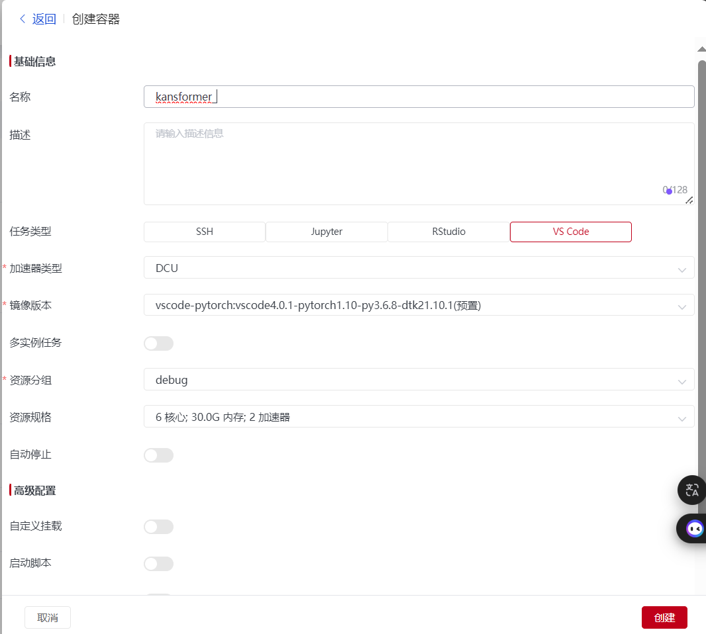

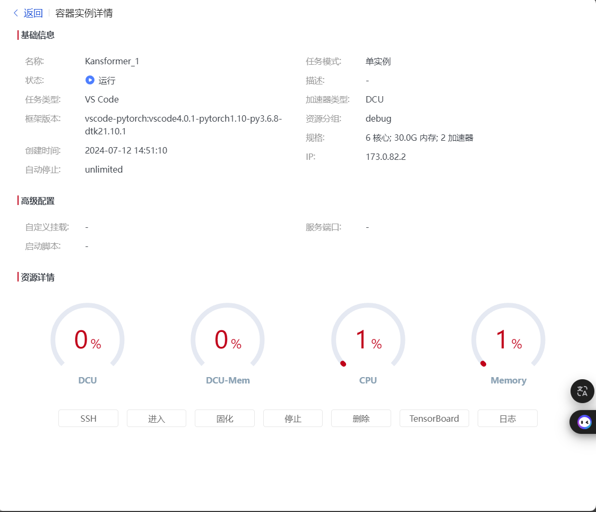

# 第二步：运行代码

## 报错：PyTorch 库没有被安装

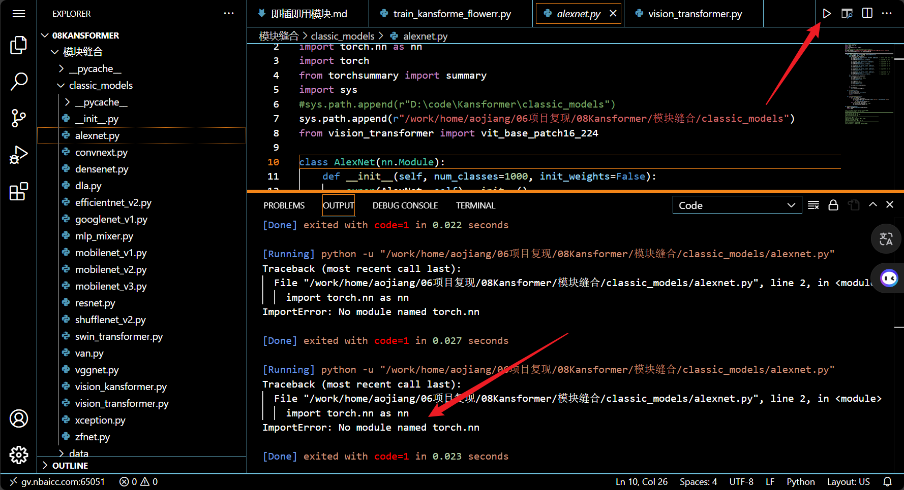

### 解决方法：在终端中运行`pip3 install torch torchvision`命令

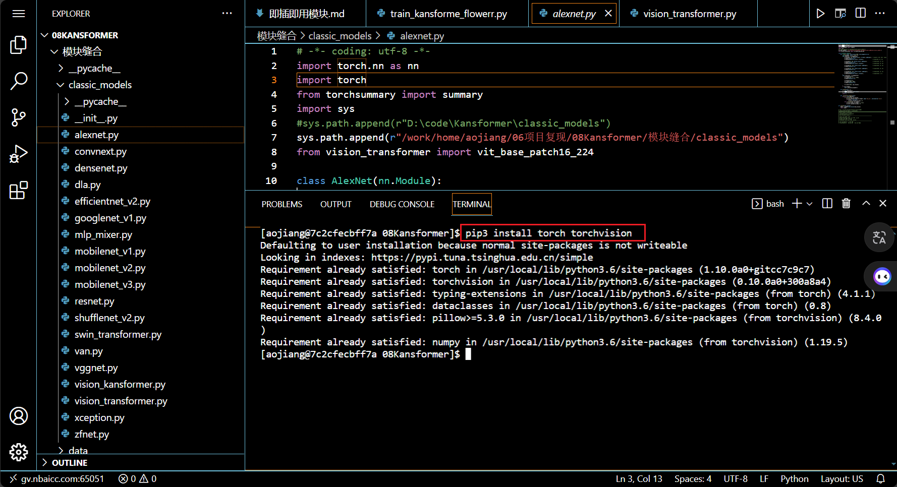

上述输出结果显示，torch 和 torchvision 已经被安装。

## 再次运行代码依然是相同的报错

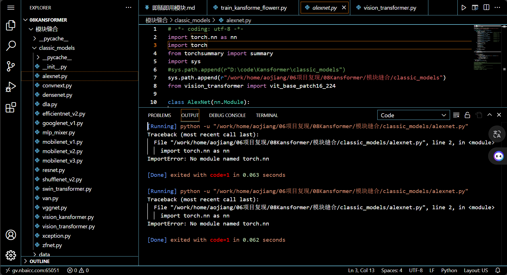

由于直接运行代码报错，所以接下来我选择在终端中运行代码

# 第二步：在终端中运行代码(使用python3,而不是使用python2)

我注意到，安装了两个版本的python,这里选择使用python3。如果选择python2，则会报错，因为python2不支持pytorch。

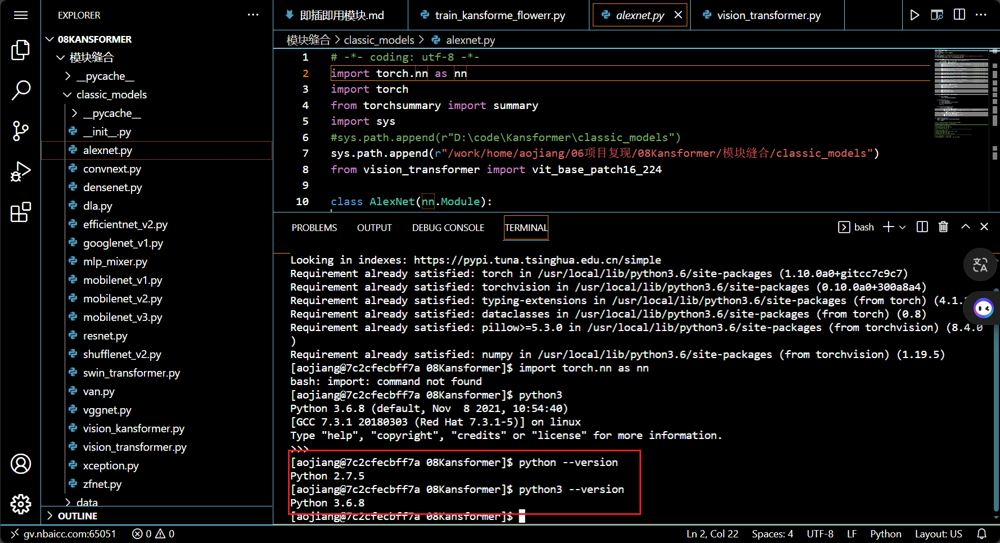

成功导入包

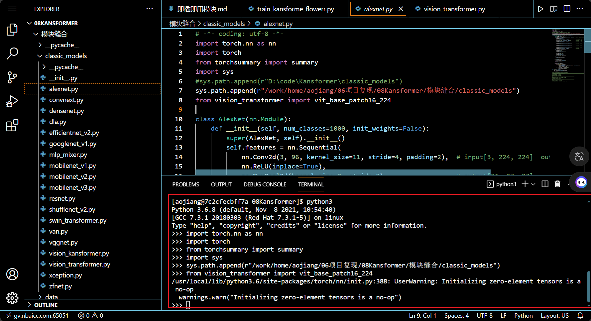

# 第三步：在终端中运行代码

我把代码一行一行地粘贴在终端中运行，未出现报错情况。

# 疑问：为什么在终端中运行代码不会报错，而在Vscode中直接运行代码会报错(报错如下图所示)？

猜测：可能是因为在Vscode未指定使用 Python 3 作为默认解释器

# 接着尝试在Vscode中指定使用 Python 3 作为默认解释器

## 以下是在我的本地电脑上的Vscode中指定使用 Python 3 作为默认解释器的方法

- 第一步：在 VSCode 中，使用快捷键 Ctrl+Shift+P 打开命令面板
- 第二步：在命令面板中输入或选择 "Python: Select Interpreter" 命令。

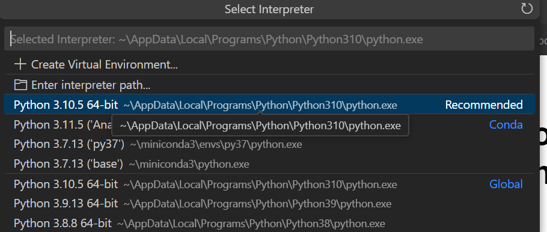

## 疑问：请问在超算中心的平台中，如何在Vscode中指定使用 Python 3 作为默认解释器？

- 第一步：在 VSCode 中，使用快捷键 Ctrl+Shift+P 打开命令面板

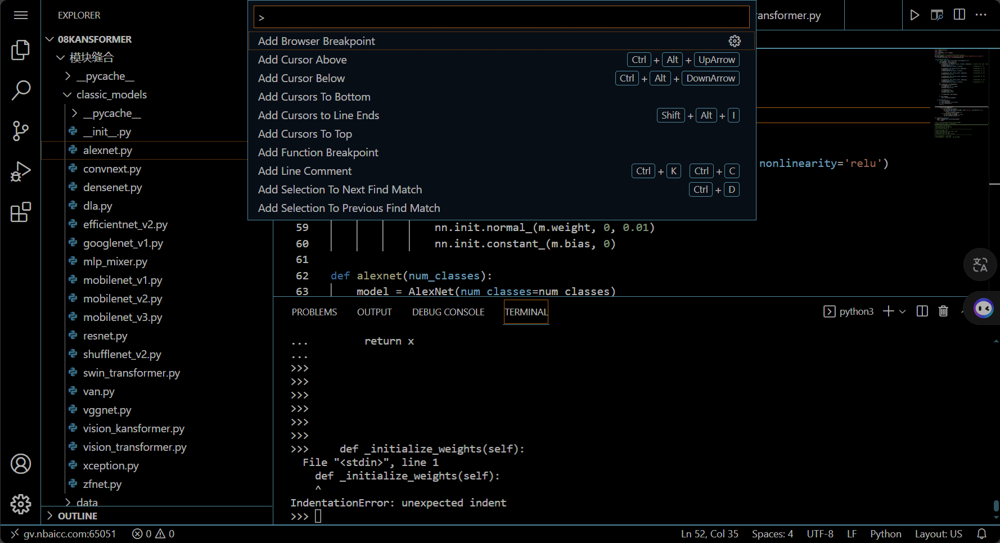

- 第二步：在命令面板中输入或选择 "Python: Select Interpreter" 命令。

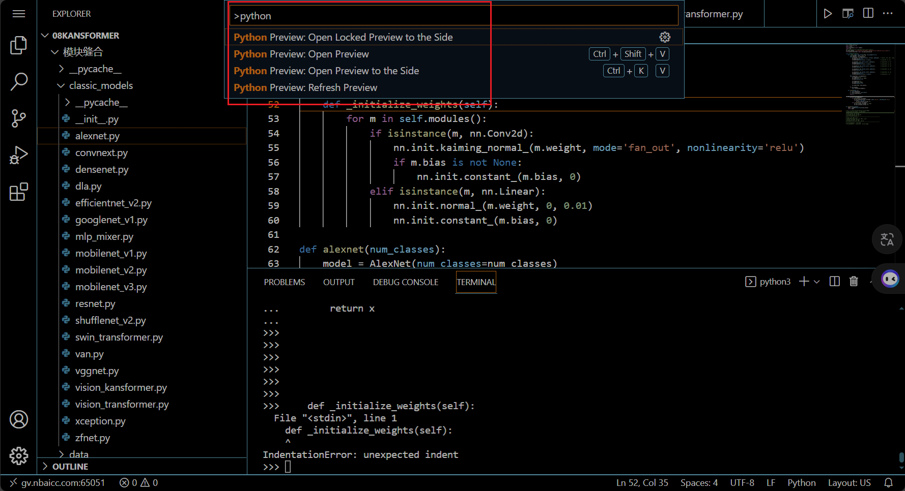

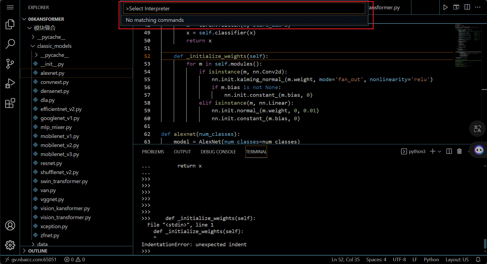

**但是未找到可以指定的python解释器**

## GPU不兼容问题

当我使用CPU运行代码时，可以成功运行。

