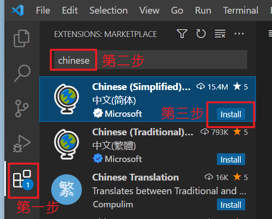

- VScode中配置Python环境

- 1. 下载VScode
- 2. 下载Python解释器
- 3. 安装Python解释器
- 4. 在VScode中安装插件
- 5. 运行和优化
- 6. 例行格式条款

## VScode中配置Python环境

| Tip：请在电脑端查看 |
| :---: |
| **@零流@火星动力猿    2022.4** |

#### 1. 下载VScode

- 官网：https://code.visualstudio.com/（点链接时按下Ctrl，不会覆盖当前页面哦^-^）


- 安装VScode（建议附加任务全部勾选）


#### 2. 下载Python解释器

- 官网：https://www.python.org/
- 下载页面：https://www.python.org/downloads/windows/
- 本次以`Python 3.9.12-Windows-installer(64-bit)`为例子


> 
> 如你因网络环境无法顺利下载，这里提供了我所下载的解释器
> 
> 蓝奏云：https://wwn.lanzouh.com/ioMiM03d088d	密码:1234

#### 3. 安装Python解释器

- 打开安装包，务必勾选 `Add Python 3.9 to PATH`，点击`Install Now`，安装完毕后点击`close`退出

    

#### 4. 在VScode中安装插件

- 打开VScode分别安装两个插件 `Chinese` 和 `Python` 等待安装完毕后重启VScode




#### 5. 运行和优化

- 用VScode打开一个文件夹，新建文件`Demo1.py`，书写代码并运行，结果会在终端显示

```
print('点赞不要钱，投币您看着来')
```


- 【可选操作】如您屏幕较小，可以在外部控制台中展现运行结果

    - 将侧边菜单栏，切换至`运行和调试`点击`创建launch.json文件`点击`Python文件 调试打开.....`选项
    - 自动跳转至的文件中，将值`integratedTerminal`改为`externalTerminal`，并保存

    

#### 6. 例行格式条款

- 本文以自身分享为主，文中的提到的包括但不限于电脑操作、软件安装、点击链接，作者不保证有效性和可能发生的不利后果。
- 如需转载请在开头注明作者和出处