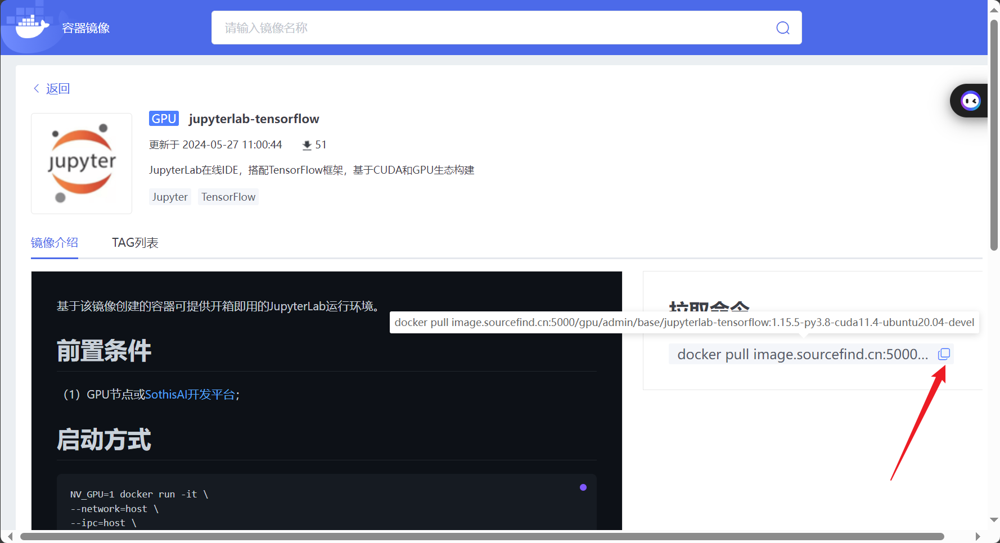
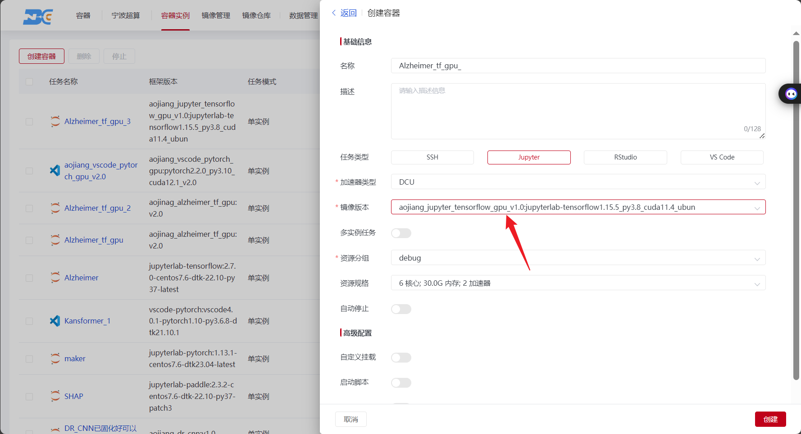
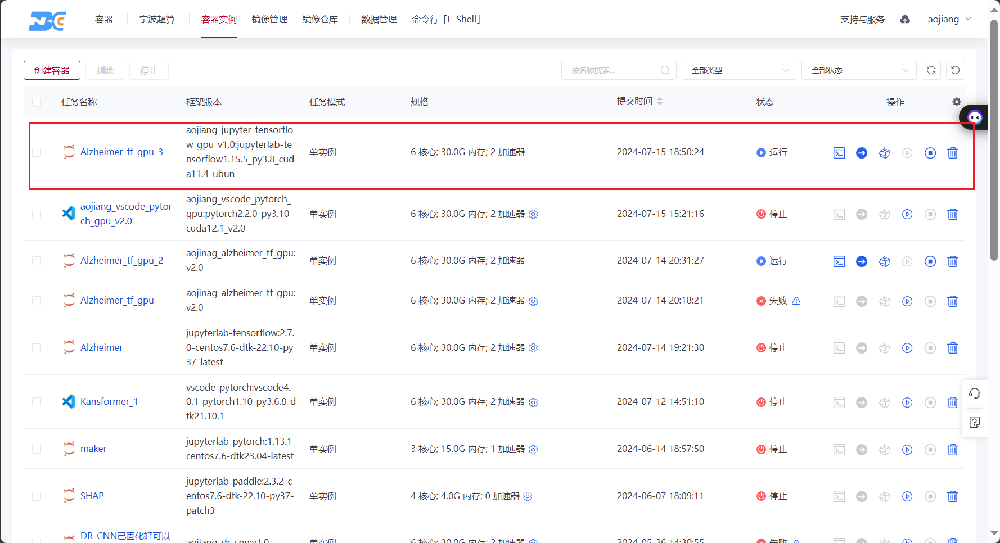
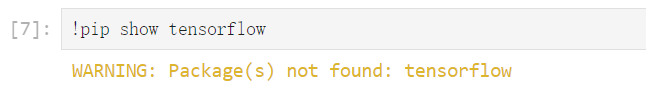
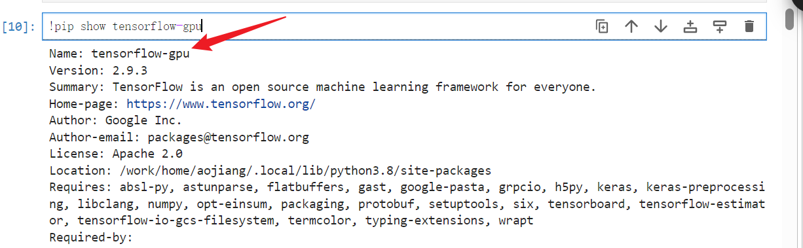
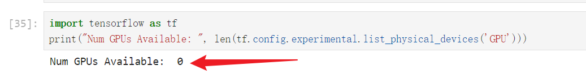
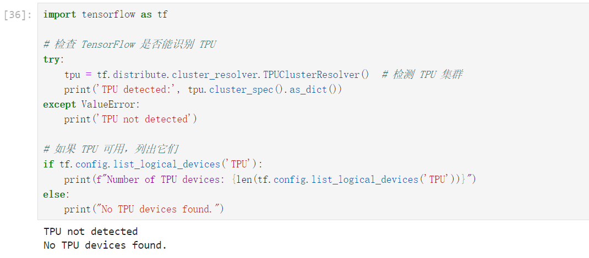
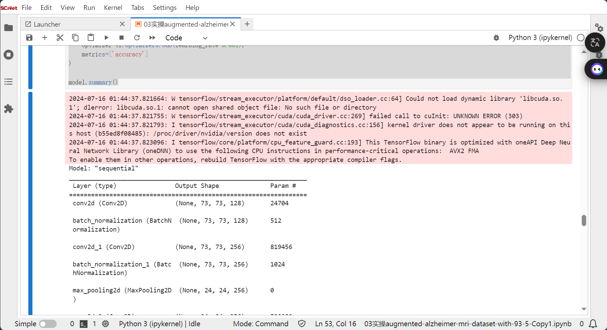
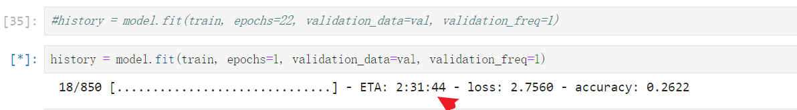

# 一、拉取镜像
使用`docker pull image.sourcefind.cn:5000/gpu/admin/base/jupyterlab-tensorflow:1.15.5-py3.8-cuda11.4-ubuntu20.04-devel`拉取镜像

这里选择的是GPU版本的tensorflow，为的是希望模型训练时可以在GPU上运行，而不是在CPU上运行。



# 二、推送


# 三、创建容器实例

## 3.1 选择推送的镜像，创建容器实例。


## 3.2 运行容器，进入容器。


# 三、运行代码

## 4.1 查看CPU版本的tensorflow是否存在



上述运行结果显示不存在，这是正常的，因为在拉取镜像时，选择的时GPU版本的tensorflow

## 4.2 查看GPU版本的tensorflow是否存在

使用代码查看GPU版本的tensorflow是否存在

```python
!pip show tensorflow-gpu
```





上述运行结果显示GPU版本的tensorflow存在，版本为2.9.3，这是正常的，因为在拉取镜像时，选择的时GPU版本的tensorflow


## 4.3 查看当前可用的GPU的数量

使用代码查看当前可用的GPU的数量

```python
import tensorflow as tf
print("Num GPUs Available: ", len(tf.config.experimental.list_physical_devices('GPU')))
```




上述运行结果显示，可用的GPU数量为零。

**这是不正常的。**

## 4.4 查看当前可用的TPU的数量


使用代码查看当前可用的TPU的数量

```python
import tensorflow as tf

# 检查 TensorFlow 是否能识别 TPU
try:
    tpu = tf.distribute.cluster_resolver.TPUClusterResolver()  # 检测 TPU 集群
    print('TPU detected:', tpu.cluster_spec().as_dict())
except ValueError:
    print('TPU not detected')

# 如果 TPU 可用，列出它们
if tf.config.list_logical_devices('TPU'):
    print(f"Number of TPU devices: {len(tf.config.list_logical_devices('TPU'))}")
else:
    print("No TPU devices found.")
```




上述运行结果显示，TensorFlow 未能识别 TPU，可用的TPU数量为零。

**这是不正常的。**


## 4.5 构建模型

下面是构建模型的代码

```python
# 导入 TensorFlow 库，并使用别名 tf。TensorFlow 是一个开源的机器学习框架，广泛用于深度学习模型的训练和部署。
import tensorflow as tf

# 从 TensorFlow 的 keras 模块中导入 layers 和 models。这些模块包含构建神经网络所需的层和模型结构。
from tensorflow.keras import layers, models

model = keras.models.Sequential([
    keras.layers.Conv2D(filters=128, kernel_size=(8, 8), strides=(3, 3), activation='relu', input_shape=(224, 224, 3)),
    keras.layers.BatchNormalization(),
    
    keras.layers.Conv2D(filters=256, kernel_size=(5, 5), strides=(1, 1), activation='relu', padding="same"),
    keras.layers.BatchNormalization(),
    keras.layers.MaxPool2D(pool_size=(3, 3)),
    
    keras.layers.Conv2D(filters=256, kernel_size=(3, 3), strides=(1, 1), activation='relu', padding="same"),
    keras.layers.BatchNormalization(),
    keras.layers.Conv2D(filters=256, kernel_size=(1, 1), strides=(1, 1), activation='relu', padding="same"),
    keras.layers.BatchNormalization(),
    keras.layers.Conv2D(filters=256, kernel_size=(1, 1), strides=(1, 1), activation='relu', padding="same"),
    keras.layers.BatchNormalization(),
    
    keras.layers.Conv2D(filters=512, kernel_size=(3, 3), activation='relu', padding="same"),
    keras.layers.BatchNormalization(),
    keras.layers.MaxPool2D(pool_size=(2, 2)),
    
    keras.layers.Conv2D(filters=512, kernel_size=(3, 3), activation='relu', padding="same"),
    keras.layers.BatchNormalization(),
    
    keras.layers.Conv2D(filters=512, kernel_size=(3, 3), activation='relu', padding="same"),
    keras.layers.BatchNormalization(),
    
    keras.layers.MaxPool2D(pool_size=(2, 2)),
    
    keras.layers.Conv2D(filters=512, kernel_size=(3, 3), activation='relu', padding="same"),
    keras.layers.BatchNormalization(),
    
    keras.layers.MaxPool2D(pool_size=(2, 2)),
    
    keras.layers.Flatten(),
    keras.layers.Dense(1024, activation='relu'),
    keras.layers.Dropout(0.5),
    keras.layers.Dense(1024, activation='relu'),
    keras.layers.Dropout(0.5),
    keras.layers.Dense(4, activation='softmax')
])

model.compile(
    loss='categorical_crossentropy',
    optimizer=tf.optimizers.SGD(learning_rate=0.001),
    metrics=['accuracy']
)

model.summary()
```

运行结果如下：



上述第一条信息提示：CUDA 库未找到：错误信息 Could not load dynamic library 'libcuda.so.1' 表示 TensorFlow 无法找到 CUDA 库。这通常是因为 CUDA 没有正确安装或者它的库文件没有被添加到 LD_LIBRARY_PATH 环境变量中。

上述第二条信息提示：NVIDIA 驱动问题：failed call to cuInit: UNKNOWN ERROR (303) 和 kernel driver does not appear to be running 表明 NVIDIA 驱动可能没有正确安装或者没有运行。

## 4.6 模型训练



上述信息显示，在6核心，30内存的条件下，迭代一轮需要两个半小时。
而原计划一共应该迭代22轮。

# 我的求助

请问如何才可以在GPU上或TPU上进行模型训练？换句话说，下述问题能否被解决？


