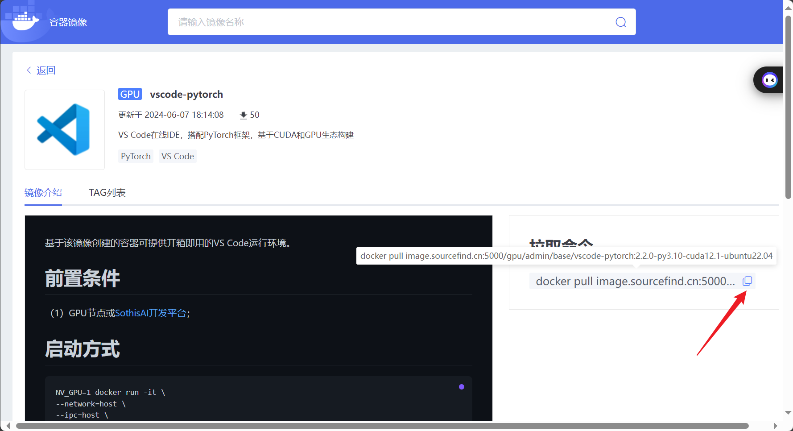
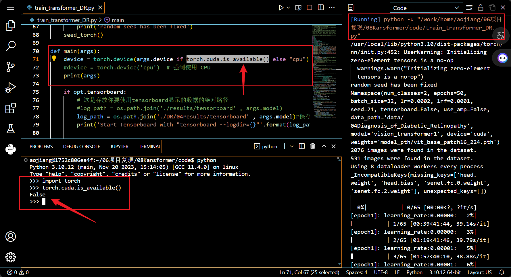

# 一、拉取镜像

使用`docker pull image.sourcefind.cn:5000/gpu/admin/base/vscode-pytorch:2.2.0-py3.10-cuda12.1-ubuntu22.04`拉取镜像




# 二、推送


# 三、创建容器实例

# 三、运行代码

运行代码，并在终端中运行下述命令

```python
python
>>> import torch
>>> torch.cuda.is_available()
```




终端信息显示，cuda不可用，因此，模型训练在CPU上进行。

# 四、我的求助

请问如何解决上述cuda不可用的问题。

