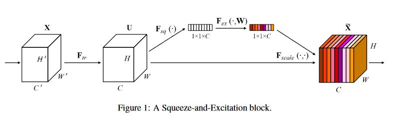

# 日志

## 索引

- [2024.04.27周六](#20240427周六)
- [2024.04.28周日](#20240428周日)
- [2024.04.29周一](#20240429周一)
- [2024.06.28周五](#20240628周五)
- [2024.06.29周六](#20240629周六)
- [2024.06.30周日](#20240630周日)
- [暑假2024.07.01周一--2024.08.31周六](#暑假索引)


## 2024.04.27周六


<details><summary>📘 详细描述(点击展开)</summary>
	


### 今日
#### 上午
由于昨晚熬夜，所以上午在寝室睡懒觉，十点测环境卫生的数据，期间吃了早饭和午饭
#### 下午
下午寝室睡觉，四点多起床，神清气爽。

起床后，寝室练肩，五点半甬江餐厅二楼吃晚饭。
#### 晚上
晚上王长来楼教室刷手机至八点，白白浪费一个半小时。

写职业卫生的三份作业和两份实验报告，还有一份实验报告没写。营养和环卫的实验报告也没写。

晚上九点去健身房练背。

明天补周四的课，上午三节流行病学，下午是营养实验课，晚上是只帅老师的环境卫生学。我还都没预习和复习。

明天流行病上朱可扬老师的循证医学与系统综述，也可能是分子流行病学和药物流行病学。
#### 反思
今晚一定要早睡，不要再玩手机啦！十点半前一定上床！！！

### 明天
希望明天七点能起床，起床后能在教室预习和复习，还有背英语单词。单词真的要背啦！


<br>[返回索引](#索引)

</details>

## 2024.04.28周日


<details><summary>📘 详细描述(点击展开)</summary>
	


补周四的课，上午上了金少月老师的循证医学与系统综述，中午健身房练胸，下午营养实验课写实验报告，制作膳食食谱。
晚上上只帅老师的环境卫生学，讲到了生活中的化妆品。

晚上在教室复习了流行病学的第一章和第二章，还做了一篇考研英语完形填空，回到寝室已经快十一点了，十二点才入睡。

今天没背单词。


<br>[返回索引](#索引)

</details>


## 2024.04.29周一


<details><summary>📘 详细描述(点击展开)</summary>
	

上午是代曼云老师的职业卫生学。

中午健身房练背。

下午只帅老师的环境卫生学，讲到了突发环境污染，这是环境卫生学的最后一堂理论课，五一回来就要展示PPT了!

晚上卫生经济学，讲的是医疗保险，一点没听，我在写关于基于CNN的肾脏CT预测模型的注释。此外，还下载了原始数据。

今天又没背单词！

现在是九点二十，我准备回寝室连肩，今天一定早睡，明天一定早起。

### 明天
上午流行病学理论课，可能是朱可扬老师的分子流行病学和药物流行病学。

下午流行病学实验课，老师发的资料记得提前看，今晚记得把它打印出来。

晚上依旧是信息学，信息学的PPT要抓紧做了。先定好主题！

OK！回寝室！

<br>[返回索引](#索引)

</details>

## 2024.06.28周五


<details><summary>📘 详细描述(点击展开)</summary>
	

### 近期计划
- [x] 今天完成信息学作业：今天下午准备材料，晚上录制视频
- 明天(周六)：
  - [ ] 上午下载那30篇参考文献
  - [ ] 下午粗略地读一下
  - [ ] 晚上去知乎上学一下RNN和LSTM
- 后天(周日)：
  - [ ] 上午被单词，
  - [ ] 下午复习，
  - [ ] 晚上研究一下气象数据比赛的baseline，
  - [ ] 晚上还要把数据下载下来，
  - [ ] 晚上研究一下heywhale的服务器怎么用，最好把自己的思路写下来
- [ ] 周一：上午背单词，中午跑代码，下午复习，晚上自由活动。


<br>[返回索引](#索引)

</details>

## 2024.06.29周六


<details><summary>📘 详细描述(点击展开)</summary>
	


- 今天：
  - [X] 上午下载那30篇参考文献
  - [ ] 下午粗略地读一下
  - [X] 晚上健身房练肩
  - [X] 晚上去知乎阅读吕逸少的[《怎么才能心无旁骛地学习》](https://www.zhihu.com/question/324702775/answer/1046084758?utm_campaign=shareopn&utm_medium=social&utm_psn=1790472923863203842&utm_source=wechat_session)
  - [ ] 晚上去知乎上学一下RNN和LSTM

### 吕逸少的[《怎么才能心无旁骛地学习》](https://www.zhihu.com/question/324702775/answer/1046084758?utm_campaign=shareopn&utm_medium=social&utm_psn=1790472923863203842&utm_source=wechat_session)
<details><summary>📘 吕逸少：《怎么才能心无旁骛地学习》(点击展开)</summary>

> 如果你总是不能集中注意力的学习，
> 如果你总是花了很多时间，却过不了多长时间就完全忘记，
> 那这篇文章就是你的救星。

**基本原理：学习的效果= 学习的时间 + 学习的方法。**

虽然很多原因都可以影响到我们学习的效果，但是归根结底的原因就是这2个，**学习方法和学习时间**。

> 很多时候你在图书馆或者自习室学了一天，可能有效学习时间也就2个小时而已，加上你的玩手机或者开小差的时间，这个时间可能又会减半，这就不难解释为什么很多同学学习很努力，但是就是不出结果。

这篇文章会告诉你如何才能**真正的进入学习的心流状态**。

#### 目录


- 一、[学习时间](#一学习时间)
- - 1.[学习时间并不是越长越好](#1学习时间并不是越长越好)
- - 2.[学习时间你是无法掌控的](#2学习时间你是无法掌控的)
- - 3.[让你的书再薄点](#3让你的书再薄点)
- - 4.[怎么解决拖延症的问题](#4怎么解决拖延症的问题)
- 二、[学习方法](#二学习方法)
- - 1.[如何提高你的注意力](#1如何提高你的注意力)
- - 2.[如何提高记忆力](#2如何提高记忆力)
- - 3.[混合学习](#3混合学习)
- - 4.[教是最好的学](#4教是最好的学)
- - 5.[刻意练习](#5刻意练习)
- - 6.[框架思维](#6框架思维)
- - 7.[直奔结果](#7直奔结果)
- 三、[全文总结](#三全文总结)

#### 一、学习时间

##### 1.学习时间并不是越长越好
> 估计你们应该有这种经历，在图书馆看了一天的书。
> 
> 记住了书中的大部分的内容，但是只是记住了内容。
> 
> 这就是全部的学习过程吗？


> 在学习的过程中，有一个误区就是仅仅是把里面的内容记下来，
> 
> 但是对作者想表达的思想或者意图完全不关心。
> 
> 如果自己不思考，那是完全没有用的。

学习是一个系统化的过程，需要用你用已经理解的知识来去理解新的知识。

通过现有的知识和新知识不同重新融合，这个就是把知识进行体系化的一个过程。

为什么很多人花了大量的精力去看了很多却感觉什么都没有学到，根本原因就是你的知识是碎片化的，是点和点之间的联系。

<br>[返回目录](#目录)


##### 2.学习时间你是无法掌控的
> 很多人练了一天的学习计划，密密麻麻的，几乎没有给自己一分钟的休息时间。
> 
> 似乎这样就可以做到最大话的是去利用和管理时间，
> 
> 但是你会发现其实时间是你是无法掌控和管理的。
> 
> 对于时间管理这个概念很多人都有一个错误的理解。

**什么叫管理？**

大量的、混乱的东西才需要管理，可是时间不是大量的，每个人每天都只有24小时，也不是混乱的，一天就那么多时间，不会去理会任何人，自顾自的安静走动。

他不会因为你对他的管理就会时间走的快一点或者慢一点，他不受任何因素的影响，用它自有的方式独自运行着，

我们无法管控自己的时间，我们唯一可以管控的只能是自己，更进一步的说，我们能管理的只有自己的注意力而已，我们的注意力放在什么什么地方，我们的结果就在什么地方。

<br>[返回目录](#目录)

##### 3.让你的书再薄点
> 一本书的内容少说也有几十万字，这些大量的文字并不是都是这本书的主要内容，


关键性的内容已经帮你放在目录里了，一本书之所写那么多是是因为很多时候他是为了把一个观点说的让读者更好的去理解，增加了很多解释性的内容。


在学习书本的过程中，需要做的是把那些重要的概念提取出来，理解并能达到用自己的话复述出来的程度，剩下的解释性的语言其实是可以忽略不计的。

> 几十万字的书，精简下来核心概念可能就几千字，那几千字都记不住吗？


<br>[返回目录](#目录)

##### 4.怎么解决拖延症的问题

**我的方法就是立刻马上开始，什么都不要管。**

> 如果说你要看书的话，马上拿书出来，直接就开始看，
> 
> 不要去搞什么隆重的仪式感。
> 
> 比如换上一身干净衣服或者点上一炷香这些。


**在你准备这些仪式感的过程中，可能都会导致你注意力的被分散。**

> “你这个时候想点上一炷香，这个时候发现打火机找不着了，在开始找打火机的过程中。结果翻出了自己初中时的一本日记本。
> 
> 你随便打开日记本的其中一页，想起了原来当初初一还有暗恋过一个扎着马尾辫的女孩。
> 
> 不知道她现在怎么样了，于是你打开你的手机，
> 
> 找到你以前的班级群，
> 
> 开始向各个同学打听那个女生的下落。
> 
> 好不容易找到和她一个班的同学。
> 
> 结果被那个哥们开始调侃了一番，
> 
> 哟，看不出你这家伙，还有这一出啊？
> 
> 于是你们开始闲聊起来，
> 
> 两个小时过去了，”
> 
> 你猛的惊醒……
> 
> 我刚才要干什么来着？
> 
> 看书的事情也早已抛弃了九霄云外.
> 
> 这样类似这样的场景，估计你们也不会陌生。


如果说你自控力差，**什么都别想，直接开始吧，这绝对是解决拖延症最好的方法了。**

<br>[返回目录](#目录)

#### 二、学习方法

##### 1.如何提高你的注意力
**在开始学习之前，一定要把你的手机能放多远放多远。**

**不要高估自己的自控力。**


> 如果你把手机放在旁边充电，或者是你手够得着的地方。
> 
> 大概5分钟左右就会都会被手机弹出的微信消息或者弹出的其他消息给打断一次。
> 
> 甚至哪怕是在没有消息的情况下，你会不自觉的去摆弄手机，
> 
> 这对于我们想营造心流的学习过程简直就是一个灾难。
> 
> 这个时候再多的学习计划或者是学习方法，在手机面前完全是无效的。
> 
> 不去解决这个根本性的问题，再多的学习方法都是镜中花，水中月。

<br>[返回目录](#目录)

###### 提高注意力你需要2个因素：

- **① 学习环境**

> 宿舍里同学打游戏的打呼小叫、抖音里小姐姐的播放的歌曲。
> 
> 这些外界的干扰都会让你学习计划被打乱。
> 
> 毛主席曾经为了训练自己的专注能力，特意跑到去吵杂的地方去看书，
> 
> 如果说你没有毛主席那么强大的专注能力的话，请到安静一点的地方学习。

- **② 断舍离**

**学习的过程中，在书桌上不要放置任何可以吸引你的注意力的东西，和学习无关的东西全部收走。**

<br>[返回目录](#目录)

##### 2.如何提高记忆力

如果说你想长期的记住一些重要信息的话，机械的重复并不能帮你去长期记住，顶多只能做到短期记住。
**如果说你想把知识内化为自己的你需要做的事，尝试把它用自己的语言把它说出来吧。**


-01、关于文字记忆，你并不需要记住全部，能用你的方式表达出即可。

- 02、记住最核心的东西，剩下的细节用联想的方式。

###### [记忆力越来越差该如何改善？](https://www.zhihu.com/question/306960282/answer/868909629)

<details><summary>📘 记忆力越来越差该如何改善？(点击展开)</summary>
	
<table align="center">
<tr>
<td>


**相信我，按我说的去做，保证你过目不忘，轻松记住你想记的东西**


> 考过研的同学都知道考研的辛苦，大量的单词和文献需要看和背诵。
> 
> 哪怕是用整块的时间去复习考研都是一个相当辛苦的事情，如果是一边上班一边复习考研，
> 
> 那就更加辛苦了，每天上完班累成狗一样，还得逼自己去看书做题。但是我在这个过程中也摸索出了一套自己的高效率的方法。
> 
> 可以帮助你在短时间内，记住大量的信息。对于大量的需要记忆的文字，**你最重要的需要做的是理解，而不是背诵**。


如果说你想长期的记住一些重要信息的话，机械的重复并不能帮你去长期记住，顶多只能做到短期记住。**如果说你想把知识内化为自己的你需要做的事，尝试把它用自己的语言把它说出来吧。**


######  01 关于内化的过程，这是一个加工的过程。

> 你想想看，如果按照书本上的叙述方式来记忆。那并不是你自己习惯的一种记忆方式，所以说这种方式是一种机械的机，机械的记忆并不能加强你的记忆。是不是用自己的话说一遍就能够记住了呢？


**其实这还不够。**

记东西并不是你第1次就能够记住的，需要一点重复。这个重复如果说只是按书本上的重复方式的话一遍两遍。可能还记不住，需要三遍4遍的去重复你才能够记住他。这个是因为你对书本上的叙述方式是陌生的，

**如果说你把那些知识转化为自己相对熟悉的，并且是口语化的方式，会更加容易去记住。**


> 那些单词畅销书推荐的联想记忆方法其实就是这一套原理。
> 
> 每个人都有自己熟悉的说话方式和表达技巧。通过把陌生变成熟悉的这一过程，在记忆的时候不仅省时而且高效。当我们看完一本书合上时，回忆下这本书的内容会发现这本书就讲了一个观点，但是确写了几十万字。是因为很多时候他是为了把一个观点说的让能够让读者更好的去理解，增加了很多解释性的内容。

《如何阅读一本书》这本书里面讲到过，一本书的核心内容其实就在目录里，剩下的内容都是针对于目录的详细解释。所以说数据里面内容并不是全部都需要记忆的，抓住这个关键点就足够了。


###### 02 如何才能把书籍语言变成自己的内容呢？

我的方法是找出书籍里面的关键内容，然后用自己的想法去把这些关键内容串联来。


> 举个例子。
> 
> 例如，中学语文里收录有鲁迅写的文章有《狂人日记》、《孔乙己》、《一件小事》、《故乡》、《社戏》等篇，不太容易记住，但是编成下面的一句话，就很容易记住：《狂人日记》写的是《孔乙己》，他做了《一件小事》，回到《故乡》，看了一场《社戏》。
> 
> 你看吧，其实并不难，只需要你调动你大脑里面的已有的知识点，把它进行串联。
> 
> 并且稍微梳理一下逻辑关系，
> 
> 就能保证考试时能够对答如流。

###### 03 大脑并不擅长于存储大量的信息。

它更擅长的是去思考，帮我们需要去记忆东西的时候可以少一点。这里少的意思，其实就是说的只需要记关键点而已。

通过记住最核心的几个点，剩下的细节你可以通过自己的话语进行补充。

前面已经说过。

书本的内容其实之所以厚，是因为他通过大量的举例和细节来去阐明他的一些核心观点。
所以很多信息其实是并不是需要我们去记忆的。

所以说当我们提取出关键点时，其实就已经把他记住了。


###### 04 当我们学习少量的文字和信息时，不仅可以减少大脑的负担，同时也可以增加你的自信心。

> 你想想看，如果说让你记住全部的文字，这种难度有多大。不仅记不住，而且会打消你的自信，你会发现这么看了这么久的书，完全和没有看一模一样。因为你需要记忆的东西比较少，所以说在同样的时间里你可以重复的复习。
> 
> 别人看完一本书的时间，你已经把这本书看了三遍了。

随着复习的次数不断增加，那种掌握全局的感觉会让你的自信心爆棚。考试中哪怕你有些概念在书中的原文记的不是特别清楚，你完全也可以通过你对这本书的掌握情况能够把缺失的细节用自己的语言组织起来。绝对不会出现没有话可以写的情况。

###### 总结

-01、关于文字记忆，你并不需要记住全部，能用你的方式表达出即可。

- 02、记住最核心的东西，剩下的细节用联想的方式。

<br>[返回目录](#目录)

</tr>
</td>
</table>

</details>


<br>[返回目录](#目录)


##### 3.混合学习
在学习的过程中，集中精力的学两个小时同一门学科和分别学不同的知识，这其中产生的效果可能是非常不一样的。

> 在《如何学习》这本书里，作者做了一个实验。
> 
> 物理化和数学这种学科，在解题时需要用到多个学科的知识点，在面对不同的题型，可能需要不同的解题思路，那么在不同的题型之间进行交互的练习，会有助于强化在不同题型和解题思路概念之间相匹配的能力。
> 
> 其实这个道理很好理解，比如说我举个很简单的例子。
> 
> 在你健身的时候，你今天的目的是练胸，但是你不可能在一两个小时的时间里面全部做的全是关于训练胸部力量的器械。
> 
> 中间也会混杂着一些比如那些训练耐力之类的练习，来保证让你的胸部肌肉有一个恢复的时间。

对不同学科的切换，保证的是让大脑有相应的休息时间，从而可以提高学习效率。

<br>[返回目录](#目录)

##### 4.教是最好的学

不管是学到了什么东西，把你知道的东西进行输出。

> 不管是学到了什么东西，把你知道的东西进行输出。
> 
> 比如说你今天看完了一本关于写作的书，尝试的把这本书的内容讲给另外一个人去听。
> 
> 如果你发现讲不清楚，那就仔细想想到底是哪个地方没有看懂，带着的这些问题继续去看。
> 
> 如果是学习了一个新的设计技法的操作，立马用这些技法操作去做一个练习。
> 
> 如果你记住的是大量的设计理论知识，最好是能够用思维导图的方式把这些知识给进行归纳总结。
> 
> 如果说你发现你整理不出来的话，大概率很快就会忘记。


**千万不要觉得你听懂了就是学会了**，

这中间的的差别可能是你家下水道和长江、亚马逊河的区别。

<br>[返回目录](#目录)

##### 5.刻意练习
刻意练习的本质是创建有效的心理表征。
心理表征是一种与我们大脑正在思考的某个物体、某个观点、某些信息或者其他任何事物相对应的心理结构，或具体或抽象。

- 什么叫心理表征？

> 拿设计这个行业来举例。
> 
> 你拿作品去面试时，面试官看到你的作品，就其实大概能知道你设计水平如何。
> 
> 而如果说你是一个新手或者是外行的话，可能连你的作品里的设计技法都不知道如何实现的，更不用说想到你是在做这个设计时是如何思考的。

哪怕是同样的一件事情，高手看到的也比我们看到的多得多，差距就是这样。

**懂的人能够看到一片森林，而其他所有人却只能看到一棵树。**

- 什么是刻意练习？

注意这里说的是**刻意**，毫无目的的练习也可以称之为伪勤奋练习。


> 我们都知道快速的提高一点水平，临摹是一个比较好的入门方式，
> 
> 可是很多人在初学画画开始临摹的时候，只是看到纸上有什么就画什么，
> 
> 画完感觉自己画的很像，很开心，最后发发朋友圈就完事了。
> 
> 我当时学画画的时候有一个朋友。每次拿他临摹完的画和原作对比时，
> 
> 我甚至都分辨不出哪张是原作，哪张是他临摹的，就连画面中的脏东西他都可以画到一模一样。
> 
> 可是真的开始写生时，发现画的东西还是和以前一样，没有任何提高。


**如果平常你也是这样做练习的话，这些只是浪费时间而已，趁早放弃吧。**

<br>[返回目录](#目录)

##### 6.框架思维

互联网兴起以后，再也没有什么信息不对称的东西，这个是面对的不是信息不足的问题，而是信息过载的问题。

> 比如说你这个时候想要了解新媒体这个行业，你去搜索新媒体这个关键词。
> 
> 弹出来的搜索结果3000万多条信息。而这些信息哪怕你24小时不眠不休，估计你一辈子也看不完。即使你看完了，从这么多条信息里面对你有用的信息也相当有限，要么无用，要么看了也记不住。

这个其实就是我们普通人经常遇到的一个局面，在吸收信息时是杂乱无章的，如果你用框架化思维的话，可以通过专业的框架来筛选信息避免无效信息的干扰。

这些可以通过三个步骤来做:

- 第一是 搭建框架。
- 第二是 优化框架，
- 第三是 填充框架。


做这些的步骤最好的软件就是思维导图了。

- **搭建框架**，如果你要你实在不知道怎么去打框架的话，先用万能模板WWW原则来写吧。

即What（是什么）、Why（为什么）、How（怎么做），这个是我百试百灵的方法。

- **优化框架**， 框架搭好了以后算有了一个基本结构了，剩下的我们需要做的就在上一步的基础上开始优化它。

- **填充框架**，框架全部搭建完毕后，你就开始往里面放入血肉了，也就是你的内容部分，这个时候其实是收集资料和大量阅读的过程。

<br>[返回目录](#目录)

##### 7.直奔结果
**如果你想吃干锅田鸡，为什么非得从养蝌蚪开始？**

> 很多人学习的目的不就是为了得到一个好的结果吗？
> 
> 或者考试拿高分，或者拿到你想要的证书。
> 
> 你去学吉他，可能就是为了能在学校的晚会看似无意演奏一曲你暗恋女生喜欢的歌曲，
> 
> 然后看见她那崇拜的表情。
> 
> 如果这个就是你学吉他的目标，我建议你直接学那首她喜欢的歌曲就行，而不是应该从五线谱开始学起。
> 
> 可能大家会觉得这样能学会吗？
> 
> 虽然这样做给人的感觉好像有种好像是空中楼阁的隐患感，但是会给人以强大的精神鼓舞，总比你直接放弃要好（相信我，如果让很多人从吉他指法开始学起，很多人是撑不到开始学歌的那一天的）。
> 
> 因为你学这首歌的目标是为了把妹，你学的越好，追到那个女孩的可能性越大，这个会极大的激发你的学习热情。
> 
> 最后导致的情况可能是不管最后有没有追到你喜欢的女孩，这种学会的感觉会刺激你去更系统的学习吉他，这个时候空中楼阁的隐患是否还会存在呢？

<br>[返回目录](#目录)


#### 三、全文总结
- 一、学习时间
- 1.学习时间并不是越长越好，学习效果真正取决于你的有效学习时间。
- 2.学习时间你是无法掌控的，制定学习计划无用，管理好自己的注意力才是关键。
- 3.让你的书再薄点，书中的内容不全是重要的，你需要学的是其中的关键部分。
- 4.怎么解决拖延症的问题，立刻马上开始你想做的事情，一分钟都不要耽搁。

- 二、学习方法
- 1.如何提高你的注意力，排除掉任何可以干扰你注意力的因素，不要高估自己的自控力。
- 2.如何提高记忆力，用自己的熟悉的语言逻辑去记忆大量的文字。
- 3.混合学习，多学科的交叉学习，有助与大脑休息，缓解大脑疲劳。
- 4.教是最好的学，能否清晰的表达出你学过的内容，并且讲出来让别人听懂，用这招可以最快的检验你的学习成果。
- 5.刻意练习，把你需要补强的地方单独拆分出来，然后集中进行训练。
- 6.框架思维，把知识精简化，系统化的及其有效的方法。
- 7.直奔结果，你想达到什么目的，直接就从那个地方开始学，直接奔向目的地。

<br>[返回目录](#目录)


<br>[返回索引](#索引)

</details>


- 明天：
  - [ ] 上午被单词，
  - [ ] 下午复习，
  - [ ] 晚上研究一下气象数据比赛的baseline，
  - [ ] 晚上还要把数据下载下来，
  - [ ] 晚上研究一下heywhale的服务器怎么用，最好把自己的思路写下来
- [ ] 后天(周一)：上午背单词，中文跑代码，下午复习，晚上自由活动。


<br>[返回索引](#索引)

</details>


### RNN

### [循环神经网络详解（RNN/LSTM/GRU）](https://zhuanlan.zhihu.com/p/636756912)

<details><summary>📘 循环神经网络详解（RNN/LSTM/GRU）(点击展开)</summary>

#### 摘要
本文主要介绍了循环神经网络(RNN)、长短期记忆网络(LSTM)和门控循环单元(GRU)等常见的序列建模神经网络模型。文章首先介绍了 RNN 的基本原理和应用场景,然后重点讨论了 LSTM 和 GRU 的具体实现,包括遗忘门、输入门和输出门等关键机制。最后对比了 LSTM 和 GRU 的异同。

### 关键要点
- RNN 是一种可以处理序列数据的神经网络模型。[4][5][6]
- LSTM 是改进的 RNN 模型,引入了记忆单元和门控机制,解决了传统 RNN 的梯度消失问题。[7][8][9][10][11][12]
- GRU 是一种更简洁的 RNN 变体,将 LSTM 的遗忘门和输入门合并成一个更新门,并简化了状态更新机制。[13][14]
- RNN/LSTM/GRU 适用于自然语言处理、时间序列预测等需要处理序列数据的场景,与注意力机制的 Transformer 模型相比具有不同的特点和应用场景。[1][2][3]

#### 背景
最近 GPT 爆火，而 GPT 本质上基于 Transformer 的语言模型。GPT 全称是 Generative Pre-trained Transformer。由此可见 Transformer 的广泛应用。


Transformer 最早发源于自然语言处理领域（NLP），以一个非常惊人的标题 “Attention is All You Need” 催生了无数后续工作。尤其 OpenIAI 的 GPT 模型选择 Transformer 作为基础结构后，基于 Transformer 的大模型就越来越多。包括谷歌的PaLM-2、Meta 的 LLaMA、清华的 GLM、百度的文心一言，其大模型都是使用了 Transformer结构。

但其实并不是所有的场景都适合 Transformer，比如强化学习中用的最多的还是 LSTM/RNN，在推荐系统中，处理用户序列用的比较多的还是 GRU。

RNN/LSTM/GRU 和 Transformer 是两种不同的 neural network architectures，用于处理序列数据。它们在计算量上有所不同。

> 比如 GRU 是一种递归神经网络（RNN）的变体，它通过使用门控机制来克服传统 RNN 中的梯度消失问题。GRU 的计算量相对较小，因为它的参数量较少，并且它是一种逐步处理输入序列的模型。在每个时间步，GRU 只需计算一些简单的线性变换和非线性激活函数。

> 相比之下，Transformer 是一种基于注意力机制的神经网络架构，用于处理序列数据。它引入了自注意力机制，允许模型在不同位置对输入序列的各个元素进行加权关注。由于 Transformer 需要计算全连接的注意力矩阵，它的计算量较大。

总结起来，GRU 相对较简单，计算量相对较小，适用于较小规模的序列数据。而 Transformer 计算量较大，适用于处理更大规模的序列数据，如机器翻译或语言建模等任务。

比如在 CTR 预估中，阿里的 DIEN 模型就是使用 GRU 建模用户序列。


而在强化学习中，谷歌提出的策略选择函数，使用的也是 RNN/LSTM。


铺垫这么多，既循环神经网络仍然有大量的应用，这篇文章就来回顾一下。


#### 1. RNN循环神经网络

RNN（Recurrent Neural Network）是一种循环神经网络，用于处理序列数据。与传统的前馈神经网络不同，RNN具有循环连接，使得它可以在处理序列时保持一种记忆状态。


在 RNN 中，每个时间步都有一个隐藏状态（hidden state），它可以接收当前时间步的输入和上一个时间步的隐藏状态作为输入。隐藏状态的输出不仅取决于当前时间步的输入，还取决于之前所有时间步的输入。这种循环连接使得RNN可以处理变长序列，并且能够捕捉到序列中的时序信息。


RNN 的计算过程非常简单：

$插入公式$

RNN 在自然语言处理（NLP）等领域有广泛的应用，例如语言建模、机器翻译、情感分析等任务。由于 RNN 能够处理变长序列，并且可以保持记忆状态，它在处理自然语言时可以考虑上下文的信息，捕捉到词语之间的依赖关系和语义信息。


此外，RNN 也可以应用于时间序列预测，例如股票价格预测、天气预测等。RNN 可以根据过去的时间序列数据预测未来的趋势，对于具有时序依赖的数据具有一定的优势。


然而，传统的RNN在处理长序列时存在**梯度消失和梯度爆炸**的问题，这限制了其对长期依赖关系的建模能力。为了解决这个问题，出现了一些改进的 RNN 变体，如长短期记忆网络（LSTM）和门控循环单元（GRU），它们引入了门控机制来控制记忆状态的更新，改善了对长期依赖的建模能力。


#### 2. LSTM长短记忆网络

LSTM（Long Short-Term Memory）是一种改进的循环神经网络（RNN）架构，旨在解决传统 RNN 中的梯度消失和梯度爆炸问题，以及增强对长期依赖关系的建模能力。

LSTM 引入了一个记忆单元（memory cell），该单元可以存储和访问信息，并通过门控机制来控制信息的流动。LSTM 的关键部分包括输入门（input gate）、遗忘门（forget gate）、输出门（output gate）。


##### 2.1 遗忘门（forget gate）


LSTM 的第一步是决定我们需要从 cell 状态中扔掉什么样的信息。这个决策由一个称为“遗忘门（forget gate）”的 sigmoid 层决定。输入 $h_{t-1}$ 和 $x_{t}$  ，输出一个 0 到 1 之间的数。1 代表“完全保留这个值”，而 0代表“完全扔掉这个值”。

</details>


## 2024.06.30周日

<details><summary>📘 2024.06.30周日(点击展开)</summary>

- [X] 疲惫
- 深夜的晚风吹起你的秀发，你看窗外灯火闪闪，此时此刻，你正在想什么呢？

- 酒红灯绿的灿烂春光，醉了多少个无知的疯狂？
- 谁都有权力做梦一场，哪怕最后的结局梦断情殇。

- 眼花缭乱的欲望天堂，有多少人迷失了方向？
- 看清那些虚伪心肠，才能尝尝爱的芬芳。

- 不需要结局和回答，
- 我把我的心丢在了温柔乡，
- 整天抱着爱的幻想，
- 我给你的承诺不是儿戏一场。

- 不需要结局和回答，
- 我把我的心丢在了温柔乡，
- 只想沉醉在花的海洋，
- 你我还是当初的模样。

<br>[收起](#20240630周日)

</details>

---

**暑假开始**

# 暑假索引

- [第一周](#第一周计划)
- [第二周](#第二周计划)
- [第三周](#第三周计划)
- [第四周](#第四周计划)
- [第五周](#第五周计划)
- [第六周](#第六周计划)
- [第七周](#第七周计划)
- [第八周](#第八周计划)
- [第九周](#第九周计划)
- [第十周](#第十周计划)
- [第十一周](#第十一周计划)

[返回索引](#索引)


# 第一周计划
- [周一](#20240701周一)：
  - [X] 背单词：50个
  - [X] 复习：流行病学：[第一章绪论](#el流行病学第一章绪论)、[第二章疾病的分布](#el流行病学第二章疾病的分布)
  - [X] 锻炼：练背1小时
- [周二](#20240702周二)：
  - [X] 申请创新学分
  - [X] 给iTransfer添加注释
  - [X] 背英语单词
  - [X] 健身房练胸(21:20-22:00)(40分钟)
  - [X] 散步(22:20-23:00)(40分钟)
- [周三](#20240703周三)：
  - [X] 背英语单词(9:05-9:27)(22分钟)
  - [X] 背英语单词(10:27-10：58)(31分钟)
  - [X] 流行病学：[第三章描述性研究](#el流行病学第三章描述性研究)(68分钟)
  - [X] 流行病学：[第四章队列研究](#el流行病学第四章队列研究)(13:11-13：36)(33分钟)
  - [X] 职业卫生学：[第一章 概论](#el劳卫第一章-概论)(14：44-15：19)(35分钟)
  - [X] 职业卫生学：[第二章 职业生理、职业心理和职业工效学](#el劳卫第二章-职业生理职业心理和职业工效学)(12分钟)
  - [X] 健身房练肩(19：20-20：30)(60分钟)
  - [X] [小论文：浅谈就业前的准备工作](#小论文浅谈就业前的准备工作)(20：46-21：36)(50分钟)

- [周四](#20240704周四)：
休息一天。。。。

- [周五](#20240705周五)：
  - [X] 杏林讲坛第127讲---基础医学篇：2024年7月5日(周五)15:00-16:30地点:医学部至真楼404智慧教室
- [周六](#20240705周六)：
  - [X] 朱斌斌老师四百例病例，baseline (18:00-21：00、22：30-23：00)(210分钟)

- [周日](#20240707周日)：
  - [X] 阅读朱斌斌老师发的文献：[Modified Frailty Index Combined with a Prognostic Nutritional Index for Predicting Postoperative Complications of Hip Fracture Surgery in Elderly](#modified-frailty-index-combined-with-a-prognostic-nutritional-index-for-predicting-postoperative-complications-of-hip-fracture-surgery-in-elderly)
  - [X] 甬江散步(20:00-24:00)(240分钟)


[返回暑假索引](#暑假索引)

[返回索引](#索引)


## 20240701周一
- [X] 上午睡懒觉，洗衣服
- [X] 下午背单词，打电话，健身房练背
- [ ] 晚上去知乎上学一下RNN和LSTM
- [ ] 晚上总结一下《信息获取、管理、分析及追踪能力综合提升》
- [X] 晚上流行病学：[第一章绪论](#el流行病学第一章绪论)、[第二章疾病的分布](#el流行病学第二章疾病的分布)
- [ ] 晚上职业卫生学：


### El流行病学：第一章绪论
<details><summary>📘 El流行病学：第一章绪论(点击展开)</summary>

**流行病学（Epidemiology）：**
流行病学是研究人群中**疾病**与**健康状况**的**分布**及其**影响因素**，并研究**防制疾病**及**促进健康**的**策略和措施**的科学。

- 原理：
  - 疾病与健康在人群中的**分布**；
  - 疾病的**发病过程**；
  - **人与环境**的关系；
  - **病因**论；
  - **病因推断**的原则；
  - 疾病防治的**原则和策略**；
  - 疾病发展的**数学模型**。

- 特征：
  - **群体**的特征；
  - **对比**的特征；
  - **概率论**和数理统计学的特征；
  - **社会心理**的特征；
  - **预防为主**的特征；
  - **发展**的特征。


- 挑战与展望：
  - **宏观**与微观并举；
  - **传染病**和非传染病并重；
  - 重视**人群健康**和生活质量研究；
  - 发展**应急**和**现场**流行病学；
  - 重视流行病学研究中的**伦理**学问题；
  - 强化流行病学在**循证实践**中的作用。


- 研究方法：


- 应用：
  - (常规)**疾病**预防和**健康**促进；
  - (常规)疾病的**监测**；
  - (深入)疾病**病因**和**危险因素**的研究；
  - (深入)疾病的**自然史**；
  - (特殊)疾病防治的**效果评价**。


<br>[返回日计划](#20240701周一)

</details>


### El流行病学：第二章疾病的分布

<details><summary>📘 El流行病学：第二章疾病的分布(点击展开)</summary>


#### 第一节 疾病频率测量指标
##### 一、发病频率测量指标
###### （一）发病率
发病率（incidence rate）：是指一定期间内，一定范围人群中某病新发生病例出现的频率。

$$发病率=\frac{一定时期内某人群中某病新病例数}{同期该人群暴露人口数}K$$


- 应用：
  - 了解疾病**流行特征**（描述**疾病分布**）；
  - 探讨**病因因素**；
  - 提出**病因假说**；
  - **评价**防制措施的效果；
  - **疾病监测**资料；
  - **前瞻性研究**。

###### （二）罹患率

罹患率（attack rate）：测量某人群某病**新病例**发生频率的指标，通常指在某一局限范围**短时间**内的发病率。


- 应用：
  - 局部地区疾病的暴发；
  - 食物中毒；
  - 传染病；
  - 职业中毒暴发。


###### （三）续发率

续发率（secondary attack rate，SAR）：也称二代发病率，指在某些传染病**最短潜伏期到最长潜伏期**之间，**易感接触者**中**发病**人数占所有易感接触者总数的百分比。

- 应用：
  - 比较**传染病传染力**的强弱；
  - 分析**传染病流行因素**；
  - **评价**卫生防疫措施效果。

##### 二、患病频率测量指标

###### （一）患病率

患病率（prevalence）：也称现患率，是指某特定时间内总人口中某病**新旧病例**所占的比例。


- 影响患病率的原因：
  - 升高的主要因素：
    - **新病例**增加（即发病率增高）；
    - **治疗水平**提高，患者免于死亡，但未痊愈，病程延长；
    - 未治愈者的**寿命延长**；
    - **病例迁入**；
    - 健康者迁出；
    - 易感者迁入；
    - 诊断水平提高；
    - 报告率提高。
  - 降低的主要因素：
    - 新病例减少（发病率下降）；
    - 病死率增高；
    - 病程缩短；
    - 治愈率提高；
    - 健康者迁入；
    - 病例迁出。


- 患病率与发病率、病程的关系：当某地某病的发病率和该病的病程在相当长时间内保持稳定时，患病率=发病率×病程。


- 应用：
  - 病程较长慢性病的发生或流行情况；
  - 评价疾病对人群健康的影响程度；
  - 为医疗设施规划，估计医院床位周转，卫生设施及人力需要量，医疗质量的评估和医疗费用的投入等提供科学依据；
  - 现况研究的常用指标。

- 患病率与发病率的比较 ：


###### （二）感染率

感染率（prevalence of infection）：指在某时间内**被检人群中**某病原体现有感染者人数所占的比例，通常用百分率表示。

- 应用：
  - 评价人群健康状况；
  - 研究某些传染病或寄生虫病的感染情况和评价防治工作效果；
  - 估计疾病的流行态势和制定防治措施提供依据。


##### 三、死亡与生存频率
###### （一）死亡率
死亡率（mortality rate）：表示在一定期间内，某人群中总死亡人数在该人群中所占的比例，是测量人群死亡危险最常用的指标。

- 应用：
  - 死亡率是反映一个人群总死亡水平的指标，用于衡量某一时期，某一地区人群死亡危险性的大小；
  - 反应一个地区不同时期人群的健康状况和卫生保健工作的水平；
  - 为该地区卫生保健工作的需求和规划提供科学依据；
  - 病因探讨的指标；
  - 用于探讨病因和评价防治措施。


###### (二)病死率
病死率(case fatalityrate):一定时期内因某病死亡者占该病患者的比例，表示某病患者因该病死亡的危险性。

- 应用：表示确诊某病者的死亡概率，可反映疾病的严重程度，也可反映医疗水平和诊治能力，常用于急性传染病，较少用于慢性病。

- 死亡率和病死率的区别：


###### （三）生存率
生存率（survival rate）：指接受某种治疗的病人或某病患者中，经 n 年随访尚存活的病人数所占的比例。

- 应用：
  - 反映疾病对生命的危害程度，可用于评价某些病程较长疾病的远期疗效，常用于癌症、心血管疾病、结核病等慢性疾病的研究。

##### 四、疾病负担指标

###### （一）潜在减寿年数

潜在减寿年数（potential years of life lost，PYLL）：是某病某年龄组人群死亡者的期望寿命与实际死亡年龄之差的总和，即死亡所造成的寿命损失。


- 应用：
  - 是人群中疾病负担测量的一个**直接指标**，也是评价人群健康水平的一个重要指标，强调了**早死**对人群健康的损害。
    - （1）可用于比较**不同疾病**所致的寿命减少年数
    - （2）比较**不同地区**及**不同时间**潜在减寿年数的特点及变化趋势
    - （3）**筛选**确定**重点卫生问题**或**重点疾病**
    - （4）适用于防治措施效果的**评价**和卫生政策的**分析**


###### （二）伤残调整寿命年

伤残调整寿命年（disability adjusted life year，DALY）：是指从发病到死亡所损失的全部健康寿命年，包括因早死所致的寿命损失年和疾病所致伤残引起的健康寿命损失年两部分。

- 应用：
- （1）确定不同病种疾病负担，帮助确定危害人群的**主要病种**、**重点人群**、**高发地区**，**为制定防治重点提供依据**。
- （2）比较评价地区间卫生健康状况，了解干预措施效果
- （3）进行卫生经济学评价

#### 第二节 疾病流行强度
##### 一、散发
散发（sporadic）：指发病率呈历年的一般水平，各病例间在发病时间和地点上无明显联系。

- 原因：
  - （1）**病后免疫力持久**的疾病，或因**预防接种**使人群维持一定免疫水平的疾病常呈散发，如麻疹。
  - （2）以**隐性感染**为主的疾病，常以散发形式存在，如脊髓灰质炎、乙型脑炎等。
  - （3）**传播机制不容易实现**的传染病也可出现散发，如斑疹伤寒、炭疽等。
  - （4）某些**长潜伏期**传染病也以散发形式存在，如麻风。

##### 二、暴发
暴发（outbreak）：是指在一个**局部地区**或**集体单位**中，**短时间内突然发生很多症状相同的病人**。


- 调查步骤：
  - 组织和准备；
  - 核实诊断；
  - 确定暴发的存在；
  - 病例定义；
  - 病例发现与核实；
  - 描述疾病的三间分布；
  - 建立假设及验证假设；
  - 完善现场调查；
  - 实施控制措施；
  - 总结报告。

##### 三、流行
流行（epidemic）：是指在某地区某病的发病率显著超过该病历年发病率水平。


##### 四、大流行
大流行（pandemic）：某病发病率显著超过该病历年发病率水平，疾病蔓延迅速，涉及地区广，在短期内跨越省界、国界甚至洲界形成世界性流行。


#### 第三节 疾病的分布

> 疾病的分布是流行病学研究中重要的内容；
> 是描述性研究的核心；
> 是分析性研究的基础；
> 是制定疾病防制策略和措施的依据。

疾病分布：是指**疾病**在不同人群、不同时间、不同地区的**存在状态**及**发生发展规律**，主要描述疾病**发病、患病和死亡**的群体现象。

- 研究意义：
  - （1）了解疾病的分布特点是人类认识疾病的基础和起点，是描述性研究的主要内容，也是分析性疾病的基础。
  - （2）通过描述疾病的三间分布，探索疾病流行规律及其影响因素，为探索病因提供基础数据，为制订和评价防治疾病及促进健康的策略和措施提供科学依据。


##### 一、人群分布
###### （一）年龄
- 目的：几乎所有疾病的发生及发展均与年龄有相当密切的关系，研究疾病的年龄分布，
  - 有助于深入认识疾病的分布规律，
  - 探索流行因素，
  - 为疾病研究和疾病的预防与控制提供基本线索。

- 方法：
  - （1）横断面研究（cross sectional analysis）
主要分析同一时期不同年龄组或不同年代各年龄组的发病率、患病率或死亡率的变化，多用于某时期传染病或潜伏期较短疾病的年龄分
析。
    - （2）出生队列分析（birth cohort analysis ）
同一时期出生的一组人群称为出生队列，对其随访若干年，以观察发病情况。是利用出生队列资料将疾病年龄分布和时间分布结合起来描述的方法。该方法在评价疾病的年龄分布长期变化趋势及提供病因线索等方面具有很大意义。它可以明确地呈现致病因子与年龄的关系，有助于探明年龄、所处时代暴露特点及经历在疾病的频率变化中的作用。


- 差异的原因：
  - （1）**机体自身**因素：免疫力差异、易感性差异
  - （2）**环境**因素：暴露情况差异
  - （3）**致病因子**的变化：恶性肿瘤有年轻化趋势


###### （二）性别
###### （三）职业
在研究职业与疾病的关系时应主要考虑的因素：
- （1）职业是劳动者所处的作业环境、社会经济地位、卫生文化水平、体力劳动强度和精神紧张程度等因素的综合指标。
- （2）疾病的职业分布与作业环境致病因子暴露有关。
- （3）职业相关致病因子的暴露及其作用与劳动条件、防护设施有关。
- （4）不同职业人群疾病种类不同，防制重点各异。
- （5）职业暴露时间及既往职业史对疾病发生的影响。


###### （四）种族和民族
###### （五）婚姻与家庭
###### （六）行为生活方式

##### 二、地区分布

疾病在不同地区的分布特征反映出致病因子在这些地区作用的差别，
根本的原因是由于疾病的危险因素的分布和致病条件不同所造成的。

###### （一）国家间及国家内不同地区的分布
###### （二）城乡分布
###### （三）地区聚集性（endemic clustering）

某地区发病及患病等疾病频率高于周围地区的情况。
提示该地区特定的致病因子对人群健康产生了影响。


- 意义：
  - 提示一个感染因子的作用；
  - 提示局部环境污染的存在

- **地方性**（endemic）：
  - 由于自然因素或社会因素的影响，某种疾病经常存在于某一地区或只在一定范围人群中发生，而不需自外地输入时称为地方性。
    - （1）**统计地方性**：由于生活条件、卫生条件和宗教信仰等社会因素使某一地区某些疾病的发病率长期显著高于其他地区，与该地区自然环境关联甚微，称统计地方性。
    - （2）**自然地方性**：某些疾病受自然环境影响只在某一特定地区存在的情况称为自然地方性。
    - （3）**自然疫源性**：某些疾病的病原体在繁衍种属过程中不依赖于人，而在野生动物或家畜中传播，人是偶然介入该环节时受到感染，称为自然疫源性。

###### （四）地方性疾病
地方性疾病（endemic disease）：指局限于**某些特定地区**内**相对稳定**并**经常发生**的疾病。

- 判断一种疾病是否属于地方性疾病的依据是：
  - （1）该地区的居民发病率高
  - （2）其它地区居住的人群发病率低，甚至不发病
  - （3）迁入该地区一段时间后，其发病率和当地居民一致
  - （4）迁出该地区后，发病率下降，患病症状减轻或自愈
  - （5）当地的易感动物也可发生同样的疾病


##### 三、时间分布

###### （一）短期波动（rapid fluctuation）
一般是指持续几天、几周或几个月的疾病流行或疫情暴发，是疾病的特殊存在方式。

###### （二）季节性（seasonal variatio，seasonality）

疾病在一定季节内呈现发病率增高的现象。
###### （三）周期性（cyclic variation，periodicity）

指疾病频率按照一定的时间间隔，有规律的起伏波动，每隔若干年出现一个流行高峰的现象。

- 影响疾病周期性及间隔时间的常见原因：
  - （1）人口密集、交通拥挤和卫生条件差等因素利于疾病的传播。
  - （2）传播机制容易实现的疾病，当易感者积累到足够数量便可迅速传播。而疾病流行后，新的易感者积累的速度，特别是新生儿的增加，影响疾病周期间隔的时间，累积速度越快，间隔越短。
  - （3）病后可形成稳固免疫的疾病，一度流行后发病率可迅速下降，流行后人群免疫水平持续时间越久，周期间隔越长。
  - （4）还取决于病原体变异及其变异的速度。


- 影响周期性时间间隔的因素：
  - （1）易感者的数量
  - （2）人群免疫持续时间的长短
  - （3）病原体变异速度

###### （四）长期趋势（secular trend，secular change）

也称长期变异或长期变动，是指在一个比较长的时间内，通常为几年或几十年，疾病的临床特征、分布状态、流行强度等方面所发生的变化。


##### 四、疾病的人群、地区、时间分布的综合描述

移民流行病学 （migrant epidemiology）：是探讨疾病病因的一种方法。它是通过观察疾病在移民、移居地当地居民及原居地人群间的发病率或死亡率的差异，从而探讨疾病的发生与遗传因素或环境因素的关系。

- 移民流行病学研究应遵循的原则：
  - 若某病发病率或死亡率的差别主要是环境因素作用的结果，则该病在移民人群中的发病率或死亡率与原住国（地区）人群不同，而接近移居国（地区）当地人群的发病率或死亡率。
  - 若该病发病率或死亡率的差别主要与遗传因素有关，则移民人群与原住国（地区）人群的发病率或死亡率近似，而不同于移居国（地区）当地人群。


<br>[返回日计划](#20240701周一)

</details>


## 20240702周二

- 上午
  - [X] 睡懒觉
    昨天晚上没控制住自己，刷手机从晚上十一点到凌晨一点。悔不当初！！！不仅浪费了时间，而且影响第二天的精神和效率！
- 下午
  - [X] 申请创新学分
在宁波大学办事大厅上申请学分，占据了我很多时间。浪费了太多时间。
  - [X] 给iTransfer添加注释
- 晚上
  - [X] 背英语单词
  - [X] 健身房练胸(21:20-22:00)(40分钟)
  - [X] 散步(22:20-23:00)(40分钟)
吃到了三明治，还喝到了酸奶，开心！
  - [X] 刷手机(120分钟)
十一点到达寝室，在寝室刷手机，直到快凌晨一点，我没控制住自己，我感到非常后悔！


## 2024.07.03周三

- 上午
  - [X] 起床(7:30)
  - [X] 打扫实验室卫生(8:30-8:50)(20分钟)
我是的第一个到达实验室的，开心！接着是巫舒君师姐，然后是孟子行师兄，接着是王晨廷师兄，最后是博士师兄。到九点为止实验室一共有五个人啦！开心！
  - [X] 背英语单词(9:05-9:27)(22分钟)
  - [X] 去安中大楼帮洪航老师搬东西(9：27-10：26)(59分钟)
  - [X] 背英语单词(10:27-10：58)(31分钟)
- 中午
  - [X] 吃午饭(11：00-11：50)(50分钟)
- 下午
  - [X] 流行病学：[第三章描述性研究](#el流行病学第三章描述性研究)(11:50-12:58)(68分钟)
用了22分钟列好大纲和超链接，用了46分钟复制粘贴。
  - [X] 流行病学：[第四章队列研究](#el流行病学第四章队列研究)(13:11-13：36)(25分钟)
用了18分钟列好大纲和超链接。
  - [X] 小睡一会儿(13：36-14：11)(35分钟)
  - [X] 流行病学：[第四章队列研究](#el流行病学第四章队列研究)(14：15-14:23)(8分钟)
  - [X] 职业卫生学：[第一章 概论](#el劳卫第一章-概论)(14：44-15：19)(35分钟)
  - [X] 读文献：A convolutional neural network for the screening and staging of diabetic retinopathy.(15：20-16:00)(40分钟)
  - [X] kaggle_Alzheimer：搜索和查看Augmented Alzheimer MRI Dataset with 93.5%：(16:00-16:30)(30分钟)
  - [X] 吃晚饭：(16:30-17：15)(45分钟)
- 晚上
  - [X] 刷手机：(17：15-17：57)(42分钟)
  - [X] 小睡一会儿(17：57-18：10)(13分钟)
  - [X] 职业卫生学：[第二章 职业生理、职业心理和职业工效学](#el劳卫第二章-职业生理职业心理和职业工效学)(18:10-19：09)(59分钟)
  - [X] 刷手机：(19：09-19：13)(4分钟)
  - [X] 职业卫生学：[第二章 职业生理、职业心理和职业工效学](#el劳卫第二章-职业生理职业心理和职业工效学)(19：13-19：19)(6分钟)
  - [X] 健身房练肩(19：20-20：30)(60分钟)
  - [X] [小论文：浅谈就业前的准备工作](#小论文浅谈就业前的准备工作)(20：46-21：36)(50分钟)
  - [ ] [kaggle_Exploring EEG: A Beginner's Guide](#kaggle_exploring-eeg-a-beginners-guide)(21:50-22:00)(10分钟)
  - [ ] Alzheimer


[返回第一周计划索引](#第一周计划)

[返回暑假索引](#暑假索引)


### El流行病学：第三章描述性研究
<details><summary>📘 El流行病学：第三章描述性研究(点击展开)</summary>


- [第一节 概述](#第一节-概述)
- [第二节 现况研究](#第二节-现况研究)
  - [一、现况研究概述 ](#一现况研究概述)
    - [（一）概念](#一概念)
    - [（二）特点](#二特点)
    - [（三）研究类型与用途](#三研究类型与用途)
      - 1、普查
      - 2、抽样调查
  - [二、现况研究的设计与实施](#二现况研究的设计与实施)
    - [（一）明确目的和类型](#一明确目的和类型)
    - [（二）研究对象](#二研究对象)
    - [（三）确定样本量和抽样方法](#三确定样本量和抽样方法)
    - [（四）资料收集、整理与分析](#四资料收集整理与分析)
  - [三、现况研究的常见偏倚及其控制](#三、现况研究的常见偏倚及其控制)
    - [（一）常见的偏倚](#一常见的偏倚)
    - [（二）偏倚的控制](#二偏倚的控制)
  - [四、现况研究的优缺点](#四现况研究的优缺点)
- [第三节 现况研究实例](#第三节-现况研究实例)
- [第四节 生态学研究](#第四节-生态学研究)
  - [一、生态学研究概述](#一生态学研究概述)
  - [二、生态学研究的类型](#二生态学研究的类型)
    - [（一）生态比较研究](#一生态比较研究)
    - [（二）生态趋势研究](#二生态趋势研究)
  - [三、生态学研究的优缺点](#三生态学研究的优缺点)


#### 第一节 概述
描述性研究（descriptive study）：
- 通过描述**疾病或健康状况**的**三间分布**情况，
- 找出某些**因素**与**疾病或健康状况**间的**关系**，
- 提供**病因线索**。

#### 第二节 现况研究
##### 一、现况研究概述 
###### （一）概念

研究特定时点或期间和特定范围内人群中的**疾病或健康状况**和**有关变量**(因素)的**分布状况**的资料收集、描述，从而为进一步的研究提供**病因线索**。

- 本质：描述疾病的三间分布

- 用途：
  - 1. **描述分布**
  - 2. 提供疾病的**病因线索**，建立病因假说
  - 3. 确定**正常参考值**范围
  - 4. 进行疾病的**三早预防**
  - 5. **评价**疾病的防治措施效果

###### （二）特点
- 1. 现况研究一般在设计阶段**不设对照组**
- 2. 现况研究的**特定时间**
- 3. 现况研究在确定**因果联系**时**受到限制**
- 4. 对研究对象**固有的暴露因素**可以做**因果推断**
- 5. 现况研究用**现在的暴露**（特征）来**代替或估计过去**情况的条件
- 6. 现况研究**定期重复进行**可以获得**发病率**资料

###### （三）研究类型与用途
- 1、普查

普查（census）：调查特定时点或时期、特定范围内的全部人群(总体)作为研究对象的调查。


    - 目的：
      - 1. 早期发现，早期诊断和早期治疗病人
      - 2. 了解慢性病的患病及急性传染病的疫情分布
      - 3. 了解当地居民的健康水平
      - 4. 了解人体各类生理生化指标的正常值范围
      - 5. 了解某病的患病和流行情况


    - 条件：
      - 1. 有足够的人力、物资及设备用于发现治疗疾病
      - 2. 普查的疾病患病率较高
      - 3. 普查的疾病有较简易而准确的检测手段或方法


    - 优点：
      - 1. 调查对象为全部目标人群，不存在抽样误差
      - 1. 可以同时调查目标人群中多种疾病或健康状况的三间分布
      - 2. 在实现“三早”预防的同时，全面的描述疾病的分布与特征，为病因分析提供线索

    - 缺点：
      - (1) 不适用于患病率低且无简易诊断手段的疾病
      - (2) 由于工作量大而不易细致，难免存在漏查
      - (3) 调查人员难以控制，较难保证调查质量
      - (4) 耗费人力、物力资源较大，费用往往较高


- 2、抽样调查

抽样调查（sampling survey）：随机抽样，调查特定时点、特定范围人群的一个代表性样本，以样本统计量估计总体参数所在范围。

  - 用途：
    - （1）确定高危人群
    - （2）评价疾病监测、预防、接种等防治措施效果


    - 原理：
      - (1) 随机化原则
      - (2) 每个单位都有相同的机会被抽中
      - (3) 样本足够大


    - 优点：
      - (1) 节省时间、人力、物力资源
      - (2) 调查范围小，调查工作易于做到细致

    - 缺点：
      - (1) 抽样调查的设计、实施与资料分析均比普查要复杂
      - (2) 资料的重复和遗漏不易被发现
      - (3) 对于变异过大的研究对象或因素和需要普查普治的疾病则不适合
      - (4) 不适用于患病率太低的疾病


> 普查VS抽样调查


|研究类型|普查 |抽样调查|
| --------------------------------|----------------|----------------|
|概念|调查特定时点或时期、特定范围内的全部人群(总体)作为研究对象的调查。|随机抽样，调查特定时点、特定范围人群的一个代表性样本，以样本统计量估计总体参数所在范围。|
|目的或用途|1. 早期发现，早期诊断和早期治疗病人<br>2. 了解慢性病的患病及急性传染病的疫情分布<br>3. 了解当地居民的健康水平<br>4. 了解人体各类生理生化指标的正常值范围<br>5. 了解某病的患病和流行情况| （1）确定高危人群<br>（2）评价疾病监测、预防、接种等防治措施效果|
|条件|1. 有足够的人力、物资及设备用于发现治疗疾病<br>2. 普查的疾病患病率较高<br>3. 普查的疾病有较简易而准确的检测手段或方法|    |
|原理|    |(1) 随机化原则<br>(2) 每个单位都有相同的机会被抽中<br>(3) 样本足够大|
|优点|1. 调查对象为全部目标人群，不存在抽样误差<br>2. 可以同时调查目标人群中多种疾病或健康状况的三间分布<br>3. 在实现“三早”预防的同时，全面的描述疾病的分布与特征，为病因分析提供线索| (1) 节省时间、人力、物力资源<br>(2) 调查范围小，调查工作易于做到细致|
|缺点|(1) 不适用于患病率低且无简易诊断手段的疾病<br>(2) 由于工作量大而不易细致，难免存在漏查<br>(3) 调查人员难以控制，较难保证调查质量<br>(4) 耗费人力、物力资源较大，费用往往较高|(1) 抽样调查的设计、实施与资料分析均比普查要复杂<br>(2) 资料的重复和遗漏不易被发现<br>(3) 对于变异过大的研究对象或因素和需要普查普治的疾病则不适合<br>(4) 不适用于患病率太低的疾病|


##### 二、现况研究的设计与实施
###### （一）明确目的和类型
###### （二）研究对象
###### （三）确定样本量和抽样方法
- 1、样本量
- 2、抽样方法
  - （1）单纯随机抽样（simple random sampling）
  - （2）系统抽样（systematic sampling）
  - （3）分层抽样（stratified sampling）
  - （4）整群抽样（cluster sampling）
  - （5）多阶段抽样（multi-stage sampling）


- 1、样本量
  - 影响因素：
    - 1预期患病率 P0
    - 2容许误差 d
    - 3要求的显著性水平α


- 选择研究对象：
应根据研究目的对调查对象的人群分布特征、低于繁为以及时间点有一个明确的规定，并结合实际情况明确在目标人群中开展调查的可行性。
在设计时可以将研究对象规定为
  - 某个区域内的全部居民或其中的一部分如选择区域内≦14 岁的儿童；
  - 某一时间点上的流动人员如某日某医院的就诊个体；
  - 或采用某些特殊群体作为研究对象,如采用某种化学工作者来研究皮肤癌。


- 2、抽样方法
  - （1）单纯随机抽样（simple random sampling）
也称简单随机抽样，最简单、最基本的抽样方法；从总体 N 个对象中，利用抽签或其他随机方法抽取 n 个；总体中每个对象被抽到的概率相等。
  - （2）系统抽样（systematic sampling）
又称机械抽样，按照一定顺序，机械每隔若干单位抽取一个单位。
    - 方法：
      - 1) 将总体各个个体单位按某种标志排列、连续编号
      - 2) 根据总体数 N 和确定的样本数 n ，计算抽样距离（N/n）
      - 3) 第一段距离内，随机抽取一个号码，作为第一个调查样本单位
      - 4) 将第一个样本单位的号码加上抽样距离，得到第二个样本单位，以此类推，直至满足样本量
    - 优点：
      - 1) 可以在不知道总体单位数的情况下进行抽样
      - 1) 在现场人群中较易进行
      - 2) 样本是从分布在总体内部的各个部分的单元中抽取的，分布比较均匀，代表性较好。
    - 缺点：
      - 假如总体各单位的分布有周期性趋势，而抽取的间隔恰好与此周期或其倍数吻合，则可能使样本产生偏性。
  - （3）分层抽样（stratified sampling）
分层抽样比单纯随机抽样所得到的结果精确度更高，组织管理更方便，而且它能保证总体中每一层都有个体被抽到。这样除了能估计总体的参数值，还可以分别估计各个层内的情况。
  - （4）整群抽样（cluster sampling）
    - 易于组织，实施方便，可以节省人力物力
    - 群间差异小，抽取的群越多，则精确度越高
    - 抽样误差较大，故通常在单纯随机抽样样本量估算的基础上再加 50%
  - （5）多阶段抽样（multi-stage sampling）
    - 优点是可以充分利用各种抽样方法的优势，克服各自的不足，并节省人力物力。
    - 缺点是在抽样之前要掌握各级调查单位的人口资料及特点。

###### （四）资料收集、整理与分析

##### 三、现况研究的常见偏倚及其控制
###### （一）常见的偏倚
- 偏倚：
  - 指从研究设计、到实施、到数据处理和分析的各个环节中产生的**系统误差**，
  - 以及结果解释、推论中的片面性，导致研究结果与真实情况之间出现倾向性的差异，
  - 从而错误地描述暴露与疾病之间的联系。

- 原因：
  - 1主观选择研究对象
  - 2任意变换抽样方法
  - 3回忆偏倚
  - 4无应答偏倚
  - 5幸存者偏倚
  - 6调查偏倚
  - 7测量偏倚

###### （二）偏倚的控制
- 1严格遵照抽样方法要求，确保随机化原则
- 2提高研究对象的依从性和受检率
- 3正确选择测量工具和检测方法
- 4培训调查员，统一标准和认识
- 5作好资料的复查复核工作
- 6选择正确的统计分析方法，辨析混杂因素

##### 四、现况研究的优缺点

|优点|缺点|
|---|---|
|(1) 研究结果有较强的推广意义<br>(2) 有来自同一群体的自然形成的同期对照组，结果具有可比性<br>(3) 可同时观察多种因素|(1) 难以确定先因后果的时相关系<br>(2) 不能获得发病率资料<br>(3) 研究对象可能处于临床前期而被误定为正常人|


- 优点
  - (1) 研究结果有较强的推广意义
  - (2) 有来自同一群体的自然形成的同期对照组，结果具有可比性
  - (3) 可同时观察多种因素


- 缺点：
  - (1) 难以确定先因后果的时相关系
  - (2) 不能获得发病率资料
  - (3) 研究对象可能处于临床前期而被误定为正常人


#### 第三节 现况研究实例
#### 第四节 生态学研究
##### 一、生态学研究概述
- 生态学研究：
  - 又称相关性研究，是描述性研究的一种类型，
  - 它是在群体的水平上研究某种暴露因素与疾病之间的关系，
    - 以群体为观察和分析单位，
    - 通过描述不同人群中某因素的暴露状况与疾病的频率，
    - 分析该暴露因素与疾病的关系。

##### 二、生态学研究的类型
###### （一）生态比较研究

- 生态比较研究(ecological comparison study)：
  - 是生态学研究中应用较多的一种方法。
  - 生态比较研究中最为简单的方法是
    - 观察不同人群或地区某种疾病的分布，
    - 然后根据疾病分布的差异，
    - 提出病因假设。

###### （二）生态趋势研究
- 生态趋势研究(ecological trend study)：
  - 连续观察不同人群中某因素平均暴露水平的改变和 (或)某种疾病发病率、死亡率变化的关系，
  - 了解变动趋势，
  - 通过比较暴水平变化前后疾病频率的变化情况，
  - 判断某因素与某疾病的联系。

##### 三、生态学研究的优缺点
- （一）优点
  - (1) 节省时间、人力、物力 ，出结果快
  - (2) 提供病因未明疾病的病因线索以供深入研究
  - (3) 对个体剂量无法测量的情况，是唯一可供选择的方法
  - (4) 适用于研究因素暴露变异范围小，较难测量暴露与疾病的关系
  - (5) 适用于人群干预措施的评价
  - (6) 可用于估计疾病发展趋势

- （二）缺点
  - (1) 出现生态学谬误 （ecological fallacy）
  - (2) 难以控制混杂因素
  - (3) 难以确定因果联系


|优点|缺点|
|---|---|
|(1) 节省时间、人力、物力 ，出结果快<br>(2) 提供病因未明疾病的病因线索以供深入研究<br>(3) 对个体剂量无法测量的情况，是唯一可供选择的方法<br>(4) 适用于研究因素暴露变异范围小，较难测量暴露与疾病的关系<br>(5) 适用于人群干预措施的评价<br>(6) 可用于估计疾病发展趋势|(1) 出现生态学谬误 （ecological fallacy）<br>(2) 难以控制混杂因素<br>(3) 难以确定因果联系|


<br>[返回标题](#el流行病学第三章描述性研究)


<br>[返回日计划](#20240703周三)

</details>

### El流行病学：第四章队列研究

<details><summary>📘 El流行病学：第四章队列研究(点击展开)</summary>

- [第一节 概述](#第一节-概述-1)
  - [一、概念](#一概念)
  - [二、基本原理](#二基本原理)
  - [三、研究目的](#三研究目的)
  - [四、研究类型](#四研究类型)
    - [（一）前瞻性队列研究（prospective cohort study）](#一前瞻性队列研究prospective-cohort-study)
    - [（二）历史性队列研究（historical cohort study）](#二历史性队列研究historical-cohort-study)
    - [（三）双向性队列研究（ambispective cohort study）](#三双向性队列研究ambispective-cohort-study)
- [第二节 研究设计与实施](#第二节-研究设计与实施)
  - [一、确定研究因素](#一确定研究因素)
  - [二、确定研究结局](#二确定研究结局)
  - [三、确定研究现场与研究人群](#三、定研究现场与研究人群)
  - [四、确定样本量](#四确定样本量)
  - [五、资料的收集与随访](#五资料的收集与随访)
  - [六、质量控制](#六质量控制)
- [第三节 资料的整理与分析](#第三节-资料的整理与分析)
  - [一、基本整理模式](#一基本整理模式)
  - [二、人时的计算](#二人时的计算])
  - [三、率的计算](#三率的计算)
  - [四、效应的估计](#四效应的估计)
- [第四节 常见偏倚及其控制](#第四节-常见偏倚及其控制)
  - [一、选择偏倚（selection bias）](#一选择偏倚（selection bias）)
  - [二、失访偏倚（lost to follow-up）](#二失访偏倚（lost to follow-up）)
- [第五节 优点与局限性](#第五节-优点与局限性)


#### 第一节 概述
##### 一、概念
- 暴露(exposure)
- 队列(cohort)
- 危险因素（risk factor）


- 暴露(exposure)：
  - 指**研究对象**接触过某种待研究的**物质**或具有某种研究的**特征或行为**。
- 队列(cohort)：
  - 有共同经历或有共同暴露特征的一组人群（如出生队列和暴露队列）。根据其变化分为固定队列和动态队列。
- 危险因素（risk factor）：
  - 泛指能引起某特定不良结局（outcome），或使其发生的概率增加的因子，
    - 包括个人行为、生活方式、环境和遗传等多方面的因素。
  - 危险因素的反面称为保护因素（protective factor），两者可统称为决定因素（determinant factor）。


##### 二、基本原理
- 根据目前或过去某个时期是否暴露于某个待研究因素（危险因素或保护因素），或其不同的暴露水平而将研究对象分成不同的组，如暴露组或非暴露组，
- 随访一段时间，
- 检查并登记各组人群待研究的预期结局的发生情况，
- 比较各组结局的发生率，
- 从而评价和检验研究因素与结局的关系。

- 主要特点：
  - (1) 观察法
  - (2) 设立对照
  - (3) 由因到果，符合时间顺序
  - (4) 能确证暴露和结局之间的因果关系

##### 三、研究目的
- (1) 检验病因假设
- (2) 评价预防效果
- (3) 研究疾病的自然史
- (4) 新药的上市后监测

##### 四、研究类型


###### （一）前瞻性队列研究（prospective cohort study）

研究队列的确定是现在，根据研究对象现在的暴露分组，需要随访，结局在将来某时刻出现。


- 优点：时间顺序增强了病因推断的可信度，直接获得暴露与结局资料，结果可信能获得发病率。
- 缺点：所需样本量大，花费大，时间长，影响可行性
- 前瞻性队列研究应用条件：
  - 1. 有明确的检验假设
  - 2. 所研究疾病的发生率较高,一般不低于 5‰
  - 3. 明确规定暴露因素和结局变量
  - 4. 有可靠的测量手段
  - 5. 足够的观察人群和暴露情况
  - 6. 能完成随访的人群
  - 7. 足够的人力、财力、物力


###### （二）历史性队列研究（historical cohort study）
根据研究开始时研究者掌握的有关研究对象在过去某时点的暴露情况的历史材料做出的，不需要随访，研究开始时结局已出现。

- 优点：
  - (1) 短期内完成资料的收集和分析
  - (2) 时间顺序仍是由因到果
  - (3) 省时、省力、出结果快

- 缺点：
  - (1) 资料积累时未受到研究者的控制，内容上未必 符合要求
  - (2) 需要足够完整可靠的过去某段时间有关研究对象的暴露和结局的历史记录或档案材料

- 历史性队列研究应用条件：
  - (1) 有明确的检验假设
  - (2) 所研究疾病的发生率较高,一般不低于 5‰
  - (3) 明确规定暴露因素和结局变量
  - (4) 有可靠的测量手段
  - (5) 足够的观察人群和暴露情况
  - (6) 能完成随访的人群
  - (7) 足够的人力、财力、物力
  - (8) 过去某段时间内是否有足够数量的、完整可靠的、有关研究对象的暴露和结局的历史记录或档案材料


###### （三）双向性队列研究（ambispective cohort study）

研究队列的确定是过去，根据研究对象过去某时刻的暴露情况分组需要随访，部分结局可能已出现。


- 优点：是将前瞻性队列研究与历史性队列研究结合起来的一种设计模式，因此兼有上述二类的优点 。

- 应用：当基本具备进行历史性队列研究的条件下，如果从暴露到现在的观察时间还不能满足研究的要求（人时不够，未满足效应期），还需继续前瞻性观察一段时间时，则选用双向性队列研究。


#### 第二节 研究设计与实施
##### 一、确定研究因素

##### 二、确定研究结局

结局是研究队列中预期结果事件，是队列研的自然终点。研究结局的确定应全面、具体、客观。

##### 三、确定研究现场与研究人群
###### （一）研究现场

有足够符合条件的研究对象；领导重视、群众支持；医疗条件较好，交通较便利；发病率较高；有代表性。

###### （二）研究人群
- 1、暴露人群选择
  - 1职业人群
  - 2特殊暴露人群
  - 3一般人群
  - 4有组织的人群团体


- 2、对照人群的选择
  - 1内对照(internal control) ： 一群研究对象内部
  - 2外对照(external control) ： 一群研究对象外部
  - 3总人口对照(total population control)： 整个地区现成的发病或死亡统计资料
  - 4多重对照(multiple controls) ：两种或以上的对照形式


##### 四、确定样本量

- （一）计算样本量时需考虑的问题
  - 抽样方法；
  - 暴露组与对照组的比例；
  - 失访率


- （二）影响样本量的因素
  - (1) 对照人群中所研究疾病的发病率 P0
  - (2) 暴露组与对照组人群发病率之差 P1-P0
  - (3) 要求的显著性水平α
  - (4) 功效（1-β）

##### 五、资料的收集与随访

###### （一）基线资料的收集
基线资料一般包括待研究的暴露因素的暴露状况，疾病与健康状况，年龄、性别、职业、文化、婚姻等个人状况，家庭环境、个人生活习惯及家庭疾病史等。

- (1) 查阅医院、工厂、单位及个人健康保险的记录或档案
- (2) 访问研究对象或其他能够提供信息的人
- (3) 对研究对象进行体格检查和实验室检查
- (4) 环境调查与检测

###### （二）随访
所有被选定的研究对象都采用相同的方法同等的进行随访，并坚持追踪到观察终止期。随访方法包括对研究对象的直接面对面访问、电话访问、自填问卷、定期体检、环境与疾病的监测、医院医疗与工作单位的出勤记录的收集等，随访收集的重点是结局变量。


##### 六、质量控制
- (1) 调查员的选择
- (2) 调查员培训
- (3) 制定调查员手册
- (4) 监督


#### 第三节 资料的整理与分析
##### 一、基本整理模式


##### 二、人时的计算


##### 三、率的计算


##### 四、效应的估计


#### 第四节 常见偏倚及其控制
##### 一、选择偏倚（selection bias）
研究人群在一些重要因素方面与一般人群或待研究的总体人群存在差异，而导致研究结果的偏倚。

- 产生原因：
  - (1) 选择对象的方法不当
  - (2) 最初选定参加研究的对象中有人拒绝参加
  - (3) 历史性队列研究中部分档案丢失或记录不全
  - (4) 志愿者队列
  - (5) 研究开始时未能发现早期病人等


- 控制：
  - 预防为主，
  - 抽样方法正确，
  - 严格按规定标准选择对象，
  - 提高研究对象的应答率和依从性。

##### 二、失访偏倚（lost to follow-up）

研究对象因迁移、外出、死于非终点疾病或拒绝继续参加观察而退出队列所引起的偏倚。本质上属于选择性偏倚。

- 设计：选择便于随访的人群；在计算的研究样本的基础上扩大 10%
- 实施：加强对随访员的管理；制定随访计划和监测措施
- 整理资料：对失访对象进行补查；比较失访者和急需观察者的基本特征差异，以评估失访可能造成的影响。


#### 第五节 优点与局限性

- 优点：
  - (1) 研究者亲自观察资料，信息可靠，回忆偏倚小
  - (2) 直接计算 RR 和 AR 等，反映疾病危险关联的指标
  - (3) 可证实病因联系
  - (4) 有助于了解人群疾病的自然史
  - (5) 分析一因与多种疾病的关系
  - (6) 样本量大，结果比较稳定


- 缺点：
  - (1) 不适于发病率很低的疾病的病因研究
  - (2) 易发生失访偏倚
  - (3) 耗时，耗人力、物力、财力
  - (4) 设计要求严密，资料的收集和分析难度较大
  - (5) 随访过程中，已知变量的变化或未知变量的引入增加分析难度


<br>[返回标题](#el流行病学第四章队列研究)


<br>[返回日计划](#20240703周三)

</details>


### el劳卫：第一章 概论

<details><summary>📘 el劳卫：第一章 概论(点击展开)</summary>

- [第一节 职业卫生与职业卫生学发展史及内容](#第一节-职业卫生与职业卫生学发展史及内容)
  - [一、职业卫生与职业卫生学概念及发展简史](#一职业卫生与职业卫生学概念及发展简史)
- [第二节 职业卫生与职业医学的医学基础和研究方法](#第二节-职业卫生与职业医学的医学基础和研究方法)
  - [一、职业卫生与职业医学的医学基础](#一职业卫生与职业医学的医学基础)
  - [二、职业卫生与职业医学的研究方法](#二职业卫生与职业医学的研究方法)
- [第三节 职业与健康](#第三节-职业与健康)
  - [一、职业性有害因素](#一职业性有害因素)
  - [二、职业与健康](#二职业与健康])
  - [三、我国职业性有害因素和健康损害的特点](#三我国职业性有害因素和健康损害的特点)
  - [四、职业损害的三级预防](#四职业损害的三级预防)
- [第四节 我国职业卫生现状和主要问题](#第四节-我国职业卫生现状和主要问题)


#### 第一节 职业卫生与职业卫生学发展史及内容
##### 一、职业卫生与职业卫生学概念及发展简史
###### 1、职业卫生学（occupational health）：
- 以前称劳动卫生学，曾是一门独立的预防医学分支学科，
  - 是以职业人群的**作业环境**为**主要对象**，
  - **研究**职业场所**工作环境或条件**对职业从事者**健康状况**可能产生的影响，
  - 从质和量两方面阐明职业场所中产生的**有害因素**与职业从事者**健康水平**的**关系**，
  - 为保护职业从事者健康、提高作业能力、改善工作条件所应采取的措施及卫生要求**提供科学依据**。
- （预防医学的分支学科，是以职业人群为主要研究对象，创造安全、高效、卫生的作业环境，提高职业生命质量）。

###### 2、职业医学（occupational medicine）：
- 是一门临床医学的学科，
  - 是以职业从事者**个体**为**主要对象**，
  - 旨在对受到职业危害因素损害或存在潜在健康危险的**个体**，进行**早期检测、诊断、治疗和康复**处理。


###### 3、说明职业卫生与职业医学的主要任务
- 【职业卫生与职业医学】是现代医学科学中研究职业环境与职业从事者健康之间的关系的学科，是预防医学的重要组成部分。
- 【主要任务】
  - ①**阐明**在从事职业活动中可能存在的影响职业从事者健康的各种职业性**有害因素**；
  - ②**识别、评价、预测、控制和研究**不良职业环境和职业性有害因素对职业从事者健康的影响，以及健康损害的**预防、诊断、治疗和康复**；
  - ③**提出**控制和消除职业危害因素的**方法和措施**；
  - ④创造安全、卫生和高效的职业环境，提高职业生命质量，保护职业从事者的身心健康
- （主要任务：识别、评价、预防和控制不良劳动条件对职业从事者健康的影响）


###### 4、职业卫生学主要任务、分类
- 任务：识别、评价、预测和控制不良劳动条件对职业人群健康的影响
- 分类：
  - 1 生产环境因素 
  - 2 社会经济因素 
  - 3 与职业有关的生活方式 
  - 4 职业卫生服务的质量

###### 5、职业卫生工作内容
- （1）生产性有害因素的识别、评价与控制
- （2）职业卫生服务与健康促进
- （3）职业卫生法规与监督管理


#### 第二节 职业卫生与职业医学的医学基础和研究方法
##### 一、职业卫生与职业医学的医学基础
- 【首要任务】防止不良劳动条件对劳动者健康的损害

##### 二、职业卫生与职业医学的研究方法
###### （一）职业流行病学
职业流行病学研究以人群为研究对象，运用有关流行病学的理论和方法研究职业性有害因素及其对健康影响在人群、时间及空间的分布，分析接触与职业性损害的因果关系，可提供识别和判定职业性有害因素最有力的证据。

- 1、可发现职业性有害因素对健康的影响；
- 2、阐明职业性损害在人群中的分布、发生和发展规律；
- 3、为制定、修订职业卫生标准和职业病诊断标准提供依据；
- 4、评价职业卫生和职业病防治工作质量及其预防措施。

- 职业流行病学调查的内容有哪些
    - 接触水平的观察与估计；
    - 工人健康状况；
    - 人口统计资料；


- 职业流行病学调查的基本要求是什么
    - 明确调查目的；
    - 对照人群的选择；
    - 确定接触和疾病的含义；
    - 表格设计；


###### （一）（二）职业毒理学


#### 第三节 职业与健康
##### 一、职业性有害因素
- 毒物：在一定条件下，较小剂量即可引起机体急性或慢性病理变化，甚至危及生命的化学物质

###### 1、劳动条件（来源）
- ①生产工艺过程（主导作用）：
指用特定的方法将各种原料制成各种成品的过程，包括原材料的生产、运输和保管、生产准备工作、毛胚制造、零件加工、产品装配调试、检验和包装等；
- ②劳动过程：
指人类通过有目的地活动，使用劳动资料改变劳动对象，创造使用价值的过程。涉及劳动组织、生产设备布局、作业者操作体位和劳动方式，以及智力劳动、体力劳动及其比例等
- ③生产环境：
指生产作业的环境条件，包括室内作业环境和周围大气环境，以及户外作业的大自然环境。


###### 2、职业性有害因素（occupational hazards or occupational harmful factors）：
在生产环境中存在的各种可能危害职业人群健康和影响劳动能力的不良因素（在不良劳动条件下存在的可能直接影响劳动者健康的因素）。


###### （一）生产工艺过程中产生的有害因素
- 1、化学因素：
（1）生产性毒物：金属及类金属；有机溶剂；刺激性气体；窒息性气体；苯的
氨基和硝基化合物；高分子化合物；农药。
（2）生产性粉尘
- 2、物理因素
- 3、生物因素
###### （二）劳动过程中的有害因素
劳动组织制度不合理；精神心理紧张；劳动强度过大或生产定额不当；个别器官或系统过度紧张；长时间于不良体位或使用不合理工具；不良的生活方式。
###### （三）生产环境中的有害因素
自然环境物理因素强度不适；厂房的建筑和布局不合理；生产过程不合理；缺少必要的防护设施；采光照明不合适

##### 二、职业与健康
- 职业性病损：
由于预防工作的疏忽及技术局限性，使健康受到损害而引起的职业性病损，包括工伤，职业病（包括职业中毒），工作相关疾病和早起健康损害。

- 职业性损害：
在一定的作用条件下（如一定的接触途径、时间、方式和强度），职业性损害因素对劳动者可致健康危害，统称职业性损害。

###### （一）工伤
- 工伤：指劳动者在劳动过程中，由于外部因素直接作用，而引起机体组织的突发性意外损伤。

-【主要因素】工作时间、工作地点、工作原因

###### （二）职业病（10 大类 132 种）
- 1、职业病
企业、事业单位和个体经济组织等用人单位的劳动者在职业活动过程中，因接触粉尘、放射性物质和其他有毒、有害因素而引起的疾病。（职业性有害因素作用于人体的强度与时间超过一定限度，人体不能代偿其造成的功能性或器质性病理改变，从而出现相应的临床症状和体征，影响劳动能力。）

- 2、职业病的诊断原则
  - ①职业史：是职业病诊断的重要前提。
  - ②现场调查：是职业病诊断的重要依据。
  - ③临床症状与体征。
  - ④实验室检查：接触生物标志物、效应生物标志物、易感性生物标志物。


- 3、特点
  - 病因的特异性；
  - 病因大多可以检测；
  - 不同接触人群的发病特征不同；
  - 早期诊断、合理处理，预后较好；
  - 大多数职业病目前尚缺乏特效治疗

- 4、职业病的发病条件
  - （1）有害因素的性质：决定是否发生及损害程度
  - （2）有害因素的浓度和强度
  - （3）个体的健康状况


- 5、界定法定职业病的 4 个基本条件
  - （1）在职业活动中产生；
  - （2）接触职业危害因素；
  - （3）列入国家职业病范围；
  - （4）与劳动用工行为相联系。

- 6、职业特征（occupational stigma）
有些轻微的职业性有害因素，虽然有时不致于引起病理损害，但可引起一些体表改变，如胼胝、皮肤色素沉着增加等，这些改变尚在生理范围之内，故可视为机体的一种代偿性和适应性变化，称为职业特征。

###### （三）工作有关疾病
指多因素相关的疾病，与工作有联系，但也见于非职业人群中，因而不是每一病种和每一病例都必须具备该项职业史或接触史。

- 发病条件：工作繁重，环境空气污染

###### （四）早起健康损害
- 发病条件：职业性有害因素对机体内生物大分子（DNA、蛋白质等）的影响

###### 举例说明工作有关疾病与职业病的区别
- （1）职业病是指与工作有关，并直接与职业性有害因素有因果联系的疾病；

- 而工作有关疾病则具有三层含义：
  - ⑴职业因素是该病发生和发展的诸多因素之一，担不是唯一的直接病因
  - ⑵职业因素影响了健康，从而促使潜在的疾病暴露或加重已有疾病的病情
  - ⑶通过改善工作条件，可使所患疾病得到控制或缓解。
- 工作有关疾病举例：矿工的消化性溃疡，建筑工的肌肉骨骼疾病

##### 三、我国职业性有害因素和健康损害的特点
##### 四、职业损害的三级预防
- 第一级预防，即病因预防，
  - 从根本上消除或控制职业性有害因素对人的作用和损害，
    - 即改进生产工艺和生产设备；
    - 制定相关的卫生标准与法规；
    - 合理利用防护设施和个人防护用品；
    - 控制已知的危险因素。
- 第二级预防，即健康监护，
  - 早期检测和诊断人体受到职业性有害因素所致的健康损害。
    - 其主要手段是定期进行职业性有害因素的监测和对接触者的定期体格检查，
    - 以早期发现病损和诊断。
    - 特别是早期健康损害的发现，及时预防、处理。
- 第三级预防，
  - 指在患病以后，给予积极治疗和促进康复的措施。
    - 包括已有健康损害的接触者调离原有工作岗位，并合理治疗；
    - 改善生产工艺和生产过程；
    - 促进患者康复，预防并发症的发生发展。

#### 第四节 我国职业卫生现状和主要问题
- 一、职业性有害因素分布广、种类多、职业危害转嫁严重
- 二、进城务工人员和一些特殊人群职业卫生问题严重
- 三、职业紧张和心理障碍发生频率上升
- 四、职业伤害与职业卫生突发事件频发
- 五、职业安全、职业卫生和环境保护融合
- 六、新理论和新技术在职业卫生中的应用

<br>[返回标题](#el劳卫第一章-概论)


<br>[返回日计划](#20240703周三)

</details>


### 文献：A convolutional neural network for the screening and staging of diabetic retinopathy.

<details><summary>📘 A convolutional neural network for the screening and staging of diabetic retinopathy.(点击展开)</summary>

- SCI1区
- IF 3.3
- 2020年
- 代码未开源
- 使用kaggle上的[APTOS 2019 blindness detection](https://www.kaggle.com/c/aptos2019-blindness-detection/data)数据集


- 🔤数据集描述🔤
  - 使用kaggle上的数据集
  - Asia Pacific Tele-OphthalmologySociety, “APTOS 2019 blindness detection,” Kaggle, https://www. kaggle.com/c/aptos2019-blindness-detection/data, 2019, [Dataset].
- 模型结构：
  - 🔤在本文中，深层卷积神经网络(CNN)有18个卷积层和3个完全连接的层🔤
- 模型性能
  - 🔤分别采用5倍和10倍交叉验证方法，验证准确率为88% ~ 89% ，灵敏度为87% ~ 89% ，特异度为94% ~ 95% ，二次加权 Kappa 评分为0.91 ~ 0.92。🔤


<br>[返回标题](#文献a-convolutional-neural-network-for-the-screening-and-staging-of-diabetic-retinopathy)


<br>[返回日计划](#20240703周三)

</details>


### kaggle_Alzheimer：Augmented Alzheimer MRI Dataset with 93.5%

<details><summary>📘 Augmented Alzheimer MRI Dataset with 93.5%(点击展开)</summary>

> 数据集：[Augmented Alzheimer MRI Dataset](https://www.kaggle.com/datasets/uraninjo/augmented-alzheimer-mri-dataset/code?datasetId=2492800&sortBy=voteCount)
> 代码：[Augmented Alzheimer MRI Dataset with 93.5%](https://www.kaggle.com/code/mohamedgobara/augmented-alzheimer-mri-dataset-with-93-5)


<br>[返回标题](#kaggle_alzheimeraugmented-alzheimer-mri-dataset-with-935)


<br>[返回日计划](#20240703周三)

</details>


### el劳卫：第二章 职业生理、职业心理和职业工效学

<details><summary>📘 el劳卫：第二章 职业生理、职业心理和职业工效学(点击展开)</summary>

- [第一节 职业生理学](#第一节-职业生理学)
  - [一、体力劳动过程中的生理变化与适应](#一体力劳动过程中的生理变化与适应)
    - [（一）体力劳动时的能量代谢](#一体力劳动时的能量代谢])
    - [（二）劳动时机体的调节与适应](#二劳动时机体的调节与适应)
  - [二、脑力劳动过程的生理变化与适应](#二脑力劳动过程的生理变化与适应)
    - [（一）脑力劳动的内容与生理特点](#一脑力劳动的内容与生理特点)
    - [（二）脑力劳动的职业卫生要求](#二脑力劳动的职业卫生要求)
  - [三、劳动负荷的评价](#三劳动负荷的评价)
    - [（一）劳动和作业类型的划分](#一劳动和作业类型的划分)
    - [（二）劳动负荷评价](#二劳动负荷评价)
  - [四、作业能力](#四作业能力)
    - [（一）劳动过程中作业能力的动态变化](#一劳动过程中作业能力的动态变化)
    - [（二）影响作业能力的主要因素](#二影响作业能力的主要因素)
- [第二节职业心理学](#第二节职业心理学)
  - [一、与职业有关的心理因素](#一与职业有关的心理因素)
  - [二、职业紧张](#二职业紧张)
  - [三、心身疾病](#三心身疾病])
  - [四、职业心理健康促进](#四职业心理健康促进)
- [第三节职业工效学](#第三节职业工效学)
  - [一、时间动作分析](#一时间动作分析)
  - [二、工作过程中的生物力学](#二工作过程中的生物力学)
    - [（一）肌肉骨骼的力学特征](#一肌肉骨骼的力学特征)
    - [（二）姿势](#二姿势)
    - [（三）合理用力](#三合理用力)
  - [三、人体测量及应用](#三人体测量及应用)
    - [（一）人体测量内容](#一人体测量内容)
    - [（二）人体测量方法](#二人体测量方法)
    - [（三）测量仪器](#三测量仪器)
    - [（四）人体尺寸的应用](#四人体尺寸的应用)
  - [四、机器和工作环境](#四、机器和工作环境)
    - [（一）人机系统(man-machine system)](#一人机系统man-machine-system)
    - [（二）显示器](#二显示器)
    - [（三）控制器](#三控制器)
    - [（四）工具](#四工具)
    - [（五）作业环境](#五作业环境)
    - [（六）劳动组织](#六劳动组织)
  - [五、工效学相关疾患](#五工效学相关疾患)
    - [一、下背痛 (low back pain，LBP)](#一下背痛 (low back pain，LBP))
    - [二、颈、肩、腕损伤](#二颈肩腕损伤)
    - [三、下肢静脉曲张](#三下肢静脉曲张)
    - [四、扁平足](#四扁平足)
    - [五、腹疝](#五腹疝)


#### 第一节 职业生理学
##### 一、体力劳动过程中的生理变化与适应
###### （一）体力劳动时的能量代谢
- 1、肌肉活动的能量代谢


- ATP-CP 系列：供给肌肉收缩与松弛活动的能量，首先由肌细胞中的三磷酸腺苷ATP 迅速分解提供，并由磷酸肌酸 CP 及时分解补充，称 ATP-CP 系列。

- 2、作业时的氧消耗动态
  - （1）氧需（oxygen demand）：
    - 劳动 1 分钟所需要的氧量。
  - （2）氧债（oxygen debt）：
    - 氧需与实际供氧不足的量
  - （3）（氧上限）最大摄氧量（maximum oxygen uptake）：
    - 血液在 1 分钟内能供应的最大氧量。

- 3、作业的能消耗量与劳动强度的分级
- （1）中等强度作业：
  - 氧需不超过氧上限，即在稳定状态下进行的作业，如我国现在的工农业劳动多属此类。长时间中等强度肌肉活动的能量来源为脂肪。
- （2）大强度作业：
    - 氧需超过氧上限，氧债大量蓄积
- （3）极大强度作业：
  - 无氧条件下进行，氧债几乎等于氧需。


###### （二）劳动时机体的调节与适应

- 动力定型(dynamic stereotype):当长期在同一劳动环境中从事某一作业活动时，通过复合条件反射逐渐形成的能提高作业能力的能动作用。

##### 二、脑力劳动过程的生理变化与适应
###### （一）脑力劳动的内容与生理特点
###### （二）脑力劳动的职业卫生要求
##### 三、劳动负荷的评价
###### （一）劳动和作业类型的划分
- 1、劳动类型
- 2、作业类型
  - （1）静力作业（static work）

也叫静态作业，主要依靠肌肉等长性收缩来维持一定体位，使机体和四肢关节保
持不动所进行的作业。

  - 静态作业的特点:
    - 1、能消耗水平不高：因为在静态作业时并没有做功。
    - 2、氧消耗水平较低：氧需通过常不超过 1L/min。
    - 3、乳酸在局部堆积易引起疼痛和疲劳。
    - 4、作业停止后数分钟内，氧消耗反而先升高后再逐渐下降到原水平。


  - 静力作业易疲劳的原因
    - 1、静力作业时，一定肌群持续收缩压迫小血管，使血流发生障碍，肌肉在无氧条件下工作形成氧债，当停止作业后血流一旦畅通，立即开始补偿氧债，故呈现出作业停止后，氧消耗反而增高的现象。
    - 2、静力作业时由于局部肌肉的持续收缩、不断刺激大脑皮层而引起局限强烈兴奋灶，使皮层和皮层下中枢的其他兴奋灶受到抑制，例如能代谢的抑制;当作业停止后，即出现后继性功能的加强，产生氧消耗反而升高的现象。


- （2）动力作业(dynamic work)
即在保持肌张力不变，等张性收缩情况下，肌肉交替收缩和舒张，使关节活动来进行的作业。

动力作业又可分为重动力作业和反复性作业。重动力作业参与的为大肌群，能量消耗高。反复性作业（轻动态作业）参与作业的是一组或多组小肌群，参与活动的肌肉量小于全身肌肉总量的 1/7，肌肉收缩频率高于 15 次/分钟。依靠肌肉的等张性收缩完成作业，肌肉交替收缩和舒张，血液充分灌流而不易疲劳。

轻动态作业特点为能耗不高，但易疲劳或受损。
重动态作业的多是大肌群，因此能量消耗高是它的特点之一

- （3）高抬举作业（overhead work）：手举过头顶来完成某项操作，一是静力作业成分，二是心脏与工作肌的静水压，导致心血管高度应激，工作肌乃至全身容易疲劳。

姿势负荷是肌肉骨骼疾患的主要病因。

###### 体力劳动时的能量消耗的动态变化（代谢）

供给肌肉收缩与松弛活动的能量，首先是由肌细胞中的三磷酸腺甘(ATP)迅速分解提供的，并由磷酸肌酸 (CP)及时分解补充能量。肌肉中 CP 的浓度约为 ATP的 5 倍，但其贮量甚微，只能供肌肉活动几秒至 1 分钟之用。故需从糖类、脂肪和蛋白质分解来提供再合成 ATP 的能量。中等强度肌肉活动，ATP 以中速分解，糖和脂肪通过氧化磷酸化过程提供能量来合成 ATP，在开始阶段利用的糖类较多，但随着活动时间的延长，利用脂肪的比例增大，脂肪即成为主要的能源。该过程需要氧的参与才能进行：大强度活动时，ATP 分解非常迅速，需氧系列受到供氧能力的限制，形成 ATP 的速度不能满足肌肉活动的需要。此时，需靠无氧糖酵解产生乳酸的方式来提供能量。

- 1、肌肉活动的能量代谢
  - ①ATP-CP 系列
  - ②需氧系列
  - ③乳酸系列

- 2、作业时氧消耗动态
  - ①氧债阶段
  - ②稳定状态
  - ③补偿氧债阶段


###### （二）劳动负荷评价
- 1、基本概念
  - （1）劳动系统(work system):指相互作用的某些元素构成的一个体系。
  - （2）负荷（load）：是指劳动体系对机体生理、心理的需求和产生的压力。负荷强调外部的因素和情形。
    - 应激（strain）:指负荷对个体的影响，它强调在负荷作用下机体内部的生物过程和反应。
   - （3）适宜水平：在该负荷下能够连续工作 8 小时，不至于疲劳。一般认为劳动负荷的适宜水平为最大摄氧量的 1/3。

- 2、方法和指标

##### 四、作业能力

- 作业能力（work capacity）：劳动者在从事某项劳动的过程中，完成该项工作的能力。

###### （一）劳动过程中作业能力的动态变化
###### （二）影响作业能力的主要因素
- 1、社会因素和心理因素
- 2、个体因素
- 3、环境因素
- 4、工作条件和性质
- 5、疲劳与休息
  - （1）疲劳
    - 疲劳样状态（fatigue-like states）：是由工作或环境变动太小所致个体的应激状态，包括警觉性降低和厌烦。工作或环境变化后，疲劳样状态可迅速消失。
  - 【疲劳的三个阶段】
    - 第一阶段：疲倦感轻微，作业能力不受影响或稍下降
    - 第二阶段：作业能力下降趋势明显
    - 第三阶段：疲倦感强烈，作业能力急剧下降或有起伏
  - （2）休息
    - 一般是指工间休息(break)，它涉及人体功能从疲劳至正常状态的恢复过程。静态作业时，恢复时间占作业时间的比例明显高于同等劳动强度的动态作业，说明静态作业疲劳所需恢复时间相对较长。一般说来，重体力劳动需要的工间休息时间较长（一般 10-15min 为宜，有的需 20-30min），休息的次数较多；体力劳动强度不大但精神或运动器官特别紧张的作业，则应给予多次短时间的休息。
- 6、锻炼和练习
  - 锻炼(training)是通过反复使用而改善劳动者先天固有的生理功能和能力，例如心血管和呼吸系统的功能或肌肉的力量。
  - 练习(exercise)通过重复来改善那些后天学得的技能，例如执行某项操作或复述某条信息。
  - 提高作业能力的主要措施
    - 加强营养；
    - 加强锻炼和练习；
    - 改革工具，革新技术；
    - 合理运用体力；
    - 改善劳动组织和劳动制度；
    - 改善劳动环境

#### 第二节职业心理学
- 职业心理学（industrial psychology）：
  - 是从人与职业的工作环境、社会环境和自然环境关系角度研究人在职业过程中心理活动的特点和规律的学科。
- 职业紧张(occupational stress)：
  - 在某种职业条件下，客观需求与个人适应能力之间的失衡所带来的生理和心理的压力。


##### 一、与职业有关的心理因素
##### 二、职业紧张
-  1、紧张因素：使劳动者产生心理紧张的环境或条件

- 劳动过程中紧张因素
  - （1）个性特征
    - A 型性格；
    - 性别特征；
    - 年龄；
    - 学历；
    - 支配感
  - （2）职业因素
    - 角色特征；
    - 工作特征；
    - 人际关系；
    - 组织关系；
    - 人力资源管理；
    - 劳动条件
- 2、职业紧张：
  - 在某种职业条件下，客观需求与个人适应能力间的失衡所带来的生理和心理压力。包括：心理反应、生理反应、行为表现、精疲力竭。
- 3、说出 4 种能够引起视觉紧张的工作，并说明视觉紧张的表现
  - 计算机录入、文字校对、钟表工、细小零件装配工等。
  - 长期视觉紧张可以出现眼干、眼痛、视物模糊、复视等一系列症状，
  - 并可出现眼睛流泪、充血，眼睑浮肿、视力下降等临床改变，
  - 严重者可发生黄斑性脉络视网膜炎，甚至视网膜剥脱。


##### 三、心身疾病

- 心身疾病(psychophysiological disorders)：
  - 又称心身障碍或心理生理障碍，
  - 心身疾病是指一组与心理和社会因素密切相关，但以躯体症状表现为主的疾病。
  - 常见的心身疾病：
    - 支气管哮喘、
    - 消化性溃疡、
    - 原发性高血压、
    - 癌症、
    - 甲亢


##### 四、职业心理健康促进
#### 第三节职业工效学
- 职业工效学（occupational ergonomics）：
  - 是以多学科理论知识为基础，以职业人群为中心，
  - 研究人-机器-设备环境之间的相互关系，
  - 旨在实现人在工作中的健康、安全、舒适，
  - 同时保持最佳工作效率。


##### 一、时间动作分析
目标是减少完成工作所需的动作量，消除多余的动作，减轻劳动强度，减短劳动时间，使操作简便有效，从而制定出最佳的动作程序和操作方法，提高工作效率，减少工人疲劳。

- 职业生物力学：
  - 主要研究工作过程中人和机器设备间力学的关系，
  - 目的在于提高工作效率，减少肌肉骨骼损伤的发生。

###### 【高效工作准则】
- 1、最小化劳动者获取工具、操作机器所需空间距离
- 2、双手同时操作，动作尽量对称，用手取物时应伸向同侧
- 3、操作过程中手不应该闲下来
- 4、不用手做身体其它部分，尤其是腿和脚可以完成的工作
- 5、在盛放工作物资时应该使用机械装置（如钳子），而不是用手
- 6、工作桌、椅应该有合适的高度，使劳动者坐在高椅上或站着就能够完成工作。


##### 二、工作过程中的生物力学
###### （一）肌肉骨骼的力学特征
###### （二）姿势
- 姿势负荷（posture load）：人体承受由于保持某种姿势所产生的负荷。

- 【工作姿势的注意事项】
  - 1、尽可能使操作者的身体保持自然状态
  - 2、避免头部、躯干、四肢长时间处于倾斜状态或强迫体位
  - 3、使操作者不必改变姿势即可清楚地观察到需要观察的区域
  - 4、操作者的手和前臂避免长时间位于高出肘部的地方
  - 5、如果操作者的手和脚需要长时间处于正常高度以上时，应提供合适的支撑物。

###### （三）合理用力
- 动力单元 (kinetic element) ：
  - 包括关节在内的某些解剖结构结合在一起可以完成以关节为轴的运动，称为动力单元。动力单元由肌肉、骨骼、神经、血管等组成。
- 动力链 (kinetic chain):
  - 两个以上的动力单元组合在一起称动力链。可以在较大范围内完成复杂的动作。
- 工作负荷：
  - 搬运重物或手持工具时需要克服物体的重力，这种作用力也称工作负荷。

##### 三、人体测量及应用
- 人体测量学：是用测量和观察的方法来描述人类的体质特征状况。
###### （一）人体测量内容
- 动态测量:是被测者在规定的运动状态下进行的测量。
- 静态测量：是被测者在静止状态下进行的测量，测量体位通常取站立或坐姿。

###### （二）人体测量方法
###### （三）测量仪器
###### （四）人体尺寸的应用
- 1、适合于 90%的人使用
所谓 90%的人并非是从低到高或由高到低 90%的人群，而是要求适合第 5 百分位数至第 95 百分位数的人。
- 2、单限值设计
有些设计只需要一个人体尺寸的百分位数值作为上限值或下限值，称单限值设
计。
- 3、一般设计
有一类设计不是采用上限值或下限值，通常以第 50 百分位数的值作为设计依据。
- 4、注意实际应用
在设计时应注意操作和使用设备及工具的人的年龄、性别、种族、职业等。

##### 四、机器和工作环境
###### （一）人机系统(man-machine system)
- 生产劳动过程中，人和机器 (包括设备和工具)组成一个统一的整体，共同完成生产任务，称作人机系统。

###### （二）显示器
###### （三）控制器
###### （四）工具
- （1）工具的把柄应符合手的尺寸并有合适的波纹以增加抓握的牢度。
- （2）工具的重心应符合力学原理。
- （3）使用工具时应使操作者的手和上肢保持自然状态，以少人体相应部位的静态紧张。
- （4）还需具有外形美观、坚实耐用、使用安全等。
- （5）把柄的直径需考虑使用时用力的大小和使用时间长短。

###### （五）作业环境
###### （六）劳动组织
- 1、减少负重及用力
- 2、改善人视界面
- 3、人员的选择与培训
- 4、轮班作业
- 5、工间休息
##### 五、工效学相关疾患
###### 一、下背痛 (low back pain，LBP)
- 1、引起职业性下背痛的常见原因
  - （抬举或用力搬移重物；弯腰或扭转；身体受震动；气候因素；重体力劳动；工作相关的心理社会因素）
  - （1）负重：负荷过大可使腰部肌肉、骨骼和椎间盘等支撑系统发生损伤
  - （2）作业姿势：长时间保持某种姿势，为了支撑人体上部的重量，使腰部处于持续紧张状态，如果不能保持自然姿势，使姿势负荷加大，更增加了腰部负担
  - （3）用力不当：在负重过程中突然转身也是造成损伤的常见原因，用力要自然、顺畅，避免突然用较大的力。
  - （4）吸烟：吸烟者易患下背痛，可能于吸烟引起慢性支气管炎，经常咳嗽引起椎间盘内压增高有关。给动物注射尼古丁，可减少锥体血容量从而影响椎间盘的营养，使椎间盘发生退行性变，也是易患腰背痛的原因。

- 职业性下背痛的预防措施
  - (1)流行病学调查及工效学分析
  - (2)采取正确的作业姿势
  - (3)改善人机界面
  - (4)减少负重作业
  - (5)减少压迫和摩擦
  - (6)作业人员的选择与培训
  - (7)工间休息
  - (8)加强劳动组织
  - (9)改善作业环境

- 2、临床表现及类型
  - （1）腰功能不全
表现为下背部疲劳、强直或疼痛。清早起床、向前弯腰、持久保持站或坐的姿势
均可引起发作，发作时腰不能伸直；
  - （2）腰痛
腰部剧烈疼痛，活动受限，多发生于突然用力或转身等动作;
  - （3）坐骨神经痛
疼痛向腿的后、侧部放射，脚和趾可有麻木或刺痛。


###### 二、颈、肩、腕损伤
- 引起颈、肩、腕损伤的主要原因
  - 由于长时间保持一种姿势，特别是不自然或不正确的姿势导致颈部负荷增加、肩部肌肉过度紧张、手部反复屈伸用力等。
    - ⑴长时间保持一种姿势，特别是不自然或不正确的姿势下工作更容易发生，如头部过分前倾增加了颈部负荷，工作台高度不合适使前臂和上臂抬高，肩部肌肉过度紧张。
    - ⑵工作中进行重复、快速的操作，如手部反复曲、伸。
    - ⑶作业中反复用力。


###### 三、下肢静脉曲张

###### 四、扁平足
工作过程中足部长期承受较大负荷
###### 五、腹疝


<br>[返回标题](#el劳卫第二章-职业生理职业心理和职业工效学)


<br>[返回日计划](#20240703周三)

</details>

### 小论文：浅谈就业前的准备工作

<details><summary>📘 小论文：浅谈就业前的准备工作(点击展开)</summary>


### **浅谈就业前的准备工作**

随着毕业季的临近，每一位医学生都将面临一个重要的转折点——就业。就业不仅是学术生涯的延续，更是个人能力、心理承受能力和社会适应能力的综合考验。因此，充分的就业前准备显得尤为关键。本文将详细探讨在心理、资料、精神、学业、技能、信息搜集、资源利用、主动交流、面试技巧以及对就业环境和政策的理解等方面应进行的具体准备工作。


#### **一、心理准备**

就业前的心理准备对于即将毕业的医学生来说极其关键，因为它涉及到从学术环境到职业环境的重大转变。这个阶段的准备不仅帮助学生建立起对未来工作的正确期待，还能有效地缓解过渡期可能带来的心理压力。

##### **1. 建立正确的就业观念**

正确的就业观念是心理准备的基石。医学生应该理解，虽然医学专业具有高度的职业性和使命感，但职场初期可能会面临许多挑战，包括工作强度大、工作环境复杂等问题。在校学习时，应当通过课程、讲座、师生对话等了解医疗行业的实际情况，从而对职业生涯有一个全面的认识。通过这种方式，学生可以逐步建立起职业目标，并对实际工作中可能遇到的困难有心理准备。

##### **2. 调整自我期待**

毕业生往往对首份工作有较高的期待，这种期待如果与实际情况出现较大差距，可能会引起强烈的挫败感。因此，医学生在就业前应该通过与在职医生交流、参加实习、阅读行业报道等方式，对医疗行业有一个实际的理解，从而调整自己对工作的期待。例如，了解初级医生的日常工作流程、常见的职场问题等，这些都能帮助新人更快地适应职场环境。

##### **3. 积极参与职业规划和咨询**

职业规划对于职业生涯的启动阶段尤为重要。医学院校通常会提供职业规划服务，包括一对一的职业咨询、职业发展工作坊、职业规划讲座等。通过这些活动，学生可以得到专业的指导，帮助他们识别自己的职业兴趣和能力，制定个人的职业路线图。此外，通过职业规划，学生还可以了解不同医疗专业的职业前景，为自己的职业选择提供数据支持。

##### **4. 接受心理辅导以减轻焦虑**

就业前的焦虑是普遍存在的心理现象，尤其是在高压力的医疗行业。医学院校和职业发展中心通常会提供心理辅导服务，如压力管理研讨会、焦虑缓解训练、时间管理课程等。这些服务旨在帮助学生建立压力应对机制，提高情绪管理能力，使他们能在职场上表现出更好的适应性和韧性。

##### **5. 增强自信**

自信是成功求职的关键因素之一。通过参与学术会议、完成复杂的临床任务、获得教授的正面反馈等经历，可以有效增强学生的自信心。此外，制定实现步骤明确、目标具体的短期和长期职业目标，也有助于增强自我效能感，从而在求职过程中更加从容不迫。

通过上述细致的准备，医学生可以在心理上更好地适应即将到来的职业生涯，减少职场初期可能出现的心理困扰，为未来的职业发展奠定坚实的基础。

#### **二、资料准备**

资料准备是求职过程中至关重要的一环，它直接关系到求职者如何向潜在雇主展示自己的专业能力、经验和个人特质。以下是详细探讨如何有效准备求职所需资料的几个关键方面。

##### **1. 简历制作**

简历是求职者的第一张名片，其质量直接影响到求职者能否进入面试环节。一个优秀的简历不仅包括基本的教育背景和工作经验，还应该突出以下几个方面：

- **专业技能**：根据申请的职位特点，列出相关的专业技能。例如，医学生应突出自己的临床操作技能、病例分析能力等。
- **实习经验**：详细描述在实习期间承担的职责和达成的成果，特别是那些能够体现个人专业能力和工作态度的经历。
- **个人成就**：包括学术成就、任何专业认证或荣誉奖项。这些都是展示个人能力和行业认可的重要因素。
- **项目经验**：对于参与过的相关项目，详细说明项目的目标、个人角色、采取的措施以及项目的成果。
- **个人陈述**：一段简短的个人陈述，阐述自己选择医学职业的动机、职业目标及为何适合这个职位。

##### **2. 求职信制作**

求职信是对简历的有力补充，通过求职信，求职者可以更具体地表达对某一职位的兴趣和自己的适配度。良好的求职信应包括：

- **针对性**：明确指出申请的职位，并说明通过哪些渠道得知此职位信息。
- **个性化**：根据公司的具体情况和职位要求，展示个人的独特优势和对公司的研究和理解。
- **热情**：表达对职位的热情和愿望，以及为该公司工作的动机。
- **结尾礼貌**：礼貌地感谢阅读求职信的人，并表达期望进一步交流的愿望。

##### **3. 推荐信和作品集**

- **推荐信**：选择适当的推荐人是关键，理想的推荐人应当对申请者的专业能力和工作表现有深入了解。推荐信应当详细描述申请者的专业技能、工作态度和成就。
- **作品集**：对于某些专业职位，如医学研究岗位，提供一个精心准备的作品集可以极大地增强申请者的吸引力。这可以包括发表的研究论文、参与的重要项目的文档或任何相关的专业成果展示。

通过精心准备这些资料，求职者不仅能有效展示自己的能力和经验，还能显示出对职位的热情和对专业的深刻理解，从而大大增加进入面试甚至获得心仪职位的可能性。

#### **三、精神准备**

精神准备是医学生从学术环境过渡到职业环境的重要过程。这不仅涉及对职业角色的认识和适应，还包括对医疗职业精神和道德的深刻理解和内化。

##### **1. 树立以病人为中心的服务宗旨**

医疗行业的核心是以病人的福祉为中心。对于即将步入职场的医学生来说，理解并接受这一服务宗旨是职业生涯成功的关键。这意味着，医学生需要从心理上准备好将病人的健康和安全放在首位，无论是在日常的医疗实践中，还是在处理紧急医疗情况时。此外，医学生应该学会如何在压力大的环境中保持冷静，做出科学合理的决策，确保病人接受到最佳的医疗服务。

##### **2. 发展职业道德观**

医疗行业的职业道德要求极高。医学生必须明白，他们的行为和决策不仅影响病人的健康，还可能影响病人的生活质量甚至生命安全。因此，医学生需要培养高标准的职业道德观，如诚实、责任心、同情心和尊重病人隐私等。通过课程学习、案例讨论和角色扮演等教育方式，学生可以更好地理解和准备这些道德责任。

##### **3. 培养坚韧不拔和乐观向上的心态**

医疗工作常常充满挑战，如长时间的工作、处理复杂的病例、以及面对生死问题。因此，医学生在就业前需要培养坚韧不拔的性格和乐观向上的心态。这种心态不仅帮助他们在遭遇困难和挫折时能够保持冷静和专注，还能使他们在职业生涯中持续成长和进步。例如，通过参与压力管理训练、心理健康研讨会，以及学习时间管理和自我护理技巧，可以有效提高应对职业压力的能力。

##### **4. 准备迎接职业生涯中的挑战和困难**

最后，医学生在进入职业生涯前，应该有意识地准备面对各种挑战和困难。这包括了解行业发展趋势、常见的职业障碍、以及如何寻求职业支持和资源。建立一个强大的支持网络，包括同行、导师和专业团体，可以在职业生涯中提供必要的指导和帮助。

通过这些精神准备，医学生将能够更好地适应职业环境，以积极、专业的态度面对职业生涯的每一个阶段，从而成为一名既具备专业技能又有强烈职业伦理感的医疗工作者。

#### **四、学业准备**

学业准备是医学生为未来职业生涯打基础的重要环节，它涉及到全面加强专业知识和技能的系统学习。对于医学生而言，无论是掌握基础医学知识还是临床技能，都是确保其在职业生涯中能够有效应对挑战的基石。

##### 1. **加强基础医学知识**

基础医学知识是医学教育的核心，包括解剖学、生理学、生化学、病理学等多个领域。医学生应通过参加课堂学习、阅读专业书籍和期刊、参与研讨会等方式，不断深化这些基础知识。掌握这些基础理论是进行临床工作和科学研究的前提，也是日后专业发展和学术进步的基础。

##### 2. **培养临床技能**

临床技能的培养是医学教育中至关重要的部分。这包括病人沟通、诊断技巧、手术操作、急救技能等实际操作能力的训练。医学生可以通过参加临床轮转、模拟病例学习、以及与临床医师的直接互动，来提高这些技能。在实际的临床环境中，学生能够直接接触病人，应用所学知识解决实际问题，这种经验对于技能的磨练尤为重要。

##### 3. **利用校内外资源**

医学院校通常拥有丰富的教育资源，如先进的实验室、图书资源、以及与医院的合作关系等。学生应充分利用这些资源，加强理论与实践的结合。例如，在实验室中进行科研项目，可以帮助学生在实际操作中理解复杂的医学概念和过程。此外，参与学校与医院的合作项目，如临床实习和研究助理等，也是提升专业能力的好机会。

##### 4. **参加专业培训和研讨会**

参与相关的专业培训和研讨会可以使医学生了解最新的医疗技术和治疗方法。这些活动通常邀请领域内的专家学者分享他们的知识和经验，不仅可以增加学生的学术视野，还有助于建立专业网络。

##### 5. **持续学习和自我更新**

医学领域是一个快速发展的行业，新的研究成果和技术不断涌现。医学生应养成持续学习的习惯，定期更新自己的知识库。这不仅包括完成学位期间的学习，也包括在职业生涯中不断参加继续教育和资格认证。

通过上述多方面的学业准备，医学生可以为自己的职业生涯打下坚实的基础，不仅在学术上有所成就，更能在将来的职场中展现出色的专业能力和高度的职业素养。

#### **五、技能准备**

技能准备是医学生为职业生涯做准备的一个重要环节。除了专业医学技能外，还包括一系列软技能，这些技能在医疗行业中同样重要，能够帮助医学生在未来的职业生涯中更好地与他人合作、应对压力、解决问题，并有效地管理时间和紧急情况。

##### 1. **沟通能力**

沟通能力是医学专业中的核心技能之一。医生与病人的有效沟通能够提升病人满意度，增加治疗的合作性，从而提高治疗效果。医学生可以通过参加沟通技巧研讨会、角色扮演和模拟病人交互练习等方式来提高这一能力。此外，学习如何清晰地向非医学背景的人解释复杂的医学信息，也是必不可少的。

##### 2. **团队协作能力**

医疗工作往往需要跨专业团队合作。医学生在校期间应该抓住机会参与团队项目，如小组研究项目、临床轮转中的多学科团队等。通过这些活动，学生可以学习如何在团队环境中有效地工作，理解不同角色的职责，以及如何在团队中发挥自己的优势。

##### 3. **解决问题能力**

在临床环境中，医学生往往会遇到需要迅速诊断并解决的复杂问题。通过参与案例研讨、临床模拟演练、以及参与解决实际临床问题，学生可以提升自己的临床推理和决策制定能力。这些活动帮助学生学会如何在信息不完全的情况下做出最佳决策。

##### 4. **时间管理能力**

医疗专业人员经常需要在多任务和高压环境下工作，有效的时间管理能力是必不可少的。学生可以通过工作坊和个人时间管理计划，学习如何优先排序任务、设置实际可行的目标以及如何有效地分配个人和专业时间。

##### 5. **应急处理能力**

在医疗环境中，应急情况时有发生，如何快速、冷静、有效地应对是医学生必须掌握的能力。通过参与急救培训、紧急情况模拟演练以及临床急诊轮转，学生可以学习到如何在压力情况下保持冷静，进行科学的判断和快速的反应。

通过这些综合的技能培训，医学生可以为未来的医疗工作和职业生涯做好全面准备，不仅在专业领域内表现出色，还能在人际交往和紧急应对中展现高效的能力。

#### **六、信息搜集与资源利用**

在现代就业市场中，信息的搜集和资源的有效利用对于医学生的职业规划和就业准备至关重要。随着技术的发展和市场的变化，就业机会的获取方式也日益多样化。以下是一些关键途径和策略，通过它们医学生可以有效地收集就业相关信息并充分利用可用资源。

##### 1. **校园招聘会**

校园招聘会是医学生接触潜在雇主和了解行业需求的重要平台。大多数高等教育机构会定期举办招聘会，邀请各大医疗机构、研究所和其他相关机构参加。参与这些活动可以直接与雇主交流，获取关于不同职位的第一手信息，了解雇主的期望和职位要求。此外，招聘会也是展示自己简历、进行面对面交流并留下良好第一印象的绝佳机会。

##### 2. **在线职位数据库**

互联网为就业搜索提供了极大的便利。医学生可以利用各种在线职位搜索引擎和专业网站来查找职位空缺。这些平台不仅列出了广泛的职位信息，还提供了详细的职位描述、应聘要求和公司背景。此外，许多专业网站还提供职业发展建议、行业动态和薪资水平信息，帮助求职者更全面地理解市场趋势。

##### 3. **专业社群和网络论坛**

加入专业社群和参与网络论坛可以帮助医学生建立行业联系、分享经验和获取行业内部信息。这些社群往往由同行业的专业人士、行业领袖和资深专家组成，是一个学习、交流和获得职业指导的优质环境。通过积极参与讨论和网络研讨会，学生可以扩大自己的职业网络，这对未来求职和职业发展非常有利。

##### 4. **校友网络**

利用校友网络也是医学生获取就业信息的一个重要渠道。许多院校都有校友会组织，通过校友会活动，学生可以与行业内的校友建立联系。校友作为行业内的工作人员，能提供行业见解、职业发展建议及潜在的就业机会。此外，一些校友可能担任招聘管理者或决策者的角色，他们的推荐对于求职申请极有帮助。

##### 5. **了解行业趋势和岗位需求**

通过上述渠道收集信息的同时，医学生应时刻关注行业趋势和岗位需求的变化。这包括技术进步、政策调整、行业标准变化等方面，这些都直接影响到医疗行业的就业市场。了解这些趋势可以帮助医学生在学习和职业规划中做出适应性调整，增加就业竞争力。

通过主动出击，利用这些多样化的资源和策略，医学生可以更有效地准备就业，确保自己在激烈的就业市场中保持竞争力，顺利启动职业生涯。

#### **七、主动交流**

主动出击交流是在当今高度竞争的就业市场中突破重围的重要策略。对于医学生而言，通过在职业活动和社交场合中主动建立联系，不仅能增加个人的可见度和认知度，还能有效地拓展职业机会，同时获取宝贵的行业知识和职业发展建议。

##### 1. **参加职业活动和行业会议**

职业活动、行业会议、研讨会等是结识行业内专业人士的理想场所。这些活动通常聚集了各个层面的专业人士，包括前沿的研究者、经验丰富的临床医生以及行业领导者。医学生应积极参加这些活动，利用机会向他们学习，并通过问答环节、小组讨论等形式展示自己的专业知识和热情。这样不仅能增强个人品牌，还可能直接开启实习或就业的机会。

##### 2. **利用社交媒体建立职业网络**

社交媒体平台如LinkedIn、ResearchGate等是建立职业联系的有效工具。医学生可以通过这些平台展示自己的学术成就、项目经验和职业兴趣，同时关注和连接感兴趣的公司、专业团体和行业领袖。定期更新个人动态，分享专业文章或参与相关讨论，可以吸引行业内人士的注意，并可能带来合作或就业机会。

##### 3. **主动向导师和校友寻求建议**

学校的导师和已经就业的校友是职业建议和行业信息的宝贵资源。医学生应主动与他们建立联系，定期进行交流，探讨职业规划和发展可能性。向他们表达自己的职业兴趣和发展目标，请求他们的指导或推荐。这种直接的交流往往能够带来具体而实际的帮助，如推荐就业机会、提供实习名额或者是参与研究项目。

##### 4. **参与行业协会和专业团体**

加入相关的行业协会和专业团体可以使医学生获得更多专业资源和信息。这些组织通常会提供成员之间的网络交流平台，举办专业发展工作坊、行业更新讲座以及职业建议会议。通过积极参与这些组织的活动，学生可以与同行建立联系，增进行业知识，并通过组织提供的资源来提升自己的职业技能和市场竞争力。

##### 5. **展现积极主动的态度**

在所有的交流和网络建设活动中，展现一种积极主动的态度是关键。这意味着不仅要在适当的时候介绍自己，更要显示出对他人工作的兴趣和尊重。积极倾听他人的观点和建议，并在交流中寻找相互帮助和支持的机会。

通过这些策略，医学生可以有效地利用各种职业活动和社交场合来扩展自己的专业网络，不仅能增加就业机会，还能在职业生涯中持续获得支持和启发。##

#### **八、面试技巧**

掌握面试技巧确实是决定求职成功的重要因素之一。面试不仅是评估候选人是否符合职位要求的机会，更是展示自我、建立个人品牌的舞台。以下是一些关键方面，帮助医学生在面试中表现出色，留下积极印象。

##### 1. **了解常见的面试问题**

对于任何职位，都有一系列常见的面试问题，如“介绍一下自己”，“你为什么对这个职位感兴趣？”以及“描述一个你面对挑战的情况及你是如何解决的”。医学生应提前准备这些问题的回答，确保回答中展示出自己的专业知识、技能以及与职位相关的经验。此外，对于医学领域特有的问题，如关于医学伦理的问题或处理特定病例的技术问题，也应有针对性地准备。

##### 2. **练习良好的自我陈述方式**

自我介绍是面试中的关键时刻，通常是面试的开始部分，为整个面试定下基调。医学生应该准备一个简洁明了、内容丰富的自我介绍，强调自己的教育背景、关键经验以及为什么适合这个职位。可以通过模拟面试或与朋友的练习来提高自己的表达能力和自信度。

##### 3. **注意面试礼仪**

面试礼仪包括着装、举止、语言使用等多个方面，这些都对留给面试官的第一印象有深远影响。医学生应选择专业、得体的服装，确保整洁干净。面试中的举止应保持自然，避免过度紧张或过分放松。礼貌地与面试官打招呼，保持适度的眼神交流，以及在回答问题时表现出积极的倾听态度都非常重要。

##### 4. **准备行业特定的知识**

特别是在医学领域，面试官可能会提问一些专业知识或最新医学研究的问题。医学生应该确保自己对所申请职位相关的医学领域有深入的了解，包括最新的行业趋势、技术进展以及相关的法规政策。这不仅显示了应聘者的专业性，还表明了对该领域的热情和致力。

##### 5. **展现解决问题的能力**

许多面试官喜欢通过情景问题来评估应聘者的问题解决能力和临场反应能力。医学生可以准备一些关于如何处理临床紧急情况或解决工作中遇到的道德困境的例子。通过具体的例子来展示自己的分析能力、决策过程以及如何有效执行解决方案。

通过上述准备和练习，医学生可以在面试中更加自信地表达自己，有效地展示自己的专业能力和个人品质，从而增加获得心仪职位的机会。

#### **九、就业环境与政策了解**

了解就业环境和相关政策是医学生为未来职业生涯做准备的关键组成部分。这不仅有助于他们更好地理解自己将要进入的行业背景，还能使他们能够适应并遵守相关的法律和行业规范。以下是一些详细的方面，说明为什么对这些政策和环境有深入了解至关重要。

##### 1. **国家和地区的医疗政策**

医疗政策直接影响医疗服务的提供方式、医疗保健的可及性以及医疗质量。例如，某些政策可能推动在偏远地区增设医疗设施，或者提供针对特定疾病（如心脏病或糖尿病）的资金支持。医学生需要了解这些政策变动，因为它们可能影响未来的就业机会、专业发展方向以及工作地点的选择。

##### 2. **就业法律**

就业法律涉及工作时长、薪酬标准、假期权利、医疗保险等方面。对这些法律的了解对医学生而言非常重要，这不仅帮助他们确保自己的权益得到保护，还能让他们了解雇主的法律责任和义务。例如，了解劳动合同的法律条款可以帮助他们在签订工作合同时做出更明智的决策。

##### 3. **行业规范**

医疗行业的专业性非常强，有一套严格的职业行为规范和伦理标准。医学生必须熟悉这些规范，例如患者隐私保护、职业道德和医疗安全标准等。这些规范不仅指导医生如何在职业生涯中行事，还影响医疗服务的质量和公众对医疗机构的信任。

##### 4. **政策变动对专业影响的理解**

政策和法规在医疗领域是持续变动的，对医疗技术的应用、新药的批准流程、健康保险覆盖范围等方面都有直接影响。通过关注这些变动，医学生可以更好地预测和适应未来的工作环境，尤其是在快速变化的医疗技术和治疗方法方面。

##### 5. **持续的专业教育和培训**

医疗行业要求从业者进行持续教育和培训，以保持其专业资格和知识的更新。了解这些要求对于医学生来说非常重要，因为这直接关系到他们的职业发展和许可维持。

通过对这些关键方面的了解，医学生不仅可以在求职过程中更加自信，还能在整个职业生涯中做出符合法规和道德标准的决策。这种知识的积累将使他们在专业领域中更加胜任，同时也有助于建立一个更加稳固和有前途的职业未来。

#### 总结
通过综合的准备，医学生可以显著提升自己在就业市场上的竞争力，并能更顺畅地从学术环境过渡到职业生涯。这一过程不仅涉及到技能和知识的积累，还包括对个人心态和职业策略的调整。以下是详细说明如何通过全面准备来增强医学生的就业竞争力，并有效迎接职业生涯挑战的几个关键方面。

##### 1. **专业技能与知识的深化**

医学生首先需要在专业领域内达到高水平的技能和知识掌握。这包括不仅仅是理论学习，还有实际操作技能的培训。通过参与实验室工作、临床实习和模拟病例研究，学生可以将理论知识应用于实践中，提高解决复杂医学问题的能力。此外，持续关注最新的医学研究和技术进展，也是保持专业竞争力的关键。

##### 2. **软技能的培养**

除了专业技能外，医学生还需要培养一系列的软技能，如沟通技巧、团队合作能力、领导能力和冲突解决技能。这些技能对于未来在医疗团队中有效工作至关重要。例如，良好的沟通技巧可以帮助医生与病人建立信任关系，而团队合作能力则是在多学科团队中协调工作的基础。

##### 3. **职业策略和规划**

成功的职业生涯需要明确的规划和策略。医学生应该根据个人兴趣和职业目标，制定详细的职业发展计划。这包括选择适合的专业方向、目标职位以及发展路径。参加职业规划研讨会和咨询，可以帮助学生更好地了解自己的职业方向和制定实际可行的职业目标。

##### 4. **了解就业市场和政策环境**

深入了解所在国家和地区的医疗政策、就业法规和行业标准，对于医学生顺利进入职业领域非常重要。这些知识可以帮助学生理解职业生涯中可能面临的法律和伦理问题，同时也能够帮助他们把握行业发展趋势，适时调整职业规划。

##### 5. **建立职业网络**

构建广泛的职业网络有助于医学生开启职业生涯，网络中的联系人可以提供就业信息、职业建议甚至推荐信等支持。通过参与行业会议、职业博览会和专业组织活动，积极与行业内的其他专业人士交流，可以大大增加未来职业机会的可能性。

通过这些全面的准备，医学生不仅能够加强自己的就业竞争力，更能在职业生涯中展现出色的能力和适应力，有效应对各种职业挑战，实现职业发展和个人成长。


<br>[返回标题](#小论文浅谈就业前的准备工作)


<br>[返回日计划](#20240703周三)

</details>


### kaggle_Exploring EEG: A Beginner's Guide
<details><summary>📘 脑电(点击展开)</summary>

- 原网址：[🧠 Exploring EEG: A Beginner's Guide](https://www.kaggle.com/code/yorkyong/exploring-eeg-a-beginner-s-guide/notebook)
- 数据集：


<br>[返回标题](#kaggle_exploring-eeg-a-beginners-guide)


<br>[返回日计划](#20240703周三)

</details>


## 2024.07.04周四

休息一天。

## 2024.07.05周五
- 上午
  - [X] 休息


- 下午:
  - [ ] 杏林讲坛第127讲---基础医学篇
报告题目，基于多通道脑电的谵妄评估和预测
时间:2024年7月5日(周五)15:00-16:30地点:医学部至真楼404智慧教室
主讲人:梁振虎
个人简介：梁振虎，教授，博士生导师，省级人才，燕山大学自动化系系主任，研究方向为多模态的信息处理、意识状态评估和多模态脑状态监测，深度学习在脑功能监测中的应用等。主持和结题国家自然科学基金3项，省级人才项目2项，河北省重点研发项目1项，博士后自然科学基金2项。在Anesthesiology，BritishJournal ofanaesthesia,Neuroimage,IEEE JBHI,IEEE TBME,《中国科学》，《科学通报》等国内外期刊发表论文60余篇，获批发明专利10余项。
- 晚上
  - [X] 背单词


## 2024.07.06周六
- 上午
  - [X] 睡懒觉
- 下午
  - [X] Alzheimer的MRI模型(13.：30-17：50)(140分钟)
花费90分钟在Vscode中建立好目录，之后下载数据和代码。
- 晚上
  - [X] 朱斌斌老师四百例病例，baseline (18:00-21：00、22：30-23：00)(210分钟)
  - [X] 健身房练胸(21：20-22：20)(60分钟)


[返回日计划](#20240706周六)

[返回第一周计划索引](#第一周计划)

[返回暑假索引](#暑假索引)
## 2024.07.07周日
- 上午
  - [X] 睡懒觉
- 下午
  - [X] 阅读朱斌斌老师发的文献：[Modified Frailty Index Combined with a Prognostic Nutritional Index for Predicting Postoperative Complications of Hip Fracture Surgery in Elderly](#modified-frailty-index-combined-with-a-prognostic-nutritional-index-for-predicting-postoperative-complications-of-hip-fracture-surgery-in-elderly)
- 晚上
  - [X] 跑模型(18:00-20:00)(120分钟)
运行失败，因为镜像版本不兼容。
  - [X] 甬江散步(20:00-24:00)(240分钟)


### **Modified Frailty Index** Combined with a **Prognostic Nutritional Index** for Predicting **Postoperative Complications** of Hip Fracture Surgery in Elderly
<details><summary>📘 **Modified Frailty Index** Combined with a **Prognostic Nutritional Index** for Predicting **Postoperative Complications** of Hip Fracture Surgery in Elderly(点击展开)</summary>

> 标题：改良虚弱指数与预后营养指数相结合预测老年髋部骨折术后并发症
> 期刊：Journal of Investigative Surgery
> 中科院分区：4区
> SCI收录：SCIE
> 审稿周期：	较慢,6-12周
> 录用比例：	容易
> 期刊指标：
> - h-index:37
> - CiteScore:4.20


#### 摘要

- 目的：目前还没有就预测老年人髋关节手术后并发症的最佳风险评估技术达成共识，这阻碍了手术风险评估的准确性。本研究的目的是建立一个风险评估模型，并使用**改良虚弱指数（5-mFI）**和**预后营养指数（PNI）**评估其预测价值。

- 方法：
  - 对150例年龄≥60岁的髋部骨折患者进行回顾性分析。
  - 使用单变量和多变量逻辑回归模型，研究5-mFI和PNI与术后不良结果（如感染和计划外重症监护室（ICU）入院）评估之间的关系。
  - 最后，利用受试者操作特征（ROC）曲线分析，评估了该模型对老年患者髋部骨折手术后不良后果的预测价值。

- 结果：
- 结果一：
  - 单变量和多变量逻辑分析显示:
    - 术前PNI、
    - 5-mFI、
    - ASA和
    - 性别
  - 是老年人髋部骨折手术后不良结果的独立预测因素。
- 结果二：  
  - 根据ROC曲线分析，预测模型对
    - 术后总并发症（AUC:0.788；95%CI:0.715–0.860；p<0.01）、
    - 感染性并发症（AUC:0.798；95%CI:0.727–0.868；p<0.001）和
    - 计划外ICU入院（AUC=0.783；95%CI:0.705–0.861；p<0.001）
  - 具有较高的预测价值。

- 结论：
  - 包括5-mFI和PNI在内的多变量评估模型显示出较高的预测价值，
  - 因此可用于预测老年髋部骨折手术患者的不良后果。

#### 1.简介


#### 2.方法

2015年至2021年在××××接受髋部骨折手术的所有年龄≥60岁的患者包括在本研究中。
排除了一些有车祸、病理性骨折和不完整病史的患者，最后将150例纳入肛门分析（图1）。


##### 2.1. 患者特征

患者的特征包括：
- 年龄(age)、
- 性别(gender)、
- 高血压史(history of hypertension)、
- 糖尿病史(diabetes)、
- 慢性阻塞性肺病史(history of chronic obstructive pulmonary disease)、
- 充血性心力衰竭史(history of congestive heart failure)、
- BMI（kg/m2）(BMI (kg/m2))、
- 白蛋白（gr/dL）(albumin (gr/dL))、
- 术前淋巴细胞绝对计数（每mm3）(absolute preoperative lymphocyte count (per mm3))、
- CRP、
- 纤维蛋白原(fibrinogen)、
- 手术时长（min）(the duration of operation (min))、
- 麻醉类型(type of anesthesia)、
- ASA分类(ASA classification)。


```python
# Extracting categorical and numerical columns

# Categorical columns (Variables that can be categorized into groups)
cat_cols = [
    'Gender',          # Gender (Male 1, Female 2)
    'Hypertension',     # Hypertension (Binary: 0 or 1)
    'Diabetes',         # Diabetes (Binary: 0 or 1)
    'CHF',              # Congestive Heart Failure (Binary: 0 or 1)
    'COPD',             # Chronic Obstructive Pulmonary Disease (Binary: 0 or 1)
    'Self-Care',        # Self-Care (Binary: 0 or 1)
    'Osteoporosis',     # Osteoporosis (Binary: 0 or 1)
    'Anesthesia Type',  # Anesthesia Type (General 1, Regional 2)
    'Perioperative Blood Product Preparation', # Perioperative Blood Product Use (Binary: 0 or 1)
    'Lower Extremity Deep Venous Thrombosis', # Binary: 0 or 1
    'Delirium',         # Binary: 0 or 1
    'Heart Failure',     # Binary: 0 or 1
    'Respiratory Failure', # Binary: 0 or 1
    'Gastrointestinal Hemorrhage', # Binary: 0 or 1
    'Renal Insufficiency', # Binary: 0 or 1
    'Urinary Tract Infection', # Binary: 0 or 1
    'Wound Redness and Swelling', # Binary: 0 or 1
    'Respiratory System Infection', # Binary: 0 or 1
    'Total Complications', # Binary: 0 or 1
    'Mortality',         # Binary: 0 or 1
    'ICU',              # Binary: 0 or 1
    'Unplanned Readmission' # Binary: 0 or 1
]

# Numerical columns (Variables that represent quantities or measurements)
num_cols = [
    'Age',
    '5-MFI',            # A specific measure of physical function
    'BMI',              # Body Mass Index
    'PNI',              # Prognostic Nutritional Index
    'Albumin',
    'Absolute Lymphocyte Count',
    'CRP',              # C-Reactive Protein
    'Hb',        # Hemoglobin
    'Lactate',
    'Surgery Duration',
    'ASA',        # American Society of Anesthesiologists Score
    'Hospital Stay Duration',
    'Hospitalization Cost',
    'ADL Preoperative', # Activities of Daily Living
    'ADL Postoperative'  # Activities of Daily Living
]

# Note: The Gender column is included as categorical based on the provided mapping (Male 1, Female 2).
# If the context recognizes 1 and 2 as indicators of Male and Female respectively, it could also be considered numerical.
```


##### 2.2. 风险评分的计算

###### 5-mFI
5-mFI包含5个变量：
- 充血性心力衰竭、
- 慢性阻塞性肺病、
- 需要药物治疗的高血压、
- 糖尿病和非独立功能状态。


一个变量计数1个点，最后得到一个从0到5的索引。
根据变量数量将患者分为3类：
- mFI=0（Frail前）、
- mFI=1（Frail）和
- mFI≥2（Frail严重）。

###### PNI
它是使用小野寺五典假设的方法计算的[10×白蛋白（gr/dL）]+[0.05×术前淋巴细胞绝对计数（每mm3）].


##### 2.3. 结果

我们收集了主要手术后30天内出现的几个术后结果的数据。评估的主要结果包括总体发病率、死亡率、计划外再次入院、输血、住院时间、计划外进入重症监护室（ICU）和住院费用。主要并发症包括深静脉血栓形成、谵妄、手术部位感染、尿路感染、肺炎、心力衰竭、呼吸衰竭、胃肠道出血和急性肾损伤。


##### 2.4. 统计分析

描述性统计以连续变量的平均值（SD）或中位数（IQR）以及分类变量的频率和百分比表示。
通过t检验、卡方检验或Fisher精确检验、方差分析和Mann-Whitney U型检验分析基线和围手术期数据。


单变量和多变量逻辑回归模型用于评估5-mFI、PNI、ASA和其他临床因素对术后不良结果的影响。

单变量分析中P＜0.10的自变量和那些被认为具有临床重要性的自变量被纳入多变量逻辑回归模型。
将改良虚弱指数（5-mFI）与PNI相结合，建立了风险评估模型。
最后，我们使用受试者工作特性（ROC）曲线和校准曲线来评估模型。


使用IBM SPSS 25（IBM，NY Corp.，USA）进行统计分析。
所有的统计分析都是双尾的，p＜0.05被认为表明了统计学意义。


#### 3.结果
##### 3.1. 患者群体
这项研究包括研究期间的150名患者。

患者的特征列于表1中。
这个研究包括89例术后并发症，包括：
- 深静脉血栓形成（n=7）、
- 谵妄（n=14），
- 手术部位感染（n=12），
- 尿路感染（n=29）、
- 肺炎（n=42）、
- 心力衰竭（n=9）、
- 呼吸系统衰竭（n=12）、
- 胃肠道出血（n=6）、
- 急性肾损伤（n=17），
- 计划外入住ICU（n=48），
- 跨融合死亡（n=109）（n=8），
- 计划外再次入院（n=46），
- 平均住院时间20天，
- 住院费用54934元。


住院时间和住院费用随着5-mFI评分的增加而增加（表2）。


| 类别|数目|英文|
|---|---|----|
| 术后并发症 | 89例 |patients with postoperative complications|
| 深静脉血栓形成 | 7例 |deep vein thrombosis |
| 谵妄 | 14例 | delirium|
| 手术部位感染 | 12例 |surgical site infection |
| 尿路感染 | 29例 |urinary tract infection|
| 肺炎 | 42例 | pneumonia |
| 心力衰竭 | 9例 |heart failure |
| 呼吸系统衰竭 | 12例 |respiratory failure |
| 胃肠道出血 | 6例 |gastrointestinal bleeding |
| 急性肾损伤 | 17例 |acute kidney injury |
| 计划外入住ICU | 48例 |unplanned admission to ICU|
| 输血 | 109例 |transfusion |
| 死亡 | 8例 | death  |
| 计划外再次入院 | 46例 |unplanned readmission |
| 平均住院时间| 20天 |the average duration of stay |
| 住院费用 | 54934元 |hospitalization expenditure |


##### 3.2. 结果的单变量和多变量分析

PNI、5-mFI、ASA和性别是可显著预测围手术期主要并发症、感染相关并发症和计划外ICU入院的单因素分析的变量。

尽管在单变量分析中手术时间和麻醉类型p≥0.1，但根据专家意见将其纳入多变量分析。
在多变量分析中：
- 性别（OR 3.79；95%CI 1.352–10.621；P=0.032）、
- 5-mFI（OR 2.46；95%CI 1.107–6.896；P=0.041）、
- ASA（OR 3.16；95%CI 1.304–7.656；P=0.009）和
- PNI（OR 0.85；95%CI 2.718–17.464；P=0.001）是独立的预测因素（表3）。


PNI水平是术后结果的最重要预测指标。
临界值为40.25时，敏感性和特异性分别为68%和77%。
PNI水平较低（<40.25）的患者术后发病率高出8倍，但虚弱患者的发病率仅高出3倍。


##### 3.3. 模型评估
联合5-mFI和PNI的预测模型对术后总并发症（AUC:0.788；95%CI:0.715-0.860；P<0.001）、感染相关并发症（AUC:0.798；95%CI:0.727-0.868；P<0.001。拟合优度检验（Hosmer和Lemeshow检验）的P值分别为0.1、0.453和0.767。校准曲线结果表明，预测值接近实际值，证明预测模型具有良好的校准程度（图2-4）。此外，该模型准确预测了术后呼吸衰竭（AUC:0.883；95%置信区间：0.810–0.957；P＜0.001）和急性肾功能衰竭（AUC:0.724；95%置信区间：0.686–0.863；P=0.003）（补充材料）。

#### 4. 讨论


#### 5.结论

我们发现，在风险预测模型中整合5-mFI和PNI可以更客观、准确、有效地预测老年人髋关节手术后不良事件的发生。

这种多变量评估方法：
- 可用于预测老年人髋关节手术后的负面结果，
- 有助于早期识别高危患者并优化患者的心理准备，
- 以降低不良结果的可能性并节省医疗系统的额外费用。


<br>[返回标题](#modified-frailty-index-combined-with-a-prognostic-nutritional-index-for-predicting-postoperative-complications-of-hip-fracture-surgery-in-elderly)


<br>[返回日计划](#20240707周日)

</details>


[返回日计划](#20240707周日)

[返回第一周计划索引](#第一周计划)

[返回暑假索引](#暑假索引)


# 第二周计划
- [周一](#20240708周一)：
  - [ ] 
- [周二](#20240709周二)：
  - [ ] 
- [周三](#20240710周三)：
  - [ ] 
- [周四](#20240711周四)：
  - [ ] 
- [周五](#20240712周五)：
  - [ ] 
- [周六](#20240713周六)：
  - [正装] 
- [周日](#20240714周日)：
  - [ ] 


[返回暑假索引](#暑假索引)


## 2024.07.08周一

- 上午
  - [ ] 杏林讲坛第128讲---基础医学篇
报告题目:无创脑功能检测与调控技术
时间:2024年7月8日(周一)9:00-10:30地点:医学部至真楼404智慧教室
主讲人:李小俚
个人简介:李小俚，博士、教授、国家级人才，北京师范大学教授和琶洲实验室高级研究员。担任Brain-X，Joural Neural Engineering等国际期刊的副主编或编委。当前主要从事神经工程基础研究与应用转化，重点研究脑节律、脑功能成像和无创物理脑调控技术:主持过科技部、基金委等重大重点科研项目30多项，已发表高水平论文400余篇，国家专利70多项，获批7项医疗器械注册证。
  - [X] 睡懒觉
- 下午
  - [X] 看科研水神大队长的《[大队长手把手带你发论文](#大队长手把手带你发论文)》的第六章研究生生涯大解救(14:13-16:43)(90分钟)
- 晚上
  - [X] 看科研水神大队长的《[大队长手把手带你发论文](#大队长手把手带你发论文)》的第六章研究生生涯大解救(17:36-19：06)(30分钟)
  - [X] 刷B站(19：16-19：56)(40分钟)
  - [X] 健身房练胸(20：20-20：50)(30分钟)
  - [X] 背单词120个(21:00-22:00)(60分钟)


### 大队长手把手带你发论文

<details><summary>📘 第六章研究生生涯大解救(点击展开)</summary>

#### 第六章研究生生涯大解救
本章旨在为广大的硕士研究生(或是直博生)提供一整套的能够使你顺利毕业的指南，包含：
- 方向的选择、
- 怎么打好基础、
- 论文的精读、
- idea的来源、
- 代码的实现、
- 论文的撰写等。

用最直观、最简洁的语言描述这其中的点点滴滴，为每一个研究生的顺利毕业保驾护航，你就看大队长的东西干货不干货就完事了!
##### 6.1 如何选方向

选方向是一个永恒的话题，方向没有好坏，只有难易之分。
毫不夸张的说，方向的难易直接决定了你这三年的生活，甚至决定了你以后的命运。
举个例子，如果你选的方向很难，实验室没人做甚至全球都很少有人做，开源代码也是少得可怜，恰巧你的能力也一般，那你这三年很可能过的很难受。
- 实验室没人做意味着你要从头开始，
- 论文很少导致你接受不到足够idea的启发(从其他领域接受idea的启发不是一个新手能做到的)，
- 代码少导致你无法直接在前人的基础上改进(对新手来说在没有参考的情况下，从头码代码是一个非常非常困难的事情)，
- 对于能力一般的你来说，再碰到一个push的导师，可能第一年就会让你怀疑人生，甚至产生退学的念头。

###### 6.1.1 经验之谈

那么应当如何选方向，才能好过这三年，甚至在毕业后也能有自己选择的权利呢?


- 进入实验室的一步：请教一下师兄师姐，调查一下他们的研究方向和研究成果，多听取一下他们的建议。
  - 注意事项：
    - 礼貌大方，请客吃饭
  - 了解内容:
  - 他们的经验、他们踩过的坑：导师的性格、与导师的相处方式
- 跟随研究成果多的师兄师姐
  - 遇到不懂的问题可以及时请教
  - 有代码基础，不必从头开始
  - 注意事项：
    - 礼貌大方
    - 请勿理所当然认为师兄师姐有义务帮你
    - 你与师兄师姐的利益是一致的：发论文+毕业，所以面临站队时，请和师兄师姐站在一起，因为你们是一条船上的人。
- 不要傲慢
  - 请不要因为师兄师姐研究成果少而认为他们的能力不行，因为你不知道他们经历了什么，也不知道自己未来会不会重蹈他们的覆辙。
  - 请多和他们聊天，听听他们的经验，避免他们踩过的坑。
  - 使没有可以继承的研究方向，那么你也能够尽量避免掉入很坑的方向。
- 关于新方向的选择
  - 如果导师给你分配了一个实验室从来没有人做过的方向，请慎重考虑
    - 如果全球范围内做过的人多、论文数量足够，开源代码够多，还是可以尝试接触一下的。
    - 如果很少有人做，论文、开源代码都很少的话，甚至数据集也基本找不到，那么这个方向可能是个死胡同，很难做的下去。
    - 建议如下：
      - 你可以先用一个月的时间研究一下，如果看不到希望，果断把目标瞄准相似领域的研究(即数据集类型相似，使用的方法也是相似的，但是应用场景是不同的)
      - 这样的话，既有内容给老师汇报，也可以轻松地、顺理成章地转变研究方向，也算是给自己留了后路。


###### 6.1.2 选什么方向

- 众所周知，NLP和CV是目前两个发展最快的领域，因此，最具创新性和实用性的技术和方法往往出现在这两个领域。
  - 如果你选择了NLP和CV里最主流的方向，那么这意味着你要和这个世界上能力最强大的一群人竞争，对于普通学校+普通的你来说，不是一件明智之举的事情。
  - 当然，并不是不推荐做CV和NLP，而是不推荐做CV和NLP里面热门的方向，尤其是对于学校一般、导师一般、资源一般的学生来说。
- 尽量选择计算资源较小的研究方向
  - 选择计算资源较小的研究，对于GPU的压力也会小很多，模型训练也相对轻松，至少一上午就可以看到结果，效果不好，可以随时更改模型结构。
  - 如果研究方向需要巨大的计算资源，而你恰巧又没有GPU，首先你得花钱去租多个GPU，并且训练时间会很长，一等就是几天，效果也不知道好不好。倘若有人带路，那还算好说，如果既没资源，又缺少引路人的话，选择方向还是要谨慎一些。
- 只要不是CV和NLP里面的热门方向，并且不需要大量计算资源的方向，都是值得尝试的。
  - 首先，CV和NLP领域提供了最先进的技术和研究思路，可以将其迁移到80%的其他方向上，如果你有能力赶得上这一波热点，在你的领域冲一区轻轻松松，这是一桩稳赚不赔的买卖。
  - 其次，非CV和NLP的方向，尽管有的方向也很热门，但卷的程度还是有限的，发表论文的难度不算很高。
  - 最后，审稿人水平相对有限，不如CV和NLP的审稿人见多识广，如果你迁移了CV和NLP的技术，他不一定见过，这就是论文的信息差。
- 如果你依然拿不定注意，可以选择在知乎上搜一下相关领域的博主。
  - 现在知乎的知识区发展如火如荼，入住了各个研究领域的专业博主。如果你足够细心，那么找到一些专业的博主对于你来说，绝非难事。
  - 付费咨询是一种高效的方式，你只需要花点小钱，就可以获得一些信息差，物超所值，请你一定不要吝啬!
  - 能够找到可以咨询的专业大牛，是一件可遇不可求的事情!


###### 6.1.3 总结
1)选非CV/NLP的热门方向，论文多、代码多，容易follow，并且还能用CV/NLP的新技术
2)跟随研究成果多的师兄师姐
3)没人做的方向，没论文的方向，没代码的方向，不做


##### 6.2 如何打好基础
深度学习方向的研究生，应该怎么样打好基础?
在本章中，将给出适合大多数学生的入门学习方案，旨在帮助每一位研究生能够快速的打好基础，进入论文阅读阶段。
###### 6.2.1 基础算法


- 值得强调的是，我们研究的方向是以深度学习为主，而不是机器学习
  - 这意味着机器学习并不是必需的
  - 通常来说，如果你的目标远大，时间足够，并且以后想要继续深造，可以花一些时间去认真学习机器学习算法和统计学习，
  - 但是如果你仅仅只是想混个毕业、或者普普通通的发几篇论文，只学深度学习算法是完全足够的。
- 深度学习的基础算法有:
  - 多层感知机(MLP)，
  - 卷积神经网络(CNN)、
  - 循环神经网络(RNN、LSTM、GRU)、
  - 注意力机制(Attention)
  - 它们出现在目前80%以上的论文中，是当之无愧的算法之王。
  - 经典的算法还有：
    - 图卷积神经网络(GCN)、
    - 生成对抗网络(GAN)、
    - 深度强化学习(DRL)等
    - 它们通常出现在特定的领域当中，在打基础阶段，不用专门去学习
    - 当你确定方向之后，再去学习领域内常用的专用的算法。
  - 除了以上算法，建议大家认真学习反向传播算法，一定要知道参数是怎么更新的，可以说，反向传播算法是深度学习最核心的一个知识。
- 一定不要在基础算法上用太多的时间，一般来说，半个月即可。
  - 也不用去学更多的算法，因为没有人可以在一时之间消化吸收这么多东西，并且后期用不到那些算法的话，遗忘的也很快，所以一定要选择性学习，学习最重要的有限的知识。
  - 至于很多优秀的算法，则需要时间去积累，不必急于一时。


###### 6.2.2 代码框架选择:pytorch

- 只需要学习python，python的入门很快，难度偏低，b站上找个视频，学学基础语法，学习两天即可，一旦超过两天，不学了!
- 学完python之后，建议选择pytorch来练习深度学习的那些基础算法，TensorFlow现在已经不值得入坑了，目前github开源的论文代码已经很少能见到TensorFlow的影子了，并且，TensorFlow由于版本问题，可能会出现一些难以修改的问题，所以大家一定要选择pytorch。
- 对代码的真正理解，我们还是要放到论文的代码上面，这直接决定着我们的idea的产出、论文的产出。
  - 在所研究领域内找一篇经典的论文，其代码也必须是开源的，逐行阅读，逐行研究，哪怕你花了一个月的时间来研究，那也是真正的花在了刀刃上
  - 只要你吃透了一篇论文的代码，那么你对于pytorch的认知，甚至对于论文的理解，都是跨越性的，你会第一次理解到，读懂论文是一种什么感觉。

###### 6.2.3 阅读论文的基础
论文阅读没有捷径可言，逐字逐行抓段阅读才是真理，也是实现能力跨越性提升的必经之路。
这一部分我在下一小节给大家梳理。
##### 6.3 如何精读论文
毫不夸张的说，精读论文是实现个人学术能力飞跃的关键，精读代码是实现个人学术能力第二次飞跃的关键，两者相辅相成。
对于初学者来说，精读论文，很困难，需要很长的时间，这是研究生的第一道坎，需要很大的勇气和耐心去翻越它。
我不知道该用什么样的语言描述它的重要性，但是现在回头再去精读那些经典论文，我仍然会有不一样的收获!
###### 6.3.1 何为经典论文


经典论文是所属领域的一面旗帜，是绝对经受得起考验的论文，它通常有很多的引用，在github上有很多的star，是学者们争相改进的baseline。
它有这么几个特点:
- 在写作上，
  - 要么是模板级别的，你按照它的写作逻辑、表达方式来写自己的论文是绝对正确的
  - 要么是不走寻常路的，因为作者有足够的底气使他成为经典
- 在方法上，
  - 通常是简单有效，可拓展的
  - 经典论文之所以是经典论文，就是因为它是足够简单有效的，可拓展性强
  - 纵观古今，经典论文不知道养活了多少论文，transformer发表在nips2017，至今已有108423次引用
- 在代码上，
  - 是经得住考验的，效果绝对是实打实好的，要不然也不至于成为经典论文。
  - 这意味使用它就会有性能的提升，这对于每个科研人都是一个机会，能不能抓得住就看你的了。
  - 至于代码写的好不好，规范不规范，这都不重要，只要它是经典论文，很快就会出现很多版本的代码，你选择一个你喜欢的就ok了。


###### 6.3.2 为什么要读经典论文
1. 经典论文，通常会在引言或相关工作将领域的发展脉络的明明白白，使你快速把握该问题的发展历史和方法，你完全可以按照它引用论文的顺序去阅读论文，这样的话你能够快速入门该领域，最小化你的学习时间成本。不至于无法把握方向，随便找论文阅读，读了一个月发现没有代码，白白浪费时间。
2. 它将会成为你的写作模板，代码模板。经过多次的认真的精读经典论文，每次都感叹竟有人能把论文写的这么好。我这篇论文十年的功力，你顶得住吗。这样经得起考验的论文，你说你不参考它，参考啥。代码成百上千个star，你不用它，你用谁?
3. 你的工作极有可能在它的工作上进行拓展，经典论文的idea出发点一定是该领域的痛点，从它入手准没错!完全值得你在它的基础上进行二次改进，这是代价最小，成功率最大的方式。
4. 需要注意力的是，新手可能无法识别什么是经典论文，可能当这篇论文已经成为经典论文之后，你才能意识到，学术老手可能在这篇论文刚发表之后就能够意识到它的潜力。这就是你和学术老手的差距，当你不断的阅读论文，不断的写代码，随着能力的提升，你也会逐渐具有这种能力，所以，想以后在学术圈混的，想认真做科研的，一定要耐心的猥琐发展。想混论文毕业的，找几篇近两年高引用的论文魔改就完事儿了。


###### 6.3.3 什么人需要精读论文?
1. 我曾经发表了几篇论文，在那之后，我认为一篇论文我只需要10分钟就能读懂。在一次偶然的机会，我将一篇经典论文逐字逐句翻译，并将它们写到我的文档里，然后对每句话进行分类、提炼核心,一篇十页的论文用了我两天的时间。那可是我读过很多遍的论文呀，足足用了两天，因为我意识到，论文里关于方法的很多细节我第一次才真正的搞懂，我感觉我又学到了新鲜的知识。在那之后，我以同样的方式，精读了八篇经典论文，用了很长很长时间，但是对我来说，这是一次能力的升华。至今为止，如果去读另一个从没接触过领域的论文，我会以同样的方式去精读，事实证明，我能够用最短的时间去理解透彻。
2. 回到主题。首先，我认为刚入门科研的，大三大四的学生，还有研一、博一的科研小白，这是必须精读的人群。
3. 还有研二的同学，可能读了很多论文，但是对自己所研究领域依然丝毫没有头绪的，对于这种情况我只能认为你没有真正读懂过任意一篇论文。以我的观点来说，读懂一篇论文，你要明白这篇论文包含的一个深层次的意义，就是说，我不仅知道他用的什么方法解决的什么问题，那么我还要知道他为什么要用这种方法(从理论上，明确算法的一个特点/优点)，这个方法为什么能够解决这个问题(从实践上，实验结果所证明)。前者呢，主要是需要我们在理论上明确算法的一个优点，也就是说，它的优点正好能够克服这个挑战，对症下药。后者呢，主要是在实践中得到，很多时候，即使理论上说得通，但是效果未必就好，哪个模块效果最好，你要到实验中找答案，当你找到了真正起作用的模块，那么以后就可以作为你的trick常出现在你的论文中。
4. 大家可以反复思考一下，你们读过的论文，是否能够得到以上这两个答案，如果没有的话，我建议你再去原文中寻找一下答案。精读绝非易事，需要付出很大的精力和时间。但是，如果想第一年就有论文产出，吃点苦又算得了什么呢。想想自己有论文之后的快乐生活，想想很快就能为真正的目标而奋斗想想有论文之后老师不会再push你，这都值得你花一些时间去精读，要时刻记住，只有精读，才能有很快的产出。


###### 6.3.4 怎么样精读论文?
1. 我在公众号:科研水神大队长，发表过两篇精读论文的笔记，大家关注一下就可以收到自动回复。

感谢关注科研水神大队长大队长！VX：Brilliance_07
如果你是深度学习领域的学习者，关注我可能会有意想不到的收获！
SCI精读与写作逻辑深度剖析笔记：https://pan.baidu.com/s/1q-BLEE7HUs7qO6vSAgW7qg 提取码：yjkl
深度学习创新点系列笔记：https://pan.baidu.com/s/1ylvn82nm2X6yulYGk5d9-A 提取码：kljt
深度学习基础学习资料：https://pan.baidu.com/s/1-0-5Zh1TgDsHQlketW0USg 提取码：mp0o

2. 简单来说，主要是，在读每一个部分的时候，我们需要明确它对应哪些知识点。例如:
3. 摘要:是一篇论文的精髓，通常按照“背景- 挑战-方法·贡献” 的顺序来进行写作。
4. 引言:可以看作是摘要的完整版，主要分为四部分，首先明确问题所处的一个背景，阐述其现实意义，然后阐述该问题的历史发展(对应的是大家提出了什么样的方法来解决你所研究的这个问题);接着，表明当前面临的一个挑战，这些挑战是之前的方法无法解决的;最后，提出并简单介绍我们的方法，总结贡献。
5. 相关工作:阐述当前问题的发展历史，研究该问题的主流算法的发展历史。
6. 方法:一般遵循总分，先整体概括模型，然后分别详细介绍每一个模块(动机+方法+公式表达+解释)。
7. 实验:通常会介绍数据集、模型参数设置、通过不同的实验内容来验证模型的性能，当然了，在介绍每一个实验时，也要遵循 实验内容+实验描述+分析原因的顺序。
8. 结论:首先描述在一个什么样的背景下，我们来研究这个问题，然后，我们提出了什么样的方法，怎么做的，做的程度怎么样，最后，展望未来，有一些什么没有解决的问题，或者说是在哪一方面我们还能够再进一步。

因为内容过多，具体可见我的b站视频:https://www.bilibili.com/video/BV1cj411B7tk/?spm_id_from=333.999.0.0&vd source=8a5d2efc04d2b9e4b9d59aa1c8f90834
https://www.bilibili.com/video/BV12h4y107F7/?spm id from=333.788&vd source=8a5d2efc04d2b9e4b9d59aa1c8f90834


##### 6.4 如何精读代码
代码是每个科研人都绕不过的槛，对有的人来说很简单，对有的人来说难如登天，一想起来就头疼。
对于新手来说，如果代码基础仅限于了解python语法、或者了解简单基础算法的实现，那你也别担心，因为绝大多数人站在同一起跑线上。
深度学习算法代码是一个新的风格，和开发类的代码并不相似，大家不用担心，要有自信，真的不难。
对于刚入门科研的同学来说，精读是你的第一道坎，那么精读代码就是你的第二道坎(如果你按照我的方式来选择论文精读，那么它必然含有代码)。

经典论文的代码通常在github上发布，并且通常有很多人复现过，所以大家有选择的权利，要选择基于pytorch的代码，即使它不是官方代码。
拿到代码的第一件事，就是按照代码的markdown文档查看说明，配置环境，为了快速复现，大家可以去网上租GPU环境、框架都是集成好的，基本五分钟就能够上手，还是非常方便的。
然后，不惜一切代价运行起来当然，能直接运行的代码少之又少，你需要具备一些修改错误的能力，如果不会，那就百度、google.GPT、issue提问、给作者发邮件请教，如果实在改正不了错误，那就到github上找别人复现过的代码一个一个轮着试，毕竟是经典论文，总能复现成功的。
当代码跑起来之后，那你的正式代码学习过程就开始了，一个深度学习算法通常有:数据处理层、训练层、模型层、工具类函数等。学习流程如下:
1. 首先，大家要学会debug，即一行一行的查看代码的运行情况，有助于了解数据的计算流程，以及输入前后，数据的shape变化情况，这极其重要，可以说，深度学习玩的就是shape，只要shape能对得上，模块就可以往里面塞。
2. 其次，建议大家从数据处理层开始，好好研究一下数据集被处理成什么样子，怎么样的数据划分标准，以及输入到模型层之前应当重塑成什么样的shape。
3. 第三，模型层是重中之重，一定要一行一行的debug，这样才能够使你真正明白每个模块的每个公式到底是怎么样以代码的形式实现的，以及输入前后的变化是什么，这个时候，你才算是真正读懂论文
4. 当然，精读代码的意义远不止于此，你还要明白，这个模型为什么work，真正起作用的部分在哪里?每个模型都或多或少使用了一些trick，如果你不精读代码，你只知道作者声称这个模块很有用，但却不知道为什么用到自己的模型中效果就不好。所以，大家要对经典代码的每一部分进行验证，找到最有效的那部分，那么它以后就可以作为你的trick出现在你的论文中去。
5. 代码是论文实打实的实践成果，在实践中，你才能知道什么是对的，什么是错的;什么是有效的，是什么是无效的;什么是高效的，什么是低效的;在实践中，你才能通向更远的路，拥有更多有趣的想法，没有实践，只有纸上谈兵，终究是昙花一现，无法得到有效的成长。
6. 如果大家能够按照以上部分来认真精读两篇论文以上的代码，我保证大家能够打下一个很好的基础再加上我给大家整理的最经典最新的模块，大家可以省去很多找论文、阅读代码的时间，能够以最快最有效的方式产出自己的第一篇论文、第二篇论文!

##### 6.5 什么是科研创新
到底什么是创新，这是困扰广大研究生新生的一个问题，大家可能总觉得我需要在这个领域做出一个新的模块、新的方法，没有人发现过的，这才叫创新，我只能说大家还饱有对这个世界的热爱，拥有最纯真的想法，没有被现实吊打过。
最近，抖音上看了一个很有趣的视频，指出一个观点:创新性模仿，首先是模仿，普通人做事，切忌一上来就创新，你没那个能力，你的认知和能力不够，盲目去做会浪费大量的精力和财力，应对去模仿有结果的人做事，例如你看到一个爆款视频，可以去研究他的文案，讲了什么样的故事，在什么样的场景，怎么拍摄的，怎么剪辑的，然后在这个基础上去创新，可以去修改一下文案，或者换一个类似的故事来讲。
贾玲的热辣滚烫不也是这样吗，难道这部电影不优秀吗，贾玲不优秀吗。
同理，科研创新也是这样，每一个跨世纪的创新都是经过无数次的微小创新一步一步演变而来的，可能我们只是替换了某个模块，就恰巧验证了整体模型的优越性，这也是我们的贡献呀。
本小节我们会具体的讲解一下，到底什么是创新。

###### 6.5.1 科研创新的分类
我们首先来了解一下，创新的方式有哪些，哪种创新的方式最适合我们。
1. 算法创新
CNN、RNN、GCN、Attention、GAN，这些都是伟大的算法，是推动深度学习大进步的算法，定深度学习的基石，这里面的作者要么是图灵奖的获得者，要么是在获得图灵奖的路上。这些作者是站在金字塔顶尖的人，只可仰望。
2. 架构创新
例如ResNet，深度神经网络的开拓者，transformer，CV和NLP的大一统模型。前者谷歌引用20W+次，后者引用10W+次，分别在不同的时期奠定了深度学习的主流架构，开启了属于自己的时代。
现如今，transformer的所有作者都已经独立创业了，这是属于他们的时代。
3. 迁移创新
Transformer发表在nips2017，主要是为了解决机器翻译问题，
vision transformer(VIT)发表在ICLR2021，用于CV的图像分类任务，但是因为其模型“简单“且效果好，可扩展性强，成为了transformer在CV领域应用的里程碑著作，也引爆了后续相关研究，目前谷歌学术引用30396次。它打破了CV和NLP在模型上的壁垒，开启了CV新时代，并把CV任务刷了个遍。这是一个伟大的迁移创新的例子
4. 方法创新
据统计，
CVPR2021的Transformer工作:43+篇;
ICCV2021的Transformer工作:120+篇，
那么这些论文呢，绝大多数最主要是对attention的改进，它们的基准模型都是transformer，
时至今日，对attention的改进，依然是深度学习领域最热门的创新应用之一。
本书也是顺应时代潮流，以attention为主，将其应用于通道、空间、时间，以及关于线性注意力的最新创新。
5. 组合创新
组合创新我认为是方法创新的一种，在这里我单独拎出来。
组合创新通常避循:(基准模型+模块)这么一个思路。
基准模型最好是最新的顶会顶刊的模型(例如Transformer，u-net网络等)，模块也是顶会顶刊提出的某个具体算法，例如卷积、图卷积、注意力等。
当然了，大家可千万别小看组合创新，它上可发顶刊顶会，下可发三区四区E1;它不仅是普通科研小白入门科研的最佳方式，也是很多大佬学生仍然在使用的方式;它上能够帮助你留高校任教，下能够帮你轻松毕业!
听我的，大家一起来给组合创新磕一个!
组合创新姥爷，新年好!
值得一提的是，本书为组合创新而生，我为大家提供了超过30种的模块，除了通道注意力部分，其余的均是近三年内的最新模块。
这一部分的内容具体可见:https://www,bilibili.com/video/BV1Bz4y1T72F/?spm_id from=333.788&Vd source=8a5d2efc04d2b9e4b9d59aa1c8f90834


###### 6.5.2 科研人的实力等级划分
1. 一级学者，称之为入门科研玩家，通常喜欢使用旧方法来解决旧问题，这是一种玩别人剩下的行为别人吃肉(发顶会)，你也能喝口汤(发三区四区)，还是挺不错的。
2. 二级学者，称之为普通科研玩家，通常这一阶段需要独立思考去构建比较新颖的方法，或者率先迁移其他领域的论文的方法，论文即可轻松发表到二区或者一区。别人吃肉，你当第一个喝汤的。
3. 三级学者，称之为小牛科研玩家，通常是开辟了一个新的研究领域，你的论文将作为该领域的开山之作，获得无数的引用。
4. 四级学者，称之为大牛科研玩家，提出了极致的新方法来解决旧问题，例如transformer、GCN等完全开辟了一种新的技术，在深度学习史上留下了最浓重的一笔。
5. 五级学者，称之为院士科研玩家，提出了新的方法来解决新的问题，例如:CNN的提出，用于图像识别，足以成为深度学习的的奠基人。

对于我们广大的普通学生，入门科研玩家来说，用一些旧方法来解决旧问题，也能混个毕业，如果想以后继续读博，走学术的路子，大家就要朝着普通科研玩家努力，这并不是一条简单的路。
本书的目的，就是尽可能的，给大家整理较新的方法，让大家以最短的时间来学习，最短的时间来实现，从而来帮助大家尽可能的发表好的期刊和会议，
##### 6.6 科研创新的流程
在本章节，我们首先阐述正确的科研流程是什么，它适用于哪些人群，然后明确它的利弊，并提出第二个更适合一般学生的科研流程，并通过举例来帮助大家深入的理解。


###### 6.6.1 一般的科研流程
1. 首先，明确领域内存在的问题，其次，提出合适的算法去解决
2. 我们都知道，通常呢，创新来源于问题，首先你要明白这个领域存在什么问题，其次你才能选择合适的算法去解决它。这是一般科研的流程，但是大多数人会卡在第一阶段，我们怎么样才能找到领域内存在的问题呢。就我的经验来说，这不仅需要你具有一个广泛的论文阅读基础，还需要你有深刻的思考能力，才能精准的发现问题。当然，对新手来说，你的第一次，很有可能发现了一个没用的问题。
3. 怎么样破局?
- 第一，你所在的实验室资源充足，有大量的顶会顶刊积累，那你拥有选择的权利，随便follow一个做的好的方向即可;
- 第二，你的实验室存在良师益友，导师愿意听取你的想法，会给你建议并支持你去做你想要做的，师兄师姐同门们个个人好心善，大家喜欢聚在一起交流问题，共谋学术发展;
- 第三，你自己足够的努力，有足够的天赋用有限的时间去搞懂这一个领域存在的问题，并提出新的方法。
- 以上三点，我个人认为只要你能够满足任何一点，你就可以追寻真正的学术之路了，我真诚的希望每一个认真的科研人都能够做出优秀的科研成果，为我国科研事业添砖加瓦，并拥有美好的未来。
4. 总结一下:当你费劲巴拉运气爆炸提出了一个有质量的问题之后，如何提出一个优秀的算法?
首先你需要有充分的理论基础(用于帮助你理解每个算法的优点和缺点)，充分的论文阅读基础(帮助你了解经典、最新的顶会顶刊的模型架构)，
当你有了这些基础之后，你是不是才能提出属于自己的模型呀。
这样看似合理的科研流程，不知道劝退了多少硕士生，那么在我看来，他合理，但他绝对不适用大多数普通学生。
那么我们怎么样才能提出一个适合大多数人的科研流程呢? 组合创新闪亮登场!!!


###### 6.6.2 组合创新的科研流程
1. 首先，提出一个组合模型，然后，找能够解决的问题。
2. 在第一个阶段，你需要去了解一些经典的、最新的顶会顶刊的模型框架，以及具体的模块，通过总结，然后组合出一个属于你自己的模型。(相比一般的科研流程，这里只是排列组合已有的工作，难度大大降低)。
3. 在第二个阶段，要找到你的模块来源的论文，要去精读，通过这些论文，要明确它们的动机，它们的贡献，以及它们要解决的挑战是什么。以这样的方式，大家可以组合出一套挑战，以及对应的解决方案。
4. 组合创新牛逼就牛逼在，它暂时抛弃了之前那些繁琐的过程(寻找问题，寻找对应解决方案)，简化了整个科研流程(从寻找问题、寻找方法，改变为组合问题、组合方法)。当然了，出来混都是要还的，如果以后还想在科研圈混，这些知识都是要慢慢学回来的。但是，在目前阶段，我们可以不需要它!!
5. 但是一定要注意，组合创新也需要精读两三篇论文打基础的，并不是说零基础就能够做得了的。并且，精读两三篇论文后你同样是一位科研新手，距离大佬还有很远很远的距离。想要摸透一个领域，没个一两年的功夫是做不到的，想做出好的成果，那就更加需要时间的沉淀了。大家一定要稳扎稳打，切忌心浮气躁。
综合以上分析，毫无疑问，我向广大的普通学生推荐:组合创新!

###### 6.6.3 组合创新的数学方程及深度分析


图40：来自论文"Enriched CNN-Transformer Feature Aggregation Networks for Super-Resolution"的模型图，上图是（a）,下图是（b）


1. 组合创新=基准模型(Transformer,U-Net)+模块(Attention、GCN、CNN)
2. 对于组合创新来说，基准模型，可以是Transformer、UNet这种成熟的框架，我们只需要对其中的模块进行修改替换即可;也可以是近两年的顶会顶刊模型，将它们的框架拿来用，但是模块要进行修改替换;又或者是串行并行等简单结构。以上三类是目前模型架构最重要的来源。
3. 对于基准模型来说，基准模型=论文模型-模块(Attention、GCN、CNN等等)=MLP+Add+Norm+连接方式。
- 基准模型是模型的模板，也就是说，它的架构不能变，但是模块可以变。
- 类似装修房子，无论软装硬装，但是房子架构是不会变化的。
- 因此，基准模型=MLP+Norm+连接方式，这四个要素构成了基准模型的骨架，如图40(b)所示，当去除模块之后，剩下的架构就是基准模型，我们完全可以在这个基础上进行二次、三次开发，如果我们再机智一些，重新画个图，那就更棒了!(如果你有信心把房子的架构整的更好，更高大上，那对基准模型进行修改也是完全可以的，如果没有这个能力就老老实实用这套方式来找基准模型)
4. 如图(41)所示，我们将图(40)的绘图风格进行了修改，我们沿用了图(40)的基准模型，即两分支结构。
- 此外，我们对整个模型进行了两部分的修改，
  - 首先，我们将Transformer分支和CNN分支分别替换为了通道注意力和膨胀卷积(这是模块的替换)，
  - 其次，我们在encoder和decoder之间额外加入了一个转换的模块(模块的增加)。
  - 当进行了绘图风格的改变、块的替换等修改之后，我们构造出了一个属于我们自己的模型，它建立在图(40)的基础上，但却又看不到图(40)的影子。
  - 如果这是跨领域的应用呢?毫无疑问，这足以称之为是我们的原创模型。
5. 如果我们积累了足够多的新模块，新模型，甚至是其他领域出色的模型，这意味着什么?
意味着创新点对我们来说是手到擒来，只有我们想不想，没有做不到这一说。(狗头)


图41：将图（40）的画图风格改变


###### 6.6.4 组合创新的例子-1
1. 为了使各位读者更直观的认识组合创新的威力，我们举了两个例子来帮助大家理解，第一个是生活中的例子，例如现在有两篇论文分别研究了两道菜:
- 第一篇论文的主题:为了增加蛋白质的摄入，我们做了一盘水煮鸡胸肉;
- 第二篇论文的主题:为了增加维生素的摄入，我们做了一盘菠菜炒鸡蛋;
2. 那么将两篇论文汇总，
- 食材有:鸡胸肉，菠菜，鸡蛋，
- 烹方式有:水煮，炒
3. 然后，我们可以将这些食材和烹饪方式进行二次组合，
- 例如:
  - 鸡胸肉+菠菜，我们不选择水煮和炒，我们选择凉拌的烹饪方式。
  - 在此基础上，我们进行食材的修改，将鸡胸肉切成鸡丝，
  - 那我们最终的主题就是:鸡丝凉拌菠菜。
4. 对应的，我们通过结合两篇论文的动机，将其重新描述为:为了同时增加蛋白质和维生素的摄入，来多方面补充人体营养，我们做了一盘鸡丝凉拌菠菜。
5. 将这个例子套入到我们的组合模型中去，食材就是模块，烹饪方式代表基准模型(组合方式)，将鸡胸肉改为鸡丝，这是模块的改进。
###### 6.6.5 组合创新的例子-2
1. 再举个关于CNN和Attention在CV中的例子，例如:图像分类、目标检测、实例分割等领域
-  第一篇论文的主题: 为了建模视觉数据中的高频特征(局部边缘、纹理)，我们利用CNN，通过感受野内的局部卷积覆盖更多的局部信息，从而有效的提取高频表征。
-  第二篇论文的主题: 为了建模视觉数据中的低频特征(场景或对象的全局形状和结构)，我们利用Attention，通过在图片中对所有的patch进行信息交换来捕捉全局信息(低频)。
4. 那么将两篇论文汇总，
- 存在的模块只有:CNN，Attention 两种，
- 那我们的论文可以定义为:为了同时建模视觉数据中的高频和低频特征，我们提出了一种新的模型CAT，
- 它以一种互补的方式集成了CNN和Attention的优点:具有同时捕捉高频和低频信息的能力。
5. 即使这个例子非常简单，只是简单组合了CNN和Attention，但它依然包含了最重要的思想，即:任意两个模块是都可以组合的。
- 例如，
  - 如果我们将两个模块定义为:A=A1+A2，B=B1+B2，
    - 它们既可以以全局的方式组合(A+B)，
    - 也可以以局部的方式组合(A1+B1)，
    - 还可以以全局+局部的方式组合(A+B1)。
  - 所以大家一定要打开思维，组合创新绝对不仅仅是A+B。
  - 组合创新，广阔天地，大有可为!
  - (这里要注意一下，这里的模块组合之后可以作为一个新的模块嵌入到基准模型中去)


###### 6.6.6 组合创新的升华
根据组合模型的公式:组合创新=基准模型(Transformer,U-Net)+模块(Attention、GCN、CNN)
我们以盖房的例子来形象的说明:
1. 盖房的原材料:砖头、水泥，对应组合创新中的模块。
2. 盖房的图纸:即房子的架构，对应组合创新中的基准模型，
3. 新房的装修:对应组合创新的优雅、高大上程度，唬人的程度。
4. 综上三部分，怎么样才能使组合创新更牛逼，更容易让人接受，从而投稿到更好的期刊或者会议呢?直观上说，如果我们用最坚硬的材料、质量最好的水泥，会使房子更加坚固，甚至能抗九级、十级地震，这是强大的贡献，对应的就是模块的改进，也是本书的核心所在，见第一章、第二章、第三章、第四章、第五章，大学学会使用,水一篇三区四区轻轻松松。
5. 其次，伟大的设计师，他伟大就伟大在，设计出了前无古人的建筑，例如，上百层的高楼，之前这样的高度面临着不稳定、容易坍塌的危险，解决这个世纪难题毫无疑问会使建筑行业进入到一个全新的时期，这对应的就是基准模型，例如:transformer，实现了CV和NLP的大一统，将深度学习推向了一个新的高度，而现在，我们也能轻松驾驭这个基准模型，使我们的型更加有效、更加稳定。基准模型的改进有一定的困难，大家可以选择经典的、最新顶会顶刊的基准模型进行二次改进。
6. 最后，原材料和架构是房子最根本的功能性结构，是所有功能的来源。但，房屋的装修程度，软装硬装是否奢华舒适，同样会让人眼前一亮，即使它并没有带来根本的改进，即使是可替代的，但仍旧会让人产生心理上的喜爱。这代表着组合模型的高大上程度，例如:绘图是否高级、模型细节是否处理的好、融合的方式是否直观，容易让人接受，即使它们没有大的改进、甚至没有改进，但仍旧不能忽视他们存在的意义。毕竟，模型也是任人打扮的小姑娘，打扮的好看，喜欢的人就多。
##### 6.7 基准模型的选择
本章节为大家罗列出了并行融合基准模型、串行基准模型、transformer基准模型、多尺度融合基准模型、unet基准模型，大家的重点不要放在这个模块上，能不能看懂无所谓，重点要看这个架构能否套用到你的领域中去。
###### 6.7.1 并行融合基准模型
并行融合基准模型通常存在两条分支，并在每一层之后两部分进行融合，融合后的输出要么用于两分支的输入(见第一个、第三个模型)，要么用于输出(见第二个)。
第一个:


图42：来自论文"Enriched CNN-Transformer Feature Aggregation Networks for Super-
Resolution",, WACV2023.


第二个：


图43：来自论文"SEAFORMER: SQUEEZE-ENHANCED AXIAL TRANSFORMER FOR MOBILE 
SEMANTIC SEGMENTATION. ICLR2023

第三个：


图44：来自论文"GA-HQS: MRI RECONSTRUCTION VIA A GENERICALLY ACCELERATED 
UNFOLDING", arxiv2023.


###### 6.7.2 串行基准模型
串行是当今模型的主流，模块主要是基于transform encoder的改进，通过堆叠多个进行输出，论文核心创新点在于对attention的改进或完善。
第一个:


图45：来自论文"P2T: Pyramid Pooling Transformer for Scene Understanding", TPAMI2022.


第二个：


图46：来自论文"Inception Transformer", CVPR2022.


###### 6.7.3 多尺度融合基准模型
多尺度融合是所有领域都绕不开的一个思路，以下是两个多尺度建模的模型，都是先聚合多尺度信息然后进行统一建模。
第一个:


图47：来自论文"PP-MobileSeg: Explore the Fast and Accurate Semantic Segmentation Model 
on Mobile Devices", Arxiv2023.


第二个：


图48：来自论文"IncepFormer: Efficient Inception Transformer with Pyramid Pooling for 
Semantic Segmentation", Arxiv2023.


###### 6.7.4 Transformer基准模型
基于Transformer的改进是当前深度学习领域最热门的改进方式，在CV领域，主要是堆叠多尺度的transformer encoder层，在序列建模领域，主要是对原始的transformer模型进行改进(第二个)，或者将其他思想融入原始transformer模型(第一个)。
第一个:将局部注意力和U-Net架构结合到Transformer中


图49：来自论文"Do we really need temporal convolutions in action segmentation", arxiv2022.


第二个：改进注意力机制，并且在encoder和decoder中间添加额外的模块


图50：来自论文"Learning All Dynamics: Traffic Forecasting via Locality-Aware Spatio-Temporal Joint Transformer", TITS2022.


###### 6.7.5 Unet基准模型
Unet具有对多尺度建模的特性，也是被广泛拓展到各个领域的出色的模型，大家可以多多尝试。unet的输出层:可以是将多个尺度的信息逐步融合，最后统一输出(第一个)，也可以将不同的尺度独立输出，最后融合多尺度信息(第二个)。
第一个:


图51：来自论文"CellViT: Vision Transformers for Precise Cell Segmentation and Classification", arxiv2023.
 
第二个：


图52：来自论文"U-MixFormer: UNet-like Transformer with Mix-Attention for Efficient Semantic Segmentation", arxiv2023.

##### 6.8 模块的选择、改进、迁移
当我们选中某个基准模型之后，我们应当对模块进行改进或者替换，或者组合多个模块来取代它。这是我们论文当中的核心创新点，在本章中，我将详细为大家介绍:应当如何选择合适的模块?模块应当如何进行修改?如何进行模块的迁移?
###### 6.8.1 模块的选择
1)通道注意力适用于任何领域，通道注意力机制可以帮助模型重点关注特定的通道，提高型对重要特征的提取能力，减少对无关信息的关注，从而提升模型的性能。本书在第一章介绍的通道注意力机制，集中于多尺度通道建模，通道和空间联合建模，以及局部通道交互等。这些模块可以作为任意模型的创新点出现。此外，可以将通道注意力看作是一种思想，是指通过压缩空间信息来获得通道描述符表示，这同样可以应用到任意一个领域。
2)空间注意力的应用极为广泛，例如CV、NLP、语音识别、时空数据预测等，只要是存在不同类型的数据点，空间注意力机制都可以应用。空间注意力旨在动态建模不同空间位置之间的相关性，并根据其重要性进行加权，从而使模型能够聚焦于重要的空间区域。本书在第二章介绍了注意力机制和最新的空间注意力机制的改进，这些模块能够作为核心创新点插入到已有的模型中去，并带来有效的提升。
3)时间注意力主要应用于序列数据，例如时间序列预测、时空数据预测等。时间注意力主要是建模序列中不同时间步之间的相关性，从而使模型在不同的时间步聚焦于其他不同时间步的特征。本书在第三章详细介绍了多种时间注意力机制和时间序列建模模块，能够有效的为你的时间序列模型添加出色的创新点，助力于高质量论文发表!
4)我们在第四章介绍了线性注意力机制，第五章介绍了多种融合机制和常用的特征提取模块，你可以应用前者降低整体模型的复杂度，使模型具有线性复杂度以及拥有更快的计算速度、更小的计算资源。后者提供的模块基本适用于绝大多数领域，大家作为创新点来用，是一点问题都没有的!即插即用!
5)只要大家能够将模块和问题联系起来，找到一个有效的连接点，那么模块就可以完美的嵌套到自己的模型当中去。即使找不到，也要硬找，无非就是讲故事嘛!


###### 6.8.2 模块的改进-实例分析1


图53：模块改进的实例分析。


图54：模块改进的实例分析。


我们将输入定义为时间序列数据(任何数据均可，只是为了举例):XeRxD
1)众所周知，以往的卷积神经网络都是通过串行的方式堆起来的，层数一深容易产生过拟合现象，而Inception conv的提出解决了这个问题，通过使用并行的多分支结构来保证稀疏性，还能提取时间席列的多分辨率特征，如图53(a)所示。
2)那么(a)的使用已经过于频繁，为了显得更先进一些，我们将普通的卷积层替换为dilatedconv(膨胀卷积，其他的分组卷积、深度卷积等等都可以)，通过设置膨胀率来提取具有更大更稀疏感受野的信息，那么可以将三分支分别设置不同的膨胀率，以此来捕捉多尺度的长程信息，最后将三部分进行相加并输出。我们将(b)图其命名为:inception dilatedconv。
3)仅仅更换为膨胀卷积还是不足以体现出新颖性，我们换个角度出发，多个分支并行，提取的是不同尺度，或者说是不同角度的信息，那么它们所起的重要性不一定是相同的。在不同的时刻，每个分支所起的重要性是不同的，因此，我们不能简单的将三分支的输出进行加权。而是应当设置一种加权融合的方法，我们在第五章提供了多种不同的融合方法，在这里可以完美替代普通的相加操作。(这里我们省略了模块图)
4)除了(3)中提到的多尺度融合方法，我们还可以使用门控机制的思想来融合三分支的输出。如图53(c)所示，在这里，我们引入了门控机制(由sigmoid实现)，通过设置一个门控单元来控制信息的流向，从而选择一部分有用的信息进行输出。这里有两种做法，第一种是为三分支分别设置门控单元，然后对选择的三分支信息进行相加操作。第二种是先对三分支进行相加，然后使用一个门控单元来控制总信息的选择比例。我们将(c)(d)图其命名为:Gatedinception dilatedconv。
5)在图53的基础上，我们再次改进，如图54所示，这次我们不再使用自身信息生成的权重了，而是又另外设置了一个相同的分支:左边分支后接一个tanh激活函数，然后作为输出，右边分支作为门控单元的输入来生成权重，最后两部分逐点相乘获得最终的输出。具体的模块可以是图53中的任意一个。这一个思想和section3.5是相似的，大家可以对比一下。
6)我们还可以将三分支结构分别设置不同的模块，例如:膨胀卷积+空间注意力+通道注意力，但是要记住，要根据自己研究的问题来设计合适的模块，不能随意拼凑，有啥用啥，这样不合适。(大家可以多泛读一些论文，看看顶会都常用哪些算法，然后基于这些算法在本书中找到对应的相似的算法类型来使用)


###### 6.8.3 模块的改进-实例分析2


图55：模块改进的实例分析。（a）是发表在CVPR2019的 “Selective Kernel Networks” （见section1.2）。（b）是发表在CVPR2022的 “Beyond Fixation: Dynamic Window Visual Transformer”

1)我们先简单回顾一下SKNets:SKNets从多尺度出发，设计了多个具有不同感受野大小的映射层，并基于它们来获得全局信息表示，进一步地，通过不同尺度信息引导的softmax注意力，从而获得每个尺度对应的权重表示，最后对它们进行加权求和。
2)定晴一看，直观上来说，图55(b)的动态多尺度窗口模块是等价于SKNets的。但在动态多尺度窗口模块之前，额外设计了一个多尺度窗口多头自注意力模块，来捕捉多尺度的窗口信息。后者则是对多尺度信息进行自适应加权融合。
3)简单来说，(b)相当于SKNets在每个尺度将卷积操作替换为窗口自注意力，是一个变动不大的操作，但可能时机赶的好一些。所以证明了一个道理:经典永不过时，哈哈，不过建议大家尽量还是要选取新一点的模块，这样更容易唬人，如果你是跨领域迁移方法的话，那可选择的模块可就多了!


###### 6.8.4 模块的迁移-实例分析


图56:大队长实例分析，将通道注意力和EMAttention迁移到时间序列预测领域
通道注意力机制…--迁移……->时间序列预测
1)给定时间序列 X∈RxD，工是时间序列的长度，D是通道数量，通过在时间维度上应用最大池化层，将其压缩为通道描述符:X。€R1xD:
X e RlxD = AvgPool(X)
(178)
然后与输入逐点相乘(加权操作)，从而强调或者抑制每一个通道特征表达:
YéRxD=X,@X
(179)


2)或者在通道维度上应用最大池化层，将其压缩为时间描述符:X:€Rx1，然后与输入逐点相乘来加强或者抑制每一个时间步特征的表达:
X,éR-AvgPool(X)Y; ∈RLxP =X X
(180]
如果你仅仅只能想到上述两种变换，那就需要再多读两遍大队长写的书了!这仅仅是将通道注意力机制的思想迁移到了时间序列预测领域，创新比较一般，为了使我们的创新更加新颖，我们将section 2.3提到的EMAttention迁移到我们的模型当中，进而与通道注意力嵌套到一起!这绝对是当前时间下最新的最最原创的模块，你直接拿去用好了。
(通道注意力机制+EMAttention)…-迁移……->时间序列预测
1)如图56所示，我们为输入 X∈R“xD设置三分支，前两个分支分别在时间维度、通道维度上执行全局平均池化操作，然后通过 Sigmoid 得到对应的通道描述符，并对输入 X 进行重新加权得到Xc∈RxP。第三个分支通过在时间维度上执行1x3Conv 来聚合局部时间窗口信息，得到输出Xs E IRLxD
2)左边分支通过聚合全局时间信息，然后对每一个时间步特征的所有通道进行加权，这意味着每个时间步拥有全局感受野，我们将左分支命名为:全局表示XcERLxD，右分支命名为:局部表示Xs E RLxD
3)我们提出了一种不同时间感受野的跨时间信息聚合方法，以实现更丰富的持征聚合。这里引入了两个张量，分别是全局表示Xc和局部表示Xs，然后，利用全局平均池化层对全局表示再次进行时间信息编码:
X;€ R'D = AvPool(Norm(Xc))(181]X1€ R!x"编码了全局时间信息，然后为其应用 Softmax 获得归一化后的通道描述符 X」€ RlxD
X:ERIDSoftmnx(X(18214)然后，将通道描述符 Xī∈ RIxD 与右分支输入 Xs€ RLxP相乘，相当于对每个时间步的所有通道特征进行加权求和，从而获得当前左分支尺度下的全局时间注意力表示:Yie Rx1
(183)
Y,é R…l= reshape(X1·Xs)
5)和上述同样的操作，利用平均池化层对右分支进行全局时间信息编码，得到Xs€RxP,并应用Softmax获得归一化后的通道描述符 X,€ R1xD，然后将其与左分支输入 Xc∈ RxP相乘，获得右分支尺度下的全局注意力表示:Y;€ R5x1:
Y;é RLx1=reshape(X;·Xc)
(184)
6)两个全局时间注意力保存了不同尺度的时间信息，最后，将两个时间注意力聚合，并通过 sigmmoid门控函数得到权重表示 W ∈ Rx1:
Y=Yi+ YaW= sigmoid(Y]
(185)
并通过权重再次校准输入 X ∈ RLxP,得到输出 Out ∈ RxD:
###### 总结
所讲的关于模块迁移的实例分析，是完全基于本书所提供的资料提出来的，我认为，只要大家好好花费一个月时间好好阅读这一本书，真的能够获得超级超级多的收获，至少，组装一个一区的idea真的不难!!大队长提供的这套资料完全有这个实力!


##### 6.9 实验分析
本章主要讲解在进行模型实验时所遇到的一些问题，包括实验性能、、一些涨点的技巧等，都是大家最常提问的问题。
###### 6.9.1 模型性能应该达到什么层次
1)图像分类、语义分割等这种广泛被人关注的CV领域，SOTA几乎是透明的，如果今天一篇新的论文发表在了arxiv上，声称实现了SOTA，那么它会被一些知乎大V、公众号等迅速的广泛的传播，引起极大的关注，因此，做CV的同学对于SOTA要格外的谨慎，稍不注意可能就会引来同行们“找茬”。
2)除了CV，其他领域是没有这个传播速度的，即使它的发展也不错。因此，在90%的领域，可能并没有真正的SOTA，因为大家并没有看过同领域的所有的最新论文，所以也就没有一个公认的SOTA。事实上，有意义的创新并不一定性能非常好，如果你提出了一个新的思想，或者一个新的切入点，让人眼前一亮，我个人认为这也是非常有意义的。
3)如果你的目标是顶会顶刊，那说明你对自己的创新有足够的自信。那我觉得，你的性能弱一个档次是完全可以接受的。那弱到什么层次呢，只要你能比得过去年的任意一篇顶会，那就是OK的。你把它所对比的方法全挪过来，你不就是SOTA吗。你都投顶会了，审稿人也不是傻子，只会盯着效果看。更重要的是对你的创新、写作、和实验的全面评估。
4)如果你的目标是一区二区，创新还不错的样子，姑且算你是高级的组合创新，如果你能比的过你的基准模型，那你完全可以挪用它所对比的baseline，再加两个能比得过的近两年的顶会顶刊，这样也是完
全OK的。
5)如果你的目标是三区四区，低级排列组合，创新一般，如果基准模型选的好，或者说组合的好，性能好也是很有可能的。那如果性能一般的话，也是要尽量对比顶会顶刊。我相信，你肯定能找到性能比你差的近两年的顶会顶刊。如果实在找不到，那就找两年前的顶会顶刊或者普通一区论文做对比。
6)总结一下，如果你的模型性能能够比得过去年的某一篇顶会或者顶刊，就能够开始着手写论文了
###### 6.9.2 对比方法是否需要复现
1)先说结论:不需要。首先，如果是深度学习领域的话，很多论文，甚至是顶会，不开源的也比比皆是，这样的论文是不用复现甚至完全不需要复现的，复现效果好的话，你不愿意，复现效果不好的话审稿人不愿意。所以，对没有代码的这一类论文来说，直接引用它在论文中报告的结果就好。
2)其次，如果有开源代码，那么是否复现就看你的需求了，如果你的性能比他要好，那直接引用它在论文中报告的结果就好。如果它的性能更好，你对比不过它，那我建议你复现一下，在同样的实验环境下，挑选一个能够比得过它的结果。当然压低baseline性能这个做法，算是一个不太道德的行为，但是在大家都广泛使用的情况下，不用的话就很吃亏。
3)复现代码也是一个不容易的事情，建议大家还是努努力，多多复现一些经典算法，无论是提升自己对论文的理解，还是后期在实验中对这些baseline做可视化，都是有很大的帮助。大家加油!
###### 6.9.3 场景不同，如何对比
如果将一个领域的方法迁移到了另一个领域中，应当如何对比，如何进行实验:
1)这属于迁移创新，个人认为，这是一种很好的创新，论文写好了，发个一区不是问题。回到正题，将新方法迁移到了一个新的场景，这个领域的审稿人很有可能是没有接触过新方法的，因此，我们在选择对比方法的时候，并不需要把基准模型搬进来，只需要选择一些能够比得过的模型即可。
2)既然是新的方法，那就需要展现它的优势，建议添加:案例研究实验，从方法的特点入手，例如:我们需要证明我们提出的方法有很强的稳定性，那我们就可以逐步减少训练数据，或者在训练数据集上随机抛弃一些数据点，在这样的设置下，如果模型的性能下降趋势很平缓，那我们就能够认定它有很强稳定性。
3)通常情况下，参数实验、消融实验是必不可少的，大家可以在这两部分多画一些图、多做一些表来增加自己的工作量。此外，可视化也能够有效的提升论文的质量，让论文更有说服力。
###### 6.9.4 怎样提升算法性能，有什么技巧
一些被普遍认为对模型性能有影响的模型设置有:Adam优化器，学习率递减策略、正则化、参数初始化、seed选择，模型超参数。
1)我们在section6.5中提到了精读代码，值得注意的是，在代码中寻找trick是一件非常重要的事情，每个领域或多或少有一些trick(提升模型性能的小模块，提点神器)，并且很多作者并不会在论文中说明，这需要你在读代码的过程中积累。
2)尽管网上提供了很多细节的设置，但我认为，不用一个一个去看，你在精读论文、精读代码的过程中是有积累的，你要在经典代码的基础上做改进，然后替换模块，所以沿用它们的基础设置即可，至少它们不会影响你模型的效果。
3)如果发现模型效果不好，建议大家对模型进行修改，可以是改进模块，或者组合模块，替换模块等等，不用费大把时间在调参上，它们对性能的提升是有限的，真不如好好对模型进行修改替换组合。

#### 第七章总结
本书到这里就结束了!大队长花了数月的时间，每天保证八小时的撰写时间，不断的反复的阅读原论文、论文代码，终于成稿了这一本《大队长手把手带你发论文》。停笔的这一刻，感慨良多，即使这本书撰写的初衷是为了赚钱，但大队长可以自信的说，每一字每一个公式每一个代码每一个注释都是大队长认认真真敲出来的，它们的价值完全超过了这本书的价格!在大队长刚刚踏上科研路上的时候，遇到过很多困难，我也曾想过:为什么学习编程的时候资料那么多，任意类型的实战项目都有人手把手教，但在科研这一块，为啥就没人带路，没人教你读论文、读代码呢?就只能一个坑一个坑踩着过吗?如今，回头看，轻舟已过万重山。但对于很多研究生来说，他们的困难可能才刚刚开始，写书的初期是为了赚钱，写书的后期是为了把这本书写好、写完美，帮助更多的研究生们。到现在为止，我也不敢相信我竟然能坚持用这么久的时间写成一本将近六万字的书，而且是纯干货，没有一句废话(请原谅我的自信，但现在我真的自信爆棚了!!)。毫不装逼的说，如果你是个小白，你用了我提供的模块，你至少能水出一篇三区的论文。如果你有了三四区的基础，在认真学习了每个模块的基础上，认真反复理解sectiton6.8，你将会获得组合高级模块的能力，发一区真的不是难事!!各个朋友们，加油吧，我相信，在《大队长手把手带你发论文》的加持下，想idea、发论文真的是一件轻而易举的事情!!!


<br>[返回标题](#大队长手把手带你发论文)


<br>[返回日计划](#20240708周一)

</details>


[返回第二周计划索引](#第二周计划)

[返回暑假索引](#暑假索引)

## 2024.07.09周二
- 上午
  - [X] 睡懒觉
- 下午
  - [X] 暑假留宿学生安全教育
每天下午要在钉钉群里报平安，晚上十一点前要归寝，否则通报批评。
  - [ ] 看科研水神大队长的《[大队长手把手带你发论文](#大队长手把手带你发论文-1)》的第一章通道注意力模块及其变体()(20分钟)
  - [X] 背单词(15:00-16：00)(60分钟)
  - [X] 健身房练肩(16：30-17：10)(40分钟)
- 晚上
  - [X] 就业指导的作业：简历
  - [X] 流行病学大作业:[大纲](#流行病学大作业大纲)、[详述](#流行病学大作业详述)
  - [ ] 职业卫生学：[第三章职业性有害因素与健康损害](#第三章职业性有害因素与健康损害)(20:30-21:00)(30分钟)
花费20分钟列好大纲，复制花了10分钟。


### 大队长手把手带你发论文


<details><summary>📘 第一章通道注意力模块及其变体(点击展开)</summary>

#### 第一章通道注意力模块及其变体

注意:每个模块给定的输入维度可能有微小的差异，例如:字母表示不同，或者省略了某个维度，这是因为原文中的模型图可能会标注具体的维度，为了让读者能够在详解中找到对应的公式和符号，我们的详解主要是以论文的计算流程为主。当然了，详解一定是特别详细的，细化到每个维度解释，每个维度变换，每两个符号相乘的含义以及维度变化，都清楚的标注了出来，相信大家一定能够轻松理解，这样的话看代码也是事半功倍!而且，代码每一行的维度变换，含义我也一一用注释表明了。这份全解我相信一定能够帮助到大家，让大家论文无忧!

##### 1.1 通道注意力(SENet，CVPR2018)


###### 1.1.1 基本信息

- 标题：Squeeze-and-Excitation Networks
- 会议/期刊：CVPR2018
- 代码：https://github.com/hujie-frank/SENet
- 引用次数：25946
- 原文：[Squeeze-and-Excitation Networks ](http://openaccess.thecvf.com/content_cvpr_2018/papers/Hu_Squeeze-and-Excitation_Networks_CVPR_2018_paper.pdf)
- 即插即用代码：[SENet]()


###### 1.1.2 思想分析


- 简介:特征图中的不同通道(channel)代表不同的对象，通道注意力显式建模通道之间的相互依赖性，通过网络自适应学习每个通道的重要程度，并为每个通道赋予不同的权重系数，从而来强化重要的特征，抑制非重要的特征。
- 详解:Squeeze(压缩)和Excitation(激励)是SENet的两个核心步骤。Squeeze是指在空间维度上收集全局信息，并将其压缩为一个全局向量表示。Excitation模块对全局向量进行非线性变换，并通过sigmoid函数生成权重向量，然后再使用权重向量与输入相乘，从而加强通道上有用的特征，抑制通道上不太有用的特征。


###### 1.1.3 计算流程


- 计算细节解释:
1)Squeeze使用的是全局平均池化，在这里可以替换为其他的聚合操作。
2)Excitation中的两个全连接层是简单并且易于推广的，先缩小通道，再恢复到原来通道的大小，目的是捕捉通道之间的依赖关系，并且还能参数化门控机制，因为控机制本身没有参数。
3)SENet在进行全局平均池化前，首先对输入特征 X 做了一次卷积，然后基于卷积输出的特征图 U 计算通道得分，文中解释这么做的原因是:卷积相当于计算了一个局部特征统计量，这个结果再去池化更有意义;

###### 1.1.4 推广和改进

- 模型集成:
SENet可以很容易的与其他模型集成到一起，例如:将变换F替换为 Inception、ResNet 网络或者自己构建的网络。如Figure 2所示。
- 改进Squeeze模块:
特征聚合的增强:SENet使用的是全局平均池化操作，全局平均池化可以被替换为其他模块，例如自己可以构建一个transformerencoder，但要记住输出一定是一个全局向量表示。
- 改进Excitation模块:
SENet的Excitation模块中全连接层和门控单元构成，全连接层主要是为了学习通道之间的关系，可以替换为多尺度卷积网络(学习多尺度的通道依赖性)，或者transformer、UNet网络等。门控单元通常不变。

##### 1.2 变体SKNets


##### 1.3 变体CBAM


##### 1.4 变体TripletAttention


##### 1.5 变体Coordinate Attention


##### 1.6 变体ECA-Net


##### 1.7 变体DANet


##### 1.8 总结

本节主要介绍了通道注意力和它的一些变体，通道注意力通过聚合全局空间信息表示，进而学习每个通道的重要性。它的变体SKNets弥补了SENet在多尺度特征学习方面的不足，通过引入多个不同大小的卷积核学习空间上的多尺度特征，并进一步通过多尺度信息引导的softmax注意力，来获得每个尺度对应的权重表示，最后加权求和。CBAM将通道注意力的思想应用到空间注意力上，通过聚合通道上的特征表示，来学习每个空间位置的重要性，并进一步将通道注意力和空间注意力串联，取得了更好的效果。TripletAttention提出了三重注意力，在三个分支上分别考虑了不同维度之间的交互，CoordinateAttention将位置信息嵌入到通道注意力，ECA-Net提出了不降维的局部跨通道交互策略，在涉及少量参数的同时具有明显的性能增益。


<br>[返回标题](#第一章通道注意力模块及其变体)


<br>[返回日计划](#20240709周二)

</details>


### 流行病学大作业：大纲

<details><summary>📘 大纲(点击展开)</summary>


由于流行病学是一个专业领域，完成这份作业需要结合专业知识和实际案例。以下是对每个问题的回答框架，您可以根据这些框架扩展内容，增加具体例子和深入分析，以满足字数要求。

**问题一：简述暴发疫情现场流行病学调查的步骤（30分）**

1. **疫情识别与报告**：定义疫情特征，包括病例数、时间、地点的异常聚集。
2. **初步评估**：快速评估疫情严重性，确定是否需要立即响应。
3. **建立调查团队**：组建跨学科团队，明确各成员职责。
4. **病例定义**：制定病例定义，确保病例的一致性和可比性。
5. **病例发现与核实**：通过医疗机构、社区报告等途径发现病例，核实病例信息。
6. **数据收集**：收集病例的详细信息，包括流行病学史、临床表现、实验室检测结果。
7. **流行病曲线分析**：绘制流行病曲线，分析疫情的发展趋势。
8. **风险因素评估**：识别可能的风险因素，如环境暴露、行为习惯等。
9. **假设生成与检验**：基于现有数据提出假设，并通过进一步调查进行检验。
10. **控制措施实施**：根据假设结果，采取相应的预防和控制措施。
11. **沟通与教育**：与公众、媒体、卫生部门沟通，提供准确的疫情信息和健康教育。
12. **监测与评估**：持续监测疫情变化，评估控制措施的效果。
13. **撰写调查报告**：详细记录调查过程、发现和建议，为未来的疫情应对提供参考。

**问题二：简述描述性研究的特点（30分）**

1. **研究目的**：描述性研究用于描述疾病或健康状况在特定时间、地点和人群中的分布。
2. **研究类型**：包括横断面研究、比例死亡率研究等。
3. **数据收集**：主要收集描述性数据，如性别、年龄、疾病发生率等。
4. **分析方法**：使用描述性统计分析数据，如均值、标准差、比例等。
5. **局限性**：可能存在选择偏差、信息偏差，难以推断因果关系。
6. **优势**：为进一步的分析性研究提供基础数据，快速了解健康问题的现状。
7. **应用领域**：广泛应用于公共卫生、疾病监测、健康服务研究等领域。

**问题三：简述队列研究的优点（40分）**

1. **因果推断**：队列研究设计有助于推断因果关系，因为它可以观察从暴露到结果的全过程。
2. **时间顺序**：明确的时间顺序，从暴露到结果，有助于排除逆因果关系。
3. **暴露测量**：在疾病发生前测量暴露，减少了回忆偏差和前瞻性偏差。
4. **多种结果研究**：可以研究同一暴露因素与多种健康结果的关系。
5. **风险估计**：提供风险比或危险比的估计，有助于量化暴露对结果的影响。
6. **混杂因素控制**：通过多变量分析，可以控制混杂因素的影响。
7. **剂量-反应关系**：可以研究暴露剂量与健康结果之间的关系。
8. **长期观察**：可以长期跟踪队列成员，观察慢性疾病的发展。
9. **健康政策制定**：为制定公共卫生政策和预防措施提供科学依据。

请注意，这些回答框架需要您根据流行病学的原理和实际案例来进一步扩展和深化。您可以添加具体的研究案例、统计数据、图表、以及对现有文献的引用来丰富内容。同时，确保您的论述清晰、逻辑严密，并且符合学术写作的标准。


<br>[返回日计划](#20240709周二)

</details>


<details><summary>📘 流行病学大作业：大纲(点击展开)</summary>


#### 问题一：简述暴发疫情现场流行病学调查的步骤

暴发疫情现场流行病学调查是一个关键的过程，用于确定疫情的起因、传播方式和影响范围，从而制定有效的控制和预防措施。调查的主要步骤包括：

1. **准备和规划**：
   - 在接到疫情报告后，迅速组建调查团队，包括流行病学家、微生物学家、卫生专家等。
   - 确定调查的资源需求，包括人力、物资和财务资源。
   - 准备调查工具，如问卷、数据收集表格和检测设备。

2. **现场调查**：
   - 到达现场，进行初步的环境评估，包括人口密度、卫生条件和可能的传播途径。
   - 收集患者数据，包括病例的地理分布、时间序列和人口特征。
   - 进行假设的建立，推测可能的传播源和传播途径。

3. **描述性分析**：
   - 使用描述性统计分析数据，确定疫情的规模、趋势和人群受影响的程度。
   - 识别高风险群体和区域，进行重点监控。

4. **假设测试**：
   - 根据收集的数据测试初步假设，可能涉及实验室测试和进一步的流行病学分析。
   - 确认病原体种类和传播途径。

5. **实施控制和预防措施**：
   - 根据调查结果，与当地卫生部门合作，迅速实施控制措施，如隔离、疫苗接种和卫生教育。
   - 监控措施的效果，调整策略以应对疫情变化。

6. **沟通和报告**：
   - 定期向公众和政府机构报告疫情的发展情况和控制效果。
   - 准备详细的调查报告，总结经验教训，为未来的疫情控制提供参考。

7. **后续监测和评估**：
   - 在疫情控制后，继续进行病例监测，防止疫情复发。
   - 评估整个疫情应对过程的效果和效率，提出改进建议。

#### 问题二：简述描述性研究的特点

描述性研究是流行病学中常用的一种研究方法，主要用于系统地描述和分析疾病的分布情况。其主要特点包括：

1. **目的性强**：
   - 主要目的是详细描述疾病的发生情况，包括人群分布、时间趋势和地理差异。
  
2. **无假设性**：
   - 通常不以验证特定假设为目标，而是旨在收集数据，揭示健康事件的模式和趋势。

3. **应用广泛**：
   - 可用于疾病暴发的初期调查、健康政策制定的基础数据提供，或对特定人群健康状态的评估。

4. **方法多样**：
   - 包括案例报告、案例系列报告、横断面研究等多种形式，每种方法适用于不同的研究需求。

5. **数据来源广泛**：
   - 可以利用现有的健康记录、疾病登记处数据或通过现场调查收集数据。

#### 问题三：简述队列研究的优点

队列研究是一种观察性的流行病学研究方法，通过对特定人群进行前瞻性或回顾性的跟踪，分析特定暴露与健康结果之间的关系。其优点包括：

1. **能够推断因果关系**：
   - 由于队列研究涉及时间顺序的跟踪，可以较为可靠地推断出暴露因素和健康效应之间的因果关系。

2. **准确性高**：
   - 可以准确记录暴露状态和随后的健康结果，减少信息偏差。

3. **适用范围广**：
   - 适用于研究多种疾病和多种暴露因素，尤其适用于研究慢性病的风险因素。

4. **动态数据分析**：
   - 随着研究的进行，可以动态地收集和分析数据，及时调整研究方向和策略。

5. **多变量控制**：
   - 在统计分析中可以控制多个混杂因素，提高研究结果的可靠性。

通过对这三个问题的全面回答，您的大作业不仅可以展示深入的学术理解，还能体现出对流行病学核心概念的掌握。如果需要进一步扩展某部分的内容或者有其他学术需求，请随时告知。

<br>[返回标题](#流行病学大作业大纲)


<br>[返回日计划](#20240709周二)

</details>

### 流行病学大作业：详述

<details><summary>📘 流行病学大作业：详述(点击展开)</summary>


#### 问题一：简述暴发疫情现场流行病学调查的步骤


##### 1. 准备和规划

暴发疫情的初期阶段，准备和规划是成功应对的基础。此阶段的关键任务包括：

- **组建多学科调查团队**：包括流行病学家、微生物学家、卫生专家以及其他必要的技术支持人员，确保团队具有处理复杂疫情的能力。
- **快速评估资源需求**：确定所需的物资（如个人防护装备、医疗设备）、人力和资金。及时调配资源至关重要，以避免在关键时刻出现短缺。
- **制定详细的调查方案**：包括选择合适的数据收集工具和方法，如设计问卷和选择数据记录格式，确保数据的准确性和完整性。

##### 2. 现场调查

到达现场后，团队需要迅速行动，进行详尽的现场评估和数据收集：

- **环境评估**：了解现场的卫生条件、人群密集度和可能的感染源，这些信息对于确定病原传播途径至关重要。
- **收集病例数据**：系统地收集病例的人口学特征、症状发展、医疗访问历史等信息，用于后续的流行病学分析。
- **初步假设的建立**：基于现有数据和观察，提出可能的传播途径和感染源的假设。

##### 3. 描述性分析

描述性统计分析是理解疫情特征的第一步：

- **数据整理与分析**：对收集的数据进行清洗和整理，使用统计软件进行描述性分析，如病例的时间分布、地理分布和人群特征。
- **识别风险区域**：基于分析结果，确定高风险区域和人群，为后续的防控措施提供依据。

##### 4. 假设测试

测试初步建立的假设，验证病原体的种类和传播途径：

- **实验室测试**：包括样本收集和病原体检测，确认疾病的原因。
- **数据分析**：进一步分析数据以验证或修改初步假设，使用更复杂的统计方法，如回归分析，以确定风险因素。

##### 5. 实施控制和预防措施

根据调查结果，快速实施有效的控制和预防措施：

- **制定和执行隔离政策**：对确诊病例进行隔离，减少病原体传播。
- **公共卫生教育**：提高公众对疾病的认识，推广卫生习惯和自我保护方法。

##### 6. 沟通和报告

及时向相关部门和公众通报疫情发展和应对措施：

- **定期更新**：通过媒体和公共声明向社会通报疫情的最新进展。
- **详细报告**：撰写全面的疫情报告，总结经验教训，为未来类似事件的处理提供参考。

##### 7. 后续监测和评估

疫情控制后，继续进行疫情监测和评估防控措施的有效性：

- **持续监控**：监控病例数和疫情发展，防止疫情复燃。
- **效果评估**：评估整个疫情应对过程的效果，识别改进的空间。

这些步骤展示了暴发疫情现场流行病学调查的复杂性和多样性，强调了多学科合作的重要性以及对快速反应能力的需求。


#### 问题二：简述描述性研究的特点

描述性研究是流行病学中一种基本而重要的研究方法，主要目的在于收集和分析数据，以揭示疾病在不同人群中的分布特征。以下是描述性研究的特点：

##### 1. 目的性强

描述性研究的核心目的是提供关于疾病发生情况的详尽描述，这包括但不限于：

- **人群分布**：研究疾病在不同性别、年龄、种族或其他社会经济群体中的分布情况。
- **时间趋势**：分析疾病随时间的变化趋势，帮助识别疾病爆发的模式或周期性变化。
- **地理差异**：探讨疾病在不同地理区域的分布差异，这可以揭示环境因素对疾病分布的影响。

##### 2. 无假设性

描述性研究通常不以验证特定的科学假设为前提，而是开放性地收集数据，目的在于：

- **建立数据基础**：为未来的分析性或实验性研究提供基础数据和初步观察。
- **揭示模式**：通过数据的描述性分析，揭示健康事件的分布模式，为进一步的流行病学调查和干预措施提供线索。

##### 3. 应用广泛

描述性研究因其简便和直接的特性，被广泛应用于多种场合：

- **疾病暴发调查**：在疾病暴发初期，通过快速的描述性分析，初步了解疾病的影响范围和潜在高风险人群。
- **健康政策制定**：为政策制定者提供科学数据支持，帮助他们了解公共健康问题的严重性和分布情况，从而制定有效的健康政策。
- **健康状况评估**：定期评估特定人群或社区的健康状况，监测长期健康趋势和慢性病的负担。

##### 4. 方法多样

描述性研究采用多种研究设计，包括：

- **案例报告**：详细记录个别病例的临床表现和处理过程，通常用于罕见或新发疾病。
- **案例系列**：对一系列类似病例进行描述性分析，提供关于疾病特定表现的更丰富信息。
- **横断面研究**：在某一时间点对特定人群进行健康状况的调查，了解某疾病或健康状况的普遍性。

##### 5. 数据来源广泛

描述性研究能够利用多种数据来源：

- **现有健康记录**：利用医院、社区卫生服务中心的医疗记录。
- **疾病登记数据**：使用专门的疾病登记系统收集的数据，如癌症登记处。
- **现场调查**：通过问卷调查、面对面访谈等方式直接从人群中收集数据。


#### 问题三：简述队列研究的优点

队列研究是流行病学中一种重要的研究设计，它通过对特定人群的前瞻性或回顾性跟踪，分析特定暴露因素与健康结果之间的关系。以下是对队列研究的优点：

##### 1. 能够推断因果关系

队列研究的一个核心优势是能够在统计学上更可靠地推断因果关系：

- **时间顺序明确**：由于队列研究首先识别暴露状态，然后跟踪参与者以观察健康结果，因此可以明确暴露和结果之间的时间顺序，这是建立因果关系的重要条件。
- **减少选择偏差**：在队列研究中，研究对象的选择是基于暴露状态而非结果状态，这有助于减少因结果导致的选择偏差。

##### 2. 准确性高

队列研究的数据收集方法有助于提高研究的准确性：

- **详细记录暴露与结果**：研究者能够详细记录参与者的暴露历史及其随后的健康状态，这样的记录通常比横断面研究更为准确和全面。
- **追踪随访**：通过定期追踪，可以更新健康状态信息，确保数据的时效性和准确性。

##### 3. 适用范围广

队列研究的设计使其能够广泛应用于多种研究领域：

- **疾病与暴露的多样性**：适用于研究从感染性疾病到慢性非传染性疾病的多种健康条件。
- **长期健康影响**：特别适合于研究那些需要长时间才能显现影响的暴露因素，如环境污染、生活方式因素等。

##### 4. 动态数据分析

队列研究的动态跟踪特性使其成为一个强大的研究工具：

- **灵活调整研究设计**：研究者可以根据初步结果调整研究重点或方法，以更好地理解数据。
- **连续数据收集**：允许研究者收集整个研究期间的连续数据，这有助于揭示健康结果的发展过程和变化趋势。

##### 5. 多变量控制

队列研究允许复杂的统计分析，这是控制潜在混杂因素的重要手段：

- **分层和多变量分析**：可以在分析中考虑和控制多个相关的混杂变量，从而更准确地估计主要暴露因素与健康结果之间的关系。
- **提高研究的有效性**：通过控制这些变量，研究结果的解释更为可靠，有效性更高。

总之，队列研究通过其独特的设计和方法，提供了一种强大的方式来研究和理解暴露因素对健康的长期影响。这种研究设计特别适用于需要长期观察和复杂数据分析的场景，是现代流行病学和公共健康研究的一个重要工具。


<br>[返回标题](#流行病学大作业详述)


<br>[返回日计划](#20240703周三)

</details>


### El劳卫：第三章职业性有害因素与健康损害


<details><summary>📘 El劳卫：第三章职业性有害因素与健康损害(点击展开)</summary>


- [第一节生产性毒物与职业中毒](#第一节生产性毒物与职业中毒)
  - [一 、概述](#一-概述)
    - [（一）生产性毒物的来源于存在形态](#一生产性毒物的来源于存在形态)
    - [（二）生产性毒物的接触机会](#二生产性毒物的接触机会)
    - [（三）生产性毒物进入人体的途径](#三生产性毒物进入人体的途径)
    - [（四）毒物在体内的过程](#四毒物在体内的过程)
    - [（五）影响毒物对机体毒作用的因素](#五影响毒物对机体毒作用的因素)
    - [（六）职业中毒的临床](#六职业中毒的临床)
    - [（七）生产性毒物危害的控制原则](#七生产性毒物危害的控制原则)
  - [二 、 金属与类金属](#二-金属与类金属)
    - [（一）铅](#一铅)
    - [（二）汞](#二汞)
    - [（三）砷](#三砷)
    - [（四）镉](#四镉)
    - [（五）锰](#五锰)
    - [（六）其他金属与类金属](#六其他金属与类金属)
  - [三 、 刺激性气体](#三-刺激性气体)
    - [（一）概 述](#一概述)
    - [（二） 氯气](#二氯气)
    - [（三） 氮氧化物](#三氮氧化物)
    - [（四）氨](#四氨)
    - [（五） 光气](#五光气)
    - [（六） 氟化氢](#六氟化氢)
  - [四 、窒息性气体](#-窒息性气体)
    - [（一）概述](#一概述)
    - [（二）一氧化碳](#二一氧化碳)
    - [（三）硫化氢](#三硫化氢)
    - [（四）氰化氢](#四氰化氢)
    - [（五）甲烷](#五甲烷)
  - [五、有机溶剂](#五-有机溶剂)
    - [（一）概述](#一概述-1)
    - [（二）苯及其苯系物](#二苯及其苯系物)
    - [（三）二氯乙烷](#三二氯乙烷)
    - [（四）正己烷](#四正己烷)
    - [（五）二硫化碳](#五二硫化碳)
  - [六、苯的氨基和硝基化合物](-苯的氨基和硝基化合物)
    - [（一）概述](#一概述-2)
    - [（二）苯胺](#二苯胺)
    - [（三）三硝基甲苯](#三三硝基甲苯)
  - [七、高分子化合物](#七-高分子化合物)
    - [（二）氯乙烯 vinyl chloride（VC）](#二氯乙烯-vinyl-chloridevc)
    - [（三）丙烯腈苦杏仁气味](#三丙烯腈苦杏仁气味)
    - [（四）含氟塑料](#（四）含氟塑料)
    - [（五）二异氰酸甲苯酯](#五二异氰酸甲苯酯)
  - [八、农药](#八、农药)
    - [（一）概述](#一概述)
    - [（二）有机磷酸酯类农药(organophosphorus 杀虫剂, op)](#二有机磷酸酯类农药organophosphorus-杀虫剂-op)
    - [（三）拟除虫菊酯类农药](#三拟除虫菊酯类农药)
    - [（四）氨基甲酸酯类农药](#四氨基甲酸酯类农药)
    - [（五）百草枯（paraquat）](#五百草枯paraquat)
- [第二节生产性粉尘](#第二节生产性粉尘)


#### 第一节生产性毒物与职业中毒
##### 一 、概述
- 生产性毒物（productive toxicant）：生产过程中产生的，存在于工作环境空气中的毒物。
- 职业中毒（occupational poisoning）：劳动者在生产过程中过量接触生产性毒物可引起的中毒。
- 中毒：机体受到毒物的作用引起一定程度的损害而出现的疾病状态称为中毒。
###### （一）生产性毒物的来源于存在形态
- 1、来源
  - 原料、辅助原料、中间产品、成品、副产品、夹杂物或废弃物；有时也来自热分解产物及反应产物。
- 2、存在形式
  - （1）烟：悬浮于空气中直径小于 0.1µm 的固体微粒
  - （2）粉尘：能较长时间悬浮在空气中，其粒子直径为 0.1-10µm 的固体微粒
  - （3）气溶胶：悬浮在空气中的粉尘，如烟、雾，统称为气溶胶
- 生产性毒物的存在形态及卫生学意义
  - 【存在形态】毒物可以固态、液态、气态或气溶胶的形式存在于生产环境。
  - 【意义】了解生产性毒物的来源及其存在形态，对于空气样品的采集、分析及制订相应防护策略均有重要意义。
###### （二）生产性毒物的接触机会
###### （三）生产性毒物进入人体的途径
- 1、呼吸道
  - 【特点】肺泡呼吸膜薄，扩散面积大，供血丰富，毒物可迅速入体;未经肝脏解毒即进入大循环分布全身，故毒作用发生较快。
  - 【影响因素】毒物在空气中的浓度或肺泡气与血浆中的分压差;毒物的分子量及血气分配系数;毒物进入呼吸道的深度取决于其水溶性;劳动强度、肺通气量与肺血流量以及生产环境中的气象条件。
- 2、皮肤
  - 【特点】具有屏障作用:吸收的毒物不经过肝脏解毒直接进入大循环。
  - 【途径】皮肤的附属器:如毛囊、皮脂腺或汗腺等,仅占体表面积的 0.1-0.2%。皮肤:经皮吸收的物质往往具有脂、水两溶性。角质层:穿透这层的能力与分子量大小(分子量大于 300不易穿过角质层)、脂溶性和角质层厚度有关。颗粒层:富含磷脂，脂溶性物质可透过此层。真皮层:有一定水溶性物质才可以进入。
  - 【影响因素】毒物浓度;脂水分配系数;皮肤完整性;皮肤部位;暴露面积;气温气湿。
- 3、消化道
  - 主要在小肠黏膜上皮细胞吸收

###### （四）毒物在体内的过程
- 1、分布
取决于毒物进入细胞的能力及与组织的亲和力。
- 2、生物转化
  - 生物转化:外来化合物吸收后，在体内酶作用下，其化学结构发生一定改变，即为生物转化，又称之为代谢转化。
进入体内的生产性毒物参与体内生化反应，主要包括**氧化、还原、水解和结合**(或合成)四类反应，其化学结构发生变化的过程。
  - (1)解毒
经生物转化后，亲脂物质最终变成更具有极性和水溶性的物质，有利于经尿或胆汁排出，同时其透过生物膜进入细胞的能力以及与组织的亲和力减弱，从而降低或消除其毒性。
  - (2)活化
一些毒物经过生物转化后其毒性反而增强，或由无毒转变为有毒，如芳香胺、苯并芘等。
- 3、排泄
进入体内的毒物可以原形或代谢产物从肾脏、消化道和呼吸道等途径排出
- 4、蓄积
  - 蓄积:进入机体的毒物或其代谢产物在接触间隔期内，如不能完全排出而逐渐蓄积于体内的现象称为毒物的蓄积。
毒物的蓄积作用是引起慢性中毒的物质基础
  - 物质蓄积:贮存在体内某些器官和组织内的毒物含量逐渐积累达到一定水平，这种现象叫物质蓄积。
  - 功能蓄积:长期接触某种毒物后，现有条件下，不能检出该毒物的蓄积，但由该毒物引起的机能改变却逐步积累起来，一段时间后，表现出中毒的病理征象，这种现象称为功能蓄积。
- 毒物蓄积形式及结果
  - 形式:物质蓄积、功能蓄积
  - 结果:蓄积部位与靶器官一致时，发生慢性中毒:蓄积部位并非靶器官时，储存该毒物
###### （五）影响毒物对机体毒作用的因素
- 1毒物的理化性质
- 2毒物剂量、浓度和接触时间
- 3联合作用
- 4个体易感性
- 5环境因素与劳动强度(六)职业中毒的临床
###### （六）职业中毒的临床

###### （七）生产性毒物危害的控制原则

##### 二 、 金属与类金属
###### （一）铅

###### （二）汞

###### （三）砷

###### （四）镉

###### （五）锰

###### （六）其他金属与类金属

##### 三 、 刺激性气体

###### （一）概 述

###### （二） 氯气

###### （三） 氮氧化物

###### （四）氨

###### （五） 光气

###### （六） 氟化氢

##### 四 、窒息性气体

###### （一）概述

###### （二）一氧化碳

###### （三）硫化氢

###### （四）氰化氢

###### （五）甲烷

##### 五、有机溶剂

###### （一）概述

###### （二）苯及其苯系物

###### （三）二氯乙烷

###### （四）正己烷

###### （五）二硫化碳

##### 六、苯的氨基和硝基化合物

###### （一）概述

###### （二）苯胺

###### （三）三硝基甲苯

##### 七、高分子化合物

###### （二）氯乙烯 vinyl chloride（VC）

###### （三）丙烯腈苦杏仁气味

###### （四）含氟塑料

###### （五）二异氰酸甲苯酯
##### 八、农药
###### （一）概述
###### （二）有机磷酸酯类农药(organophosphorus 杀虫剂, op)
###### （三）拟除虫菊酯类农药
###### （四）氨基甲酸酯类农药
###### （五）百草枯（paraquat）
#### 第二节生产性粉尘


<br>[返回标题](#el劳卫第三章职业性有害因素与健康损害)


<br>[返回日计划](#20240709周二)

</details>


[返回第二周计划索引](#第二周计划)

[返回暑假索引](#暑假索引)
## 2024.07.10周三
- 上午
  - [X] 职业卫生学：[El劳卫：第三章职业性有害因素与健康损害](#el劳卫第三章职业性有害因素与健康损害-1)(7:15-7:30)(15分钟)
  - [ ] 背单词(7:30-9：28)(95分钟)
7：56，廖奇老师的博士到达实验室。
8：00，复习完昨天背的100个单词。
8：18，背好25个单词。
8：18-8：41，刷B站23分钟
8：41，巫师姐到达实验室。
8：57，背好50个单词。
9：10-9：28，背好100个单词。
  - [X] 职业卫生学：[El劳卫：第三章职业性有害因素与健康损害](#el劳卫第三章职业性有害因素与健康损害-1)(9：30-9：47)(17分钟)
  - [X] 文献阅读：[Squeeze-and-Excitation Networks](#squeeze-and-excitation-networks)(9：30-10：30(60分钟)
  - [X] 小睡(10:30-11：00)(30分钟)
  - [X] 安装截屏工具(11：00-11:14)(14分钟)
  - [X] 吃午饭(11：15-12：00)(45分钟)
- 下午
  - [X] 刷抖音(12：00-12：49)(49分钟)
  - [X] 文献阅读：[Squeeze-and-Excitation Networks](#squeeze-and-excitation-networks)(12：50-14:50)(120分钟)  
  - [X] 看科研水神大队长的《[大队长手把手带你发论文](#大队长手把手带你发论文-2)》的第一章通道注意力模块及其变体(14：50-14：54)(4分钟)
  - [X]上厕所(14：54-15：21)(27分钟)
  - [X] 看科研水神大队长的《[大队长手把手带你发论文](#大队长手把手带你发论文-2)》的第一章通道注意力模块及其变体(15：21-15:58)(37分钟)
  - [X]健身房(16：20-16:53)(33分钟)
  - [X]吃饭(17:07-17:55)(48分钟)
- 晚上
  - [X] 刷抖音(17:55-18:23)(28分钟)
  - [X] 看科研水神大队长的《[大队长手把手带你发论文](#大队长手把手带你发论文-2)》的第一章通道注意力模块及其变体(18：23-18：40)(17分钟)
  - 小睡之后，醒来听钱艺师姐的问题，这个时候已经八点多了，听完之后，我很疲惫，所以去散步了，散步回来已经九点多了，吃完葡萄，聊聊天已经十点了。接着去吃两次三明治，吃两次冰淇淋，回到寝室差不多十一点多了，洗洗，上床估计已经12点左右了。刷会儿手机，估计已经快一点了。

### El劳卫：第三章职业性有害因素与健康损害

<details><summary>📘 El劳卫：第三章职业性有害因素与健康损害(点击展开)</summary>


- [第一节生产性毒物与职业中毒](#第一节生产性毒物与职业中毒-1)
  - [一 、概述](#一-概述-1)
    - [（一）生产性毒物的来源于存在形态](#一生产性毒物的来源于存在形态-1)
    - [（二）生产性毒物的接触机会](#二生产性毒物的接触机会-1)
    - [（三）生产性毒物进入人体的途径](#三生产性毒物进入人体的途径-1)
    - [（四）毒物在体内的过程](#四毒物在体内的过程-1)
    - [（五）影响毒物对机体毒作用的因素](#五影响毒物对机体毒作用的因素-1)
    - [（六）职业中毒的临床](#六职业中毒的临床)
    - [（七）生产性毒物危害的控制原则](#七生产性毒物危害的控制原则-1)
  - [二 、 金属与类金属](#二-金属与类金属-1)
    - [（一）铅](#一铅-1)
    - [（二）汞](#二汞-1)
    - [（三）砷](#三砷-1)
    - [（四）镉](#四镉-1)
    - [（五）锰](#五锰-1)
    - [（六）其他金属与类金属](#六其他金属与类金属-1)
  - [三 、 刺激性气体](#三-刺激性气体-1)
    - [（一）概 述](#一概述-1)
    - [（二） 氯气](#二氯气-1)
    - [（三） 氮氧化物](#三氮氧化物-1)
    - [（四）氨](#四氨-1)
    - [（五） 光气](#五光气-1)
    - [（六） 氟化氢](#六氟化氢-1)
  - [四 、窒息性气体](#-窒息性气体-1)
    - [（一）概述](#一概述-1)
    - [（二）一氧化碳](#二一氧化碳-1)
    - [（三）硫化氢](#三硫化氢-1)
    - [（四）氰化氢](#四氰化氢-1)
    - [（五）甲烷](#五甲烷-1)
  - [五、有机溶剂](#五-有机溶剂-1)
    - [（一）概述](#一概述-1)
    - [（二）苯及其苯系物](#二苯及其苯系物-1)
    - [（三）二氯乙烷](#三二氯乙烷-1)
    - [（四）正己烷](#四正己烷-1)
    - [（五）二硫化碳](#五二硫化碳-1)
  - [六、苯的氨基和硝基化合物](-苯的氨基和硝基化合物-1)
    - [（一）概述](#一概述-2)
    - [（二）苯胺](#二苯胺-1)
    - [（三）三硝基甲苯](#三三硝基甲苯-1)
  - [七、高分子化合物](#七-高分子化合物)
    - [（二）氯乙烯 vinyl chloride（VC）](#二氯乙烯-vinyl-chloridevc-1)
    - [（三）丙烯腈苦杏仁气味](#三丙烯腈苦杏仁气味-1)
    - [（四）含氟塑料](#（四）含氟塑料-1)
    - [（五）二异氰酸甲苯酯](#五二异氰酸甲苯酯-1)
  - [八、农药](#八、农药-1)
    - [（一）概述](#一概述-1)
    - [（二）有机磷酸酯类农药(organophosphorus 杀虫剂, op)](#二有机磷酸酯类农药organophosphorus-杀虫剂-op-1)
    - [（三）拟除虫菊酯类农药](#三拟除虫菊酯类农药-1)
    - [（四）氨基甲酸酯类农药](#四氨基甲酸酯类农药-1)
    - [（五）百草枯（paraquat）](#五百草枯paraquat-1)
- [第二节生产性粉尘](#第二节生产性粉尘-1)


#### 第一节生产性毒物与职业中毒
##### 一 、概述
- 生产性毒物（productive toxicant）：生产过程中产生的，存在于工作环境空气中的毒物。
- 职业中毒（occupational poisoning）：劳动者在生产过程中过量接触生产性毒物可引起的中毒。
- 中毒：机体受到毒物的作用引起一定程度的损害而出现的疾病状态称为中毒。
###### （一）生产性毒物的来源于存在形态
- 1、来源
  - 原料、辅助原料、中间产品、成品、副产品、夹杂物或废弃物；有时也来自热分解产物及反应产物。
- 2、存在形式
  - （1）烟：悬浮于空气中直径小于 0.1µm 的固体微粒
  - （2）粉尘：能较长时间悬浮在空气中，其粒子直径为 0.1-10µm 的固体微粒
  - （3）气溶胶：悬浮在空气中的粉尘，如烟、雾，统称为气溶胶
- 生产性毒物的存在形态及卫生学意义
  - 【存在形态】毒物可以固态、液态、气态或气溶胶的形式存在于生产环境。
  - 【意义】了解生产性毒物的来源及其存在形态，对于空气样品的采集、分析及制订相应防护策略均有重要意义。
###### （二）生产性毒物的接触机会
###### （三）生产性毒物进入人体的途径
- 1、呼吸道
  - 【特点】肺泡呼吸膜薄，扩散面积大，供血丰富，毒物可迅速入体;未经肝脏解毒即进入大循环分布全身，故毒作用发生较快。
  - 【影响因素】毒物在空气中的浓度或肺泡气与血浆中的分压差;毒物的分子量及血气分配系数;毒物进入呼吸道的深度取决于其水溶性;劳动强度、肺通气量与肺血流量以及生产环境中的气象条件。
- 2、皮肤
  - 【特点】具有屏障作用:吸收的毒物不经过肝脏解毒直接进入大循环。
  - 【途径】皮肤的附属器:如毛囊、皮脂腺或汗腺等,仅占体表面积的 0.1-0.2%。皮肤:经皮吸收的物质往往具有脂、水两溶性。角质层:穿透这层的能力与分子量大小(分子量大于 300不易穿过角质层)、脂溶性和角质层厚度有关。颗粒层:富含磷脂，脂溶性物质可透过此层。真皮层:有一定水溶性物质才可以进入。
  - 【影响因素】毒物浓度;脂水分配系数;皮肤完整性;皮肤部位;暴露面积;气温气湿。
- 3、消化道
  - 主要在小肠黏膜上皮细胞吸收

###### （四）毒物在体内的过程
- 1、分布
取决于毒物进入细胞的能力及与组织的亲和力。
- 2、生物转化
  - 生物转化:外来化合物吸收后，在体内酶作用下，其化学结构发生一定改变，即为生物转化，又称之为代谢转化。
进入体内的生产性毒物参与体内生化反应，主要包括**氧化、还原、水解和结合**(或合成)四类反应，其化学结构发生变化的过程。
  - (1)解毒
经生物转化后，亲脂物质最终变成更具有极性和水溶性的物质，有利于经尿或胆汁排出，同时其透过生物膜进入细胞的能力以及与组织的亲和力减弱，从而降低或消除其毒性。
  - (2)活化
一些毒物经过生物转化后其毒性反而增强，或由无毒转变为有毒，如芳香胺、苯并芘等。
- 3、排泄
进入体内的毒物可以原形或代谢产物从肾脏、消化道和呼吸道等途径排出
- 4、蓄积
  - 蓄积:进入机体的毒物或其代谢产物在接触间隔期内，如不能完全排出而逐渐蓄积于体内的现象称为毒物的蓄积。
毒物的蓄积作用是引起慢性中毒的物质基础
  - 物质蓄积:贮存在体内某些器官和组织内的毒物含量逐渐积累达到一定水平，这种现象叫物质蓄积。
  - 功能蓄积:长期接触某种毒物后，现有条件下，不能检出该毒物的蓄积，但由该毒物引起的机能改变却逐步积累起来，一段时间后，表现出中毒的病理征象，这种现象称为功能蓄积。
- 毒物蓄积形式及结果
  - 形式:物质蓄积、功能蓄积
  - 结果:蓄积部位与靶器官一致时，发生慢性中毒:蓄积部位并非靶器官时，储存该毒物
###### （五）影响毒物对机体毒作用的因素
- 1毒物的理化性质
- 2毒物剂量、浓度和接触时间
- 3联合作用
- 4个体易感性
- 5环境因素与劳动强度(六)职业中毒的临床
###### （六）职业中毒的临床
- 1、临床类型
  - (1)**急性中毒**:指毒物一次或短时间(几分钟至数小时)内大量吸收进入人体而引起的中毒，如急性苯中毒、氯中毒等。
  - (2)**慢性中毒**:指毒物少量长期吸收进入人体而引起的中毒，如慢性铅中毒，锰中毒等。
  - (3)**亚急性中毒**:发病情况介于急性和慢性之间，较短时间内有较大量毒物反复进入人体引起的中毒，称亚急性中毒，如亚急性铅中毒，但无截然清晰地发病时间界限。
  - (4)**迟发型中毒**:脱离接触毒物一定时间后，才呈现中毒临床病变，称迟发性中毒如锰中毒等
  - (5)**观察对象**(毒物的吸收):毒物或其代谢产物在体内超过正常范围，但无该毒物所致临床表现，呈亚临床状态，称毒物的吸收，如铅吸收。
- 2、临床表现
  - 生产条件下常表现为慢性中毒。同一毒物，不同中毒类型对人体的损害有时可累及不同的靶器官。职业中毒可累及全身各个系统。
  - (1)神经系统
  - (2)呼吸系统:是毒物进入机体的主要途径。
  - (3)血液系统
  - (4)消化系统
  - (5)泌尿系统:毒物可致消化系各种损害是毒物最主要的排泄器官
  - (6)循环系统
  - (7)生殖毒性
  - (8)皮肤
  - (9)骨骼肌肉系统
  - (10)感官系统
  - (11)免疫系统
- 3、职业中毒的诊断
  - 职业中毒的诊断遵从法定职业病的诊断原则。法定职业病的诊断是由3 人及以上组成的诊断严格按国家颁布的职业病诊断标准集体诊断。
  - 1)职业史:是职业中毒诊断的重要前提
  - 2)职业卫生现场调查:是诊断职业中毒的重要参考依据
  - 3)症状与体征
  - 4)实验室检查:对职业中毒的诊断有重要意义，主要包括接触指标和效应指标。
- 4、职业中毒的急救和治疗原则
  - （1）病因治疗
是尽可能消除或减少致病的物质基础，并针对毒物致病的发病机制进行处理。
  - （2）对症处理
缓解毒物引起的主要症状，促使人体功能恢复。
  - （3）支持疗法
可改善患者的全身状况，使患者早日恢复健康。
- （一）急性职业中毒:医院前救护极为重要。
  - (1)现场急救
立即搬离中毒环境，上风向或空气新鲜的场所，保持呼吸道通畅。脱去污染的衣物，用清水彻底冲洗污染处皮肤。若发现呼吸、循环有障碍时，应及时进行现场复苏急救。
  - (2)阻止毒物继续吸收
如现场清洗不够彻底，到达医院应进一步清洗。对气体或蒸气吸入中毒者，可给予吸氧。经口中毒者，应立即采用引吐、洗胃、导泄等措施。
  - (3)解毒和排毒
应尽早使用有关的解毒、排毒药物。常用的特效络合剂和解毒剂有:
    - 1)金属络合剂:依地酸二钠钙、二乙三胺五乙酸三钠钙、二基丙醇、二巯基丁二酸钠等，用于治疗金属类毒物中毒，如铅、汞、砷、锰中毒等。
    - 2)高铁血红蛋白还原剂:常用的有美蓝(亚甲蓝)，用于治疗急性苯胺、硝基苯类中毒。
    - 3)氧化物中毒解毒剂:如亚硝酸钠一硫代硫酸钠。
    - 4)有机磷农药中毒解毒剂:主要有氯磷定、解磷定、阿托品等。
    - 5)氟乙酰胺中毒解毒剂:常用的有乙酰胺等。
  - (4)对症治疗
对症疗法在职业中毒的治疗中极为重要，目的在于保护体内重要器官的功能，解除病痛，促使患者早日康复。
- （二）慢性职业中毒
应及早诊断和处理，脱离毒物接触。及早使用特效解毒剂，常用有金属络合剂如NaDMS、CaNa2EDTA等。对症治疗:针对慢性中毒的常见症状。适当的营养和休息也有助于患者的康复。治疗后应进行劳动能力鉴定，并作合理的工作安排。
###### （七）生产性毒物危害的控制原则
应从根本上消除、控制或尽可能减少毒物对职工的侵害，并遵循三级预防原则。
- 1、根除毒物
从生产工艺流程中消除有毒物质，可用无毒或低毒物质代替有毒或高毒物质;
- 2、降低毒物浓度
减少人体接触毒物浓度，以保证不对接触者产生明显健康危害是预防职业中毒的关键。中心环节是技术革新和通风排毒。
- 3、工艺、建筑布局
不仅满足生产上的需要，还应符合职业卫生要求。
- 4、个体防护
是预防职业中毒的重要辅助措施;
- 5、职业卫生服务
监测作业场所空气毒物浓度。实施上岗前和定期体格检查，排除职业禁忌证，发现早期危害，及时处理。对接触毒物的人员，合理实施有毒作业保健待遇制度，开展体育锻炼，以增强体质，提高机体抵抗力。
- 6、安全卫生管理
管理制度不全、规章制度执行不严、设备维修不及时及违章操作等是造成职业中毒的主要原因。
##### 二 、 金属与类金属
###### （一）铅
铅化合物的毒性主要取决于其溶解度，一般情况下溶解度越大，毒性越大。不同价态的铅化合物，其毒性亦不相同，一般Pb4+的毒性较Pb2+大。铅的化合物易溶于弱酸，而人的呼吸道就是一个弱酸的环境。当前国内危害最重的行业是蓄电池制造，铅熔炼及拆旧船熔割。

- 【毒理】
  - 1、吸收
    - (1)污染形式:粉尘、烟或蒸气。
    - (2)呼吸道:主要途径。以粉尘、烟、雾、蒸气形式经呼吸道进入人体，吸收较为迅速和完全，约40%进入血循环。
    - (3)消化道:消化道吸收相对较少，约占摄入的5%~10%(婴幼儿经消化道吸收可达 50%);饮食因素可以促进铅的吸收如缺铁、缺钙、高脂饮食等。
    - (4)皮肤:铅的无机化合物不能通过完整皮肤，有机化合物(四乙基铅)可通过皮肤和黏膜吸收。
  - 2、分布
早期分布于肝、肾、 脾、脑等器官。数周后转移至骨骼、毛 发等蓄积，在骨中以磷酸铅形式沉积(90%~95%)。
  - 3、代谢
人体内的铅最终大部分沉积在骨骼内，是一种稳定状态。先进入骨小梁部，然后逐渐分布于骨皮质。铅在体内的代谢与钙相似，任何影响钙代谢的因素均可影响铅的代谢。
  - 4、排泄
主要由肾经尿液排泄，尿铅可代表人体铅吸收情况。正常人每日由尿中可排泄约20~80ug。小部分经粪便、唾液、汗液排泄。血铅可通过胎盘进入胎儿，影响子代。乳汁中的铅可影响婴儿。
  - 5、毒作用机制
卟啉代谢紊乱是铅中毒重要和较早的变化之一。铅干扰卟啉代谢，影响血红蛋白合成;在细胞浆抑制δ-氨基-y-酮戊酸脱水酶(ALAD)和血红素合成酶:ALAD受抑制，ALA 形成胆色素原受阻，血中ALA增加并由尿排出;血红素合成酶受抑制，原卟啉 IX与 Fe2+结合受阻，进而Zn 离子与原卟啉 IX 络合为锌原卟啉(ZPP)。铅对红细胞，特别是骨髓中的幼稚红细胞有较强毒作用，使点彩细胞形成增加。铅在细胞内与蛋白质的巯基结合，干扰多种细胞酶的活性，抑制氧化磷酸化和干扰正常代谢。影响大脑皮层兴奋和抑制的平衡，导致一系列神经功能障碍。ALA与 y-氨基丁酸(GABA)竞争结合突触后膜上的GABA受体，抑制 GABA 功能;影响脑内儿茶酚胺代谢。铅还可以损害周围神经细胞内线粒体和微粒体，使神经细胞膜改变和脱髓鞘，表现为神经传导速度减慢;还可以引起轴索变性，导致垂腕。小动脉和毛细血管损害及血管痉挛，出现腹绞痛、暂时性高血压、肾小球滤过滤降低等。
- 铅的毒作用机制
  - (1)血卟啉代谢障碍，抑制ALAD和血红素合成酶
  - (2)对红细胞的破坏，形成点彩红细胞，抑制ATP酶，使红细胞膜脆性增加，发生溶血。
  - (3)使大脑皮层出现兴奋抑制和功能紊乱，皮层-内脏调节障碍
  - (4)直接作用于血管，导致血管痉挛
  - (5)损害肾脏近曲小管。
- 铅对血红素合成的影响
  - ①铅抑制 ALAD，故血中 ALA升高，排出尿中 ALA 升高
  - ②铅抑制血红素合成酶，不能与Fe2+结合，故血中原卟啉增多，血中原卟啉可与Zn2+结合，形成锌原卟啉
  - ③铅抑制 ALAS，但 ALAS 受血红素反馈调节，故活性丧失较弱
- 【临床表现】
经口摄入大量铅化合物可致急性铅中毒，多表现为胃肠道症状，如恶心、呕吐、腹绞痛等，少数出现中毒性脑病。工业生产中急性中毒已极罕见。职业性铅中毒基本上为慢性中毒，主要表现为对神经系统、消化系统、血液和造血系统的损害。工业性亚急性中毒也可发生。
  - (1)神经系统
类神经症，早期常见症状。表现为头昏、头痛、全身无力、记忆力减退、睡眠障碍、多梦等，其中以头昏、全身无力最为明显，但一般都较轻，属功能性症状。周围神经病分三个类型:①感觉型:肢端麻木或四肢末端呈手袜套样或袜套样感觉障碍。②运动型:肌无力，多为伸肌无力。肌肉麻痹，亦称铅麻痹。多见于神经支配的手指和手腕伸肌，呈腕下垂(垂腕症);损害腓骨肌、伸趾总肌、伸庶趾肌节，则呈足下垂(垂足症)。③混合型:二者表现均有。中毒性脑病:主要表现为癫痫样发作、精神障碍或脑神经受损症状。在国内已十分罕见。
  - (2)消化系统
消化道症状包括口内金属味，食欲不振，上腹部胀闷、不适，腹隐痛，腹泻和便秘交替出现等(胃肠道素乱)，是常见症状。口腔卫生较差者，在门齿、大齿牙龈边缘可见暗蓝黑色“铅线”。严重时可出现腹绞痛。腹绞痛为突然发作，多在脐周，呈持续性痛阵发性加重，每次发作自数分钟至几个时。因疼痛剧烈难忍，常弯腰曲膝，辗转不安，手按腹部以减轻疼痛。同时面色苍白，全身出冷汗，可有呕吐。检查时，腹部平坦柔软，可有轻度压痛，无固定压痛点，肠鸣音减少常伴有暂时性血压升高和眼底动脉痉挛。铅绞痛发作前常有顽固性便秘作为先兆。腹绞痛是慢性铅中毒急性发作的典型症状。
  - (3)血液和造血系统
可有轻度贫血，多为低色素正常细胞型贫血。卟啉代谢障碍，点彩红细胞、网织红细胞、碱粒红细胞增多。
  - (4)其他
Fanconi综合征:伴有氨基酸尿、糖尿、磷酸盐尿。女性患者的月经不调、流产、早产等。铅中毒病人点彩红细胞又名嗜碱性点彩红细胞明显增多，为诊断的重要指标之一。
- 慢性铅中毒引起的贫血是什么性质的贫血，特效解毒药是什么?
铅中毒的贫血是低色素性贫血。因为铅抑制了血红素合成过程中的ALAD、粪卟啉氧化脱羧酶、血红素合成酶，使血红素合成障碍，呈低色素性贫血。特效解毒药物是氨羧络合剂:依地酸二钠钙，促排灵
- 【诊断】
根据确切的职业史及以神经、消化、造血系统为主的临床表现与有关实验室检查参考作业环境调查，进行综合分析，排除其它原因引起的类似疾病，方可诊断。
  - 1、观察对象
有密切铅接触史，无铅中毒的临床表现，具有下列表现之一者:①尿铅之0.34umol/L(0.07mgL、70μgL)或0.48μmol/24h(0.1mg/24h、100μg/24h)。②)血铅≥1.9μmol1(0.4mg儿、400μg)。③诊断性驱铅试验后尿铅>1.45 umol/[(0.3mgL、300pgL)而<3.86molL(0.8mg/L、800μg/L)。
  - 2、轻度中毒
(1)血铅>2.9μmol/(0.6mg1、600μgL)或尿铅>0.58μmol(0.12mg儿120ugL)，且县有下列一项表现者:①尿6-氨基-y-酮戊酸>61.0umol(8mg1、8000μgL);2)血红细胞游离原卟(FEP)>3.56umolL(2mg、2000μg);③红细胞锌原卟啉(ZPP)>2.91umolL(13.0ug/gHb);④)有腹部隐痛、腹胀、便秘等症状。(2)诊断性驱铅试验,尿铅>3.86umol(0.8mg1、800ugL)或4.82umol/24h(1mg/24h、1000ug/24h)者。
  - 3、中度中毒
在轻度中毒基础上，有以下一项表现者:腹绞痛、贫血、轻度中毒性周围神经炎
  - 4、重度中毒
具有下列一项表现者:铅麻痹;中毒性脑病
- 【处理原则】
  - 观察对象：可继续原工作，3-6个月复查一次。
  - 轻度中毒：驱铅治疗后可恢复工作，一般不必调离原工作。
  - 中度中毒：驱铅治疗后原则上调离铅作业。
  - 重度中毒：必须调离铅作业，并给予治疗和休息。
- 4、治疗方法
  - (1)驱铅治疗 依地酸二钠钙(CaNa2EDTA)首选二巯基丁二酸钠(Na-DMS)、二统基丁二酸(DMSA)(注意副作用:肾损、微量元素丢失等。)
  - (2)对症治疗 腹绞痛时，可静脉给予葡萄糖酸钙或皮下注射阿托品。
  - (3)一般治疗 适当休息，合理营养等。
- 【预防】
  - 1、降低空气中铅的浓度，达到卫生标准是关键:(铅烟:0.03mg/m3;铅尘:0.05mg/m3)
    - (1)用无毒或低度物代替铅
    - (2)改革工艺:机械化、自动化、密闭化作业。
    - (3)加强通风
    - (4)控制熔铅温度
  - 2、加强个人防护和卫生操作制度:
职业禁忌症:贫血、卟啉病、多发性周围神经病。
- 试用三级预防的观点阐述铅中毒的防护措施。
  - 1、第一级预防又称病因预防，是从根本上杜绝危害因素对人的作用:
    - A、降低铅浓度 (1)加强工艺改革(2)加强通风(3)控制熔铅温度，减少铅蒸气逸出(4)以无毒或低毒物代替铅
    - B、加强个人防护和卫生操作制度穿工作服，戴防尘烟口罩，严禁在车间吸烟进食，下班淋浴。
  - 2、第二级预防又称发病预防，是早期检测人体受到职业危害因素所致的疾病。其主要手段是定期进行环境中职业危害因素的监测和对接触者的定期体格检查以早期发现病损，及时预防、处理。
  - 3、第三级预防是在得病以后，合理康复处理。其原则为对已受损害的接触者应调离原有工作岗位，并予以积极合理的治疗


###### （二）汞
###### （三）砷
###### （四）镉
###### （五）锰
###### （六）其他金属与类金属
##### 三 、 刺激性气体
###### （一）概 述
###### （二） 氯气
###### （三） 氮氧化物
###### （四）氨
###### （五） 光气
###### （六） 氟化氢
##### 四 、窒息性气体
###### （一）概述
###### （二）一氧化碳
###### （三）硫化氢
###### （四）氰化氢
###### （五）甲烷
##### 五、有机溶剂
###### （一）概述
###### （二）苯及其苯系物
###### （三）二氯乙烷
###### （四）正己烷
###### （五）二硫化碳
##### 六、苯的氨基和硝基化合物
###### （一）概述
###### （二）苯胺
###### （三）三硝基甲苯
##### 七、高分子化合物
###### （二）氯乙烯 vinyl chloride（VC）
###### （三）丙烯腈苦杏仁气味
###### （四）含氟塑料
###### （五）二异氰酸甲苯酯
##### 八、农药
###### （一）概述
###### （二）有机磷酸酯类农药(organophosphorus 杀虫剂, op)
###### （三）拟除虫菊酯类农药
###### （四）氨基甲酸酯类农药
###### （五）百草枯（paraquat）
#### 第二节生产性粉尘


<br>[返回标题](#el劳卫第三章职业性有害因素与健康损害-1)


<br>[返回日计划](#20240710周三)

</details>


### Squeeze-and-Excitation Networks

<details><summary>📘 Squeeze-and-Excitation Networks(点击展开)</summary>


-[摘要](#摘要-2)
- [引言](#1-引言)
- []


#### 摘要
Convolutional neural networks are built upon the convolution operation, which extracts informative features by fusing spatial and channel-wise information together within local receptive fields.

----
卷积神经网络是在卷积运算的基础上建立起来的，它通过在局部接收域内融合空间信息和通道信息来提取信息特征。

In order to boost the representational power of a network, several recent approaches have shown the benefit of enhancing spatial encoding.

----
为了提高网络的表示能力，最近的几种方法已经显示了增强空间编码的好处。

In this work, we focus on the channel relationship and propose a novel architectural unit, which we term the “Squeezeand-Excitation” (SE) block, that adaptively recalibrates channel-wise feature responses by explicitly modelling interdependencies between channels.

----
在这项工作中，我们聚焦于通道关系，并提出了一个新的体系结构单元，我们称之为“挤压和激励”(SE)块，通过明确建模通道之间的相互依赖性，自适应地重新校准通道方向的特征响应。

We demonstrate that by stacking these blocks together, we can construct SENet architectures that generalise extremely well across challenging datasets.

----
我们证明，通过堆叠这些块在一起，我们可以构建 SENet 体系结构，通过具有挑战性的数据集非常好地一般化。

Crucially, we find that SE blocks produce significant performance improvements for existing state-of-the-art deep architectures at minimal additional computational cost.

----
至关重要的是，我们发现 SE 块以最小的额外计算成本为现有的最先进的深度体系结构提供了显著的性能改进。

SENets formed the foundation of our ILSVRC 2017 classification submission which won first place and significantly reduced the top-5 error to 2.251%, achieving a ∼25% relative improvement over the winning entry of 2016.

----
SENets 是我们 ILSVRC 2017年分类提交的基础，获得了第一名，并将前5名的错误显着降低到2.251% ，比2016年的获奖作品相对提高了25% 。

Code and models are available at https: //github.com/hujie-frank/SENet.

----
代码和模型可在 https:// github.com/hujie-frank/senet 下载。

#### 1. 引言

Convolutional neural networks (CNNs) have proven to be effective models for tackling a variety of visual tasks [21, 27, 33, 45].

----
卷积神经网络(CNN)已被证明是处理各种视觉任务的有效模型[21,27,33,45]。

[21] A. Krizhevsky, I. Sutskever, and G. E. Hinton. ImageNet classification with deep convolutional neural networks. In NIPS, 2012. 1, 3

----
[21] A · 克里切夫斯基、 I · 苏茨克弗和 G · E · 辛顿。基于深度卷积神经网络的 ImageNet 分类。在 NIPS，2012年。一，三

[27] J. Long, E. Shelhamer, and T. Darrell. Fully convolutional networks for semantic segmentation. In CVPR, 2015. 1

----
[27] J. Long，E. Shelhamer，and T. Darrell。语义分割的完全卷积网络。 CVPR，2015.1

[33] S. Ren, K. He, R. Girshick, and J. Sun. Faster R-CNN: Towards real-time object detection with region proposal networks. In NIPS, 2015. 1, 7

----
[33] S · 任、 K · 何、 R · 格希克和 J · 孙。更快的 R-CNN: 实现区域提案网络的实时目标检测。在 NIPS，2015年。一，七

[45] A. Toshev and C. Szegedy. DeepPose: Human pose estimation via deep neural networks. In CVPR, 2014. 1

----
[45] A. Toshev and C. Szegedy. DeepPose: 利用深度神经网络进行人体姿态估计。 CVPR，2014.1

For each convolutional layer, a set of filters are learned to express local spatial connectivity patterns along input channels

----
对于每个卷积层，学习一组过滤器来表示沿输入通道的局部空间连接模式


In other words, convolutional filters are expected to be informative combinations by fusing spatial and channel-wise information together within local receptive fields.

----
换句话说，卷积滤波器通过将空间信息和通道信息融合在一起，可望成为信息组合。

By stacking a series of convolutional layers interleaved with non-linearities and downsampling, CNNs are capable of capturing hierarchical patterns with global receptive fields as powerful image descriptions.

----
通过叠加一系列与非线性和下采样交错的卷积层，神经网络能够捕获具有全局接收场的层次模式作为强大的图像描述。


By stacking a series of convolutional layers interleaved with non-linearities and downsampling, CNNs are capable of capturing hierarchical patterns with global receptive fields as powerful image descriptions.

----
通过叠加一系列与非线性和下采样交错的卷积层，神经网络能够捕获具有全局接收场的层次模式作为强大的图像描述。


Recent work has demonstrated that the performance of networks can be improved by explicitly embedding learning mechanisms that help capture spatial correlations without requiring additional supervision.

----
最近的工作表明，通过明确地嵌入学习机制，帮助捕捉空间相关性，而不需要额外的监督，网络的性能可以得到改善。

One such approach was popularised by the Inception architectures [16, 43], which showed that the network can achieve competitive accuracy by embedding multi-scale processes in its modules.

----
一种这样的方法被先启架构推广[16,43] ，这表明网络可以通过在其模块中嵌入多尺度的过程来实现竞争的准确性。


[16] S. Ioffe and C. Szegedy. Batch normalization: Accelerating deep network training by reducing internal covariate shift. In ICML, 2015. 1, 2, 5, 6

----
[16] S. Ioffe 和 C. Szegedy。批量标准化: 通过减少内部协变量转移来加速深度网络训练。在 ICML，2015年。一，二，五，六


[43] C. Szegedy, W. Liu, Y. Jia, P. Sermanet, S. Reed, D. Anguelov, D. Erhan, V. Vanhoucke, and A. Rabinovich. Going deeper with convolutions. In CVPR, 2015. 1, 2, 4

----
[43] C. 塞吉迪，W. 刘，Y. 贾，P. 塞曼内，S. 里德，D. 安圭洛夫，D. 尔汉，V. 万豪克和 A. 拉比诺维奇。更深层次的回旋。在 CVPR，2015年。一，二，四

More recent work has sought to better model spatial dependence [1, 31] and incorporate spatial attention [19].

----
最近的研究试图更好地模拟空间依赖[1,31] ，并将空间注意力纳入其中[19]。

[1] S. Bell, C. L. Zitnick, K. Bala, and R. Girshick. Insideoutside net: Detecting objects in context with skip pooling and recurrent neural networks. In CVPR, 2016. 1

----
[1]贝尔、齐特尼克、巴拉和吉希克。内部外部网络: 利用跳跃池和递归神经网络检测上下文中的对象。在 CVPR，2016年。1


[31] A. Newell, K. Yang, and J. Deng. Stacked hourglass networks for human pose estimation. In ECCV, 2016. 1, 2

----
[31] A. Newell，K. Yang，and J. Deng。用于人体姿态估计的叠加沙漏网络。 ECCV，2016.1,2


[19] M. Jaderberg, K. Simonyan, A. Zisserman, and K. Kavukcuoglu. Spatial transformer networks. In NIPS, 2015. 1, 2

----
[19] M.Jaderberg，K. Simonyan，A. Zisserman，and K. Kavukcuoglu。空间变压器网络。收录于 NIPS，2015.1,2


In this paper, we investigate a different aspect of architectural design - the channel relationship, by introducing a new architectural unit, which we term the “Squeeze-andExcitation” (SE) block.

----
本文通过引入一个新的建筑单元——“挤压-激励”(SE)块，探讨了建筑设计的另一个方面——渠道关系。


Our goal is to improve the representational power of a network by explicitly modelling the interdependencies between the channels of its convolutional features.

----
我们的目标是通过明确地模拟网络卷积特征通道之间的相互依赖关系来提高网络的表征能力。


To achieve this, we propose a mechanism that allows the network to perform feature recalibration, through which it can learn to use global information to selectively emphasise informative features and suppress less useful ones.

----
为了实现这一目标，我们提出了一种允许网络执行特征重校准的机制，通过这种机制，网络可以学习使用全局信息来有选择地强调信息特征，并抑制不太有用的特征。

The basic structure of the SE building block is illustrated in Fig. 1.

----
SE 构件的基本结构如图1所示。


For any given transformation Ftr : X → U, X ∈ RH′×W ′×C′ , U ∈ RH×W ×C , (e.g. a convolution or a set of convolutions), we can construct a corresponding SE block to perform feature recalibration as follows.

----
对于任意给定的变换 Ftr: X → U，X ∈ RH ′ × W ′ × C ′ ，U ∈ RH × W × C，(例如一个卷积或一组卷积) ，我们可以构造一个相应的 SE 块来执行如下特征校正。


The features U are first passed through a squeeze operation, which aggregates the feature maps across spatial dimensions H × W to produce a channel descriptor.

----
特征U首先经过挤压操作，该操作聚合跨空间维度 H x W 的特征地图以产生通道描述符。

This descriptor embeds the global distribution of channel-wise feature responses, enabling information from the global receptive field of the network to be leveraged by its lower layers.

----
该描述符嵌入了通道特征响应的全局分布，使得来自网络的全局感受野的信息能够被其较低层利用。

This is followed by an excitation operation, in which sample-specific activations, learned for each channel by a self-gating mechanism based on channel dependence, govern the excitation of each channel.

----
接下来是激励操作，其中通过基于通道依赖性的自门机制为每个通道学习特定于样本的激活，控制每个通道的激励。


The feature maps U are then reweighted to generate the output of the SE block which can then be fed directly into subsequent layers.

----
然后对特征图 U 进行重新加权以生成 SE 块的输出，然后可以将其直接馈送到后续层中。


An SE network can be generated by simply stacking a collection of SE building blocks.

----
通过简单地堆叠一组 SE 构建块就可以生成 SE 网络。

SE blocks can also be used as a drop-in replacement for the original block at any depth in the architecture.

----
SE 块还可以用作架构中任何深度的原始块的直接替代品。

However, while the template for the building block is generic, as we show in Sec. 6.4, the role it performs at different depths adapts to the needs of the network.

----
然而，虽然构建块的模板是通用的，正如我们在第 6.4节中所示，它在不同深度所扮演的角色适应网络的需要。


In the early layers, it learns to excite informative features in a class agnostic manner, bolstering the quality of the shared lower level representations.

----
在早期层中，它学习以与类无关的方式激发信息特征，从而提高共享的较低级别表示的质量。


In later layers, the SE block becomes increasingly specialised, and responds to different inputs in a highly class-specific manner.

----
在后面的层中，SE 块变得越来越专业，并以高度特定于类的方式响应不同的输入。

Consequently, the benefits of feature recalibration conducted by SE blocks can be accumulated through the entire network.

----
因此，SE 块进行的特征重新校准的好处可以通过整个网络累积。

The development of new CNN architectures is a challenging engineering task, typically involving the selection of many new hyperparameters and layer configurations.

----
新 CNN 架构的开发是一项具有挑战性的工程任务，通常涉及选择许多新的超参数和层配置。


By contrast, the design of the SE block outlined above is simple, and can be used directly with existing state-of-the-art architectures whose modules can be strengthened by direct replacement with their SE counterparts.

----
相比之下，上面概述的 SE 块的设计很简单，并且可以直接与现有的最先进的架构一起使用，其模块可以通过直接替换为 SE 对应项来增强。


Moreover, as shown in Sec. 4, SE blocks are computationally lightweight and impose only a slight increase in model complexity and computational burden.

----
此外，如第 4 节所示，SE块计算量轻，仅略微增加模型复杂性和计算负担。


To support these claims, we develop several SENets and provide an extensive evaluation on the ImageNet 2012 dataset [34].

----
为了支持这些主张，我们开发了多个 SENet，并对 ImageNet 2012 数据集进行了广泛的评估 [34]。


[34] O. Russakovsky, J. Deng, H. Su, J. Krause, S. Satheesh, S. Ma, Z. Huang, A. Karpathy, A. Khosla, M. Bernstein, A. C. Berg, and L. Fei-Fei. ImageNet large scale visual recognition challenge. IJCV, 2015. 2

----
[34] O. Russakovsky、J. Deng、H. Su、J. Krause、S. Satheesh、S. Ma、Z. Huang、A. Karpathy、A. Khosla、M. Bernstein、A. C. Berg 和 L. Fei -费。 ImageNet 大规模视觉识别挑战。国际JCV，2015。2

To demonstrate their general applicability, we also present results beyond ImageNet, indicating that the proposed approach is not restricted to a specific dataset or a task.

----
为了证明它们的普遍适用性，我们还展示了 ImageNet 之外的结果，表明所提出的方法并不局限于特定的数据集或任务。

Using SENets, we won the first place in the ILSVRC 2017 classification competition.

----
使用 SENets，我们在 ILSVRC 2017 分类竞赛中获得了第一名。

Our top performing model ensemble achieves a 2.251% top-5 error on the test set1.

----
我们表现​​最佳的模型集成在测试集 1 上实现了 2.251% 的 top-5 错误率。

This represents a ∼25% relative improvement in comparison to the winner entry of the previous year (with a top-5 error of 2.991%).

----
与上一年的获奖者相比，这意味着相对改善了约 25%（前 5 名错误率为 2.991%）。

#### 2.相关工作

##### 深层架构
VGGNets [39] and Inception models [43] demonstrated the benefits of increasing depth.

----
VGGNets [39] 和 Inception 模型 [43] 证明了增加深度的好处。

[39] K. Simonyan and A. Zisserman. Very deep convolutional networks for large-scale image recognition. In ICLR, 2015.

----
[39] K.西蒙扬和A.齐瑟曼。用于大规模图像识别的非常深的卷积网络。 ICLR，2015 年。

[43] C. Szegedy, W. Liu, Y. Jia, P. Sermanet, S. Reed, D. Anguelov, D. Erhan, V. Vanhoucke, and A. Rabinovich. Going deeper with convolutions. In CVPR, 2015.

----
[43] C. Szegedy、W. Liu、Y. Jia、P. Sermanet、S. Reed、D. Anguelov、D. Erhan、V. Vanhoucke 和 A. Rabinovich。更深入地了解卷积。在 CVPR，2015 年。

Batch normalization (BN) [16] improved gradient propagation by inserting units to regulate layer inputs, stabilising the learning process.

----
批量归一化（BN）[16]通过插入单元来调节层输入来改进梯度传播，从而稳定学习过程。

[16] S. Ioffe and C. Szegedy. Batch normalization: Accelerating deep network training by reducing internal covariate shift. In ICML, 2015.

----
[16] S. Ioffe 和 C. Szegedy。批量归一化：通过减少内部协变量偏移来加速深度网络训练。在 ICML，2015 年。

ResNets [10, 11] showed the effectiveness of learning deeper networks through the use of identity-based skip connections.

----
ResNets [10, 11] 展示了通过使用基于身份的跳跃连接来学习更深层次网络的有效性。


[10] K. He, X. Zhang, S. Ren, and J. Sun. Deep residual learning for image recognition. In CVPR, 2016.

----
[10] 何坤，张旭，任思，孙静．用于图像识别的深度残差学习。在 CVPR，2016 年。


[11] K. He, X. Zhang, S. Ren, and J. Sun. Identity mappings in deep residual networks. In ECCV, 2016.

----
[11] 何坤，张旭，任思，孙静．深度残差网络中的身份映射。在 ECCV，2016 年。


Highway networks [40] employed a gating mechanism to regulate shortcut connections.

----
高速公路网络[40]采用门控机制来调节捷径连接。

[40] R. K. Srivastava, K. Greff, and J. Schmidhuber. Training very deep networks. In NIPS, 2015.

----
[40] R.K. Srivastava、K. Greff 和 J. Schmidhuber。训练非常深的网络。在 NIPS，2015 年。

Reformulations of the connections between network layers [5, 14] have been shown to further improve the learning and representational properties of deep networks.

----
网络层 [5, 14] 之间的连接的重新表述已被证明可以进一步提高深度网络的学习和表示属性。

[5] Y. Chen, J. Li, H. Xiao, X. Jin, S. Yan, and J. Feng. Dual path networks. In NIPS, 2017.

----
[5] Y. Chen，J. Li，H. Xiao，X. Jin，S. Yan，J. Feng。双路径网络。在 NIPS，2017 年。

[14] G. Huang, Z. Liu, K. Q. Weinberger, and L. Maaten. Densely connected convolutional networks. In CVPR, 2017.

----
[14] G. Huang、Z. Liu、K. Q. Weinberger 和 L. Maaten。密集连接的卷积网络。在 CVPR，2017 年。

An alternative line of research has explored ways to tune the functional form of the modular components of a network.

----
另一条研究路线探索了调整网络模块化组件功能形式的方法。

Grouped convolutions can be used to increase cardinality (the size of the set of transformations) [15, 47].

----
分组卷积可用于增加基数（变换集的大小）[15, 47]。

[15] Y. Ioannou, D. Robertson, R. Cipolla, and A. Criminisi. Deep roots: Improving CNN efficiency with hierarchical filter groups. In CVPR, 2017.

----
[15] Y. Ioannou、D. Robertson、R. Cipolla 和 A. Criminisi。深层根源：通过分层过滤器组提高 CNN 效率。在 CVPR，2017 年。

[47] S. Xie, R. Girshick, P. Dollar, Z. Tu, and K. He. Aggregated residual transformations for deep neural networks. In CVPR, 2017.

----
[47] S. Xie，R. Girshick，P. Dollar，Z. Tu，K. He。深度神经网络的聚合残差变换。在 CVPR，2017 年。

Multi-branch convolutions can be interpreted as a generalisation of this concept, enabling more flexible compositions of operators [16, 42, 43, 44].

----
多分支卷积可以解释为这个概念的推广，使得算子的组合更加灵活[16,42,43,44]。

[16] S. Ioffe and C. Szegedy. Batch normalization: Accelerating deep network training by reducing internal covariate shift. In ICML, 2015.

----
[16] S. Ioffe 和 C. Szegedy。批量归一化：通过减少内部协变量偏移来加速深度网络训练。在 ICML，2015 年。

[42] C. Szegedy, S. Ioffe, V. Vanhoucke, and A. Alemi. Inceptionv4, inception-resnet and the impact of residual connections on learning. In ICLR Workshop, 2016.

----
[42] C. Szegedy、S. Ioffe、V. Vanhoucke 和 A. Alemi。 Inceptionv4、inception-resnet 以及残差连接对学习的影响。 ICLR 研讨会，2016 年。

[43] C. Szegedy, W. Liu, Y. Jia, P. Sermanet, S. Reed, D. Anguelov, D. Erhan, V. Vanhoucke, and A. Rabinovich. Going deeper with convolutions. In CVPR, 2015.

----
[43] C. Szegedy、W. Liu、Y. Jia、P. Sermanet、S. Reed、D. Anguelov、D. Erhan、V. Vanhoucke 和 A. Rabinovich。更深入地了解卷积。在 CVPR，2015 年。


[44] C. Szegedy, V. Vanhoucke, S. Ioffe, J. Shlens, and Z. Wojna. Rethinking the inception architecture for computer vision. In CVPR, 2016.

----
[44] C. Szegedy、V. Vanhoucke、S. Ioffe、J. Shlens 和 Z. Wojna。重新思考计算机视觉的初始架构。在 CVPR，2016 年。

Recently, compositions which have been learned in an automated manner [26, 54, 55] have shown competitive performance.

----
最近，以自动化方式学习的作品[26,54,55]已经表现出有竞争力的表现。

[26] H. Liu, K. Simonyan, O. Vinyals, C. Fernando, and K. Kavukcuoglu. Hierarchical representations for efficient architecture search. arXiv: 1711.00436, 2017.

----
[26] H. Liu、K. Simonyan、O. Vinyals、C. Fernando 和 K. Kavukcuoglu。用于高效架构搜索的分层表示。 arXiv：1711.00436，2017。


[54] B. Zoph and Q. V. Le. Neural architecture search with reinforcement learning. In ICLR, 2017.

----
[54] B. Zoph 和 Q. V. Le。使用强化学习的神经架构搜索。 ICLR，2017 年。

[55] B. Zoph, V. Vasudevan, J. Shlens, and Q. V. Le. Learning transferable architectures for scalable image recognition. arXiv: 1707.07012, 2017.

----
[55] B. Zoph、V. Vasudevan、J. Shlens 和 Q. V. Le。学习可扩展图像识别的可转移架构。 arXiv：1707.07012，2017。

Cross-channel correlations are typically mapped as new combinations of features, either independently of spatial structure [6, 20] or jointly by using standard convolutional filters [24] with 1×1 convolutions.

----
跨通道相关性通常被映射为新的特征组合，要么独立于空间结构 [6, 20]，要么通过使用具有 1×1 卷积的标准卷积滤波器 [24] 联合映射。

[6] F. Chollet. Xception: Deep learning with depthwise separable convolutions. In CVPR, 2017.

----
[6] F.乔莱。 Xception：具有深度可分离卷积的深度学习。在 CVPR，2017 年。


[20] M. Jaderberg, A. Vedaldi, and A. Zisserman. Speeding up convolutional neural networks with low rank expansions. In BMVC, 2014.

----
[20] M. Jaderberg、A. Vedaldi 和 A. Zisserman。通过低秩扩展加速卷积神经网络。在 BMVC，2014 年。

[24] M. Lin, Q. Chen, and S. Yan. Network in network. arXiv:1312.4400, 2013.

----
[24] 林明，陈强，严胜。网络中的网络。 arXiv：1312.4400，2013。

Much of this work has concentrated on the objective of reducing model and computational complexity, reflecting an assumption that channel relationships can be formulated as a composition of instance-agnostic functions with local receptive fields.

----
这项工作的大部分集中在降低模型和计算复杂性的目标上，反映了一种假设，即通道关系可以表示为具有局部感受野的实例不可知函数的组合。

In contrast, we claim that providing the unit with a mechanism to explicitly model dynamic, non-linear dependencies between channels using global information can ease the learning process, and significantly enhance the representational power of the network.

----
相比之下，我们声称为该单元提供一种使用全局信息显式建模通道之间动态、非线性依赖关系的机制可以简化学习过程，并显着增强网络的表示能力。

##### 注意力和门控机制。

Attention can be viewed, broadly, as a tool to bias the allocation of available processing resources towards the most informative components of an input signal [17, 18, 22, 29, 32].

----
从广义上讲，注意力可以被视为一种工具，将可用处理资源的分配偏向输入信号中信息最丰富的部分[17,18,22,29,32]。

[17] L. Itti and C. Koch. Computational modelling of visual attention. Nature reviews neuroscience, 2001.

----
[17]L.伊蒂和C.科赫。视觉注意力的计算建模。自然评论神经科学，2001。

[18] L. Itti, C. Koch, and E. Niebur. A model of saliency-based visual attention for rapid scene analysis. IEEE TPAMI, 1998.

----
[18] L. Itti、C. Koch 和 E. Niebur。用于快速场景分析的基于显着性的视觉注意模型。 IEEE TPAMI，1998。


[22] H. Larochelle and G. E. Hinton. Learning to combine foveal glimpses with a third-order boltzmann machine. In NIPS,2010

----
[22] H. Larochelle 和 G. E. Hinton。学习将中央凹瞥见与三阶玻尔兹曼机结合起来。在 NIPS 中，2010

[29] V. Mnih, N. Heess, A. Graves, and K. Kavukcuoglu. Recurrent models of visual attention. In NIPS, 2014.

----
[29] V. Mnih、N. Heess、A. Graves 和 K. Kavukcuoglu。视觉注意力的循环模型。在 NIPS，2014 年。

[32] B. A. Olshausen, C. H. Anderson, and D. C. V. Essen. A neurobiological model of visual attention and invariant pattern recognition based on dynamic routing of information. Journal of Neuroscience, 1993.

----
[32] B. A. Olshausen、C. H. Anderson 和 D. C. V. Essen。基于信息动态路由的视觉注意和不变模式识别的神经生物学模型。神经科学杂志，1993。

The benefits of such a mechanism have been shown across a range of tasks, from localisation and understanding in images [3, 19] to sequence-based models [2, 28].

----
这种机制的好处已经在一系列任务中得到了体现，从图像的定位和理解 [3, 19] 到基于序列的模型 [2, 28]。

It is typically implemented in combination with a gating function (e.g. a softmax or sigmoid) and sequential techniques [12, 41].

----
它通常与门函数（例如 softmax 或 sigmoid）和顺序技术结合实现 [12, 41]。

Recent work has shown its applicability to tasks such as image captioning [4, 48] and lip reading [7].

----
最近的工作表明它适用于图像字幕 [4, 48] 和唇读 [7] 等任务。

In these applications, it is often used on top of one or more layers representing higher-level abstractions for adaptation between modalities.

----
在这些应用程序中，它通常用在代表更高级别抽象的一层或多层之上，以便在模态之间进行适应。

Wang et al. [46] introduce a powerful trunkand-mask attention mechanism using an hourglass module [31].

----
王等人。 [46]使用沙漏模块引入了一种强大的躯干和面罩注意力机制[31]。

This high capacity unit is inserted into deep residual networks between intermediate stages.

----
这个高容量单元被插入到中间阶段之间的深度残差网络中。

In contrast, our proposed SE block is a lightweight gating mechanism, specialised to model channel-wise relationships in a computationally efficient manner and designed to enhance the representational power of basic modules throughout the network.

----
相比之下，我们提出的 SE 块是一种轻量级门控机制，专门用于以计算有效的方式对通道关系进行建模，并旨在增强整个网络中基本模块的表示能力。

#### 3. 挤压激励块
The Squeeze-and-Excitation block is a computational unit which can be constructed for any given transformation Ftr : X → U, X ∈ RH′×W ′×C′ , U ∈ RH×W ×C .

----
挤压和激励块是一个计算单元，可以为任何给定的变换 Ftr 构建：X → U，X ε RH′×W ′×C′，U ε RH×W ×C 。

For simplicity, in the notation that follows we take Ftr to be a convolutional operator.

----
为简单起见，在下面的符号中，我们将 Ftr 视为卷积运算符。

Let V = [v1, v2, . . . , vC ] denote the learned set of filter kernels, where vc refers to the parameters of the c-th filter. We can then write the outputs of Ftr as U = [u1, u2, . . . , uC ], where

----
设 V = [v1, v2,... 。 。 , vC ] 表示学习到的滤波器内核集合，其中 vc 指的是第 c 个滤波器的参数。然后我们可以将 Ftr 的输出写为 U = [u1, u2,...。 。 。 , uC ], 其中


Here ∗ denotes convolution, vc = [v1 c , v2 c , . . . , vC′ c ] and X = [x1, x2, . . . , xC′ ] (to simplify the notation, bias terms are omitted), while vs c is a 2D spatial kernel, and therefore represents a single channel of vc which acts on the corresponding channel of X.

----
这里*表示卷积，vc = [v1 c , v2 c , ... 。 。 , vC′ c ] 且 X = [x1, x2, . 。 。 , xC′ ]（为了简化符号，省略了偏差项），而 vs c 是一个 2D 空间核，因此表示 vc 的单个通道，它作用于 X 的相应通道。

Since the output is produced by a summation through all channels, the channel dependencies are implicitly embedded in vc, but these dependencies are entangled with the spatial correlation captured by the filters.

----
由于输出是通过所有通道求和产生的，因此通道依赖性隐式嵌入到 vc 中，但这些依赖性与滤波器捕获的空间相关性纠缠在一起。

Our goal is to ensure that the network is able to increase its sensitivity to informative features so that they can be exploited by subsequent transformations, and to suppress less useful ones.

----
我们的目标是确保网络能够提高对信息特征的敏感性，以便后续转换可以利用它们，并抑制不太有用的特征。

We propose to achieve this by explicitly modelling channel interdependencies to recalibrate filter responses in two steps, squeeze and excitation, before they are fed into next transformation.

----
我们建议通过显式建模通道相互依赖性来实现这一目标，以在将滤波器响应送入下一个转换之前分两个步骤（挤压和激励）重新校准滤波器响应。

A diagram of an SE building block is shown in Fig. 1.

----
SE 构建块的图如图 1 所示。


##### 3.1. Squeeze：全局信息嵌入
In order to tackle the issue of exploiting channel dependencies, we first consider the signal to each channel in the output features.

----
为了解决利用通道依赖性的问题，我们首先考虑输出特征中每个通道的信号。

Each of the learned filters operates with a local receptive field and consequently each unit of the transformation output U is unable to exploit contextual information outside of this region.

----
每个学习过滤器都使用局部感受野进行操作，因此变换输出 U 的每个单元都无法利用该区域之外的上下文信息。

This is an issue that becomes more severe in the lower layers of the network whose receptive field sizes are small.

----
在感受野尺寸较小的网络较低层中，这个问题变得更加严重。

To mitigate this problem, we propose to squeeze global spatial information into a channel descriptor.

----
为了缓解这个问题，我们建议将全局空间信息压缩到通道描述符中。

This is achieved by using global average pooling to generate channel-wise statistics.

----
这是通过使用全局平均池化生成通道统计数据来实现的。

Formally, a statistic z ∈ RC is generated by shrinking U through spatial dimensions H × W , where the c-th element of z is calculated by:

----
形式上，统计量 z ∈ RC 是通过通过空间维度 H × W 缩小 U 来生成的，其中 z 的第 c 个元素的计算公式为：


Discussion：讨论：

The transformation output U can be interpreted as a collection of the local descriptors whose statistics are expressive for the whole image.

----
变换输出 U 可以解释为局部描述符的集合，其统计数据可以表达整个图像。

Exploiting such information is prevalent in feature engineering work [35, 38, 49].

----
利用此类信息在特征工程工作中很普遍[35,38,49]。

We opt for the simplest, global average pooling, noting that more sophisticated aggregation strategies could be employed here as well.

----
我们选择最简单的全局平均池，并指出这里也可以采用更复杂的聚合策略。


##### 3.2.激励：自适应重新校准
To make use of the information aggregated in the squeeze operation, we follow it with a second operation which aims to fully capture channel-wise dependencies.

----
为了利用挤压操作中聚合的信息，我们接下来进行第二个操作，旨在完全捕获通道方面的依赖关系。

To fulfil this objective, the function must meet two criteria: first, it must be flexible (in particular, it must be capable of learning a nonlinear interaction between channels) and second, it must learn a non-mutually-exclusive relationship since we would like to ensure that multiple channels are allowed to be emphasised opposed to one-hot activation.

----
为了实现这一目标，该函数必须满足两个标准：首先，它必须是灵活的（特别是，它必须能够学习通道之间的非线性交互），其次，它必须学习非互斥关系，因为我们将就像确保允许强调多个通道而不是单热激活。

To meet these criteria, we opt to employ a simple gating mechanism with a sigmoid activation:

----
为了满足这些标准，我们选择采用带有 sigmoid 激活的简单门控机制：


where δ refers to the ReLU [30] function, W1 ∈ R C r ×C and W2 ∈ RC× C r . To limit model complexity and aid generalisation, we parameterise the gating mechanism by forming a bottleneck with two fully connected (FC) layers around the non-linearity, i.e. a dimensionality-reduction layer with parameters W1 with reduction ratio r (this parameter choice is discussed in Sec. 6.4), a ReLU and then a dimensionalityincreasing layer with parameters W2.

----
其中 δ 指 ReLU [30] 函数，W1 ∈ R C r ×C 且 W2 ∈ RC× C r 。为了限制模型复杂性并帮助泛化，我们通过在非线性周围形成两个全连接（FC）层的瓶颈来参数化门控机制，即具有参数 W1 和缩减比 r 的降维层（此参数选择已讨论） （第 6.4 节），一个 ReLU，然后是一个参数为 W2 的维数增加层。

The final output of the block is obtained by rescaling the transformation output U with the activations:

----
该块的最终输出是通过使用激活重新调整变换输出 U 来获得的：


where  ̃ X = [ ̃ x1,  ̃ x2, . . . ,  ̃ xC ] and Fscale(uc, sc) refers to channel-wise multiplication between the feature map uc ∈ RH×W and the scalar sc.

----
其中 ̃ X = [ ̃ x1, ̃ x2, . 。 。 , ̃ xC ] 和 F Scale(ucsc) 指的是特征图 uc ∈ RH×W 和标量 sc 之间的通道乘法。


Discussion. The activations act as channel weights adapted to the input-specific descriptor z. In this regard, SE blocks intrinsically introduce dynamics conditioned on the input, helping to boost feature discriminability.

----
讨论。激活充当适应输入特定描述符 z 的通道权重。在这方面，SE 块本质上引入了以输入为条件的动态，有助于提高特征辨别力。

It is straightforward to apply the SE block to AlexNet [21] and VGGNet [39].

----
将 SE 块应用于 AlexNet [21] 和 VGGNet [39] 非常简单。

The flexibility of the SE block means that it can be directly applied to transformations beyond standard convolutions.

----
SE 块的灵活性意味着它可以直接应用于标准卷积之外的变换。

To illustrate this point, we develop SENets by integrating SE blocks into modern architectures with sophisticated designs.

----
为了说明这一点，我们通过将 SE 块集成到具有复杂设计的现代架构中来开发 SENet。

For non-residual networks, such as Inception network, SE blocks are constructed for the network by taking the transformation Ftr to be an entire Inception module (see Fig. 2).

----
对于非残差网络，例如Inception网络，通过将变换Ftr作为整个Inception模块来构造SE块（见图2）。


By making this change for each such module in the architecture, we construct an SE-Inception network. Moreover, SE blocks are sufficiently flexible to be used in residual networks.

----
通过对架构中的每个此类模块进行此更改，我们构建了一个 SE-Inception 网络。此外，SE 块足够灵活，可以在残差网络中使用。

Fig. 3 depicts the schema of an SEResNet module.

----
图 3 描述了 SEResNet 模块的架构。


Here, the SE block transformation Ftr is taken to be the non-identity branch of a residual module.

----
这里，SE块变换Ftr被视为残差模块的非恒等分支。

Squeeze and excitation both act before summation with the identity branch.

----
挤压和激励都在与恒等分支求和之前起作用。

More variants that integrate with ResNeXt [47], Inception-ResNet [42], MobileNet [13] and ShuffleNet [52] can be constructed by following the similar schemes. We describe the architecture of SE-ResNet-50 and SE-ResNeXt-50 in Table 1.

----
可以通过遵循类似的方案来构建与 ResNeXt [47]、Inception-ResNet [42]、MobileNet [13] 和 ShuffleNet [52] 集成的更多变体。我们在表 1 中描述了 SE-ResNet-50 和 SE-ResNeXt-50 的架构。


#### 4. 模型和计算复杂性
For the proposed SE block to be viable in practice, it must provide an effective trade-off between model complexity and performance which is important for scalability.

----
为了使所提出的 SE 块在实践中可行，它必须在模型复杂性和性能之间提供有效的权衡，这对于可扩展性非常重要。

We set the reduction ratio r to be 16 in all experiments, except where stated otherwise (more discussion can be found in Sec. 6.4).

----
除非另有说明，我们在所有实验中将减速比 r 设置为 16（更多讨论可在第 6.4 节中找到）。

To illustrate the cost of the module, we take the comparison between ResNet-50 and SE-ResNet-50 as an example, where the accuracy of SE-ResNet-50 is superior to ResNet-50 and approaches that of a deeper ResNet101 network (shown in Table 2).

----
为了说明模块的成本，我们以ResNet-50和SE-ResNet-50之间的比较为例，其中SE-ResNet-50的准确率优于ResNet-50并接近更深的ResNet101网络（如表2所示）。


ResNet-50 requires ∼3.86 GFLOPs in a single forward pass for a 224 × 224 pixel input image.

----
对于 224 × 224 像素输入图像，ResNet-50 在单次前向传递中需要 ∼3.86 GFLOP。

Each SE block makes use of a global average pooling operation in the squeeze phase and two small fully connected layers in the excitation phase, followed by an inexpensive channel-wise scaling operation.

----
每个 SE 块在挤压阶段使用全局平均池化操作，在激励阶段使用两个小型全连接层，然后进行廉价的通道缩放操作。

In aggregate, SE-ResNet-50 requires ∼3.87 GFLOPs, corresponding to a 0.26% relative increase over the original ResNet-50.

----
总的来说，SE-ResNet-50 需要 ∼3.87 GFLOP，相对于原始 ResNet-50 增加了 0.26%。

In practice, with a training mini-batch of 256 images, a single pass forwards and backwards through ResNet-50 takes 190 ms, compared to 209 ms for SE-ResNet-50 (both timings are performed on a server with 8 NVIDIA Titan X GPUs).

----
实际上，对于 256 个图像的小批量训练，通过 ResNet-50 向前和向后单次传递需要 190 毫秒，而 SE-ResNet-50 则需要 209 毫秒（这两个时间均在具有 8 个 NVIDIA Titan X 的服务器上执行） GPU）。

We argue that this represents a reasonable overhead particularly since global pooling and small inner-product operations are less optimised in existing GPU libraries.

----
我们认为，这代表了合理的开销，特别是因为现有 GPU 库中的全局池化和小型内积运算优化程度较低。

Moreover, due to its importance for embedded device applications, we also benchmark CPU inference time for each model: for a 224 × 224 pixel input image, ResNet-50 takes 164 ms, compared to 167 ms for SE-ResNet-50.

----
此外，由于其对嵌入式设备应用的重要性，我们还对每个模型的 CPU 推理时间进行了基准测试：对于 224 × 224 像素输入图像，ResNet-50 需要 164 毫秒，而 SE-ResNet-50 需要 167 毫秒。

The small additional computational overhead required by the SE block is justified by its contribution to model performance.

----
SE 块所需的少量额外计算开销因其对模型性能的贡献而得到证明。

Next, we consider the additional parameters introduced by the proposed block.

----
接下来，我们考虑所提出的块引入的附加参数。

All of them are contained in the two FC layers of the gating mechanism, which constitute a small fraction of the total network capacity.

----
它们全部包含在门控机制的两个 FC 层中，仅占总网络容量的一小部分。

More precisely, the number of additional parameters introduced is given by:

----
更准确地说，引入的附加参数的数量由下式给出：


where r denotes the reduction ratio, S refers to the number of stages (where each stage refers to the collection of blocks operating on feature maps of a common spatial dimension), Cs denotes the dimension of the output channels and Ns denotes the repeated block number for stage s. SEResNet-50 introduces ∼2.5 million additional parameters beyond the ∼25 million parameters required by ResNet-50, corresponding to a ∼10% increase.

----
其中r表示缩减率，S表示阶段数（其中每个阶段是指在公共空间维度的特征图上操作的块的集合），Cs表示输出通道的维度，Ns表示重复块数对于 阶段 s.除了 ResNet-50 所需的 2500 万个参数之外，SEResNet-50 还引入了 250 万个额外参数，相当于增加了 10%。

The majority of these parameters come from the last stage of the network, where excitation is performed across the greatest channel dimensions.

----
这些参数大部分来自网络的最后阶段，其中激励是在最大通道维度上执行的。

However, we found that the comparatively expensive final stage of SE blocks could be removed at a marginal cost in performance (<0.1% top-1 error on ImageNet) to reduce the relative parameter increase to ∼4%, which may prove useful in cases where parameter usage is a key consideration (see further discussion in Sec. 6.4).

----
然而，我们发现相对昂贵的 SE 块的最后阶段可以以边际性能成本（ImageNet 上的 top-1 误差<0.1%）去除，以将相对参数增加减少到~4%，这在某些情况下可能有用其中参数的使用是一个关键考虑因素（请参阅第 6.4 节中的进一步讨论）。

#### 5. 实施

Each plain network and its corresponding SE counterpart are trained with identical optimisation schemes.

----
每个普通网络及其相应的 SE 对应部分都使用相同的优化方案进行训练。

During training on ImageNet, we follow standard practice and perform data augmentation with random-size cropping [43] to 224 × 224 pixels (299 × 299 for Inception-ResNet-v2 [42] and SE-Inception-ResNet-v2) and random horizontal flipping.

----
在 ImageNet 训练期间，我们遵循标准实践，并通过随机大小裁剪 [43] 至 224 × 224 像素（Inception-ResNet-v2 [42] 和 SE-Inception-ResNet-v2 为 299 × 299）和随机执行数据增强水平翻转。

Input images are normalised through mean channel subtraction.

----
输入图像通过平均通道减法进行归一化。

In addition, we adopt the data balancing strategy described in [36] for mini-batch sampling. The networks are trained on our distributed learning system “ROCS” which is designed to handle efficient parallel training of large networks.

----
此外，我们采用[36]中描述的数据平衡策略进行小批量采样。这些网络在我们的分布式学习系统“ROCS”上进行训练，该系统旨在处理大型网络的高效并行训练。

Optimisation is performed using synchronous SGD with momentum 0.9 and a mini-batch size of 1024. The initial learning rate is set to 0.6 and decreased by a factor of 10 every 30 epochs.

----
使用动量为 0.9、小批量大小为 1024 的同步 SGD 进行优化。初始学习率设置为 0.6，每 30 个 epoch 降低 10 倍。

All models are trained for 100 epochs from scratch, using the weight initialisation strategy described in [9].

----
所有模型都使用[9]中描述的权重初始化策略从头开始训练 100 个时期。

When testing, we apply a centre crop evaluation on the validation set, where 224×224 pixels are cropped from each image whose shorter edge is first resized to 256 (299 × 299 from each image whose shorter edge is first resized to 352 for Inception-ResNet-v2 and SE-Inception-ResNet-v2).

----
测试时，我们在验证集上应用中心裁剪评估，其中从短边首先调整为 256 的每张图像中裁剪 224×224 像素（对于 Inception，从短边首先调整为 352 的每张图像裁剪 299 × 299 像素） ResNet-v2 和 SE-Inception-ResNet-v2）。

#### 6. 实验

##### 6.1. ImageNet 分类
The ImageNet 2012 dataset is comprised of 1.28 million training images and 50K validation images from 1000 classes. We train networks on the training set and report the top-1 and the top-5 errors.

----
ImageNet 2012 数据集由来自 1000 个类别的 128 万张训练图像和 5 万张验证图像组成。我们在训练集上训练网络并报告 top-1 和 top-5 错误。

Network depth. We first compare the SE-ResNet against ResNet architectures with different depths. The results in Table 2 shows that SE blocks consistently improve performance across different depths with an extremely small increase in computational complexity.

----
网络深度。我们首先将 SE-ResNet 与不同深度的 ResNet 架构进行比较。表 2 中的结果表明，SE 块在不同深度上持续提高性能，而计算复杂度的增加极小。

Remarkably, SE-ResNet-50 achieves a single-crop top-5 validation error of 6.62%, exceeding ResNet-50 (7.48%) by 0.86% and approaching the performance achieved by the much deeper ResNet-101 network (6.52% top-5 error) with only half of the computational overhead (3.87 GFLOPs vs. 7.58 GFLOPs).

----
值得注意的是，SE-ResNet-50 的单作物 top-5 验证误差为 6.62%，比 ResNet-50 (7.48%) 提高了 0.86%，接近更深的 ResNet-101 网络（6.52% top-5）所实现的性能。 5 个错误），而计算开销只有一半（3.87 GFLOPs 与 7.58 GFLOPs）。

This pattern is repeated at greater depth, where SE-ResNet-101 (6.07% top-5 error) not only matches, but outperforms the deeper ResNet-152 network (6.34% top-5 error) by 0.27%.

----
这种模式在更深的深度上重复，其中 SE-ResNet-101（6.07% top-5 错误）不仅匹配，而且比更深的 ResNet-152 网络（6.34% top-5 错误）高出 0.27%。

Fig. 4 depicts the training and validation curves of SE-ResNet-50 and ResNet-50 (the curves of more networks are shown in supplementary material).

----
图4描绘了SE-ResNet-50和ResNet-50的训练和验证曲线（更多网络的曲线显示在补充材料中）。

While it should be noted that the SE blocks themselves add depth, they do so in an extremely computationally efficient manner and yield good returns even at the point at which extending the depth of the base architecture achieves diminishing returns.

----
虽然应该指出的是，SE 块本身增加了深度，但它们以极其计算高效的方式实现了这一点，并且即使在扩展基础架构的深度实现收益递减的情况下，也能产生良好的回报。


Moreover, we see that the performance improvements are consistent through training across a range of different depths, suggesting that the improvements induced by SE blocks can be used in combination with increasing the depth of the base architecture.

----
此外，我们发现通过一系列不同深度的训练，性能改进是一致的，这表明 SE 块带来的改进可以与增加基础架构的深度结合使用。

Integration with modern architectures. We next investigate the effect of combining SE blocks with another two state-of-the-art architectures, Inception-ResNet-v2 [42] and ResNeXt (using the setting of 32 × 4d) [47], which both introduce prior structures in modules.

----
与现代建筑的融合。接下来，我们研究将 SE 块与另外两种最先进的架构 Inception-ResNet-v2 [42] 和 ResNeXt（使用 32 × 4d 的设置）[47] 相结合的效果，这两种架构都在模块。

We construct SENet equivalents of these networks, SEInception-ResNet-v2 and SE-ResNeXt (the configuration of SE-ResNeXt-50 is given in Table 1). The results in Table 2 illustrate the significant performance improvement induced by SE blocks when introduced into both architectures.

----
我们构建了这些网络的 SENet 等效项：SEInception-ResNet-v2 和 SE-ResNeXt（SE-ResNeXt-50 的配置在表 1 中给出）。表 2 中的结果说明了将 SE 块引入两种架构时带来的显着性能改进。

In particular, SE-ResNeXt-50 has a top-5 error of 5.49% which is superior to both its direct counterpart ResNeXt-50 (5.90% top-5 error) as well as the deeper ResNeXt-101 (5.57% top-5 error), a model which has almost double the number of parameters and computational overhead.

----
特别是，SE-ResNeXt-50 的 top-5 错误率为 5.49%，优于其直接对应的 ResNeXt-50（5.90% top-5 错误）以及更深的 ResNeXt-101（5.57% top-5）错误），该模型的参数数量和计算开销几乎翻倍。

As for the experiments of Inception-ResNetv2, we conjecture the difference of cropping strategy might lead to the gap between their reported result and our reimplemented one, as their original image size has not been clarified in [42] while we crop the 299 × 299 region from a relatively larger image (where the shorter edge is resized to 352).

----
对于 Inception-ResNetv2 的实验，我们推测裁剪策略的差异可能会导致他们报告的结果与我们重新实现的结果之间的差距，因为它们的原始图像尺寸在[42]中尚未明确，而我们裁剪了 299 × 299来自相对较大图像的区域（其中较短边缘调整为 352）。


SE-Inception-ResNet-v2 (4.79% top-5 error) outperforms our reimplemented Inception-ResNet-v2 (5.21% top-5 error) by 0.42% (a relative improvement of 8.1%) as well as the reported result in [42].

----
SE-Inception-ResNet-v2（4.79% top-5 错误）比我们重新实现的 Inception-ResNet-v2（5.21% top-5 错误）高出 0.42%（相对改进 8.1%），以及 [ 42]。

We also assess the effect of SE blocks when operating on non-residual networks by conducting experiments with the VGG-16 [39] and BN-Inception architecture [16]. As a deep network is tricky to optimise [16, 39], to facilitate the training of VGG-16 from scratch, we add a Batch Normalization layer after each convolution.

----
我们还通过使用 VGG-16 [39] 和 BN-Inception 架构 [16] 进行实验来评估 SE 块在非残差网络上运行时的效果。由于深度网络很难优化[16, 39]，为了便于从头开始训练 VGG-16，我们在每个卷积之后添加了一个 Batch Normalization 层。

We apply the identical scheme for training SE-VGG-16. The results of the comparison are shown in Table 2, exhibiting the same phenomena that emerged in the residual architectures.

----
我们应用相同的方案来训练 SE-VGG-16。比较结果如表 2 所示，表现出与剩余架构中出现的相同现象。

Finally, we evaluate on two representative efficient architectures, MobileNet [13] and ShuffleNet [52] in Table 3, showing that SE blocks can consistently improve the accuracy by a large margin at minimal increases in computational cost.

----
最后，我们对表 3 中的两种代表性高效架构 MobileNet [13] 和 ShuffleNet [52] 进行了评估，结果表明 SE 块可以在计算成本增加最小的情况下持续大幅度提高准确性。

These experiments demonstrate that improvements induced by SE blocks can be used in combination with a wide range of architectures. Moreover, this result holds for both residual and non-residual foundations.

----
这些实验表明，SE 模块带来的改进可以与各种架构结合使用。此外，该结果对于残余地基和非残余地基均成立。

Results on ILSVRC 2017 Classification Competition. SENets formed the foundation of our submission to the competition where we won first place. Our winning entry comprised a small ensemble of SENets that employed a standard multi-scale and multi-crop fusion strategy to obtain a 2.251% top-5 error on the test set. One of our highperforming networks, which we term SENet-154, was constructed by integrating SE blocks with a modified ResNeXt [47] (details are provided in supplemental material), the goal of which is to reach the best possible accuracy with less emphasis on model complexity. We compare it with the top-performing published models on the ImageNet validation set in Table 4. Our model achieved a top-1 error of 18.68% and a top-5 error of 4.47% using a 224 × 224 centre crop evaluation. To enable a fair comparison, we provide a 320 × 320 centre crop evaluation, showing a significant performance improvement on prior work. After the competition, we train an SENet-154 with a larger input size 320 × 320, achieving the lower error rate under both the top-1 (16.88%) and the top-5 (3.58%) error metrics.

----
ILSVRC 2017 分类赛结果。 SENets 为我们提交竞赛奠定了基础，并赢得了第一名。我们的获奖作品由一小部分 SENet 组成，它采用标准的多尺度和多作物融合策略，在测试集上获得了 2.251% 的 top-5 错误率。我们的高性能网络之一，我们称之为 SENet-154，是通过将 SE 块与修改后的 ResNeXt [47] 集成而构建的（补充材料中提供了详细信息），其目标是在不那么强调的情况下达到尽可能最佳的准确度模型复杂度。我们将其与表 4 中 ImageNet 验证集上表现最好的已发布模型进行比较。使用 224 × 224 中心裁剪评估，我们的模型实现了 18.68% 的 top-1 误差和 4.47% 的 top-5 误差。为了进行公平的比较，我们提供了 320 × 320 中心裁剪评估，显示了之前工作的显着性能改进。比赛结束后，我们训练了具有更大输入尺寸 320 × 320 的 SENet-154，在 top-1 (16.88%) 和 top-5 (3.58%) 错误指标下实现了较低的错误率。

##### 6.2.场景分类
We conduct experiments on the Places365-Challenge dataset [53] for scene classification. It comprises 8 million training images and 36, 500 validation images across 365 categories. Relative to classification, the task of scene understanding can provide a better assessment of the ability of a model to generalise well and handle abstraction, since it requires the capture of more complex data associations and robustness to a greater level of appearance variation.

----
我们在 Places365-Challenge 数据集 [53] 上进行场景分类实验。它包含 800 万张训练图像和 365 个类别的 36、500 张验证图像。相对于分类，场景理解任务可以更好地评估模型的泛化能力和处理抽象的能力，因为它需要捕获更复杂的数据关联以及对更高水平的外观变化的鲁棒性。

We use ResNet-152 as a strong baseline to assess the effectiveness of SE blocks and follow the training and evaluation protocols in [37]. Table 5 shows the results of ResNet-152 and SE-ResNet-152. Specifically, SE-ResNet152 (11.01% top-5 error) achieves a lower validation error than ResNet-152 (11.61% top-5 error), providing evidence that SE blocks can perform well on different datasets. This SENet surpasses the previous state-of-the-art model Places365-CNN [37] which has a top-5 error of 11.48% on this task.

----
我们使用 ResNet-152 作为强大的基线来评估 SE 块的有效性，并遵循[37]中的训练和评估协议。表5显示了ResNet-152和SE-ResNet-152的结果。具体来说，SE-ResNet152（11.01% top-5 错误）实现了比 ResNet-152（11.61% top-5 错误）更低的验证错误，这证明 SE 块可以在不同数据集上表现良好。该 SENet 超越了之前最先进的模型 Places365-CNN [37]，该模型在此任务上的 top-5 错误率为 11.48%。


<br>[返回标题](#squeeze-and-excitation-networks)


<br>[返回日计划](#20240710周三)

</details>


### 大队长手把手带你发论文


<details><summary>📘 第一章通道注意力模块及其变体(点击展开)</summary>

#### 第一章通道注意力模块及其变体

注意:每个模块给定的输入维度可能有微小的差异，例如:字母表示不同，或者省略了某个维度，这是因为原文中的模型图可能会标注具体的维度，为了让读者能够在详解中找到对应的公式和符号，我们的详解主要是以论文的计算流程为主。当然了，详解一定是特别详细的，细化到每个维度解释，每个维度变换，每两个符号相乘的含义以及维度变化，都清楚的标注了出来，相信大家一定能够轻松理解，这样的话看代码也是事半功倍!而且，代码每一行的维度变换，含义我也一一用注释表明了。这份全解我相信一定能够帮助到大家，让大家论文无忧!

##### 1.1 通道注意力(SENet，CVPR2018)




###### 1.1.1 基本信息

- 标题：Squeeze-and-Excitation Networks
- 会议/期刊：CVPR2018
- 代码：https://github.com/hujie-frank/SENet
- 引用次数：25946
- 原文：[Squeeze-and-Excitation Networks ](http://openaccess.thecvf.com/content_cvpr_2018/papers/Hu_Squeeze-and-Excitation_Networks_CVPR_2018_paper.pdf)
- 即插即用代码：[SENet]()


###### 1.1.2 思想分析


- 简介:特征图中的不同通道(channel)代表不同的对象，通道注意力显式建模通道之间的相互依赖性，通过网络自适应学习每个通道的重要程度，并为每个通道赋予不同的权重系数，从而来强化重要的特征，抑制非重要的特征。
- 详解:Squeeze(压缩)和Excitation(激励)是SENet的两个核心步骤。Squeeze是指在空间维度上收集全局信息，并将其压缩为一个全局向量表示。Excitation模块对全局向量进行非线性变换，并通过sigmoid函数生成权重向量，然后再使用权重向量与输入相乘，从而加强通道上有用的特征，抑制通道上不太有用的特征。


###### 1.1.3 计算流程


- 计算细节解释:
1)Squeeze使用的是全局平均池化，在这里可以替换为其他的聚合操作。
2)Excitation中的两个全连接层是简单并且易于推广的，先缩小通道，再恢复到原来通道的大小，目的是捕捉通道之间的依赖关系，并且还能参数化门控机制，因为控机制本身没有参数。
3)SENet在进行全局平均池化前，首先对输入特征 X 做了一次卷积，然后基于卷积输出的特征图 U 计算通道得分，文中解释这么做的原因是:卷积相当于计算了一个局部特征统计量，这个结果再去池化更有意义;

###### 1.1.4 推广和改进

- 模型集成:
SENet可以很容易的与其他模型集成到一起，例如:将变换F替换为 Inception、ResNet 网络或者自己构建的网络。如Figure 2所示。
- 改进Squeeze模块:
特征聚合的增强:SENet使用的是全局平均池化操作，全局平均池化可以被替换为其他模块，例如自己可以构建一个transformerencoder，但要记住输出一定是一个全局向量表示。
- 改进Excitation模块:
SENet的Excitation模块中全连接层和门控单元构成，全连接层主要是为了学习通道之间的关系，可以替换为多尺度卷积网络(学习多尺度的通道依赖性)，或者transformer、UNet网络等。门控单元通常不变。

##### 1.2 变体SKNets


- 标题:Selective Kernel Networks
- 会议/期刊:CVPR2019
- 代码:https://github.com/implus/SKNet
- 引用次数:1978
- 简介:考虑到SENet中只进行了单一尺度的映射，这限制了模型的表达能力。因此，SKNets从多尺度出发，设计了多个具有不同感受野大小的映射层，并基于它们来获得全局信息表示，进一步地，通过不同尺度信息引导的softmax注意力，从而获得每个尺度对应的权重表示，最后对它们进行加权求和。


##### 1.3 变体CBAM


- 标题:CBAM: Convolutional Block Attention Module
- 会议/期刊:ECCV2018
- 代码:https://github.com/luuuyi/CBAM.PyTorch
- 引用次数:14692
- 简介:SE只考虑了通道之间的相关性，而忽略了位置信息的重要性，而在视觉任务中，通常空间结构是最重要的。因此，本文将通道注意力和空间注意力进行了串联，并且在squeeze阶段使用了最大池化和平均池化。

##### 1.4 变体TripletAttention


##### 1.5 变体Coordinate Attention


##### 1.6 变体ECA-Net


##### 1.7 变体DANet


##### 1.8 总结

本节主要介绍了通道注意力和它的一些变体，通道注意力通过聚合全局空间信息表示，进而学习每个通道的重要性。它的变体SKNets弥补了SENet在多尺度特征学习方面的不足，通过引入多个不同大小的卷积核学习空间上的多尺度特征，并进一步通过多尺度信息引导的softmax注意力，来获得每个尺度对应的权重表示，最后加权求和。CBAM将通道注意力的思想应用到空间注意力上，通过聚合通道上的特征表示，来学习每个空间位置的重要性，并进一步将通道注意力和空间注意力串联，取得了更好的效果。TripletAttention提出了三重注意力，在三个分支上分别考虑了不同维度之间的交互，CoordinateAttention将位置信息嵌入到通道注意力，ECA-Net提出了不降维的局部跨通道交互策略，在涉及少量参数的同时具有明显的性能增益。


<br>[返回标题](#第一章通道注意力模块及其变体)


<br>[返回日计划](#20240710周三)

</details>


[返回第二周计划索引](#第二周计划)

[返回暑假索引](#暑假索引)
## 2024.07.11周四
- [X] 休息一天。


[返回第二周计划索引](#第二周计划)

[返回暑假索引](#暑假索引)
## 2024.07.12周五
- 上午
  - [X] 花二十分钟整理博客结构
  - [X] 背英语单词(9:20-10:18)(58分钟，60个单词)
  - [ ] kan卷积代码下载与上传(10:37-11：30)
  - [ ] 小睡(11：30-12：30)
  - [ ] 吃午饭(12：30-13：30)
  - [ ] 上传kan卷积实战代码(13：30-)
  - [ ] kan卷积实战
- 下午
  - [ ] 
  - [ ] 
- 晚上
  - [ ] 
  - [ ] 


### Word List 4

<details><summary>📘 Word List 4(点击展开)</summary>

relation
relative
neglect
negative
negotiate
reality
relalistic
defend
defendant
conduct
productive
productivity
reduction
extreme
image
imagine
practice
pratical
announce
monopoly
vital
survive
survival
vivid
volume
revolution
involve
evolve
trace
trake
trait
portray
abstract
contract
concern
crisis
critic
criticize
criticism
critical
prime
primary
primitive
prior
priority
stimulate
distinction
instinct
dominate
dominant
domestic
gene
general
generate
genneration
gennerous
ensure
insurance
surplus
evade

<br>[返回标题](#word-list-4)


<br>[返回日计划](#20240712周五)

</details>


[返回第二周计划索引](#第二周计划)

[返回暑假索引](#暑假索引)
## 2024.07.13周六
- 上午
  - [X] 睡懒觉
- 下午
  - [X] 四百例预后模型：用Lasso回归进行特征选择
- 晚上
  - [X] 跑模型：Alzheimer的GPU版本的Tensorflow
  - [X] 跑模型：Kansformer


[返回第二周计划索引](#第二周计划)

[返回暑假索引](#暑假索引)
## 2024.07.14周日
- 上午
  - [X] 睡懒觉
- 下午
  - [X] 洗衣服
- 晚上
  - [X] 跑模型：Alzheimer的GPU版本的Tensorflow
  - [X] 跑模型：Kansformer


[返回第二周计划索引](#第二周计划)

[返回暑假索引](#暑假索引)


# 第三周计划

- [周一](#20240715周一)：
  - [ ] 
- [周二](#20240716周二)：
  - [ ] 
- [周三](#20240717周三)：
  - [ ] 
- [周四](#20240718周四)：
  - [ ] 
- [周五](#20240719周五)：
  - [ ] 
- [周六](#20240720周六)：
  - [正装] 
- [周日](#20240721周日)：
  - [ ] 


[返回暑假索引](#暑假索引)

[返回索引](#索引)


## 2024.07.15周一

- 上午
  - [ ] 睡懒觉
- 下午
  - [X] 跑模型：Alzheimer的GPU版本的Tensorflow
  - [X] 跑模型：Kansformer
- 晚上
  - [X] 跑模型：Alzheimer的GPU版本的Tensorflow
  - [X] 跑模型：Kansformer
  - [X] 健身房练胸
  - [X] 吃饭

[返回第三周计划索引](#第三周计划)


[返回暑假索引](#暑假索引)

## 2024.07.16周二
- 上午
  - [X] 跑模型：Alzheimer的GPU版本的Tensorflow
  - [X] 跑模型：Kansformer
- 下午
  - [X] 刷视频：科研水神大队长
  - [X] 健身房练背
- 晚上
  - [ ] 
  - [ ] 


[返回第三周计划索引](#第三周计划)


[返回暑假索引](#暑假索引)
## 2024.07.17周三
- 上午
  - [ ] 
  - [ ] 
- 下午
  - [ ] 
  - [ ] 
- 晚上
  - [ ] 
  - [ ] 


[返回第三周计划索引](#第三周计划)


[返回暑假索引](#暑假索引)
## 2024.07.18周四
- 上午
  - [ ] 
  - [ ] 
- 下午
  - [ ] 
  - [ ] 
- 晚上
  - [ ] 
  - [ ] 


[返回第三周计划索引](#第三周计划)


[返回暑假索引](#暑假索引)
## 2024.07.19周五
- 上午
  - [ ] 
  - [ ] 
- 下午
  - [ ] 
  - [ ] 
- 晚上
  - [ ] 
  - [ ] 


[返回第三周计划索引](#第三周计划)


[返回暑假索引](#暑假索引)
## 2024.07.20周六
- 上午
  - [ ] 
  - [ ] 
- 下午
  - [ ] 
  - [ ] 
- 晚上
  - [ ] 
  - [ ] 


[返回第三周计划索引](#第三周计划)


[返回暑假索引](#暑假索引)
## 2024.07.21周日
- 上午
  - [ ] 
  - [ ] 
- 下午
  - [ ] 
  - [ ] 
- 晚上
  - [ ] 
  - [ ] 


[返回第三周计划索引](#第三周计划)

[返回暑假索引](#暑假索引)


# 第四周计划

# 第五周计划

# 第六周计划

# 第七周计划

# 第八周计划

# 第九周计划

# 第十周计划

# 第十一周计划


