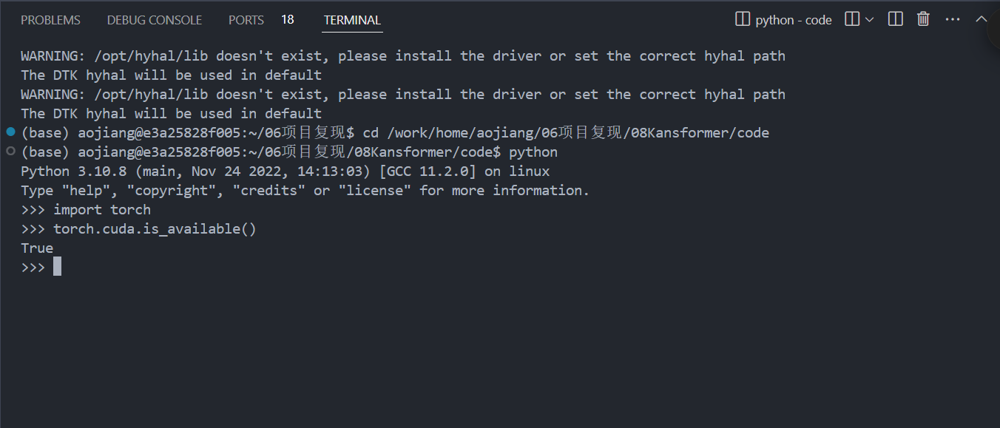
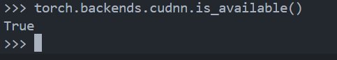

# 背景介绍
我对cuda并不了解，在我的理解中，它是一个关于加速GPU计算的python库，有了它，可以将模型或张量从CPU转移到GPU上执行，从而使模型的训练速度加快。（我的这个理解肤浅的，但无伤大雅）例如：

```python

import torch

# 将模型移到GPU上
device = torch.device("cuda" if torch.cuda.is_available() else "cpu")
model = MyModel().to(device)

# 将数据移到GPU上
input = input.to(device)
output = model(input)
```

正确且准确的理解应如下：

> CUDA是NVIDIA的通用计算平台，提供了在GPU上进行并行计算的基础架构，而cuDNN是一个专门用于深度学习的加速库，依赖于CUDA来执行高效的深度学习计算。两者协同工作，使得深度学习模型的训练和推理可以充分利用GPU的计算能力，从而显著提升性能。

## 代码理解
根据您发送的图片，您的代码内容为：
```python
def set_seed(seed):  # 定义一个函数，用于设置随机数种子
    random.seed(seed)  # 为Python的随机模块设置随机数种子，保证随机数生成的可重复性
    np.random.seed(seed)  # 为NumPy库设置随机数种子，保证NumPy生成的随机数的可重复性
    torch.manual_seed(seed)  # 为PyTorch的CPU部分设置随机数种子，保证CPU上的随机数生成的可重复性

    if torch.cuda.is_available():  # 如果CUDA可用，意味着有可用的NVIDIA GPU
        torch.cuda.manual_seed_all(seed)  # 为所有可用的GPU设置随机数种子，保证GPU上的随机数生成的可重复性

    torch.backends.cudnn.deterministic = False  # 设置cuDNN的deterministic模式为False，允许一些不确定的操作，这通常可以提高训练速度
    torch.backends.cudnn.benchmark = True  # 启用cuDNN的benchmark模式，这会根据模型的输入大小自动寻找最佳的卷积算法，从而加速计算
```

根据您的代码可知，您将在if语句中判断cuda是否可用，如果可用，将执行下一行代码，如果不可用，将执行其他代码或者跳过当前代码，根据您的代码显示，如果cuda不可用，将会跳过当前代码.您可以按照下面的代码修改您的代码以便判断您在训练时是否使用了cuda，这里我仅仅举个例子：

```python
def set_seed(seed):
    random.seed(seed)
    np.random.seed(seed)
    torch.manual_seed(seed)

    if torch.cuda.is_available():
        torch.cuda.manual_seed_all(seed)
        torch.backends.cudnn.deterministic = False
        torch.backends.cudnn.benchmark = True
    else:
        print("CUDA is not available. Using CPU instead.")
        # 可以在这里添加更多与CPU相关的配置
```
## 需求描述
当然，我猜测您最关心的问题有以下两个：
第一，在您更新显卡驱动后，是否需要重装CUDA和cuDNN？
第二，显卡驱动更新后，您的模型训练速度下降了，这是什么原因造成的？应该如何解决？
## 问题解答与建议
接下来，我将提供我个人的观点和建议：

第一，更新显卡驱动后不需要重装CUDA，除非遇到兼容性问题。
可以通过以下命令来检查CUDA是否正常运行：

```bash
nvcc --version
```

```bash
nvidia-smi
```
当然，您也可以参考您的代码，在终端中依次输入下面的命令：

```bash
python
>>> import torch
>>> torch.cuda.is_available()
```

如果cuda可用，运行结果应如下图所示：



您可以使用 `torch.backends.cudnn.is_available()` 来查看 cuDNN 是否可用：

```bash
>>> torch.backends.cudnn.is_available()
```
如果cuDNN可用，运行结果应如下图所示：



第二，如果您确认CUDA和cuDNN可以正常运行，但模型训练速度依然相比显卡驱动更新前是下降的，您可以寻找专业的人员进行咨询，我爱莫能助。
## 免责声明
免责声明：以上观点和建议仅代表我个人，如果您按照我的建议进行操作，出现任何问题与本人无关。


