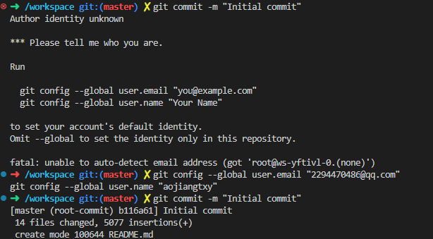
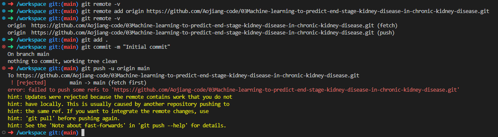

从你的描述来看，你在执行 `git remote add origin [仓库地址]` 时可能出现了问题。让我来帮你逐步解决。

### 1. 检查当前的远程仓库配置
在继续之前，我们先检查一下当前的远程仓库配置是否正确。

在终端中输入以下命令：
```bash
git remote -v
```
这个命令会列出所有已配置的远程仓库地址。如果你之前尝试添加了远程仓库地址，但没有成功，这里可能会显示错误的地址或者没有显示任何内容。

### 2. 添加正确的远程仓库地址
如果你没有看到任何远程仓库地址，或者看到的地址是错误的，你需要添加正确的远程仓库地址。

假设你的GitHub仓库地址是 `https://github.com/your-username/your-repo-name.git`，你可以使用以下命令添加远程仓库地址：
```bash
git remote add origin https://github.com/your-username/your-repo-name.git
```
如果你之前已经添加了错误的地址，可以先删除它，再重新添加：
```bash
git remote remove origin
git remote add origin https://github.com/your-username/your-repo-name.git
```

### 3. 检查是否添加成功
再次运行以下命令，确认远程仓库地址是否正确添加：
```bash
git remote -v
```
你应该会看到类似以下的输出：
```
origin  https://github.com/your-username/your-repo-name.git (fetch)
origin  https://github.com/your-username/your-repo-name.git (push)
```

### 4. 提交并推送代码
接下来，你需要将本地的代码提交到远程仓库。

#### （1）添加文件到暂存区
```bash
git add .
```

#### （2）提交暂存区到本地仓库
```bash
git commit -m "Initial commit"
```

#### （3）推送到远程仓库
```bash
git push -u origin master
```
如果你的默认分支名称是 `main`，请将 `master` 替换为 `main`：
```bash
git push -u origin main
```

### 5. 处理可能的错误
在推送过程中，可能会遇到一些错误，比如权限问题或分支名称不匹配等。以下是一些常见问题的解决方法：

#### （1）权限问题
如果你看到类似以下的错误：
```
remote: Permission to your-username/your-repo-name.git denied to your-username.
fatal: unable to access 'https://github.com/your-username/your-repo-name.git/': The requested URL returned error: 403
```
这通常是因为你的GitHub账号没有正确配置。你可以尝试以下方法：
- 确保你的GitHub账号有权限访问该仓库。
- 如果你使用的是SSH方式连接GitHub，检查SSH密钥是否正确配置。

#### （2）分支名称不匹配
如果你看到类似以下的错误：
```
fatal: The current branch master has no upstream branch.
To push the current branch and set the remote as upstream, use

    git push --set-upstream origin master
```
这说明你的本地分支名称和远程仓库的默认分支名称不匹配。你可以使用以下命令解决：
```bash
git push --set-upstream origin master
```
或者，如果你的远程仓库默认分支是 `main`，使用：
```bash
git push --set-upstream origin main
```

### 6. 检查GitHub仓库
完成推送后，打开你的GitHub仓库页面，刷新页面，确认代码已经成功上传。

如果还有其他问题，可以告诉我，我会继续帮你解决！


## 报错：身份识别



git config --global user.email "2294470486@qq.com"
git config --global user.name "aojiangtxy"


## 切换分支到main上

从你的描述来看，你遇到了两个问题：

1. **密码认证已废弃**：GitHub 已经不再支持使用密码进行 Git 操作，你需要使用其他认证方式。
2. **分支名称不匹配**：你尝试推送 `main` 分支，但本地分支名称是 `master`，导致推送失败。

以下是解决这两个问题的详细步骤：

### 1. 解决密码认证问题
GitHub 现在推荐使用以下两种认证方式之一：
- **Personal Access Token（个人访问令牌）**
- **SSH 密钥**

#### **使用 Personal Access Token**
1. **生成 Personal Access Token**
   - 登录你的 GitHub 账号。
   - 点击右上角的头像，选择 **Settings**。
   - 在左侧菜单中选择 **Developer settings**。
   - 在左侧菜单中选择 **Personal access tokens**。
   - 点击 **Generate new token**。
   - 填写 Token 的描述，选择需要的权限（通常选择 `repo` 权限即可）。
   - 点击 **Generate token**，复制生成的 Token。

2. **使用 Token 进行认证**
   - 在命令行中，当你运行 `git push` 时，Git 会提示你输入用户名和密码。
   - 用户名输入你的 GitHub 用户名。
   - 密码输入你刚刚生成的 Personal Access Token。

#### **使用 SSH 密钥**
1. **生成 SSH 密钥对**
   - 在终端中运行以下命令生成 SSH 密钥对：
     ```bash
     ssh-keygen -t rsa -b 4096 -C "your_email@example.com"
     ```
     替换 `your_email@example.com` 为你的 GitHub 邮箱地址。
   - 按提示操作，生成的公钥默认保存在 `~/.ssh/id_rsa.pub`。

2. **将公钥添加到 GitHub**
   - 打开 `~/.ssh/id_rsa.pub` 文件，复制公钥内容。
   - 登录你的 GitHub 账号。
   - 点击右上角的头像，选择 **Settings**。
   - 在左侧菜单中选择 **SSH and GPG keys**。
   - 点击 **New SSH key**，粘贴公钥内容，填写标题，点击 **Add SSH key**。

3. **测试 SSH 连接**
   - 在终端中运行以下命令测试连接：
     ```bash
     ssh -T git@github.com
     ```
   - 如果连接成功，你会看到类似以下的提示：
     ```
     Hi username! You've successfully authenticated, but GitHub does not provide shell access.
     ```

### 2. 解决分支名称不匹配问题
你的本地分支是 `master`，而远程仓库的默认分支是 `main`。你需要将本地分支名称改为 `main`，或者将 `master` 分支推送到远程的 `main` 分支。

#### **将本地分支名称改为 `main`**
1. **切换到 `master` 分支**（如果尚未在该分支）：
   ```bash
   git checkout master
   ```
2. **重命名本地分支为 `main`**：
   ```bash
   git branch -m main
   ```
3. **推送本地分支到远程仓库**：
   ```bash
   git push -u origin main
   ```

#### **将 `master` 分支推送到远程的 `main` 分支**
如果你不想更改本地分支名称，可以直接推送 `master` 分支到远程的 `main` 分支：
```bash
git push -u origin master:main
```

### 总结
1. **解决认证问题**：
   - 使用 Personal Access Token 或 SSH 密钥进行认证。
2. **解决分支名称问题**：
   - 将本地分支名称改为 `main`，或者将 `master` 分支推送到远程的 `main` 分支。

按照上述步骤操作后，你应该能够成功推送代码到远程仓库。如果还有其他问题，欢迎随时提问！


## 报错：仓库中内容不匹配



从你的操作和输出来看，你在尝试将本地代码推送到远程仓库时遇到了问题。具体来说，远程仓库中已经存在一些内容，而你的本地仓库没有这些内容，导致推送被拒绝。以下是解决这个问题的步骤：

### 1. **检查本地和远程仓库的状态**
首先，确认你的本地仓库是否确实有新的更改需要推送。运行以下命令：
```bash
git status
```
如果输出显示 `nothing to commit, working tree clean`，说明本地没有新的更改。

### 2. **拉取远程仓库的最新内容**
由于远程仓库中已经有一些内容，你需要先将这些内容拉取到本地仓库。运行以下命令：
```bash
git pull origin main
```
这会将远程仓库的最新内容合并到你的本地 `main` 分支。

### 3. **解决冲突（如果有）**
如果拉取过程中出现冲突，Git 会提示你解决冲突。冲突通常发生在多个分支对同一文件进行了不同的更改。解决冲突的步骤如下：
1. 打开冲突的文件，找到标记为冲突的部分（通常用 `<<<<<<<`、`=======` 和 `>>>>>>>` 标记）。
2. 手动编辑文件，保留你希望保留的内容。
3. 保存文件后，运行以下命令标记冲突已解决：
   ```bash
   git add <文件名>
   ```
4. 提交更改：
   ```bash
   git commit -m "Resolve conflicts"
   ```

### 4. **推送更改到远程仓库**
解决冲突后，再次尝试推送更改：
```bash
git push -u origin main
```

### 5. **如果远程仓库是空的，但本地仓库没有更改**
如果你确认远程仓库是空的，而本地仓库也没有新的更改，可能是你在本地仓库中没有正确初始化或添加文件。你可以尝试以下步骤：
1. **检查远程仓库是否为空**：
   - 在浏览器中打开远程仓库的 URL，确认仓库是否为空。
2. **在本地仓库中添加文件**：
   - 如果本地仓库确实没有文件，你可以创建一个示例文件：
     ```bash
     echo "Hello, World!" > README.md
     ```
   - 添加并提交文件：
     ```bash
     git add README.md
     git commit -m "Initial commit"
     ```
   - 再次推送：
     ```bash
     git push -u origin main
     ```

### 6. **强制推送（谨慎使用）**
如果你确定远程仓库的内容是错误的，或者你希望覆盖远程仓库的内容，可以使用强制推送。但请注意，这会覆盖远程仓库的所有内容，可能会导致数据丢失：
```bash
git push -u origin main --force
```
**注意**：只有在你完全确定远程仓库的内容可以被覆盖时，才使用强制推送。

### 总结
1. **拉取远程仓库的最新内容**：`git pull origin main`
2. **解决冲突（如果有）**。
3. **推送更改到远程仓库**：`git push -u origin main`
4. **如果远程仓库为空，确保本地仓库有文件并提交**。

按照上述步骤操作后，你应该能够成功推送代码到远程仓库。如果还有其他问题，欢迎随时提问！